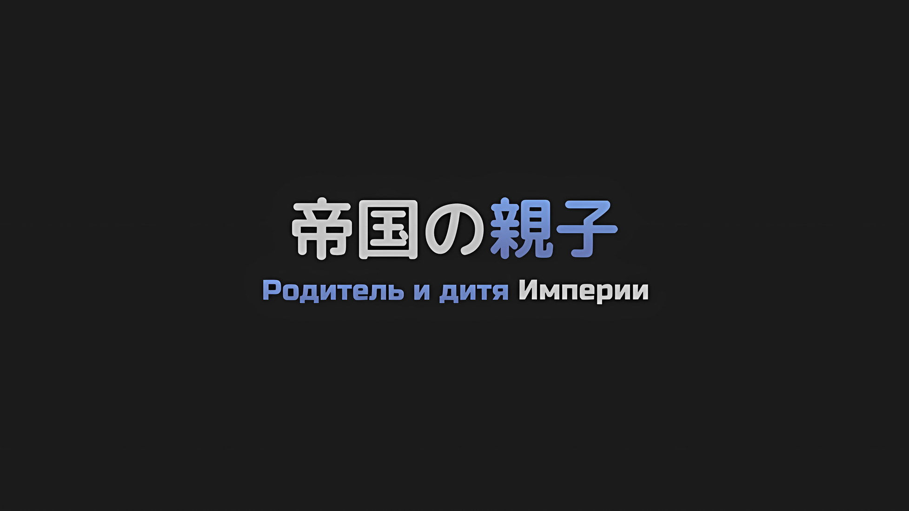
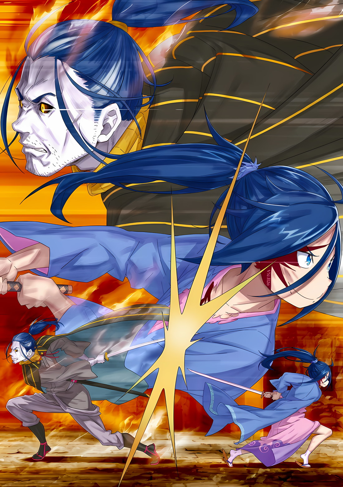
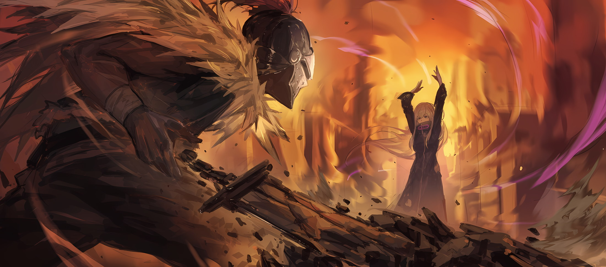
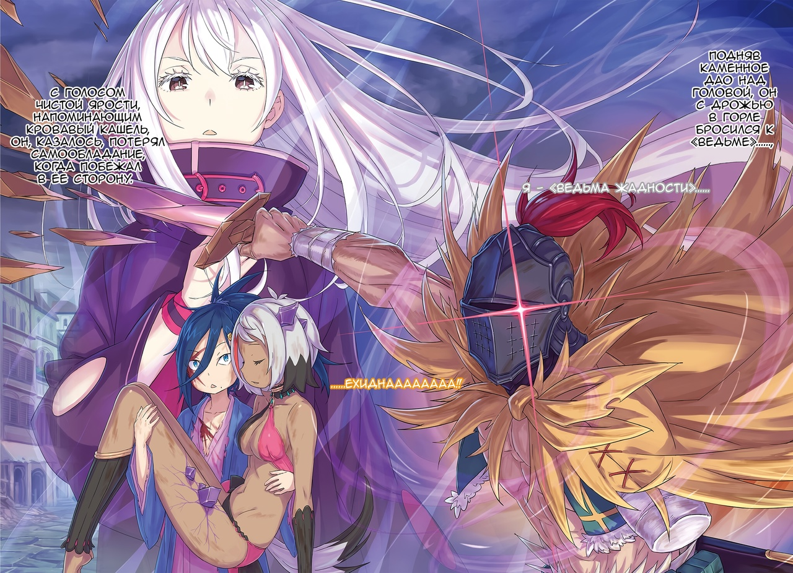

*※※※※※※※※※※※*

…Роуэн Сегмунт совершенно не годился на роль отца.

И хотя его сын, Сесилус Сегмунт, считал, что так называемая обычная чуткость ведущему актеру не нужна, было очевидно, что Роуэн — отец, довольно далекий от общепринятого семейного образа.

Идеальный отец не стал бы лишать жизни собственного ребенка, просто потому что он «не похож» на того, кто вырастет воплощением его желаний.

Несгибаемая эксцентричность, отрешенная от всех понятий отцовской любви. В этом и состояла причина, по которой Роуэн прикончил всех старших братьев Сесилуса с младых ногтей.

Мечник, таящий в своем сердце полное безумие, не гнушавшийся растоптать все, что только встанет на пути, дабы достичь заветного «Небесного Меча»… вот каким был Роуэн Сегмунт, ни больше ни меньше.

Роуэн, по всем вероятиям, слыл самым что ни на есть худшим отцом, каких еще не видал мир. Сесилус не был окружен нужным вниманием, семейной любовью — чувствами столь фундаментальными, но все равно от всего сердца он считал себя счастливчиком.

…Жажда Роуэна заполучить «Небесного Меча» — Сесилус питал то же самое.

И это стремление тянулось в далекие дали, в невидимую глазом заоблачную высь; люди, что отводят взгляд, люди, что идут в обход — все мимо, такие его не достигнут.

Если бы он вырос в уважаемой веками, знатной для всех семье или же в семье честных нищих, кои не прибегнут к воровству ради пропитания, то у Сесилуса не стало бы сколь-нибудь веских доказательств отсутствия помех на пути к «Небесному Меча».

Посему им стал Роуэн Сегмунт.

Пресекая все кровные связи, ведь служить они могли лишь оковами, устраняя любые помехи, он, с железной решимостью и без малейшего колебания в своем стремлении овладеть мечом, готовил испытание за испытанием. Жизнь же собственного сына он поставил на второй план.

То чистейшей воды безумие со ставкой на меч, безо всяких прикрас, Роуэн безудержно вливал в Сесилуса.

И вот, Сесилус призадумался.

…Как и ожидалось, он, сын Роуэна, определенно такой же.

*△▼△▼△▼△*

Выхваченный из ножен снов, «Меч Грез» пронесся по небу реальности.

Его острие рассекло взрыв света, что сулил погибель всему вокруг, и следом настигло прекрасную деву, лившую кровавые слезы. Один из ее глаз горел голубым пламенем.

От немыслимого порыва клинка стройное тело девы… Аракии разделилось на две части; нет, ничего подобного не случилось.

А все потому, что даже последствия взмаха Зачарованного Меча, выкованного не из мира сего, здравому смыслу не поддавались.

…«Каменная Глыба», Муспель.

Один из Четырех Великих, именно он, Великий Дух, питал обширные земли Империи.

Интуитивно Сесилус понимал, что то, что он изгнал «Мечом Грез» Масаюме, было одновременно и Аракией, и не Аракией. Некое чужеродное присутствие закрасило само ее существо; Сесилус не мог определить его истинную природу.

Впрочем, даже если б он знал, действия и решимость Сесилуса ничуть бы не изменились.

Даже если б он понимал, что обширные земли Империи умрут вместе с Великим Духом, Сесилус все равно неизбежно достал бы «Меч Грез».

Естественно, ведущий актер отдаст приоритет героине, а не землям Империи.

Начнем с того, что, когда речь заходила о сценарии, действия, предпринимаемые Сесилусом с уверенностью, никогда не приводили к плохому финалу.

Поэтому…,

Аракия: …

Не в силах выдержать силу, которую она в себя вобрала, Аракия оказалась на грани того, чтобы разорваться на части.

На глазах Сесилуса, что изгнал «Мечом Грез» угрожавшую ее жизни гигантскую силу, бесчисленные ленты света вокруг Аракии превратились в ослепительные крупинки и растаяли в обагровевшей столице Империи.

Когда Аракия медленно повалилась среди этих танцующих крупиц света, Сесилус убрал «Меч Грез» в ножны, которые, как во сне, внезапно появились на его поясе, и протянул к ней руки.

Раны покрывали все его тело. Его кровавое кимоно, с порезами повсюду, было изорвано и потрепано; теперь его нельзя было назвать одеждой для поединка.

Однако, вопреки этому жалкому виду, свет в глазах Сесилуса, когда он поймал Аракию, ничуть не потускнел.

Сесилус: …

Без сознания, с закрытыми глазами, с лицом сонным, совсем как мертвец.

Судя по ощущениям в руках, она не умерла, потому он не беспокоился. Со спокойствием он пожал плечами и сказал: «Блин».

Сесилус: А ты умеешь вызвать ажиотаж, Аня.

Средь слабых воспоминаний, что ожили в разгар битвы, большую часть занимал вечерний разговор с другом, который уменьшил Сесилуса До в Сесилуса После. Однако, если исключить эту часть, то больше всего в его памяти запечатлелась эта девушка.

Сесилус для других, да и для себя тоже, слыл человеком, что не заботится о других. Раз уж он думал только о себе, то для него не было большего наказания, чем она.

Пожалуй, не будет преувеличением сказать, что она — самая большая проблема во всей Империи.

???: …Теперь, думаю, с этими делами покончено?

Позади Сесилуса, когда он держал Аракию, раздался голос, в котором чувствовалось легкое напряжение.

К нему приближался, шажками подчеркивая свою осторожность, такой же избитый после битвы, как и Сесилус, Ал.

Он не только выжил, не став угольком на краю решающей битвы за бастион, но и сыграл важную роль второго плана, когда под конец бросил свое оружие для Сесилуса, что явно послужило его моментом славы.

Сесилус: Ты мастерски выступил, Ал-сан. Думаю, то, что ты понял мои намерения и бросил свое оружие, достойно большого количества поинтов*.

* Points — очки.

Ал: Поинтов чего, типа, благосклонности к тебе? В таком случае, мне начхать.

Опустив плечи в манере «я-сыт-этим-по-горло», Ал посмотрел в сторону Аракии и сказал: «Что важнее…». Даже сквозь железный шлем его взгляд был полон беспокойства, что выдавал его нервозность и страх, однако,

Ал: Мисс Аракия…

Сесилус: Жива. В конце концов, для развязки, в которой она не умрет, я пустился во все тяжкие и разорвал свои пределы во второй, а затем и в третий раз. Убить ее было бы возмутительно! Таков стиль Сесилуса Сегмунта — соответствовать ожиданиям и предавать безвкусные прогнозы.

Ал: …Если ты за то, чтобы не убивать ее, то я не буду настаивать.

С этим ответом Сесилус надул грудь, на что Ал вздохнул и принялся возиться с металлическими креплениями своего шлема.

Конечно, Сесилус понимал опасения Ала. Вопрос заключался в том, стоит ли рисковать, оставляя в живых Аракию, в ущерб чувству безопасности, которое пришло бы вместе с ее убийством.

Однако…,

Сесилус: Если это настолько сложная и неинтересная дискуссия, не постесняйся обсудить ее с каким-нибудь хмурым мудрецом в месте, где меня нет. Мой ответ будет таким, каким ты его видишь, Ал-сан.

Ал: …С самого начала я уже знал, что любые уговоры или споры с тобой — это комбо из трех ударов: неразумности, невозможности и необдуманности. Тебе придется отвечать за маленькую мисс.

Сесилус: Очевидно, я так и хотел. Кажется, с момента моей первой победы над Аней я собирался взвалить на себя эту заботу.

С легким сердцем, будто он говорит не о своих делах, а о чужих, Сесилус взглянул на Аракию. Ее спящее лицо в его объятиях приобрело более молодой вид.

Как и в случае с другом, с которым он расстался под лучами вечернего солнца, это была иллюзия, видимая ему лишь потому, что они были давно знакомы. Возможно, ему следовало бы побольше потрудиться и разобраться с воспоминаниями, которые он так старался вытащить из памяти.

Сесилус: Но, похоже, прежде чем я смогу окунуться в этот эпизод, мне нужно выполнить кое-какой долг.

Ал: А?

От удивления Ал повысил голос. Но Сесилус не стал отвечать словами, а лишь перевел взгляд в другую сторону.

После битвы с Аракией все здания и улицы расплавились, в результате чего столица Империи превратилась в красное адское месиво… Среди этой сцены возникло зловещее безумие некой фигуры.

Зловещая фигура: …

С непотухающим пламенем, охватившим все его тело, стоял синеволосый мужчина.

Кожа его была выжжена до черноты, что скрывало одну из его черт, однако же по пылающему блеску золотых глаз каждый бы понял, что он — нежить.

И тут перед Сесилусом открылся факт, превосходящий все остальные.

Сесилус: Ну и ну, а я-то думал, кто сюда так яростно мчится, а тут такое огненное шоу! Хм, раз уж я так сказал, не пафосная ли это постановочка?

Он бежал не бездумно, а с четкой целью.

А то, что его торопливые шаги тут же прекратились, объяснялось тем, что он ее достиг… да, его цель это Сесилус Сегмунт.

…Мечник, пренебрегающий всем остальным и нацелившийся на «Небесного Меча», Роуэн Сегмунт.

В конечном счете отбросив даже собственную жизнь, его отец прибыл сюда в совершенно незнакомом виде, чему Сесилус многократно кивнул и улыбнулся.

Все его тело пылало, но Роуэн ухмылялся. Вся его одежда была в крови, но Сесилус улыбался.

Родитель и дитя, для коих не существовало ничего, кроме жизни и смерти от меча, ухмылялись и улыбались…,

Сесилус: Из-за тебя я только что впервые об этом призадумался, пап. …Мне это не противно, скорее даже нравится.

С этими словами, по иронии судьбы забыв о Сесилусе После, он торжествовал, что шанс выполнить обещание, данное Сесилусом До, наконец-то представился.

*△▼△▼△▼△*

…Роуэн Сегмунт жаждал заполучить «Небесного Меча».

Почему? По какой причине? Для какой цели?

Ему уже осточертели все эти нудные вопросы. Вся эта чепуха не имела к Роуэну никакого отношения.

Толчок к появлению этой жажды лежал за пределами его самых ранних воспоминаний, ее истоки были унесены в русло забвения.

С того самого момента, как он впервые коснулся пальцами стали меча, для Роуэна Сегмунта не оставалось другого пути, кроме как овладеть им.

Получив заповедь «Звездочета» и обзаведясь сыном, который должен был стать сосудом для достижения «Небесного Меча», Роуэн продолжал упорно учиться, дабы самому достичь заветной цели.

Воспользовавшись даже тем, что его главный враг в достижении «Небесного Меча» появился на свет его собственными руками, он посвятил себя прилежной, усердной, старательной, кропотливой учебе…,

Роуэн: Аааах… время для моего великого момента, наконец, пришло.

Душа его пылала, жизнь превращалась в пепел, даже сама судьба стояла на пороге своего финала.

Пламя сжигало все, и в тот момент, когда личность Роуэна расплывалась в царстве после смерти, он вошел в область, куда не ступала нога ни живого, ни мертвого… в промежуток между жизнью и смертью, в точку, которую следует назвать потусторонним миром.

Это было равносильно раскрытию самой природы, истинной сути жизни и души.

Еще несколько секунд, какими бы реальными они ни были, и окончательное значение существования Роуэна Сегмунта будет исчерпано.

Роуэн: …

Каждый раз, когда его тело распадалось, он доставал свою любимую катану, что всегда воскресала вместе с ним, и смотрел вперед.

Маленькая фигурка, видневшаяся за полыхающим огнем, приняла точно такую же стойку, как и он…,

Роуэн: …А теперь давай устроим…

Сесилус: ЧЕСТНУЮ ДУЭЛЬ!!!

…За «Небесного Меча» яркой эфемерной вспышкой вспыхнул Роуэн Сегмунт.

*△▼△▼△▼△*

Сесилус: Я доверяю Аню тебе.

На остатках улицы, которую уже нельзя было назвать дорожной, по призыву Роуэна, что появился весь в огне, Сесилус насильно взвалил Аракию на Ала.

Сесилус услышал, как недоуменный голос Ала от неожиданности прошелестел «Ой-ой!?», но он отбросил это в пучину своего сознания и полностью сосредоточился на одном-единственном человеке.

Цвет, звук и запах снова исчезли из мира Сесилуса, в нем царило только сердцебиение стали.

*Роуэн: «…А теперь давай устроим…»*

Держа руку на катане у пояса, Роуэн зашевелил губами, полный готовности.

Даже если он не мог услышать это в виде звука, чувства между родителем и дитя, которые любили вычурные притворства, позволили ему воспринять это внутри своей души.

Поэтому Сесилус откликнулся на это с величием.

Сесилус: ЧЕСТНУЮ ДУЭЛЬ!!!

В одно мгновение разделявшее их расстояние исчезло.

Для битвы Сесилуса, «Синей Молнии», коим он и являлся, в этом не было ничего удивительного, однако такое воплотил не только Сесилус, что доказывало — Роуэн перешагнул границы человеческих возможностей.

Сесилус: Обалдеть!

Искреннее восхищение.

Несколько часов назад, на момент расставания с еще живым Роуэном, его отец, насколько мог судить Сесилус, не достигал таких высот. Однако теперь, когда они воссоединились, мастерство Роуэна-нежити стремительно развивалось, его таланты посмертно расцветали.

Речь шла не о скорости и не о мастерстве, а о преображении, продиктованном изменениями в его сознании.

Влияние образа мышления на результаты не было чем-то из ряда вон выходящим, однако, даже так, вырвавшись из ментальной скорлупы, человек не сможет кардинально улучшить свои физические способности. Таким образом, преображение Роуэна не носило физический характер.

…Роуэн стал способен на «один шаг» вперед.

Этот шаг, отнюдь не физический, было трудно описать языком простых чувств. Как между любителями и экспертами был огромный разрыв, так и между экспертами первого и второго класса существовала пропасть.

Таким образом, между первым и сверхпервым классом, а также между ними и трансцендентными существами, которые были еще выше, существовало еще больше пропастей.

Сесилус намеренно выразил это фразой «один шаг» — шаг, невидимый глазу, шаг, необъяснимый словами. Он понял, что Роуэн переступил эту границу.

Подумать только, через смерть он преодолел ту разницу в один шаг, которую так и не перешагнул за всю свою жизнь.

Всяк человек наверняка бы сказал, как это глупо, как невероятно иронично. И лишь Сесилус…,

Сесилус: Мне это не противно, скорее даже нравится.

На теле его бушевало жестокое пламя, а сама жизнь испепелялась, потому Роуэн, с головой окунувшись в царство смерти, сделал взмах мечом; лезвие нежити заиграло в мире без цвета и света, — с невероятным восхищением Сесилус внимал происходящему.

Не проступало ни одного лишнего движения, блеск клинка отражал усердные тренировки и прилежное обучение; его глаза мерцали всему этому.

Как отец, Роуэн, пожалуй, худший из худших, и Сесилус не стал бы этого отрицать, однако ему очень нравился подход своего отца — он всегда отдавал всю свою душу роли, которую играл.

Роуэн: …

Используя в качестве топлива то немногое, что осталось от его жизни, Роуэн нанес свой самый сильный удар мечом из всех, что он делал как при жизни, так и после смерти.

Этот отточенный до бритвенной остроты удар был пронизан такой фехтовальной аурой, что даже Сесилус вообразил себе смерть. …Однако такой кошмарный финал, основой которого стала сосредоточенность, «Меч Грез» Масаюме не допустит.

«Меч Дьявола» Мурасаме представлял собой Зачарованный Меч, способный разрубить саму суть чего угодно.

И, в отличие от него, «Меч Грез» Масаюме, использующий сны в качестве ножен, мог…,

Сесилус: …Грезы пожирают — грезы осуществляются.

Взамен на мотивацию человека, желающего исполнения своего желания, Зачарованный Меч обретал силу, способную это желание исполнить.

Потому «Меч Грез» и прозвали «Мечтой на Яву» — благодаря нему мечты становились реальностью; даже если бы он превратился в тупой, бесполезный клинок, его бы продолжали превозносить как Зачарованный Меч, который в силах разрубить на две части сам мир.

Клинок долгие месяцы и даже годы переходил от человека к человеку, ведь в качестве компенсации за исполнение желания владельцы забывали о причине, по которой так жаждали его получить; и вот теперь, после стольких владельцев, «Меч Грез» обосновался в руке Сесилуса.

И для Сесилуса, и для «Меча Грез» это было чудесным стечением обстоятельств.

Ибо…,

Сесилус: Моим мечтам, моей мотивации — им нет предела!

Именно по этой причине Сесилус Сегмунт оставался хозяином «Меча Грез».

Необычайная тяга к мечтам раскроет потенциал «Меча Грез» Масаюме на максимум.

В тот же миг разящий удар размыл границу между сном и явью.

Сесилус: …

По сравнению с решающей битвой на бастионе между Сесилусом и Аракией, что случилась чуть раньше, эта схватка шла слишком тихо.

Влияние на столицу, Империю, да и на все вокруг было незначительным; поединок один на один с нежитью, которая исчезла бы в любом случае, мог быть только пустяком.

Однако для дуэта родителя и дитя, Роуэна Сегмунта и Сесилуса Сегмунта, это было важно.

Роуэн: …О горе, за что мне такой непутевый сын.

Как только их клинки скрестились, родитель и дитя оказались обращены друг к другу спиной.

Его отец, чье лицо он больше никогда не увидит, с неприязнью выдохнул, а затем,

Роуэн: Мне следовало прирезать тебя еще тогда, когда ты отмокал в своей первой ванне.

Сесилус: Пхахахаха! Да, да, это точно! Только так бы ты и победил, пап.

Сесилус разразился громким хохотом над неудачником, который повел себя по-настоящему бесчестно.

Услышав безудержный смех Сесилуса, Роуэн посмотрел на небо — его катана потеряла свою форму и превратилась в пыль. И вот, когда его существование стало улетучиваться от горящих кончиков пальцев, он сузил свои золотые глаза.

И тогда…,

Роуэн: В следующий раз, в следующий. …Я не из тех, кто сдается из-за смерти.

До самого конца, не оставив после себя ни единого слова, которое бы подобало отцу, его тело, его душа истлели.

Даже в смерти он стремился к «Небесному Меча» — таковы были последние минуты зловещего мечника, известного как Роуэн Сегмунт.

*△▼△▼△▼△*

*Ргххх, как обидно, как же обидно,* подумал Роуэн. Он исчезал.

Всю свою жизнь он без остановки шел к цели, но в итоге так и не смог достичь «Небесного Меча».

Последняя искорка его испепеленной души не осветила ему путь к вершине меча. *Как плохо, как же плохо.*

При таком раскладе Сесилус, скорее всего, достигнет «Небесного Меча».

Подумать только, его сын, да еще и вместо него — вот уж поистине жестокое решение Бога Меча. Огорчение и отчаяние, уныние и сетования — если бы он взялся говорить, то вряд ли бы смог избавиться от нескончаемых негативных мыслей.

Как бы то ни было…,

Роуэн: Что ж, думаю, это лучше, чем если бы до него добрался кто-то другой.

Если бы Роуэн превзошел Сесилуса в финальной дуэли, смог бы он достичь «Небесного Меча»?

Но он не превзошел его. В конце концов, бессмысленно думать о несбывшихся гипотезах. Роуэн не желал думать о бессмысленном. Особенно когда он уже встречал свой конец.

Он не должен делать того, чего не нужно, поэтому, в попытке думать о другом, Роуэн пришел к пониманию.

С тех самых пор, как он осознал свое окружение, Роуэн стремился к «Небесному Меча»; в каждый момент бодрствования, в каждый момент сна он мечтал лишь о том, чтобы достичь «Небесного Меча»; так он жил до сих пор.

И вот, когда Роуэн осознал, что так и не достигнет «Небесного Меча», думать ему больше было не о чем.

Роуэн: Хм.

Впервые с того момента, как он начал жаждать «Небесного Меча», Роуэн отбросил его.

Из-за этого он столкнулся скорее с чувством потери, чем с чувством свободы, а еще там присутствовал некий дискомфорт. Средь чувств своих, когда ему стало не по себе, Роуэн впервые в жизни подумал вот о чем.

*…Может ли пламя моей души, на раскрытие которого я потратил всю свою жизнь, стать хотя бы огоньком свечи, что осветит путь моему сыну?* Так он подумал.

*△▼△▼△▼△*

Он оставил после себя лишь пепел и пыль. Роуэн Сегмунт погас.

В глубине души Сесилус Сегмунт понимал, что это означает, что его отец умер.

Когда жизнь Роуэна была на грани сгорания, Сесилус разрубил его на две части. Его отец встретил свой конец уже в качестве нежити.

Сесилус: Ал-сан, прости, что так внезапно отдал тебе Аню. Должно быть, нелегко нести кого-то, когда у тебя одна рука, так что заберу-ка я ее обратно.

Вернув Масаюме в ножны, с чувством выполненного долга Сесилус обернулся и обратился к Алу.

Однако Ал никак не отреагировал на этот зов. Стоя на одном колене и поддерживая тело Аракии одной рукой, он слабо покачивал головой из стороны в сторону,

Ал: Почему… ты так спокоен?

Сесилус: В плане?

Ал: Ты знаешь, о чем я! Это же только что был твой отец, да?! Когда вы виделись в последний раз, он был еще жив, а теперь он умер и стал пешкой врага…!

Сесилус: Стоп-стоп-стоп, Ал-сан. Ты малость ошибаешься, поэтому, прошу, позволь мне тебя исправить. Мой папа, конечно, стал мертвецом, но пешкой точно нет. И папа напал на меня вовсе не из-за того, что лишился рассудка.

Ал: Что…

Сесилус: А, кстати, я сказал «рассудок» в общепринятом значении этого слова, но, наверное, мой папа достаточно далеко от него ушел. В этом вопросе сомнений нет, однако…

Махнув рукой, Сесилус добавил эту часть о душевном состоянии Роуэна.

Другими словами, Сесилус хотел прояснить недопонимание Ала, что Роуэн напал на него не потому, что его разум оказался поврежден после превращения в нежить.

Сесилус: Убийство ребенком своего родителя также было одним из главных событий в пьесе «Гильотина Магриццы»… Но, опять же, то, что между мной и моим папой все сложилось именно так, было назначено судьбой уже довольно давно.

Ал: Назначено, судьбой…?

Сесилус: В общем, это было лишь вопросом времени — и оно наконец настало.

И Сесилус, и Роуэн знали, что этот финал рано или поздно настанет.

Поэтому, когда Роуэн вернулся мертвецом, хотя расстались они еще когда он был жив, Сесилус не очень удивился. Для Роуэна все, кроме достижения «Небесного Меча», было мелочью, поэтому вполне понятно, что при необходимости он пожертвует собственной жизнью, как нечто естественное.

Никто не поймет Роуэна. …Никто, кроме Сесилуса.

Его отец, который лучше всех умел подавать дурной пример, не был непостижимым монстром. Это было достаточным доказательством того, что у Сегмунтов сложились здоровые отношения между родителем и ребенком, даже если они были нетипичными.

Сесилус: Большинство людей наверняка не одобрили бы отношения между мной и моим папой, но…

В отличие от Роуэна, Сесилус не считал все на свете мелочами. Пока человек умел правильно отличать радость от посторонних помех, мир, насколько хватало глаз, был полон благ.

Солнечный свет, прохладный ветерок, стук капель дождя, аромат травы и Роуэн Сегмунт… все это было благословением, дарованным Сесилусу.

Сесилус: Папа называл меня непутевым сыном, но я не думаю, что найдется еще один такой сын, как я. В конце концов, просто как мой папа, он добился огромного успеха — вот он я, на этом свете.

Конечно, это не утешило бы Роуэна, что так и не осуществил желание, к которому стремился всю свою жизнь.

Когда Сесилуса называли непутевым сыном, у него не было места для оправданий. Впрочем, с самого начала он не собирался вести жизнь, требующую оправданий.

Ал: …

Подойдя к потерявшему дар речи Алу, Сесилус сложил руки и наклонил голову.

Оставалось решить, что делать с Аракией. Даже если он попытается отвести ее в безопасное место, есть ли в нынешней столице Империи место, где по-настоящему безопасно?

Есть ли безопасные места за пределами непосредственной близости от Сесилуса?

Сесилус: Конечно, было бы немного странно таскать Аню на себе, пока я бегаю… Но, если мы не вернемся в ближайшее время, Груви-сан наверняка громко на нас накричит. Он ушел, чтобы задержать заклинателя того проклятия, и, кстати говоря, как ты думаешь, Груви-сан не будет против, если мы вернемся с «Мечом Грез», а не с «Мечом Дьявола»?

С самого начала встреча с Аракией оказалась неожиданной.

Сесилус и Ал пришли сюда в поисках «Меча Дьявола» Мурасаме, который способен разрубать проклятия, и, к сожалению, не нашли его. К этому времени Груви должен был уже сразиться с создателем проблемного «Тернового Проклятия».

Сесилус: Как насчет этого, Ал-сан. Пока ты делаешь все возможное, чтобы нести Аню, я буду расчищать путь вперед — вот так сотрудничество…

Ал: …Нет, не пойдет.

Сесилус: Ал-сан?

На предложение Сесилуса Ал покачал головой и отказался. Встав с колена, он отдал Аракию обратно Сесилусу.

Тот рефлекторно взял ее на руки, а затем,

Ал: Я уже говорил об этом. Я должен кое-что сделать. Мисс Аракия была большим препятствием… Жаль Груви, однако.

Понизив тон голоса, Ал посмотрел сквозь стальной шлем на «Меч Грез» у пояса Сесилуса.

Ал: Даже я вижу, что катана на твоем поясе — безумно сильная штука. Она может отличаться от той, что хотел Груви, но постарайся сделать с ней все, что в твоих силах.

Сесилус: Значит, Ал-сан отправляется в самостоятельное плавание. Может, не мне это говорить, но будет ли Ал-сан в порядке, разгуливая один, да еще и без оружия? Разве напрасная смерть — это не все, что ты сможешь сделать?

Ал: …Я не умру напрасно. Никогда.

Сесилус: Да, похоже на то. Отчасти я тебя понял, вроде как.

Поскольку Ал говорил уверенно, Сесилус кивнул.

Все это время они работали вместе, отчего Сесилус пришел к выводу, что Ал обладает той же особой способностью, что и «Истинное Зрение» Шварца. С таким «Истинным Зрением», что видит все наперед, Ал точно не умрет напрасно.

Сесилус: Но ведь это не единственная причина, по которой Ал-сан пытается со мной распрощаться, я прав?

Ал: …

Сесилус: Похоже, тебе совсем не понравилось, как мы с папой все уладили. Возможно, Ал-сан имеет некоторые сомнения по поводу наших детско-родительских отношений?

Ал: …Это здесь ни при чем.

Даже если это и не имело отношения к делу, по тону Ала было ясно, что он стал нервным, поэтому Сесилус легонько пожал плечами и покрепче прижал Аракию к себе.

Сам Сесилус не хотел расставаться с Алом и оставлять его одного.

Частично это было связано с тем, что он считал, что будет проблематично держать Аракию на руках, но в большей степени это было из-за долга перед Алом… чтобы закончить дело, не дав Аракии погибнуть, Сесилус позаимствовал силу Ала.

Короче говоря, Сесилусу предстояло вернуть Алу долг.

Если Ал хотел кого-то спасти, то Сесилусу имело смысл ему в этом помочь.

В худшем варианте сценария он мог бы его вырубить и отнести обратно к Груви, а затем, полностью устранив проблему взмахом «Меча Грез», все отправились бы на встречу с «принцессой» Ала.

Это случилось в тот самый момент, когда он об этом подумал.

???: …Довольно неожиданно, вы не лишили ее жизни. Пересмотр: Требуется.

Внезапно голос третьего лица прервал разговор Ала и Сесилуса.

Они повернулись в его сторону. Сесилус слегка сузил глаза. …Обладатель голоса находился в воздухе, но не в прыжке, а в состоянии простого парения.

На мгновение, услышав знакомую манеру речи, Сесилус вспомнил о существовании «Ведьмы», которую он когда-то убил, но сейчас речь шла не о ней…,

Сесилус: …Нет, ты та же самая. Внешне ты выглядишь по-другому, но внутри та же самая… хм? Или, возможно, и внутри ты немного поменялась? Такое вообще возможно?

Ведьма: Если форма и природа души меняется, то внешность следует за ней. Обратное тоже верно, однако… по какому принципу ты сразу же это понял? Ответ: Требуется.

Сесилус: Хахахаха, ну теперь, когда ты об этом заговорила, я тоже удивлен, как я до этого додумался.

Просто так, без намерения спровоцировать ее поддразниванием, Сесилус улыбнулся.

Почему-то с первого взгляда он был уверен, что так оно и есть. Что девушка, парящая в воздухе над ним, с развевающимися белыми волосами, была той же самой «Ведьмой».

Сесилус: Но почему ты здесь? Неужели ты не усвоила урок, когда была убита мной в первый раз, и пришла за местью? Я нахожу привлекательным образ таких неуступчивых противников, однако…

Ведьма: Говоря простым языком, это выполнение моей цели. Я выполнила одну из двух своих главных целей. Как только я достигну оставшейся, по моей гипотезе, я смогу полностью погрузиться в первоначальную цель своего появления на свет.

Сесилус: Хо-хо, я понял, что ничего не понял!

Ведьма: А мне кажется, что я объяснила все кратко. Пояснение: Требуется.

Сесилус: Что ж, тогда как насчет того, чтобы я тоже дал простой, необычайно короткий и лаконичный с точки зрения меня самого ответ! …Если ты пришла туда, где я нахожусь, чтобы выполнить свою цель, то, скорее всего, ты ее не выполнишь.

Это был простой и понятный, чрезвычайно очевидный, четкий, не имеющий себе равных по легкости понимания ответ.

Услышав его, беловолосая «Ведьма» сузила глаза, обрамленные длинными ресницами, и кивнула.

И тогда…,

Ведьма: Ах, вот оно как? В таком случае мой ответ тоже прост: ты не сможешь меня убить.

Сесилус: …

Ведьма: Я изучила то, что способно убить меня в пределах этой Империи. Ни в коем случае я не подойду ни к одному из них. Отныне никто не сможет меня убить.

«Ведьма» безразличным тоном произнесла эти слова и подняла обе руки к небу.

В тот же миг он почувствовал странное ощущение, которое, казалось, исказило воздух и пространство вокруг «Ведьмы». Рядом с Сесилусом шаг вперед сделал Ал.

С момента ее появления он не сказал ни слова.

Ал посмотрел на «Ведьму», от которой по-прежнему исходил странный гнетущий воздух, и вдруг вытянул свою единственную руку прямо в сторону. …В следующее мгновение расплавленная земля взметнулась вверх и образовала бесформенное каменное дао*. Ал схватил его.

Подняв каменное дао над головой, он с дрожью в горле бросился к «Ведьме»…,

Ведьма: Я — «Ведьма Жадности»…

Ал: …ЕХИДНАААААААА!!

С голосом чистой ярости, напоминающим кровавый кашель, он, казалось, потерял самообладание, когда побежал в ее сторону.

* Дао — это однолезвийный китайский меч, использовавшийся для нанесения режущих и рубящих ударов.
