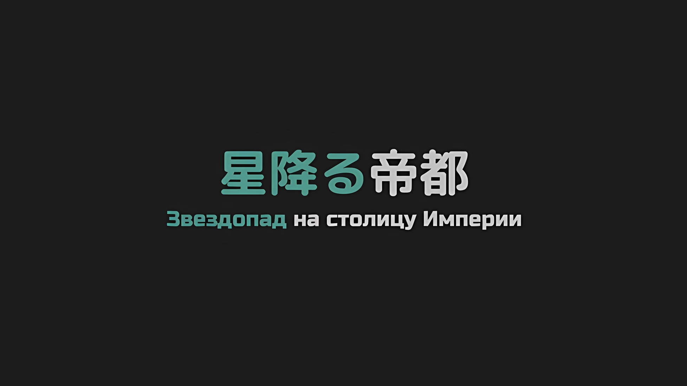
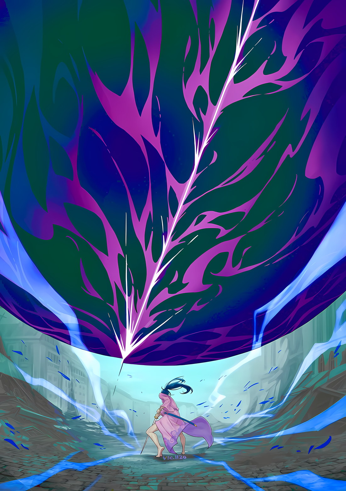
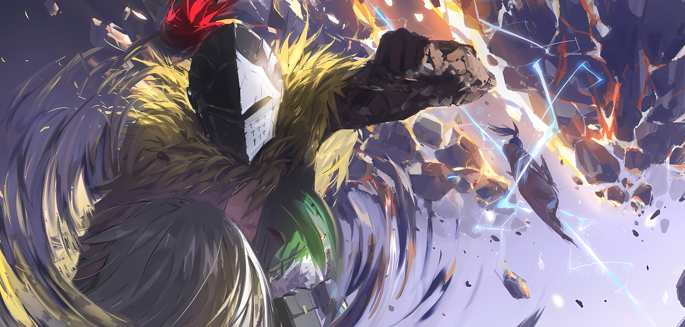

*※※※※※※※※※※※*

…Через преобразование души вместилище переделалось в «Ведьму Жадности».

Такова была конечная цель «Ведьмы», Сфинкс, которая устроила эту масштабную катастрофу, «Великое Бедствие» Империи Волакия.

Именно для этого она и была создана — цель, которая оставалась невыполненной все триста с лишним лет с момента ее появления на свет… преграда, которая сохранялась в основе Сфинкс, как бы далеко она ни зашла.

Если верить «Звездочетам», которые, как считается, обитают только в Империи Волакия, это можно было назвать заповедью, данной Сфинкс от рождения.

Чтобы выполнить эту заповедь, будь то Королевство или Империя, она без колебаний доведет их до краха.

Значит…,

???: …Заполонить Империю мертвецами — такова была твоя цель?

Прикованная цепями в подземной темнице, с поднятыми над головой руками, Присцилла сузила свои багровые глаза.

В этих проницательных очах не было ни тени удивления от происходящего, а лишь искрящееся пламя, в котором пылало спокойное понимание.

Сфинкс, которая теперь стала «Ведьмой Жадности», скривила губы при виде ее багровых глаз и кивнула.

Сфинкс: По своей природе душа и вместилище неразделимы; я поняла это сразу после своего рождения. Долгие годы моих поисков, можно сказать, были путешествием, чтобы исправить это несоответствие.

По замыслу, цель состояла в том, чтобы реплицировать «Ведьму Жадности», однако ее душу вложили в сосуд, что сильно отличался от сосуда самой «Ведьмы Жадности», поэтому Сфинкс родилась как ее неполная версия.

И хотя она не считала страданиями те триста с лишним лет попыток, чреватых неудачами, даже Сфинкс не стала исключением, когда, наконец, достигла горизонта и прониклась чувством выполненного долга.

И, по мнению Присциллы, этот путь, несомненно, был пройден, он воплотился в жизнь, «Великое Бедствие» явилось Империи.

…Как уже говорилось, по своей природе вместилище и душа были неотъемлемыми составляющими жизни.

Даже такие неосязаемые создания, как Духи, не являлись исключением. Важно было не наличие или отсутствие осязаемого тела, а скорее сосуд, который формировал вместилище, внутри коего пребывала душа.

Сказать, что они были несовместимы, значило бы еще и то, что такая жизнь будет протекать в неестественном для себя виде. Поэтому внутри неразделимых души и вместилища должна действовать сила, которая попытается исправить это несоответствие.

Конечно, какие бы исправительные меры ни применялись, случаи, когда сосуд мутирует, чтобы соответствовать своей душе, были редки.

К таким редким примерам можно отнести техники шиноби, что изменяли душу и подгоняли под нее форму сосуда, а также связывающие проклятия реинкарнации, которые требовали принести в жертву не одну жизнь; однако в первом случае нужен был талант к технике придания душе и сосуду нужной формы, а во втором — сильная связь между заклинателем и многочисленными жертвами.

Оба эти условия Сфинкс соблюсти не могла, поэтому она отказалась от них как от возможных после того, как изучила их целесообразность.

Отсюда следует, что Сфинкс решила. …«Великое Бедствие».

Присцилла: С помощью леденящей кровь магии воскрешать мертвых и делать множество наблюдений за незримыми-неосязаемыми душами. Идеально для того, чтобы проводить исследования, что сопутствуют твоей цели, не так ли?

Сфинкс: То, что «Великое Бедствие» состоится, предвиделось. Дело оставалось за малым, стóящий ли мой план… Итог ты и сама видишь.

Присцилла: Для кого-то столь триумфального, не слишком ли туго тебе пришлось?

Сфинкс: Отрицать не стану. Вызов: Был Необходим.

Замечание Присциллы оказалось верным. Поистине, такое испытание было чревато множеством неизвестностей.

Удастся ли переделать «Таинство Бессмертного Короля» так, чтобы установить связь с «Каменной Глыбой», Великим Духом Волакии, что позволит создавать армии нежити; будет ли искусственно созданная Сфинкс воспринята как отдельная душа и включена в список кандидатов на воскрешение; появится ли что-то, способное вызвать преобразование души, достичь чего Сфинкс не могла самостоятельно; все это было неизвестно.

Сфинкс: Однако…

Возрождение нежити через воссоздание «Таинства Бессмертного Короля» удалось, и план Сфинкс по воскрешению себя в качестве нежити тоже прошел гладко. Сверх того, появились и те, чьи души претерпели изменения, такие как Ламия Годвин и «Гигантский Глаз» Измаил, что заложило так необходимую Сфинкс основу.

И тогда…,

Сфинкс: Последним толчком стало пламя «Меча Света», как иронично.

Присцилла: …

Сфинкс: Если бы все продолжалось как раньше, я бы, без сомнения, оказалась уничтожена. Однако в итоге такие трудности стали для меня стимулом к проведению бесчисленных анализов.

Присцилла: Нет.

Сфинкс: Нет?

На отрицание того факта, что ей едва удалось избежать риска испепеления собственной души, Сфинкс наклонила голову.

В отличие от того времени, когда она была неполноценным вместилищем «Ведьмы Жадности», высота, с которой Сфинкс на нее смотрела, разнилась. Ее лицо, шея и открытые участки кожи уже не отличались бледностью, а золотые глаза больше не плавали в черном море — теперь они были просто обычными черными глазами.

Тем не менее, было ясно как день, что Сфинкс оставалась нежитью.

Успешное воссоздание души в виде, крайне неотличимом от живых, существенно влияло на ее внешность. Сам факт того, что она это реализовала, доказывал достоверность теории Сфинкс.

Сфинкс: В чем же тогда я ошибаюсь? Объяснение: Требуется.

Присцилла: Не используй безжизненные слова вроде «бесчисленные анализы», чтобы описать тобою достигнутое. Жизнь твоя сгорала дотла, поэтому ты позорно, да с рвением пыталась выжить.

Сфинкс: …И все же я мертва.

Присцилла: По-твоему, мертвые не стремятся выжить? Все те бесчисленные тропы, по которым тебе приходилось перебираться, ни одну из этих троп ты бы не смогла преодолеть без спешки.

Сфинкс: …

Присцилла: Ты боролась за выживание и добилась желаемого. Каким бы неприятным или неудобным для тебя не был этот факт, но ты должна честно его признать. …И, если ты смеешь стать моим врагом…

Присцилла дерзко заявила об этом молчащей Сфинкс.

На ее слова, на ее взгляд Сфинкс слегка нахмурилась.

Язык Присциллы с характерной остротой, казалось, превозносил брошенный ею вызов.

Будто она признала, что попытки Сфинкс принесли свои плоды.

Сфинкс: …

В груди Сфинкс зародилось слабое беспокойство. …Неподобающее «Ведьме Жадности» чувство, которого не должно было быть, родилось на свет.

Сфинкс: …Похоже, мне не стоит вдаваться в твои объяснения. Самооборона: Требуется.

Присцилла: Батюшки. Как будто того, что меня заковали в цепи, было недостаточно. Теперь ты меня еще и слушать не будешь? В таком случае тебе нет смысла оставаться здесь или жить. И все же, ты продолжаешь это делать. Почему?

Сфинкс: Я уже сказала, я не буду вдаваться в твои объяснения.

Присцилла: Хмф, прекрасно. Что ж, тогда я выложу все начистоту.

Присцилла скривила свои багровые губы — она проигнорировала Сфинкс.

В ее словах и тоне голоса таилась великая сила. Стоило ей заговорить, и, как бы сильно кто-то ни закрывал уши, все ей внимали.

Присцилла: Осуществить свой план в Империи и по-прежнему оставаться здесь, даже сейчас, когда ты добилась своего — перевоплотилась в сосуд для этой так называемой «Ведьмы», — причины всего этого очевидны.

Присцилла продолжала говорить, Сфинкс не удастся ее заткнуть.

И тогда…,

Присцилла: Выставляешь напоказ всю эту гибель Империи, но при этом сохраняешь мне жизнь. Почему? Чтобы показать мне гибель родины моей, чтобы раздавить мое сердце. …Именно в этом корень твоей нескончаемой ненависти ко мне.

…Она безошибочно определила две главные цели Сфинкс: воссоздать «Ведьму Жадности» через преобразование души и отомстить Присцилле Бариэль.

*△▼△▼△▼△*

…Для Альдебарана это была роковая встреча. Она не должна была случиться, никогда, никоим образом.

Ал: …ЕХИДНАААААААА!!

Его голос дрожал от гнева. Ал схватил быстро возникшее каменное дао и бросил его в «Ведьму Жадности», чьи белые волосы развевались, когда она парила в воздухе.

Дао исказило пространство, подобно миражу, и яростно полетело по вертикали в сторону «Ведьмы», что готовилась к какой-то атаке.

Ал не смог бы допрыгнуть до «Ведьмы Жадности», поэтому его меч полетел прямо в нее…,

Ведьма: Кто-то обратился ко мне по этому имени, я удивлена. Объяснение: Требуется.

Она с невозмутимостью сказала это и легким движением уклонилась от дао.

Клинок не достиг своей цели, он тщетно пролетел мимо «Ведьмы Жадности», никак ее не задев.

…Однако так и было задумано.

Ал: Получай!

Сразу же после того, как Ал закричал во весь голос, дао, что не попало в цель, раскалилось и взорвалось.

Начнем с того, что он не был настолько наивен, чтобы полагать, что брошенный им меч попадет в противника. На самом деле Ал прекрасно знал, что его атаки не будут эффективны против большинства противников.

Вот почему, если бы Ал не продумал все заранее, он не стоил бы даже чуточку внимания.

Ведьма: …

Каменное дао взорвалось — от него тут же разлетелись осколки, что нещадно врезались в «Ведьму Жадности», в ее стройное тело.

Урон этой небольшой взрывчатки был далек от смертельного, но, если бы она попала прямо в цель, то легко отделаться было бы нельзя.

Даже с небольшим количеством маны он специально изваял дао так, чтобы получились острые осколки. …Ал умел выжимать максимум из того, что было в его руке, — он хотел добиться лучшего.

Ал: Раньше я жил там, где, если не пользоваться головой на плечах, умрешь!

Над макушкой Ала, когда он кричал это, пролетели осколки, что пронзили «Ведьму Жадности». …Тем не менее, все пошло не так, как ожидалось.

Ведьма: Хмм.

«Ведьма Жадности» слегка прищурилась на приближающуюся угрозу, но ничего не сделала. Собственно, не было необходимости. Летящие осколки отклонились от парящей «Ведьмы Жадности», как бы избегая ее.

Атака Ала не пробила даже затяжной ветер, которым была окутана «Ведьма Жадности», чтобы летать.

Как ни печально, Ал ожидал даже такое.

Ведьма: …Кх!

Если бы удалось отвлечь внимание «Ведьмы Жадности» хотя бы на мгновение, этого было бы достаточно.

Воспользовавшись этим моментом, Ал произнес заклинание под свои несущиеся ноги, и вздымающаяся земля, трамплин, подбросила его тело высоко в небо.

Затем Ал превратил камень, который схватил до этого, во второе дао.

В отличие от получения огня или воды из ничего, использовать камешек как катализатор для создания большого меча потребляло меньше маны и было на порядки быстрее.

Ал: ОООООО…!!!

Он задействовал все свое тело на трамплине и с размаху ударил «Ведьму Жадности».

И вот сейчас, в противоположность летящим осколкам, ветер точно ее не защитит. Всю свою силу Ал влил в это лицо, лицо со слишком четко очерченными зловещими чертами…,

Ал: Гх.

Ведьма: Компенсировать отсутствие навыков изобретательностью — довольно похвально, однако, Навыки: Требуются.

Тонкие руки «Ведьмы Жадности» плавно парировали дао, а ее длинные ноги ударили шокированного Ала по торсу. Когда он изогнулся в воздухе, она крутанулась и ударом ноги вбила его прямо в землю.

Ал: Кха!

Он быстро согнулся, чтобы не сломать шею при падении.

Однако этот удар, довольно сильный, причинил неописуемый урон всему его телу. При этом Ал пострадал не только от него.

Ал: Эти движения…

Ведьма: Сказать, что это неожиданно, нельзя. Таков результат использования предыдущих поражений, чтобы компенсировать и отточить недостающие навыки.

«Ведьма Жадности» опустила ногу, которую использовала для удара, ее слова вонзились в мозг Ала — он оцепенел.

Странно. Невозможно. Насколько было известно Алу, она склонна пробовать свои силы во всем без ограничений, однако же ее атлетические способности оставляли желать лучшего. Сколько бы она ни теоретизировала, ей не удавалось перенять это на собственное тело; она никогда не научится исполнять нечто подобное, даже если встанет на голову*. В самом деле, ей не под силу даже стойка на голове.

* Японская идиома «даже если кто-то встанет на голову» имеет значение «что бы он ни делал» или «как бы ни старался», и противопоставляется буквальному значению того, что Ехидне не под силу даже стойка на голове в следующем предложении.

Другими словами…,

Ал: Ты не Учитель… ты не Ехидна…

Ведьма: Твое удивление интригует. Как правило, такое я исключала, но ты, похоже, знаешь моего создателя. …Как?

В ответ на этот вопрос Ал оглянулся на парящую «Ведьму Жадности»… на ту, что внешне напоминала Ехидну, и замешкался — он не мог найти слов.

И внешне, и по голосу она была вылитой Ехидной. Вот только это была не она.

В черных глазах «Ведьмы Жадности»… нет, в черных глазах этой «Ведьмы» не было «ее» — любознательности, злобной и неутолимой любознательности, которой обладала настоящая «Ведьма Жадности».

Ал: …

Как только Ал закрыл рот в осознании, существо, что не было Ехидной, а лишь приняло ее облик, сузило глаза, обрамленные белыми ресницами, в легком недовольстве,

Ведьма: Похоже, ты отказываешься отвечать? Я хочу узнать о тебе как можно больше, помимо того, что ты просто сопровождающий Присциллы Бариэль.

???: …Ах, прости, но не выйдет.

Вспышка молнии случилась мгновенно.

Только-только «Ведьма» собралась направить палец на еле стоящего Ала, как позади нее появился Сесилус с Аракией на руках.

Левой рукой он удерживал Аракию, а правой — выхватил «Меч Грез» и одним взмахом, даже не колеблясь, отправил голову «Ведьмы» в полет.

Ведьма: Чт-…

Сесилус: Говоришь, убить я тебя не смогу, да? Признаться, это прозвучало довольно обидно, так что время показать, чего я стою!

Лезвие не дало «Ведьме» даже и шанса среагировать. Ее голова отделилась от туловища.

Прямо над Алом, который лишился дара речи, Сесилус высунул язык: его мастерство владения мечом без труда убило даже «Ведьму».

По крайней мере, именно это Ал смог принять, но все же его озадачило появление знакомого лица и тот факт, что это, судя по всему, была не сама «Ведьма».

Однако…,

Ведьма: …Анализ: Требуется.

Понять, что произошло дальше, с первого раза было нереально.

Ведьма: ……

Голова «Ведьмы» крутилась в воздухе, ее белые волосы разметались, а красивое лицо лишь слегка раздвинуло губы, словно в насмешке.

Сразу же после этого все вокруг падающей «Ведьмы» жестоко побелело…,

*× × ×*

Ведьма: Похоже, ты отказываешься отвечать? Я хочу узнать о тебе как можно больше, помимо того, что ты просто оруженосец Присциллы Бариэль…

Сесилус: …Ах, прости, но не… чего-чего-чего-чего-чего-чего-чего!?

«Ведьма» прищурила глаза с белыми ресницами и недовольно пробормотала.

Сесилус нацелился на ее стройную шею с тыла, однако был ошарашен внезапно образовавшейся перед ним земляной стеной. Он тут же оттолкнулся от нее, крутанулся в воздухе и удачно приземлился, после чего обратил свой негодующий и полный упрека взор в сторону Ала.

Сесилус: Эй-эй, Ал-сан! Чего это ты вдруг мне мешаешь? Я, да еще и в стильной сцене, сейчас должен был показать свои возможности, ведь меня с самого начала поставили в ничто! Меня ж щас все одиэнс* освистают!

* Audience — зрители.

Ал: Прости, что испортил твой выход, но я не дам тебе это сделать. Ведь если дам, то все вокруг… или, как минимум, только я буду стерт с лица земли.

Ведьма: …Хмм.

Сесилус в знак протеста топнул ногой по земле, чему Ал и ответил, заставив «Ведьму» испустить вздох.

По этому высказыванию «Ведьма», кажется, поняла, что Ал раскусил ее ловушку… технику, которая искажала все вокруг, взрывая целую область в момент удара.

Как только Сесилус отрубил бы голову «Ведьме», что привело бы к остановке сил, поддерживающих искаженное пространство, сработал бы переключатель мертвеца… вместо того, чтобы детонировать при нажатии кнопки, эта ловушка активировалось при отпускании.

Ал не мог противостоять этой силе, сколько бы земляных стен он ни воздвиг и сколько бы каменных доспехов ни надел.

На самом деле Сесилус, даже неся на себе Аракию, возможно, смог бы спастись, однако для Ала это был верный путь к смерти безо всяких средств к спасению.

Поэтому он не мог допустить, чтобы «Ведьму» бездумно убили. …К этому выводу Ал пришел путем пятидесяти трех попыток.

Более того, было еще кое-что, в чем он убедился.

Ал: Тварь, ты не Ехидна. Кто же ты, черт возьми, такая и откуда взялась?

Ведьма: Я уже отвечала на этот вопрос. Я — «Ведьма Жадности».

Ал: Как я и думал, это Ехидновский…

Сесилус: Постой-постой, Ал-сан, неужели ты не понял? А, наверное, Ал-сан никогда с ней не пересекался.

В момент, где Ал уже собрался и дальше спорить с «Ведьмой», вмешался Сесилус. Он ловко ударил ногой по земле и встал так, чтобы перекрыть им обзор, когда снова подхватил Аракию,

Сесилус: Она организатор этого большого бедствия в Империи… именно она воскрешает мертвых. Правда, сейчас она выглядит иначе, чем когда я с ней встречался, но, думаю, теперь ей больше идет злодейство и красота, так что у нее идеальная внешность для той, кто руководит всем из-за занавеса!

Ал: Она… организатор «Великого Бедствия»…

Ведьма: Мне незачем это скрывать, поэтому скажу прямо. Я — твой враг.

Без всякого обмана в своих словах «Ведьма» деловито изложила свою позицию; это позволило Алу, наконец, выйти из унизительного положения, когда он отставал от Сесилуса в понимании ситуации.

Однако вопрос о внешности «Ведьмы» все еще оставался открытым.

Ал: Твоя внешность… Бесполезно. Учитель зашел слишком далеко…!

Ведьма: Ты знаешь о моем создателе? Подтверждение: Требуется.

Сесилус: К слову, я все еще здесь.

«Ведьма» с интересом взглянула на подавленного Ала, что возился со своим металлическим шлемом. Однако Сесилус вновь перехватил ее взгляд, он не дал ей удовлетворить свою любознательность.

Впрочем, присутствие Сесилуса здесь было не совсем положительным.

Как уже говорилось выше, переключатель мертвеца «Ведьмы» по-прежнему функционировал… без какого-либо прорыва легкомысленно победить «Ведьму Жадности» не получится.

Ал: …Нет. Это не «Ведьма Жадности».

С этими словами Ал отверг идею, которая начала формироваться в его голове.

Хотя внешность «Ведьмы», бесспорно, была идентична Ехидне, титул «Ведьмы Жадности» не мог быть присвоен тому, кто просто на нее похож.

Это касалось не только «Ведьмы Жадности». …Титул «Ведьмы» не давался так просто.

Ал: Вряд ли так легко можно стать «Ведьмой».

Ведьма: Я не хочу выставлять свои достижения напоказ, однако меня так раздражает, когда говорят, что мне было легко этого достичь.

Ал: Закрой свой гребаный рот, посдыхай пару сотен раз, и потом уже поговорим.

Очевидно, «Ведьма» была недовольна, но это касалось и Ала.

Как только представится возможность, он хотел поскорее помчаться к Присцилле, которая находилась в Кристальном Дворце, поэтому задерживаться из-за «Ведьмы», что бесила его своим внешним видом, было нельзя.

Ал: …Повторный мысленный эксперимент, переопределение территории.

Не теряя сильного боевого духа, Ал обновил свою матрицу и уставился на «Ведьму».

Даже с Сесилусом рядом он должен осторожничать. «Ведьму» нельзя бездумно убивать. К тому же, Ал убедился еще в одном факте.

И им было…,

Ал: Сесилус, держи мисс Аракию покрепче.

Сесилус: Угу, я ее не брошу, но, хм… не звучит ли это так, будто я должен обращаться с ней не хуже, чем с принцессой?

Ал: Да. …Ведь цель этой особы — жизнь мисс Аракии.

«Ведьма», принесшая «Великое Бедствие», явилась сюда только потому, что жизнь Аракии теплилась в объятиях Сесилуса.

*△▼△▼△▼△*

Присцилла: Если бы ситуация разворачивалась тривиально, то Аракия бы не смогла поглотить «Каменную Глыбу» и умерла. Однако расчеты твои оказались неверны.

Сфинкс: …

Присцилла: Моя «Техника Брака Душ» и Масаюме «Синей Молнии» оказались факторами, что вышли за рамки твоих расчетов. Никто не знает, что бы вышло, случись из этого только одно, но Аракии выпали как раз обе карты. …Впрочем, если бы они не собрались с силами, то Аракия точно бы не выдержала, отчего бы твои расчеты оправдались.

Присцилла тут же убедилась в правильности своих выводов, ибо Сфинкс просто молчала.

Несмотря на то, что Сфинкс прочитали как открытую книгу, на лице ее не отразилось ни капли эмоций. Кроме того, она не стала прибегать к обману и манипуляциям. Это было впечатляющее проявление наглости перед лицом «Иррегулярной» ситуации.

…Аракия выжила — неожиданный исход, что шел вразрез с планами Сфинкс.

Если бы все развивалось в соответствии с расчетами, то Аракия должна была погубить себя тем, что ради спасения Присциллы поглотила силу, которая превышала ее возможности.

Трагическая гибель Аракии, должно быть, входила в планы Сфинкс, чтобы мучить Присциллу, как и с последним закатом Империи Волакия.

С этой целью Сфинкс заставила Аракию поглотить «Каменную Глыбу».

Однако все пошло наперекосяк. …Из-за того, что Аракия держалась на плаву и терпела, вмешательство Присциллы и Сесилуса спасло ей жизнь.

В результате «Пожирательница Духов» не только сорвала планы Сфинкс, но и поднялась на значимую позицию, способную сильно помешать ее планам.

То бишь…,

Присцилла: …«Каменная Глыба» внутри Аракии изгнана Сесилусом Сегмунтом с помощью «Меча Грез». Так что теперь ее жизнь связана с «Каменной Глыбой».

Сфинкс: …Да, это точно. Против твоей оценки у меня нет возражений.

Так рассудила Присцилла, на что Сфинкс кивнула в знак согласия.

Это стало признанием драматической, судьбоносной перемены обстоятельств… признанием того, что Аракия оказалась глубоко и неразрывно связана с «Каменной Глыбой», Муспелем, которого она приняла в себя.

Первоначально Аракия, видимо, хотела поглотить часть Муспеля и тем самым познакомить Великого Духа со страхом смерти. Таким образом, Сесилус должен был убить его и положить конец ситуации, в которой Сфинкс использовала «Каменную Глыбу» для масштабного применения «Таинства Бессмертного Короля».

Однако, если смотреть на результаты, этот план потерпел крах.

По сути, и для живых, и для мертвых, что оказались во власти «Каменной Глыбы», ситуация обернулась «Иррегулярностью», превзошедшей ожидания всех вовлеченных.

Сфинкс: Ты все еще загнана в угол. Если она… если Генерал Первого Класса Аракия лишится жизни, то и «Каменная Глыба», Муспель, тоже умрет. Империя Волакия не избежит гибели.

Присцилла: Думаешь, глаза мои потускнеют, коли падет моя некогда покинутая родина? Ты меня недооцениваешь.

Сфинкс: Тогда усаживайся поудобнее и наблюдай. Скоро станет ясно, бравада это или нет.

Глаза Присциллы и Сфинкс, багровые и черные, уставились друг на друга.

Вопреки жару и остроте взгляда Присциллы, твердая решимость Сфинкс оставалась непоколебимой. В ответ на то, что ей открыто заявили, что шестеренки ее плана вышли из строя, она лишь недовольно запугивала.

Корнем всего этого, наравне с ее давней, растянувшейся на века одержимостью, которая позволила Сфинкс осуществить свою цель — стать «Ведьмой Жадности», была ее ненависть к Присцилле.

Присцилла: Ты меня так ненавидишь… что ты об этом думаешь, о «Ведьма»?

Сфинкс: Нет названия занозе, что засела глубоко в моей груди. Или, может, ты знаешь, что именно засело внутри меня? Ответ: Требуется.

Присцилла: …Мне претит хамство, когда непричастная сторона что-то там да говорит.

Присцилла не собиралась давать название ее эмоции.

Пусть даже ее название будет неизвестным, распустившийся цветок все равно останется цветком. И даже если этот цветок, как в притче, распускал свои лепестки только на грудах трупов, в его красоте не таилось греха.

Сфинкс: …

Она замолчала, а затем вдруг щелкнула пальцами.

Тотчас же изображение далекого вида, что отражалось в магическом кристалле, вставленном в конец ее посоха, спроецировалось на поверхность созданного в воздухе водяного зеркала.

…Зрелище. Кто-то с такой же внешностью, как у «Ведьмы», ниспослал звезду с еще светлого неба, чтобы положить конец Земле Волков Меча.

*△▼△▼△▼△*

Сесилус: …Из-за облаков мне не видно луны, а ветер лишь треплет цветы.

Сесилус дал элегантному, живописному стихотворению слететь с языка и погрузился в бурю камней.

Поднявшийся впереди водоворот обломков должен был стать смертельным градом пуль средь леса клинков, однако Сесилус крепко прижал Аракию к себе и успешно уклонился от всего с минимальным количеством движений. …Нет,

Сесилус: Чудно. С таким уровнем сложности справлюсь только я!

Слизывая кровь, которая струйкой стекала по его поцарапанной щеке, Сесилус перевел взгляд на «Ведьму», что создавала бушующий шторм.

Как бы ни было это досадно, но он не мог нарушить выгодную позицию, которую «Ведьма» удерживала с большой высоты. Аракия, по сути, сравняла с землей все близлежащие здания, которые можно было бы использовать в качестве опоры, поэтому на этом поле боя не было ни одного сценического реквизита, который позволил бы ему достать ее с помощью прыжка.

Впрочем, даже если бы он захотел увести врага на какое-то другое поле боя…,

Ведьма: …Аль Гоа.

Короткое заклинание породило гигантскую массу пламени, которая с невероятным размахом обрушилась вниз.

Если бы она столкнулась с землей, все окрестности оказались бы охвачены языками пламени, что, скорее всего, привело бы к возникновению такого же ада, как и в битве с Аракией.

Но в отличие от Аракии, «Ведьме» не нужно было думать о том, чтобы как-то ограничить область, составляющую театр военных действий.

Сесилус: Простая неприятность! Уходи!

В тот же миг, молниеносно взмахнув «Мечом Грез», он разрезал облака и огненный шар в небе.

Сгусток пламени засиял в отблесках разреза и высвободил огненную мощь, способную охватить все вокруг, прямо в небо, вновь окрасив его в разрушительный оттенок красного после того, как оно на время вернулось к своему обычному цвету.

Зрелище было просто отпадным, однако он не мог спокойно сидеть и наслаждаться этим видом.

А все потому, что поток пламени не ограничился одной лишь атакой.

Ведьма: Гоа. Эль Гоа. Уль Гоа. Аль Гоа.

При этих последовательных заклинаниях губительный огонь огромных объемов начал лететь вниз, подобно сцене из ночного кошмара.

И под этим огненным дождем глаза Сесилуса ярко засветились… он откинул Аракию в сторону и схватился за рукоять «Меча Грез».

Сесилус: Дон-дон-дон-дон-до-до-дон-дон!!!

Он наносил удары в ритме стаккато*. Мерцающий «Меч Грез» рассекал ливень пламени. Пока раздавались раскаты грома, взрывы и звуки конца света, грозное сияние неба усиливалось все больше и больше.

* Музыкальный штрих, предписывающий исполнять звуки отрывисто, отделяя один от другого паузами.

Его щеки исказились в улыбке; однако Сесилус не приветствовал войну на истощение.

Сесилус мог максимально пренебречь риском, что приходил в обмен на силу «Меча Грез», но вынужденная неуплата ресурсов, которые, как предполагалось, были ограничены, являлась обоюдным делом двух сторон.

Иными словами, сейчас битва между Сесилусом и «Ведьмой» зашла в тупик.

Если сказанное Алом правда, то, если он по неосторожности отрубит «Ведьме» голову, все вокруг окажется разнесено. Когда он напряг глаза, то увидел, что воздух вокруг «Ведьмы» искажается, так что этому вполне можно было доверять.

Даже если все вокруг вот-вот разлетится, Сесилус, вероятно, сможет спастись, — Ал, охваченный сомнениями и обладающий, как и Шварц, «Истинным Зрением», не подавал никаких признаков того, что это в самом деле так, поэтому Сесилус решил, что это окажется невыгодной авантюрой.

Значит, ситуация зашла в тупик, и если единственным способом сдвинуть ее с мертвой точки был Сесилус, то все это билет в один конец к их гибели…,

Сесилус: Вот почему сейчас твое время блистать, Ал-сан.

Ал: Да я знаю, черт подери! И еще, не надо вот так просто, без всяких оговорок, бросать мисс Аракию!

Сесилус: Как обидно, что ты сказал «бросать»! Такой подвиг стал возможен только благодаря взаимному доверию между мной и Алом-сан!

Когда Сесилус заставил распуститься в небе бесчисленные пылающие цветы ярко-малинового цвета, Ал закричал на него, одной рукой неся Аракию.

Конечно, он бросил Аракию, полагая, что Ал сможет ее поймать, однако с точки зрения самого Ала это выглядело так, будто тот просто швырнул ее в сторону.

Тем не менее, Ал ни разу не оплошал, когда что-то ловил, и самое главное…,

Ведьма: Ты и от этого сможешь уклониться?

С коротким бормотанием «Ведьма» выпустила из своего пальца белый луч света.

И направлен он был не на Сесилуса, а на Ала… а, нет, прямо на Аракию, которую он нес рукой, однако атака, что попыталась было остановить ее сердце, не достигла своей цели.

В самый последний момент Ал уклонился от ее атаки — буквально еще бы чуть-чуть, ширина волоска, и ему пришел бы конец.

Уклонился Ал ужасно неуклюже, однако ему было совершенно наплевать на то, как он при этом выглядит.

Сесилус: Если результат хороший и соответствует характеру персонажа, то все в порядке! Однако, Ал-сан, ты прав, Аня стала мишенью!

Ал: В любом случае, похоже, что, если мисс Аракия умрет, основа Империи рухнет!

Сесилус: Я понимаю, что совершенно ничего не понимаю!

Когда ему сказали что-то, что прозвучало как шутка, в манере, которая, похоже, не была шуточной, Сесилус хоть и улыбнулся, но не засмеялся; он выхватил Аракию из руки Ала, когда они проходили мимо друг друга, и ускорил шаг.

Сесилус: Ну тогда как насчет этого: если ты хочешь добиться своего, то преследуй меня глазами, преследуй меня сердцем и преследуй меня самой своей душой… о-о-о!?

Сесилус с Аракией на руках ударил ногой по земле, и скорость его движений стала молниеносной.

В воздухе, словно для того, чтобы ограничить бег Сесилуса, появилось множество красивых зеркал из воды… поверхности этих зеркал отражали выпускаемые «Ведьмой» белые лучи жара, — начался бурный танец света.

Со всех сторон хаотично летали смертоносные лучи, целясь прямо в Сесилуса.

Сесилус: И-да-да-да-да-да-да-да-да-да-да-да-да-та!

Сесилус пронесся сквозь бушующий шквал света, словно в танце. Он наклонял свое тело, подавался вперед, вытягивал ноги, опускался и время от времени переступал через свет длинными шагами.

А там, где не мог уклониться, Сесилус использовал лезвие «Меча Грез» и разрезал на две части водяные зеркала, что отражали свет. С плеском, похожим на звук плоского камня, что скачет по поверхности воды, он грелся под разлетающимися каплями разбитых водяных зеркал и прорубал себе путь сквозь весь этот шторм…,

Ведьма: …Почувствуй, как весь мир обернулся против тебя.

В тот же миг заявление «Ведьмы» ударило по барабанным перепонкам Сесилуса вместе со звуком, от которого накалился сам воздух.

Боль, пронесшаяся по всему его телу в этот момент, доказывала, что брызги разбитых водяных зеркал мгновенно замерзли, лишив Сесилуса тепла и свободы.

Даже водяные зеркала были тщательно спланированы с учетом второй и третьей стадии подготовки, настоящее коварство.

Чувство, что весь мир обернулся против тебя, — еще одно знаменитое произведение этой изящной композиции.

Конечно, в Империи Волакия, где почти не было магов в традиционном смысле этого слова, возможности столкнуться с таким мастером, как этот, ему никогда не представлялось.

Сесилус: Блин, кажись ты не в курсе. …Мир всегда ждет моих действий!

Вопреки падению температуры тела, его мотивация разгорелась еще сильнее. В тот же миг мана, что циркулировала внутри Сесилуса, разгорелась с невероятной силой, подобно молнии; оледенение, что пыталось лишить его тепла и свободы, мгновенно испарилось, и он продолжил бежать.

Вырвавшись из ледяных оков в таком энергичном темпе, Сесилус поднял глаза к небу, и на лице его заиграла широкая улыбка.

Но это была не та улыбка, какую бы он подарил, если бы обменялся взглядом с парящей в воздухе «Ведьмой». …Прямо за этой «Ведьмой», что-то падало с гораздо, гораздо большей высоты в небе. Он увидел сияние звезды.

Ведьма: …Аль Шарио.

Значение этого заклинания указывало на то, что сияние той звезды дело рук «Ведьмы».

Перед сенсационной новостью о том, что невероятный маг способен заставить звезду упасть, «Меч Грез», что покоился на поясе Сесилуса, взволнованно закачался.

Он жаждал. Масаюме жаждал поглотить «Мечту», что бурлила внутри его владельца. И он сделал это.

Сесилус: …Как же это потрясно!

Ливень света говорил: *«*;Срази звезду».

Любимый клинок на его поясе говорил: *«*;Срази звезду».

Многочисленные собравшиеся зрители говорили: *«*;Срази звезду».

Душа Сесилуса Сегмунта говорила: *«*;Срази звезду».

Сесилус: …

На мгновение оторвавшись от звезды, Сесилус облизнул губы.

В настоящий момент, если не считать «Мечты», что бодрила его душу великим вызовом, все должно остаться в прошлом. Дабы воплотить это в жизнь, Сесилус повалил девушку, которую держал на руках, наземь и встал прямо перед ней.

Он выбрал самую ровную поверхность, какую только смог найти. Он даже снял свое хаори* и расстелил его, обращаясь с ней максимально заботливо.

* Хаори (羽織) — это традиционная японская куртка длиной до бедер, которую носят поверх кимоно.

И теперь, хоть он и сожалел об этом, даже ее присутствие будет исключено из его поля сознания.

Сесилус: Ха.

Через секунду после хриплого выдоха Сесилус молча снял с пояса «Меч Грез».

Обнаженный клинок соприкоснулся с воздухом, и, когда он завибрировал, словно впитывая пыл Сесилуса, который сжимал рукоять, в нем зародился блеск.

Зачарованный Меч поглотит «Мечты» своего владельца и воплотит в реальность их «Несбыточность».

Сконцентрировавшись на звездном свете, Сесилус перестал моргать и дышать, даже его сердце больше не билось, — он направил всю свою энергию на то, чтобы стать единым целым с Зачарованным Мечом.

Тем временем «Ведьма», казалось, делала что-то, чтобы нарушить концентрацию Сесилуса, однако…

Сесилус: Ха.

Однако он посвящал всего себя только сиянию звезды. Он исключил абсолютно все, что могло оказаться лишним. Цвет и звук, запах и вкус, земля и ветер, огонь и вода — он убрал из себя все это.

Недостаточно.

…Тогда, если это было так необходимо…

Сесилус: …

Звездный свет устремился вниз, к земле, и даже если его губительная сила не вступит в прямой контакт с поверхностью, одно лишь давление заставит ее расколоться на части, сожжет все вокруг и превратит свет в боль.

Сесилус Сегмунт поднял глаза к небу в надежде контратаковать. Он был благодарен этому моменту.

С этой благодарностью в сердце он славил всех.

Сесилус: …

Его выдох — кто бы заметил, что он прозвучал иначе?

То, что требовалось от Сесилуса в этот момент, то, чего он жаждал, чтобы полноценно и без опаски использовать «Меч Грез»; ответ на этот вопрос дали эмоции, от которых разило кровью и которые были до ужаса скоротечны.

То столкновение клинков, которым он обменялся со своим отцом — в последние минуты его жизни, дало Сесилусу Сегмунту кое-что понять. …Он узнал о местонахождении собственной души.

Узнал благодаря Роуэну Сегмунту, его мечу, мечу человека, что осквернил и жизнь, и смерть.

Посему…,

Сесилус: …Мечник, Сесилус Сегмунт.

И в самом деле, сурово заявив об этом, «Синяя Молния», Сесилус Сегмунт, самое могущественное существо в Империи Волакия, взмахнул «Мечом Грез» с конечностями длиной, соответствующей ведущему актеру.

*△▼△▼△▼△*

…Молния прорезала звездный свет.

Другого подходящего выражения для описания случившегося здесь не подберешь.

В момент, когда он стал свидетелем таких событий, единственным вопросом, над которым ему пришлось задуматься, было то, сможет ли он поверить в реальность всего этого.

Однако…,

Ал: Каким бы гребаным абсурдом это ни было…!

Сесилус Сегмунт сразил звезду.

В облике «Ведьмы Жадности», та, что стояла за занавесом и использовала запретную магию, характерную для той же самой «Ведьмы», сейчас широко распахнула глаза.

Не так-то просто было заставить звезду упасть.

Даже настоящая «Ведьма Жадности» говорила, что не хотела бы делать это больше одного раза за день.

Другими словами, ей не удастся сделать это еще раз.

Ал: ООООО…!!!

В мире, где свет погибшей звезды окрасил небо в белый цвет и где исчезло всякое подобие звука, Ал повысил голос, чтобы воспрянуть духом, и двинулся к центру небосвода, используя в качестве опоры каменные столбы, которые он создавал.

Звезда была уничтожена. Поэтому, подобравшись к «Ведьме», которая от удивления замерла на месте…,

Ведьма: Да, я удивлена. Однако…

Каменное дао, которое Ал выпадом бросил вперед, оказалось раздавлено в ладони «Ведьмы». Ветер, что окутывал ее ладонь, сильно колебался — это было сочетание магии и боевых искусств, способное вдребезги разбить свою цель.

При прямом попадании эта магическая техника разнесла бы в клочья плоть, кости и все остальное.

Все еще держа оружие в руках, «Ведьма» попыталась разбить голову Ала вместе с его шлемом.

Она пересмотрела свою оценку угрозы относительно Сесилуса, который нанес чересчур необычный удар мечом, и скорректировала свое восприятие Ала как помехи на пути к убийству Аракии — она сочла его камешком, от которого нужно поскорее избавиться.

Однако она не знала вот что. …Иногда даже камешек может убить того, кто о него споткнется.

Ведьма: Новшество: Тре…

Через мгновение на голову «Ведьмы» обрушилась левая рука Ала… импровизированный протез, сделанный из камня и скалы.

Ал: …Тебе выпали плохие звезды.

Ведьма: …

Когда Ал слегка изменил оттенок своих привычных слов, глаза «Ведьмы» задрожали.

Именно в этот миг она маневрировала, пытаясь предпринять какую-то контратаку или контрмеру. …Для Ала, который уже использовал все свои приготовления, этот миг казался вечностью.

Ал: …Оль Шамак.

В ответ на заклинание, что сорвалось с губ Ала — внутри его железного шлема, мир преобразился.

Под этой немыслимой атакой «Ведьма» на мгновение потеряла способность мыслить. Она оказалась полностью опутана, обездвижена, что остановило работу Врат внутри ее тела.

Это был главный козырь Ала против «Ведьмы».

Ведьма: …ах.

«Ведьма» со слабым выдохом рухнула на землю. Она потеряла свою свободу.

«Ведьму» сковала сила, которую следовало бы назвать противоречивым выражением «черный свет», и теперь она походила на куколку насекомого. Она полностью застыла. …Точно так же, как это было сделано с самой страшной «Ведьмой» в мире.

Ал: Теперь… Бглргх.

Ал приземлился рядом с рухнувшей «Ведьмой» и попытался было поднять голову, однако его тут же накрыла вялость — он упал на колени и вырвал.

Вдобавок у него отвалилась импровизированная левая рука. Он сразу же приподнял правой рукой подбородок своего шлема, и все его тело затряслось от неимоверного изнеможения. Ал рвал и рвал желтым желудочным соком.

Сильная боль пронзила его голову, а в глазах потемнело.

Из этих ощущений он понял, что зрение к нему вернется еще нескоро. Впрочем, утешало то, что он уже задержал «Ведьму»,

Ведьма: …Исправление: Требуется.

Ал: А?

Хватая ртом воздух, Ал поднял голову. Уголки его рта были испачканы желудочной слюной.

И даже когда он задрал голову вверх, в глазах его было темно; тем не менее, он повернул голову в сторону ее голоса и засомневался.

Что только что сказала «Ведьма»?

Ее Врата насильно закрыли — она не могла использовать свою магию, поэтому…

Ал: Что?

Ал ничего не видел, потому и сказать ему было нечего. …Однако весь северный Кристальный Дворец, который славился как самый красивый дворец на свете, вдруг тускло засветился.

*△▼△▼△▼△*

???: …

Кристальный Дворец замерцал. Сработало главное оружие Рапганы — Магическая Кристальная Пушка.

Ее уже однажды пускали в ход во время гражданской войны, когда живые боролись за трон, прямо перед тем, как «Великое Бедствие» стало угрозой для всей Империи. Это оружие, от силы которого нужно будет перерисовывать карты, превосходило человеческие возможности.

И они стали его целью… нет, это оружие нацелилось на «Ведьму», которая превратилась в черную массу, — этот факт, как и следовало ожидать, был тут же замечен Сесилусом Сегмунтом.

Такая тактика, тактика смертника, заключалась в том, чтобы попасть в «Ведьму» и гарантировать ее уничтожение… тот, кто это придумал, был гением по части нападений. Несомненно, это было дело рук коварного злодея.

Сесилус: Масаюме.

Подтвердив ощущения от Зачарованного Меча в своей руке, Сесилус тотчас после уничтожения звезды попытался продвинуться дальше.

Ал, который одержал такую неожиданную победу, что уделить ему больше внимания было бы излишним; спящая героиня за его спиной, которая, если оставить ее без защиты, может привести к тому, что все происходящее вокруг перестанет иметь рациональный смысл с точки зрения сюжета и ведущего актера; и смутно подпитываемое смертью отца возрождение Идеального Сесилуса… нет нужды говорить, что все это его подстегивало.

Сначала была звезда, а сейчас выстрел сокровищницы Империи — ей будет противостоять Сесилус, «Синяя Молния»… и, именно в этот момент.

Сесилус: …

Он поднял одну ногу и уже собрался было шагнуть вперед, но тут его синие глаза расширились.

Он резко выдохнул и опустил поднятую ногу на землю. Затем Сесилус покачал головой, как бы говоря: «Ну и дела»…,

???: …Аль Шамак!!!

За мгновение до того, как должен был появиться свет Магической Кристальной Пушки, громкий голос разнесся по небу столицы Империи.

Сразу же после этого цвет неба, которое по своему хотению окрашивалось то в красный, то в белый, стал черным, и в небесах разверзлась бездонная пустота, способная поглотить даже свет.

Это было чрезвычайно захватывающее и яркое вмешательство, которое полностью разрушило план «Ведьмы» — вырвать победу, принеся себя в жертву. А те, кто это сделал, оказались…,

Сесилус: Как раз вовремя, а то потерял бы свой шанс блеснуть, Босс.

Огромная пустота в небе поглотила свет, и, заметив двух крох, что его и создали, Сесилус улыбнулся, улыбнулся черноволосому пареньку и девочке в платье, которые держались за руки.

Не услышав голоса ведущего актера, паренек воскликнул.

Паренек: Такого я не позволю! …Давай же, о неизбежная судьба!!!
