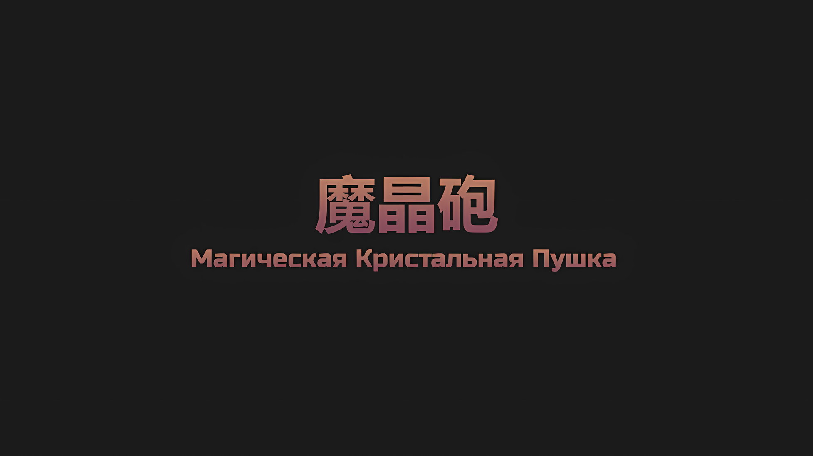

*※※※※※※※※※※※*

…Перематываем время назад, до того как Сесилус Сегмунт сразил звезду.

???: Именно поэтому вокруг крутятся люди, более мотивированные, чем я. Пока они не сильнее меня, думаю, проблем нет.

???: Люди сильнее Халибеля-сан…

Халибель: Единственный, кто реально сильнее меня, — это «Святой Меча» Королевства. В остальном все зависит от совместимости и обстоятельств.

Мягкий ответ Халибеля вызвал у Субару чувство как облегчения, так и тревоги.

То же самое касалось и Сесилуса, но было приятно видеть, что такой сильный боец, их союзник, гордится своей силой. В особенности если они были одними из сильнейших во всем мире.

И именно поэтому он не мог не поразиться тому, насколько из ряда вон выходящим был Райнхард, чья сила была «Абсолютнейше» гарантирована сильнейшими.

???: У вас двоих, видимо, полно времени для разговоров, да?

Мрачный голос Авеля прервал разговор Субару и Халибеля.

Император прочертил линию пламени своим драгоценным багровым мечом. Он был во главе их группы и рубил нежить на пути, воспламеняя само их существо.

Сила «Меча Света» была поистине невероятна, она позволила Авелю, который изначально был способен разве что на кошачий поединок с маленьким Субару, двигаться так же хорошо, как первоклассный мастер боевых искусств.

Честно говоря, одного вида того, как Авель ловко отталкивается от земли и танцует с мечом в руках, было достаточно, чтобы взорвать его мозг.

Винсент: Неучтивые пешки, не заставляйте Императора делать все за вас.

Субару: Заткнись, это твое наказание за то, что ты прятал свой козырь. К тому же я не заставляю тебя делать всю…

*Работу*, не успел он договорить, как его прервала некая дрожь.

Субару: …

Нежить, две особи, заставили землю содрогнуться.

Гигант и высокая фигура приземлились, как бы преграждая им путь. Один встал позади угрюмого Авеля, а другой — позади Субару. Внезапно возникшие враги стояли с оружием наготове. Казалось, сейчас нежить заставит их заплатить за то, что они по глупости повздорили на поле боя…,

Винсент: «Монстр-Рука», Рондандо.

Авель назвал это имя — в его невозмутимых черных глазах отразилась нежить прямо за спиной Субару; Император тут же вонзил свой «Меч Света» в другую нежить, ту, что встала позади него, сжигая ее дотла.

Субару получил это имя и обернулся к стоящему позади врагу. У того была странная правая рука. Тут же Субару увидел, как Халибель поймал неожиданную атаку врага, нежити, одним пальцем.

В их состязании сил гигант не осилил своего противника.

Халибель: Не расстраивайся, ты и правда силен. Просто я дал тебе фору.

Халибель встал пятками вверх — улицы под его ногами колыхались, словно водная гладь, но затем ударные волны рассеялись. Это подчеркивало разницу между геркулесовой мощью «Монстра-Руки» и Халибелем.

Облегчение это или нет — неизвестно, но в любом случае это помогло.

Субару: Рондандо!

???: У!

На тело «Монстра-Руки», который не мог пошевелиться, легла ладонь Спики, что держала Субару за руку. В следующий миг роль нежити оказалась снята, и их полный враждебности противник… Рондандо растерянно моргнул.

Обращаясь в пыль от кончиков пальцев, Рондандо освобождался от навязанной ему роли. Когда он исчезал, на лице его, судя по всему, появилось облегчение, — по крайней мере, Субару хотел в это верить.

???: Полагаю, это более мирно, нежели сжигать их душу.

Беатрис, которая держала Субару за другую руку, понимала его чувства.

На доброе замечание своей напарницы Субару ответил: «Да» и сжал ее ручку. Затем он поднял глаза на человека-волка, оборотня, рядом с собой.

Субару: Ты очень помог, Халибель-сан! Спасибо тебе!

Халибель: Не за что, не за что, все так, как сказал Император-сан. Я должен не только оглядываться по сторонам, но еще и заменять этого спящего типа.

Халибель благодарно рассмеялся и покачал кисэру меж зубами.

Человек-волк держал на руках Джамала, который потерял сознание. Однако вопреки хвастовству о своей непомерной силе вел он себя, пожалуй, слишком скромно.

Состояние Джамала оставляло желать лучшего, но прибывшее подкрепление с лихвой восполнило пробел, который он после себя оставил.

Беатрис: Я полагаю, было бы хлопотно, если б ты довольствовался только работой Джамала. Такой, как ты, должен работать гораздо больше, в самом деле.

Субару: Такого я не говорил…!

Халибель: А ты неплохая укротительница волков. Однако ж, когда от тебя многого ждут, это даже как-то воодушевляет. Хотя, если я слишком увлекусь и умру, люди-волки окажутся на грани вымирания.

Субару: Думаю, если возникнет ситуация, когда Халибель-сан умрет, то подозреваю, что и сам мир будет на грани вымирания, а не только лишь люди-волки…

Сказанное выше вовсе не было преувеличением; масштабы битвы говорили сами за себя.

Как это всегда и происходило, Субару отчаянно боролся с препятствиями, которые вставали на его пути, горячо пытался с ними справиться и упорно старался хоть как-то преодолеть все эти проблемы рука об руку с друзьями.

Субару: А можно, пожалуйста, таким маленьким людям, как я, не сражаться против врагов всего мира… что это у тебя за глаза такие, Спика?

Спика: Уууу…?

Беатрис: В тот самый день, когда ты стал партнером Бетти и Рыцарем Эмилии, было уже слишком поздно, — вот что пытается сказать Спика, в самом деле.

Субару: Да не может быть, чтобы у нее был такой детальный портрет моего положения в этом мире!

Он возразил против вольной трактовки Беатрис. Тем не менее, реакция Спики, казалось, говорила о том, что она в целом-то верна. Он хотел было посмотреть на свои руки, однако не смог, ибо их держали две девочки. Как жаль.

В хорошем настроении Халибель наблюдал за этой сценкой своими тонкими, как нить, глазами,

Винсент: …Довольно вашей возни.

И снова Авель заговорил голосом холодным, таким, что, казалось, раскалывал воздух.

Однако никто, даже Субару, не пожаловался на его просьбу… ведь они наконец-то прибыли к месту назначения.

Субару: …Кристальный Дворец.

Уже издалека величие дворца поражало их воображение, однако при взгляде на него вблизи это впечатление отнюдь не уменьшилось, а только усилилось.

Недаром его величали самым красивым дворцом в мире.

Беатрис: …Какой возмутительный дворец, я полагаю!

Беатрис пробормотала это и еще крепче сжала руку Субару. Слова ее были не восхищением красотой дворца, а тихим страхом.

Когда Субару бросил на Беатрис косой взгляд, чтобы поинтересоваться ее мыслями, глаза ее с характерными узорами вдруг замерцали,

Беатрис: Собрать столь внушительное число редких и высокочистых магических кристаллов — это, в самом деле, что-то невероятное. Даже если б мы перевернули всю Империю, то никогда бы не смогли построить нечто подобное, я полагаю.

Субару: И при всем при этом он ведь здесь, так?

Беатрис: …В общем, это означает, что они досоздавали недостающие магические кристаллы, в самом деле. Неудивительно, что в Империи так мало Духов, что готовы протянуть руку помощи, я полагаю.

Субару: Аа…

Субару опешил от мрачного лица Беатрис и ее слов.

Если вкратце, то магический камень — это масса сжатой маны, который в чистом виде еще принято называть магическим кристаллом. При виде Кристального Дворца, который был щедро сделан на его основе, Беатрис негодовала и сказала то, что сказала.

Винсент: Если взять большое количество бесцветной маны и сконденсировать ее, можно искусственно создать магические кристаллы. Никто и не отрицает, что такой процесс был задействован при строительстве Кристального Дворца.

Беатрис: Не только Субару, но и Бетти, в самом деле, думает вот что. …Эта Империя просто отвратительна, я полагаю.

Слова Авеля и реакция Беатрис указывали на тот факт, что многие Духи пожертвовали своими жизнями, чтобы построить этот дворец. И Субару, Пользователь Духовных Искусств, определенно что-то да чувствовал на этот счет…

Субару: Беако, я знаю, что ты чувствуешь. Но это…

Халибель: Так-с, так-с, так-с, а паренек-то дело хочет сказать. Видишь ли, история Волакии кровопролитна и себе равных не имеет, да и ведь сами шиноби не лучше.

Беатрис: Не сравнивай два худа и не говори о том, что один лучше другого, в самом деле.

Беатрис надула щеки и ответила им.

Затем, заметив пристальный взгляд Спики, которая смотрела на нее через Субару…,

Беатрис: Спика, все в порядке, полагаю. Я думаю так же, как и Субару, в самом деле. При всей ненависти к Империи здесь живут люди, которые помогали нам, те, к кому у Бетти нет неприязни, — вот почему Бетти будет бороться изо всех сил, я полагаю.

Спика: Еао…

Беатрис: …Бетти, в самом деле, показалось, или ты только что сказала «Беако»? Так ее может называть только Субару, но не ты, я полагаю.

Беатрис сказала это с еще большим недовольством, чем при виде Кристального Дворца. Спика издала «Ууу~» облегчения, которое сопровождалось вздохом Субару.

В свою очередь, Авель, который жил в этом дворце, ныне ставшем пристанищем всех зол, остался равнодушен к эмоциональному компромиссу Субару и остальных.

Субару: Дело не только в тебе, но и в поступках твоих предков. Прояви хоть немного раскаяния.

Винсент: Император так просто не склоняется. Если ты и правда хочешь найти виновных того периода, тебе следует прогуляться. Те, кто участвовал в строительстве дворца, могут быть где-то рядом.

Субару: Ты…

Субару ответил Авелю грозным взглядом, однако их спор так и не продолжился, ведь что-то показалось возле дворца. …Перед Кристальным Дворцом стали появляться какие-то фигуры.

Халибель: Эти типы, должно быть, из элиты, они пришли, чтобы помешать нам войти. Кажись, они очень сильны, так что придется нелегко…

Субару: Если дворец хорошо охраняется, значит, там запрятано что-то важное. Авель! На какую часть дворца мы должны нацелиться?

Винсент: Раз «Каменная Глыба» используется для запретной магии, то нам нужна сокровищница, где хранится ядро Могуро Хагане, точнее, ядро Кристального Дворца, или, быть может, нам нужен подземный собор, где приносятся жертвы, чтобы зафиксировать «Каменную Глыбу». Еще рядом с собором есть подземная темница… хотя нет, это не так важно.

Субару: …

Перед лицом сменяющих друг друга препятствий готовность группы броситься вдогонку усилилась. В разгар этого отказ Авеля от своих слов заставил Субару прищурить один глаз.

Авель вскользь упомянул о подземной темнице Кристального Дворца… подумав о том, кто может быть там прикован, Субару ахнул.

В столице Империи оставалась Присцилла, чье местонахождение было неизвестно.

Жизнь Присциллы была доказана Шультом, который чувствовал их связь, но даже после многочисленных попыток Субару найти ее в столице Империи так и не удалось.

Кроме того, Сфинкс, над которой они совсем недавно одержали победу, пыталась заставить Авеля вернуться во дворец, чтобы встретиться с Присциллой.

Субару: О твоих отношениях с Присциллой я уже знаю. Поэтому, если ты переживаешь за свою сестру, то не нужно настаивать.

Винсент: Ты намерен воспользоваться слабым местом Империи?

Субару: Заткнись, сисконщик*! Может, у твоей сестры и отвратительный характер, но она входит в мой лист людей, которым я не дам умереть, так что я просто хочу сказать, что мы должны спасти ее, раз уж взялись за все это дело!

* Сискон — состояние сильного романтического влечения к собственной сестре или сильная привязанность, особо теплые чувства к сестре без романтического подтекста.

Их встречи еще с самого начала не сопровождались приятными воспоминаниями, так как Присцилла всегда манипулировала им. Однако ее последователь, Ал, был родом с той же родины, что и Субару, да и ему самому Присцилла не раз помогала.

Кроме того, порой ему хотелось спасти Присциллу из тяжелой ситуации, просто чтобы увидеть ее лицо, когда ей придется его благодарить.

Беатрис: Хотя зная ее, она, вероятно, скажет, что ты опоздал или же совершил великий подвиг, в самом деле.

Субару: Я тоже так думаю, но хочу убедиться в этом на деле. Авель, такова моя позиция.

Винсент: …Делай, как знаешь.

С чего-то решив, что этот ответ был чем-то вроде репетиции для Присциллы, которая так его и не поблагодарила, Субару и все остальные, кроме Авеля, переглянулись и кивнули.

На мгновение он склонился к тому, чтобы подождать, пока Эмилия и остальные догонят их вместе с бывшим Императором Волакии, которого проводил Халибель.

Субару: Когда так не терпится, нельзя пропустить поворотный момент! За дело!

Беатрис: Я полагаю.

Спика: Ууу!

Халибель: Да, так и поступим.

Винсент: Только не мешкайся, как это обычно бывает.

Субару: Да ты че!

*△▼△▼△▼△*

…Для Вивы «Вскрывателя» это состояние, состояние воскрешения, было сродни сну.

Люди, что возродились в качестве нежити, подчинялись воле заклинателя по самым разным причинам.

Многие не желали уничтожать собственную родину, поэтому в основном их лишали чувства собственного достоинства и заставляли направлять свои инстинктивные порывы к насилию в сторону живых.

С другой же стороны, среди них находилось определенное количество людей, что в большинстве своем не поддавались влиянию этих ментальных манипуляций.

К примеру, люди, у которых от ментальных манипуляций резко снижалась эффективность, их сила, получали лишь минимальные инструкции, так чтобы не ослушаться воли заклинателя.

Вива был одним из тех, кто подвергся лишь минимальному воздействию на свой разум.

Однако это случилось не потому, что заклинатель хотел избежать снижения способностей Вивы. …У Вивы не было даже малейшей причины ослушаться воли заклинателя.

Та, что принесла «Великое Бедствие», которое погубит Империю Волакия; получается, Вива не сопротивлялся этому, ведь ненавидел Империю Волакия?

Увы, но на этот вопрос можно ответить только простым и громким «нет».

Аспект, в котором совпадали намерения Вивы и той, что принесла «Великое Бедствие», не касался выживания Империи Волакия. …А касался он исследования души и ее истинной природы.

Причина, по которой Вива стал известен как «Вскрыватель», заключалась в том, что, как воин Империи Волакия, он сражался со многими врагами и расчленял их тела на тысячи… нет, десятки тысяч кусочков.

Только вот причина, по которой Вива настолько сильно расчленял тела своих врагов, как бы живучи они ни были, состояла вовсе не в садизме. Просто он стремился к знаниям, вот и вся причина.

На крайних этапах вскрытия Вива на самом деле хотел познать не плоть и кровь, а душу.

Различия между отдельными человеческими жизнями, различия между сильными и слабыми, различия между мужчинами и женщинами — что же именно индивидуализирует людей; плавая в этой жажде узнать, что же, что же, что же, Вива расчленял множество жизней.

Но, несмотря на все это, при жизни Вива так и не смог постичь душу, он не прикоснулся к ней даже кончиками пальцев. Так он и умер, умер в полном горе. Такова была жизнь Вивы.

Однако теперь, восстав из мертвых, Вива увидел то, что лежало за пределами его надежд, надежд, которым уже должен был прийти конец.

Когда он был возрожден силой «Ведьмы», что злоупотребляла использованием душ, он обрел частичку понимания души, к которой так и не смог прикоснуться за всю свою жизнь. «Ведьма» дала ему возможность превратить эту частичку понимания в еще бóльшую.

Так что для Вивы эта эпоха была поистине чудесной.

Вива: У меня есть еще очень много-много-много-много-много всего, что я хотел бы узнать, усекла?

«Ведьма», которая оживила Виву, увидела его ненасытное любопытство, убедилась в нем.

Для того чтобы досконально исследовать души, Вива получил право играть с жизнями во дворце. Ему была обеспечена среда, в которой он мог забавляться с таким количеством подопытных, на какое он не мог и надеяться при жизни, что, несомненно, позволило ему в полной мере вкусить эту великолепную пору.

Если это происходило во имя такого любопытства, то ему было все равно, сколько жизней будет потеряно.

Напротив, чем больше людей умрет, тем более разнообразными ресурсами он сможет пользоваться снова и снова по полной программе; таким образом, больше мертвых людей — больше исполненных желаний Вивы.

И для этого ему нужно было отнять еще много-много жизней…,

???: …Вива «Вскрыватель».

Вива: …

???: И в жизни, и в смерти видеть твои деяния просто невыносимо. Поэтому, хотя мне и известно твое имя, я не дам тебе другого выбора. Ты будешь испепелен.

Меч вспыхнул красным, и, не успел Вива опомниться, как его поле зрения закружилось в воздухе.

Вива понял, что лишился головы только тогда, когда увидел свое безголовое тело. И тут же он стал свидетелем того, как оно вспыхнуло пламенем.

Пламя охватило не только тело, но и его отрубленную черепную коробку.

Вива был потрясен, это напомнило ему того мальчика, который когда-то убил его, однако решающим отличием стало то, что пламя, порожденное драгоценным багровым мечом, выходило за пределы смерти.

Вива почувствовал, как его душа сгорает, отчего испытал величайшую радость с момента своего воскрешения.

Вива: Аах, вижу-вижу, понятненько, так вот где находится душа…

Пока его плоть, его жизнь и сама его душа пылали, Вива был доволен.

Осознав, что, хоть он и убил множество людей, расчленял их тела, да и по-прежнему игрался с чужими жизнями, самым быстрым способом всегда было просто пережить это на собственной шкуре, а значит, путь для себя он выбрал довольно тернистый. Вива лишь рассмеялся.

*△▼△▼△▼△*

…Для группы, которая должна была проникнуть в Кристальный Дворец, битва оказалась чрезвычайно ожесточенной.

Мертвецы огромной ордой преградили путь вперед, отказываясь пропускать что-либо живое, а причудливые формы нескончаемо восстающих мертвецов были настолько отталкивающими, что живые не решались сделать и шага дальше.

Ранее они уже пересекались с нежитью по имени «Гигантский Глаз» Измаил — он бродил по столице Империи в далеком от своей первоначальной формы состоянии, — и вкус этой ситуации был примерно таким же.

А если и было какое-то различие, то оно заключалось в том, что, в отличие от Измаила, чье тело хаотично менялось под многочисленными разрушениями, за уродствами этих мертвецов стояла определенная концепция.

Более агрессивные, более радикальные и более неортодоксальные. Они были подобны глине, которую месили по велению любопытства.

Однако это была не просто глина, а сама жизнь. Более того, они обладали знаниями и чувствами, так необходимыми для того, чтобы проявить свое любопытство на полную катушку.

И для этого…,

???: Вива «Вскрыватель».

Авель назвал имя. Это был знак того, что все для «Звездного Поедания» Спики уже готово.

Таким образом, те, кто мог быть побежден «Звездным Поеданием», должны быть повержены. Таково было негласное соглашение, о котором прекрасно знал Субару.

Вива: …

Несмотря на это, Авель умело отрубил «Мечом Света» голову тому, чье имя он назвал.

Естественно, безжалостная сила «Меча Света» испепелит душу противника. …Субару не знал, насколько сильно они при этом страдают, ведь ему никогда не приходилось чувствовать, как сгорает его душа.

Однако тот факт, что Авель использовал «Меч Света», чтобы разделаться с противником, которого можно было победить, не причиняя ему страданий, был явным признаком его гнева.

???: Жутко, жутко. Однако я могу понять, что чувствует Император-сан.

Халибель прокомментировал удар меча Авеля, который можно было бы назвать казнью, и слегка приоткрыл свои нитевидные глаза, скользя ими по врагам… нет, его золотые зрачки, казалось, проскользили по кому-то определенному.

На пути ловкого Халибеля встали обезображенные мертвецы, чьи тела, казалось, были созданы по образцу существ с длинными руками и ногами, однако они не шли ни в какое сравнение с сильнейшим Карараги.

Их вытянутые руки и ноги были беспощадно сломаны. Тут же все десять или около того тел нежити оказались по пояс зарыты в землю, которая стала мягкой, будто растаяла, из-за чего они лишились возможности двигаться.

Похоже, это было что-то вроде дзюцу Освобождения Земли, но чем же оно отличалось от магии, оставалось неясным.

К тому же…,

Халибель: Не переусердствуйте.

Халибель: Теперь они выглядят совсем не так, как выглядели раньше, и я сомневаюсь, что их имена еще можно узнать.

Халибель: Даже если это не так, мне все равно не нравится заставлять детей сражаться.

Внезапно Халибелей стало три, каждый из них обладал теми же возможностями, что и оригинал, — выдающееся достижение.

Хотя о том, что он может использовать дзюцу Клонирования, было известно, его исполнение вблизи только еще больше подчеркнуло, насколько сильным был этот навык. Дзюцу Клонирования само по себе было уже достаточно сильным, однако то, что один из сильнейших в мире мог это сделать, просто ужасало.

Беатрис: В самом деле, искренне благодарна, что мы на одной стороне.

Когда Беатрис остановила приближающуюся нежить фиолетовой стрелой, которую выпустила из своей вытянутой руки, у нее возникли те же мысли, что и у Субару.

Как и сказал Халибель, против изуродованной нежити Спика ничего не сможет сделать.

Спика: Ууу!

Субару: Знаю, это расстраивает. Но не спеши, не суетись и не паникуй. Лучше я сокращу их численность здесь, чем буду окружен ими после входа в этот тесный дворец.

Пытаясь успокоить Спику, Субару не сводил глаз с обезображенной нежити.

Пока Беатрис и Халибель сдерживали натиск врагов, те, чьи имена мог назвать Авель, побеждались Звездным Поеданием, а остальные — «Мечом Света». Такова была битва за сокращение их численности.

Можно сказать, что, хотя их внешний вид и был изуродован, тот факт, что они не появлялись непрерывно и систематически один за другим, был чем-то удачным.

С другой стороны, это может означать, что в такой вид нежить была переделана вручную, что не уменьшало тяжести в его груди.

Субару: Но все же то, что мы можем победить их за один раз, — это…

В этот момент он как раз собирался сказать «облегчение».

Беатрис: …Субару!!!

Субару: …Кх.

Изменившееся лицо и тон голоса Беатрис заставили Субару напрячься.

Ее круглые глаза широко распахнулись, а сама причина ее реакции тут же открылась Субару. Для происходящей аномалии такое было естественно.

Спика: Ууау!

Заметив эту аномалию — причину их удивления, Спика воскликнула, указывая пальцем на Кристальный Дворец, который начал светиться, медленно окрашивая весь пейзаж в белый цвет.

Дворец окутался ярким сиянием, однако это была не та ситуация, когда его красотой можно было восхищаться.

То, что Кристальный Дворец засветился, означало, что…,

Винсент: …Магическая Кристальная Пушка приведена в действие!

Авель ловко крутанулся и разрезал тела двух мертвецов — одного перед собой, другого позади, однако затем он увидел сияние Кристального Дворца и громогласно провозгласил.

Магическая Кристальная Пушка… как уже говорилось, это было оружие противоармейской силы, которую можно было высвободить, используя энергию, хранящуюся в магических кристаллах, что были встроены в Кристальный Дворец.

Субару ахнул при виде света, который предвещал скорый выстрел.

Субару: Мы что, мишень!?

Винсент: Нет! Выстрелить Магической Кристальной Пушкой в землю под дворцом чересчур опрометчиво, будь они даже нежитью, которую можно бесконечно возрождать!

Субару: …

От услышанного мысли Субару начали ускоряться и разгораться.

Предположение Авеля о том, что мишенью оказались не они, отнюдь не радовало, а скорее наоборот, огорчало. Если бы целью стала группа Субару, даже если бы они оказались стерты с лица земли, ситуация разрешилась бы легче.

Что было необратимо для Субару, так это гибель союзников где-то вне пределов его возможностей.

Он еще не сталкивался с тем, чтобы Магическая Кристальная Пушка выстрелила.

И теперь, когда они подошли к моменту победы, когда одолели Сфинкс, нельзя было допустить, чтобы до того, как он воссоединится со своими союзниками, пушка выстрелила.

Магическую Кристальную Пушку нужно остановить. Однако было уже слишком поздно.

Этот свет, несомненно, представлял собой предпусковой заряд. Ни одно из условий, необходимых для его прекращения, так и не было выполнено. Плохо. Плохо, плохо, плохо, плохо, плохо.

Позволить выстрелу случиться было бы…

Беатрис: …Предотвратить его выстрел невозможно, я полагаю.

Субару: …

Беатрис сказала это Субару, мысли которого беспорядочно крутились в голове.

Тут же Субару моргнул и посмотрел на своего партнера. Тогда Беатрис, что только что сказала, что это невозможно, снова посмотрела на него глазами, которые, вопреки сказанному, не потеряли ни капли своей энергичности.

Для своей напарницы, самой очаровательной и надежной напарницы в мире, Субару с усилием улыбнулся,

Субару: Беако, не хочешь сделать что-то безрассудное?

Беатрис: Боже правый, да Субару вообще ничего не может без Бетти.

Субару: Да, это чистая правда.

Он сказал это и покрепче сжал руку Беатрис, дабы убедиться, что ее рука, которая в настоящее время была почти такого же размера, что и его собственная, все еще на месте.

*△▼△▼△▼△*

Багровым драгоценным мечом взмахнули, и площадь перед Кристальным Дворцом охватило пламя.

Разъяренные, будто дикие звери, багровые языки пламени преградили путь тем, кто переступил границу между жизнью и смертью. Они не давали им продвинуться дальше и не позволяли никому из них вмешаться.

Винсент: Бросить Императора одного на передовой …Какое же кощунство.

С этими словами тень стремительно отступила от Кристального Дворца, который стал сиять еще больше.

То, что издалека казалось не более чем проходящей мимо черной тенью, на самом деле было бегом черношерстного человека-волка, который слыл одним из сильнейших в мире.

И как только бегущий человек-волк набрал достаточное ускорение…,

???: Используй всю свою силу!

Когда меткий и яростно бегущий Халибель оттолкнулся от земли, впереди его ждал другой Халибель, который, используя сложенные руки как точку опоры, с силой подбросил его тело в воздух.

Подобно стреле, подобно пуле, Халибель взмыл вверх, но это был еще не конец.

Следом за ним из зданий по обе стороны выпрыгнули еще два Халибеля, каждый из которых подставил одну из своих ног под подошвы первого Халибеля, который летел по параболе,

Халибель: Еще-еще-еще!

Халибель: Если я не выложусь на все сто, то мне достанется от маленькой Аны.

Удары второго и третьего Халибеля подбросили первого Халибеля еще выше в небо.

Резко и быстро Халибель взмыл по диагонали, и как только он достиг наивысшей точки, то поправил свою позу в воздухе,

Халибель: Ну вот, только досюда и смог. Думаешь, у тебя получится?

Субару: …Да, спасибо, ты очень помог!

Халибель, который нес на себе Субару и еще двух других, прочистил горло на этот ответ. Затем, выгнув спину так сильно, как только мог, он швырнул Субару и остальных.

Используя дзюцу Клонирования, совместная игра четырех Халибелей одновременно увеличила и расстояние, и высоту, отчего Беатрис-Субару-Спика в крепких объятиях рук друг друга оказались отправлены в полет.

Набрав достаточную высоту, Субару, несмотря на свирепый ветер, все же приоткрыл веки, чтобы взглянуть на Кристальный Дворец, который теперь находился далеко-далеко.

Он внимательно рассматривал Кристальный Дворец, который до предела усиливал свой белый свет, чтобы определить место, куда была нацелена Магическая Кристальная Пушка…,

Субару: …Спика!

Спика: …Уау!!!

Он наклонил голову в нужную сторону, и в следующее мгновение активировался «Телепорт» Спики.

Спика «Телепортировалась» вместе с Субару и Беатрис… раз за разом, стремительно сокращая расстояние до траектории Магической Кристальной Пушки,

Спика: Еао!

Беатрис: Боже! Бетти же сказала, в самом деле! Мулак!

В ответ на заметное в голосе Спики напряжение Беатрис использовала Магию Тени, которая облегчила Субару и остальных.

Когда Субару и Беатрис стали максимально легкими, Спика крутанулась всем телом и со всей силы ударила их ногой в качестве последнего толчка.

Краем глаза Субару, пока Беатрис крепко держала его за руку, успел заметить, как Спика, кружась, удаляется от него все дальше и дальше,

Субару: Авель, Халибель-сан, Спика…!

Субару выкрикнул имена своих товарищей, которые совместными усилиями доставили его и Беатрис так высоко. Затем он стиснул зубы и широко раскрыл глаза.

В следующий момент, когда свет Кристального Дворца вспыхнул с необычайной силой…,

Субару: Беако, я люблю тебя!

Беатрис: Это ясно и без слов, я полагаю.

Субару и Беатрис повернулись лицом к свету — они крепко держались за руки.

И затем…,

Беатрис: …Аль Шамак.

Свет от Магической Кристальной Пушки был целиком поглощен огромной пустотой, что появилась в небе.
