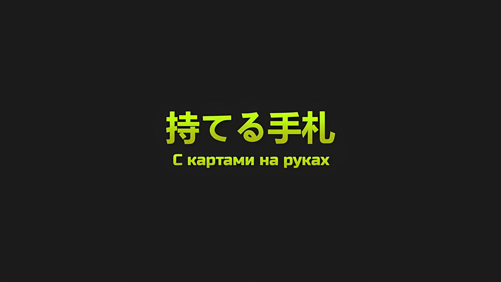
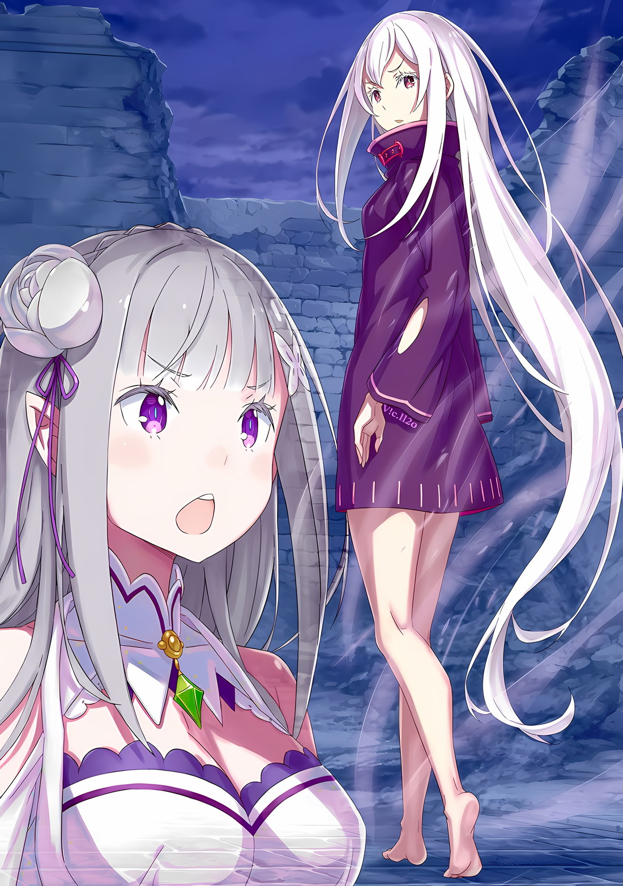

*※※※※※※※※※※※*

…Аракия поглотила «Каменную Глыбу», она поставила свою жизнь на ту же чашу весов, что и выживание Империи Волакия.

Как и сказала Присцилла, комбинация «Техники Брака Душ» и «Меча Грез» Масаюме сильно нарушила планы Сфинкс.

Принести «Великое Бедствие» и наводнить Империю Волакия мертвецами. Всего у Сфинкс было две цели… и одна из них, а именно воспроизведение души «Ведьмы Жадности», увенчалась успехом. Остальное было лишь вопросом времени, пока эта душа не приживется в сосуде, отчего жизнь самой Сфинкс закрасится ее создателем.

До того, как это произойдет и она окончательно исчезнет, у Сфинкс оставалась еще, еще одна цель… месть. Она хотела отомстить Присцилле Бариэль.

Чтобы добиться этого, она собиралась максимально эффективно использовать карты, которые были у нее на руках.

Тем не менее…,

Сфинкс: …Кто-то остановил Магическую Кристальную Пушку, хм?

Сфинкс тихо пробормотала это себе под нос. Это был ее очередной просчет.

В отражении парящих водяных зеркал отражались те, кто действовал в самых разных частях Рапганы. Они противостояли гибели Империи.

Сфинкс, которая приняла форму «Ведьмы Жадности», обратила внимание на мальчика и Духа, ведь им удалось предотвратить атаку Магической Кристальной Пушки, козыря Кристального Дворца.

Дух в облике девочки также помешал и прошлому выстрелу Магической Кристальной Пушки, еще до того, как Сфинкс скомандовала мертвецами «Великого Бедствия» и начала полномасштабное наступление на Империю Волакия. Для Духа такое должно было стать смертельным.

Проделать то же самое через дня два-три и остаться невредимым было невозможно.

А мальчик, который заключил в свои объятия того Духа… нет, это не поддавалось разумному объяснению.

Сфинкс: Снова ты?

Непонятный мальчишка, который объединился с Императором Волакии и сорвал стратагемы неполноценной «Ведьмы» Сфинкс, когда она еще не воспроизвела «Ведьму Жадности».

Честно говоря, если бы в последний момент Сфинкс не разгадала оставшуюся часть воссоздания своей души, дни ее упорного труда, которые длились более трехсот лет, подошли бы к своему концу.

Впрочем, эта угроза сохранялась даже сейчас, когда она достигла «Ведьмы Жадности».

Сфинкс: …«Меч Света» Волакия и Полномочие «Чревоугодия».

Пусть она и преуспела в своем давнем желании воссоздать «Ведьму Жадности», для мертвой Сфинкс тот факт, что эти две единицы были ее роковыми слабостями, так и остался неизменным.

Поэтому Сфинкс породила на свет существ с той же душой, что и у нее, и старалась не приближаться ни к владельцу «Меча Света», ни к тому мальчику-«Пользователю Духовных Искусств».

Вдобавок ко всему…,

Сфинкс: С картами на руках я выйду победителем.

Присцилла: …

Когда Сфинкс сказала это, лицо Присциллы в зеркале воды переменилось.

Принцесса улыбнулась. …В этой улыбке не было ни недовольства, ни дискомфорта; чтобы украсить ее лицо хотя бы толикой печали, Сфинкс сделала бы все, что только могла.

*△▼△▼△▼△*

В далеком небе образовалась пустота и поглотила огонь, который должен был положить конец Империи Волакия.

Нацуки Субару вклинился в траекторию Магической Кристальной Пушки. Это также означало, что Халибель «Хвалитель», Спика и Беатрис выполнили свои роли.

???: Великая услуга. …Однако.

Винсент признал их заслуги, но в то же время беспокоился.

Нейтрализация Магической Кристальной Пушки, решающего оружия Империи, была чревата проблемами.

…Любое государство всегда нуждается в силе устрашения, чтобы удерживать другие страны от вторжения.

Будь то вооруженные силы, сравнимые с соседскими, исключительно сильный человек, с которым бы никто не мог тягаться, или мощное оружие, позволяющее переломить любую ситуацию… если бы хоть что-то из этого отсутствовало, нынешнее процветание Империи никогда бы не наступило.

«Великое Бедствие», вызванное восстанием, свело это все на нет.

Винсент: Каждый из вас разрушил закон железа и крови, который защищал порядок Империи.

Винсент стиснул зубы, чтобы сдержать стыд, и взмахнул «Мечом Света».

Тут же нежить перепрыгнула через нарисованное горизонтальной линией пламя драгоценного меча и бросилась к нему. Эти мертвецы были не такие, как раньше.

Только вот чем же они отличались? Ответ был прост. …Винсент не мог их узнать.

Винсент: Мерзкая «Ведьма», ты поняла это еще до того, как умерла?

В саду перед Кристальным Дворцом, который превратился в поле боя, появились мертвецы. Вероятно, они были важными людьми в древние времена Империи Волакия.

Винсент различал лица и имена всех имперских солдат своего времени; однако он не мог определить личности тех, кто пришел из глубин веков.

Чутье подсказывало ему, что среди мертвецов «Великого Бедствия» была высока доля воскресших из недалекого прошлого. Самые крайние случаи: те, кто погиб, когда боролся с нежитью. …Это было лишь предположение, но души мертвецов перед ним тоже отличались некой свежестью.

Возможно, чем дальше в прошлое уходили души, тем сложнее было их воскрешать — или же требовались большие затраты.

По этой причине большая часть воскрешенных приходилась на недавнее время, а значит, «Звездное Поедание» Субару и его спутницы в связке с памятью Винсента было очень эффективным, тем не менее…,

Винсент: Эффективным только против тех, кто подпадает под нужные условия.

Даже если на воскрешение накладывались какие-то требования, значительные или незначительные, лучшим способом воспрепятствовать «Звездному Поеданию» была нежить, которую не узнает Винсент.

Похоже, «Ведьма» поняла это еще до того, как ее душу поглотило пламя.

Иначе говоря, только «Меч Света» Винсента мог победить древних воинов. …Нет, если речь зашла о «Мече Света», то, кроме самого Винсента, был кое-кто еще.

Винсент: …Присцилла.

Да, он назвал имя своей младшей сестры, которая даже после эвакуации находилась неизвестно где, и продолжил сражаться.

Его непутевая младшая сестра, которую раньше звали Приска Бенедикт, в настоящее время носила имя Присцилла Бариэль.

Когда Винсент узнал, что, покинув Империю, она сменила имя и стала одной из Кандидаток Королевских Выборов в Лугунике, он чуть было не упал в обморок. Впрочем, терпимо.

Она пришла на помощь своей родине вовсе не потому, что беспокоилась за Винсента или Империю. Напротив, она хотела усмирить, смертельно, того, кто владел клинками подосланных к ней убийц.

Вот только та опрометчивая душа уже покинула этот свет.

Винсент: Чиша.

Чиша, тот, кто обманул даже Винсента, бросил вызов мировой судьбе в виде «Великого Бедствия». Он также был в числе тех немногих, кто знал, что Приска выжила как Присцилла.

Чиша, знавший о ее вспыльчивом характере еще со времен Приски, хотел бы, чтобы она поддержала Винсента в борьбе с предстоящим «Великим Бедствием», и поэтому, скорее всего, пошел на решительные меры, дабы переманить ее к себе.

Под своим белым бесстрастным лицом он, возможно, даже думал о том, как следует поступить с троном Императора после войны…,

*Чиша:* *«Я так далеко зашел, мне придется пересмотреть свое мнение о Его Превосходительстве.»*

На эхо слов Чиши, воплощения непочтительности и неверности Императору, он цокнул языком.

Винсент отбросил недовольство этими чересчур реальными видениями и сохранил в памяти, как свой долг, прощальный подарок от Чиши… решение о том, как следует поступить с Присциллой.

Похоже, что Присцилла жива, ведь Сфинкс пыталась привести Винсента к ней. Одного этого было достаточно.

Что касается необходимости в увеличении «Мечей Света», то она уйдет сама собой, когда Винсент освоится с ролью верхушки Земли Волков Меча. …Именно в тот момент, когда эта мысль пришла ему в голову.

???: …Стремление твое доблестно и великолепно. Как твой предок, я преисполнен гордости.

Средь лязга мечей глубокий, звучный голос ударил по барабанным перепонкам Винсента.

Одновременно с этим его поле зрения по диагонали рассек удар меча, настолько потрясающий, что Винсент, которому доводилось наблюдать за мастерством многих воинов, счел его непревзойденным.

Этот удар обрушился на древних воинов, которые осмелились ранить благородного Винсента, и, не в силах уклониться, их тела… нет, их души воспламенились.

Другими словами, это был удар «Меча Света».

Винсент: …

Еще секунду назад он рассудил, что не стоит надеяться на подкрепление в виде других багровых мечей.

Потому-то глаза Винсента и расширились при появлении столь неожиданной помощи, а когда он украдкой взглянул на профиль человека, что встал к нему спиной, у него вдруг перехватило дыхание.

Знакомый лик. …Он видел его на старинных картинах.

Винсент: …«Император Терний»?

???: Корона Императора надлежащим образом передается из поколения в поколение, ныне же она принадлежит тебе. Притязать на титул «Императора Терний» для меня было бы верхом дурости. …Я — Югард Волакия.

Винсент: …

Югард: Хм. Выглядишь ты проницательным и благосклонным. Признаться, никогда не видел вблизи лиц своих детей и потомков. Если возможно, я бы хотел обменяться с тобой многими словами и подолгу рассматривать твое лицо.

Пока говорил этот человек… нежить, назвавшаяся Югардом Волакией, Винсент хранил молчание.

Спокойная аура, которую он излучал, глаза, в которых горел свет разума, и кожа цвета жизни отличали его от бесчисленных мертвецов, что встречались ему до сих пор. Почему же в нем не было той враждебности к живым, которая так присуща нежити, или признаков того, что он лишен свободы воли?

Югард: Из-за любви к Звезде Моей.

Винсент: Что?

Югард: Разве ты сейчас не задался вопросом, почему я отличаюсь от другой нежити? Получается, я ошибся?

На мгновение Винсент попытался уловить истинный смысл этих слов, но быстро сдался.

Ему пришлось все переосмыслить. Ведь если Югард Волакия и правда был тем самым персонажем, о котором рассказывалось в старой сказке «Ирис и Терновый Король», то сомневаться в его словах, пусть и непонятных, было бы глупо.

Посему…,

Винсент: Нынешний Император Волакии, Винсент Волакия.

Югард: Понял. Так давай же выступим. О дитя моих детей.

Таков был ответ Югарда на представление Винсента. Два Императора встали бок о бок.

В обычной ситуации это было бы невозможно, ведь по закону железа и крови обряд наследования трона, «Церемония Императорского Отбора», происходил после смерти Императора. Два Волка Меча выступили единым фронтом.

*△▼△▼△▼△*

…Ожесточенная битва за решение судьбы мира все еще продолжалась.

Битва на каждом бастионе между трансцендентными существами завершалась одна за другой: и живые, и мертвые выкладывались по полной, одни терпели поражение, другие шли вперед.

Словно в насмешку над усилиями всех собравшихся, две беды попытались свести все на нет: звездный свет, что пронзил небо, был сражен мечником с мечтой, а огонь уничтожения, созданный за счет жизней бесчисленных Духов, был остановлен мальчиком, который вместе со своими друзьями воспротивился судьбе.

Дабы предотвратить эти беды, каждый из них использовал всю свою силу.

Однако наибольший вклад в военную ситуацию для живых внесло не то, что звездный свет и огонь уничтожения были предотвращены, а человек, который в одиночку остановил следующий этап «Великого Бедствия». И никто другой не смог бы этого осознать или достичь…,

???: …Боже правый, слишком, слишком много вы заставляете бедных стариков напрягать свои слабые косточки.

«Порочный Старик» Ольбарт Данкелькен подпрыгивал своим маленьким телом и ворчал.

Низкими прыжками и ползущими движениями глава шиноби, чудовищный старик, нацелился на колдуна-нежить, который охранял кроваво-красный магический круг, что был нарисован в конце прохода.

Колдун повернул ладонь в сторону Ольбарта, и тут же черная грязь, стекающая со стен и пола вокруг него, образовала цепи, которые с грохотом сковали конечности бедного старика…,

Ольбарт: Я в этом деле уже целых девяносто лет, усек момент?

Быстрее, чем цепи успели до него дотянуться, Ольбарт стремительно взмахнул правой рукой… той, что отсутствовала ниже локтя, и метнул кунай из якобы пустого рукава.

Он молниеносно пронзил межбровье колдуна, который с опаской следил за его приближением, и воткнулся в магический круг на стене. Сразу же после этого Ольбарт нанес удар своей левой и пробил насквозь и колдуна, и магический круг.

Его боевые искусства, которые он оттачивал столько, сколько себя помнил, просто разнесли их вдребезги.

Ему было строго приказано убивать нежить только в случае крайней необходимости. Но то уродство с испорченной душой и такие противники, как этот колдун, вынудили его нарушить это правило.

Он разобрался примерно с десятью колдунами, охранявшими магический круг, который искажал все пространство внутри замка…,

Ольбарт: …Дело сделано.

Ольбарт пробормотал это, ощущая перемену в воздухе своей сухой, старой кожей.

Оглядев Кристальный Дворец глазами, которые скрывали густые брови, старик почувствовал, что в этом месте царила странная атмосфера… он заметил, что аномалия, превратившая знакомую структуру дворца в странное, волшебное место, исчезла.

Соединенных дверей больше не было, а окно, через которое он вошел, теперь вело не туда, куда нужно; неясно, была ли это иллюзорная техника или магия, искажающая само пространство, но в любом случае…,

Ольбарт: Так, с работой здесь поко… ой, ой, это хреново, да?

Столкнувшись с новой проблемой сразу после решения предыдущей, Ольбарт затих от внезапного поворота событий.

Пространство больше не искажалось, и в следующей возникшей аномалии было легко разобраться. …Весь дворец заряжался мощными волнами маны. Магическая Кристальная Пушка была приведена в действие.

Ольбарт: Да пропади все пропадом, Могуро, продержись еще немного.

Почувствовав вибрации от активации Магической Кристальной Пушки, Ольбарт пожаловался на ядро Кристального Дворца, Могуро Хагане… «Стального», известного как «Метеор» Кристального Дворца.

До сих пор достохвальный Могуро послушно исполнял указания Винсента и старался помешать «Великому Бедствию» использовать Магическую Кристальную Пушку, однако, похоже, у него не получилось.

Ужасало то, что такое мощное оружие теперь было в руках противника.

Ольбарт: Если они сейчас целятся в Гарклу, то мы по уши в дерьме.

«Укрепленный Город» взял на себя полчища мертвецов, исход его осады был решающим фактором для выживания Империи, поэтому ему было необходимо сохранить свои мощные оборонительные стены. Если бы Магическая Кристальная Пушка разнесла их, то ситуация резко бы изменилась, и город оказался бы разрушен.

Для Империи Волакия это был бы необратимый урон.

Даже если Ольбарту и остальным удастся убить организатора «Великого Бедствия», из-за гибели людей в Укрепленном Городе восстановиться будет невозможно. Это означало бы конец Империи Волакия.

…У Ольбарта Данкелькена были амбиции.

Как глава шиноби, деятельность которых должна была оставаться в тени, он хотел оставить свой великий след в истории Империи и разрушить сам образ жизни шиноби, образ, которому он посвятил всю свою жизнь.

Именно поэтому его часто манили такие яркие идеи, как быстрое восстание против Императора или его убийство. Однако «Великое Бедствие» свело эти планы на нет, и, хотя чувство, что он упустил свою возможность для предательства, так его и не покидало, прямо здесь и сейчас этот шанс снова дал о себе знать.

Если Магическая Кристальная Пушка определит успех «Великого Бедствия», то Ольбарт реализует свои амбиции не как «Генерал» Империи, а скорее как шиноби.

Что бы ни готовило «Великое Бедствие», он величественно ринется на сторону Винсента, вырвет у него победу и удовлетворит свои амбиции.

А значит…,

Ольбарт: …Пускай это и стало бы моим последним предательством.

Когда искажение пространства было ликвидировано, Ольбарт побежал вверх по дворцу и добрался до башни Магической Кристальной Пушки. Там он увидел, как огонь уничтожения поглощает огромная пустота в небе. Его белые брови трепетали от последствий этого выстрела, который был выпущен с очень небольшого расстояния.

Если бы Магическая Кристальная Пушка предопределила уничтожение Империи, Ольбарт мог бы предать ее без всякого сожаления.

Однако этого не произошло.

Ольбарт: Какакакка! Этот юнец, не только в Городе Демонов, но и здесь, он сделал это и здесь! Честное слово, молодежь в наше время стариков совсем не уважает!

Ольбарт от души рассмеялся при виде двух далеких фигур в небе: черноволосого паренька и маленькой девочки-Духа.

Это был уже второй раз, включая Хаосфлейм, когда все ожидания Ольбарта перечеркнул тот юнец. Однако старик не чувствовал ни злости, ни ненависти.

С возрастом становится легче отказаться от многих вещей… но сейчас причина была не в этом. Ольбарт был не из тех, кто так легко сдается. И поэтому он не сдался. Он просто признал свое поражение.

Ольбарт: Если ж они сумеют меня превзойти, то так тому и быть.

Ольбарт прожил почти сто лет и имел множество несбывшихся мечт. Конечно, многие из них он осуществлял силой. Так уж повелось.

В конце концов, Ольбарт отказался от давней мечты убить Императора и оставить свое имя в истории. С точки зрения Империи, это было бы таким же актом жестокости, как поступок человека-волка, убившего Ирис.

Он отказался от своего заветного желания и приготовил левую руку для удара карате…,

Ольбарт: …Что ж, тогда станем Героями, которые спасут эту страну, да? Осуществим же мою новую мечту.

???: …

Ольбарт слабо улыбнулся. Перед ним, около пушки, стояла беловолосая девушка.

На вершине Кристального Дворца, на башне Магической Кристальной Пушки, которая только что закончила выпускать огонь уничтожения, витал знойный и будоражащий чувства поток маны.

И в самом его центре возвышался краеугольный камень Кристального Дворца с магическими кристаллами разных размеров, основа, в которую было установлено Магическое Ядро, сердце Магической Кристальной Пушки; беловолосая девушка улыбнулась и положила руку на этот пьедестал.

А затем…,

???: Твое присутствие здесь нежелательно. …Устранение: Требуется.

????: Прекрати, Ольбарт. Противник, «Ведьма».

Черный ветер начал кружить вокруг улыбающейся девушки… «Ведьмы», а само Магическое Ядро заговорило голосом Могуро.

Ольбарт лишь усмехнулся очевидному предупреждению «Стального»,

Ольбарт: И без тебя бы понял. …Я пока еще не впал в старческий маразм.

«Порочный Старик» ударил ногой по земле и окончательно отбросил свою мечту… он отложил гибель Империи, которая могла бы произойти в этот момент.

*△▼△▼△▼△*

Субару: Такого я не позволю! …Давай же, о неизбежная судьба!!!

Аль Шамак поглотил один из выстрелов Магической Кристальной Пушки.

Субару чувствовал, как из него вытягиваются силы, однако он был беспочвенно уверен, что сможет выдержать безрассудство Беатрис.

…Нет, теперь, когда это удалось, он мог подтвердить это как вполне обоснованное убеждение.

Субару: Возможно, дело в силе связи!

«Кор Леонис» Субару, который мог брать на себя и распределять бремя, оставался связан со всеми членами «Эскадрона Плеяд», что находились далеко от него.

Он не только увеличивал силу каждой отдельной единицы, но и подставлял плечо тем, кто отставал, подталкивал их вперед и распределял жизненную энергию, чтобы двигаться сообща.

Эта сила олицетворяла собой воплощение фразы «Один за Всех и Все за Одного».

Вполне вероятно, а может, даже вероятнее всего, что именно в этот момент на всех, кто сражался в «Укрепленном Городе», внезапно легло непосильное бремя, однако ему хотелось верить, что все будет хорошо.

В любом случае…,

Беатрис: Остановить это было делом крайне необходимым, я полагаю!

Субару: А?! Я был уверен, что враги целились в Гарклу…

Субару следил за тем, как закрывается пустота в небе, и ответил Беатрис, которая повысила голос.

Субару и остальные, полные решимости остановить Магическую Кристальную Пушку, бросились на линию ее огня, думая, что она нацелена на Укрепленный Город.

Больше всего они боялись, что Укрепленный Город, где в настоящее время разворачивалась битва века, получит непоправимый урон.

Однако, когда они помешали этому, то оказалось, что Магическая Кристальная Пушка была нацелена на южную часть столицы Империи.

Субару: Думаю, они не стали бы бессмысленно атаковать. У них наверняка был план.

Беатрис: …Юг. Они что, целились в Гарфиэля?

Субару: Конечно, наш Гарфиэль словно младший брат, который ничего не боится, но…

На первом бастионе, самой южной точке столицы Империи, находился «Облачный Дракон» Мезорея, который защищал широчайшую территорию, и одолеть его было поручено одному лишь Гарфиэлю.

Честно говоря, это было не просто неосторожно, а совершенно безумно, абсурдно и безрассудно. Однако эту ключевую роль можно было доверить лишь Гарфиэлю. С учетом ее важности вполне возможно, что противник целился именно в него.

Субару: Кто бы мог это сделать? Теперь, когда мы разделались со Сфинкс, кто же будет следующим?

Беатрис: …Может, это воскрешенный Император Волакии или кто-то вроде того, я полагаю.

Субару: Пожалуйста, не давай мне еще больше причин не хотеть помогать Империи…!

Он не хотел, чтобы, когда казалось, что Сфинкс побеждена, вдруг восстали предыдущие Императоры Волакии и стали финальным боссом.

Во-первых, если это произойдет, будет непонятно, сколько Императоров придется одолеть.

Беатрис: Однако, судя по тому, как они организовывали эту атаку, у них была четкая цель. Вот почему…

Субару: …Беако!

Субару резко окликнул Беатрис, когда та уставилась на приближающуюся землю, ее дрели-близнецы развевались на ветру.

Он обхватил щеки Беатрис ладонями и заставил ее посмотреть в сторону. Их взгляды сошлись, и они увидели отражение огромной, величественной фигуры, яростно летящей по небу… «Трехголового» Дракона.

Злой Дракон, который атаковал их на соединенных драконьих повозках и которого тогда победил Халибель, возродился и теперь надвигался на Субару и Беатрис, которые разобрались с выстрелом Магической Кристальной Пушки.

Субару: Вот дерьмо, все очень плохо, мы никак не уйдем!

Беатрис: …! А вот и его дыхание, я полагаю!

С явной враждебностью три головы Злого Дракона повернулись к ним.

Субару и Беатрис, которые обнялись, когда падали вниз, находились довольно далеко от своих надежных товарищей — Спики и Халибеля.

Беатрис: Развеиваю Мулак, в самом деле!

Субару: Незримое Провидение!

Когда дыхание Злого Дракона превратилось в черный луч огня, Субару и Беатрис четко скоординировали свои действия… эффект Мулака, который сводил гравитацию на нет, развеялся на Субару, отчего скорость их падения, которая до этого была подобна скорости танцующих в воздухе листьев, стала набирать обороты, и они ускорились еще больше, когда он с помощью Незримого Провидения швырнул себя вниз.

Таким образом, они ушли с линии огня Злого Дракона. …Однако спаслись они только от первого дыхания.

Тут же две другие головы приготовились выпустить такое же дыхание…,

Субару: …Кх.

Он отчаянно искал в своей голове способ спастись, способ, который имел бы смысл и сработал бы прямо здесь и сейчас.

Когда его мысли закрутились с бешеной скоростью, а все тело охватило ощущение, будто он в огне, Субару быстро прикусил моляры и крепко прижал Беатрис к себе.

И тут, когда он уже собирался озвучить свои мысли.

???: …Божеее~, в отличие от меня, вы оба не умеете летать, так что я бы хотел, чтобы вы больше не устраивали мне таких сюрприиизов~.

Затем Субару и Беатрис отшатнулись от голоса, в котором плавало раздражение и веселье.

Дыхание Злого Дракона превратилось в два черных луча, которые пронеслись по небу столицы Империи, однако все обошлось, они избежали угрозы. Ведь их схватили чьи-то длинные стройные руки.

Это был…,

Субару: Розвааль! Найс тайминг*! Ты нас спас!

* Nice timing — как раз вовремя.

Беатрис: Как же это унизительно, я полагаю! Так держать Бетти недопустимо, в самом деле!

Розвааль: Ну-ну, что за две противоположные реааакции~.

Розвааль, летающий маг, ухмыльнулся реакциям, исходящим слева и справа от него, от Субару и Беатрис.

Он обнял Субару и Беатрис за талии и прижал их к себе, свободно паря в воздухе и забавляясь со Злым Драконом… «Трехголовым» Вальгреном, который хлопал крыльями,

Розвааль: Молодцы, что остановили Магическую Кристальную Пушку. Какова наша нынешняя ситуааация~?

Субару: Сфинкс повержена! Возможно, причина появления зомби кроется в Кристальном Дворце! А еще мы не знаем точно, на что была нацелена Магическая Кристальная Пушка!

Розвааль: Сфинкс? Это одновременно и счастье, и разочарование, однако…

Беатрис: …? Это жалоба или беспокойство, я полагаю?

Беатрис была беспощадна, если дело касалось слов и действий Розвааля, но выражение лица Маркграфа стало слегка мрачным, когда он сузил свои разноцветные глаза.

Лицо Розвааля имело гораздо более жуткое выражение, чем обычно, и это заставило Субару насторожиться.

Как ни в чем не бывало, Розвааль продолжил, словно говорил не с Субару и Беатрис, а с самим собой.

Розвааль: Еще с момента срыва решающей битвы за столицу Империи наши противники старательно нам мешали. То же самое касается и выстрела из этой Магической Кристальной Пушки… неужели это все? Серьезно?

Так он сказал.

*△▼△▼△▼△*

…Винсент и Югард, два Императора Волакии, которые в обычных условиях не смогли бы доверить друг другу свои спины, исполняли танец с багровыми мечами, которые заставляли вспыхивать все ярким пламенем, что бушевал подобно урагану.

Танза: Уму непостижимо…

Танза удивленно сказала это, глядя на зрелище, которое, словно иллюзия, жгло ей глаза.

Югард, почувствовав со стороны Кристального Дворца признаки битвы, пошел вперед, и к тому времени, когда Танза, держась за руки с Йорной, догнала его, два Императора уже сражались вместе.

Нежить, чьи души воспламенялись от «Меча Света», была очень сильна — между ними и Роуэном не было особой разницы.

Завывающие ветры багровых мечей сдерживали мертвецов, они подавлялись совместными усилиями Югарда и Винсента, которые не обменивались ни словами, ни взглядами.

Йорна: …Впервые вижу, чтобы Его Превосходительство так с кем-то махал мечом.

Внезапно Йорна, которая смотрела на ту же сцену, что и Танза, подметила это.

Танза не могла постичь всю глубину эмоций, которые стояли за этими словами. …Глаза и голос девочки дрожали — такая реакция была следствием того, что Йорна годами опиралась на Танзу.

Очевидно, она не знала подробностей ситуации.

Однако Йорна была влюблена в Югарда, который вернулся из далекого прошлого, и она знала, что в этом есть нечто большее, чем простое долгожительство.

То, что Танза ничего не знала об этих отношениях, давало место чувству иерархии отношений между ней и Югардом.

Йорна: Я люблю и тебя, Танза, и Его Превосходительство. Вы оба мне очень дороги, и я люблю вас обоих, просто по-разному.

Танза: Ах…

Тревога, что закралась в ее сердце, была насквозь замечена Йорной, отчего Танзе захотелось спрятать свое лицо в ладонях.

Однако рука Танзы сжимала руку Йорны, девочка опиралась на это чувство, и, держа в сердце причину, по которой здесь стоит, она прекратила свои стенания.

Она должна стоять с гордо поднятой головой.

Это было то, что объединяло Танзу со всеми удивительными людьми, которых она когда-либо встречала.

Танза: …Кх.

Она скрежетнула зубами. Нервы Танзы были на пределе.

Ей доверили защищать Йорну, которая была не в лучшей форме, а возможно, и эмоционально травмирована после битвы с ужасным Роуэном. Танза не могла положиться ни на Югарда, который сейчас сражался, ни даже на Эмилию, которая отделилась от нее по пути сюда.

Поэтому, пока Танза не могла присоединиться к Югарду и Винсенту в их битве, все, что она могла сделать, — это первой заметить что-нибудь странное…

Танза: …Йорна-сама! Смотрите!

Ее бдительность оправдалась.

Круглые глаза Танзы расширились, и она указала на вершину Кристального Дворца. Тут же Йорна посмотрела вверх.

Их взгляды упали на полусферическую башню… Танза была не в курсе, но именно в этой башне находилась Магическая Кристальная Пушка, козырь Кристального Дворца.

Башня светилась изнутри, и тут, в результате сильного взрыва, ее стены разлетелись на куски. Танза растерянно моргнула при виде того, как эффектно разлетаются осколки дворца.

Следом из густого шлейфа дыма появилась маленькая тень…,

Йорна: Старик Ольбарт?

Она была озадачена и удивлена.

Медленно Ольбарт выбрался из развалин стены. На лице его не было привычного спокойствия и отстраненности. Пятна крови проступили сквозь его изорванную одежду.

В тот же миг Ольбарт заметил Танзу и других живых людей…,

Ольбарт: Ваше Превосходительство! Плохи дела! У «Ведьмы» еще есть что выкинуть!

И вот, его голос, пронизанный нотками отчаяния, закричал, как бы нагнетая обстановку. Ольбарт был сам не свой.

*△▼△▼△▼△*

В то же самое время, когда окровавленный Ольбарт кричал во всю глотку, Эмилия стояла и размышляла о своем внезапном поступке, основой которого стало чутье.

Это было серьезное решение — ослушаться Субару и Авеля, которые так старательно продумывали наилучший план действий, и отделиться от Танзы, Йорны и остальных.

Эмилия: Если бы оказалось, что я беспокоилась зря, то сразу бы поспешила обратно к Танзе-чан и остальным, вот только…

Она почувствовала легкое беспокойство и перемену в воздухе, отчего побежала не к Кристальному Дворцу, а дальше на север.

И там она встретила того, кого не должна была встретить.

Если бы кто-то просто находился там, то нельзя было бы ни с того ни с сего подумать, что он замышляет что-то недоброе. Однако эта особа была своего рода исключением.

В конце концов…,

Эмилия: Я ооочень удивилась, когда тебя увидела… Почему ты здесь, Ехидна?

На ее зов беловолосая «Ведьма» обернулась.

В голосе Эмилии не было ни малейшего намека на замешательство прекрасной внешностью «Ведьмы».

Ведьма: Думаю, мое удивление здесь более уместно. …«Ведьма Зависти».

Заявила она.
