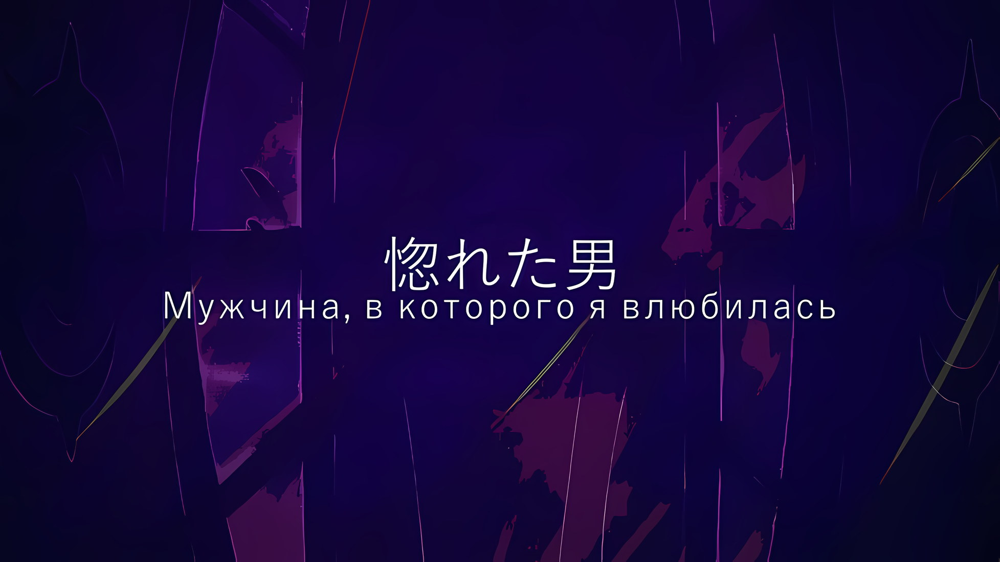

*※※※※※※※※※※※*

…Эмилия удивленно расширила глаза, когда ее назвали «Ведьмой Зависти».

Причина ее удивления была двоякой: во-первых, к ней уже очень давно так не обращались, а во-вторых, это ей никак не навредило.

С момента начала Королевских Выборов прошло уже больше года, и в Лугунике только единицы не знали, что одной из Кандидаток стала сребровласая полуэльфийка с аметистовыми глазами.

Если говорить языком Субару, то Эмилия, как и подобает Эмилии, завоевала широкую известность.

Так что даже случаи, когда ей приходилось надевать свою привычную мантию, которая скрывала ее личность, происходили все реже. Однако в Империи она все-таки надела ее, чтобы никто не узнал в ней Эмилию.

Потому-то ее давно и не называли «Ведьмой Зависти». Но даже сейчас, когда ее так назвали, она сохраняла спокойствие. …Ведь у нее была решимость сказать: «Вы ошибаетесь».

В ней жила уверенность. Был человек, который признал Эмилию Эмилией и сказал: «Я люблю тебя».

Эмилия: Я Эмилия, просто Эмилия, а не «Ведьма Зависти».

Она выпрямилась и дала такой полный убежденности ответ.

Затем Эмилия внимательно посмотрела на знакомую беловолосую девушку и,

Эмилия: Хоть и выглядишь ты точно так же, но… ты не Ехидна, да? Может, ты двойняшка Ехидны, вроде Рам и Рем? Старшая сестра Ехидны? Или младшая?

???: …Похоже, воображения у тебя хоть отбавляй. Я — творенье своего создателя, а не кровный родственник. Поправка: Требуется.

Эмилия: Творени-, творенье…

Эмилия нахмурилась, когда услышала незнакомое слово, однако все равно поняла его суть. Эта девушка не приходилась Ехидне сестрой.

«Ведьма Жадности» жила четыреста лет тому назад. Спокойно пораскинув мозгами, можно понять, что было бы очень странно встретить здесь саму Ехидну или же ее сестру. Конечно, поскольку сейчас воскрешались умершие люди, на это все-таки был шанс.

Эмилия: Но ты выглядишь живой и здоровой.

У этой девушки были нормальная кожа и глаза. Но, если сравнивать с Ехидной, лицо ее казалось более строгим.

Ехидна, которую она знала, обычно выглядела злобной. …А ее заплаканное лицо, которое она показала в конце испытания, все еще оставалось в сердце Эмилии.

Эмилия: Ммм, раз ты не Ехидна, могу я узнать как тебя зовут?

???: Да, мне тоже неудобно, когда меня называют именем моего создателя. Пожалуйста, называй меня «Ведьмой Жадности».

Эмилия: …А у тебя есть более простое имя?

???: …Ответ: Требуется. Если не это, то Сфинкс.

Эмилия: О, хоро… подожди! Сфинкс!?

Она тут же поняла, что это имя центральной фигуры, из-за которой началось «Великое Бедствие».

Насколько было известно Эмилии, Сфинкс выглядела в точности как Рюдзу.

Эмилия: А разве Рюдзу-сан и Ехидна не тесно связаны со «Святилищем»? Тогда, интересно, кем ты станешь дальше — Гарфиэлем или Фредерикой…

Сфинкс: Ты тоже знаешь о «Святилище»? Похоже, у нас с тобой более глубокая связь, чем я предполагала… Под Эмилией ты имеешь в виду Кандидатку Королевских Выборов, такую как Присцилла Бариэль?

Эмилия: Э? Да, все так. Нам нужно поскорее найти Присциллу и вернуть ее домой, иначе…

Сфинкс: …Устранение: Требуется.

В этот момент Сфинкс слегка наклонила голову… и из ее пальца вырвался белый свет. Эмилия рефлекторно создала ледяное зеркало и отразила его в сторону.

Если бы Эмилия владела атрибутом Земли, а не Огня, то земляная или каменная стена оказалась бы пробита насквозь одним выстрелом, отчего она, возможно, получила бы смертельную рану.

Это была до такой степени кровожадная атака, что от нее хотелось задрожать.

Тем не менее…,

Эмилия: Господи! Какое резкое начало!

Это был не единичный выстрел; за Эмилией, когда ее серебристые волосы заплясали, устремился другой луч света. Битва началась.

Ее противник выглядел точь-в-точь как Ехидна, и так же, как и Ехидна, хорошо владел магией.

Впрочем, то же самое можно было сказать и об Эмилии.

Эмилия: Если это то, чего ты так хочешь, то я тоже выложусь на все сто! Я сделаю так, чтобы ты не двигалась, и отведу тебя к Субару и остальным!

Сфинкс: Снова встречаться с ними я не собираюсь. Я заберу твою жизнь здесь и посмотрю, какое лицо будет у Присциллы Бариэль.

Эмилия: …! Ты знаешь, где Присцилла?

Свет летел со всех сторон, Эмилия отражала его ледяным мечом, который сверкал, подобно зеркалу. Вдруг ее аметистовые глаза заблестели, когда она услышала слова Сфинкс.

Она догадывалась, что Присцилла по каким-то причинам хотела отправиться в Кристальный Дворец и поэтому, скорее всего, сейчас находится там. Но лучше всего было бы узнать у Сфинкс ее точное местонахождение.

Тем более Эмилия твердо решила не проиграть. Сфинкс, у которой было такое же лицо, как у Ехидны, сузила глаза на энтузиазм Эмилии и с легким недовольством сказала,

Сфинкс: Будет проблемой, если я не смогу обезопасить это место. …Отпор: Требуется.

Пробормотала она.

*△▼△▼△▼△*

У батареи Магической Кристальной Пушки, которая была установлена на самом высоком этаже Кристального Дворца, внутри шпиля, где она и работала, вспыхнула битва.

Помещение было слишком широким, если учитывать его предназначение, но, так как здесь были стены и потолок, такое замкнутое пространство стало выгодным полем боя для Ольбарта.

Сила техник шиноби лежала в их разнообразии и применимости. Хотя они разрабатывались для выполнения заданий в любых условиях, все техники сводились к одному — лишить противника жизни.

Это поле боя было просто идеальным.

Ольбарт: Когда дело доходит до тесноты, разве маги не пытаются прогнуться под ограничения?

По сути своей битва — это противостояние сильных сторон одного против слабых сторон другого.

И на этом был основан боевой стиль Ольбарта, как шиноби. Нет, точнее, чтобы учитывать слабости всевозможных противников, он специально избегал создания собственной специализации.

До прихода Ольбарта на пост главы шиноби обычно приветствовалось придерживаться какой-то одной техники.

Идея специализации на одном навыке подходила только избранным, таким как Сесилус и Аракия, которые владели единственной техникой, эффективной против любого противника. Люди же с обычными способностями должны были приспосабливаться, иначе бы они просто не выжили.

Ольбарт заботился только о собственной жизни, ему было совершенно плевать сколько людей умрет, однако он сочувствовал шиноби, которые умерли только потому, что их неправильно обучили.

Поэтому, когда Ольбарт стал главным, он сразу же отверг специализацию на одной технике.

Вместо того чтобы слепо оттачивать свой особый навык, он старательно тренировался в стратегиях, призванных ослабить сильные стороны противника, и изучал приемы ведения боя так, чтобы выжать максимум из этой ситуации. Правда, это изменение давало свои плоды не сразу. Лишь немногие смогли сформироваться должным образом, и последней из них стала талантливая девушка, которая пришла в деревню шиноби четыре или пять лет назад.

Судя по всему, та гениальная девушка тоже скончалась, так что растить таких талантливых личностей было делом заведомо гиблым.

…На самом деле, вся его жизнь была наполнена одними лишь сожалениями.

Ольбарт: Дайте же мне, наконец, повод дожить до старости.

Он оттолкнулся от пола и бросил осколки разбитого камня в «Ведьму», в ее голову.

Ольбарт размахивал правой рукой без кисти и левой, швыряя кунаи, которые долетали до цели с задержкой. Затем старик оттолкнулся от земли.

Будь то уклонение от летящих обломков, от ударов руки Ольбарта или от кунаев, что летели на нее со всех сторон… все эти действия лишали «Ведьму» возможности взять инициативу в свои руки и угрожали ее жизни.

В ответ на атаки старика-шиноби…,

Ведьма: …Смена Плана: Требуется.

Беловолосая «Ведьма» слегка прищурилась и приняла на себя все удары без какого-либо сопротивления.

Ольбарт: …

Летящие осколки рассекли ей лоб, кунаи вонзились в шею и бедро, а грудь насквозь пробила рука Ольбарта. Но даже тогда «Ведьма» не шелохнулась.

«Ведьма» не успевала реагировать на движения Ольбарта. …Нет, «Ведьма» следила за ними. Она не была такой медлительной, как казалось по ее внешнему виду, — к такому выводу пришел Ольбарт.

Другими словами, «Ведьма» могла что-то предпринять, но ничего не сделала. …Нет, она просто продолжала делать то, что делала.

Через мгновение вокруг Ольбарта и «Ведьмы», которые стояли совсем рядом друг с другом, начали возникать бесчисленные сферы света, каждая размером с кулак.

???: Ольбарт!

Так крикнул Могуро, кажется, он все понял. Ольбарт приподнял свою длинную бровь и посмотрел на «Ведьму».

«Ведьма», чей прекрасный лик ничуть не дрогнул, не сводила глаз с Ольбарта, она ждала его дальнейших действий. Этот взгляд, он словно заглядывал в глубины его девяностолетней жизни. Ольбарта даже немного затошнило.

Тут же Ольбарт расставил новые приоритеты. Вместо того чтобы метить в жизнь «Ведьмы», он будет мешать ее целям.

Смертельные раны по всему ее телу и пробитая грудь — даже так, она все равно держала руку на пьедестале… он решил прервать поток маны, который «Ведьма» вливала в Магическое Ядро Кристального Дворца.

Ольбарт: Знаешь, поговаривают, что преследование — это то, из чего мы, шиноби, сделаны.

В тот же миг запястье «Ведьмы», что касалось пьедестала, разлетелось от взметнувшихся вверх пальцев ног… бесчисленные сферы света сразу же рванули вперед, чтобы уничтожить низкорослого Ольбарта вместе с «Ведьмой», которая их и создала.

*△▼△▼△▼△*

Винсент: …Йорна Миссигр!

Винсент вдруг почувствовал, что что-то не так, он моментально сделал шаг назад и повысил голос, чтобы обратиться к Йорне.

Голос Ольбарта, который доносился сверху — из полуразрушенной батареи Магической Кристальной Пушки, звучал срочно, в нем не было привычного спокойствия «Порочного Старика».

Винсент отвел взгляд в сторону, взмахнул своим «Мечом Света» и встретился взглядом с Югардом, который сдерживал нежить поблизости.

Югард: Тебе нужно идти.

Винсент оставил это место Югарду, который быстро понял его намерения, и поспешил к Йорне. Поймав взгляд Императора и на мгновение растерявшись, Йорна поджала губы и отпустила руку девочки-оленя… Танзы,

Йорна: Танза, пожалуйста, помоги Его Превосходительству Винсенту!

Танза: …! Да, поняла.

Танза подняла подбородок, соглашаясь с призывом Йорны, сложила руки чашечкой и слегка наклонилась. Поняв ее намерения, Винсент ловко подпрыгнул и приземлился ногами в маленькие ладони девочки.

Затем она с силой взмахнула своими тонкими руками и запустила Императора в небо… прямо вверх, к самому верхнему этажу Кристального Дворца.

Винсент: …Кх.

Ей не хватило немного силы, поэтому Винсент оттолкнулся от стены дворца, чтобы компенсировать нужное расстояние, и оказался на самом верхнем этаже, который возвышался более чем на пять метров над ним. Его посетила мысль, что он делает что-то похожее на Сесилуса, который полностью перепрыгивал ступеньки, однако эта мысль быстро исчезла.

В конце концов, Винсент впервые видел Ольбарта в таком состоянии.

Ольбарт: Какакакка…! Вы ж подумали, что я умер, когда меня увидели, ну не умора ли?

Вдоль полуразрушенной стены батареи сидел Ольбарт, поджав колени, и тихо хохотал. Тем не менее, он был весь в крови, а его характерные длинные брови обвисли. Среди всех его ран самой серьезной, несомненно, была левая рука, которую ему оторвало вслед за правой.

Если Ольбарт ввязался в такой ближний бой, то насколько же могущественная личность там была?

…Нет, сейчас важно другое.

Винсент: Прежде чем умереть, скажи вот что. Что замышляет «Ведьма»?

Ольбарт: Каккака, очень жестоко, очень жестоко, за что вы так с пожилыми людьми… Если вы посмотрите на Могуро, то сразу все поймете.

Винсент: Могуро Хагане…

Пока Ольбарт кашлял кровью, Винсент повернулся и посмотрел на пьедестал внутри разрушенной батареи. Там была вмонтирована зеленая сфера… Магическое Ядро.

Кристальный Дворец, построенный из несметного количества магических кристаллов, представлял собой невиданное скопление маны и был равносилен большой бомбе. Причина, по которой его разместили в столице Империи, крылась в Магическом Ядре, что управляло этой мощью.

Магическое Ядро служило сердцем Кристального Дворца. …Черные глаза Винсента заметили растущую угрозу в зеленом мерцании этого сердца.

Что означало…,

Винсент: …Враг хочет перегрузить Магическое Ядро и взорвать Кристальный Дворец вместе со всей столицей Империи!

Магическое Ядро: Ольбарт, помешал. «Ведьма», остановилась, на полпути.

Гамбит «Ведьмы», о котором рассказал Ольбарт, заставил Винсента содрогнуться, он понял истинные намерения того, что хотят сделать с Магическим Ядром… голос Могуро Хагане лишь подтвердил его опасения.

Как было сказано ранее, благодаря Магическому Ядру, магические кристаллы Кристального Дворца оставались стабильными. Однако, вливая в него огромное количество маны, «Ведьма» создавала значительную нагрузку на его вычислительную мощность. Ее целью было заставить Магическое Ядро потерять контроль, нарушить гармонию магических кристаллов и взорвать весь город.

Императора охватила тревога.

Винсент: «Ведьма» была здесь, перед тем как сгореть?

Могуро: Неверно. «Ведьма», не сгорела. Ольбарт, я, сражались, с ней.

Винсент: …

Могуро изложил ситуацию, опасения Винсента не рассеялись.

Сфинкс, «Ведьма», должна была попасть в ловушку стратагем Чиши и Нацуки Субару и погибнуть с выжженной дотла душой.

Значит ли это, что «Ведьм» было две? Или, быть может…

Винсент: Прежде всего нужно сосредоточиться на текущем положении дел.

Император собрался с мыслями и посмотрел на Магическое Ядро.

Благодаря упорной борьбе Ольбарта, уничтожение столицы Империи из-за потери контроля над Магическим Ядром было предотвращено… или скорее, лишь отложено. Глядя на состояние сердца дворца, было очевидно, что его равновесие уже нарушено.

Фитиль Магического Ядра подожгли. Взрыва не избежать.

Винсент: …Могуро Хагане, это была великая услуга.

Ничего не изменить. Винсент обратился к Могуро.

Как «Метеор», которым был этот Кристальный Дворец, «Стальной» сослужил хорошую службу Императору Волакии. Говоря прямо, среди «Девяти Божественных Генералов», которые сталкивались с проблемами во всем, кроме чистой силы, Могуро и Груви были чрезвычайно полезны.

Чтобы отплатить Могуро, который был таким верным слугой, у Винсента оставался только один способ.

Винсент: В соответствии с твоими пожеланиями я, во что бы то ни стало, позабочусь о мире в Империи Волакия.

Могуро: …Ваше Превосходительство, спасибо. Ваше Превосходительство, не лжет, никогда.

Винсент: Глупец, при необходимости, я не колеблясь обману любого.

Могуро: Вы, не обманываете, никогда. Я, вы, такого не делаем.

Могуро твердо доверял Императору. На такое Винсент слегка выдохнул и разжал губы.

Этот «Метеор» должен был быть просто каменной марионеткой, в которой не течет кровь. Однако в мире Империи, полном хитростей и заговоров, он был настолько ценным и хорошим, что казался ненастоящим.

Ольбарт: …Так что же вы собираетесь делать, Ваше Превосходительство?

Винсент: Даже если бы Магическое Ядро можно было снять с пьедестала, у нас нет возможности его унести. В таком случае мы рискуем уничтожить и Магическое Ядро, и сам Кристальный Дворец. Нам не остается другого выхода, кроме как сжечь на корню и то, и другое. …«Мечом Света» Волакия.

На вопрос Ольбарта Винсент демонстративно показал «Меч Света».

Если бы он позвал сюда Югарда, то с двумя «Мечами Света»… нет, в этом не было смысла. В сложившейся ситуации требовалось не количество, а эффективность.

Магическое Ядро и скрытую в нем силу нужно было сжечь пламенем «Меча Света» прежде, чем энергия, бьющая ключом из Магического Ядра, поглотит и уничтожит Кристальный Дворец и столицу Империи.

Видимо, все решится в один миг.

Винсент: Или, быть может, у тебя есть другие идеи?

Ольбарт: Хм? Нет у меня плана, как и моих дряхлых рук, которые я даже поднять не могу, чтобы сдаться. Если вам, Ваше Превосходительство, ничего не приходит на ум, значит, никто другой в мире, а уж тем более в Империи, тоже не сможет ничего придумать.

Винсент: …Хмф.

Когда чудовищный старик пожал своими безрукими плечами, Император слегка шмыгнул носом.

Мнение о том, что никто в мире, кроме него, не сможет придумать контрмеру, было преувеличением. Если бы здесь присутствовал не Винсент, а Субару, Чиша или же Присцилла…

Винсент: Не думай о пустяках, о глупый Винсент Волакия.

И в самом деле, насмехаясь над собой как над глупцом, Винсент приготовил «Меч Света» двуручным хватом.

Он стоял перед растущим сиянием Магического Ядра, перед лучами «Меча Света», перед драгоценным багровым мечом — величайшим сокровищем этой страны. Ситуация требовала показать всю силу нынешнего Императора Волакии.

В следующее мгновение вокруг Винсента… точнее, вокруг его меча поднялся жар, который искажал мир, подобно миражу. «Меч Света» сжигал все вокруг, раскалял атмосферу и закрашивал ману в воздухе атрибутом Огня — становилось все ярче и ярче.

Жар, который излучал ярко-красный клинок, начал переливаться белым в свете восходящего пламени.

Ольбарт: Это что-то с чем-то.

Ольбарт в полной мере ощутил на себе жар «Меча Света» и был несказанно удивлен его возросшей силой.

«Меч Света» почти никогда не обнажался. Даже для Ольбарта, который пережил три поколения Императоров, это был первый раз, когда он увидел его истинную мощь.

Да и сам Винсент впервые использовал всю мощь «Меча Света».

Однако…,

Винсент: …Недостаточно.

Он почувствовал небывалый прилив сил, но этого не хватит.

Если рассчитать соотношение постоянно растущего давления Магического Ядра и магических кристаллов Кристального Дворца, то текущей мощности «Меча Света» не хватило бы, чтобы сжечь всю мощь взрыва. Дело было не в том, чтобы уменьшить его. Требовалось полное уничтожение.

А с несовершенным «Мечом Света» Винсента это было бы нереально.

Сейчас его меч не мог продемонстрировать свою настоящую ценность.

А причина была проста: Винсент оставил в живых свою сестру Приску Бенедикт, значит, «Церемония Императорского Отбора» по сути своей еще не закончена. Он обманул всех граждан Империи и стал преходящим и уходящим Императором, взойдя на трон без права на него.

Поэтому Винсент не мог воспользоваться истинной силой «Меча Света» Волакия.

Что касается настоящей ценности «Меча Света», то же самое можно сказать и о Югарде, одном из исторических Императоров.

В конце концов, хотя «Меч Света» и дал свою силу Югарду-нежити из-за Императорской родословной, его реальная сила принадлежит только настоящему Императору нынешнего поколения.

Неужели единственным выходом для него было использовать несовершенный «Меч Света»? Или же…,

Винсент: …В обмен на мою жизнь…

Он попытается вызвать истинное пламя «Меча Света» чем-то равноценным.

Это был выбор, который, вполне вероятно, нарушит обещание, данное им Могуро, но, если это необходимо, Винсент готов принять этот риск.

Все это было результатом того пути, который выбрал Винсент. Сейчас он стоял на вершине всех последствий своих решений.

Поэтому…,

Винсент: Я выполню свой долг…

???: …А я так не думаю, Авель-чин.

Винсент намеревался извлечь из «Меча Света» ценность, равную ценности собственной жизни. Однако в этот момент его руку сжала та, что встала рядом с ним.

Поглощенный своим делом, он и не заметил, как к нему приблизилась высокая девушка. Только когда Винсент увидел голубые глаза, взгляд которых был устремлен на него сбоку, он сильно удивился.

Винсент: Медиум О'Коннелл…

Медиум: Хехехе, да, это я.

Винсент: …

Медиум улыбалась, отчего Винсент потерял дар речи.

«Меч Света» разгорался и разгорался, здесь уже нечем было дышать обычным людям. И вот Медиум внезапно появилась в таком месте; тем не менее, она улыбалась.

С улыбкой на лице и рукой, сжимающей ладонь Винсента,

Медиум: Я знаю, что на Авеле-чин лежит большая ответственность, но не надо умирать. Ведь именно это я ненавижу больше всего.

Винсент: Подумай о масштабах рассматриваемого вопроса. Для начала, у тебя нет никакой квалификации, чтобы высказывать мне свое мнение.

Медиум: Эхх~! А нет, есть же, есть! Я ведь стану женой Авеля-чин, да?

Винсент: Это…

Медиум: Ты сказал, что я могу!

Винсент: …

Медиум: Сказал же ведь, сказал!

Прижатый ее энергичностью, Винсент был ошеломлен пылким духом Медиум. Это отличалось от давления того, кто покушался на его жизнь, или от давления потенциального политического оппонента.

Это был тот случай, к которому он не готовился.

Винсент: Взгляни правде в глаза. Как бы ты ни дорожила местом Императрицы, сейчас главное, чтобы Империя…

Он попытался отмахнуться от нее.

Однако тут внезапный удар пришелся по его щеке, отчего Винсент в шоке прикоснулся к своему лицу. Затем он обернулся и посмотрел на Медиум. …На Медиум, которая ударила самого Императора по щеке.

Медиум: Никогда, больше никогда так не говори.

Винсент: Ты…

Ее щеки напряглись. Она заставила Винсента невольно моргнуть от удивления. И, заметив это, Медиум удивленно издала «Ах» и,

Медиум: Авель-чин закрыл оба глаза, впервые такое вижу~.

Как только она широко улыбнулась и заговорила, он не смог проронить ни слова.

Нельзя закрывать глаза одновременно. Если бы Император сомкнул оба глаза, его жизнь оказалась бы под угрозой. Это было железное правило Волакии, которого Винсент придерживался даже, когда спал.

Оно было нарушено. Однако эта девушка не хотела лишить его жизни, а просто ударила его по щеке, потому что волновалась.

Ольбарт: Какакакка! Ой-йой, хоть сейчас и не время для этого, но разве это не литературный шедевр? Прям за душу берет.

Пожилой человек на пороге смерти уловил смятение внутри Винсента и громко вмешался в разговор. Вернув себе способность думать и принимать решения, Император стиснул зубы.

Пусть он и опешил на секунду, но ничего в ситуации не изменилось.

Все равно столица, Империя и весь мир шли навстречу своей гибели. И это, конечно же…,

Медиум: Все будет хорошо, Авель-чин, все будет хорошо.

Винсент прикусил моляры, Медиум продолжала ему улыбаться.

Это был беспочвенный, эмоциональный аргумент, основанный лишь на надежде. Винсент от всей души ненавидел такие аргументы, поскольку они несли в себе наименьший потенциал.

…Эти ненавистные эмоциональные аргументы; с тех пор как его свергли с трона, сколько раз они его мучили и спасали?

???: …И как вам, Ваше Превосходительство? Не слишком ли велика роль моей младшей сестрички?

Это произошло в тот же миг.

Причиной молчания Винсента, который говорил так, словно это было его личное дело, стали слова того, кто прошел через то же самое…

*△▼△▼△▼△*

В конечном счете, что бы Балрой Темегриф ни делал, он всегда оставался малодушным; он сам себя так высмеивал.

При жизни он служил Империи, а позже выступил против нее.

А затем, после смерти, он опять выступил против Волакии, и в конце концов…,

Балрой: Опять служу Империи, хоть я и не создан для этого.

Пока Балрой ворчал, дыра в его груди, пробитая Магической Пулей самого ужасного мага, была последствием решения, которое привело к его поражению.

…Битва, в которую Балрой вложил все свои желания, закончилась его полным поражением в борьбе с врагом, готовым использовать любые средства.

Тот маг сказал что-то вроде: «Это была тонкая грааань~, так что любой из нас мог победить», но это была не более чем ложь, чтобы его утешить.

По всем вероятиям, если бы ему пришлось сражаться с этим человеком сто раз, Балрой проиграл бы в каждой из попыток. Это было своего рода сострадание.

Насколько безжалостным мог стать этот человек ради одной-единственной цели?

В конце концов, когда его невыполненные дела стали нестерпимым бременем, а долгие сожаления привели к его возрождению, Балрой осознал, что не в силах сравниться с противником, чья кровь была холоднее, чем лед и безжалостнее, чем у самой нежити.

Медиум кинули вниз. Он никак не мог проигнорировать это, ведь тогда бы его младшая сестра погибла. В этом заключалась слабость Балроя и основная причина его поражения.

Медиум: Нет-нет. Все потому, что браток Балро добрый.

Балрой винил это в своем поражении, но она была не согласна.

Медиум, оценивая его слабость и наивность как доброту, не утратила своего характера и лучезарной улыбки, даже когда стала выше его ростом; она была его любимой младшей сестрой.

Да, она была его младшей сестрой. Балрой был искренне счастлив, что встретил ее.

Серена, Флоп, Медиум, Мэделин и все остальные — он был искренне благодарен, что встретил их всех.

Его Карильон был само собой разумеющимся, но это также относилось и ко многим имперским солдатам, с которыми он служил бок о бок, когда взбирался по карьерной лестнице до «Генерала». А еще это касалось и «Девяти Божественных Генералов».

Он был очень благодарен за все эти встречи. Он никогда про них не забывал.

Но…,

Медиум: Несмотря на это, браток Балро не мог остановиться, да?

Слезы выступили на глазах Медиум, но несмотря на это, она все еще улыбалась. Ее вид застал его врасплох.

Он думал, что она совсем не изменилась с момента их первой встречи, но оказалось, что она и правда повзрослела; превратившись из девушки в женщину, она стала улыбаться как-то по-другому.

И только он один не изменился, а лишь делал шаги, оставаясь на месте.

Балрой: …Похоже, что «Ведьма» оживляет только тех, кто умер в пределах Империи. Чтобы расширить этот список, нужно уничтожить Империю и пойти в Королевство и Города-государства. Тогда я смогу…

Медиум: …Снова встретиться с братцем Майлзом?

Балрой: …

Медиум: Понимаю. В конце концов, я давно присматриваю за братком Балро.

Слова Медиум вызвали у Балроя две эмоции.

Первая эмоция — презрение к себе за то, что его внутренние чувства оказались раскрыты, а вторая — легкая ревность. Улыбка, которую он впервые увидел на лице Медиум, была ему понятна.

Балрой: Медиум, есть ли мужчина, в которого ты влюбилась?

Медиум: А!? Н-нет…? Ну, наверное.

Балрой: Закрой глаза, и пусть это будет первое лицо, которое придет тебе на ум вместе с улыбкой.

Медиум: Подобное подходит только братухе! К тому же не похоже, чтобы Авель-чин когда-нибудь улыбался… ах.

Медиум закрыла свой рот рукой и покраснела. Балрой впервые увидел такую реакцию своей младшей сестры, отчего рассмеялся. С этой улыбкой он медленно потянулся.

Воистину, Балрой оставался малодушным до самого конца.

Если бы он, облившись ненавистью, стал разрушать все вокруг, подобно магу, который его победил, то, вероятно, перестал бы быть самим собой.

Балрой: Мое хладнокровие, пожалуй, я от него откажусь.

Он бы не смог стать таким. Никогда.

Балрой, который был малодушным еще при жизни, оставался им и в смерти.

А раз он был человеком смутных желаний и сожалений как при жизни, так и после смерти, он мог сказать вот что.

Балрой: Что ж, тогда идем спасать человека, в которого влюбилась Меди?

Медиум: Я же сказала, что еще не до конца уверена!

Цвет ее лица был ярко-красным, а черты отличались от тех, что были в юности — слова ее были лишены убедительности несмотря на то, что говорила она их настойчиво.

Если бы кто-то мог привести Медиум к такому состоянию и при этом причинять ей страдания, Балрой убил бы этого человека собственными руками. Так он думал, погружаясь в самоуничижение.

Карильон: …Кирьярарааах.

При виде эгоистичных братских чувств Балроя, Карильон, с которым он делил и сердце, и душу, радостно взвыл.

*△▼△▼△▼△*

…В этот момент все присутствующие в столице Империи, будь то живые или мертвые, посмотрели на небо.

Причина этого явления оставалась загадкой, которую никто толком не мог разгадать.

Но если говорить о том, почему они одновременно взглянули на небо, то, вероятно, найдется много людей, готовых дать объяснение. Те, кто обладал острыми чувствами, почувствовали сильное колебание маны, а те, у кого был хороший слух, услышали громкий клич летящего дракона — равно как и те, кто задумывался над происхождением Магической Кристальной Пушки, которая выстрелила в это время, и те, кто двигался к дворцу.

Но даже если большинство могло дать объяснения себе, они не смогут объяснить причину, по которой посмотрели вверх.

А если это и можно было сделать, то только ведущему актеру, который сам для себя определял логику мира. И вот, если бы его спросили, то ответ его был бы прост и понятен…,

*Сесилус: «…Потому что это чья-то кульминация!»*

Скорее всего, он бы объявил об этом с величественностью, подчеркивая свои слова громкостью и яркой улыбкой.

И в Империи Волакия не нашлось бы ни одной души, которая могла бы ему возразить.

Дело было в чистой силе. А единственный человек, способный возразить ведущему актеру независимо от чистой силы, сейчас провожал взглядом свою судьбу, глядя прямо в небо.

…Прыжками и скачками, рывками и толчками, ослепительная полоса зеленого света прочертила свой путь в небесах над Кристальным Дворцом.

Она затягивалась внутрь, собирая все больше и больше облаков в своем вихре, и, прежде чем кто-либо успел осознать происходящее, все облака, что покрывали небо над столицей Империи, слились в огромное облачное море и собрались в одной точке посередине…

???: …

…В тот же миг, как если бы загорелось само небо, вспышка света внезапно озарила все вокруг ослепительным сиянием.
