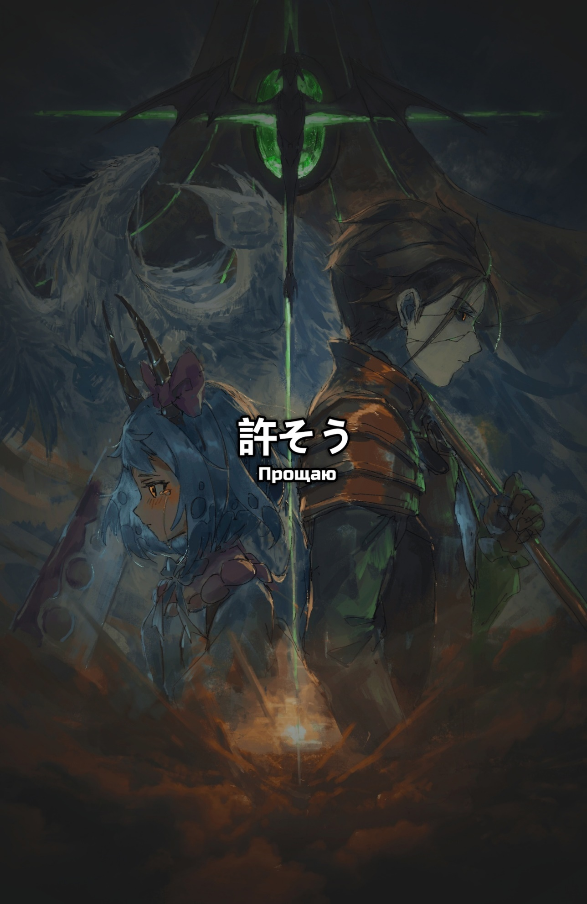
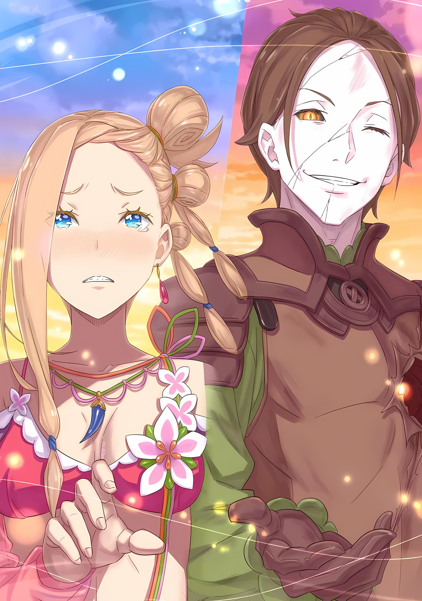
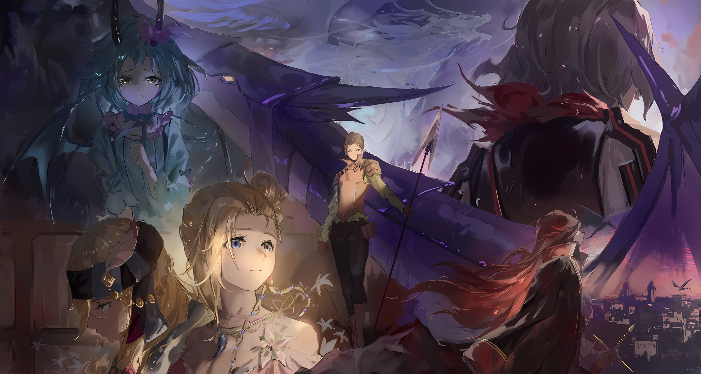

Фанарты: Rokaroka

*※※※※※※※※※※※*

Когда зазвенели серебряные перчатки, туловища и черепа́ стоящей на пути нежити разлетелись в пыль.

Внутри тела каждого бедственного мертвеца есть Жук-ядро — если его не задеть, то нанести смертельную рану не представится возможным, как ни разноси их голову с сердцем. …В таком случае, лучшим вариантом было бить так, чтобы удар распространялся по всему телу.

???: А как тебе такое!

До сих пор он старался размахивать кулаками со всей дури, попадать прямо в цель. Он не сильно задумывался о том, какой результат будет после. Ему нужно пересмотреть этот подход.

Он рисовал в воображении, как ударная волна его кулака проносится по всему телу противника. Если изменить способ нанесения удара, то можно изменить и результат, который он принесет.

???: …Кх.

С дрожью в спине тело нежити разлетелось в пыль — в последнюю очередь разлетелось и место, куда был нанесен прямой удар. Это доказывало, что удар прошелся по всему его телу — Жук-ядро погиб.

Надо не упустить этот момент, он обрушил на рой нежити свои кулаки.

Первый, второй, третий; количество разбитой вдребезги нежити стремительно росло и росло…

???: Эй, сопляк! Хватит, этому не будет конца!

Хрипловатый мужской голос раздался за спиной того, кто держался на ногах и размахивал кулаками, противостоя многочисленным мертвецам.

С отточенным мечом в руках, расправляясь с нежитью, что к нему рвалась, Хейнкель стойко давал отпор врагам. Он был весь изможден, потрепан.

В ответ на его кряхтящий жалобный голос Гарфиэль улыбнулся.

Мужчина, который, если хотел, мог бы просто сбежать, все равно искренне стоял здесь, стоял на своем.

Он твердо решил, что безопаснее ему будет оставаться с Гарфиэлем, а не спасаться бегством в одиночку. Однако трудно было поверить, что подобное решение будет сохранять силу в такой ситуации.

В конце концов, здесь были… великие ворота, вход в Рапгану, важнейшая позиция, от которой зависел захват столицы. Гарфиэль сдерживал большую армию нежити, которая пыталась ворваться внутрь.

Гарфиэль: Хер я вам куда-то отступлю. Нужно стоять здесь, нужно давать отпор, нужно отстаивать эту позицию, и тогда, тогда тактике Капитана ничего не помешает.

Его долг — защищать это место до последнего, любой ценой.

Гарфиэль сжал свои кулаки перед грудью и выдал полный решимости ответ, на что Хейнкель цокнул языком. С мрачным, недовольным лицом и голосом таким возмущенным он сказал: «Но ведь…!»,

Хейнкель: Если дело в долге, то разве его не будет легче выполнить, если ты чуть сдашь назад? Конкретно же здесь тебе держаться незачем… да брось ты уже этого Дракона!

Хейнкель разрубил нежить, а затем кончиком меча указал на «Облачного Дракона» Мезорею, который валялся на земле после смертельной схватки с Гарфиэлем.

Мезорея, судя по всему, должен был быть на стороне врага, однако сейчас нежить без устали шла на поверженного «Облачного Дракона» — если его бросить, чешуя его наверняка окрасится кровью.

Гарфиэль: Ни за что!

Хейнкель: Почему? Разве он не наш враг? Да пусть лучше они друг другу вредят!

Гарфиэль: Не хочу, чтобы Капитан во мне разочаровался!

На такой ребяческий ответ Хейнкель застыл в лице, он не мог найти слов.

Это были его истинные чувства, без всякого преувеличения. Даже в этой битве Субару хотел сократить потери и свести их как можно ближе к нулю. И Гарфиэль помогал ему в этом.

Кроме того, ему еще предстояло обменяться с «Облачным Драконом» Мезореей значимыми словами.

Поэтому…,

Гарфиэль: Крутой я не сдвинусь с места! Давайте же, мать вашу, херовы зомбаки, нападайте на меня, нападайте все и сразу!

Он яростно зарычал, следом раздался звук удара двух серебряных перчаток друг о друга.

Будет хорошо, если вся нежить, что услышала этот звук, соберется здесь, чтобы нацелиться на живого, который был полон жизненных сил.

Гарфиэль: Да-да, меня это устраивает. …Эй вы, сильные ублюдки, идите на меня, на крутого меня, говорю!

В конце концов, Гарфиэль должен продержаться столько, сколько сможет, он должен хоть немного облегчить жизнь своим дорогим людям.

Хейнкель: …У тебя точно что-то не так с головой.

Боевой клич Гарфиэля — Хейнкель не знал как на него реагировать. …Из-за этого он и не заметил, как за его спиной слабо шевельнулся поверженный «Облачный Дракон».

*△▼△▼△▼△*

Когда ее бережно подняли с кровати, у Мэделин не было и сомнения, что это конец. …Ибо в груди Балроя разверзлась болезненно большая дыра.

Мэделин знала, что для тела нежити смертельная рана не может просто так оказаться смертельной. Однако, судя по тому, что его рана не затягивалась сама собой, как это происходило обычно, она могла догадаться о намерениях Балроя.

Возлюбленный Мэделин… человек, которого она так любила, теперь раз и навсегда отправится туда, куда ей не добраться. Туда, куда не доберется даже дитя Дракона, что повелевает облаками — в место за пределами облаков и небес.

Балрой: …Мне правда очень жаль, Мэделин.

Глаза Мэделин немного расширились, когда заговорил Балрой, на лице которого была добрая улыбка.

Это лицо, оно совпадало с тем, что было у него при жизни, еще до того, как он стал нежитью. Хотя, конечно, глаза его по-прежнему были цветом Аврелии, а лицо — неживым, бледным, будто гжель.

И все же на миг почудилось, нет, было видно, что во взгляде и голосе Балроя поселилось тепло, тепло самой жизни.

Все было так же, как в те времена, когда он прилетал к Мэделин на вершину горы Пальзоя.

…То, что не она стала той, кто вернула ему это тепло, огорчало ее, огорчало до глубины души.

Мэделин: …Кх.

Ее голос дрогнул, сорвался из-за беспомощности, никчемность — она была никчемна, слезы, слезы начали стекать с ее золотых глаз.

Мэделин обнажила свою хрупкость, хотя у нее была жизнь. В Балрое читалась явная сила, хотя жизни у него не было. Она отразилась в его золотых радужках — таких же золотых, как и у нее,

Балрой: До самого конца я, конечно, был парнем сильно эгоистичным. Из-за своего эгоизма я ужасно часто использовал Мэделин.

Он решил, что ему нужно сделать, он решил, что они расстанутся, что их пути разойдутся, поэтому он встал к ней лицом.

Вот так он завязал разговор. Мэделин уже знала, знала, что за этим последует — он будет извиняться и благодарить, извиняться и благодарить.

И именно потому, что она это знала,

Мэделин: Хватит, остановись…

Балрой: Мэделин?

Мэделин: Извиняться, благодарить, — все это, прекрати, хватит, черт возьми…!

Ее зубы дрожали, Мэделин силой смахнула набежавшие слезы и заговорила.

Поскольку половина ее сознания все еще была связана с Драконьей оболочкой, Мэделин совсем ослабла. Но, лишь благодаря силе воли, она ухватилась за руку Балроя, который ее держал.

Его руку, руку нежити, она сжала достаточно сильно, чтобы на ней появились трещины, чтобы она рассыпалась.

Но то, что она пыталась этим передать, не было ни злостью, ни ненавистью. Лишь мысли, которые Мэделин держала в себе и хотела высвободить.

Мэделин: Если ты эгоист, то самый эгоистичный поступок Балроя — это исчезнуть в одиночку. Ты эгоистично явился в гнездо Дракона, эгоистично стал кем-то ценным для меня, дракона, эгоистично перестал появляться, эгоистично умер, эгоистично исчез… и теперь ты, черт возьми, планируешь снова эгоистично исчезнуть…!

Балрой: …

Мэделин: Ты уже и так был достаточно эгоистичен. Так что же… тогда! Я больше не буду прощать твой эгоизм…! Вместо благодарностей и прощаний Балроя… послушай, что, черт возьми, что скажу я, дракон…!

Она сжимала его руку. Балрой ничего не говорил, лишь смотрел на Мэделин.

Мэделин, глядя в золотые глаза Балроя, которые хоть и блестели по-разному, были одного оттенка, начала говорить.

Этим было…,

Мэделин: …Балрой, ты привел меня, дракона, во внешний мир.

Балрой: …Кх.

Глаза Балроя расширились.

Когда ему сказали нечто совершенно неожиданное, он был ошеломлен. Мэделин впервые видела, чтобы Балрой сделал такое лицо. И пусть он был нежитью, она радовалась, что все еще может открывать в нем, своем любимом человеке, новые стороны.

Словно вбивая все это в свое цепкое драконье тело, Мэделин продолжила.

Мэделин: Меня, дракона, вытащили наружу. Балрой сделал это для меня, дракона, черт возьми, вывел прямо под небо.

Балрой: …

Мэделин: Я, дракон, не была использована или что-то в этом роде. Причина, по которой мне, дракону, удалось спуститься с горы и теперь вновь разговаривать вот так с Балроем… все это благодаря Балрою.

Если бы только она принимала решения быстрее. У нее было очень много подобных сожалений.

Если бы только они больше общались и делились прикосновениями друг друга. У нее было очень много подобных жалоб.

Тем не менее, от того, что она решила, от того, о чем они разговаривали, и от того, как прикасались друг к другу, Мэделин ни за что бы на свете не отказалась.

Мэделин: Все, что дал мне Балрой… Балрой, ты вывел меня, дракона, во внешний мир.

Она не хотела, чтобы время, когда Балрой пришел поблагодарить ее и попрощаться, тратилось на такое.

Она не хотела использовать то скудное время, что у них было, чтобы слушать и отрицать такие пустяки. Если бы у них оставалось всего-то десять или около того секунд, то за такое короткое время Мэделин бы…,

Мэделин: Я люблю тебя. Балрой стал для меня, дракона, всем, абсолютно всем. Нет ничего, что я, дракон, любила бы больше Балроя. Балрой — это все, что есть у меня… дракона…

Балрой: Мэделин…

Мэделин: Балрой, Балрой, Балрой… кх!

…Она использовала бы все оставшиеся десять секунд, чтобы сказать своему любимому человеку, как сильно его любит.

Она хотела, чтобы он ответил. Она хотела, чтобы он возжелал ее. Она хотела, чтобы он воспылал к ней такой же страстью, какая жила в ней самой.

Отбросив все те сложные аспекты любви, Мэделин стала воплощением искренности своих чувств.

Даже если люди презирали Балроя, и даже если этого желал сам Балрой, Мэделин никогда бы этого не допустила. Она не хотела, чтобы это происходило.

Всю свою жизнь драконида Мэделин будет хранить Балроя Темегрифа в своем хрупком сердце.

Мэделин: Дракониды живут намного дольше, чем люди.

Все это время, столь долгое, что в сравнении с человеческим оно покажется вечностью, Мэделин проведет, думая о Балрое. Память о нем навсегда останется в ее душе.

То, как сильно он на нее повлиял, она должна возместит Балрою Темегрифу.

Балрой: …Интересно, что же ты во мне нашла? В такого парня, как я, совершенно не стоит влюбляться.

Балрой коротко сказал это, высмеивая себя, однако она ничего не ответила.

Мэделин была слишком занята тем, что прижималась лбом к его груди. Так она выражала свои чувства. Мужчина, который, казалось, не понимал собственного обаяния, — она эгоистично хотела, чтобы он сам нашел ответ на этот вопрос.

Похоже, намерения Мэделин оказались раскрыты. Балрой сделал долгий, глубокий вдох.

А затем…,

Балрой: Ты не сможешь забыть меня, даже если я попрошу тебя об этом, да. В конце концов, я прекрасно это понимаю. Поэтому я не возражаю, если ты меня не забудешь. Вот только…

Мэделин: …

Балрой: Найди свое счастье, Мэделин. Моя любимая, дорогая драконья принцесса.

Впервые в своей жизни Мэделин была прямо отвергнута человеком, которого любила.

*△▼△▼△▼△*

Балрой: …И как вам, Ваше Превосходительство? Не слишком ли велика роль моей младшей сестрички?

Голос Балроя, который не сумел скрыть своих эмоций похвалы, привлек внимание всех присутствующих в месте, где находилась батарея. …Нет, не всех. Все, кроме Медиум.

Мужество женщины, что сжимала руку Винсента с «Мечом Света», возвышалась над всеми остальными. Это была мольба, граничащая со смертью. Но, опять же, не зайдя так далеко, Винсент, скорее всего, ничего бы не понял.

И хотя Император понимал, что является важнейшей частью Империи, он хуже всех осознавал ценность собственной жизни.

Медиум: Хии-яяя!

Медиум вытащила свой варварский меч из-за пояса, а затем ловко ударила по зеленому сиянию на пьедестале… по Магическому Ядру Могуро, тем самым сбив его.

Оно описало плавную дугу и упало в поднятую руку Балроя. Почувствовав его тепло и вес, он взглянул на Императора.

Винсент опустил острие «Меча Света» и пристально посмотрел на Балроя.

Винсент: …

Увидев, какое столпотворение сейчас творится в черных глазах Винсента, Балрой понял, что Императору нужна Медиум.

Чтобы сузить круг вариантов и принять наилучшее из решений, ему нужен был кто-то, кто поддержал бы его, кто-то, кто с улыбкой смотрел бы с ним в будущее. …Хотя именно Балрой лишил его Чиши, поэтому он не имел права так говорить.

Будь здесь Чиша Голд, ему не составило бы труда предугадать чувство вины Балроя-нежити.

Задаваясь вопросом, не слишком ли много он думает, Балрой усмехнулся,

Балрой: Меди.

На зов Балроя Медиум рысью направилась к нему, она догадалась о его намерениях. В ее объятия Балрой передал Мэделин, которую все это время держал в одной руке.

Драгоценная девочка-драконид, находясь в полубессознательном состоянии, излучала свою любовь к Балрою.

Однако сейчас он спала, ее измучил плач, плач, который стал для нее вечным шрамом.

Медиум: Браток Балро.

Балрой: Да?

Осторожно взяв тело Мэделин, Медиум посмотрела на Балроя. Затем с хорошо знакомым ему лицом она широко улыбнулась яркой, как солнце, улыбкой.

Медиум: Сделай все, что в твоих силах!

Балрой: …Ага, задам жару, устрою настоящий ад.

Кто бы мог поверить, что в теле нежити будет гореть жизненная сила?

Получив силу от того, во что бы никто не поверил, Балрой энергично развернулся к ней спиной. Затем он забрался на своего верного дракона, что ждал его в руинах батареи, и похлопал его по крыльям.

В тот же миг порыв ветра поднял Карильона в воздух.

Стремительно набирая высоту скачками, прыжками и рывками, Балрой и Карильон приближались к небесам над облаками.

Голос ветра исчез; вот каково было чувство полета, поглощенное пустотой сосредоточенности.

???: Балрой, Карильон, здесь, не только вы. Я, тоже.

Балрой: А-ах, точно-точно. Совершенно вылетело из головы, как же грубо с моей стороны.

Крепко держась за Магическое Ядро… за Могуро, Балрой снова усмехнулся.

Могуро, зачисленный в ряды «Девяти Божественных Генералов» как «Стальной», вопреки своей роботизированной внешности и манере речи был искренним, сочувствующим и, можно сказать, даже дружелюбным.

Могуро: Я, «Метеор» Империи, такова, цель, моего создания.

Балрой: …Цель создания.

По иронии судьбы, слова Могуро были теми же самыми, что и у Сфинкс.

Чтобы выполнить цель своего создания, Сфинкс нужно уничтожить Империю, а Могуро — ее защитить. И вот он нерешительно мотался туда-сюда, поддерживая сторону каждого из них.

Могуро: Балрой, ты, предал, нас, почему?

Балрой: Кхаха.

На такой чрезвычайно прямолинейный вопрос Балрой усмехнулся тому, что можно было назвать не иначе как откровенное Могуронство.

Этот вопрос мог касаться его предательства как при жизни, так и после смерти, однако Могуро, вероятно, не различал эти два момента. В любом случае, Балрой был благодарен судьбе за то, как все сложилось.

И до, и после смерти причина, по которой Балрой решил выступить против Империи, была одной.

Балрой: …Это было ради кого-то дорогого.

То ли потому, что приближалась его неминуемая кончина, то ли потому, что он считал этого робота-«Метеора» другом, с которым легко поладить, Балрой заговорил.

Пожалуй, это был первый раз, когда он выразил эти чувства словами, он не собирался говорить о них кому-либо.

Карильон: …Кирьярарааах.

Возможно, потому что стыд Балроя передался Карильону, дракон оглянулся на него и ответил кивком, хлопая крыльями по небу. Об этой черте «Наездника Летающего Дракона» знал только Карильон. …Нет, похоже, Медиум тоже догадывалась об этом, но, как правило, скрывала.

Эта информация, по его мнению, должна была стать для Могуро недопустимой, однако…,

Могуро: Я, понял. Мы, одинаковые. Ради, кого-то, дорогого.

Балрой: …

Могуро: Балрой, прощаю.

Прощение Могуро, который хоть и был роботом, но все равно стремился к близости, заставило щеки Балроя напрячься.

На его щеках появился оттенок жизни, отличный от цвета нежити, а в глазах больше не вырисовывался золотой на черном — они вновь обрели естественный блеск. …Это было яркое сияние последних минут жизни Балроя Темегрифа.

Балрой: Спасибо, Могуро.

Как мертвый человек, который теперь ни в чем не уступал живому, Балрой смотрел в небо.

Все еще стремительно ускоряясь, Балрой и его компания пронзили облака. Водоворот облаков завихрился, как будто им руководила некая воля, и он начал окутывать их, пока они мчались ввысь.

Эти облака не хотели их раздавить. Балрой уже видел их раньше, на вершине горы Пальзоя — гнездо Дракона, созданное, чтобы не дать тем, кто находится внутри облаков, вырваться наружу…

Балрой: …

В голове Балроя возникло множество лиц.

Винсент, «Девять Божественных Генералов», Мэделин, Серена, Медиум, Флоп и Майлз.

Они — доказательство того, что Балрой жил, они придавали смысл его жизни.

И вместе со своим любимым драконом Карильоном…,

Балрой: …Это была жизнь, полная взлетов и падений, но я бы не сказал, что она вышла плохой.

Карильон: …Кирьярарааах.

Даже последние слова не смогли побороть его малодушие, поэтому на такое неряшливое поведение он получил нагоняй от своего любимого дракона.

*△▼△▼△▼△*

В этот миг Драконьи когти вонзились в землю, и рухнувшее ранее тело приподнялось. Тут же красноволосый мужчина, что стоял сбоку от него, закричал: «Ууоооаа!?» и упал на спину, однако это не имело для него значения.

Сейчас важнее была не незначительная угроза, а…

*???: «Балрой… хк.»*

Удар оказался слишком сильным, чтобы встать. Но сейчас это не имело значения. Нужна была не физическая сила для подъема, а мощь того, кто поднимался в небо.

Дрожа длинными усами и напрягая острые глаза, он устремил свой взгляд вверх, на небо над Кристальным Дворцом. Сияние взмыло прямо к небесам, окрашивая их в изумрудно-зеленый свет. И на вершине этого луча, что поднимался все выше и выше, находился кто-то, кто был ей очень дорог.

Это намерение, эта решимость, этот настрой, этот эгоизм — она бы простила все.

*???: «…ГХЫААААА.»*

Сила, исходящая из его огромного тела, затмевала собой все вокруг, и в небе над Кристальным Дворцом начал вихриться кучевой водоворот. Она вовлекла тот изумрудный блеск в этот вихрь, что резко увеличило и его плотность, и их скорость.

Таким образом, «Облачный Дракон» Мезорея… Мэделин помогла им своей силой.

*Мэделин: «…Ах.»*

В этот миг все вокруг озарила вспышка света, и облачный водоворот оказался разорван изнутри.

Что это означало, кого потерял этот мир, что от нее отдалилось, она понимала до боли ясно.

*Мэделин: «Аа, аааа, ААА, АААААААААААААААААААААААААААААААААААААААААААААААААААААААААААААААААААААААААААААААААААААААААААААААААААААААААААААААААААААААААААААААААААААААААААААААААААААААААААААААА…!!!»*

Глядя на небо, уже освободившееся от плотных облаков, и вспоминая о любимом, от которого не осталось и следа, Мэделин разрыдалась во все горло «Облачного Дракона».

…Под одиозно чистым небом плакала влюбленная дева Драконов.
