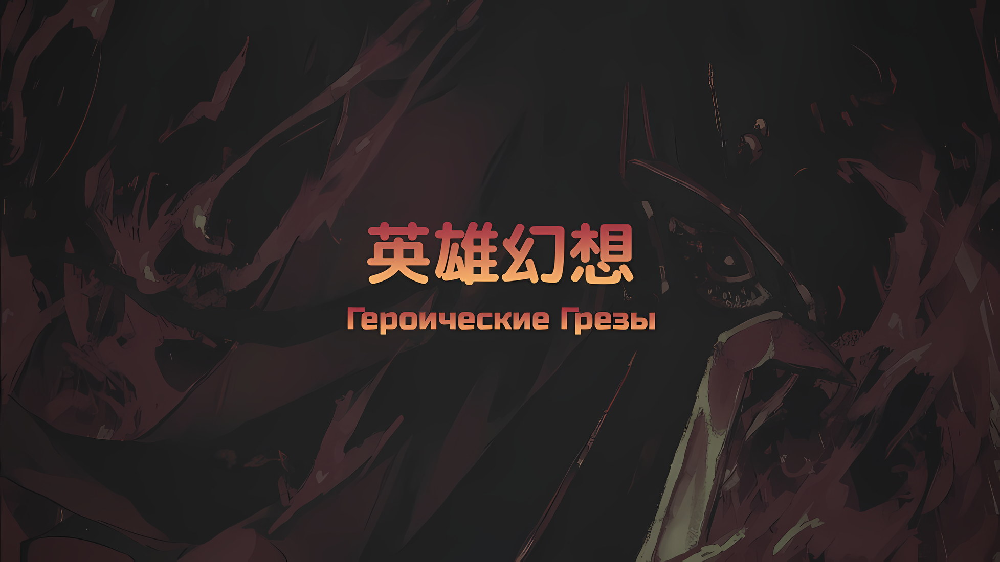
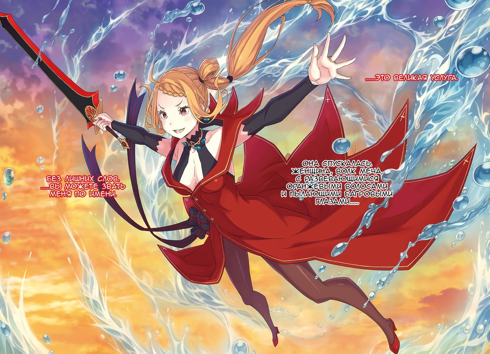

*※※※※※※※※※※※*

…Можно утверждать одно.

Без решительных действий Эмилии план «Ведьмы» осуществился бы, и гибель Империи Волакия оказалась бы неизбежна.

Более того, никто, кроме Эмилии, не смог бы это остановить.

Эмилия: …Хия!

Эмилия резко выдохнула, напрягла щеки и встала против лучей жара и шаров света, которые летели на нее со всех сторон. Она отражала их своим отполированным ледяным оружием.

Перед ней стояла точная копия Ехидны — магия Сфинкс впечатляла Эмилию — и единственным способом противостоять ее трудно отражаемым атакам было блокировать их льдом, что сверкал как зеркало.

Субару часто говорил ей, что «Креативность важна!», поэтому она уделяла особое внимание деталям своего ледяного оружия, и в этот раз они были использованы по максимуму.

Благодаря этому Эмилия смогла быстро создать оружие, которое справлялось с магией Сфинкс.

Эмилия: Спасибо, впрочем, как и всегда.

Эмилия поблагодарила Субару, которого здесь не было, и с энтузиазмом облачилась в ледяное снаряжение.

Субару, который сейчас, скорее всего, упорно боролся в столице Империи вместе с Беатрис и Спикой, продолжал помогать Эмилии, даже если был не рядом и все еще маленьким.

От одной мысли о Субару Эмилия забыла об усталости и взмахнула своим большим ледяным молотом.

Сфинкс: …Устранение: Требуется. В срочном порядке.

Столкнувшись с Эмилией, Сфинкс старалась держаться на расстоянии и пускала в ход свою магию. Хотя полуэльфийка находилась под ее натиском, «Ведьма» оставалась безмятежной и не показывала никаких эмоций.

Сфинкс прокралась в это безлюдное место, чтобы что-то совершить. Эмилия каким-то образом почувствовала это и ринулась сюда, после чего и началась битва.

Это помешало Сфинкс осуществить задуманное.

Эмилия, хотя это и не было ее сильной стороной, сосредоточилась на том, чтобы как можно сильнее помешать противнику.

…И снова Эмилия использовала ситуацию так, как не мог никто другой в столице Империи.

Если бы Эмилия лишила Сфинкс жизни, «Ведьма» вернула бы эту информацию в свою душу, осознала бы угрозу и создала бы новое тело для противодействия.

Однако Эмилия не собиралась убивать Сфинкс, а лишь хотела ее остановить.

Поэтому не происходило того, что Субару назвал «Посмертным Бегством», и Сфинкс не посылала новую версию себя для подкрепления против Эмилии.

Такое развитие событий было бы невозможным, окажись здесь кто-то другой, будь то кто-то сильный, как Сесилус или Халибель, кто-то мудрый, как Винсент или Розвааль, или даже хитрец, как Субару или Ал.

Никто, кроме Эмилии, не смог бы остановить Сфинкс.

Эмилия: ХИЯЯЯ!

Эмилия, полагаясь на свое чутье, создала такую немыслимую ситуацию. Тем не менее, она, сама того не осознавая, отбила световой шар своими ледяными ботинками и…,

Эмилия: Хотя я и не понимаю, что происходит, но я не позволю тебе сделать то, что ты задумала! И еще, скажи мне, где Присцилла! Мое обещание Шульту-кун, я его выполню!

Сфинкс: …Однобокая и жадная. Как и подобает Ведьме, да?

Сфинкс холодно пробормотала это в ответ на просьбу Эмилии.

В этих словах сквозило раздражение, скрыть которое было нельзя.

*△▼△▼△▼△*

…Белый свет окутал его взор, и в следующее мгновение всему вокруг пришел конец.

За короткое время Нацуки Субару пережил это много-много раз, — это была новейшая фаза «Посмертного Возвращения».

Субару: …

Он крепко сжимал Беатрис за руку, Розвааль же держал их обоих за талии.

Присутствие Беатрис, тепло от Розвааля, чувство, как все его тело овевает ветер, — все это было наяву.

И не только это…,

???: Насчет победы над Драконом, мне кажется, что соревноваться в количестве голов как-то так себе. И вообще, не лучше ли громовые аплодисменты, чем количество голов? Так что, для начала, давай-ка покажем им союз двух великих из Волакии и Карараги!

???: Было бы весьма кстати, особенно для меня. Может, я и не хотел слишком выделяться, но мне не повредит поднять свой статус после войны.

Бросив взгляд на Злого Дракона, который, растворяясь в небе, умирал, Сесилус и Халибель спустились на землю и принялись оживленно болтать. Они убили Дракона в мгновение ока.

Как безоговорочные высшие силы мира сего, эти двое были одинаково могущественны; тот факт, что они не могли нарушить законы физики и остаться в небе, несомненно, обнадеживал…,

Субару: …Сейчас…

У него не было другого выбора, кроме как осознать новую угрозу и дать ей отпор.

Защитившись от Магической Кристальной Пушки, расправившись со Злым Драконом, увидев, как вспышка зеленого света разогнала все тучи в небе, он понял, что у «Ведьмы» еще есть что на уме.

У Субару, у каждого оставалось мало времени. Скоро все вокруг окрасится в белый цвет, они все умрут.

Думай, думай, думай. Думай, думай, думай, думай, думай, думай, думай-думай-думай, думай-думай-думай-думай-думай-думай-думайдумайдумайдумайдумайдумайдумайдумайдумайдумайдумайдумайдумайдумайдумайдумайдумайдумайдумайдумай…

Беатрис: …Субару.

И в самом деле, когда мысли Субару заметались с бешеной скоростью, Беатрис позвала его, в ее голосе звучала твердая вера.

Ее рука, уверенность в том, что ему срочно нужно что-то предпринять, и сильное чувство потери, пронизывающее его тело и разум… нет, саму его душу, должно быть, передались ей.

То, что Беатрис не стала много говорить, указывало на ее высокую решительность.

Беатрис: Говори, что угодно, я полагаю. Бетти, в самом деле, поможет тебе во всем.

Он не дал ей никаких слов, но Беатрис все равно сказала это.

Субару, чувствуя растущее презрение к себе за то, что не мог отплатить за помощь, кивнул.

И как только кивнул…,

Субару: Просто держи мою руку, пока я не потеряю сознание. Я подам знак, так что приготовь то, что ты делала раньше, чтобы было готово в любой момент!

*△▼△▼△▼△*

…Субару повысил голос — в ответ на это по небу пронеслась черно-синяя полоса.

Он не уловил конкретного содержания его слов. Вместо этого он услышал нечто другое.

Звук шестеренок противоборствующих миров, которые начали сцепляться и вращаться, чтобы соткать время света.

???: …

Неважно, была ли это слуховая галлюцинация. Все так, как и должно быть.

Нацуки Субару придумал лучший способ выйти из тупика и воплотил его в жизнь. В таком случае он мог на него рассчитывать. …Нет, у него не было другого выбора, кроме как положиться на него.

Сказать Субару о том, что у «Ведьмы» еще есть план, это лучшее, что Ал… что Альдебаран мог сделать.

Ал: Черт.

Это короткое ругательство, эхом раздавшееся в его шлеме, услышал только он сам.

Он пробормотал его неосознанно, что как бы само за себя говорило, заставляло обратить внимание.

О чем же мог сожалеть Альдебаран?

Он понял это с того дня, как обнаружил Нацуки Субару в этой Империи. Когда дело дойдет до битвы, он должен будет, не раздумывая, использовать Нацуки Субару.

Неважно, насколько яро он это ненавидел, как бы сильно ему это ни претило, по итогу это было лишь бесполезным упрямством.

…Никчемное упрямство подражающей звезды, что не сравнится с Нацуки Субару.

???: …Пересмотр: Требуется.

Внезапный голос заставил Альдебарана молча обернуться.

На неровной земле беззащитно лежала Сфинкс, от шеи до пят окутанная сплошным черным светом.

Врата Сфинкс оказались полностью запечатаны, а руки и ноги буквально связаны. Она неотрывно смотрела на Альдебарана, на ее омерзительном лице не отражалось ни беспокойства, ни гнева.

Отвратительный взгляд, она будто его изучала.

Ал: Пересмотр… в смысле пересмотр своих мыслей? Каких именно? Ты ведь не скажешь мне, о чем думаешь, что бы я ни делал, да.

Край рта Сфинкс исказился, Альдебаран смотрел на нее сквозь шлем.

Сказанное им было чистой правдой. …Альдебаран уже много-много раз допрашивал плененную Сфинкс и давно уверился, что она не разгласит никаких подробностей своих планов.

Парадоксально, но даже с учетом всего множества попыток Альдебарана есть случаи, повлиять на которые было просто невозможно.

Бросай он хоть бесконечно много игральных костей, выпадение нуля или семерки было невозможно.

Да, просто невозможно. …Для Альдебарана.

Ал: Это конец для всех вас. Ты сделала врагом того, кого абсолютно точно нельзя делать врагом. Теперь, пересматривай ты или не пересматривай…

Сфинкс: Я пересмотрела свою оценку относительно тебя.

Ал: А?

Сфинкс: Я не признавала в тебе ничего, кроме простого сопровождающего Присциллы Бариэль, однако… ты такой же… такой же, как я.

Ал: …

Сфинкс: Ты еще не выполнил цель своего создания, ты — мученик, что во имя этого борется за свою жизнь. …Своей цели создания я достигла, поэтому не могу не жалеть того, кто лишь топчется на месте.

Даже в плену, в ситуации, когда ее магия была запечатана, Сфинкс все равно, не из тщеславия или поражения, жалела Альдебарана.

Под искренним взглядом Сфинкс у него перехватило дыхание.

Он прекрасно понимал, что истинная природа леденящего его горло холода — это ее убийственное намерение.

Он просто обязан был прикончить эту чересчур разговорчивую девушку с лицом «Ведьмы», задушить ее до смерти.

Говорить ему это, да еще и с таким лицом, просто непростительно.

…Кто же, по ее мнению, сделал его Альдебараном?

Ал: Ты…

???: Ал! Одолжи мне свою силу!!!

В эту секунду его зрение окрасилось ярко-красным, а мысли заволокло белой пеленой.

Еще несколько десятых секунды — и Альдебаран убил бы Сфинкс. Однако его остановил яростный порыв ветра, сопровождаемый резким голосом.

???: Мне нужна твоя сила! Как ты и сказал, «Великое Бедствие» еще не закончилось! Время тотальной войны!

Он опустился на землю и с напряженным выражением лица обратился к Альдебарану.

С двумя надежными спутниками рядом — длинноволосым магом и Духом в платье — это был Нацуки Субару, способный найти все возможные силы, чтобы достичь света, до которого Альдебаран, как бы далеко он ни тянулся, никогда не смог бы добраться.

Ал: Даже если ты просишь меня помочь…

Субару: Замолчи!

Ал: …Кх.

Альдебаран сказал это, испытывая смесь всевозможного смятения.

Однако, не обращая внимания на его внутренние мысли, Субару выставил кулак вперед,

Субару: Сейчас у меня нет времени сочувствовать всем и каждому! Поэтому здесь и сейчас давай переключимся и будем сотрудничать! Ты же уже говорил это раньше!

Ал: Я, раньше…?

Субару: Ты сказал, что возлагаешь на меня большие надежды! Я отвечу тебе тем же!

Ал: …Ах.

Когда Субару кричал на него с красным лицом, Альдебаран затаил дыхание.

Вдруг он вспомнил, как общался с ним, когда они воссоединились здесь, в Империи Волакия, когда в городе-крепости Гуарал Субару был на грани того, чтобы потерять себя.

Когда сама основа, фундамент личности Субару пошатнулся после того, как его отвергла девушка по имени Рем, Альдебаран поддержал его.

Что же тогда сказал ему Альдебаран…?

Субару: Уверенность в себе и все остальное, чего ты лишился, можно вернуть только через результат. Все как всегда!

Ал: …

От такой речи Субару у девушки, что держала его за руку, и у длинноволосого мага, который стоял позади него, глаза загорелись предвкушением.

Таким образом, Субару, придававший силы окружающим его людям, точно так же протянул руку Альдебарану и заговорил, словно отплачивая ему за то время.

Субару: Давай же, Ал! …Понесем их, понесем вместе все эти Героические Грезы!

Так он заявил.

*△▼△▼△▼△*

…Планы «Ведьмы» — разрушение Империи Волакия и «Смерть» — раз за разом приходили в исполнение.

Может, безболезненная смерть была бы идеальным концом всего этого.

Возможно, смерть, приходящая внезапно, была единственным мягким способом избавить людей от страха перед концом.

Так он подумал.

Субару: Нет, моим идеальным концом было бы умереть спокойно, рядом с Эмилией, Беако и моими внуками, так что нет, для меня это не вариант.

Даже если бы «Великое Бедствие» обещало безболезненный и бесстрашный конец, избавляющих всех от горя и страданий, Субару решительно отверг бы его.

Когда-то должен наступить тот идеальный конец, который он рисовал в своей голове, и мысль об Эмилии и Беатрис, которых он оставит, вызывала в его сердце боль, сродни порезу стеклом. Но пока он не дошел до этого финала, Субару нужно было пережить текущую проблему и найти ее решение.

Он никак не мог согласиться на чей-то навязанный ему сладкий сон.

Хотя все это было лишь необоснованным предположением, ведь целью «Великого Бедствия» был не мягкий конец, а уничтожение Империи самыми ужасными методами.

Вот почему в этой битве не было иного пути, кроме как сорвать цели «Великого Бедствия».

Субару: …Мало-помалу я начинаю понимать.

Сначала мир окрасился в белый, и Субару оказался поглощен «Смертью», так и не узнав, что погубило его или его спутников.

Субару вернуло к моменту, когда Розвааль обхватил его и Беатрис, а Сесилус и Халибель расправились со Злым Драконом.

И вот, через минуту все снова закончится, им всем придет конец.

Субару: …

Времени оставалось мало, а сделать нужно было еще много.

Если бы Ал не сказал ему, что «Ведьма» что-то замышляет, ему потребовалось бы больше времени, чтобы это выяснить. Возможно, это спасло его от пяти или больше «Посмертных Возвращений».

И все же для того, чтобы понять ситуацию, требовалось больше проб и ошибок.

И через эти пробы и ошибки…,

???: Скорее всего, «Каменная Глыба»… Муспель погибнет, я полагаю. Если наш враг еще может отыграться, то это будет самым вероятным раскладом, в самом деле.

???: Крах обширных земель Империи, не исключено, что наш враг готовит спусковой крючок, чтобы устроить великий катаклииизм~. …Для Сфинкс было бы обычно сделать какой-нибудь магический круг.

???: На данный момент Груви снял «Терновое Проклятие», наше главное препятствие, и ушел, так что ты же не думаешь, что кто-то может прятать от нас проклятие еще сильнее, чем это, ведь так?

???: Да, да, да! Как и сказал Ал-сан, если Аня умрет, то умрет и вся Империя, так что это может быть как-то связано! Получается, есть шанс того, что, чтобы убить Аню, сюда придет большая армия! Наконец-то я снова смогу убить тысячу человек!

???: Уу~! Уау! Аа~, Уу!

???: Ты в сохранности, дитя…!? Я слышала, что ты присматривал за Танзой. Если я могу чем-то помочь, просто скажи.

???: Шварц-сама, что-то нехорошо у меня на сердце… все ли в нашем эскадроне целы?

???: Хоть ты и юн, глаза твои приятны. Звезда Моя тебе, похоже, доверяет, хотя и не так сильно, как мне. Если что-то нужно, говори.

???: Капитан! Крутой я рад, что ты здесь, но до дифирамб еще рановато! Это не конец, я прав? Что мне скажешь, то я и сделаю, помни об этом!

???: …Отвали. Не приплетай меня, сопляк, я не с вами.

*???: «Исчезни, черт возьми… у меня, дракона, ничего, больше ничего не осталось…»*

???: Исчезни, черт возьми… у меня, дракона, ничего, больше ничего не осталось…

???: Субару-чин, у меня плохо получается думать, но я постараюсь! Постарайся и ты, Субару-чин!

???: Ой-йой, звиняй, парень, но рук у меня больше нет, так что вырасти тебе придется самостоятельно, понял суть? Похоже, я никак не верну твою душу в прежнее состояние, каккакка!

Он не был каким-то суперменом, умеющим решать все проблемы самостоятельно.

Ограниченный лишь одной минутой, Субару, повторяя это снова и снова в обмен на свою «Смерть», начал ставить мат на выстроенной врагом доске.

Смерть «Каменной Глыбы»; магический круг; «Терновое Проклятие»; жизнь Аракии; «Звездное Поедание» Спики; он радовался, что Йорна в безопасности; военная ситуация в Укрепленном Городе; Император-нежить, что энергично хвастался своей любовью; Гарфиэль был просто лучшим; пьяница, о котором и говорить не стоит; Дракон, с которым он не мог поговорить; драконид, с которым он тоже не мог поговорить; делать все возможное; отворачиваться от того, что мешает ему делать все возможное, мешает его силе воли; и так далее, и так далее, и так далее.

???: …Каков глупец. Подними голову, Нацуки Субару.

???: Ни у кого из нас нет возможности опускать глаза. Так нужно, чтобы бороться дальше.

???: Я не намерен сдаваться. …Да за кого ты меня принимаешь?

Сколько же самоуважения скрывалось за этими гордыми словами?

Он бы не стал так легкомысленно пытаться заглянуть за занавес. Ну и ладно. Нужно идти дальше.

Сдаваться — для Нацуки Субару это не вариант.

Субару: …

То же самое касалось и ее — он не мог ее найти, как ни старался.

Вместо того чтобы беспокоиться об этом, его чувство веры сейчас преобладало над страхом. …Возможно, ей грозила опасность, но, несомненно, она делала все возможное, чтобы обезопасить будущее, ведь ей не пристало сидеть тихо в безопасном месте.

Вот почему настало время ее опрокинуть. …Время опрокинуть «Ведьминскую» доску.

Субару: Давай же, Ал! …Понесем их, понесем вместе все эти Героические Грезы!

*△▼△▼△▼△*

Немыслимая несуразица пыталась опрокинуть последнюю стратагему «Ведьмы», Сфинкс.

Сфинкс: …Мои приготовления должны были быть…

*Совершенны*. Однако все они без исключения оказались опрокинуты.

Когда она достигла желанного результата, выполнила свою миссию, осуществила свое предназначение, в сердце ее на миг воцарилось чувство исполненного долга. Однако затем, шаг за шагом, ситуация начала меняться.

Что же стояло на пути Сфинкс, на пути «Великого Бедствия»?

???: …Винсент Волакия.

Сфинкс: …

???: …Альдебаран.

Сфинкс: …

???: …Нацуки Субару.

Багровые губы произнесли эти имена, словно играясь с сознанием Сфинкс.

Став «Великим Бедствием», Сфинкс начала битву, на которую было поставлено выживание Империи, а по пятам за ней, полностью перечеркивая все ее планы, шла сдерживающая сила, пытавшаяся исправить положение звезд.

Сфинкс: Со своей точки зрения, как бы ты их оценила?

На вопрос Сфинкс женщина подняла взгляд, звякнув металлическими цепями.

Багровые глаза Присциллы Бариэль устремились на стоящую за водяным зеркалом Сфинкс. На этот вопрос она лишь улыбнулась. То была не насмешка и даже не жалость, а самая что ни на есть улыбка.

Если бы кто-нибудь, кто знал Присциллу, сейчас увидел эту сцену, то, скорее всего, удивился бы. Ведь в улыбке ее читалась любовь.

Любовь, которую Присцилла Бариэль питала к Сфинкс.

Сфинкс: Почему…

Присцилла: Почему лицо мое такое, спрашиваешь ты? А не ты ли только что интересовалась моей оценкой этих людей? Как и следовало ожидать от «Ведьмы Жадности», алчность твоя доходит даже до ответов.

Сфинкс: Если ты намерена лишь насмехаться…

Присцилла: Ты должна понимать. Понимать, что это не так.

Присцилла сказала это прямо и пристальным взглядом заставила Сфинкс замолчать.

Ни в ее глазах, ни в словах больше не было и тени глумления над Сфинкс. Так что же тогда таилось в этих багровых глазах?

Это разъедало Сфинкс изнутри. Новое, совершенно незнакомое ей чувство.

Оно отличалось от прошлых, например, когда ее постоянно подстегивало чувство долга, что она должна выполнить свое предназначение, цель создания.

Для Сфинкс это был невыносимый, неизбежный порыв.

Присцилла: Запомни это чувство. Чувство, что именуется тоской.

Сфинкс: Тос, кой…

Присцилла: Коли ты хочешь получить что-то, что лежит за твоими пределами, ты должна добиваться этого, даже если тебе придется пройти через муки, опаляемые пламенем. Конечно, некоторые отказываются от этого пути, но такой образ жизни глуп.

Сфинкс: …

Присцилла: И когда тебя опалит пламя, внимательно прислушайся к мольбам души своей. В жизни нужно тосковать. В любви нужно утонуть. …Сей мир меняется в угоду мне.

В этот момент Сфинкс охватило чувство, сродни удару молнии.

Перед ней был абсолютный человек с незыблемым характером и непоколебимой уверенностью в себе; ощущая на себе неизбывный жар ее пламени, Сфинкс впервые после смерти по-настоящему почувствовала себя живой.

В то же время она тосковала. …Тосковала по тому, чтобы выйти победительницей из противостояния с женщиной, что была подобна пламени.

Поэтому…,

Сфинкс: Контрмеры: Требуются… Нет, давай посмотрим, сможешь ли ты это остановить.

*△▼△▼△▼△*

Внутри столицы Империи, окруженной стенами в форме звезды из пяти бастионов, напротив каждого из них был установлен магический круг так же в форме пятиконечной звезды… все Сфинкс, ответственные за его активацию, хотя и подозревали о том, что техника не завершилась, тем не менее, получали ее эффект.

Эффект магического круга, целью которого стали кристаллы беззащитного дворца.

Разрушив огромную массу бесцветной маны, «Ведьма» задумала влить ее в свою обедненную маной душу и, таким образом, обрести огромную силу.

Теперь, когда ей удалось воспроизвести душу «Ведьмы Жадности», Сфинкс получила такую же силу, что и ее создательница, владевшая всеми видами магии. Если бы только она могла раздобыть ману.

Именно поэтому…,

Сфинкс: Завершить магический круг…

???: Увы, но Его Превосходительство и Босс велели мне помешать тебе.

В ту же минуту сверкнувший меч не позволил Сфинкс даже среагировать и просто снес ей голову.

«Ведьма», волосы которой оказались коротко подстрижены, заметила убившего ее молодого человека, когда ее голова закружилась в воздухе.

Необычайно красивый взмах мечом; однако его было недостаточно. Это был еще не конец.

Пусть получился и неполный магический круг, но он дал ее душе некоторую отсрочку.

Оставалось…,

Молодой человек: …Ах, теперь я понял. Ты тоже тонешь, да?

В результате выбора, сделанного Сфинкс сразу после этого, Сесилус Сегмунт улыбнулся и сжал свою катану.

Чтобы Сесилус не помешал полной активации магического круга, воссозданного из души, которая вкусила его удар, перед ним появились несколько Сфинкс.

Наклонив голову, одна из вставших на его пути Сфинкс сказала,

Сфинкс: Здесь нет источника воды. Что ты имеешь в виду под словом «тонуть»? Объяснение: Требуется.

Сесилус: Настоящая река, пруд, озеро или даже лужа не нужны. То, что известно как «Эушн*», есть в сердцах всех. В нем тонет каждый, кто сильно чего-то желает.

* Ocean — океан.

Даже сейчас Сфинкс все еще не пришла в себя.

Не обращая на это внимания, Сесилус положил руку на рукоять своей катаны в ножнах и начал выступление.

Сесилус: …Мечник, Сесилус Сегмунт.

Сфинкс: …«Ведьма Жадности», Сфинкс.

Сфинкс не успели и глазом моргнуть, как это само собой вырвалось из их уст.

*△▼△▼△▼△*

В то самое время как техники «Синей Молнии» и «Ведьмы» вызывали дрожь по всей столице Империи, такие же ожесточенные сражения за право предотвратить активацию магического круга разгорелись еще в трех других местах.

???: …Халибель, «Хвалитель».

???: …«Ведьма Жадности», Сфинкс.

???: …Шестьдесят Первый Император Волакии, Югард Волакия.

???: …«Ведьма Жадности», Сфинкс.

???: …«Великолепный Тигр», Гарфиэль Тинзель.

???: …«Ведьма Жадности», Сфинкс.

Элитные войска, отобранные Нацуки Субару, выступили против «Ведьмы», чтобы разрушить последнюю стратагему «Великого Бедствия», и столкнулись с яростным магическим натиском.

Как только магические кристаллы разрушающегося Кристального Дворца полностью вольются в душу «Ведьмы», сорвать ее планы будет уже нереально.

А все потому, что ее возможные действия простирались до бесконечности.

Магия могла расширять способности пользователя до бесконечности, в зависимости от его воображения и практического применения.

Другими словами, получив огромное количество маны, «Ведьма» Сфинкс обрела бы силу трансцендентного существа, способного сделать возможным практически все.

Это дало бы ей ключ к преодолению всех препятствий и исполнению желаний.

Однако по-настоящему пугающим в Сфинкс было не ее видение обретения столь могущественной силы.

По-настоящему пугающим было то, с какой скрупулезностью она не сосредотачивалась на одной-единственной цели.

Субару: Беако! Розвааль!

Беатрис: Минья!

Розвааль: Уль Гоа.

Шквал фиолетовых стрел и огненных снарядов полетел вперед, не давая покоя нежити, что осмелилась наступать.

Однако даже после того, как передовые отряды оказались разбиты, нежить, лишенная самосознания, продолжала наступать как марионетки, послушно выполняющие приказы. …Для того, чтобы убить Аракию.

Чтобы победить, Субару и его команде нужно было остановить не только магический круг, но и самих врагов.

Субару: Ал!

Ал: Понял!

Прорвавшись сквозь окружение, Ал бросился к нежити, что целилась в девушку, и метнул каменное дао, которое расширилось изнутри и взорвалось прямо в рядах противников.

Он не видел, как сражается Ал со времен Хаосфлейма, однако, глядя на него сейчас, можно сказать, что он был уж слишком ужасным и рискованным. Его нельзя было назвать искусным бойцом, как ни напрягай воображение.

Тем не менее, все старались изо всех сил и вместе принимали вызов.

Субару: …Прошла одна минута.

Преодолев смертельную доселе черту, Субару понял, что ситуация прогрессирует.

Сфинкс, командующая «Великим Бедствием»… честно говоря, для Субару было большим потрясением узнать, что она так похожа на Ехидну, однако именно Беатрис сдержала его смятение.

Она оставалась спокойной и собранной, даже когда увидела «Ведьму», которая превратилась в точную копию ее родителя, Ехидны.

Беатрис: Субару, это не Матушка.

Розвааль: Да. Даже если внешне она и напоминает «Ведьму Жадности», Ехидну, они ничуть не похожи. …Впрочем, противник она крайне неприяяятный~.

Слова Розвааля, столь же убедительные, как и слова Беатрис, подстегнули Субару. Он отвлекся от жуткого облика «Ведьмы» и сосредоточился на выяснении ее намерений.

Сам факт того, что «Ведьма», которую должен был уничтожить «Меч Света» Авеля, изменила свою форму и выжила, абсолютно противодействовал самому «Мечу Света» и «Звездному Поеданию».

Эту стратегию также нужно было учитывать.

Однако сейчас…,

Субару: Если мы полностью помешаем активации магического круга…

Как раз тогда, когда он об этом подумал, что-то произошло.

В небе над столицей Империи появилось огромное водяное зеркало, на поверхности которого показалось изображение… «Укрепленный Город», доведенный до отчаяния, вот-вот должен был пасть от звезды.

*△▼△▼△▼△*

Медиум: …Авель-чин!!!

Медиум изменилась в лице и срочно обратилась к Винсенту. Взяв Мэделин под одну руку, она указала на небо своим варварским мечом.

Небо над столицей Империи покрылось огромным искажением света. Винсент быстро понял, что это тонко растекающаяся масса воды. Он подумал, что это очередная атака «Ведьмы», и убедился в этом, когда в ряби воды отразилась сцена, происходящая в другом месте.

Как и ожидалось, это была атака «Ведьмы».

Однако это была не прямая атака, наносящая значительные физические повреждения, а скорее атака, проникающая в дух, сталкивающая его с неизбежной реальностью, причем в такой форме, что никто не мог отвести от нее глаз.

…В водяном зеркале неба отражался Укрепленный Город, окруженный большой армией нежити.

Привлекая толпы нежити, крепость Волков Меча стала ареной битвы за выживание Империи, подобной той, что вели Винсент и остальные. С неба над ней падало сияние звезды.

Это был прекрасный божественный суд разрушения, который так же до этого пытался обрушиться на столицу Империи.

Если звезда упадет на Укрепленный Город, стены и крепость рухнут, а большинство людей внутри погибнет. Это означало бы конец Империи, даже если бы операция в столице увенчалась успехом.

Звездный свет над столицей Империи, огонь уничтожения, перегрузка Магического Ядра и магический круг, нацеленный на Кристальный Дворец.

Последовательные действия «Ведьмы» хотели уничтожить не только столицу, но и всю Империю.

Мудрый человек — это тот, кто нанесет настоящий смертельный удар и не допустит, чтобы его восприняли.

Вот почему…,

Винсент: Наши самые большие опасения оправдались, Нацуки Субару.

И действительно, это случилось сразу после того, как Винсент заговорил.

…Огонь уничтожения пронзил водяное зеркало, образовав в небе дыру, и направился на север столицы Империи.

*△▼△▼△▼△*

…Козырь Нацуки Субару и Беатрис.

Огонь уничтожения Магической Кристальной Пушки, отправленный в другое измерение Аль Шамаком, был возвращен обратно еще одним Аль Шамаком, который сбил звездный свет, предвещавший разрушение «Укрепленного Города».

Благодаря Сесилусу и Халибелю этот козырь был использован не для уничтожения Злого Дракона, а чтобы победить последнюю меру, подготовленную «Ведьмой».

Субару: …Кх.

Когда Субару обдало множеством капель воды из разбитого водяного зеркала, словно мелкий моросящий дождь, который сейчас падал на столицу Империи, он вдруг почувствовал сильную усталость, его голова закружилась, а из носа пошла кровь.

Это была реакция на то, что Беатрис проявляла серьезность в течение последних нескольких часов.

Хотя очарование Беатрис, возможно, и было бесценным, но ее способности требовали высокую плату. Был предел тому, какую часть этого бремени можно было разделить с «Эскадроном Плеяд».

Субару невольно опустился на одно колено, когда перед ним открылись пределы его возможностей.

Беатрис: Субару!

Беатрис резко закричала и поддержала его, однако он не смог заговорить, хотя и очень хотел ее успокоить.

Она попыталась остановить его кровь из носа рукавом своего платья. Субару так не хотел, чтобы ее красивое платье испачкалось, однако не смог поднять руки.

Субару: *Не сейчас, не сейчас…*

Он не мог позволить себе бездействовать.

Его ждал важный долг, он должен сорвать заговор.

Это была тотальная война, об этом заявил сам Субару.

Чтобы он выдохся первым, да о такой нелепой истории не может быть и речи.

Именно поэтому…,

Субару: …А?

Беатрис: Субару? В самом деле, не стоит себя так заставлять. Пусть и недолго, но отдохни…

Беатрис поспешно попыталась отчитать Субару, который внезапно издал вздох. Но ее слова прервались на полуслове. …Потому что Субару резко вскочил на ноги.

Беатрис: …

Круглые глаза Беатрис расширились, когда Субару вдруг встал. Он встретил ее взгляд и с недоумением посмотрел на свои руки.

Чувство вялости, которое охватывало все его тело, исчезло без следа. …Нет, не то чтобы чувство усталости исчезло. Скорее, наоборот.

Субару: Моя сила… растет?

В момент, когда он это сказал, его тело наполнилось силой, Субару был озадачен.

Это было подобно объединению с членами Эскадрона Плеяд. Его физическая и духовная сила значительно возросла… он почувствовал себя всеобъемлющим, словно его охватило огромное пламя.

Тогда Субару понял, почему это происходит.

…Разбитое водяное зеркало и огонь уничтожения, который, прочертив полосу света, пронзил сияние далекой звезды. В небе столицы Империи, где царили эти два явления, зародился новый свет.

Он был мал по сравнению со звездным светом и еще меньше по сравнению с огнем уничтожения, но своим сиянием он не только не уступал им, а даже превосходил.

С небес падала женщина в платье цвета крови, она напоминала пламя…

???: …Это великая услуга.

Когда водяное зеркало хотело показать отчаяние, все взглянули на небо. Однако, благодаря еще большей яркости, она притягивала взгляды всех в столице Империи и воспламеняла их души.

Она спускалась. Женщина, Волк Меча, с развевающимися оранжевыми волосами и пылающими багровыми глазами…

???: Без лишних слов. …Вы можете звать меня по имени.

Держа в руке драгоценный багровый меч, принцесса, словно само солнце, спускалась на город в его бедственном положении… в числе тех, кто взирал на нее снизу вверх, Субару неосознанно подчинился ее воле.

А именно…,

Субару: …Присцилла.

Он обратился к ней по имени.

…С пламенем в правом глазу, как один из тех, кто получил благословение солнца, он назвал ее имя.
