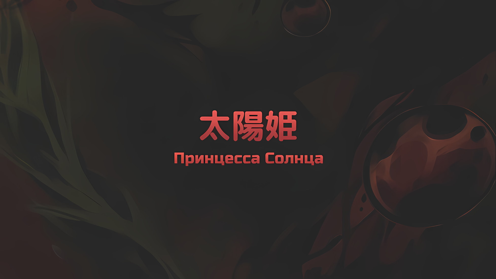
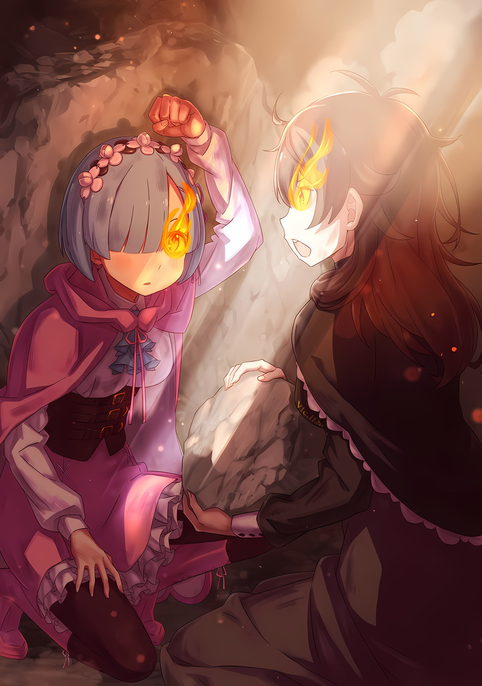

*※※※※※※※※※※※*

???: …Я хочу тебя использовать. Дабы исполнить мое желание, ты должна мне хорошенько послужить.

Это были первые слова, которые он ей сказал, они символизировали их отношения, которые не изменились до самого конца.

Она провела с этим мужчиной несколько десятилетий.

За это время ей так и не дали свободы, а просто заковали в кандалы и заточили в подвале.

У нее был смотритель, который не давал ей умереть, но этот осторожный мужчина заставлял смотрителя молчать и периодически сменял его, так что он был единственным, с кем она общалась все эти годы.

…Лейп Бариэль.

Он был дворянином Драконьего Королевства Лугуника, человеком, над которым властвовали порочные амбиции.

Во время «Войны Полулюдей» Поместье Бариэль стало виконтом*, но после поражения в гражданской войне его понизили до барона.

* Вико́нт — дворянский титул, средний между бароном и графом.

Это унижение должно было стать движущей силой поступков Лейпа, но тут возникает вопрос, как долго могут длиться человеческие гнев и ненависть.

Лейп постоянно напоминал себе об унижении десятилетней давности, как будто это было только вчера.

Лейп: Рано или поздно ты мне пригодишься. Я тот, кто поддерживает в тебе жизнь. Никогда об этом не забывай.

Людям, обладающим разумом, присуще нечто, известное как эмоции.

Например, если кто-то проживет десять или двадцать лет с другим человеком, то, даже если он его изначально недолюбливал, его отношение смягчится, а грубость исчезнет.

Однако с Лейпом все было иначе. От него всегда веяло свежей враждебностью.

Он никогда не говорил ей добрых слов.

Она ничего не знала о его истории, семье или делах Поместья Бариэль.

День за днем она проводила время в плену, в тишине и одиночестве, только для того, чтобы Лейп время от времени навещал ее и рассказывал о делах в Королевстве и о своих неизменных днях ожидания.

Но однажды, лишь однажды, у них состоялся совсем другой разговор.

Лейп: Значит-са, ты, по сговору с полулюдьми, возглавляла гражданскую войну. И с какой же целью?

С момента «Войны Полулюдей» прошло больше двадцати лет, и обсуждать эту тему было уже слишком поздно.

Лейп задал этот вопрос, когда и Валга, и Либре, сражавшиеся вместе с ней, уже погибли, равно как и основные деятели Альянса Полулюдей.

Почему он хотел это знать, она спрашивать не стала.

Она чувствовала, что, если начнет задавать вопросы в ответ, Лейп замкнется, и тема будет закрыта. Поэтому она не скрывала свою цель и говорила прямо.

Ее участие в «Войне Полулюдей» было для того, чтобы выполнить цель своего создания.

Лейп: …Бред сивой кобылы.

Услышав, что «Война Полулюдей» была частью ее столетних усилий достичь своей цели, Лейп тут же выплюнул это недовольство.

Она не гневалась и не печалилась из-за его реакции. Она была такой всегда. Реакция Лейпа оказалась вполне ожидаемой.

С точки зрения этого мужчины с порочными амбициями, все желания, кроме его собственных, не стоили и гроша.

Однако…,

Лейп: Ты родилась такой, какая есть, но все равно хочешь из кожи вон лезть, чтобы стать кем-то другим? Зачем притворяться, что живешь под чужим именем и образом жизни, если твое собственное имя и так уже мертво?

Разговор, который, как она думала, оборвется, продолжился.

Лейп повернулся к ней с глазами, полными злобы, еще более расстроенный, чем когда-либо, как бы говоря, что ее цель была отвратительна.

Лейп: Твоя цель бесполезна и бессмысленна. Да, как и ожидалось, я использую тебя. В конце концов, твоя мечта, когда исполнится, не будет иметь и горстки ценности. Если ты собираешься так растратить свое стремление, тогда просто отдай его мне.

???: Ты…

Лейп: Твоя цель ничего не стоит. Если ты не можешь жить без того, чтобы кто-то указывал тебе, что делать, то ты должна быть использована ради моего желания.

В глазах Лейпа не было и капли негодования или сострадания.

Его затуманенные глаза были полны гнева на тех, кто его унизил, обиды, ненависти к этой эпохе, ненависти к этому миру, ведь он отверг его идентичность, в них черным пламенем горело стремление, он хотел добиться лучшей жизни.

Он был жесток, он будто топтал ее, словно поливал грязью, вонзал в нее клинок, разрывал на части и заставлял истекать холодной кровью.

…Выполнить цель своего творения, заложенную в нее создателем.

В этом и был смысл ее жизни, то, к чему она так долго стремилась.

Но испытывала ли она когда-либо пыл к этой цели? Никогда. Ни разу. Она просто делала то, что было ей дано. Таковы привычка и компромисс, которые управляли ее жизнью, без всякого пыла.

Однако, по сути своей, разве не таким должно быть стремление?

Стремиться к тому, чего сильно желаешь, и пытаться этого достичь — разве тогда неправильно стать именно таким?

Разве путь Лейпа не был правильным вариантом исполнения желаний?

???: …

И вновь прошло много-много времени. Ее отношения с Лейпом остались прежними.

Они почти не разговаривали, время шло и шло, а ей так и не давали роли, где она могла бы быть полезной.

И вот, в конце концов, наступили перемены.

Лейп: Кажется, наконец появилась возможность.

Лейп, чьи глаза горели маниакальным блеском, совсем исхудал, его лицо и тело теперь разъедал возраст, который невозможно было повернуть вспять. Однако в нем все равно не угасало честолюбие.

Наконец наступило время, когда он может схватить болтающуюся перед ним нить, наконец он будет вознагражден за свои усилия, ведь запретил себе даже моргать.

Согласно тому, что она слышала, за последние несколько десятилетий Лейп прочно закрепил свое положение среди Королевской Семьи Лугуника — он получил управление скрижалью пророчеств, Драконьим Камнем Истории, дарованным «Божественным Драконом».

Узнав, что в пророческой скрижали записано предсказание о беде, которая скоро обрушится на Королевство Лугуника… болезни, что поразит Королевскую Семью… Лейп загорелся желанием принять участие в следующей борьбе за трон.

Лейп: Я найду Кандидатку раньше всех остальных. Я возьму ее в жены и отправлю на Королевские Выборы… я обязательно получу трон. И ты тоже мне пригодишься.

Лейп, от которого остались только кожа да кости, сжал кулаки, он был полон решимости сделать это.

Ей постоянно говорили, что она пригодится, но теперь, когда это стало реальным, даже у того, кто был связан с ней на протяжении нескольких десятилетий, появилось некоторое волнение. …У нее были ожидания.

В следующий раз, когда пришел Лейп, он уже нашел Кандидатку и приказал подготовить технику, чтобы подчинить ее разум. Таким образом, он превратит Кандидатку в марионетку и будет своими руками править следующей эпохой Королевства.

Честолюбие Лейпа, задумавшего столь грандиозный план, с упорством реализовывавшего его и доведшего до грани свершения, было, во всех отношениях, мрачно поразительным.

Она хотела, чтобы все сбылось. Она хотела, чтобы он все осуществил. Все это время она следовала своей страсти.

Она хотела, чтобы Лейп воплотил свои грязные амбиции, которые заставили бы отвести взгляд любого, чтобы использовал Королевство для своих целей. Он уже воспользовался «Ведьмой» как очередной ступенькой для своих желаний и теперь хотел реализовать свою безумную одержимость.

Вот чего ей не хватало; Сфинкс хотела, чтобы он научил ее именно этому.

Она ждала. Продолжала ждать.

Она с нетерпением ожидала, когда ей удастся сломать разум женщины, на которой женился Лейп, чтобы использовать ее в качестве Кандидатки на участие в Королевских Выборах.

Она ждала, ждала, ждала и ждала, однако Лейп все не появлялся и не появлялся.

Дабы понять, что произошло, она сняла оковы, которые носила десятилетиями, и отправилась в путь.

И только когда она узнала причину его отсутствия, ей все стало понятно.

Сфинкс: …Ах.

…Она поняла, что то был «Пыл» желания чего-то достичь.

*△▼△▼△▼△*

???: Контрмеры: Требуются… Нет, давай посмотрим, сможешь ли ты это остановить.

Как только Сфинкс заявила об этом, ее козырь, ее туз в рукаве, ее скрытая ловушка была раскрыта.

На переливающейся поверхности водяных зеркал отражалась борьба тех, кто пытался помешать планам «Ведьмы» и спасти Империю.

???: …

Закованная в цепи Присцилла сузила свои багровые глаза и посмотрела в зеркало — на бледное лицо Сфинкс.

Тоскуя, утопая, Сфинкс взвалила на себя величайшее бремя ради исполнения собственных желаний. Суть этого могла бы показаться отвратительной для Империи, для мира и для Винсента Волакии, но не для Присциллы.

Нет, она не желала ни падения Империи, ни гибели мира, ни напрасных усилий своего старшего брата Винсента.

Однако факт оставался фактом: противостоять обстоятельствам ради достижения желаемого результата, отдавая все силы и всего себя, было так прекрасно.

Не исключение даже когда против была направлена ненависть, граничащая с обидой.

Все вещи имеют свою соразмерную ценность.

Те, кто не знает собственных границ и желает большего, гораздо большего, часто обречены. Однако Присцилла всегда с мудростью говорила, что ей не нравятся те, кто довольствуется лишь самым малым.

Она любила образ жизни глупцов, стремящихся к тому, что им не по силам, идущих по пути, который может привести к поражению, стремящихся к солнцу лишь для того, чтобы их крылья сгорели, без разницы, удастся им это или нет.

Присцилла: Очаровательно.

Все те, кто сейчас рисковал жизнью на этом поле боя, не поверили бы своим ушам, если бы услышали слова Присциллы.

Однако это было искренне. Прежде всего, Присцилла никогда не действовала и не говорила так, чтобы обмануть других. Такой образ жизни был ей чужд.

А значит, это была искренняя похвала.

Всех тех, кто взял в руки оружие, подставил плечо другим, пролил кровь и сжег свою душу, и не важно, живы они или мертвы, заслуживали любви.

И, если все так…,

Присцилла: …Полагаю, на меня это не похоже.

Присцилла закрыла один глаз, вдруг на ее красивом лице возникла редкая гримаса.

С самого детства она, предаваясь размышлениям, подражала своему старшему брату. Винсент слишком хорошо понимал всю тяжесть лежащей на его плечах ответственности и никогда не закрывал глаза, даже когда спал.

Это было достойно восхищения, но чрезмерно. …Есть люди, встретить которых можно, лишь прикрыв веки.

Присцилла: Братец, лучше найти тебе кого-то, с кем быть ты сможешь рядом, с кем наконец закроешь свои глаза.

С «Мечом Света» в руках Винсент сжег планы «Ведьмы», что возглавляла «Великое Бедствие»; Присцилла сказала это с полным уважением к его образу жизни.

Затем в водяных зеркалах что-то привлекло ее внимание.

…Альдебаран и Нацуки Субару.

Похвальный клоун Присциллы и Рыцарь полудьяволицы, которая, несмотря на отталкивающую внешность, стала Кандидаткой Королевских Выборов.

Подобно тому, как Сфинкс воспринимала их угрозу, Присцилла также понимала их борьбу… Что они вершили судьбу звезд, несущую нечто значительное.

Присцилла: И что же из «Ведьминских»… Нет, и что же из небес вы пытаетесь обмануть?

Сфинкс, создатель «Великого Бедствия», не оставалась равнодушной к своим многочисленным ухищрениям.

Армия нежити, сотворенная с помощью «Таинства Бессмертного Короля», использование «Каменной Глыбы» для их создания, второе пришествие «Ведьмы Жадности», которой уже однажды удалось уклониться от пламени «Меча Света», намерения убить Аракию, разделившую свою судьбу с землями Империи, звездный свет и Магическая Кристальная Пушка, перегрузка Магического Ядра, развертывание магического круга, чтобы заполучить магические кристаллы, и разыгрывание сцены бедственного положения «Укрепленного Города»…

Кто бы мог подумать, что столь продуманные планы будут проваливаться на каждом шагу?

Для «Мудрого Императора», Винсента Волакии, для его правой руки Чиши Голд… «Белого Паука», да и для самой Присциллы Бариэль это было бы невозможно.

Гибель Империи Волакия должна была стать неизбежной.

Она должна была стать неизбежной, если бы не те, кто с немыслимой силой вырвался из этого тупика судьбы.

Вот почему…,

Присцилла: …Осталось сыграть еще одну партию.

Присцилла произнесла эти слова, глядя на сцену, что плыла по поверхности зеркала.

Огромное водяное зеркало над столицей отразило бедственное положение далекого Укрепленного Города, пытаясь сломить волю жителей Империи к борьбе. …Однако огонь уничтожения, который ранее поглотила пустота, разнес его в разные стороны.

Звездный свет был уничтожен гордостью столицы Империи, Магической Кристальной Пушкой, а водяное зеркало разбилось вдребезги.

Казалось, что все планы «Ведьмы» были сорваны.

Однако…,

Сфинкс: Я еще не закончила.

Звездный свет над Укрепленным Городом померк, но даже так всеохватывающие планы «Ведьмы» не закончились.

Пока «Ведьма» наблюдала, как предотвращается подготовленное ею масштабное бедствие, она использовала это как почву для создания ловушки.

…Водяное зеркало разбилось в небе, превратившись в капли дождя, и обрушилось на всю столицу Империи.

Словно проходящая буря, оно залило столицу Империи, и капли дождя обрушились как на живых, так и на мертвых.

Они должны были превратиться в опасные водяные лезвия.

Медленно капли, скользившие по коже тех, на кого падал дождь, вздрагивали и превращались в острие. Эта опасность нависла над всеми, кроме тех, кто находился внутри зданий, или трансцендентных существ, которые избегали дождя по инстинктивному наитию.

Это стало роковой чертой, избежать которой было уже нельзя.

Присцилла: …

Поэтому Присцилла закрыла глаза.

Ранее она думала о Винсенте, а сейчас… …Шульт, Хейнкель, Эмилия, Круш, Фельт, Анастасия, Серена и Аракия. В темноте за веками Присцилла видела множество лиц, множество душ.

Среди них также были Винсент, Ламия, Рем и Альдебаран.

Все они — люди, которым не хватало еще одной руки для игры.

Присцилла: …Сей мир меняется в угоду мне.

На эти слова Сфинкс попыталась сверкнуть лезвиями дождевых капель, но вдруг замерла.

Она посмотрела на Присциллу через водяное зеркало, ее черные глаза широко распахнулись.

В следующее мгновение иное пространство, созданное для удержания Присциллы, развалилось. …Ведь его охватило сияющее пламя, которое вызвала запертая в нем «Принцесса Солнца».

*△▼△▼△▼△*

В тот момент, когда над Укрепленным Городом вспыхнул звездный свет, все, кто смотрел на небо, потеряли дар речи.

???: …

Это случилось сразу после того, как они победили Злого Дракона. Победа подняла боевой дух всех солдат, что защищали город от осады.

Однако, прежде чем до всех дошел факт поражения самой мощной силы нежити, над их головами разверзлось живописное разрушение — в этот миг многие забыли о биении собственных сердец.

Конечно, были и те, кто в такой ситуации старался сделать все возможное.

Духовный Рыцарь, окруженный аурой света, женщины-воины, не терявшие своего боевого духа, солдат с насекомыми внутри, мужчина большого телосложения с золотым покровом и эскадрон, собранный в свете собственной звезды — вот кого это касалось.

Даже мудрецы, которые не могли сражаться, сейчас на всю использовали свою голову, пытаясь найти выход из этой безвыходной ситуации.

Но, подобно муравьям, которые собрались вместе, чтобы остановить гиганта, они понимали: всему вокруг придет конец.

…До тех пор, пока с далекого неба не прилетел огонь уничтожения, столкнувшись со светом звезды, и мир вспыхнул белым пламенем.

???: …

В эту минуту никто не понял, что произошло.

Сетчатки глаз тех, кто не отвел взгляд, оказались выжжены добела, что, однако, говорило о том, что разрушение, которое должно было наступить прежде, чем к ним вернулось бы зрение, не случилось.

А затем…,

???: …Кх.

Два света — белый от звезды и красный от огня — слились воедино, и небо Укрепленного Города накрыла ударная волна.

Взрыв, прогремевший мгновение спустя, разлетелся во все стороны, сотрясая даже крепкие городские стены. Порывы ветра разошлись по всему городу, унося с собой как живых, так и мертвых.

Кроме того, сильный ветер расколол даже огромную гору, которая подпирала город, в результате чего скалы обрушились вниз. Крупные падающие камни с грохотом завалили один из углов великой крепости.

К сожалению, это место было отведено под пункт первой помощи, куда доставляли раненых…

???: …Рем! Эй, Рем!

Рем несколько раз удивленно моргнула, когда ее окликнул испуганный голос.

На миг ее мысли помутились, ей потребовалось время, чтобы осознать, что произошло.

Но быстро она поняла, что это был голос Кати, которая отчаянно ее звала, и вспомнила, что пункт первой помощи попал под обвал.

Когда Рем увидела трещины в стенах и потолке, она поспешно вытолкнула Катю с пути рушащихся обломков.

И все же…,

Рем: Я… жива…?

Катя: Разумеется, ты жива! Не стоило, тебе не стоило этого делать! Если бы ты умерла, чтобы защитить меня, то в этот раз мое сердце бы не выдержало…

До нее донесся надрывный голос Кати, который подтвердил, что она жива. Следом Рем начала разгребать обломки на своем теле.

Эти обломки были довольно массивными. Даже с учетом ее силы, что принадлежала клану Óни, они должны были быть слишком тяжелыми, чтобы так легко их сдвинуть.

Тем не менее, Рем справилась.

Катя: Р-Рем, твой… твой глаз!

Катя указала на лицо Рем и издала пронзительный крик.

Рем поняла, что Катя указывает на ее левый глаз, в котором, вероятно, горел огонь. Ведь в левом глазу Кати тоже горело пламя.

…Нет, это касалось не только их.

Все, кто находился в пункте первой помощи, кроме Рем и Кати, которые попали под обвал, встали на ноги, отделавшись лишь незначительными царапинами.

В глазу каждого ближайшего человека она видела пламя.

Этот огонь придавал Рем сил.

И все потому…,

Рем: …Присцилла-сама?

Пробормотала Рем, чувствуя жар безболезненного пламени в своем глазу.

Но ведь она не могла знать наверняка. Рем не знала, почему. Она просто последовала зову своего сердца и была уверена в том, кто именно создал это пламя.

Рем: Катя-сан.

Катя: Ч-что происходит!? Вода… есть здесь вода!? Быстрее, быстрее, мне нужна вода, чтобы потушить это пламя…!

Рем: Не думаю, что его нужно тушить. К тому же.

Катя: К тому же?

На глазах у взволнованной и растерянной Кати Рем встала, нашла перевернутую, едва поврежденную инвалидную коляску, подняла в нее Катю и усадила поудобнее.

Затем она посмотрела на стоящих на пункте первой помощи людей и кивнула.

Рем: Я чувствую, что мне пытаются что-то сказать. …Что мы должны продержаться еще немного.

*△▼△▼△▼△*

…Водяное зеркало разбилось вдребезги. Багровая женщина спускалась с неба в брызгах капель.

Все были ею заворожены и смотрели на небо, словно купаясь в лучах заходящего солнца.

Разумеется, это не обошло стороной и «Ведьму».

???: …Присцилла Бариэль!

В этот момент, после разрушения магических кристаллов с помощью активации неполного магического круга, Сфинкс вобрала в себя часть большого количества маны и создала сорок четыре «Ведьмы».

Каждая из них обратила ладони к небу, и вокруг спускающейся Присциллы возник свет.

Однако…,

???: Не отводи взгляд и не трогай танцующую леди!

???: Ну не знаю. Не думаешь, что это плохой ход?

Трансцендентные существа не упустили этой возможности и вмешались, одним махом сократив число с сорока четырех до тридцати шести.

Но даже так, шары света, которых было более чем достаточно, чтобы угрожать одному человеку, собрались и устремились к Присцилле. Смертоносная атака со всех сторон — она пыталась захватить солнце, которое вырвалось из плена…,

???: Не допущу!

В ответ на этот крик родительской любви улицы столицы Империи зашевелились и выпустили копья.

Они преградили путь вспышкам света, что пытались достичь Присциллы. Небо окрасила серия взрывов.

???: Сделаем это, Беатрис!

Беатрис: Очевидно, я полагаю!

Когда Присцилла продолжала спускаться сквозь вспышки света, вокруг нее образовалось аметистовое сияние. Дискообразный кристалл, выступающий в роли щита, перехватил приближающиеся шары света. Он был создан совместными усилиями Духа и заклинателя, чтобы защитить Присциллу.

Однако…,

Ведьма: Еще нет!

«Ведьма» закричала от волнения, как если бы сплевывала кровь.

Сразу же после этого по диску был нанесен сильный удар, отчего он затрещал; в конце концов трещины разрослись, и диск разлетелся на куски.

Тогда «Ведьма» с развевающимися белыми волосами поднялась в небо и попыталась облить беззащитную Присциллу светом, несущим смерть.

???: Ууау!!!

???: Ни за что, я такое не позволю!

Светловолосая девочка телепортировалась с земли, а девочка-олень подпрыгнула и ударила ногой с силой, способной разрушить Кристальный Дворец, прямо по торсу «Ведьмы», которая в это время не видела никого, кроме Присциллы.

«Ведьму» мигом раскрошило. Ее луч света не достиг своей цели.

Ведьма: Катализатор: Требуется.

Она разлетелась на куски, но это было частью ее плана.

В следующее мгновение несколько «Ведьм» на земле соединили руки друг с другом; они были одной и той же личностью, поэтому в идеальной синхронизации ускорили создание техники и породили сильнейшую бурю.

Следом буря превратилась в бушующие воду, ветер и свет, поглотив Присциллу в небе.

Через секунду Присциллу разорвало бы на куски, а ее тело превратилось бы в жалкое подобие…,

???: Айсикл Лайн*…!

* Icicle Line — линия сосулек.

Вдруг буря разрушения разорвалась изнутри, и их взору предстала не растерзанная Присцилла, а ледяной цветок, распустившийся в небесах.

Огромные, роскошные лепестки цветка поймали свет, они не позволили ему достичь Присциллы.

И тут к Присцилле, которая бросила вызов всем смертям, разрушениям и гибели, яростно бросилась какая-то тень.

Это был…,

???: …Принцесса!!!

Альдебаран поднялся в небо столицы на перекошенном столбе из камня и земли, все ближе и ближе подбираясь к Присцилле.

Колонна стремительно росла, и расстояние между падающей Присциллой и поднимающимся Альдебараном сокращалось, сокращалось и сокращалось, и сокращалось… пока не стало равным нулю.

Ал: …Кх.

Балансируя на вершине неустойчивого столба, он вытянул свою единственную правую руку, чтобы поймать Присциллу. И как раз в тот момент, когда они уже собирались упасть вместе, Альдебаран крепко вцепился ногами в колонну, рискуя собственной жизнью, чтобы ее уберечь.

Миндалевидные глаза Присциллы сузились при виде его решительных действий, что граничили с жизнью и смертью,

Присцилла: Это великая услуга.

Пока она говорила, Альдебарана охватили эмоции и он склонил голову. Затем он поднял глаза, его голос дрожал,

Ал: Принцесса, принцесса, моя принцесса…! Наконец-то, вновь… ауч!!!

Присцилла: Вздор. Кто еще здесь кому принадлежит?

Присцилла стукнула рукоятью своего «Меча Света» по голове Альдебарана, который чуть было ее не уронил. Он инстинктивно пригнулся от силы удара, который грозил помять его стальной шлем. К тому же, Альдебаран не мог потереть место, куда его ударили, так как держал Присциллу одной рукой.

Она лишь коротко хихикнула, глядя на жалкого Альдебарана,

Присцилла: Ты, однако, отлично постарался. Воздаю тебе должное.

Ал: Что ж, безмерно благодарен и польщен… А как насчет вас, принцесса? Все ли хорошо? Вы не ранены? Они причиняли вам боль или типа того? Я в том смысле, что вы выглядите такой красивой для той, кого держали в плену.

Присцилла: Больше не говори такой ерунды. Прежде всего, красота моя не пострадает от короткого заточения. Следи за языком, Ал.

Ал: …

Держа его за руку, Присцилла говорила уверенно, отчего у Альдебарана… У Ала перехватило дыхание.

Затем он еще раз глубокомысленно кивнул, как бы окончательно убедившись, что перед ним действительно Присцилла. В ответ на реакцию Ала она, все еще находясь в его объятиях, огляделась по сторонам,

Присцилла: Свидетели, вот и явилась главная актриса. Радуйтесь во всю мочь.

В глазах Присциллы отражались фигуры тех, кто в этой битве поставил на кон собственную жизнь — в глазах каждого из них горело пламя.

Пламя души Присциллы Бариэль пылало в глазах тех, кого она считала достойными любви.

В их число, конечно же, входил…,

Ал: Принцесса?

Ал был рядом с ней. Она приподняла пальцем козырек шлема, который он носил, и заглянула внутрь. …Правый глаз на его лице, которое он не показывал никому, кроме Присциллы, горел тем же пламенем.

Узрев это, Присцилла мило улыбнулась и заговорила.

Присцилла: Неважно. …Как всегда, сей мир меняется в угоду мне.
