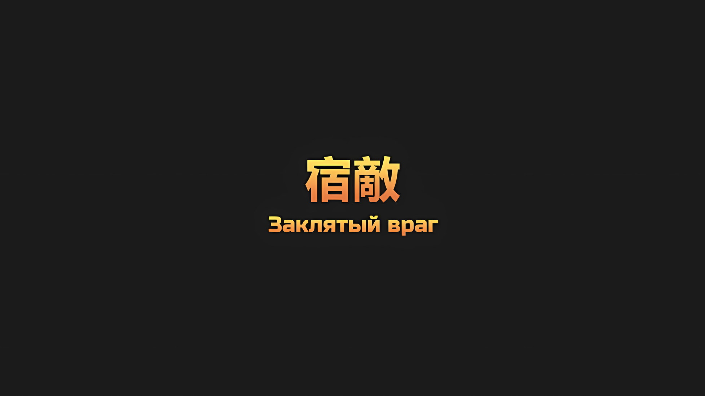
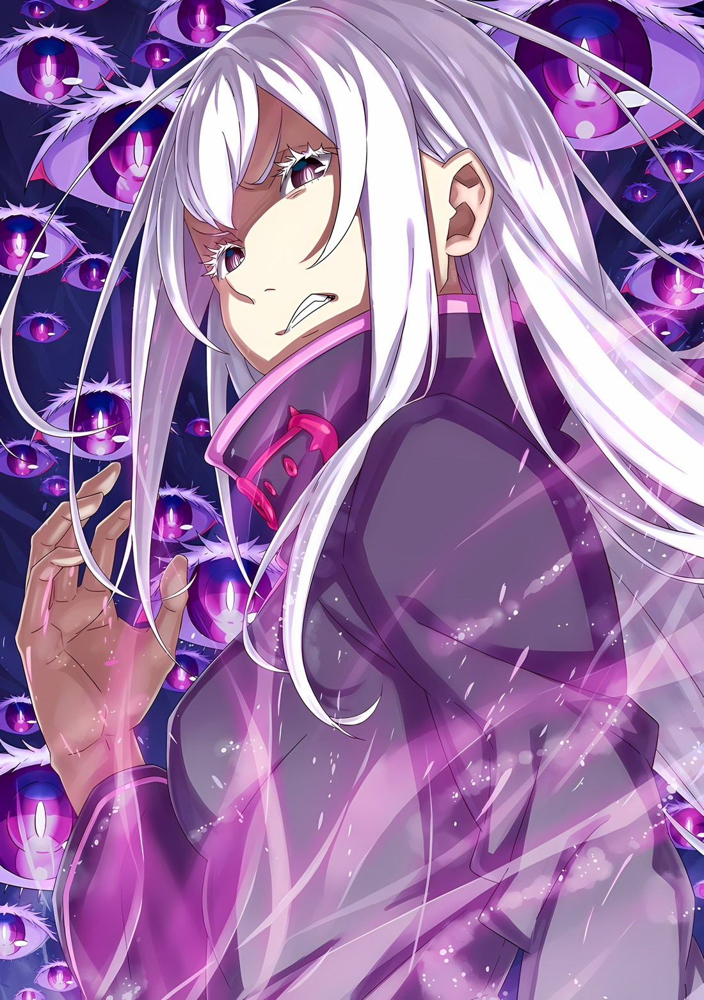

*※※※※※※※※※※※*

…Ее будто по шею похоронили в темном месте.

Ее ноги утопали в смеси из земли, песка и гальки, она покрывала ее до пояса, груди и плеч. И только ее голова осталась открытой.

Впрочем, было лишь вопросом времени, когда и она тоже окажется погребена под холодной пылью, которая накапливалась все больше и больше.

Она отчаянно задрала голову, попыталась выдохнуть всю скопившуюся пыль, она так хотела отсрочить момент, момент, когда задохнется, момент, когда ее засыплет по самую макушку.

Ей еще никогда не было так тяжело.

Голова ее была нестабильной, как по воде ходить, но тело — нет, с телом все было иначе. Она не сомневалась, что двигает-владеет своим телом лучше, чем большинство людей.

Однако теперь все изменилось, от этого ей хотелось рыдать. Беспомощной, она была такой беспомощной. Вот только слезы лить она не умела. Даже это.

У нее не получалось буквально все. Тем не менее, было то, чего она желала.

Она даже не осознавала этого, но в конце концов поняла. …Поняла, насколько же была жадной.

И тогда…,

???: …

Вдруг почувствовала она, как пыль перестала сыпаться.

В последний раз она мягко упала ей на лоб. И тут мерцающий сине-белый огонек озарил все вокруг и закружился вокруг нее.

Этот свет вызывающе вспыхивал на ее глазах, он так сильно ее раздражал, поэтому она боролась, боролась и боролась. В конце концов, она смогла поднять руки вверх.

Бело-синий огонек поднялся чуть выше, он словно убегал от ее рук.

Угнаться за ним — вот что она хотела, поэтому с силой вытянула свое погребенное тело с целью дотянуться. Ей удалось вытащить плечи и грудь, а если она еще и выпятит талию, то до огонька останется всего ничего.

И вот, она встала на ноги и подняла голову, чтобы поймать сине-белый свет, как вдруг кое-что поняла.

Прямо перед ней горело красное пламя, оно ярко освещало все вокруг.

Вслед за этим их окутал сине-белый свет, который она пыталась поймать, он хотел подтолкнуть ее к этому пламени.

На какой-то миг она замешкалась. Но не из-за страха перед пламенем.

Она замешкалась, ведь в голову ее пришли сомнения — может ли она сгореть в этом огне?

Однако эта нерешительность быстро ушла.

Речь шла не о том, достойна она или нет, а о том, хочет ли она своего сожжения.

Ее собирались сжечь, или так она думала.

Потому-то…,

???: …Хватит уже, очнись. Сколько еще мне тебя ждать?

Она сделала шаг вперед, прямиком навстречу нежному пламени.

Всего шажок и…,

???: …Принцесса, я, я не пожалею сил.

???: Само собой. …За кого ты меня вообще принимаешь, моя приемная сестра?

*△▼△▼△▼△*

…В этот самый момент «Ведьма», Сфинкс, поняла, что все ее планы пошли крахом.

Во время «Великого Бедствия» она породила множество нежити. Через много-много проб и ошибок она выяснила местонахождение собственной души и с ее помощью выполнила цель своего создания — воспроизвела «Ведьму Жадности».

Кроме того, путем убийства «Каменной Глыбы», путем использования техники «Таинства Бессмертного Короля», путем краха обширных земель Волакии, путем конца всего, что составляло Империю, она хотела показать Присцилле Бариэль, которая была помещена в иное пространство, гибель ее родины.

Так Сфинкс планировала осуществить возмездие, триумф, месть, превосходство, завоевание, свержение, покорение, осквернение, порабощение, взлет, падение, буйство, ликование, счастье или хотя бы просто «Что-то» против Присциллы, которая пригласила на смерть Лейпа Бариэль, человека, научившего Сфинкс этому отвратительному, грязному «Пылу».

Теперь все это полностью, безжалостно, до неузнаваемости, разваливалось на части.

Сфинкс: …«Таинство Бессмертного Короля»…

Сфинкс не могла не признать то, что оно утратило свою эффективность.

Магический круг, сосредоточенный в пяти местах вокруг Рапганы — на севере, востоке, юге и западе Империи… в местах, предназначенных для вечно переселяющейся «Каменной Глыбы», использующей в качестве среды кровь, которой были пропитаны обширные земли Волакии, все еще продолжал воскрешать мертвых с помощью «Таинства Бессмертного Короля».

Однако и этому тоже придет конец, если потерять огромные запасы маны «Каменной Глыбы».

Сфинкс: «Пожирательница Духов», Аракия… она подчинила себе Муспеля?

Сфинкс ничего не могла поделать с этой немыслимой реальностью, лишь строить догадки на основе произошедшего.

Принятый Аракией Великий Дух был слишком могущественным, и, хотя она должна была разорваться на части после его поглощения, изгнание фехтовальщика «Меча Грез» Масаюме полностью подчинило Муспеля.

Сейчас «Каменная Глыба» стала единым целым с «Пожирательницей Духов».

К тому же, у Аракии не было причин ослушаться Империю Волакия и поддержать «Великое Бедствие».

Посему…,

Сфинкс: Нежить более не будет возрождаться.

Необходимое условие для того, чтобы армия бессмертных, стая мертвых волков, могла бесконечно возрождаться, перестало выполняться.

Даже если поступление маны от «Каменной Глыбы» ныне прекратилось, это вовсе не означало, что нежить тут же погибнет. Просто игровое поле было сбалансировано. …Теперь, равно как и для живых, смерть знаменовала собой конец.

Сфинкс: …Кх.

После прекращения подачи маны в магический круг она потратила около пяти секунд на то, чтобы разобраться в ситуации.

Но всего за эти пять секунд Сфинкс, у которой оставалось только тридцать шесть тел, потеряла еще семь.

«Синия Молния» и «Хвалитель» были слишком сильны, они двигались с невероятной скоростью и силой.

Хотя Сфинкс предполагала, что сможет воспроизвести способности своей создательницы, «Ведьмы Жадности», она не могла постоять за себя. Она не нанесла ни одного сильного удара. Ее противники были на таком уровне, что она не справлялась с ними даже за счет численности.

И даже если бы она захотела что-то изменить, против «Ведьмы» сражались не только эти двое.

Поэтому…,

Сфинкс: …Отступление: Требуется.

Сфинкс: …Отступление: Требуется.

Сфинкс: …Отступление: Требуется.

Оказавшись в безвыходной ситуации, «Ведьма» Сфинкс сочла отмену своего плана наиболее целесообразным решением.

Она приняла твердое решение, разработала безошибочные стратегии и приступила к осуществлению задуманного, имея для этого все необходимое, но, если все настолько перевернулось, значит, изменить ее план было уже невозможно.

Это раздражало, но лучшим выходом было смириться, ведь она выполнила одну из двух своих главных целей.

Фактически она выполнила свое давнее предназначение, данное ей создателем. Цель, к которой она шла более трехсот лет, была важнее, чем та, к которой она стремилась всего год.

Сфинкс: …Отступление: Требуется.

Сфинкс: …Отступление: Требуется.

Начнем с того, что ситуация никогда не была сбалансированной.

Ее создание подтвердило это мнение. От нее требовалось второе пришествие «Ведьмы Жадности», и она, несомненно, добилась этого.

Она изменила свой облик Сфинкс и стала «Ведьмой Жадности», Ехидной…

Сфинкс: …Отступление: Требуется.

Она воссоздала ее. Таким образом, цель ее создания была достигнута.

С исчезновением Сфинкс и возрождением Ехидны закончились дни ее одержимости, длившиеся более трехсот лет.

Желать чего-то большего было бы нерационально. Это было бы нерационально. Это, было бы, нерационально.

И пусть это было бы нерационально…

Сфинкс: …

В ту же секунду поднятый «Меч Света» испустил ослепительное сияние, заявив о своем присутствии всей столице Империи.

Сжечь иное пространство, силой вернуться в небеса столицы Империи, преодолеть будущее, которое должно было разорвать ее на части, будто это вполне закономерно — все это было провокацией, чтобы привлечь «Ведьму», которая решила отступить.

Одетая в красное, как кровь, платье, с яркими, как солнце, волосами, ослепительная, как огонь, женщина, которая не могла жить иначе, как опалять других подобно пламени, широко улыбнулась.

Женщина: Уж лучше тебе явиться, Сфинкс, ибо враг твой — я.

В этот момент двадцать девять «Ведьм», двадцать девять Сфинкс, каждая из них приняла решение.

И тогда…,

Сфинкс: …Я ТВОЙ ВРАГ, ПРИСЦИЛЛА БАРИЭЛЬ!!!

Сфинкс: …Я ТВОЙ ВРАГ, ПРИСЦИЛЛА БАРИЭЛЬ!!!

Сфинкс: …Я ТВОЙ ВРАГ, ПРИСЦИЛЛА БАРИЭЛЬ!!!

*△▼△▼△▼△*

Присцилла: Если мы дадим ей уйти, то, без сомнения, это станет бедой для всего мира. Обычно, если речь заходит об изменении положения дел в мире, я к этому не притрагиваюсь. …Однако, когда доходит до такого, то все иначе, она выбрала меня своей судьбой.

Сказала Присцилла, спускаясь с руки Ала по осыпающимся каменным столбам.

Ее вид, воплощение высокомерия, был настолько полон уверенности и величия, что трудно было поверить в то, что совсем недавно она находилась в плену.

Ал, который внезапно оживился после этих слов, выглядел так, словно на него давили,

Ал: Так значит, принцесса, вы говорите, что разберетесь с ними? А давайте просто окружим эту мразь и выбьем из нее все дерьмо… ай!

Присцилла: Чушь. Если лишим ее мы жизни, то дадим ей ту же возможность. Битва должна закончиться, прежде чем решит она, что весь мир — ее враг.

???: …Иначе нам не победить?

Присцилла скрестила руки на своей груди, подчеркивая ее пышность. А Аракия, стоя на коленях рядом, подняла голову. Принцесса пожала плечами на вопрос «Пожирательницы Духов», чей правый глаз горел, а левый был кроваво-красным.

Присцилла: Аракия, прекращай лить ерунду, как Ал. Разве могу я думать лишь о победе или поражении?

Аракия: Но, принцесса, вам же ведь нравится побеждать. Когда вы побеждаете, то выглядите счастливее.

Присцилла: Естественно. Такая уж я.

???: Не игнорируй то, что сама и сказала! Ты всех путаешь!

Присцилла задавала Аракии какие-то беспричинные вопросы, поэтому Субару, не в силах больше молчать, вмешался.

Внезапно он подался вперед, отчего, на его напор, багровые глаза Присциллы сузились,

Присцилла: Чего? Ты. Здесь не место для детей. Быстро уходи.

Субару: Ой, виноват, я виноват! Я Нацуки Субару, просто мой сайз* немного изменился! Я Рыцарь самой лавлист* и кьютэст*, что не видали даже сами небеса, Эмилии-тан!

* Size — размер; loveliest — очаровательной; cutest — милейшей.

Присцилла: Назвать такого ребенка Рыцарем… похоже, у полудьяволицы этой совсем достойных людей нет. Даже тот шумный и глупый простолюдин и то лучше бы подошел.

Субару: Так это и есть я! Дэтс ми*!

* That's me — это я.

Еще более беспричинно воскликнул Субару, он совсем забыл о слабости в своем теле.

Он знал, что Присцилла забывает всех, кто ей неинтересен, но только не Субару, ведь он переживал за ее судьбу, хотя и не так сильно, как Ал, Шульт или сисконщик Авель.

И, обращаясь к Субару, который вытер кровь с носа и подошел поближе к ней с таким лицом,

Присцилла: …Глупец.

Субару: А?

Присцилла: Знаешь, что такое шутка? …Нацуки Субару.

Субару: …Ах.

Присцилла сказала это с невозмутимым лицом и скрещенными руками. Когда смысл ее слов дошел до Субару, его охватил жар.

Но это был не гнев из-за того, что над ним подшутили, а чувство, глубоко волнующее его сердце.

Ведь Присцилла Бариэль вспомнила и назвала его имя.

Субару: …Я прям чувствую, как старый я, которому тогда надавали по морде, наконец получил свою награду!

Подавив свои прошлые эмоции, Субару потрогал подбородок и произнес эти слова.

Впрочем, у каждого в столице Империи сейчас не было времени продолжать этот разговор.

Поэтому…,

Присцилла: Нужно вас всех в кое-чем просветить. Что смотреть вы должны не на мир вокруг, а на меня собственной персоной.

Сразу после этих слов Присцилла расцепила руки и подняла «Меч Света» к небу.

И тут, без каких-либо объяснений, «Меч Света» стал ярче. Глаза Субару обожгло ярким светом. Казалось, будто здесь родилось новое солнце. …Но, несмотря на это, свет не вызывал боли, подобной той, что будет, если посмотреть на солнце.

Присцилла: «Меч Света» режет то, что я хочу разрезать, и сжигает то, что я хочу сжечь.

Присцилла еще раз объяснила его особенность, она улыбнулась, держа в руках ослепительно сияющий драгоценный меч… меч, который давал о себе знать в любой точке столицы Империи.

Она рассмеялась, чтобы спровоцировать того, кто должен был обратить на нее внимание, но не присутствовал.

Присцилла: …Уж лучше тебе явиться, Сфинкс, ибо враг твой — я.

Субару: …

Субару интуитивно понял, что это была ловушка Присциллы.

Сфинкс, которая хотела забрать Авеля, была ею одержима. И эта одержимость росла вместе с тем, как она общалась с плененной Присциллой. Или, возможно, сама Присцилла спровоцировала ее на все это.

В любом случае…,

???: …Я ТВОЙ ВРАГ, ПРИСЦИЛЛА БАРИЭЛЬ!!!

По напряженной атмосфере на поле боя стало ясно, как «Ведьма» восприняла объявленную Присциллой войну.

Ее поступок казался ни логичным, ни разумным, Субару даже не мог посмеяться над ним.

Никто не мог игнорировать яркий свет солнца, когда оно бросало вызов.

Присцилла: Ал, я доверяю это место тебе, Аракия, ко мне.

Ал: …Кх, хорошо.

Аракия: Да, принцесса.

Ал и Аракия послушно выполнили короткие и убедительные указания Присциллы.

Первому доверили это место, а вторую попросили сопровождать. Затем Присцилла обратилась к кому-то другому: Субару.

Присцилла: Нацуки Субару.

Субару: О, аа… Я…

Присцилла: Ты же говорил о Героических Грезах?

Субару: …

Последовавшие слова быстро развеяли его шок, шок от того, что его снова назвали по имени.

Субару и Ал обменялись решимостью, которую должны были нести с собой, которую должны были реализовать как в Империи, так и в будущем.

Кто-то мог бы посмеяться над тем, какое глупое заявление сделали такие слабые люди, как Субару и Ал, но Присцилла не собиралась смеяться.

Присцилла: …Делай то, что должен.

Действительно, слова Присциллы подтвердили мысли Субару.

Ее голос словно толкнул его в спину, а затем и в душу, отчего он замолчал. Присцилла, однако, не стала дожидаться ответа. Она просто сказала то, что хотела, и отвернулась.

Аракия обхватила талию Присциллы, и они взлетели в воздух.

И вот так просто эти двое улетели,

Ал: Принцесса! Пожалуйста, ведите себя как обычно!

Присцилла: Само собой. Да за кого ты меня вообще принимаешь?

Ал: Присцилла Бариэль! Вы моя принцесса!

Присцилла: Глупец, кто еще здесь кому принадлежит?

Она улетела, оставив на своем лице легкое подобие улыбки.

Присцилла и Аракия оставили Субару и остальных. …Нет, на самом деле они их не оставили. Они ушли от «Ведьмы», которую держали в плену.

???: …

Субару и Ал одновременно повернулись, чтобы посмотреть на «Ведьму». Она сидела у разрушенной стены, ее тело было окутано черным светом и не могло двигаться.

Эта печать была похожа на ту, что наложили на Роя Альфарда, Архиепископа Греха «Чревоугодия», которого они захватили в Сторожевой Башне Плеяд; однако она производила несколько иное впечатление.

Роль Субару заключалась в том, чтобы противостоять «Ведьме», сила которой теперь была запечатана.

Беатрис: Субару! Вот ты где, в самом деле!

Сразу после того, как Субару надумал действовать, появилась Беатрис. Вместе с Розваалем она поприветствовала своего партнера, столь необходимого ей на этом заключительном этапе игры.

Также на спине Розвааля прилетела Спика.

Розвааль: А для мага ведь лучше держать свои руки свобооодными~, но думаю, вряд ли так получится, да?

Беатрис: Какой привередливый, я полагаю! Давай, Спика, пойдем, в самом деле!

Спика: Еао, Ау!

По команде Беатрис она оттолкнулась от спины Розвааля и опустилась на землю. Субару погладил Спику по голову и улыбнулся ей, на ее лице читалось веселье.

После чего он снова взял ее за руку и повернулся к «Ведьме».

А затем…,

Субару: Спика, я знаю, что у тебя может появиться изжога и даже вздуть живот, но мне правда нужно, чтобы ты попробовала это еще раз, пожалуйста.

Спика: У!

Спика откликнулась на его просьбу с искренней, полной острых зубов, улыбкой. Полагаясь на ее стойкую волю, Субару взглянул на «Ведьму».

Она смотрела на него с тем же лицом, что и «Ведьма», у которой был самый ужасный в мире характер. Сузив свои глаза, она улыбнулась и спросила.

Ведьма: У тебя получится забрать мою душу?

Не имея возможности двигаться и находясь на грани жизни и смерти, она говорила с голосом, полным самообладания.

Субару подумал о руке Спики в своей, об Але, который кивал рядом, о Беатрис и Розваале, которые работали вместе, чтобы избавиться от препятствий на его пути, о людях, которые объединились, чтобы спасти Присциллу, и о теплых цветах льда, которые появились в конце…,

Субару: Не заблуждайся, тебя одолею не я, а мы.

Ведьма: …

Следом Субару и Спика сделали шаг вперед. Их расстояние до «Ведьмы» уменьшилось.

Затем они вытянули по руке и коснулись щеки «Ведьмы»,

Субару: …Сфинкс.

Дабы отведать душу мертвой «Ведьмы», они в последний раз бросили вызов «Звездному Поеданию».

*△▼△▼△▼△*

…В тот момент, когда шары света сыпались один за другим, Винсент взял Медиум за руку и выскочил с самого верхнего этажа Кристального Дворца.

«Ааа!?» — вскрикнула Медиум, она старалась не уронить Мэделин. Винсент притянул ее талию поближе к себе, они неслись к выходу.

Параллельно с этим он обратился к тому, до кого не мог дотянуться,

Винсент: Ольбарт Данкелькен!

Ольбарт: Не стоит слов!

Сразу же после этого батарея Магической Кристальной Пушки, от которой отпрыгнули Ольбарт и Винсент, тащивший на себе Медиум и Мэделин, разлетелась на части.

С высоты сразу подул сильный ветер, поэтому Винсент велел Медиум: «Держись покрепче». Убедившись, что ее руки надежно обхватили его, он с силой пнул стену.

Используя порыв от удара, они уклонились от лучей света и опустились на землю.

Ольбарт: Батюшки мои, было близко. По-моему, теперь единственное, в чем я могу переплюнуть других шиноби, — это умереть от старости.

Винсент: И правда, никогда не слышал, чтобы шиноби умирали от старости.

Ольбарт: Просто у нас принято стариков, которые больше не могут быть полезными, заставлять носить с собой магический камень, чтобы, если что, взорваться.

Медиум: Хватит! Кончайте со своей жутью, отпусти меня! От! Пу! Сти!

Несмотря на потерю обеих рук, Ольбарт пребывал в хорошем настроении; пока он разговаривал с Винсентом, Медиум, размахивая руками и ногами, опустилась с рук на землю.

Теперь, когда его руки освободились, Винсент вновь взял «Меч Света» и посмотрел наверх.

Тогда…,

Винсент: …«Ведьма»?

Винсент увидел, как на батарею спустилась девушка, ее белые волосы развевались.

Магическое Ядро было потеряно, а приличное количество магических кристаллов дворца уничтожено масштабной техникой, но «Ведьма» все равно приземлилась туда, ведь именно там находилась ее цель.

Что же задумала «Ведьма»?

Винсент: …Могуро Хагане?

Ольбарт: Хм? О чем вы, Ваше Превосходительство? Если речь о нашем Могуро, то Балрой же его забрал, разве нет?

Винсент: Глупец, он забрал только Магическое Ядро. Во дворце остались части «Метеора», кроме ядра…

Медиум: …! Авель-чин!

Винсента поразило ощущение, похожее на раскат грома. Ему пришла в голову одна вероятность. Медиум похлопала его по плечу и указала на дворец.

На глазах Винсента, который аж зубами скрипел от напряжения, в Кристальном Дворце произошли перемены. …Дворец начал медленно вставать.

???: …

Это был Могуро Хагане, «Метеор» Империи Волакия, известный как Кристальный Дворец.

Магическое Ядро, которое управляло и питало энергией «Метеор», оказалось извлечено, его взрыв распространился в далекие небеса.

Проще говоря, Могуро Хагане, один из «Девяти Божественных Генералов», был лишь частью огромного «Метеора». Даже во время битвы за столицу Империи до «Великого Бедствия» Могуро показал истинные возможности дворца… механизмы для защиты Магического Ядра все еще были на месте.

«Ведьма» воспользовалась этим. После потери Магического Ядра она силой активировала защитные механизмы, которые более не могли выполнять свою первоначальную цель. Таким образом, был пробужден Стальной Гигант… точнее, Магический Кристальный Гигант.

Кристальный Дворец, который можно было бы даже назвать Гигантским Солдатом Магического Кристалла, хоть и имел сходство с Могуро Хагане, но источал ни с чем не сравнимую злобную ауру. Он встал.

Его огромное тело было около пятидесяти метров в высоту, оно состояло из магических кристаллов, что делало его аналогом гигантской ходячей бомбы.

Винсент: Если мы бездумно вмешаемся…

Смысл того, что Могуро и Балрой поставили на кон свои жизни, исчезнет.

И действительно, как раз после того, как Винсент стиснул зубы.

???: Приступай.

???: Да, принцесса.

Эти голоса были отнюдь не громкими, но, несмотря на это, звучали слаженно.

Когда Винсент и остальные задумались, не пролетело ли что-то над их головами, огромный кулак пламени, размером в десять метров, ударил по Гигантскому Солдату Магического Кристалла.

Огромная волна жара прокатилась по небу и земле, заставив Гигантского Солдата сделать большой шаг назад. Улицы под его ногами оказались разрушены, как будто их смела огромная армия.

Это был мощный удар, не следивший за своим направлением.

???: Мне часто говорят, что я не смотрю, куда иду. Будто бездумна я в своих действиях.

Винсент: …

Медиум: Ах~! Присцилла-чан!

Гигантский Солдат Магического Кристалла сильно наклонился назад. Именно Аракия выпустила этот кулак пламени. Она с большой скоростью летела по воздуху в сияющем алмазном одеянии.

Затем женщина, которую держала «Пожирательница Духов», отпустила руку Аракии, приземлилась на ноги и откинула подол платья. Это была Присцилла. Медиум громко объявила о ее присутствии.

Медиум: Авель-чин, Авель-чин, это Присцилла-чан!

Винсент: Можно и не повышать голос, мы все и так ее видим. …Где ты была заточена?

Присцилла: Как же для тебя это типично, братец, из-за манеры твоей это воссоединение никогда не станет чем-то трогательным. Я была в ином измерении. В ином измерении, куда «Ведьма» унесла всю подземную темницу дворца.

Винсент: Понятно; неудивительно, что тебя не могли найти. Как ты сбежала?

Присцилла: Конечно же, подожгла его.

Этот прямолинейный ответ Присциллы удовлетворил Винсента.

Учитывая то, чему «Ведьма», возможно, подвергала ее в плену, на этой последней сцене она предстала во всем своем величественном великолепии…,

Винсент: …Присцилла, ты…

На мгновение он почувствовал неловкость, он хотел кое-что спросить у Присциллы. Однако Гигантский Солдат Магического Кристалла не дал ему возможности.

Аракия кружила в воздухе, тревожа Гигантского Солдата своей необычайной силой.

Чтобы уничтожить Аракию, весь Гигантский Солдат Магического Кристалла засветился, из того, что следовало бы назвать его правой рукой, вырвался огонь уничтожения.

Он, возможно, и не был таким мощным, как взрыв Магической Кристальной Пушки, но достаточно сильным, чтобы уничтожить жизнь или половину столицы Империи. Этот огонь нацелился на Аракию, которая летала по небу…

Присцилла: …Самое время.

Когда по Аракии открыли огонь, Винсент искал возможность вмешаться и прикрыть ее; однако, став свидетелем того же, что прокомментировала Присцилла, он поднял свой «Меч Света».

В этот момент из свободной левой руки Гигантского Солдата вырвался свет уничтожения и направился на Винсента и остальных.

Медиум: …

Винсент и Присцилла стояли с «Мечами Света» наготове. Ослепительное багровое сияние драгоценных мечей превратилось в разгорающееся пламя, которое противостояло наступающему свету.

Из-за этого конфликта, что неустанно жег дрова боевого духа, по руке Винсента, в которой он держал «Меч Света», потекла кровь.

Присцилла: Почему, разве это не беспечно с твоей стороны, братец?

Винсент: …До недавнего времени ты отдыхала, так что наберись мужества.

Присцилла: Боже мой, отравил и убил собственную сестру, изгнал ее из родной страны, подумать только, что ты и сейчас будешь обращаться с ней так жестоко, насколько же ты стал похож на Императора Волакии, братец.

При этом обмене «зуб за зуб», в разгар опасной для жизни борьбы со светом уничтожения, Винсент прикусил моляры и сжал губы, которые вот-вот хотели разжаться.

Он мог это признать. Он почувствовал облегчение. Его сердце радовалось возвращению Приски… нет, Присциллы. Даже ее нещадное поведение можно было сжечь как топливо, чтобы усилить стремление к сражению.

И вот, на месте, где Винсент и Приска держали позиции…,

???: …О дети моих детей, это великая услуга.

Появился третий «Меч Света», мгновенный взрыв огня положил конец этой схватке. «Терновый Король» с блеском исполнил свой замысел.

Без малейшей тени в своем великолепии в бой вступил Югард Волакия.

Югард: Звезда Моя сказала мне выступить против пробудившегося Кристального Дворца. Ведь только «Меч Света» может справиться со светом магических кристаллов. Хотя, вижу, силой вы не обделены.

Винсент: Даже если твое присутствие ничего не изменит, я благодарен за помощь.

Присцилла: Хмм. …Муженек души моей дорогой мамочки, да еще и «Терновый Король».

Винсент закрыл один глаз и ответил Югарду, в то время как Присцилла посмотрела на последнего сквозь призму глубоких чувств, не связанных с его помощью.

Винсент знал, что Присцилла, заядлая читательница, прочла «Ирис и Терновый Король». Но опять же, ее знания должны были отличаться от знаний Винсента, который не ведал о том, что Йорна=Сандра и Ирис=Йорна.

Как бы то ни было, глаза Югарда сузились под пристальным взглядом Присциллы,

Югард: Ты ведь тоже член Императорской Семьи этого поколения, я прав? Ты так похожа на мою первую жену… Терриолу.

Присцилла: …Хм.

Присцилла приняла оценку Югарда молча, что было для нее необычно.

Винсент почувствовал легкое беспокойство из-за реакции Присциллы, ведь обычно она презирала сравнения с другими. Он никогда бы не подумал, что она будет так очаровательно волноваться из-за встречи с персонажем сказки.

Так или иначе, Винсент, Присцилла и Югард были здесь.

Винсент: Три «Меча Света» даже без «Церемонии Императорского Отбора», уму непостижимо.

Югард: Истинно так. Если не считать обращения этого клинка против братьев и сестер, никогда не проявлялось более одного «Меча Света». А против врага Империи и подавно.

Как отметили Винсент и Югард, такая ситуация не должна была стать возможной.

Это была сцена, ставшая результатом «Великого Бедствия» и возмутительного пренебрежения Винсента «Церемонией Императорского Отбора», борьбы за звание Императора Волакии.

Присцилла: Да у вас, видимо, много свободных минут, раз вы так бурно даете волю своим мыслям и эмоциям.

Винсент и Югард кивнули друг другу, а стоявшая между ними Присцилла шмыгнула носом.

Держа в руке свой драгоценный меч, Присцилла была подобна величественному пламени; при этих словах Винсент и Югард еще раз переглянулись, а затем посмотрели вперед.

Медиум: Авель-чин! Присцилла-чан! Муж Йорны-чан!

Позади них троих, стоящих бок о бок, Медиум громко вскрикнула и упала назад вместе с Мэделин на руках и раненым Ольбартом.

До сих пор она кричала как никогда громко…,

Медиум: …Сделайте все, что в ваших силах!!!

Услышав это, Винсент расслабил уголки рта, Югард глубокомысленно кивнул, а Присцилла, сверкнув багровыми глазами, посмотрела на Гигантского Солдата Магического Кристалла.

Присцилла: Само собой разумеется. …Ты будешь завороженно смотреть на танец моего меча, будешь восторгаться им до глубины души.
