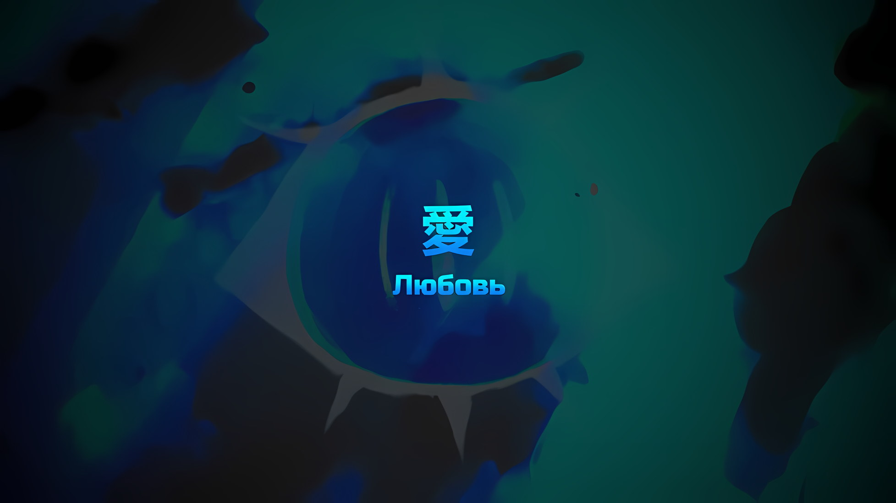
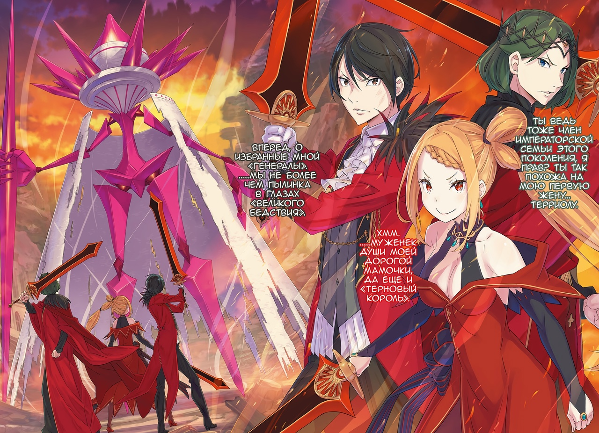
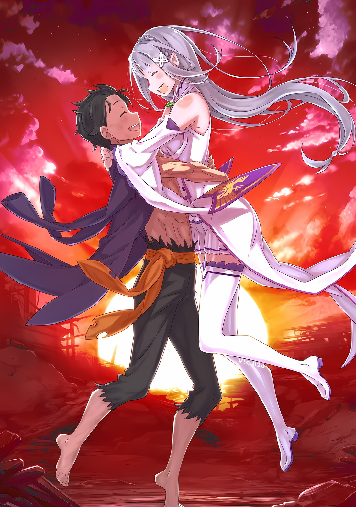

*※※※※※※※※※※※*

…Нужно было схватить то, что даже не имело формы.

Это бесформенное, безусловно, существовало, однако стоило к нему слегка прикоснуться, как оно сразу, сквозь протянутые пальцы, теряло свою форму и растворялось вдаль.

Как вода, как ветер, как свет.

Как тепло, как тень, как мечта.

Чем больше ты хотел коснуться его, чем сильнее боялся, что сломаешь его, тем дальше оно становилось.

???: Сколько ни прикасайтесь, вы ни за что не ухватитесь.

Они не могли прикоснуться к тому, что было прямо перед ними, хотя уже явно это сделали.

Ноги, стоящие на земле, кожа, греющаяся в лучах вечернего солнца, озаряющего мир багрянцем, глаза, пристально вглядывающиеся в противника, жар пламени, живущий в одном из этих глаз; все это ощущалось, чувствовалось, и все же.

???: …Сфинкс.

С произнесением ее имени роль «Ведьмы», затеявшей бедствие, должна была быть съедена.

Чудовищное Полномочие, которое отбирало жизни, сеяло несчастье и скрывало свою катастрофу, теперь будет использовано для блага, для восстановления жизни многих людей.

Душа «Ведьмы» отказывалась принимать этот исход. Сфинкс упорно, с рвением создавала себя тысячи раз.

???: …

«Ведьма» постоянно порождала нежить, а потому познала природу души.

Так ей удалось воспроизвести «Ведьму Жадности». Изменив природу своей души, она избежала «Звездного Поедания» и пламени «Меча Света».

Сродни безумному, бесцельному путешествию, будто ищешь брошенную иголочку в необъятной пустыне, словно хочешь найти Духа, который растворился в воздухе и ничего не слышит, подобно поискам утонувшего в море.

???: Нельзя выходить в море под парусом, когда нет ни карты, ни компаса.

Позади Субару, готового к последней решающей битве в Империи, заговорил человек, пришедший из того же мира, что и он.

Он никогда не показывал своего лица под холодным железным шлемом. Возможно, сейчас его глаз… глаз Ала, как и глаз Субару, пылал ярким пламенем.

Субару понял, что сейчас не может полагаться только на себя.

Прямо, как и сказал Ал. Если ты знаешь, что стоишь в пустыне, что смотришь на незнакомый мир, что плывешь по большому океану, то не можешь позволить себе безрассудство.

???: …Уау.

Тепло ее маленькой руки говорило ему о том, что она рядом.

Но не только потому, что они держались за руки, он понимал, что она здесь. Прежде, чем они вот так соприкасались, он не раз враждовал с ней, хотел ее понять.

Снова и снова, вновь и вновь Нацуки Субару пытался понять ее…

Субару: Моя карта — это мое сердце. А мой компас — это вы двое. …Спика, Рем.

Чем больше он плавал в своем прошлом, тем хуже казались его первые дни в Империи Волакия.

Положиться ему было не на кого, даже Рем, с которой он так хотел быть рядом, к которой так тянулся, отвернулась, отказалась от него, зато Спика, которую он поначалу опасался, держал подальше, всегда вставала на его путь, ведь своего у нее не было.

И все же, с «Воспоминаниями» или без, Рем есть Рем; с прошлым или без, Спика есть Спика; какими бы тропами ни шел, что бы ни делал, кого бы на своем пути ни повстречал, Субару в основе своей всегда был и оставался Субару.

Субару: …Сфинкс.

Он назвал ее имя, переплел руки со Спикой, попытался коснуться вечно ускользающей души «Ведьмы».

…Сила «Звездного Поедания» крылась в желании.

Его желание, полное эгоизма, — он надеялся на других, умолял попытаться спасти кого-то силой, которая только грабила и разрушала, ведь так удобнее и стократ проще, — это все равно что загадать желание на падающую звезду.

Но в этом-то и дело, сейчас его желание возлагалось на нечто, что не было таким по своей сути, поэтому он должен быть предельно искренним.

Он не просто обратился к ней по имени. Узнать и назвать имя человека — значит заявить, что ты поднимаешься на сцену вместе с ним, что собираешься участвовать, касаться его жизни.

???: Тогда нужно предстать этому миру во всей своей красе! Мы все живем на большой сцене, где каждая отведенная секунда нашей жизни дана нам, чтобы блистать! Каждый человек — актер, актер, играющий свою роль, роль нести, создавать, порождать из своих уст большие, культовые, фантастические реплики! Есть ли на свете слова, что не возьмут за душу, что не задержатся в сердцах большинства? Есть ли люди, что лишены актерского мастерства? Ответ: нет!

Что сказать незнакомцу, чтобы его заметили?

Сколько раз протянуть руку, чтобы запомнили?

Чтобы привлечь чье-то внимание, чтобы затронуть чью-то душу, первым делом нужно перейти к знакомству.

И он знал лучший способ дать кому-то понять, кто он такой.

???: Меня зовут Эмилия. Просто Эмилия.

*Даже добавить нечего. Да, теперь понятно. Никаких ты, никаких тебя. Никаких я, никаких меня.*

…Это был диалог между Нацуки Субару и Сфинкс.

Субару: …Сфинкс.

Теперь он обращался к ней, не чтобы коснуться души, а чтобы привлечь внимание.

«Ведьма», отличавшаяся по тембру… нет, девушка, шедшая по бескрайней пустыне, пересекавшая незнакомый мир и дрейфовавшая в большом океане, чтобы выбраться на сушу, сейчас обратила на него свой взгляд; он заметил это.

Субару: …

Хотя они были уже так близко, что он мог чувствовать ее дыхание, только сейчас Субару впервые встретился с ней взглядом.

Какое бы лицо у нее ни было, пока он игнорирует чувства Сфинкс, ему не добраться до глубин ее души.

Естественное и банальное общение — он использует его в финальной битве Империи.

Субару: Меня зовут Нацуки Субару. Мое имя происходит от звезд. …А тебя?

*△▼△▼△▼△*

Невозможные в обычной ситуации — три «Меча Света». Стоящий на пути к завтрашнему дню Империи — Гигантский Солдат Магического Кристалла.

В каждом из них таилась необычайная сила, они противостояли друг другу. Заходящее солнце, освещавшее Империю Волакия, затмило другое солнце с земли, оно отбросило все понятия о сумерках, его сияние озарило всю столицу.

Гигантский Солдат: …

Магические кристаллы зловеще сверкнули, их мигом высвободившийся свет уничтожения окрасил улицы столицы во тьму. Без всяких слов Волки Меча разбежались в три разные стороны — так им удалось уклониться.

Жизнь растительности и цветов, которые попали под черный свет Гигантского Солдата, оказалась приостановлена, как бы замерла. В этот момент «Терновый Король» вскочил на крышу одного из зданий и нацелился на ногу большого голема.

Он взмахнул ослепительным мечом, дабы разрубить беззащитную ногу Гигантского Солдата… однако что-то преградило путь его клинку.

???: Хо, значит, обнажать свою кожу стесняешься?

Защищенная мечом своего предка, «Тернового Короля», «Принцесса Солнца» рассмеялась. Своими багровыми глазами она смотрела на сотканную из маны белую ткань, которая теперь покрывала колоссальное тело Гигантского Солдата.

В отличие от «Стального», Могуро Хагане, разве не «Ведьме» или какой-нибудь девушке было бы сообразно укрыться под одежду?

???: Быть наготове!

На контрасте с улыбающейся «Принцессой Солнца» «Мудрый Император» поднял крик с лицом суровым, жестким.

Тотчас же огромный переливающийся меч солдата вонзился в землю, его послесвечение хотело настичь снующих снизу врагов. От такого улицы столицы разорвало на километр.

Меч солдата представлял собой столб из магического кристалла, он держал его в своей руке.

Один из столбов, что построили вокруг Кристального Дворца на высоте, не уступающей Гигантскому Солдату, стал смертоносным мечом с пятидесятиметровым лезвием, по своей мощи он не уступал «Мечу Света».

Однако…,

Принцесса Солнца: Прекрасно-прекрасно. Такая показуха мне по душе.

Вонзив «Меч Света» в лезвие магического кристального меча, которым во всю атаковали, «Принцесса Солнца» оседлала его.

Взмах меча поднял ее на высоту более ста метров от земли, поэтому она впилась взглядом в голову Гигантского Солдата… на бывшую батарею Магической Кристальной Пушки, на трон «Ведьмы».

Она не могла взглянуть «Ведьме» прямо в глаза, поскольку ее трон превратился в закрытый цветок из магических кристаллов.

В таком случае ей нужно заставить «Ведьму» обратить на себя внимание…,

Принцесса Солнца: Почему бы мне не показать тебе, что такое настоящий «Энтрэтеймант*»?

* Entertainment — зрелище (она сказала это с ошибками).

В тот же миг, в ответ на сияние «Меча Света», магический кристальный меч в руке Гигантского Солдата вспыхнул ярким пламенем.

С фиолетовой волной адского огня пятидесятиметровый столб из маны превратился в свет, который ослепил всех вокруг.

Естественно, из-за сжигания этого меча «Принцесса Солнца» потеряла свою опору, а потому полетела головой вниз… дева небес подхватила ее взмахом огненных крыльев.

Принцесса Солнца: Это великая услуга.

Похвала «Принцессы Солнца» отразилась улыбкой на щеках девы небес, она придала сил ее сердцу. Они взмыли в небо в сопровождении лент света. Следом Гигантский Солдат достал второй меч и двинулся вперед, дабы нанести удар,

Терновый Король: Звезде Моей, моим народам, я посвящаю этот взмах…

Мудрый Император: Не смотри сверху вниз на предводителя Волков Меча!

Две полосы света меча пронзили тонкий торс Гигантского Солдата по диагонали вверх, с обеих сторон.

Совместная атака «Тернового Короля» и «Мудрого Императора» разорвала ткань, защищавшую тело Гигантского Солдата, и с белым сиянием мечи безжалостно вонзились в его огромное тело.

Стоило драгоценным мечам столкнуться с магическими кристаллами, как раздался приятный звон, будто крик Гигантского Солдата.

Гигантский Солдат: …

С хрустом разлетелся меч Гигантского Солдата, все его тело начало трескаться. Хоть это и говорило о том, что, похоже, его загнали в угол, это послужило толчком к тому, чтобы он изменил стиль боя.

Сквозь бесчисленные трещины по всему телу он вдруг засиял. В следующую секунду во все стороны, исключая любые слепые зоны, хлынул дождь света… нет, туман света, от которого невозможно было убежать.

Даже от капель дождя могли уклониться «Святой Меча», «Синия Молния» и «Хвалитель».

Но от тумана… даже этим трансцендентным существам было бы не уклониться от тумана.

Посему…,

Мудрый Император: …«Меч Света», Волакия.

Принцесса Солнца: …«Меч Света», Волакия.

Терновый Король: …«Меч Света», Волакия.

Один в небе и два на земле; три багровых меча, усилив свое сияние, породили стену пламени. Искрящийся огонь и туманная морось света, уничтожающие все, с чем только соприкоснутся, оказались закрашены друг другом.

Они защищались от атаки «Ведьмы». Трещины на теле Гигантского Солдата разрастались, и, подобно тому как змея сбрасывает свою старую кожу, он шелушился фиолетовым блеском, его сияние усиливалось.

Чтобы не дать Гигантскому Солдату сделать следующий ход, по нему распространилась волна силы, отличной от «Меча Света»… здания столицы медленно вырывались из земли, их словно поднимали большие невидимые руки; десять, двадцать, в общей сложности почти сто снарядов окружили Гигантского Солдата.

Той, кто это сделала, была дева небес, она одной рукой держала «Принцессу Солнца», а другую обращала к Гигантскому Солдату…,

Дева небес: Я — собака принцессы.

Принцесса Солнца: Великолепное положение.

Сразу же после этого водоворот зданий полетел на врага, словно желая вонзить в него свои зубы.

Но Гигантский Солдат схватил в каждую руку по столбу и, приняв стойку с двумя мечами, начал быстро вращать верхнюю часть своего колоссального тела… он исполнял танец мечей разрушения, уничтожения и измельчения.

Этот танец мечей не только свел на нет натиск зданий, но и создал вихрь из тумана света.

Мудрый Император: Сколько еще за этот проклятый день я увижу, как все вокруг умирает?

Перед невообразимой бурей мечей «Мудрый Император» тяжело вздохнул. Двинувшись вперед с непоколебимым взглядом черных глаз, он направил свой клинок против вихря, опустошающего столицу, Империю, да и все живое.

Одновременно с ним «Принцесса Солнца» и «Терновый Король» скрестили свои клинки, вместе они остановят бурю мечей.

Мудрый Император: …Кх.

Из его губ хлынула кровь. «Мудрый Император», стиснув зубы, взял на себя это бремя и устоял на ногах. Смесь света и силы пламенем охватила бурю мечей.

Вихрь, окутанный фиолетовым сиянием, запылал от огня «Меча Света» и постепенно изменил свой цвет. Капли тумана внутри водоворота клинков начали искриться, превращаясь в огненный столб высотой до небес.

Зрелище поражало воображение. Подумать только, такое мог сотворить несовершенный «Меч Света», который и свою истинную силу показать-то толком не мог…,

Мудрый Император: …

«Мудрый Император» крепко сжал «Меч Света» и сузил глаза, глядя на поднимающийся столб огня. Он просто стоял перед ярким пламенем, которое становилось все сильнее.

Он прекрасно понимал, что в разгар битвы останавливаться и отвлекаться на размышления — самый глупый шаг.

Вслед за этим…,

???: …Люби меня.

Раскаленный меч Гигантского Солдата рассек бурю света — и, не давая себе времени на передышку, солдат сразу же выпрыгнул из нее и атаковал. Однако взмах его меча был парирован ударом гэты.

Подхваченная порывом ветра, появилась «Ярчайшая» с пламенем в одном из своих глаз. Она мигом перешла на блестящую красоту и танец, когда взмахнула подолом своего кимоно.

Ярчайшая: …

Нацелившись на «Ярчайшую», которая была в воздухе и не могла двигаться, Гигантский Солдат попытался взмахнуть мечом вверх. Однако и этот удар не удался.

Терновый Король: Я не допущу, чтобы кто-то наложил руки на Звезду Мою.

Вмешавшийся «Терновый Король» подхватил «Ярчайшую» на руки и, приняв удар вертикальным взмахом своего «Меча Света», молниеносно разрубил лезвие солдата.

Продолжение истории «Ирис и Терновый Король» ожило в наши дни; отскочившее от земли острие меча Гигантского Солдата пролетело с севера на юг и повредило столицу.

Стоило им обратить внимание на юг Империи, как на севере города вспыхнул белый свет.

*???: «…РГХАААААААААА!»*

С южного неба, хлопая белыми крыльями, взревел Дракон, окутанный в саму суть пасмурного неба.

«Облачный Дракон», который сражался исключительно ради своего любимого человека, перешел на другую сторону и послал дыхание в противовес разрушению. Он не считался с ценностями жизни и смерти.

Этот удар отбросил Гигантского Солдата назад, но тот вонзился своими острыми ногами в улицу и устоял; у него остался лишь один столб из магического кристалла. Внезапно раздался пронзительный звук — столб распался на множество маленьких мечей, которые стали выстраиваться в строй, чтобы защитить Гигантского Солдата, подобно белой ткани, что была раньше.

Даже сейчас воля «Ведьмы», воля «Великого Бедствия» к войне еще не ослабла. То же самое можно было сказать и о…,

Мудрый Император: …

Находясь в самом сердце тотальной войны Империи Волакия, «Мудрый Император» ненадолго отвлекся от происходящего.

Даже сознавая свои ограничения и слабости, он подумал, что нигде не было видно человека, который всегда находился рядом в ситуациях, когда другие рисковали своими жизнями.

Мудрый Император: Что ж, скорее всего и ты тоже бросился в какую-нибудь безрассудную битву.

Вложив в эти слова определенное доверие и ожидания, «Мудрый Император» усилил сияние своего драгоценного меча и, глядя на Гигантского Солдата, излучающего злобу и коварство, шагнул вперед.

Мудрый Император: Вперед, о избранные мной «Генералы». …Мы не более чем пылинка в глазах «Великого Бедствия».

*△▼△▼△▼△*

…Нацуки Субару и Спика противостояли «Ведьме» по имени Сфинкс.

Они пытались завладеть душой мстительной и живучей «Ведьмы», а Ал должен был держать врага на расстоянии, чтобы никто не вмешался.

???: Ах, за дело! Никто не победит ни меня, ни принцессу!

Подстегивая себя ревом, Ал размахивал импровизированным дао.

Позади него у стены сидела Сфинкс, а перед ней на полу, скрестив ноги, расположился Субару.

То, что пытался сделать Субару вместе со Спикой, было непонятно даже для Ала.

Услышав об их ужасной идее положиться на Полномочие «Чревоугодия», Ал задался вопросом: в своем ли они уме? Однако Присцилла, уверенная в способностях Субару, приказала им действовать.

Если это приведет к светлому завтра, то Ал поддержит их всеми силами и проследит, чтобы все получилось.

???: Уль Гоа.

Над головой Ала Розвааль изливал огненный дождь.

Хотя это и не был высший уровень заклинания, такое количество магии в быстрой последовательности было делом сложным. Но даже его выдающееся мастерство не смогло одолеть врага, которого он пытался сдержать.

???: Уль Хьюма.

В ответ на огненный дождь с земли в небо полетел шквал воды.

По напору и своей дальности, оба они относились к первоклассным магам этого мира. Это была магическая война на редко встречающемся в наше время уровне… Маг и «Ведьма» превратили мир в своего союзника, дважды обманули его и безжалостно использовали друг против друга.

Хотя Присцилла громогласно заявляла о себе, не все «Ведьмы» слетелись к ней, как мотыльки на огонь. Часть из них поняла, что «Меч Света» — не единственное, чего им стоит опасаться, поэтому пришли сюда.

Однако…,

???: Значит, так тому и быть, в самом деле!

С внешностью юной девушки и мастерскими движениями Беатрис, правый глаз которой горел, применила Магию Тени.

В одно мгновение ее поднятые руки окутали все вокруг бледно-фиолетовой дымкой, замедляя движения атакующих «Ведьм» и нежити, которая, лишенная самосознания, бросилась вперед по команде.

Ал решительно воспользовался этим преимуществом.

Ал: Вам выпали плохие звезды!

Ее идеальный контроль над магией ослабил врага, дав Алу время обезглавить нежить одну за другой. Через свой шлем он подмигнул Беатрис, которая ему помогла.

В этот самый момент, когда она не могла увидеть его подмигивание, лицо Беатрис изменилось.

Беатрис: Это плохо, я полагаю!

Откликнувшись на ее слова Ал обернулся со звуком «А?» и увидел, как… массивный обломок с фиолетовым свечением, размером в десятки метров, летит прямо к ним.

Ал и не подозревал, что это был отколотый кончик меча Гигантского Солдата, с которым сражались Присцилла и остальные. Что Ал знал, так это то, что прямое попадание этого обломка превратит всех вокруг в фарш…,

Ал: Нам нужно…

Уйти от летящего обломка.

Ал даже не представлял, сколько попыток для этого потребуется, да и времени на какие-либо подсчеты у него не было. Он всегда выбирал метод проб и ошибок, вместо пустой теории.

Ал: Обновление матрицы, повторный мысленный…

???: …Не сдавайся!!!

Секунду спустя мощная рука перехватила обломок, который пролетал мимо Ала.

Рев и сильный порыв ветра поднялись позади него, но все же обломок удалось удержать на месте. Все это сделал Гарфиэль, который обнажил свои острые клыки.

Гарфиэль: Прости, что так поздно, Беатрис! Капитан…

Беатрис: Нет, ты как раз вовремя, в самом деле! Защитить Субару и Спику — вот условие нашей победы, я полагаю.

Гарфиэль: Ага, усек момент, все будет четко! Как говорится — «Если Шепчешь Ты о Любви, Бери Пример с Тернового Короля».

Ударив ногой по огромному обломку, Гарфиэль сцепил кулаки перед грудью. Его глаза буквально горели, все его тело было полно желания сражаться.

???: …Отступление: Требуется.

Тихий голос возвестил о присутствии «Ведьмы», и все подняли головы, чтобы увидеть в небе вихрь из света. Он притягивал окружающие здания и обломки, которые взлетали вверх, дробились и превращались в частицы света.

В этих частицах света чувствовалась разрушительная сила, одно слово «Ведьмы» — и все они сотрясут землю…,

???: …Халибель-сама, пожалуйста, не могли бы вы…

???: Без проблем. Всегда рад помочь такой труженице.

Вдруг раздались два голоса, и в следующий миг мимо них пролетело пушечное ядро в кимоно… нет, девочка-олень.

Она крутанулась в воздухе и ударила «Ведьму» по спине в момент, когда та уже собиралась обрушить вниз дождь из частиц света. Этот удар разделил бедную «Ведьму» на два.

Халибель: Ого, какой великий подвиг. С такой девчушкой, как ты, будущее Империи в надежных руках.

С тем же порывом она хотела нырнуть в вихрь света, но ее вовремя спас черный человек-волк.

Он быстро развеял вихрь света и мягко поймал девочку той же рукой.

Человек-волк, который швырнул девочку, и другой человек-волк, который поймал ее, привели Ала в смятение.

Ал: На поле боя пришел новый монстр! Кто-то на подобии Сесилуса?!

Халибель: Не отрицаю, но эй, довольно грубо звучит.

Девочка-олень: Давно не виделись. Прошу простить за мою дерзость, но Сесилус-сама и Халибель-сама настолько разные, что это и впрямь грубо. …Может лучше будем защищать Шварца-сама?

Ал: Да, в точку. Быстро соображаешь! Я только рад сильным парням в команде. Давайте же защитим брата!

Халибель: Хорошо. Похоже, мы уже на финишной прямой.

Танза, девушка в кимоно из Города Демонов, поприветствовала Халибеля, человека-волка. В глазах обоих горело благословение Присциллы, что ободряло.

Кроме того…,

Беатрис: Не знаю, откуда это и от кого, но нам сделали хороший подарок, в самом деле.

Сказав это, Беатрис коснулась своей маленькой ладошкой большого куска меча солдата. …Обломок, который остановил Гарфиэль, оказался магическим кристаллом.

Беатрис махом расщепила его на ману. Вокруг нее сразу появилось около сотни аметистовых мечей, которые с движением ее руки начали танцевать.

Беатрис: Полагаю, Бетти использует свой избыток маны именно так. Вы, если вы оставите хоть одну царапину на Субару, то будете безжалостно наказаны.

Танза: Если это и правда случится, то именно я буду нести наказание Беатрис-сама!

Увидев горящие взгляды Беатрис и Танзы, Ал пожал плечами.

…*Похоже, сохранность Субару тоже нужно включить в условия обновленной матрицы*, подумал он.

*△▼△▼△▼△*

Таким образом, под защитой Ала и остальных, Субару смог сосредоточиться.

Он не был ни без сознания, ни во сне. Субару не думал о битве, разворачивающейся поблизости, ведь его сознание было не в пределах столицы Империи.

Сейчас Нацуки Субару находился не в охваченной войной столице, а в белом мире. Здесь не было никого, кроме него, Спики, которая держала его за руку, и Сфинкс, что стояла перед ними.

…Это место было легко принять за «Коридор Воспоминаний».

Субару: Навевает плохими воспоминаниями.

В прошлом он попал туда без всякой на то причины — тогда его «Воспоминания» оказались съедены.

В его памяти еще свежи впечатления о том, как он доставил Эмилии и Беатрис немало хлопот, а также о том, как Рам и Юлиус попали в безвыходную ситуацию.

И, прежде всего, это было место, где исчез «Нацуки Субару».

Субару: Но именно поэтому я здесь целиком и полностью.

Спика: Уу?

Субару: Тебе незачем знать о том месте. Теперь ты другая. Все нормально.

Субару улыбнулся Спике, лицо которой было озадаченно, и глубоко вдохнул.

Белое, спокойное место; причина, по которой Субару оказался здесь со Спикой и Сфинкс, крылась не в том, что их имена тоже начинались на букву «С».

А потому, что у всех них была глубокая связь с тем «Я», которым они не являлись. Именно поэтому они хотели поговорить между собой без посторонних.

Сфинкс: Сфинкс — это имя монстра, о котором знал мой создатель.

Субару: Хм? Ах, так вот как появилось твое имя.

Сфинкс: Да. Если бы с самого начала все пошло так, как хотел мой создатель, то я бы носила имя Ехидна. Но этого не случилось, поэтому я получила другое имя.

Сфинкс на удивление спокойно рассказала ему историю своего имени.

Насколько знал Субару, сфинкс — это существо с телом льва и головой человека, охранявшее пирамиды и загадывавшее загадки.

Субару: Утром на четырех ногах, днем — на двух, а вечером — на трех… Поняла про кого я?

Сфинкс: …? Может, про монстра? Или про монстра, который может менять свою форму?

Субару: Ну, можно подумать, что так, но на самом деле ответ — человек.

Недовольные таким ответом, Сфинкс и Спика нахмурились, но Субару хотелось бы направить их жалобы к сфинксу, который и придумал эту загадку.

В любом случае…,

Субару: Спасибо, что рассказала. Взамен я хочу тебе кое-что показать.

Сфинкс: Кое-что показать?

Субару: Да. …Хотя я не уверен, что тебе это понравится.

После этих слов Субару слегка улыбнулся и посмотрел на Спику. Как бы развеивая его опасения, она подняла свою руку в его и издала «Уу!».

Это был ободряющий возглас Спики, который говорил о том, что она смирилась со своим «Я» на шаг раньше, чем Субару.

…Когда кто-то закрывал глаза в «Коридоре Воспоминаний», то чувствовал свой запах.

Он уже слышал об этом вскользь, но, похоже, память и запах тесно переплетались. Многие воспоминания были связаны с запахами, возможно, именно поэтому так происходило в «Коридоре Воспоминаний».

Как бы то ни было, следуя за своим запахом по фальшивому «Коридору Воспоминаний», Субару медленно разбирался в неопределенности, чтобы превратить ее в определенность.

В ходе его многочисленных «Посмертных Возвращений» Ольбарт, лишившийся обеих рук, извинился за то, что теперь ему будет трудно отменить «Инфантилизацию»… но заместо извинений Субару попросил наставление.

Его тело и душа жаждали вернуться к нормальной жизни. Оставалось только позволить запаху указать ему путь.

Если он сможет это сделать…,

Субару: …Меня зовут Нацуки Субару. На всей Земле и Небесах я единственный и неповторимый, без единого гроша в кармане.

И действительно, голос, который только что отпустил глупую шутку, стал немного ниже. Высота взгляда изменилась, а рука Спики в его хватке вдруг стала меньше.

Однако все не так, как можно было подумать. Спика не уменьшилась. …Субару изменился.

Субару: …

Видимое преображение. Его душа стремилась вернуться к первоначальной форме.

Из-за сильной боли в сердце и душе, которая проникала через его нервы и вены от превращения из ребенка во взрослого, глубокие эмоции Субару пронизывали каждую клеточку его тела.

И вот, вновь обретя себя, Субару снова встретился лицом к лицу со Сфинкс… нет, он встретился с ней впервые.

Сфинкс: …Приятно познакомиться, Нацуки Субару.

Догадавшись о намерениях Субару и наблюдая за его преображением, Сфинкс поприветствовала его, как если бы встретила в первый раз. Услышав это, он подумал, что, возможно, она и впрямь способна к нормальному разговору.

Вот о чем подумал Нацуки Субару, когда его разум, тело, сердце и душа вернулись в нормальное состояние.

Субару: Но, все же, мы должны все уладить.

Сфинкс: Да, должны. …Разговор: Требуется.

Субару: …Почему?

Сфинкс: Что значит «почему»?

Субару: Почему ты все пыталась сделать сама?

Он задал честный вопрос.

«Ведьма» по имени Сфинкс устроила «Великое Бедствие», чтобы уничтожить Империю Волакия, она погубила множество жизней, совершила целую гору непростительных поступков. Но было ли это нужно?

Если ее цель заключалась только в том, чтобы воссоздать своего создателя, «Ведьму Жадности», то…

Субару: Наверное, должны были быть и другие пути. Но ты выбрала не тот. Если бы только все было иначе, тогда бы мы могли…

Сфинкс: Хочешь сказать, мы могли бы обойтись без войны? Невозможно. Пересмотр: Требуется.

Субару: Почему нет!?

Сфинкс: Потому что во мне был мотив, кроме воссоздания моего создателя.

Окинув себя взглядом, Сфинкс слабо улыбнулась и констатировала этот факт.

Восприняв эту улыбку как знак того, что Сфинкс радуется чувству собственного «Я», Субару больше не мог с ней спорить.

В любом случае, Нацуки Субару определенно, безошибочно нашел себя, нашел свою душу.

Спика: Уау.

Субару: Да, знаю. Спасибо, Спика.

Спика обратилась к Субару, когда он прикусил губу. Возможно, ей хотелось поделиться эмоциями насчет того, что он вернулся к своим прежним размерам, но она сдержала это в себе и сосредоточилась.

Он так хотел ответить на эти чувства. …Даже если для этого ему придется пройти через ад.

Субару: …Сфинкс.

Сфинкс: Что? Что бы ты ни сказал или ни сделал, я…

Субару: Хэппи бёздей*.

* Happy Birthday — с днем рождения.

С этими словами Субару коснулся Сфинкс, глаза ее расширились от такого неожиданного поздравления.

А затем…,

*△▼△▼△▼△*

Греясь на ветру, который разносил приятный вечерний аромат, Присцилла аплодировала самой жизни.

Она была в восторге от симпозиума* между «Генералами», собранными Винсентом, и Сфинкс, которая с помощью механизмов «Метеора» Кристального Дворца заставила бушевать Гигантского Солдата.

* Симпозиум — философский текст Платона о генезисе, цели и природе любви. Таппей сравнивает финальную битву между Сфинкс и Империей с пиром, где каждый выражает свою любовь.

Она хотела и дальше воспринимать все это как сон, из которого нельзя пробудиться, как спектакль, который никогда не закончится, как историю, конца которой нет и не будет.

Однако такое детское «эго» не подходило для занавеса, что опускался над этой битвой…,

Присцилла: Как и подобает мне, именно я опущу занавес.

Затем Присцилла отпустила руку Аракии и начала падать.

Устремившись прямо вниз, она вернула «Меч Света» в небесные ножны, раскинула руки и закрыла глаза, греясь в лучах заходящего солнца.

Даже если Присцилла не видела их, души тех, с кем она делила пламя своей души, передавались ей, словно шепот близости с миром.

Аракия, окруженная лентами света, отразила магию «Ведьмы», а Дракон, покрытый броней из облаков, остановил возможное разрушение. Йорна, стоящая в гармонии с мужем, громила почву в глубоком выражении любви, она не стеснялась делиться ею со своей дочерью.

И, как посредственный старший брат, Император Волакии, Винсент Волакия…,

Винсент: Не успею.

Он бесстрашно посмотрел своими черными глазами на Гигантского Солдата, который поднял над головой два меча и готовился уничтожить столицу Империи.

В следующий миг из-за спины Винсента сверкнула молния, которая пронзила эту атаку насквозь…,

???: …Свидетельствуйте, о Наблюдатели небесные. …Свидетельствуйте о выборе, который сделает мир… нет! Свидетельствуйте, как он выбирает меня!

Две полосы, первая — белый блеск лезвия, вторая — черный свет рассечения; вспышки клинков, что способны разрубить свет звезд и логику проклятий, пронеслись по небу.

Предзнаменованию гибели столицы Империи, Гигантскому Солдату Магического Кристалла отрубили руки от плеч. С раскатом грома и клубами дыма блеск магических кристаллов превратился в пыль, а сверкнувшие «Меч Грез» и «Меч Дьявола» положили конец их существованию.

Тем не менее, Гигантский Солдат все еще орудовал мечами, которые парили вокруг него, и пытался подавить непокорную волю Империи.

Разумеется, это касалось и падающей Присциллы.

???: …Присцилла Бариэль.

Свет уничтожения, достаточно яркий, чтобы закрасить небеса, с силой пробился сквозь ее веки, стремительно приближаясь к ней. Тогда она открыла глаза и вытянула руки в стороны.

В следующую секунду Присцилла поймала «Мечи Света» «Мудрого Императора» и «Тернового Короля». Одним движением она превратила в ничто «Ведьминские» мечи, которые сразу же вспыхнули и закружились вокруг Гигантского Солдата, застилая небо багровым занавесом пламени.

Присцилла: …

На миг Присцилла исчезла из виду… тут же «Принцесса Солнца» прорвала завесу пламени и ринулась прямо к закрытому цветку из магических кристаллов на голове Гигантского Солдата.

Все это было благодаря трем «Мечам Света»… Опираясь на свой «Меч Света», выпущенный из ножен прямо в небо, Присцилла летела с мечами своего брата и предка в руках.

…«Меч Света», на котором стояла Присцилла, вонзился острием в цветок и, прорвав лепестки, проник внутрь.

???: …Присцилла Бариэль.

Шквал световых шаров врага в тот же миг оказался уничтожен «Мечом Света» «Тернового Короля».

Когда пламя разбушевалось повсюду, Присцилла спустилась на пол и двинулась вперед.

???: …Присцилла Бариэль.

Одновременно с ней, минуя пламя, заслонившее ей обзор, Сфинкс бросилась вперед с клинком света в руке.

Они встретились взглядами, после чего Присцилла сожгла клинок своей соперницы «Мечом Света» «Мудрого Императора».

Сфинкс: …Присцилла Бариэль.

С горящими от ярости глазами Сфинкс многократно выкрикивала ее имя, на что Присцилла лишь улыбалась. Заметив ее улыбку, она отпрыгнула назад и подготовила свои руки.

На ее пальцах родилось десять световых клинков, которые мигом разбушевались в цветке, беспорядочно отражаясь от магических кристаллов внутри; калейдоскоп «Смерти» засиял убийственной красотой.

При виде этого хаотичного и бурного зрелища Присцилла подняла обе руки к небу.

Затем она схватила драгоценный меч и…,

Сфинкс: …ПРИСЦИЛЛА БАРИЭЛЬ!

Присцилла: Да, так меня зовут.

В звучном реве этого голоса чувствовался некий пыл, приправленный враждебностью. Тотчас же Присцилла взмахнула ярким «Мечом Света».

…Вспышка искрящегося пламени, свет, напоминающий восход солнца, горячо озарил ее жизнь. Внутренняя часть цветка из магических кристаллов засветилась и начала распускаться.

Это означало, что росток ее души…,

Присцилла: Ты должна гордиться собой, Сфинкс.

Сфинкс: …

Присцилла: Никто иная, как ты, справилась с ролью врага моего. …Это великая услуга.

Выпрямившись после взмаха «Мечом Света», Присцилла обратилась к Сфинкс. На ее ответ она сузила свои черные глаза, и,

Сфинкс: …Даже если мне не удалось добиться своего?

Присцилла: Само собой. Да за кого ты меня вообще принимаешь?

Ответила с насмешкой Присцилла.

Тут Сфинкс опустила брови и тяжело вздохнула с лицом, теперь уже утратившим свою враждебность,

Сфинкс: Присцилла Бариэль. …Мой судьбоносный враг, «Великое Бедствие», Сфинкс.

Как та, кто нашла смысл жизни, который отличался от первоначальной цели ее создания, она улыбнулась.

…Таков был финал между «Принцессой Солнца», Присциллой Бариэль, и «Великим Бедствием», Сфинкс.

*△▼△▼△▼△*

Однажды в прошлом она чуть не погибла.

Тогда у нее тоже была цель, достичь которой ей не удалось, но она спокойно приняла тот факт, что все закончится, что она ее не достигнет; так же спокойно, как ночь принимает заходящее солнце, она отпустила свои бесполезные переживания.

И что же теперь?

???: Так же, как и тогда, я не добилась своего и исчезаю… и все же…

Сейчас ее маленькое сердце жаждало не заката, а восхода; она чувствовала, как оно с «Пылом» бьется внутри.

Сомнений нет, вот истинная природа отвратительного «Пыла», что был в глазах того холодного, исхудавшего чудовища, который десятилетиями хватался за одно; но кое-чему она все же научилась.

???: Спасибо. За то, что научил меня быть собой. …Благодарность: Требуется.

Ее неопределенное, смутное и расплывчатое «Я» стало «Самим Собой», и хотя это было довольно далеко от того, чем, как ей казалось, она должна была стать, Сфинкс не противилась.

Надо повторить это еще раз. Рожденная монстром, она не могла заменить «Ведьму Жадности».

Теперь, когда Сфинкс исчезала, когда снова не смогла исполнить свое желание, которое принадлежало ей и только ей, она лишь сказала,

Сфинкс: …Как жаль.

*△▼△▼△▼△*

???: …Сфинкс.

Когда Субару произнес это имя, Спика, коснувшись души Сфинкс, съела ее суть.

«Звездное Поедание» сработало, отчего внутри Субару поднялось умиротворяющее чувство триумфа, а также одиночества. Возможно, это было что-то близкое к тому одиночеству, которое ощущается в конце ужина, где все нахохотались от души.

Чувство, в котором сочетались истинное удовлетворение и легкое разочарование; вот каково это было.

???: …

Он поздравил Сфинкс с рождением ее собственной независимой жизни и тем же ртом посодействовал ее съедению.

Разумеется, причиной тому была не ненависть. И не потому, что он хотел ее умертвить или заставить страдать. Просто других путей разрешить эту проблему у них не было.

Решить конфликт между группой Субару и Сфинкс можно было только так.

Спика: Уу!

С легким шорохом Сфинкс превратилась в пыль. Субару наблюдал, как она исчезает. В этот момент Спика окликнула его.

Полная признательности, она поблагодарила Субару.

Субару: Теперь, когда вражеского лидера больше нет, Авель и остальные…

Он почти договорил, и уже собирался встать, как вдруг,

???: …Субару.

Внезапный голос обошел стороной барабанные перепонки Субару и раздался прямо в его мозгу.

Всегда, так было всегда. Этот прекрасный голос, словно звон серебряных колокольчиков, всегда оголял Нацуки Субару.

Обнаженный Субару обернулся, в нем взыграло желание разрыдаться.

Субару: …

Не в силах говорить, он встал и обернулся. Красное вечернее зарево слепило ему глаза. Этот закат, знаменовавший собой победу, обернулся для него помехой. …Ведь его свет скрывал лицо, которое он так хотел увидеть.

Длинные серебряные волосы, будто капли росы стекают по луне, и глаза цвета аметиста — вот формула самой красивой жемчужины мира; от макушки головы до кончиков пальцев ног в ней не было ничего, что бы он не посчитал прекрасным.

Спика: Уау.

Субару чуть ли не расплакался от нахлынувших чувств. Спика отпустила руку юноши и хлопнула его по спине.

Ее ладонь дала Субару порыв и смелость, он сорвался на бег.

Мимо Ала, который показал ему большой палец вверх, мимо Халибеля, который дымил табак, мимо Гарфиэля, который похлопал его по плечу и пустил слезу, мимо Беатрис, которая сдержалась, чтобы не напрыгнуть на него, мимо Танзы, которая, так для себя обычно, глубоко склонила голову, и мимо Розвааля, который спустился с неба и накинул на него свой пиджак.

Розвааль: Субару-кун, разве ты не пооолностью~ голый?

Субару вернул свой возраст, а потому его детская одежда оказалась ему не по размеру. Будь это его родной мир, то он мог бы запросто метнуться за новой.

Однако это был не его родной мир; это был другой мир, в котором он теперь жил.

???: Суба…

Девушка, которая перешла на бег, чтобы скорее к нему приблизиться, попыталась было заговорить, но Субару не стал ждать, он шагнул вперед и обнял ее, отчего она замолчала.

Его руки прежнего размера теперь крепко сжимали ее стройное тело…,

Субару: …E・M・T.

Эмилия: …Дурак.

Субару прижался лицом к Эмилии. Она с легким удивлением улыбнулась, понимая, что ничего не поделаешь.

Конечно, он радовался и их первому воссоединению в Империи. Тогда, после долгой разлуки, снова прикоснувшись к ней, Субару всем сердцем воспылал глубокими чувствами.

Но, как и ожидалось, сейчас все было по-другому. …Теперь, разумом, душой и телом, это был Нацуки Субару.

Эмилия: С возвращением, Субару.

Субару: Да. …Я вернулся, Эмилия-тан.

По этим словам Эмилия поняла, что это тот самый Субару.

Вдалеке от них, разделяющих радость воссоединения, ослепительно вспыхнул Кристальный Дворец.

…Вот какой была церемония закрытия «Великого Бедствия», которое длилось уже долгое-долгое время.
