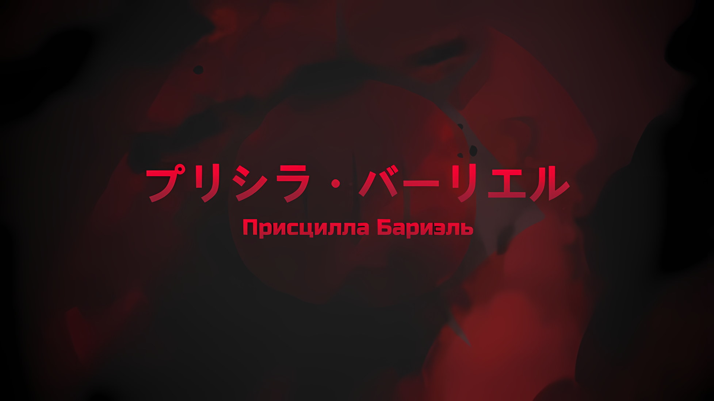
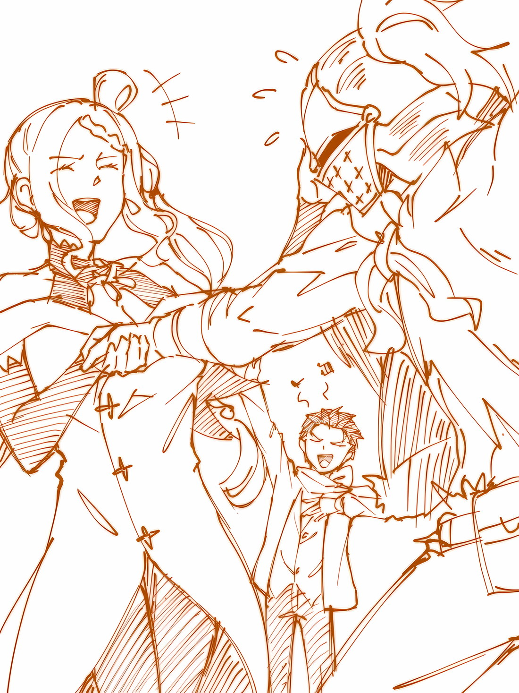
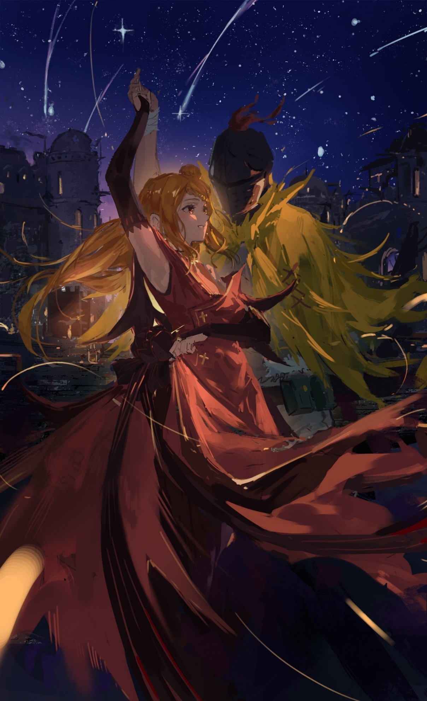
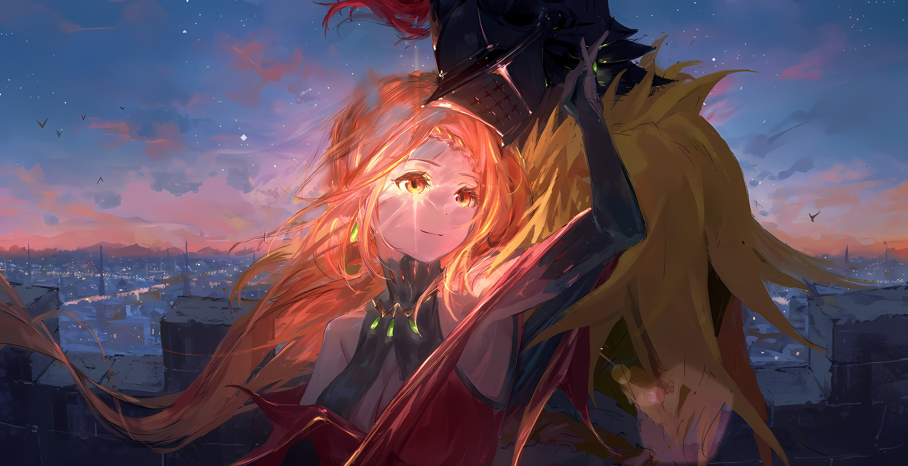
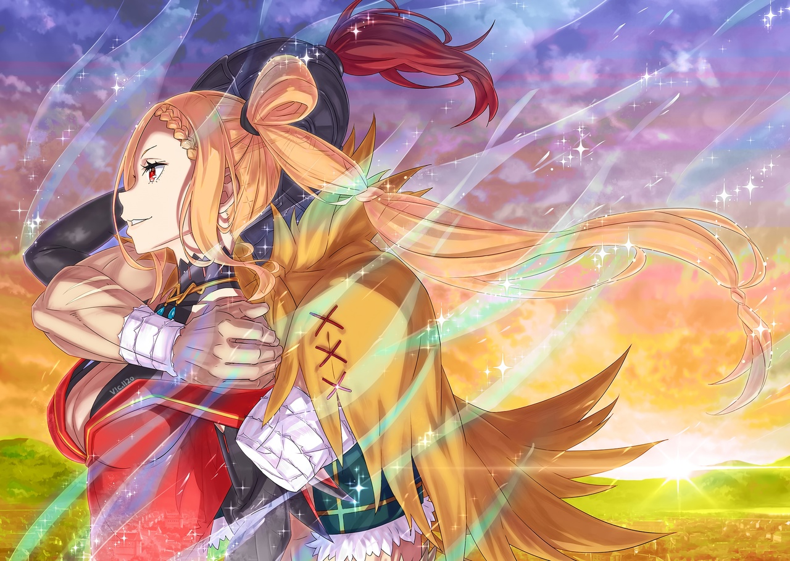
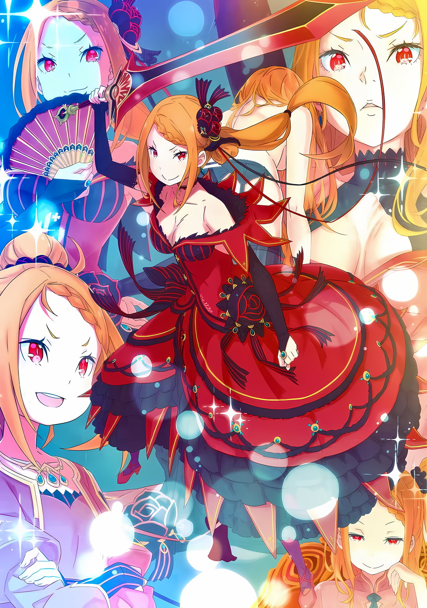
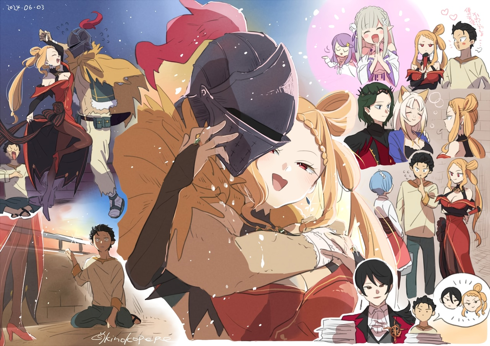

Фанарты: antena_sasaru, Rokaroka, kinokopepe

*※※※※※※※※※※※*

…«Великое Бедствие» предотвращено, Священная Империя Волакия наконец вырвалась из рук гибели.

Когда столица оказалась в центре событий, рассеявшаяся по всей Империи нежить потеряла своего предводителя, их полчища развалились; враги спасались бегством, битва подошла к своему завершению. Их командующей, Сфинкс, больше не было, а мана, которую «Каменная Глыба» давала для «Таинства Бессмертного Короля», оборвалась. До тех пор, пока им снова не даруют смерть, воскрешенная нежить будет бороться за свою новую жизнь.

Хотя война с «Великим Бедствием» уже закончилась, оставленные после нее шрамы никогда не исчезнут.

Вполне возможно, что и в будущем нежить, которой удалось сбежать, будет досаждать Империи Волакия. Даже если война закончилась, ее последствия никогда полностью не исчезнут.

Города и регионы, ставшие полями сражений, люди и вещи, пострадавшие от ужасных событий, — все это нужно было постараться вернуть к довоенному состоянию.

К сожалению, «Героические Грезы» были бесполезны для восстановления после войны.

???: Значит, я и правда ничего не могу сделать…

???: …В чем дело? У тебя есть ко мне претензии?

???: Не то чтобы я жалуюсь, просто какое-то это странное чувство.

Пока Субару ворчал, рядом с ним шла красивая женщина… Присцилла, поэтому он тщательно подбирал слова. Тут она прикрыла губы своим веером, из ее уст вырвалось тихое «Хмф».

Субару удивленно наклонил голову на ее привычной манеры ответ.

…Субару и Присцилла прогуливались в стенах Укрепленного Города Гаркла.

Большая крепость Империи, ее стены сильно пострадали от наступления полчищ нежити, а жители и армия работали день и ночь, не покладая рук, чтобы продвинуться в ремонтных работах. Идти рядом с Присциллой по такому городскому пейзажу казалось странным стечением обстоятельств.

И Субару, и Присцилла участвовали в решающей битве за Рапгану против «Великого Бедствия», Сфинкс. Именно беспокойство о тех, кого они оставили, а также бедственное зрелище непригодной для жизни столицы заставило их вернуться обратно в этот город.

Присцилла: Кристальный Дворец, известный как самый красивый в мире, ныне превратился в пепел, а вода в оплоте все еще грозит хлынуть каскадом и смести весь город. Чтобы восстановить столицу Империи, уйдут столетия.

Субару: Делов там наворотили нешуточных… а ну-ка погодите, это говорит человек, который сам же этот дворец в пепел и превратил?

Присцилла: Как только он разбушевался големом, вернуть его дворцовую форму стало нельзя. Поэтому я использовала его как церемониальный огонь, чтобы возгласить всем о его конце, ведь он выполнил свою роль в «Великом Бедствии».

Субару: …Церемониальный костер для Сфинкс, хах.

Спокойно ответила Присцилла, а Субару подумал о Сфинкс и опустил глаза.

Никто из тех, кто сражался с «Великим Бедствием», не мог сказать ничего подобного — в самом конце Субару столкнулся со Сфинкс лицом к лицу, чтобы использовать «Звездное Поедание» Спики.

Они обнажили друг другу свои «Души».

Возможно, именно поэтому. Возможно, именно поэтому в глубине души Субару не ненавидел Сфинкс и не считал ее злом. В отличие от Архиепископов Греха, она не была непростительным врагом, — так он чувствовал.

И что-то похожее, как ему казалось, чувствовала Присцилла…

Присцилла: Тот столб пламени был поистине великолепен. Все-таки видеть, как что-то горит, — это настоящее наслаждение.

Субару: А что, если тебе просто нравится все поджигать!?!?

Присцилла: Боже, какой же ты шумный. Убавь громкость. Ты прямо как Ал.

На первый взгляд это прозвучало как оскорбление, но на губах Присциллы заиграла улыбка. Их отношения были непростыми, но, можно сказать, она по-своему заботилась о своем Рыцаре, Але.

После воссоединения Присциллы и Ала в столице Империи в этом можно было не сомневаться.

Субару: Кстати, Ал же не хотел терять тебя из виду, так где же он?

Присцилла: Так как он не хотел со мной разлучаться, ему было приказано пахать. Сейчас он должен много работать, чтобы получить мою похвалу. Прямо как ты, ты ведь по уши влюблен в ту полудьяволицу?

Субару: Я не могу и не буду этого отрицать, но то, как ты использовала Ала…

???: …Присцилла-сама!

От внезапного голоса Субару издал «О» и приподнял брови. На противоположной стороне улицы кто-то бежал… Шульт. Маленький мальчик в шортах и костюме дворецкого тяжело дышал, внезапно он остановился прямо перед Присциллой и,

Шульт: Присцилла-сама, вы в порядке, слава небесам! Я… я так за вас волновался… ууааааа…

Присцилла: Ребенка не должны заботить такие пустяки. Если беспокоишься ты обо мне, то веди себя достойно.

Затем Присцилла обняла Шульта, голова мальчика утонула в ее груди. И это была не метафора, а факт.

Как и Ал, Шульт был одним из слуг Присциллы. Мальчика растопили ее прикосновения, он покраснел.

На самом деле, если Шульт так радовался возвращению группы из столицы Империи… «Отряда по Спасению Империи Волакия от Гибели», то нужно было поторопить драконью повозку.

Субару: Стоило мне встретиться с Патраш в своем обычном виде, как она тут же ударила меня…

Шульт: Нацуки-сама, надеюсь, вы передадите мою благодарность Эмили-сама! А еще я мечтаю помогать Присцилле-сама как можно больше, поэтому хотел бы узнать, как вы так быстро выросли, в чем ваш секрет?

Субару: Хочу увидеть самодовольное лицо Эмилии-тан, когда она получит столько благодарностей, а что касается моего роста, то… это читерская механика. Если ты выберешь обычный рут* и будешь быстро расти, то можешь умереть, это, блин, очень больно.

* Route — путь.

Присцилла: В любом случае, тебе не нужно бездумно расти. Оставайся таким, какой есть.

Шульт: Уух, сейчас я как между молотом и наковальней…

На лице Шульта было видно, как он разрывается между своими желаниями и желаниями своей хозяйки. Понимая его чувства к Присцилле, которые сводились не только к глубокой привязанности или обожанию, Субару сочувствовал ему.

Субару: Что ж, с сочувствием или без, у меня нет для тебя эдвайса*!

* Advice — совет.

Присцилла: Не только глупец, но еще и жалкий. Шульт, ты что, гуляешь один?

Шульт: Ничего подобного! Со мной были Утаката-сама и остальные судракийки, так что я…

Похороненный Шульт — он по-прежнему плавал в ее груди — оглянулся. Проследив за взглядом мальчика, он увидел знакомого мужчину с кислым лицом… Хейнкеля.

Субару знал, что он тоже прибыл в Империю и что внес свой вклад в борьбу с «Великим Бедствием», однако…

Субару: Шульт, этот горе отец ведь не издевается над тобой?

Шульт: Вы что! Хейнкель-сама — добрейшей души человек!

Субару: Ни за что не поверю.

Пусть это и был его близкий, но распускать такие ложные представления нельзя. Сказать, что Хейнкель добрый, это все равно что заявить, что Розвааль хороший и честный.

На самом деле даже Хейнкелю, казалось, было горько от оценки Шульта.

Хейнкель: Пискля, не болтай лишнего, а то я тебя прогоню.

Присцилла: Это ты не болтай, жалкий простолюдин. Только я решаю, как обращаться с Шультом. Бояться здесь должен только ты, ведь я могу бросить тебя в Империи.

Хейнкель: Гх…! На сей раз я, я сражался… сражался… против… я…

Присцилла: Ты был полезен? Если намерен хвалиться, то хотя бы говори четко и ясно.

Присцилла лишь скучающе взглянула на хмурого, мямлящего Хейнкеля. Затем она отвернула Шульта от своей груди и подтолкнула его вперед.

Присцилла: Шульт, мне еще много с кем нужно встретиться. Уже поздно. Не засиживайся допоздна.

Шульт: Хо… хорошо…! Хоть я и чувствую, что не смогу заснуть, но постараюсь отдохнуть!

Присцилла кивнула Шульту, который все еще был взволнован, и сказала: «Прекрасно». Затем она посмотрела на Хейнкеля.

Присцилла: Это была великая услуга, Хейнкель Астрея.

Хейнкель: А?

Присцилла: Образ жизни твоей уж слишком некрасив, но вот твое умение владеть мечом достойно восхищения. Даже если не будешь ты вознагражден, никогда не забывай о своем усердии.

Хейнкель: …Получу я свою награду или нет, зависит полностью от вас, госпожа Присцилла.

С этими словами Хейнкель развернулся, грубо почесывая свои красные волосы, и зашагал прочь.

Тут Субару окликнул его: «Мужик»,

Субару: Я слышал, ты спас Гарфиэля. …Присмотрел за моим младшим братом.

Хейнкель: …Кх.

Хейнкель повел себя очень неприлично, он, даже не остановившись, просто проигнорировал его и удалился. Шульт склонил голову и поспешил следом. Проводив их взглядом, Субару пожал плечами в сторону Присциллы.

Субару: Ты не дала мне нормального ответа, когда я спрашивал об этом в прошлый раз, так почему ты с отцом Райнхарда?

Присцилла: Никто не называет кого-то чьим-то отцом. Это вопрос, отвечать на который я не собираюсь.

Субару: Ух… Когда ты так прямо об этом говоришь, у меня в груди начинает болеть.

Когда Субару схватился за грудь, Присцилла ткнула его веером в голову и сказала: «Глупец». Пока он потирал то место, куда его ткнули, она легонько погладила свой подбородок.

Присцилла: И? Что дальше-то? Ты пытаешься мне наскучить? Исполняй свои обязанности клоуна как следует, Нацуки Субару.

Она снова назвала его по имени, но он почему-то не захотел идти против.

*△▼△▼△▼△*

???: Вы двое пришли, чтобы я хмурился, пока работаю?

Спросил Авель и наморщил лоб, как и предполагали его слова, увидев Субару и Присциллу.

Эта комната в великой крепости, хотя и не настолько изощренная, чтобы называться кабинетом, служила Авелю рабочим местом на эту бессонную ночь, когда он занимался срочным планированием послевоенных дел.

Отличная смена тона после того, как он размахивал «Мечом Света» вместе с Присциллой против живого дворца.

Субару: Блин, старик, мне так обидно, что в итоге ты стал таким сильным. Похоже, еще одного кошачьего поединка у нас не будет.

Винсент: Я никогда и не хотел участвовать в подобном с тобой. Если ваша цель — отвлекать меня пустяками, уходите немедленно.

Субару: Вот ты говоришь, что не хочешь, чтобы тебя отвлекали, но…

Субару бросил взгляд на диван рядом со столом, где негостеприимный Император занимался своим делом. Там, плечом к плечу, мирно спали Флоп и Медиум.

Милое воссоединение брата и сестры О'Коннелл рядом с Императором создавало разительный контраст.

Субару: Не вижу, чтобы ты выгонял этих двоих.

Винсент: …Если я их разбужу, они гарантируют мне неприятности; вот почему.

Присцилла: Ты не перестаешь меня удивлять своими предлогами, братец. Твоя мягкость проявляется во всей красе, когда речь заходит о том, что тебе дороже всего. Когда позволил ты мне бежать из страны, это тоже был акт любви.

Спокойные слова Присциллы, которая обмахивала свое лицо веером, заставили Авеля замолчать.

Можно было истолковать это как молчание, которое возникло бы в любом случае, или как молчание, возникшее именно потому, что ее слова попали прямо в точку, или как и то, и другое.

Субару: Ты Император-сисконщик…

Винсент: Пусть я и не знаю, что это значит, но предположу, что твои слова — это верх непочтительности.

Присцилла: Хватит пустых угроз. Из-за «Великого Бедствия» Империя в большом долгу перед Королевством и Городами-государствами. А особенно перед лагерем Нацуки Субару.

Субару: Присцилла… это не мой лагерь, а лагерь Эмилии-тан.

Редко услышишь такое от Присциллы, но ему пришлось поправить ее. Она ответила лишь: «Ты хорошо выдрессирован». В ответ на все это Авель молча потер пальцами бровь.

«Ого» — воскликнул Субару, когда увидел, как Авель закрыл оба глаза.

Винсент: …В чем дело, Нацуки Субару? Собираешься нагрубить мне еще больше?

Субару: Не, не в этот раз. Не то чтобы я так хотел разборок с тобой, и раз уж ты сильно занят, мне и правда лучше уйти.

Субару надул губы и не стал указывать на заметную перемену в Императоре. Впрочем, Авель скорее всего и сам был в курсе. Потому что и причина, и толчок к этой перемене произошли довольно явно.

И, похоже, Субару не один счел это приятной новостью.

Винсент: Я оставляю его на тебя, Присцилла. У меня много дел.

Присцилла: Значит, ставишь ты Империю выше дорогой сестры своей? Минуло десятилетие, и чаши весов внутри тебя наконец обрели равновесие, да, братец? Если так, то…

Винсент: То что?

Когда Присцилла оборвала свою речь, Авель слегка нахмурился. На его глазах она одернула подол платья и отвесила глубокий поклон.

А затем…,

Присцилла: …Семьдесят Седьмой Император Священной Империи Волакия, Ваше Превосходительство Винсент Волакия. От всего сердца я поздравляю тебя с восхождением на трон.

Винсент: …

Присцилла: До последнего вздоха руководи стаей Волков Меча. А пока же дни твои, в которых забудешь ты об отдыхе, будут только продолжаться.

Поздравив с серьезным выражением лица, а затем предупредив с дерзкой улыбкой, Присцилла обратилась к своему старшему брату. В ответ на поведение своей сестры, которая подчинялась только собственным капризам, Авель… Винсент Волакия вздохнул.

Затем, бросив взгляд на брата и сестру О'Коннелл, которые, прижавшись друг к другу, спали на диване,

Винсент: Присцилла. …На всем свете только с тобой, моя сестра, я забывал о недоверии.

Присцилла: Даже в любовных признаниях, ты так извилист, братец.

Присцилла распахнула веер, спрятала за ним свою провокационную ухмылку и сделала такой комментарий — и Субару был с ней согласен.

Если бы только к этому могла добавиться третья сторона…,

Субару: Я считаю, что вы, брат и сестра, до жути похожи.

Отпустив эти слова, Субару вкусил всю тяжесть взглядов родных брата и сестры — одинаковых и неприветливых.

*△▼△▼△▼△*

???: Присцилла, ты разговаривала с Его Превосходительством Винсентом?

Присцилла: Хм, дорогая мамочка?

Насытившись двумя видами отношений между братом и сестрой: Императорской Семьей и торговцами, Субару и Присцилла встретили в одном из проходов крепости Йорну и Югарда.

Судя по всему, они шли в комнату Авеля по делу.

Йорна пристально посмотрела на Субару и Присциллу. Он подумал, что, возможно, это из-за того, что она посчитала их пару необычной, но ошибся.

Йорна: Впервые вижу, что ж, мне будет довольно сложно свыкнуться с тем, что ты большой, дитя.

Субару: …Ах! Точно, Йорна-сан же видела меня только, когда я переодевался и когда был шóтой!

Когда ему открылась поразительная истина, Субару был шокирован тем, насколько разным он представал Империи. На его шок Йорна приложила тыльную сторону ладони ко рту и улыбнулась,

Йорна: Ваше Превосходительство, этот юноша — Рыцарь Королевства. Еще недавно он был ребенком, а при нашей первой встрече вообще предстал в образе прекрасной дамы.

Югард: Хм. Если Звезда Моя так оценила твою красоту, то я заинтересован.

Субару: Нет, не надо, хватит, прекратите, пожалуйста, не говорите такое. Хотя Нацуми Шварц — это благородная дама, которая не постесняется выставить себя напоказ…

Присцилла: Пусть для глупого простолюдина твои способности и достойны похвалы, но ты много о себе думаешь.

Субару был на грани между сдержанностью и пылкостью, поэтому Присцилла ответила ему с недовольством. После этого она как бы невзначай посмотрела в сторону комнаты Авеля,

Присцилла: Дорогая мамочка, зачем же ты идешь к моему братцу вместе с «Терновым Королем»?

Югард: Потому что у меня осталось мало времени. Прежде чем оно подойдет к концу, я бы хотел обсудить с дитем моих детей желания Звезды Моей.

Субару: Мало, времени…

Субару посмотрел на Йорну, которая выглядела довольной.

…Югард, хоть и стоял здесь, как будто это было естественно, но все еще оставался нежитью. Как и у Сфинкс, его внешность не отличалась от живых, но ситуацию это все равно не меняло.

Югард: По всем вероятиям, моя радость новой жизнью отразилась и на внешности. Для меня это гораздо предпочтительнее, чем со Звездой Моей в объятиях сливаться в теле, по которому не течет тепло.

Присцилла: Пусть это и связь души, а не крови, но ты бессовестно хвастаешься своей любовью к мамочке прямо перед ее дочерью. Полагаю, именно этого и следовало ожидать от «Тернового Короля», но… что же это за желания моей дорогой мамочки?

Йорна: …Это касается оков на моей душе, которые заставляют меня бесконечно перерождаться.

В тихих словах Йорны прозвучало нечто, о чем Субару знал лишь поверхностно.

Когда-то в прошлом Йорна была девушкой по имени Ирис, ее душу сковали бесконечные перерождения; каждый раз, когда она умирала, ее душа не проходила крещения Од Лагуны и возвращалась обратно на землю, отчего она реинкарнировала в новое тело.

То, что Йорна желала получить от Авеля за свой вклад в гражданскую войну и борьбу с «Великим Бедствием», было…,

Йорна: …Я хочу отменить его. Отменить указ Империи об истреблении людей-волков и людей-кротов.

Субару: Ах…

Йорна: Все это время я желала именно этого… хотя, когда я стала одной из «Девяти Божественных Генералов», то сосредоточилась на Городе Демонов, чтобы иметь место для моих любимых детей.

Присцилла: …Понятно. Чтобы связать твою душу, дорогая мамочка, использовали кровь, плоть и жизни людей-волков и людей-кротов, которые копятся с давних пор. Если прекратить их убивать, то через время проклятие исчезнет.

Югард: Именно я издал этот указ. Если я устами своими обращусь с просьбой к Императору нынешней эпохи, то все уладится без ущерба для чести Звезды Моей и детей моих детей.

Затем Югард с нежностью взглянул на Йорну, которая обнимала его за руку.

Субару почувствовал, как в глубине глаз «Тернового Короля» тлеют чувства стыда и раскаяния, что растянулись на долгие годы.

«Ирис и Терновый Король»… история, рассказываемая с давних времен, — он не читал и не слышал о ее содержании, а потому не знал, что именно произошло между этими двумя.

Однако если предположить, что закончилась она трагически, то, кажется, настало время для ее продолжения.

Субару: Надеюсь, ваш эпилог оставит приятное послевкусие.

Присцилла: А у меня другое мнение. В загробной жизни можно наделать лишнего, которое все сделает напрасным.

Субару: Ты…!

Присцилла, хоть и была дочерью одной из сторон, но все равно попыталась разжечь рознь. Субару уже собрался было ругаться, как она продолжила: «Однако»,

Присцилла: Если это «Терновый Король» и моя дорогая мамочка, то такое исключено.

Югард: …Ты снова так похожа на Терриолу. А ты так не считаешь, о Звезда Моя?

Йорна: Теперь, когда вы подметили это… неудивительно, что я нахожу ее такой милой.

Присцилла: Не сравнивайте меня с теми, кем я не являюсь. Будь это не ты, дорогая мамочка, и не твой муженек, я бы этого не простила.

От столь откровенных слов Присциллы на губах Йорны и Югарда появилась улыбка.

У них были своеобразные отношения, и, хотя на самом деле это было не так, на вид они казались близкими матерью, отцом и дочерью. Из-за этого Субару неловко почесал щеку, что заставило Йорну еще раз улыбнуться и сказать: «Похоже, мы вас утомили»,

Йорна: Ну, я потопала дальше с Его Превосходительством. Присцилла, солнышко, больше не ссорься с этим дитем.

Присцилла: Я не отношусь к нему как к дитю. Более того, если этот глупый простолюдин посмеет меня разозлить, я просто отрублю ему голову.

Субару: Кончай уже со своей жуткой жутью! Ну что ж, Йорна-сан, Югард-сан, до новых встреч!

Пока Йорна и Присцилла, как мать и дочь, разговаривали, Субару повернулся к Югарду. …Он сказал «До новых встреч!», но чувствовал, что это может быть последний раз, когда они друг друга видят.

Должно быть, так же думал и Югард. Бывший Император посмотрел на Субару и заговорил.

Югард: Проживи свою жизнь достойно вместе с теми, кого любишь. Пусть удача и счастье сопутствуют тебе и звезде твоей.

*△▼△▼△▼△*

???: Вау, ооочень необычно видеть Субару и Присциллу вместе.

???: Согласна. Похоже, завтра дождь пойдет, а у нас еще много дел.

При виде Анастасии, которая после этих слов отвернулась и посмотрела в окно на ночное небо, Присцилла фыркнула «Хмф».

Пообщавшись со многими, они зашли в комнату отдыха пропустить по стаканчику воды и неожиданно наткнулись на Эмилию и Анастасию, которые сидели за одним столиком.

После путешествия в Сторожевую Башню Плеяд их пара уже не казалась странной. Куда большее удивление вызвало то, что Субару был рядом с Присциллой.

В любом случае, что же здесь делала пара Анастасии (мозг) и Эмилии (мускулы)?

Эмилия: Отто-кун отчитал меня и сказал, что работать сегодня я больше не буду…

Анастасия: Не очень-то и хорошо, что мы вмешиваемся в послевоенные дела Империи, так? Ну вот я и подумала, почему бы нам немного не поболтать перед отдыхом… кстати, Эмилия-сан безостановочно хвасталась тобой, Нацуки-кун.

Субару: Э-э, мной? Эмилия-тан? И правда? Дайте мне послушать, умоляю, я хочу это услышать.

Разговор девушек заинтриговал Субару, отчего он наклонился вперед. Однако, когда его сзади схватили за воротник, он вскрикнул «Ай-яй!».

Как и ожидалось, это сделала Присцилла, которая вполне могла обезглавить Субару, не говоря уже о том, чтобы его задушить. Она отпустила его воротник и посмотрела на Эмилию с Анастасией, как бы собираясь их приструнить,

Присцилла: Полудьяволица и лисица — обе Кандидатки Королевских Выборов, встретились один на один, чтобы обсудить подвиги глупого простолюдина? До чего же пустая трата времени. Даже звезды считать было бы куда лучше.

Эмилия: Ах, да, мне это известно. Я иногда считала их, чтобы скоротать время, когда жила одна в лесу…

Анастасия: А я коротаю время, когда долгие-долгие часы считаю свои денежки.

Субару: Эй-эй, не давайте Присцилле вертеть разговором так, как ей захочется.

Сказать, что вместо этого им лучше считать звезды, было глупо, как совет бросить все и просто лечь спать. Конечно, если говорить о звездах, то Субару мог часами искать и рассматривать созвездия, однако сейчас это было неважно.

Чтобы не дать этому разговору перейти в тему ночного неба, Эмилия вдруг рассмеялась «Хи-хи», а затем,

Эмилия: Так странно, да? Я, Анастасия-сан и Присцилла-сан, — мы все Кандидатки на трон Королевства, и все же сейчас мы в Империи.

Анастасия: Если бы непредсказуемый Нацуки-кун не вылетел прочь из башни, ничего бы из этого не случилось.

Субару: Это был выбор без выбора! К тому же, если бы меня сюда не занесло, Империя бы погибла.

Хотя это не оправдывало событие, с которого все началось, но, учитывая масштабы «Великого Бедствия», было не так далеко от истины. Нельзя сказать, что он был рад, что его втянули в это дело насильно, однако в итоге это принесло всем благо.

Присцилла от таких рассуждений, возможно, только бы рассмеялась…,

Присцилла: …Это чистая правда. Без вас история Империи закончилась бы еще вчера.

Субару: А!

Эмилия: Э?

Анастасия: О?

Присцилла: Чего вы ахаете, глупцы. Я констатировала очевидный факт.

То, что это сказала именно Присцилла, удивило Субару и остальных.

Анастасия хихикнула и спросила: «В чем дело?»,

Анастасия: Как неожиданно. Не думала, что ты можешь так прямо признать, что мы тебе помогли.

Присцилла: Не пойми неправильно. Империя была родиной Приски Бенедикт, но не моей. Ответственность за помощь в спасении Империи лежит на Императоре и его армии.

Анастасия: Я только-только призадумалась, а ты, как всегда, в своем репертуаре. Да-да, если бы принцесса не вела себя так, то она бы не была достойной соперницей.

Эмилия: Боже, Присцилла такая белая ворона, так что лучше не дразни ее, Анастасия-сан.

Субару: Кто вообще в наше время говорит «белая ворона»…

Услышав оценку, ооочень характерную для Эмилии, Субару усмехнулся.

Не то чтобы он не понимал чувств Эмилии и Анастасии. Раньше Присцилла казалась Субару загадкой, словно какое-то инопланетное существо.

И хотя он признавал за ней силу и проницательность, ее природа больше напоминала хищного зверя, с которым просто невозможно было договориться.

Его взгляд на Присциллу сильно изменился за эти несколько дней.

Субару: Сейчас, наряду с Эмилией-тан, Анастасией-сан, Круш-сан и Фельт, я признаю Присциллу Кандидаткой Королевских Выборов.

Присцилла: Сдалось мне твое признание? Следи за языком, глупый простолюдин.

Эмилия: Ну вот, опять ты за свое… помнишь, о чем мы говорили?

Эмилия сложила руки перед грудью, а Анастасия, к которой она обратилась, мягко улыбнулась.

Анастасия: Ты про ту историю с Пристеллой? Тогда я не пригласила принцессу, потому что посчитала, что для этого нет повода, однако…

Эмилия: В следующий раз давай пригласим и Присциллу. Ведь она такая же Кандидатка, как мы.

Присцилла: Глупый простолюдин, похоже, хозяйка твоя не понимает, что такое Королевские Выборы.

Субару: Она такая милаха, ну согласись. Узрите все, вот он — мой ангел.

И хотя их встреча затевалась не для отдыха, Эмилия чувствовала себя неловко из-за того, что Присциллу не пригласили на встречу Кандидаток в Пристелле.

Лучше было бы взять отпуск, чем оказаться в ситуации, где придется сражаться с Культом Ведьмы.

Субару: Если до этого дойдет, давайте в следующий раз поедем куда-нибудь, где можно будет расслабиться и поплавать.

Анастасия: Нацуки-кун, как прямолинейный ребенок, озвучивает нам все свои хотелки. Ну, я подумаю над этим. Впрочем, если сама принцесса скажет, что не хочет, чтобы мы ее приглашали, значит, так тому и быть, да?

Эмилия: Присцилла… Что думаешь?

Анастасия вела себя вызывающе, а Эмилия была осторожна, как маленький зверек. На приглашение двух красивых девушек, которые тоже были Кандидатками, Присцилла пожала плечами.

Присцилла: Делайте, что хотите. Если меня это развлечет, то прекрасно, а если нет, то плохо. Особых причин отказываться у меня нет.

Эмилия: …! Да, тогда пригласим тебя. Мы все в трудном положении, и нас всех многое беспокоит, но… Я не вижу причин, по которым мы бы не поладили.

Анастасия: Всякий раз, когда в дело включается Эмилия-сан, люди вокруг становятся мягкими, даже как-то напрягает.

Ответ Присциллы нельзя было назвать радостным, однако Эмилии, судя по всему, аж не терпелось. Субару кивнул, соглашаясь с мыслями Анастасии.

И тут Присцилла, возможно, тоже соглашаясь с этим мнением, посмотрела на ночное небо…,

Присцилла: …Уроженка трущоб и герцогиня, лисица из Городов-государств и полудьяволица с аметистовыми глазами.

Эмилия: …? Присцилла?

Присцилла: Ничего особенного. Просто подумала, что в таком перечислении все это звучит как герои из плохо написанной сказки.

Субару: «Плохо написанной» было лишним. И вообще, не думаю, что ты можешь так говорить, — сама же в этот список и входишь.

Присцилла была якобы умершей принцессой Империи. Чтобы придать живости истории, этой детали было более чем достаточно.

Сердце Субару заколотилось, когда он подумал, что его слова могли по-настоящему разозлить Присциллу. Однако это было напрасно… Нет, не напрасно, ему было куда деть свой страх.

Присцилла: …Без сомнения.

С этими словами Присцилла поднесла кончик веера к своим губам и улыбнулась.

Она улыбнулась, как девушка, мирно болтающая со своими друзьями.

*△▼△▼△▼△*

Каким-то образом Субару упустил свой шанс, чтобы попрощаться, поэтому продолжил гулять вместе с Присциллой по Укрепленному Городу.

Субару, по его собственному мнению, за сегодня потрудился на славу. То же самое можно сказать о Присцилле и других, кто продолжал ходить по городу.

Конечно, большинство из них, как и Субару, были в слишком хорошем настроении, чтобы спать.

Субару: О нет, не может быть, этого просто не может быть, неужели все вокруг нежить, которая не знает об усталости…?

???: …Что за ерунду ты говоришь?

Субару: Оаоаоа!?

Он стоял в полном оцепенении на каменной дорожке, глядя на раскидывающийся ниже городской пейзаж. Все его слова слышали проходящие мимо люди.

Причем среди них оказался кто-то, кто даже слышать-то его не хотел… Рем, она взглянула на Субару.

С ведром воды в руках она, похоже, тоже не могла уснуть.

Субару: Так ты все еще помогаешь лечить раненых? Знаешь, что много работать вредно? Тебе стоит поучиться у своей старшей сестры, вот она отдыхает с поводом и без.

Рем: То же самое я могу сказать и о тебе. Раз у тебя нет работы, может, тебе лучше просто вернуться в свою комнату и спокойно отдохнуть?

Субару: А ты за словом в карман не лезешь…! Может, это и нельзя назвать работой, но мне тоже есть чем заняться.

Субару сцепил пальцы перед грудью и шепотом ответил Рем. Однако ее взгляд стал строгим, что сразу поубавило его смелость.

Затем, словно протягивая ему руку помощи… нет, просто чтобы выразить свое недовольство этой сценой, Присцилла вздохнула,

Присцилла: Как видишь, его руки и ноги немного увеличились, нежели когда он был маленьким. Из-за этого ему довольно неудобно встречаться с теми, с кем он общался еще ребенком.

Субару: Не шути про то, что мои ноги так и остались короткими! Впрочем, ты права в обоих пунктах!

Когда Присцилла легкомысленно высказала эти чувства, Субару прикусил рукав и прорычал: «Блин!».

Субару предстояло ответственное дело… рассказать всем в «Эскадроне Плеяд», что он вернулся в свой прежний вид.

Хотя товарищи Субару были с ним еще с Острова Гладиаторов, он не признался им, что был уменьшен. Он также не рассказал им, что на самом деле не является незаконнорожденным сыном Императора. Получается, что все это время он им врал.

Субару: Если расскажу правду, и меня все начнут ненавидеть, я не переживу… Лучше уж скажу, что Нацуки Шварц пал смертью храбрых…!

Рем: Если ты им наврешь, я буду тебя презирать. Ты хочешь, чтобы я тебя презирала?

Субару: Вообще не хочу. Я бы жить не смог, если бы ты меня презирала, Рем…!

Субару заскулил от того, что Рем стояла у передних ворот его сердца, а «Эскадрон Плеяд» — у задних. Девушка вздохнула и вдруг заметила, что Присцилла не сводит с нее глаз.

Принцесса, скрестив руки, как бы подчеркивая свои пышные груди, обратилась к Рем,

Присцилла: За время разлуки нашей лицо твое несколько изменилось. Магия исцеления, которую ты так не любила, похоже, очень пригодилась.

Рем: Да, я много раз использовала то, что вы мне рассказали, Присцилла-сан… И еще, спасибо вам. Тот нежный огонь, который разделил вашу силу со всеми нами после того, как звезда была сбита… это ведь тоже сделали вы, да?

Присцилла: Хм. Почему ты так думаешь?

Рем: …Чутье. Может быть, это из-за времени, что я провела вместе с вами, Присцилла-сан, пусть это было и недолго.

Она ответила Присцилле и подняла ведро с водой поближе к груди.

Несмотря на ее слова, в улыбке Рем чувствовалась уверенность, что заставило Присциллу тоже улыбнуться.

Присцилла: Ясно. Похоже, сердце твое алмазное все-таки удалось проткнуть. Воздаю тебе хвалу.

Субару: Кхм, Рем, ну вообще-то ту звезду сбили мы с Беако, что скажешь по этому поводу? Мм?

Рем: Ха?

Субару: Извини, что вклинился, но, пожалуйста, похвали потом Беако.

Субару хотел, чтобы его похвалили так же, как и Присциллу, однако Рем лишь посмотрела на него с презрением. Отступать он не собирался, но Принцесса была права.

Рем стояла с такой прямой спиной, что выражение «алмазное сердце» и правда было к месту. Он подумал, что немалую роль в этом сыграло ее воссоединение с Рам, Петрой и остальными, а также присутствие ее подруги — Кати.

Субару: Расскажешь мне побольше о том, чем вы с Присциллой занимались, пока меня не было?

Рем: …Возможно, когда все будет улажено.

Субару: Хм, если так, то я помогу тебе с лечением раненых и всем остальным. Разреши взять твое ведро.

Конечно, он не хотел откладывать разговор с эскадроном на потом, но оставить занятую и уставшую Рем не мог.

Тут она ответила: «Что ж», — и протянула ему ведро с водой.

Однако…,

Рем: …Хотя нет. Не надо.

Субару: А!? Я что, тебя чем-то обидел? Я был излишне заботлив, я был слишком груб!?

Рем: Нет. Дело не в этом… просто если ты пойдешь со мной, то Присцилла-сан останется одна.

Субару: Хм-хм-хм, почему бы тогда не дать Присцилле лечить раненых?

Рем: Ты в здравом уме?

Субару: Я знаю, что ты все преувеличиваешь, но здесь не в моем здравомыслии дело!

Субару подумал о чем-то за рамки выходящем, но, по сути, она уже лечила раненых своим огнем, поэтому — почему бы и нет? Он удивился, что Рем отказалась от его помощи из-за Присциллы.

Прежде всего, то, что Субару сейчас гулял с Присциллой, произошло случайно, а не по какой-то веской причине.

Если бы Беатрис и Спика составили ему компанию, его ночь не обернулась бы чем-то таким.

Субару: И Беако, и Спику забрали по вопросам Духов и Полномочий…

Рем: Останусь-ка я с Присциллой-сан…

Присцилла: Рем, отставить глупости. Я вполне могу обойтись и без этого глупого простолюдина.

Субару: Мне даже странно об этом говорить, но, видишь ли, именно ты и начала меня за собой таскать!

Его заставили играть роль шута, вот он и стал клоуном, да таким, что аж кричал от недовольства — недовольный клоун.

Рем проигнорировала Субару и уставилась на Присциллу. Она искала слова, которые так не хотели складываться у нее в голове,

Рем: Присцилла-сан, я не хочу оставлять вас одну.

Присцилла: …Так вот о чем ты так долго думала. Ты — девушка, которая ничегошеньки не понимает.

Рем: Зато боль в моей груди прошла, спасибо вам.

Ответ Рем — Субару его не понимал.

Возможно, это было частичкой какого-то старого диалога между Рем и Присциллой, о котором он не знал. Принцесса сделала небольшую паузу, фыркнула, а затем сказала,

Присцилла: Постарайся, Рем. О дочь Óни. …Ибо есть роли, сыграть которые можешь только ты, желания, исполнить которые можешь только ты, и будущее, добиться которого можешь только ты.

Рем: …Присцилла-сан?

Присцилла: Идем, глупый простолюдин. Раз уж Рем так просила, я все-таки возьму тебя с собой.

Субару: Скажу честно, меня это мало радует. И куда мы?

Игнорируя его личные границы, Присцилла указала веером вдоль коридора. Там Субару увидел не раскидывающийся городской пейзаж и не усыпанное звездами ночное небо, а нечто среднее… стены.

Во время осады все городские стены были повреждены, но все же сохранили свой первоначальный вид. Не похоже, чтобы там можно было кого-то или что-то найти.

Присцилла: Рем, следуй зову своего сердца. И хотя сердце твое может колебаться, недостойными эти колебания никогда не будут.

Рем: …Поняла, спасибо.

Стоило Присцилле указать место назначения, как она снова заговорила с Рем о чем-то, чего он не понимал.

Впрочем, лицо Рем было спокойным, поэтому Субару не стал копать глубже.

*△▼△▼△▼△*

Похоже, что люди уже закончили убираться, так как на крепостных стенах не было ни одного солдата.

Битва с «Великим Бедствием» только-только закончилась, да и нежить еще не была полностью истреблена, поэтому такое решение казалось неосторожным…,

???: У кого же может хватить смелости пойти против приказа принцессы?

Ал поприветствовал Субару и принцессу, он сидел на вершине пустого бастиона. Рядом с ним стояла бутылка дорогого алкоголя и два бокала.

Субару: Ты что, напился, чтобы отпраздновать нашу победу?

Ал: Да не-е, без принцессы я бы не начал. Удивлен, что ты с ней, брат. Разве ваша пара не супер редка?

Субару: Сегодня уже все об этом сказали, как неловко.

Хоть Ал и сказал, что не пил, но голос его был веселым. Скорее всего, он был слегка пьян не столько из-за градуса, сколько из-за радости победы.

Собственно, и сам Субару, когда гулял по городу с Присциллой, чувствовал это.

Субару: Дело не только в том, что у всех вокруг есть дела, но и в том, что они не хотят, чтобы все это оказалось лишь сном.

Ал: Да ты прям настоящий поэт, брат. Хотя знаешь как лучше сказать? Кхм, «О утро c солнцем ярким, ты пока не приходи».

Они не ложились спать с плохими мыслями, что их триумф может оказаться лишь сном, каждый из них просто хотел, чтобы день победы, ради которого они все собрались вместе, не заканчивался.

Когда Субару и Ал делились душещипательными чувствами, по их затылкам вдруг ударил складной веер. Они вскрикнули «А-ай!», обернулись и скрестили свои ошарашенные взгляды на Присцилле.

Присцилла: Клоун и простолюдин собрались вместе, чтобы сеять всюду свою глупость. Что важнее… Ал, ты сделал то, о чем я просила?

Ал: О? А, да, достал, можете не беспокоиться. Я попросил того старого премьер-министра увести стражников со стены и получил спиртное от милой Верховной Графини. Эта выпивка, да у нее цена, наверное, такая, что у меня бы глаза на лоб полезли или вообще бы вылетели.

Субару: Это да. По этикетке и старости бутылки можно примерно понять ее стоимость. Я, правда, не любитель алкоголя.

Ал: Это да. Коробка хорошо ее сохранила. Я, правда, тоже не любитель алкоголя.

Субару и Ал, как товарищи по невежеству в вопросах выпивки, весело обозревали спиртное. Присцилла пожала плечами, взяла у них бутылку и с легкостью выдернула пробку.

Затем она медленно разлила ликер, от которого исходил сладкий аромат, по двум бокалам.

Присцилла: У нас только два бокала. Вам придется делить один.

Ал: Эх, а я так надеялся на непрямой поцелуй с принцессой, а, ой, прошу прощения, да, лучше мне помолчать.

Ал огорченно отступил. Субару понимал его, даже хотел немного подтрунить, но упрекать не стал. Когда Присцилла поднесла бокал к губам, он на мгновение замешкался, но затем тоже приложил губы к своему бокалу.

Ал: Ого, малолетка пьянствует.

Субару: Все легально, в этом мире точно… *Гхфкх гхктдха!!!*

Ликер попал Субару на язык, резкий аромат проник в его ноздри и горло. Он поперхнулся. От этого Ал расхохотался: «Вхахаха» и взял бокал у Субару, чтобы тоже пригубить спиртное.

Единственной рукой он поднял нижнюю часть своего шлема и влил ликер через щель, а затем…,

Ал: *Гхкха гхыхк гкхблахгхууухкх!!!*

Субару: Разве ты сейчас не больше меня раскашлялся? Возьми себя в руки, совершеннолетний Ал-коголик!

Присцилла: От вас много шума. Да уж, бедная «Ведьма», никогда не узнает, какой на вкус этот алкоголь, пусть поплачет в могиле.

Субару: У меня сейчас какое-то странное чувство вины, пожалуйста, прекрати…

Сфинкс ни за что бы не отказалась от высокосортного алкоголя победы со словами: «Извинения: Требуются», отчего Субару приуныл.

Пока Субару и Ал мало-помалу делили алкоголь, Присцилла опустошила половину бутылки. Непонятно, насколько крепким был напиток, но она выпила много и выглядела так, словно это сущий пустяк.

Ал: Принцесса любит выпить, что прям под стать ее стилю, да?

Когда бокал, за который отвечали Субару и Ал, опустел, Присцилла, словно решив, что самое время что-то сделать, сказала,

Присцилла: Рассвет близок. Что-то я повеселела. …Ал, составь мне компанию.

Ал: *Кхгху*… А? Составить вам компанию? О чем вы… Уоо!

С этими словами Присцилла поставила полупустую бутылку на перила, взяла Ала за руку, чтобы помочь ему встать, и поманила его к середине стены.

Притянув озадаченного Ала к себе, она улыбнулась Субару, который с удивлением смотрел на все это,

Присцилла: Нацуки Субару, спой.

Субару: Как-то слишком неожиданно!

Присцилла: Твой язык уже увлажнил хороший ликер. Что ж, тогда я просто скажу Рем, что от тебя никакой пользы.

Субару: Грррр, блин…! Ладно, я понял!

В ситуации, что развивалась против его воли, Субару сложил руки и мысленно составил сет-лист*. Одновременно с этим Ал посмотрел Присцилле в глаза,

* Сет-лист — список песен для исполнения.

Ал: Принцесса, у меня не хватает одной руки, помните ведь?

Присцилла: И что с того. У тебя есть две ноги и преданность мне. …Начнем.

Слова Присциллы прозвучали вместе с первым тактом мелодии.

Субару: …

Субару выбрал не хитовую песню своей родины, а композицию этого мира, которая была его любимой.

Песня «Любовь Демона Меча» была слишком длинной, и, если он будет ее исполнять, то, скорее всего, заплачет.

Поэтому Субару выбрал другую…,

Субару: …Небо Пропускает Свет Зари.

Ночь над Империей Волакия подходила к концу. Новое сегодня бурно оттесняло звездное вчера.

Как песня, посвященная этому явлению, она была абсолютным фаворитом среди всего, что он слышал в этом мире.

Субару: У-у-у-у.

Без всяких инструментов. Единственный звук — его акапельное пение.

Если сравнивать Субару с Лилианой, которая жила музыкой, то он сильно уступал. И все же он был рад, что Присцилла откликнулась на его пение танцем.

Присцилла: Вот так, танцуй что есть сил, Ал! Развлекай меня!

Ал: А-а-а, плохо дело! Я влип! Брат! Сделай бит* быстрее!

* Beat — ритм/такт.

…Под пение Субару Присцилла и Ал танцевали по всему бастиону.

Пляс Присциллы был великолепен; он напоминал танец, который Авель исполнял в Гуарале, чтобы соблазнить Зикра, — хотя она, скорее всего, рассердится, если он об этом скажет. А неуклюжие движения Ала чем-то напоминали танец на фестивале фонарей, — хоть ему и не хватало мастерства, наблюдать за ним было весело.

Было видно, как сильно Присцилла и Ал наслаждались жизнью.

Субару: …

Казалось бы, Субару должен был делать это с неохотой, но не успел он опомниться, как запел с улыбкой на лице.

Небо Пропускает Свет Зари… песня о неизбежном рассвете, о благословении мира, который рождается заново после того, как его озаряет сияние, песня, особенно подходящая Империи Волакия, стране, где царит пламя.

И Присцилла, жившая как пламя, очень напоминала Волакию.

Присцилла: …

Не зная, как закончить песню, Субару стал повторять ее дважды, нет, трижды. По мере его пения, танец между ними плавно перетекал в другой, отчего он вновь и вновь упускал момент, чтобы закончить композицию. Так Субару попал в бесконечный круг.

Пока все они развлекались, утреннее солнце начало мягко освещать бастион.

В нем еще оставался алкоголь, и сегодня… нет, вчера — он много работал. Однозначно, если он заснет, то уже не проснется.

В лучах утреннего солнца Присцилла выглядела ужасно ярко…

Ал: …Принцесса?

Внезапно, очень внезапно произнес Ал.

Субару: …

Еще секунду назад Ал сказал бы это с нотками веселья, скрывать которое он не собирался, и страсти, скрыть которую он не мог. Теперь же и пение Субару резко изменилось, а затем и вовсе прекратилось.

Он моргнул и много-много раз потер глаза.

И даже несмотря на то, что он потер глаза…,

Присцилла: …Пускай и не на уровне той певицы, Лилианы Маскарад, но это было неплохо.

Присцилла устроилась на груди Ала, когда он обнимал ее сзади, и похвалила Субару.

…Утреннее солнце просвечивало сквозь Присциллу, она исчезала.

*△▼△▼△▼△*

Субару: …

На вершине бастиона, окутанного утренним туманом, Субару в ужасе смотрел на Присциллу.

Кроваво-красное платье, оранжевые волосы, лучи солнца, проходящие прямо через них, и багровые глаза, похожие на пламя… все это составляло Присциллу Бариэль, и ничего из этого не изменилось, но все же.

Субару: П-При… с-сцилла…?

Присцилла: Ты должен понять. Чтобы показать мне гибель Империи, мой враг Сфинкс заточила меня в ином пространстве. Чтобы выбраться, мне пришлось превратить его в пепел.

Субару: …Ах.

Присцилла была умна. Поэтому по дрожащему голосу Субару она догадалась, о чем он думал и что хотел спросить.

Четкий и лаконичный ответ — Субару понял его. В конце концов, он кое-что осознал.

Субару: …

Она была такой же, как Югард Волакия, Император прошлого, которого сопровождала Йорна.

В обмен на свою жизнь Присцилла Бариэль вырвалась из иного пространства.

Причина, по которой через нее пробивался свет утреннего солнца, была ясна как день.

…Присцилла Бариэль стала нежитью.

Ал: Что… ЧТО ЗА ГРЕБАНЫЙ БРЕД!!?

Субару ничего не мог сказать, он стоял как вкопанный, поэтому вместо него закричал Ал.

Он обнял Присциллу сзади. Его голос дрожал настолько, что было видно, как корчится его лицо в шлеме. Он крепко обхватил ее своей единственной правой рукой.

Ал не хотел потерять Присциллу, которая умирала от медленного восхода солнца.

Ал: Нет, нет, все не так, вы ошибаетесь, принцесса, вас еще можно, можно… Б-БРАТ!!!

Субару: …! Д-да. Ты ошибаешься, в-все это ошибка. Просто подожди, Присцилла, и я…

В ответ на дрожащий голос Ала Субару поднял голову и посмотрел на перила.

«Великое Бедствие» подошло к концу, поэтому он выплюнул упаковку с ядом, которую держал за моляром. Так что если бы Субару выбирал способ срочно все переделать, то прыжок с бастиона был бы самым…,

Присцилла: Прекрати.

Субару: С чего бы это?! Для этого нет абсолютно никаких причин! Сделать такое для меня вполне…!

Присцилла: …Прекрати, Нацуки Субару.

Когда он собирался перепрыгнуть через перила и броситься вниз, ее голос остановил его. Субару не хотел слушать Присциллу, он был уверен, что должен продолжить и еще раз бросить вызов «Великому Бедствию».

Несмотря на это…,

Присцилла: Ты и Ал, ваши Полномочия могут изменить даже законы судьбы. Но вы должны запомнить: даже с вашей силой и молитвами, найдутся те, кто захочет, чтобы все осталось как есть.

Субару: Что… Ты вообще думаешь о чем говоришь? Сейчас… сейчас не время для этого! Сейчас мне нужно…

Присцилла: Нацуки Субару.

Субару стиснул зубы, ногти на его руках, что держались за перила, обломились, кровь мигом потекла вниз.

Он должен был проигнорировать все, что говорила Присцилла, и спрыгнуть. Каждый раз, когда он отдавал свою жизнь в борьбе с «Великим Бедствием», его сердце кричало.

Но, может быть, сейчас он был достаточно силен, чтобы заглушить свои душевные крики и послушать, что скажет Присцилла.

Субару остановился из-за внутреннего конфликта, его холодная логика противостояла эмоциям. Ал закричал: «Брат!» — он вцепился в Присциллу так, чтобы ни за что ее не потерять, он дрожал, словно ребенок в истерике,

Ал: Брат! Пожалуйста… Я прошу тебя!!! Ничего не слушай! Тебе не нужно ее слушать! Сделай это! Спаси принцессу… СПАСИ ПРИСЦИЛЛУ!!!

Присцилла: Альдебаран.

Ал: …Кх, хватит, перестань, Присцилла! Я не буду тебя слушать!

Вопя от горя, Ал обратился к Присцилле, он умолял Субару помочь, но тот лишь покачал головой.

Нежно поглаживая его шею, Присцилла назвала Ала именем, которое Субару знал, однако впервые слышал по отношению к нему.

Ее крепко обнимал сзади мужчина, а в ответ она гладила его шею, — все это выглядело как картина… картина чего-то мимолетного, что не может долго быть явью.

Присцилла: Вы двое спасли Империю. Конечно, были и другие, кто храбро сражался. Но никто не потратил столько сил, сколько вы двое. Я воздаю вам должное.

С улыбкой, столь прекрасной, что даже неприятно, она продолжила.

Призывы Субару и крики Ала не могли остановить нежно произносимые Присциллой слова.

Ее багровые губы, будто сжигая все впечатления о ней до сих пор, словно вбивая им в голову, что она была такой с самого начала, опаляли их сердца пылающей красотой.

Присцилла: Вы много-много работали, и потому пришли к этой точке. Вы дожили до сегодняшнего дня, никогда не ставя себя выше других. И, скорее всего, никто из вас никогда не получал должного вознаграждения. Поэтому я воздам вам.

Тут в багровых глазах Присциллы, что открылись вновь, отразился Субару.

А затем…,

Присцилла: …Это была великая услуга, Нацуки Субару. Ты настоящий Рыцарь.

Когда Субару услышал эти слова, силы покинули его колени.

Субару: …Ах.

Субару больше не мог стоять на ногах. Его губы дрожали, а в голове царил полный хаос из всевозможных эмоций, он ничего не понимал.

Тем не менее, причина, по которой силы покинули его ноги, крылась в том, что ему стало ясно. …Его душа поняла.

Нацуки Субару не мог спасти Присциллу Бариэль.

Присцилла: Альдебаран, ты тоже…

Ал: Я же сказал хватит! Ни хера я не сдамся! Ни за что! Потому что… потому что так надо, да!? Потому что если… если я сдамся, то вы… принцесса…!

Ал все еще цеплялся за Присциллу. Он уже не обращался за помощью к Субару; он настойчиво хотел изменить ее судьбу.

Его голос слабел, в нем все чаще слышались слабые всхлипывания. Присцилла посмотрела на Ала и улыбнулась, словно любящая мать.

Ее улыбка была так похожа на улыбку Йорны, что доказывало их родство. Затем, будто успокаивая свое плачущее дитя, Присцилла заговорила,

Присцилла: Ну и что же мне делать с таким большим мужчиной, который сейчас рыдает, как дите малое?

Ал: …Кх.

Присцилла: Ха-ха-ха, да, вот оно, я слышу тебя, слышу, как ты плачешь и умоляешь меня стать твоей женой…

Ал: …Мхм.

На слова смеющейся Присциллы Ал ответил с хрипотой и кивнул. Затем он обнял ее еще крепче, он так не хотел потерять самое дорогое, и признался.

Этим было…,

Ал: Мхм, пожалуйста, будьте моей, принцесса. Моя… принцесса…

Это было признание в любви.

Со всей нежностью, которую он только мог дать, мужчина передал свою любовь женщине в объятиях своей единственной правой руки. В ответ на это багровые глаза Присциллы заблестели,

Присцилла: …Смотри, я снова победила.

Она заставила его признаться. Затем Присцилла вернула свою привычную улыбку.

Присцилла Бариэль; красавица, которая воплощала высокомерие, она считала все в этом мире своим, в ее торжествующем лице читались уверенность и гордость.

«Принцесса Солнца», которая не могла не дать о себе знать, ведь обжигала своим сиянием глаза всех…

Присцилла: Помните — вы решили нести «Героические Грезы» на своих плечах и вы способны бросить вызов предначертанной судьбе.

Присцилла: Отныне вы будете нести на себе чужие раны, разделять чью-то боль, лить слезы за других. Многие из тех, с кем вы столкнетесь, не будут ни добрыми, ни честными. …Ни идеальными.

Присцилла: Будут дни, когда вы не сможете принять себя, будете жалеть о своих поступках. Будут ночи, когда вы преклоните колено, будете оплакивать свои решения. Будут утра, когда вы не сможете поднять глаз, не пойдете против своих желаний.

Присцилла: Вы увидите нелюбимые стороны тех, кого любите, и любимые стороны тех, кого не любите, будете совершать старые ошибки. …В такие моменты помните.

Присцилла: Что вас похвалила идеальная женщина, я собственной персоной, Присцилла Бариэль.

…Ни Субару, ни Ал не могли оторвать от нее глаз.

На пустой вершине крепостной стены их признали самыми важными фигурами в битве против «Великого Бедствия», но они все равно не могли отвести глаз от женщины, которая улыбалась и исчезала.

А раз они не могли отвести глаз, значит, станут свидетелями — свидетелями того, как Присцилла растворяется в свете.

И вот, под свой конец…,

Присцилла: Мир так прекрасен. Отныне и навсегда — сей мир создан в угоду мне.

В этих словах не было лжи. Женщина, которую полюбил мир и которая вернула эту любовь с еще большей силой, померкла.

Присцилла Бариэль, известная как «Принцесса Солнца», прожила свою жизнь так, как и подобает пламени. …Среди Кандидаток Королевских Выборов она была первой, кто выбыл из игры.

*※* *※* *※* *※* *※* *※* *※* *※* *※* *※* *※* *※* *※*

**Примечание автора:**

*Продолжительная арка Империи наконец закончена.*

*Как только в Волакии будут улажены все последствия, история вернется обратно в Королевство Лугуника.*

*Нацуки Субару и всем остальным предстоит новый конфликт, однако женщина, которая лишилась жизни на этих землях, уже останется позади.*

*Мне всегда хотелось написать о ней.*

*Она и правда сияла, как пламя.*

*Спасибо тебе за все, Присцилла.*

****

…Место, которое было не здесь, время, которое давно прошло, мир, который возможно наступит, мечта, которая вскоре угаснет, сожаления, которые не прекратятся во веки веков.

???: …«Звезда-Последователь» — вот какой смысл он, похоже, несет. Несмотря на то, что он сияет ярче всех звезд в своем созвездии, его все равно называют именно так; не думаешь, что это имя под стать тебе, ведь ты нес на себе все наши надежды и все же, по иронии судьбы, на совесть предал их все?

Черные глаза, белые волосы, черное платье, белая кожа, черные желания, белые надежды, — это была «Ведьма»; «Ведьма» с головы до ног окрашенная в черное и белое, физически и духовно.

Хотя в улыбке «Ведьмы» сквозила любовь, в глазах ее не было ни капли тепла.

Такая уж она. Он не чувствовал от нее ни презрения, ни гнева, она просто была такой по своей природе, существом, которое просто не может идти по другому пути… вот почему она была «Ведьмой».

От нее, «Ведьмы» по рождению, что не похожа на других, он и надеяться не мог на теплоту.

Ведьма: Эх, а вот это уже немного обидно. Хотя, конечно, таков изъян моего характера… Признаю, в порыве чувств я могу потерять из виду то, что находится прямо передо мной, но разве не очаровательно, когда подобное звучит из уст девушки с моей-то внешностью? Мое телесное тело так и пышет теплом, я могу им с тобой поделиться.

Не похоже, чтобы она завелась. Он понимал, что «Ведьма» лишь имитирует эмоции.

Но он не мог не поинтересоваться. Неужели она и вправду ничего не чувствует; неужели она и вправду ни о чем не думает; неужели она и вправду его…

Ведьма: …Почему же любовь должна угасать?

Короткая мысль безжалостно убила вопрос, который он хотел было задать.

А вместе с ним и все побуждения выяснить, не потому ли это, что она не хотела, чтобы ее расспрашивали, или же потому, что она не хотела, чтобы расспрашивал ее именно он.

Ведьма: Почему же-почему угасать должна она? Чувство, пропасть которому не суждено, свет, что не потухнет ни под чем, одержимость, от которой никуда не деться, — не это ли мы зовем «Любовью»? Если так, то почему же-почему?

Ее уста соткали словесное острие, которое вонзилось и вырвало с корнем сердце его порывам и вопросам.

Ей было все равно на кровь, что текла из этих останков. Жадность, жадная до знаний, вооружившись острыми словами, повторяла это много-много раз: сотни, тысячи, десятки тысяч, сотни миллионов раз.

Ведьма: Ты изжил себя. Предал наши ожидания.

Снова его обвинили, но он ожидал. …Нет, не так. Он надеялся, что так и будет.

Ведь, дойдя до этого момента, он все еще желал, чтобы кто-то поддержал его.

Против неустанного Гнева, против неиссякаемой Похоти, против неутолимого Чревоугодия, против неувядаемой Гордыни, против Лени, которая просто хотела, чтобы ее не трогали, и против ключевой Зависти, он все еще желал этого.

Ведьма: …Ты сама Жадность. Хотя и говорить не стоило, ведь именно я создала тебя таким.

Спокойное осуждение «Ведьмы» казалось смертельным ядом, отдаленно смахивающим за доброту.

Многие не отводили глаз, хотя знали, что это может их убить, боялись даже заговорить; этот смертельный яд в сладком аромате так сильно умолял их умереть.

Но для того, кто родился и вырос в этом яде, все-таки оставалась надежда.

И вот так, с надеждой на сердце…,

Ведьма: Стоишь на своем, несмотря ни на что? Ты уже предал наши ожидания, с чего бы нам все еще строить на тебя надежды? О чем думаешь? Что мне расскажешь? Я не осуждаю, не обвиняю тебя, лишь задаю вопросы. Вот почему я спрошу еще кое-что: могу ли я тебе чем-то помочь?

Бело-черная «Ведьма» улыбнулась и подняла руки вверх.

Ведьма: Если у тебя есть сила воли, чтобы продолжать, если твой стимул повлияет на исход, я готова сделать все, что в моих силах, дабы помочь тебе. Если тебе угодно, я даже не против, чтобы ты использовал мое тело. Пусть оно и хрупкое, но, если это поможет тебе не опускать руки, я с радостью его одолжу.

«Ведьма» улыбнулась с мыслями пустыми, ни о чем.

Нет, если бы он так думал, то в итоге бы все пошло по-новой. Для начала: он знал, что это не так.

Если бы она действительно не думала, не чувствовала и ничего не знала, тогда…

Ведьма: …Почему же любовь должна угасать?

На сей раз стало ясно — это был отказ; он все понял.

Роль, которую он должен сыграть, поступки, которые он должен совершить, — и то, и другое было уже заложено в него.

Оставалось только претворить это в жизнь. Пока он не сделает как надо, сотни, тысячи, десятки тысяч, сотни миллионов…,

???: …Пусть даже миллиард раз, только мне это под силу.

Он будет бороться. Пока оставалась надежда, он будет упорствовать.

Ведь так, только так и никак иначе, он добьется своего. Обязательно, он, «Звезда-Последователь», возьмет и…,

???: Несмотря ни на что, я… обязательно убью тебя.

Ведьма: …

Взглядом, лишенным ожиданий и страха, «Ведьма» внимала его решимости.

По своей природе она не пожелала бы кому-то ни успеха, ни провала. Но сейчас все было иначе.

Она утешит его. Прежде чем «Звезда-Последователь» сгорит, прежде чем его жар перестанет достигать Земли, она скажет слова, которые спасут его сердце, станет его учителем.

Ведьма: Тебе выпала плохая удача… хотя нет.

«Ведьма» пересмотрела сказанное и продолжила.

Слова, подходящие для «Звезды-Последователя», слова, что облегчат его судьбу…,

Ведьма: …Нацуки Субару подвел тебя*.

* Это предложение в точности повторяет фразу Ала «Тебе выпали плохие звезды», однако кандзи 星 сопровождается фуриганой 菜月・昴, что означает полное имя Нацуки Субару (на кандзи). Из-за этого предложение можно перевести как «Звезды, известные как Нацуки Субару, были плохими» или даже «Нацуки Субару все испортил». Здесь предложение звучит как «Нацуки Субару подвел тебя», так как это наиболее близко к тому, что на самом деле говорит «Ведьма», но имейте в виду, что смысл пересекается с «Тебе выпали плохие звезды».
