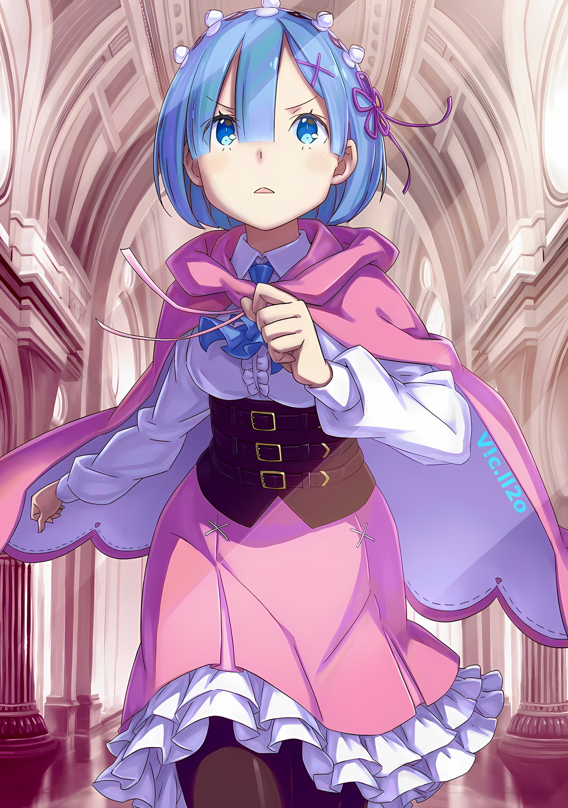

*※※※※※※※※※※※*

…Как мы все знаем, Убирк был «Звездочетом».

Заповедь, данная ему, заключалась в том, чтобы спасти Империю Волакия от гибели в результате постигшего ее «Великого Бедствия».

Для этой цели он, простой мужчина-проститут, обрел неожиданный интеллект, и, в конце концов, Винсент Волакия признал за ним определенную ценность.

Конечно, Убирк не был настолько наивен, чтобы рассматривать это как собственную заслугу.

Тем не менее, на фоне многих, кто получил должность «Звездочета» и, казалось, ступил на трагический путь, Убирк считал себя в удачном положении.

Для подавляющего большинства «Звездочетов» получение заповеди означало искажение человеческой природы, которой они обладали до этого момента, и необходимость жить совершенно по-новому. Кто-то мог бы оценить это как прискорбное или жалкое, но, по мнению Убирка, предпосылки для этого были экстравагантными, и об этом нельзя было думать иначе, как о точке зрения того, кто был благословлен.

Искаженная человеческая природа и окружающие люди, которые могли почувствовать перемены внутри них… если бы не приобретение этих вещей, они бы никогда не смогли вынашивать такое признание с самого начала.

Убирк, безусловно, был одним из таких людей, и, изменив свой образ жизни, жизнь, которую следовало бы прожить, оставаясь никем, он был глубоко благодарен за то, что его одарили заповедью.

…Даже сейчас, после того как он выполнил свою заповедь в качестве «Звездочета», это не изменилось.

Убирк: И всеее~ же, не похоже, чтобы Волакия была спасена…

В Укрепленном Городе Гаркла, где всю ночь велись приготовления к войне, было необходимо усилить вооружение и разместить соответствующий персонал, и Убирк, не имея собственной позиции, уперся подбородком в руки и что-то бормотал, глядя на всех занятых людей.

Почувствовав, что туман, который всегда занимал уголок его сознания, рассеялся, его мысли внезапно освободились от некого влияния, и Убирк осознал, что он больше не «Звездочет».

Как уже говорилось, заповедь, данная Убирку, заключалась в том, чтобы спасти Волакию от «Великого Бедствия».

Несмотря на это, тот факт, что Убирк в настоящее время освободился от своей заповеди, был равносилен косвенному признаку того, что он больше ничего не сможет сделать в отношении «Великого Бедствия».

Как только Убирк очнулся от стимулирующего его безумия, он почувствовал себя так, будто его раздели догола.

Убирк: Я благодарен. Но хоооть~ я иии~ благодарен…

Ему потребовалось почти десять лет для ее реализации, это было в точности похоже на грандиозную схватку, которая случается лишь раз в жизни.

Если бы у него из-под ног выдернули лестницу прямо перед тем, как он добился каких-либо результатов, он, возможно, поддался бы искушению недовольно пробурчать: «Так быть не должно». Он даже уничтожил свой Злой Глаз — природную особенность, присущую ему как представителю Племени Злого Глаза, — просто чтобы доказать Винсенту, что он не скрывает предательства, тем самым заявив о своей позиции.

Шрам от Злого Глаза до сих пор одиноко красовался у него на груди.

Убирк: Что ж, в любом случае, хорошо, что у меня, как у пользователя Злого Глаза, нет к нему никакого таланта.

Проблема заключалась в том, что дрова, которые он неустанно жег до сегодняшнего дня, исчезли, и лишь только дым от тлеющей веры Убирка продолжал подниматься вверх.

До сих пор он продолжал двигаться в направлении, указанном ему заповедью, и выполнял свой долг «Звездочета».

Таков был метод борьбы Убирка, поэтому он не приобрел знаний о боевых стилях воинов, таких как размахивание мечом или натягивание луков. Дни, проведенные им на Острове Гладиаторов, также были связаны с тем, что его первостепенной задачей являлось не умереть, чтобы выполнить свою заповедь, поэтому у него не было абсолютно никакого боевого опыта.

Таким образом, в этой крепости, где у каждого была твердая решимость сражаться, Убирк был совершенно один.

Убирк: Интересно, стоило ли мнеее~ сообщать об этом Его Превосходительству в столь глупой и честной манере?

Покинув Укрепленный Город Гаркла, Винсент направился в столицу Империи Рапгану для решающей битвы.

Перед отъездом он напрямую допросил Убирка. …О том, может ли он, как «Звездочет», еще принести какую-то пользу в предотвращении «Великого Бедствия».

Если бы он солгал и сказал, что его заповедь все еще не выполнена, возможно, его бы не оставили в крепости.

Убирк: Нооо~, я действительно не хочу, чтобы Империя была уничтожена.

Если бы он солгал из-за неимения места, Винсент получил бы ненужное беспокойство, и это станет актом, выгодным для врага.

Взвешивая Винсента и Чишу относительно того, кто лучше послужит Империи, если останется позади, Убирк принял участие в плане Чиши и помог Винсенту выжить.

Он был наделен заповедью, но, в отличие от него, Чиша, который установил свой собственный образ жизни, не будучи ею наделенным, вызывал гораздо большее восхищение.

Убирк не хотел позорить это решение. С другой стороны…,

Убирк: …

Внутри беспокойной крепости Убирк бесцельно проходил мимо множества людей.

Абсолютно все понимали, в какую неблагоприятную ситуацию они попали, но при этом делали все необходимое, чтобы дать отпор. Независимо от того, насколько хорошо они справлялись со своими обязанностями, Убирк уважал то, что они посвящали себя своему долгу. В то же время он испытывал зависть. Еще совсем недавно Убирк был с ними на одной стороне.

Итак, Убирк подумал сам про себя.

Убирк: Предполооожим~, что Империя окажется в опасности… Интересно, смогу ли я снова получить заповедь?

Если он лишился своей роли, так как в ней больше не было необходимости, то что, если она снова станет необходимой?

На данный момент Убирк ничего не мог сделать с группой Винсента, поскольку они уже отбыли в столицу Империи. Но, даже если группе Винсента удастся ликвидировать зачинщика «Великого Бедствия», что произойдет, если кто-то, занимающий важное положение в Королевстве, потеряет свою жизнь, или кто-то, занимающий важный пост в Империи, умрет?

Не станет ли это кризисом, угрожающим гибелью Империи, причем в совершенно отличной от «Великого Бедствия» форме?

Убирк: Вероятность того, что кто-то вроде «Звездочета» будет наделен заповедью, выполнит ее, а затем получит новую заповедь, близка к нулю. …Но она не нулевая.

Если бы только ему была дана заповедь, которая спасла бы Империю Волакия от гибели.

Если наступит новый кризис, заповеди, вероятно, будут переданы, чтобы его предотвратить.

…Страстно желая такой возможности, ноги Убирка начали направляться к задней части крепости.

Конечно, форт, в котором находились Убирк и остальные, был большой крепостью, самой прочной в Гаркле; чтобы достичь этой точки, нежити нужно было захватить защитные стены, окружающие город, а также многочисленные форты по пути.

К этому моменту, с точки зрения обороняющихся, битва была бы проиграна. Однако в пределах Укрепленного Города не было никаких путей к отступлению, и солдатам ничего не оставалось, кроме как сражаться до тех пор, пока последний из них не падет.

В буквальном смысле, эта грандиозная крепость должна была стать последним бастионом Империи. …Если бы в ней был проем.

Убирк: Какой-нибудь маленький, незначительный.

Один проем был бы в самый раз.

Даже если не снимать засов с ворот, можно оставить их немного приподнятыми, чтобы было легче отпирать. Не помешает и установка простого магического камня с часовым механизмом, который будет срабатывать через определенное время во внешних стенах крепости. Лишь бы подтолкнуть спины нежити на один шаг вперед.

Если он так поступит, то пламя, погасшее в сердце Убирка, получит новый огонек…,

???: …Ты, что ты там делаешь?

Когда сверху на него внезапно обрушился голос, Убирк приостановил шаг и напряг выражение лица.

Обернувшись, он увидел взгляд, устремленный на него из коридора второго этажа крепости… его глаза встретились с глазами кареглазой девушки, которая ехала в инвалидном кресле с неприятным выражением лица.

Это была девушка, которая тоже ехала в соединенных драконьих повозках, не имея ни малейшего представления о своей роли. С выражением подозрительности на лице она уставилась на Убирка, который находился в непопулярном тылу крепости, и,

Девушка: Т-только не говори мне… что ты халтуришь? Все хуже некуда. Слушай сюда, если даже женщина с такими больными ногами, как у меня, работает, то ты действительно хочешь умереть, не так ли? Да, ты.

Убирк: …Нееет~, не то чтобы я халтурил…

Девушка: Так почему же ты тогда в таком месте? Т-ты можешь не придумывать таких жалких оправданий? Ты думаешь, что такой человек, как я, ничего не знает о мире, поэтому меня так легко обмануть, да? Уж такие-то вещи я могу понять.

Примешивая к этому странный комментарий о самонаказании, девушка осудила отношение Убирка.

Ее отношение было крайне односторонним, но все, что он мог сказать в ответ, бессмысленно вызывало у нее гнев, поэтому Убирк искренне сомневался в том, что ему делать. Погрузившись в раздумья, он внезапно пришел к мысли.

Убирк: Я хочу кое-чтооо~ у вас по-быстрому спросить… Ваши ноги парализованы, и вы, вероятно, не в состоянии сражаться, так почему же такая юная леди, как вы, продолжает жить?

Девушка: Ты, ты пытаешься завязать драку!?

Убирк: Ах, нет, вы ошибаетесь. Я вооовсе~ не пытался говорить о вас плохо…

Когда женщина расширила глаза от гнева и засуетилась, Убирк поднял обе руки и извинился. При этом он действительно пытался сформулировать в уме то, что хотел сказать.

В таком затруднительном положении, в огромной крепости, куда постоянно входили и выходили воины, находилась девушка-инвалид, которая не могла служить никакой цели.

Убирк: Почему такой человек ходит по окруууге~ и ищет, чем бы таким заняться?

Девушка: Это, ну, очевидно потому, что было бы ужасно просто сидеть на месте и ничего не делать!

Убирк: …

Получив в ответ грубый, сердитый голос, Убирк был поражен. Увидев удивленную реакцию Убирка, девушка издала «Агх, черт возьми!» и в раздражении укусила себя за ногти.

Грызя их, она устремила на Убирка такой взгляд, будто он убил ее родителей, и,

Девушка: Знаешь, мой жених погиб в этом конфликте. Он бросил все свои силы, чтобы прийти и спасти меня, а затем погиб.

Убирк: …Эээто~, должно быть, тяжело.

Девушка: Не говори так, будто все знаешь. Хотя, это касается не только тебя. Все говорят так, будто знают, но это не их дело. Однако…

Убирк: Однако?

Девушка: Что бы они подумали, если бы женщина в инвалидном кресле так и осталась хнычущей и трусливой, лишенной возможности служить хоть какой-то цели? Они бы выставили Тодда дураком, сказав что-нибудь вроде «Ахх, ее жених умер, потому что она была такой обузой».

Ее голос и губы дрожали, а в глазах стояли слезы, когда она бросала сердитый взгляд.

Имя, которое внезапно появилось без объяснений, вероятно, было именем ее жениха. То, о чем она говорила, несомненно, было лишь ее паранойей. Но, хотя это было излишне драматично, в этом была и доля правды.

Не зная обстоятельств, не зная отношений между этой девушкой и ее женихом, если бы незнакомые люди пересеклись с ней хотя бы на мгновение, большинство, скорее всего, прониклось бы к ней жалостью.

Девушка: Мне не нужна жалость. Я… е-если я смогу иметь хоть немного достоинства, если я смогу выполнять хоть какую-то работу, тогда этому идиоту, нет, тогда на этого идиота не нужно будет смотреть свысока людям, которые его даже не знали.

Убирк: …

Девушка: Я собираюсь прожить свою жизнь достойно.

Стиснув зубы, со слезами на глазах и дрожащим голосом, девушка произнесла эти слова. Сказав это, она снова посмотрела на Убирка своими влажными глазами,

Девушка: Е-если ты все понял, тогда иди и найди себе уже работу. Ты что, хуже женщины в инвалидном кресле?

Хотела ли она разжечь в нем огонь грубыми словами или же у нее просто был острый язык? Для Убирка, который даже не знал имени этой девушки, ее истинные намерения не могли быть разгаданы.

Хотя он и не мог их разгадать, эта девушка в достаточной мере передала, какой образ жизни она для себя установила.

И этим было…,

Убирк: Вы достойны похвалыыы~, юная леди. В конце концов, вы только что сокрушили одну из причин, которая могла бы привести к краху Империи.

Она стала толчком к тому, чтобы Убирк, который перестал быть «Звездочетом», освободился от своей заповеди в истинном смысле этого слова.

*△▼△▼△▼△*

Катя: Говоря подобную чушь, этот человек пытался перевести разговор в другое русло. Что ж, после этого, судя по всему, он действительно отправился к солдатам в крепость, чтобы найти себе работу…

Шагая рядом с Катей, которая тяжело дышала, не в силах унять свой гнев, Рем глубоко вздохнула, слушая рассказ о человеке, которому она сделала выговор.

Даже в такой ситуации, когда все должны работать как одно целое, всегда найдется определенное количество нарушителей спокойствия. Именно они обескураживали моральный дух окружающих и нарушали гармонию.

Рем: Но, пожалуйста, будь осторожна. Нет никакой гарантии, что они не выйдут из себя и не начнут буянить на Катю-сан.

Катя: Хм, это…

Рем: Я рада, что в этот раз кто-то послушно тебя выслушал. В следующий раз, пожалуйста, не будь такой безрассудной, когда меня нет рядом.

Кате, надувшей губы от горечи, нечего было сказать в ответ на заботу Рем. Она не хотела прямо говорить «спасибо», но и не желала говорить что-то, что заставило бы ее чувствовать себя плохо без веской причины. Мельком уловив Катину боль, Рем разомкнула губы.

Субару и остальные отбыли в столицу Империи, а оставшиеся в городе люди были заняты подготовкой к оборонительной битве.

Те, кто мог сражаться, были распределены по своим позициям, а те, кто не мог, были назначены в качестве поддержки. Рем, умеющая использовать магию исцеления, высоко ценилась. Это была буквально тотальная война.

Катя, обратившая в свою веру одного из немотивированных сотрудников, была одной из тех, кто делал все возможное, чтобы помочь. …Рем, конечно, знала, что, хотя она и упорно борется, это еще не значит, что она оправилась от чувства потери.

Катя потеряла своего жениха, Тодда, и даже ее брат Джамал гордо заявил о своем намерении отправиться туда, где смерть была неминуема. Можно только представить, каково это, но для Рем это было душераздирающе. Этому способствовало и храброе поведение Кати, которое она демонстрировала, пытаясь не позволить Рем волноваться.

Так что…,

Рем: Катя-сан, могу я попросить тебя помочь собрать мне чистые тряпки? Уверена, когда начнутся бои, нам понадобится их очень много.

Катя: Запросто. Знаешь, на мои колени можно сложить очень много вещей.

Не обращая внимания на храбрый фронт Кати, Рем попросила ее помочь с работой. Она верила, что это именно то, что сейчас нужно было Кате, и что это поможет как можно большему количеству людей дотянуть до завтра.

А затем…,

Петра: …Ах, сестренка Рем.

Когда Рем подняла глаза, услышав, что ее зовут, она увидела девушку, машущую рукой в конце коридора. Это была симпатичная девушка с большой ленточкой на голове… Петра. Кроме нее, была высокая фигура Фредерики, а также еще один человек…,

Рем: И сестра тоже; Что вы трое делаете вместе?

Рем наклонила голову, заметив Рам, которая прислонилась спиной к стене.

Эти три девушки, по словам Субару, были коллегами Рем с тех времен, когда у нее были «Воспоминания». На данный момент она была удовлетворена своими отношениями с Рам, но с двумя другими пока не чувствовала себя полностью в своей тарелке.

Возможно, заметив легкую нервозность Рем, Фредерика слегка опустила уголки глаз,

Фредерика: На данный момент мы закончили свою работу и пришли пригласить тебя отдохнуть вместе с нами. Мы не можем слишком ослаблять бдительность, так что минимальное чувство срочности может понадобиться, однако…

Рам: Ты долго не протянешь, если будешь все время оставаться в напряжении, к тому же, чем больше времени я буду проводить с Рем, тем лучше.

Петра: Я тоже согласна с сестренкой Рам. Кроме того…

Улыбнувшись в ответ на откровенные слова Рам, Петра в середине своей фразы перевела многозначительный взгляд на Рем.

Рем поняла истинное значение ее взгляда, который, казалось, измерял расстояние между ней и ними. Они были незнакомцами для Рем, но то же самое можно было сказать и о них.

Правда, сейчас ситуация была чрезвычайной, так что…

Рем: Я понимаю, что вы чувствуете. Но сейчас не время.

Рам: Нет, Рем. У тебя все наоборот.

Рем: Сестра…?

Рам: В конце концов, эта ситуация неизбежна. Ты можешь считать, что сейчас не время для этого, однако ты также можешь сказать, что это единственный шанс, который у нас есть. Рам может доверять Рем без вопросов. Однако…

Тут Рам прищурила свои светло-малиновые глаза и взглядом указала на двоих, стоящих рядом с ней.

Рем полагала, что дружба должна была отойти на второй план из-за срочной ситуации. Однако Рам и ее коллеги считали, что в такой ситуации важно доверие.

Рем: …Катя-сан, что думаешь?

Катя: А? Н-не спрашивай меня об этом. Во-первых, меня даже не приглашали…

Рам: О чем ты говоришь, разве ты не подруга Рем? Тебе тоже лучше пойти.

Катя: Что… н-несмотря на то, что ваши лица схожи, ты гораздо более напористая, чем Рем… нет, подумав еще раз, она тоже очень напористая девушка… хк

Рем и Рам, две сестры, заговорили с ней одновременно, и Катя выглядела ужасно озадаченной.

В любом случае, когда спросили ее мнение, взгляд Кати на мгновение блуждал, прежде чем она сказала,

Катя: …Почему бы вам не попробовать найти общий язык? Ты не станешь халтурить, если будешь говорить с ними о рабочих вопросах, и я уверена, что они в любом случае хотели тебя увидеть, нет? Или только я так думаю.

Фредерика: Катя-сан.

Петра: Катя-сама

Катя: Н-не стоит быть такими решительными! Я даже не знаю ваших имен.

Петра и Фредерика обрадовались, когда Катя, поразмыслив, протянула руку помощи Рам и остальным. У Рем тоже были свои соображения, она украдкой поглядывала на Катю, которая трепетала от энергичности этих двоих.

Не то чтобы Рем это не нравилось. Просто она не могла не чувствовать давления…

Рам: …Ты действительно так беспокоишься о Барусу?

Рем: Да. Он всегда себя так ведет… ах.

Рам тихо спросила об этом у Рем, которая, сложив руки на груди, наблюдала за Катей и остальными. Это было так естественно, что Рем даже невольно позволила себе выдать свои истинные чувства.

Не осознавая того, что делает, Рем, чья рука лежала на груди, вновь прикрыла рот и уставилась на Рам. Однако старшая сестра лишь закрыла один глаз и гордо улыбнулась, давая понять, что ей нет равных.

Именно тогда это и случилось. …В небе над огромной крепостью раздался громкий-громкий взрыв.

Все: …!

Мгновение спустя Рем поспешно повернула голову, чтобы выглянуть в окно, и увидела вспышку света, прорезавшую утреннее небо. Это было сообщение от городского сторожа, который воспользовался заранее оговоренным сигналом…,

Рам: …Фредерика!

Фредерика: Поняла!

Сразу же после этого, быстрее, чем Рем успела бы отреагировать, Фредерика откликнулась на резкий оклик Рам. Она быстро шагнула за спину Кати и схватилась за ручки инвалидного кресла,

Фредерика: Катя-сама, будьте осторожны, не прикусите язык!

Катя: П-подожди, подожди… гах

Петра: Сестренка Фредерика, сюда!

Когда Катя испустила крик, Фредерика начала яростно толкать инвалидную коляску. Тем временем Петра вырвалась вперед своим маленьким телом по коридору крепости, как бы ведя за собой инвалидно кресло.

Мгновение спустя, один за другим, все люди в крепости… а точнее, во всем Укрепленном Городе Гаркла, разом начали двигаться; в мгновение ока город превратился в единое живое существо.

Всех их объединяла общая судьба, все они были в одной лодке, это касалось и живых, и мертвых, всех и каждого — одних и тех же существ.

Рам: Рем, ты готова?

Рем сглотнула слюну, ощутив иллюзию, от которой ей показалось, что весь город задрожал; рядом с ней стояла Рам. Взглянув на лицо своей бесстрашной старшей сестры, которая задала ей этот вопрос, Рем сделала небольшой вдох и сказала,

Рем: Что будет, если я скажу «нет»?

Рам: Если так, то будь уверена, Рам готова ко всему.

Рем: …Как и ожидалось от сестры.

Рам: Разумеется. Рам — та самая старшая сестра, которой ты должна гордиться.

Кивнув Рам, которая разделяла ее храбрость, не нуждаясь даже в просьбе, Рем последовала за Катей и остальными, побежав вместе с сестрой вперед по шумной крепости.

Битва вот-вот должна была начаться. …Финальная битва, которая определит судьбу Империи.

Рем: Пожалуйста. …Я полагаюсь на тебя.

Подумав о мальчике, которого здесь не было, Рем смущенно помолилась за него.

То ли потому, что она полагалась на этого мальчика, то ли потому, что не могла быть рядом с ним, чтобы ему помочь, она не знала источника своего разочарования.

Рем неслась через сотрясающуюся крепость, следуя за Рам, которая бежала впереди нее.

*△▼△▼△▼△*

Крупномасштабная эвакуация столицы Империи Рапганы, сопровождаемая отступлением в масштабах, не имевших аналогов в истории.

Хотя потери среди мирного населения и солдат были отнюдь не малыми, нынешний исход оказался гораздо менее тяжелым, чем предполагалось изначально; во многом благодаря менталитету, в соответствии с которым граждане Империи вели свою повседневную жизнь.

…Люди Империи должны быть сильными.

Это учение и философия пронизывали каждого имперца, и благодаря этому многие смогли принять наилучшие меры для выживания в этой экстремальной ситуации.

Помимо успеха, достигнутого благодаря такой индивидуальной решимости и действиям, немаловажным был и тот факт, что различные планы, разработанные на случай чрезвычайных ситуаций, например соединенные драконьи повозки, оказались полностью функциональными. Это были достижения человека, который осознавал надвигающуюся угрозу «Великого Бедствия», приход которого изначально предсказывал «Звездочет», и делал соответствующие приготовления.

То, что этот человек не смог вступить в борьбу с этим самым «Великим Бедствием», можно было назвать горьким сожалением.

???: И все же, благодаря этой самоотверженности Империя до сих пор жива! Я выражаю вам только глубочайшее уважение, Генерал Первого Класса Чиша…!

В такт своему голосу Кафма Ирулюкс косил полчища нежити шипами, выпускаемыми из его рук, и упорно сражался, защищая дорогу, ведущую к Укрепленному Городу, позади него.

Имперская армия, развернутая вдоль шоссе, ведущего из столицы Империи в Укрепленный Город, постепенно отступала к городу, поддерживая эвакуацию отступающих имперцев, с целью слияния с группой, находящейся в форте.

Среди «Генералов», участвовавших в этой решающей битве за столицу Империи, роль, отведенная Кафме, имела первостепенное значение, и хотя сам он не признавал этого, можно было сказать, что проделанная им работа повлияла на выживание Волакии.

Решимость граждан Империи в значительной степени повлияла на снижение потерь во время эвакуации; предварительная подготовка оказала большое воздействие на прочную оборону Укрепленного Города; доблестные усилия Кафмы оказали большую силу на высокий боевой дух и минимальные потери имперских солдат.

Служа арьергардом формирования, постепенно отступавшего к Укрепленному Городу, он использовал силу принятых им «Насекомых», чтобы замедлить продвижение нежити, — достижение, достойное того, чтобы быть оставленным в анналах истории.

Однако все это зависело от того, удастся ли Империи Волакия избежать краха.

Таким образом, эксцентричные достижения Кафмы также были результатом того, что он сражался без оглядки на собственное выживание.

Кафма: …Кх.

Насколько мог видеть глаз, толпы нежити покрывали огромную равнину.

Поражая их шипами, световыми пулями и лезвиями ветра, Кафма стиснул зубы, борясь с аппетитом «Насекомых», которые разъедали его изнутри, и подавил желание закричать.

Клан Клеткосекомых мог использовать силу «Насекомых», сосуществующих в их телах, и в зависимости от типа «Насекомых», которых они принимали, они могли проявлять широкий спектр способностей и боевых приемов. Но отношения между Кланом Клеткосекомых и «Насекомыми» всегда были симбиотическими.

Это не было ни односторонним использованием, ни ассимиляцией.

Естественно, «Насекомые» требовали от хозяина вознаграждения за свою работу. Обычно это была мана или жизненная сила, но если этого оказывалось недостаточно, в ход шли плоть и кровь.

Уже прошло более пятидесяти часов с тех пор, как Кафма решился на смертельный бой, и в течение всего этого времени он был вынужден обходиться без еды и воды.

Хотя его сознание было как никогда обострено пробудившимся боевым духом, для «Насекомых» внутри его тела душевное состояние хозяина не имело никакого значения. Они просто жаловались хозяину на то, что голодны, теряли терпение, если он отказывался их выслушать, после чего начинали пожирать его плоть.

Кафма: Я нарушаю обещание. Но все же…!

Он не мог покинуть фронт войны и не мог позволить себе пасть духом.

В Империи и без него имелось много надежных воинов, но Кафма гордился тем, что был самым храбрым перед лицом смерти. Он должен был доказать, что его гордость неподдельна.

Для этого…,

Кафма: Я не должен…

*Пасть здесь*; это произошло в тот самый момент, когда он очнулся от этих слов и собирался шагнуть вперед, пока его органы все еще пожирали.

Сзади его за плечо схватила большая ладонь.

И тот, кому принадлежала эта ладонь, был…,

???: Отступи, Генерал Второго Класса Кафма! Ты уже выполнил свой долг!

Громкий голос, казалось, кричал, однако для этого человека такая громкость была обычной.

Когда ему сказали это голосом, похожим на порыв ветра, Кафма широко раскрытыми глазами уставился на вставшего рядом с ним гиганта в золотых доспехах… Гоза Ральфона.

Держа в руках булаву, с которой мог справиться только он, Гоз появился на этой сцене, удивив Кафму.

Кафма: По какой причине вы прибыли на фронт, Генерал Первого Класса Гоз? Генерал Первого Класса должен командовать из крепости…

Гоз: Там Верховная Графиня Дракрой! Она и без моего присутствия в крепости сможет умело управлять войсками! Важнее то, что я могу быть более полезен Его Превосходительству на поле боя!

Кафма: …В таком случае я буду сопровождать вас.

Его сердце, готовое разорваться от решимости и серьезности, стремилось подкрепить себя появлением Гоза. Однако Гоз прервал мольбу Кафмы твердым «Нет».

Затем, вытянув свои толстые пальцы, Гоз прижал их к груди Кафмы,

Гоз: Изнутри тебя доносятся звуки мельтешения и пожирания. Похоже, ты потерял контроль над «Насекомыми». Если ты будешь съеден целиком, это станет значительной потерей!

Кафма: Может быть и так… Но все, что я построил, предназначено для этой битвы!

Гоз: Кафма Ирулюкс! Смерть вину не искупит!

Кафма: …Кх.

Получив на этот раз прямую пощечину от сердитого голоса, все тело Кафмы начало дрожать.

В этот момент даже «Насекомые», жадно пожирающие тело Кафмы, прекратили свое движение, парализованные свирепой аурой стоящего перед ними Гоза.

Глядя сверху вниз на Кафму, Гоз, на своем покрытом шрамами бородатом лице, выразил гнев.

Гоз: Я понимаю, что ты все еще стремишься искупить вину за восстание, организованное твоими сородичами вместе с этим треклятым Балроем! Но! Искупление не может быть достигнуто через смерть! Ты должен жить!

Кафма: Генерал Первого Класса Гоз…

Гоз: Даже после того, как «Великое Бедствие» утихнет, Империя не сразу вернется к нормальной жизни! И ты, и я можем помочь Его Превосходительству! Вот почему!

С ревом, полным преданности и, казалось, готовым вот-вот разорваться, Гоз разбил мысли Кафмы.

Поняв, что это не тот случай, когда стоит жертвовать своей жизнью, Кафма, обнажив свои самые сокровенные чувства, крепко зажмурил глаза и глубоко склонил голову перед Гозом.

Гоз: Что ж, как бы то ни было, это не настолько простой конфликт, чтобы ты мог просто отступить и покончить с этим. Скоро снова наступит твой черед! А пока поешь, отдохни и восстанови силы!

Кафма: Я, понял. Генерал Первого Класса Гоз, я вверяю это место вам…

Гоз: Не нужно слов. …У меня тоже есть сдерживаемое недовольство!

Широко ухмыльнувшись напряженным словам Кафмы, Гоз направил булаву, которую держал на плече, в сторону вражеских рядов.

Управляясь с чрезмерно тяжелым оружием, с которым никто, кроме него, не мог с легкостью справиться, все тело Гоза переполнилось огромным боевым духом, настолько громадным, что он создавал иллюзию видимости.

В очередной раз почувствовав страх «Насекомых» внутри собственного тела, Кафма впал в глубокую задумчивость.

И Чиша Голд, продемонстрировавший непостижимую стратегию по предотвращению гибели Империи, и Гоз Ральфон, напугавший «Насекомых» тем, что просто стоял на месте со своим огромным духом, были теми, кто достиг положения Генералов Первого Класса Империи Волакия, каждый из которых являлся трансцендентным существом, не менее компетентным, чем другие.

Представляя, как он почти занял место среди них в прошлом и как должен будет занять его в будущем…,

Кафма: …Империя сильна. Нежить и бедствие нас так легко не возьмут.

*△▼△▼△▼△*

Отто: Дело не в силе или слабости, а скорее в количестве, и с этим довольно трудно справиться. К счастью, припасов и средств защиты в Укрепленном Городе предостаточно, однако… мы не сможем долго выдерживать такую осаду.

Серена: Ты ясно излагаешь свои мысли. Что ж, у меня определенно сложилось о тебе лучшее впечатление, чем о тех, кто не может высказать свое мнение из страха обидеть других. Если бы только твоя хитрость могла сравниться с твоей военной мощью, тогда бы ты мне понравился еще больше.

Беллстетз: Верховная Графиня Дракрой, давайте больше не будем отвлекаться.

Беллстетз, укоряя ее, смотрел на Серену тонкими, как нити, глазами. Серена пожала плечами под этим пристальным взглядом, а Отто, с которым заигрывали, испустил небольшой вздох.

Местом действия была командная комната огромной крепости, и те, кто находился друг напротив друга, отвечали за руководство полномасштабным оборонительным сражением города.

Из докладов дозорных следовало, что Укрепленный Город Гаркла перешел в состояние готовности к бою вокруг великой крепости.

Силы, сдерживавшие продвижение врага, также присоединились к нему, и в городе, который мог похвастаться сильнейшими оборонительными сооружениями Волакии, вот-вот должна была начаться крупнейшая осада в истории Империи.

Анастасия: Как правило, осаду можно выиграть, дождавшись подкрепления, однако в этот раз мы не можем на это рассчитывать. Единственный способ сказать, что мы победили, это…

???: …Когда Нацуки-кун и Его Превосходительство Император блестяще победят вражеского организатора. До тех пор наша роль — бороться за то, чтобы Волакия не пала.

Анастасия: Если Волакия падет, то Карараги и Лугуника тоже окажутся в затруднительном положении… Что за черт, это битва за выживание мира?

Приложив ладонь к своей белоснежной щеке, Анастасия грациозно улыбнулась, и лисий шарф, который вторил ей, испустил полный отчаяния вздох.

Имея весьма необычную форму, лисий шарф, принесенный Анастасией, предположительно являлся Духом. Им требовалось как можно больше способных голов, поскольку это действительно была тотальная война.

Серена: Первый вопрос заключается в том, как долго продержится оборона города… Генерал Второго Класса Ирулюкс был заменен Генералом Первого Класса Ральфоном. Несмотря на его внешность, он человек, способный к тонкой и искусной работе. Он должен следовать директиве максимально щадить жизни зомби, однако…

Беллстетз: Постоянно ожидать отсутствия летальности нереально. Это относится не только к Генералу Первого Класса Гозу, но и ко всем остальным. Если у нас есть хоть какая-то надежда удержаться…

Анастасия: Я думаю, это группа друзей Нацуки-куна.

Отто: Я тоже так думаю.

Анастасия и Отто обменялись взглядами, согласуя свои мнения друг с другом.

Тема, поднятая дуэтом, касалась странных сил обороны Укрепленного Города, на которые они возлагали большие надежды, — членов «Эскадрона Плеяд».

А возглавлял эту группу черноволосый мальчик, у которого чудесным образом сложились дружеские отношения с Винсентом. Своей сплоченностью и загадочными боевыми способностями они оказали значительную помощь беженцам.

В настоящее время мальчик вместе с Винсентом и остальными направился в столицу Империи, оставив группу под руководством Густава Морелло… и под руководством сурового представителя Племени Многоруких гладиаторы сражались исключительно хорошо.

Шарфидна: Их боевой дух высок, а способность предотвращать потери впечатляет. Я часто думаю про себя, что Нацуки-кун — гений по части доставки необходимого туда, где это необходимо.

Отто: Да, похоже, это его единственное положительное качество. Хотя мне бы хотелось, чтобы он просто доставлял товары или наводил мосты между политиками, а не безрассудно ввязывался в самые опасные ситуации.

Анастасия: Но, может, это больше проблема Эмилии-сан? Если Эмилия-сан начнет бежать вперед, Нацуки-куну тоже придется бежать, тут уж ничего не поделаешь.

Анастасия покачала головой с жестом «Ну и дела», а Отто опустил плечи в знак согласия.

Хотя наблюдать за этим обменом мнениями и развитием отношений было бы интересно, тратить на это слишком много времени — значит навлечь на себя суровый взгляд премьер-министра.

Серена прочистила горло и, завладев всеобщим вниманием, произнесла,

Серена: Согласно предварительной договоренности, наша боевая стратегия заключается исключительно в проведении осады, оборонительного сражения. Если бы победа над одним конкретным противником могла решить все проблемы, я бы рассмотрела убийство как вариант, однако…

Беллстетз: В нынешней ситуации давайте считать Его Превосходительство и тех, кто направляется в столицу Империи, стрелами для убийства.

Серена: Так оно и есть. …Это тотальная война.

При словах Серены в воздухе повисло напряжение, и выражения лиц всех присутствующих стали еще более серьезными.

Легкомысленный балаган закончился, и с этого момента им нужно будет приложить максимум усилий.

Генералы Империи, повстанцы, гладиаторы Эскадрона Плеяд, «Племя Судрак» и даже союзники Королевства и эмиссары из Городов-государств — все они участвовали в битве, в которой использовалось все, что было в их распоряжении.

И, в качестве первого препятствия…,

Серена: Мы будем рассчитывать на вас, посланцы из Городов-государств.

Анастасия: Конечно, предоставьте это нам. …Насколько я помню, он никогда меня не подводил, ни разу.

*△▼△▼△▼△*

…Среди военных действий, которые вела Империя Волакия, какой именно аспект наиболее сильно отличался от других стран?

Если не обращать внимания на решимость имперских солдат и их пламенный дух сражаться, то ответ был ясен и прост — потенциал воздушного боя.

Техника «Укрощения Летающих Драконов», которой не было у других народов, и тот факт, что большое количество летающих драконов обитало исключительно в Империи, были аспектами их превосходства, которые были тщательно продемонстрированы в ходе военных действий.

О том, что способность летать по воздуху является преимуществом в войне, можно было даже не задумываться.

К примеру, Город-крепость Гуарал, который, по слухам, мог похвастаться высокой обороноспособностью среди других городов подобного размера, был полностью разрушен из-за стаи летающих драконов под командованием «Генерала Летающих Драконов», Мэделин Эшарт.

Если просто бросать предметы вниз с недосягаемых позиций, битва станет односторонней.

Это представляло угрозу даже для Укрепленного Города Гаркла, окруженного высоченной стеной.

Однако…,

???: Огонь…!!!

Выстроившись в шеренгу на вершине стены, воины Судрак с луками наготове в унисон выпускали стрелы в воздух.

Шквал стрел застилал небо, не давая возможности спастись, и прямо под этими бесчисленными атаками стая мертвых летающих драконов, получившая приказ атаковать крепкий город с неба, неслась по воздуху, приближаясь все ближе и ближе.

Пронзенные безжалостными атаками, одна за другой головы мертвых летающих драконов разлетались вдребезги, превращаясь в пыль и падая на землю.

Среди них были и такие, которые продолжали лететь, не обращая внимания на атаки, однако…,

Судракийка: Уничтожьте их!

Судракийка: Будет лучше, если они упадут на землю~.

Пораженный ударом стрелы, несравнимой с обычной стрелой по длине и толщине, один из них разлетелся на кусочки еще в воздухе и встретил свой конец.

В ответ на воздушные бои Судрак могли похвастаться непревзойденной силой… опыт вышеупомянутого сокрушительного поражения в Городе-крепости оказал большое влияние на боевой стиль этих женщин.

Если бы они не потерпели того поражения, Судрак, скорее всего, не сражались бы здесь с мертвыми летающими драконами.

Придавая значение каждой из своих битв, «Племя Судрак» сражались с самого начала потрясений в Империи, начавшихся со свержения Винсента Волакии.

И, в ответ на моральный дух этих женщин…,

Судракийка: Твой черед! Мужчина с красивым лицом!

Мужчина: Я сделаю все возможное, чтобы оправдать ваши ожидания. …Аль Клаузерия.

Сплетя заклинание тонким тембром голоса, кончик меча Рыцаря прочертил небо, и, следуя этой траектории, родился радужный свет, преградивший путь мертвым летающим драконам.

Несмотря на красоту радужного сияния, оно стало барьером, отвергающим все и вся.

Мужчина: Совершенно не такие, как тогда, когда они были еще бутонами, эти девушки расцвели, и это — их мерцание.

В мгновение ока небо Укрепленного Города охватила радужная аврора… впрочем, ее размера и протяженности хватило только, чтобы защитить примерно половину обширного Укрепленного Города.

Имперские солдаты, сражавшиеся на передовой, а также те, кто отвечал за защиту города с вершины стены, лишились дара речи от столь необычной боевой мощи и не могли не почувствовать прилив смелости от этой надежности.

Почувствовав такой подъем боевого духа, Рыцарь, подаривший эту радугу… Юлиус Юклиус взмахнул подолом своего кимоно и снова поднял глаза к небу.

С белым шрамом под левым глазом бесстрашный молодой человек участвовал в битве из чувства чести и, тем не менее, без малейших колебаний устремил свой взор на то, что должен был сделать. Его взгляд был устремлен в небо, на бескрайние земли, к которым приближалась нежить, и он верил в усилия своего друга, который направился еще дальше…,

Юлиус: …Я буду выполнять свои обязанности. Надеюсь, ты тоже будешь выполнять их в полной мере, Субару.
