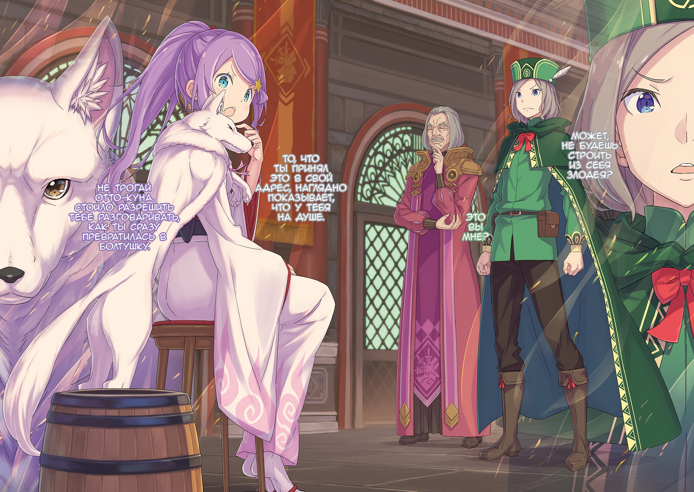

— Какакакка! Вон оно как, даже в голову прийти не могло, что я погибну где-то в тихом месте, а не в бою. Сколько прожил, ну вот ни разу не слышал, чтобы шиноби так умирали, ироничненько, да?

Сказал чудовищный старик, заливаясь смехом и размахивая пустыми рукавами.

Гарфиэля снедали смешанные чувства: с этим пациентом его магия исцеления была бессильна.

…После «Великого Бедствия» Гарфиэль принялся лечить раненных.

С тех пор как прибыл в Империю, он не переставая рисковал своей жизнью в жестоких сражениях. Все близкие твердили Гарфиэлю, что отдых важен, но он их не слушал.

Благо, тело его было крепким, а «Божественная Защита Духов Земли» и вовсе позволяла ему отдыхать, когда он стоял на почве. Среди всех в лагере Эмилии именно Гарфиэль был далек от того, чтобы умереть от переработки. Впрочем же, ближе всего к смерти был все равно Отто.

В любом случае…,

— «Как только ты что-то решил, тебя уже никак не отговорить. Тогда валяй, пусть Империя будет в еще большем долгу. Сейчас как раз нужны люди на эту работу.»

Он был рад присутствию человека, к которому испытывал чувства и который ясно дал понять, что поддерживает его решение. Было так типично, что она тыкала в его недостатки, но ему это нравилось.

Поэтому, как бы ни жаловались остальные его товарищи, Гарфиэль взял эту роль. Но никто не стал ему мешать, все его понимали.

— Разве можно сидеть на жопе ровно, когда Капитану приходится тяжелее всего?

Гарфиэль заворчал и стиснул клыки.

Они потеряли по-настоящему сильную женщину. И хотя сражались они против разных врагов, зрелище языков пламени, что летали по столице Империи, глубоко въелось в веки Гарфиэля.

Чувство потери — его нельзя было описать как просто смерть конкурентки Эмилии.

Потому-то Гарфиэль и был здесь.

Пусть даже всего одного, но он не даст ему погибнуть. Этими руками, что без остановки боролись с нежитью, и грубой силой он будет спасать чужие жизни.

Все это противоречило друг другу, но противоречить было не страшно. Он не думал о сложном, а просто следовал зову сердца.

И оно говорило ему убивать врагов и спасать союзников. Если, отказавшись от сна, он сможет спасти еще хоть одного, то Гарфиэль так и сделает.

— …Господи, до чего же стала наглеть молодежь — берут и бросают бедных стариков. Никуда не денешься, аж из себя выводит.

— Ты это щас так пошутил, дед? Крутой я не могу вернуть твои руки…

— Какакакка! Не сказал бы, что пошутил. А вот что скажу, так это то, что все эти годы основой моей силы была бесконечная зависть и ревность, усек момент? Сказать, что я завидую, — это ничего не сказать. Я просто переполнен ревностью, скажешь да.

Ольбарт шевелил седыми бровями вверх-вниз и ловко почесывал шею ногой.

Похоже, его не особо мучила потеря обеих рук. Трудно понять, то ли он просто волновался за Гарфиэля, чья магия исцеления была с ним бессильна, то ли наоборот, просто издевался.

Так или иначе, что бы ни случилось у него с руками, этот старик настоящее чудовище, раз так хорошо двигался, хотя и был уже на пороге смерти.

Хотя, если речь зашла о том, чтобы побывать на пороге смерти…,

— …Ебало на ноль, старый хуесос! Отъебись ты уже от него нахуй, в отличие от тебя он все равно хуярит как черт, хотя видно, как его эта жизнь уже просто доебала!

— О, страшно-страшно. Так полумертвые себя не ведут, это уж точно.

Кто-то, кто лежал на кровати в дальнем углу комнаты, сердито закричал, отчего Ольбарт издал тихий смешок. В ответ на эту брань Гарфиэль почесал затылок и сказал: «Эй»,

— Благодарен за поддержку, но сперва о себе думай. Серьезно, ты очень близок к смерти… ты в состоянии, близком к «Предложению Вивироло».

— А? Блядь, да я про то, что, нахуй, ты мне жизнь спас! Выблядок, или ты что, сука, хочешь сказать, что моя благодарность тебе в хуй не всралась…? Гхгахк!

— Заткнись и отлеживайся!

Он толкнул ладонью голову низкорослого получеловека, отчего тот с воплем повалился назад. Из-за тяжести его ран сделать это было легче легкого; даже если постоянно применять магию исцеления, да с полной силой, она все равно не вылечит серьезные травмы.

Потому даже сейчас тело низкорослого получеловека пронизывала острая боль.

— Конечно, не мне об этом говорить, но крутой я удивлен, что ты еще в силах двигаться и говорить.

— Меня, сука, распирает от боли, мне просто ебанутейше тяжело, но такая хуйня великого Груви Гамлета не остановит. Вот так-то выблядки, так что дайте мне уже какой-нибудь яд, лекарство, или еще какую-нибудь ебанину, чтобы я заглушил свою… ГыыКХАААА…!!!

— Угомонись, угомонись. Вот что бывает, когда не слушаешь свое тело. Ты так же близок к смерти, как я, а у меня обоих рук нет. Может, тебе пора на пенсию?

— Хуй ты дождешься, пидораса кусок!

На насмешку Ольбарта, оскалив клыки и крича от злости, ответил Груви Гамлет… один из «Девяти Божественных Генералов», тот, кто ближе всех в Империи подобрался к смерти и при этом остался жив.

В битве с «Великим Бедствием», когда все были на волоске от гибели, Груви сыграл до ужаса важную роль: именно он сошелся в схватке с главным действующим лицом истории «Ирис и Терновый Король», Югардом Волакией, и работал вместе с Халибелем, чтобы развеять проклятие; он — ключевая фигура их победы.

— Крутой я слышал, что если бы не ты, всех обездвижили бы шипы.

— Я сделал все, что нахуй мог. Когда «Император Терний» и «Хвалитель» попиздовали хуй куда, я просто валялся на земле, пока не отдал блядский «Меч Дьявола» дегенерату Сесилусу.

В недовольстве пробормотал Груви: прежде чем упасть без сил, ему пришлось хорошо потрудиться.

Он перенес проклятие Югарда в свое тело, а затем дал «Мечу Дьявола» разрубить его вместе с собой; сколько бы Гарфиэль ни слушал эту историю, он все равно не мог ее понять. Впрочем же, по словам Груви и Ольбарта, они не понимали его историю о битве с «Облачным Драконом», так что в этом плане у них отличий не было.

Скопление чудес всех и каждого — вот что происходило в столице, да что там, во всей Империи. Будь то Гарфиэль, который сражался с «Облачным Драконом», Груви, который спас «Императора Терний» от проклятия шипов, или Ольбарт, который пожертвовал последней рукой, чтобы помешать планам «Ведьмы», — все они выложились на полную.

Не было нужды преувеличивать их достижения, равно как и идти против фактов.

— Что ж, мне, как пожилому человеку, которому осталось не так уж много, всегда больно видеть, как гибнет молодежь, поэтому я рад, что вы выжили.

— …Если не считать меня, то довольно спорно пиздеть, что тот тип выжил.

— Тот тип…?

Гарфиэль перевел взгляд в конец лечебницы: там он заметил отчетливый силуэт чего-то стоящего вертикально.

Даже сейчас здесь царила суматоха, люди бегали туда-сюда, помогая раненым; в углу лечебницы, прижавшись к стене так, чтобы никому не мешать, стояло существо из стали… заметив взгляд Гарфиэля, зеленый драгоценный камень, вставленный в то, что казалось головой, засветился, и,

— Я, попал, в, зону, видимости. Задание, приказ, указание — по прогнозам, что-то из.

В такт словам к Гарфиэлю и остальным двинулся еще один из «Девяти Божественных Генералов», известный как «Стальной», Могуро Хагане.

Правда, его раса отличалась от Стального Народа, ведь он был «Метеором», который служил ядром дворца, однако после разрушения самого Кристального Дворца и Магической Кристальной Пушки эта роль стала бесполезной…,

— А, прости. Крутой я случайно туда посмотрел, у меня нет для тебя заданий.

— Принято. Остальные?

— Ни хуя у нас для тебя нет. Стой здесь и не выебывайся, Могуро.

— Могуро. Так, меня, зовут. Принято. Буду, ждать, дальнейших, указаний.

Гарфиэлю было немного неловко. Груви указал подбородком место Могуро, и тот послушно сел рядом с его кроватью.

Этот «Метеор» выглядел как громоздкая декорация.

— Он как хорошо выдрессированный наземный дракон или волк, похвально-похвально. Но в этом-то все и дело, да? Даже Кристальный Дворец может забыть.

— Кристальный Дворец и Магическую Кристальную Пушку разнесли к хуям. Я просто в таком ахуе, от бедного Могуро почти ни хуя и не осталось. А еще словно, блядь, в какой-то дерьмовой сказочке, он так удачно ебнулся с неба неподалеку от меня.

— Ты с ним лучше всех ладил, так что, может, он сам к тебе пришел?

Ольбарт загоготал, выдавая шутку за шуткой, на что Груви недовольно фыркнул.

Как ясно из их диалога, Могуро Хагане не помнил ничего до «Великого Бедствия». Как сказал бы Субару это «сброс до заводских настроек», потому что все, чем когда-то был «Метеор» оказалось стерто.

Чтобы избежать катастрофы, огромную силу, способную разнести всю столицу Империи, подняли в небо. Она взорвалась и не уничтожила все вокруг, так что можно сказать, это была небольшая цена.

— Да как крутой я мог такое подумать после того, что случилось с Рем?

Из-за ситуации с одним из его товарищей Гарфиэль прекрасно осознавал, какой тяжелый груз несет человек, потерявший свои «Воспоминания».

Потеря «Воспоминаний» была тяжелым испытанием не только для самого человека, но и для окружающих, о которых он забыл.

Поэтому Гарфиэль ясно понимал это.

— Дед может быть прав.

— Аа? Ты меня тоже доебать решил?

— Нет. Крутой я хочу сказать, что, даже если он ничего и не помнит, то все равно остается рядом с тобой.

С этими словами Гарфиэль бросил взгляд на Могуро.

По правде сказать, этот здоровяк, сидящий в лечебнице, сильно мешал, но то, что он старался быть как можно меньше, чтобы не беспокоить окружающих, вселяло добро.

Начнем с того, что Могуро приложил столько усилий, чтобы остаться здесь, возможно, потому что не хотел расставаться с Груви.

Скорее всего, после потери «Воспоминаний» он просто привязался к первому встречному. Но Рем говорила, что когда воссоединилась с Рам в Империи, то вдруг по какому-то странному чувству поняла, что та — ее старшая сестра.

Гарфиэль подумал, что, может, и в Могуро тоже было это «Чувство».

— А еще Капитан рассказал, как Рем ни с того ни с сего сломала ему палец…

Бывали случаи, когда это «Чувство» не приходило, так что нельзя сказать, что это абсолютное правило. Но, так как это была лечебница, если Могуро сам пришел сюда, чтобы вылечить свое сердце, то у Гарфиэля не было причин его выгонять.

— А вот дед даже без рук умудряется мешать и все никак не закроется.

— Какакакка! Ох, да как эта молодежь только со мной общается, ну и ну! Что ж, я понял тебя.

Гарфиэль пожал плечами, а Ольбарт захохотал, размахивая пустыми рукавами. В стороне от них Груви потер свой черный нос и посмотрел на Могуро.

Он посмотрел на своего бывшего товарища по оружию, который сейчас попытался было дотронуться до него, но,

— Нахуя ты это делаешь, меня это на слезу не пробьет, ты понял, блядь?

— В, этом, ответе, обнаружен, звук, какой-то, жидкости. Под, влиянием, страха, перед, необычными, обстоятельствами, запрашиваю, указания…

— ЗАКРОООЙ ЕБАЛО!

— Принято.

На этот странный диалог Гарфиэль оскалил клыки в улыбке.

Он немного призадумался, уместно ли ему вообще здесь улыбаться, но в итоге, следуя зову сердца, все же продолжил.

△ ▼ △ ▼ △ ▼ △

— …Значит, вы, Анастасия-сама, вернетесь в Лугунику через Карараги?

— Я нахожусь в Империи как представитель Карараги, поэтому да. Хотя это лишь титул, я должна выполнить свой долг.

Когда Анастасия мягко улыбнулась и поделилась своими планами, Отто ответил ей непринужденным «Понятно».

Однако его мысли не были так спокойны, как выражение лица. …Как бы то ни было, Анастасия выполнила обещанную роль для Городов-государств, что улучшит ее репутацию в Совете Карараги и даст ей новый толчок в борьбе за корону.

Конечно, Эмилия тоже внесла большой вклад в битву с «Великим Бедствием», причем сам Его Превосходительство Император Винсент попросил ее о помощи.

Хотя лагерь Эмилии проник в страну тайно, они вернутся домой гордыми победителями.

И все же, будь то битва против Культа Ведьмы в Пристелле, захват Сторожевой Башни Плеяд или спасение Империи Волакия, оба лагеря — и Эмилии, и Анастасии — участвовали. Плохо было то, что репутация достанется им обоим. …Эмилии нужно совершить свой подвиг.

Разумеется, если бы не участие в битве с «Великим Бедствием», лагерь Анастасии остался бы далеко позади.

— Тебе, Отто-кун, наверное, сейчас тяжело. Много чего нужно обмозговать, да?

Наступившую на мгновение тишину нарушил взгляд светло-бирюзовых глаз Анастасии.

Несмотря на то, что это было лишь предположение, в ее вопросе чувствовалась уверенность, ведь она многое видела и пережила.

На ее взгляд Отто улыбнулся и ответил: «Нет»,

— Если сравнивать с Его Превосходительством Императором и премьер-министром Беллстетзом, которым теперь нужно заново отстраивать Империю, то не так уж и тяжело.

Затем Отто перевел разговор на кое-кого из присутствующих… на Беллстетза Фондальфона, премьер-министра Империи.

В зале переговоров, где собрались Анастасия, Беллстетз и Отто, обсуждали дальнейшие действия Волакии, которая сейчас разрабатывала план по восстановлению связей и возрождению Империи.

На фоне всего этого Отто направил внимание собравшихся на старика, который прятал цвет своих глаз в глубине узких век,

— Как вы и сказали, работы нам предстоит много. Но, честно сказать, я не думаю об этом как о какой-то ноше.

— О, правда? Воодушевляет.

— Я подлый предатель, который сговорился с Чишей Голд, чтобы подставить Его Превосходительство Императора. Из-за некоторых событий меня не казнили во время «Великого Бедствия», но все равно собирались казнить после.

— …Раз вы так говорите, значит, надеюсь, казнить все же не будут?

— Да. Так постановил Император. Конечно, если бы кто-то все равно решил, что меня надо казнить, нельзя помиловать, то я бы уже был без…

Отто догадывался, о чем хотел сказать Беллстетз. Причина, по которой его голова все еще крепилась к шее… — это декларация, сделанная после войны сильнейшим человеком Империи, «Синей Молнией».

— «Пока второстепенные роли не захотели расплаты, хочу объявить, что решение Его Превосходительства — не убивать Беллстетза-сан, поэтому вы все должны подчиниться. Если кто-то пойдет против, я впервые за долгое-долгое время явлю миру свой меч. К слову, я подозреваю, что Чиша рассчитывал на то, что Его Превосходительство таки не станет казнить Беллстетза-сан. И вообще, Беллстетз-сан больше так не будет, да? Ну, я к тому, что раз уж Чиши с нами больше нет, значит, точно не будет.»

Это было слишком длинное объявление, чтобы назвать его декларацией, но оно сыграло важную роль в разубеждении тех, кто знал о поступках Фондальфона.

Беллстетз, видимо, думая о том же, слегка улыбнулся и сказал,

— Никогда бы не подумал, что меня будет защищать Генерал Первого Класса Сесилус Сегмунт. Если не «Меч Света», я думал, что именно его клинок меня и казнит.

— Но все обошлось. Это дело Империи, поэтому я, как посторонний, не в праве что-либо говорить, но считаю, что это было мудрое решение. Военный чиновник в чрезвычайной ситуации и гражданский чиновник до и после нее — это разные роли, обе важны и незаменимы.

— Согласна. Если бы Беллстетза-сан отстранили от должности, из мыслящих остался бы только Император, но разве бы он просто не загнулся, хоть у него и будет женушка-жена, которая всегда его поддержит?

— Может и так. Я, как слуга, рад тому, что у Его Превосходительства появилась Императрица. …Если бы не этот праздник, Его Превосходительство переживал бы все трудности в одиночку.

— …

Беллстетз слабо покачал головой, и в комнате повисла напряженная тишина.

Отто взглянул на Анастасию, которая тоже ощущала на себе тяжесть этого затишья.

Причиной их молчания, разумеется, стали трагические события, постигшие Винсента… смерть его доверенного лица и сестры, с которой он был одной крови.

Влияние смерти последней прочувствовали и Отто, и Анастасия.

— Поистине самовлюбленная принцесса.

С губ Анастасии слетел шепот, заставивший Отто закрыть глаза.

Проступило тонкое чувство — это был редкий треск в характере Анастасии, которая обычно отличалась храбростью, оставаясь невозмутимой перед лицом любых испытаний.

Именно эту слабость Отто всегда хотел найти в Анастасии, чтобы иметь над ней преимущество. …И все же он не стал бы этим пользоваться.

Если кто-то задался вопросом, почему, то,

— Потому что это не повторить.

Всплывшую уязвимость Анастасии нельзя было удобно использовать в будущем. Было бы сложно повторить такую же ситуацию, а даже если бы и можно было, то не стоило.

В конце концов, в его близких появился больший и более глубокий раскол, чем в Анастасии.

Отто этого не хотел. За последние несколько месяцев расстояние между лагерями Эмилии и Анастасии сократилось слишком сильно.

— Может, не будешь строить из себя злодея?

— …Это вы мне?

Отто откликнулся на внезапный третий голос и взглянул на шею Анастасии… Дух в облике лисьего шарфа, Ехидна, смотрела на него черными глазами.

В ответ на слова Отто ее глаза слегка сузились.

— То, что ты принял это в свой адрес, наглядно показывает, что у тебя на душе.

— Звучит не очень убедительно.

— Какой упрямый. Ты похож на Ану.

Тотчас Анастасия ткнула голову сердитой Ехидны и сказала: «Эй». Глядя на свой шарф, который словесно налетел на Отто,

— Не трогай Отто-куна. Стоило разрешить тебе разговаривать, как ты сразу превратилась в болтушку.

— Мхм, будто я рот открываю всегда, чтобы просто поболтать. Раньше меня сильно ограничивали.

— Прости за моего ребенка, Отто-кун.

Извинения Анастасии были встречены словом «Нет» и взмахом руки Отто.

Ехидна просто хотела показать, что она здесь, а не то, что беспокоится за него. Она знала о расколе в Анастасии, который заметил и Отто, отчего захотела убедиться, что он не собирается этим воспользоваться.

Все это было для того, чтобы не дать ему напасть, пока она не сможет прочитать мысли Отто и понять, что он не задумал ничего плохого.

Так или иначе…,

— Не думаю, что я злодей. …Ничего из себя не строю, просто чувства.

В этом смысле замечание Ехидны было совершенно не к месту.

Новость о смерти Присциллы, которая потрясла даже Анастасию и весь ее лагерь… никак не отразилась на Отто, из-за чего он чувствовал себя бессердечным.

У него было несколько возможностей поговорить с Присциллой, он даже признал, что она — выдающееся Кандидатка. Но все равно Отто чувствовал себя именно так.

— Вполне очевидно, что какая-то из Кандидаток могла выбыть из игры в разгар Королевских Выборов.

Естественно, Отто не ожидал, что она погибнет в битве за выживание другой страны. Но, учитывая всякие политические разногласия, вполне возможна ситуация, когда кто-то мог бы нанять убийцу, чтобы устранить Кандидатку.

Даже в лагере Эмилии был случай, когда наемного убийцу послал, к большому удивлению для всех, их союзник.

Он верил, что «Совет Мудрецов», нынешнее руководство Королевства Лугуника, учел подобную ситуацию заранее.

Если бы Кандидатки больше не стало, занял бы ее место кто-то другой или же Королевские Выборы так и продолжились бы?

По мнению Отто, последний вариант был более вероятен, да и он сам предпочел бы именно его.

В конце концов, такая ситуация имела огромное значение для Королевства…,

— По плану мы должны отправиться в Королевство в ближайшие несколько дней. Думаю, Империя и сама не хочет, чтобы другие страны узнавали больше о ее состоянии после «Великого Бедствия».

— То же самое касается и нас, хотя было бы довольно странно двигаться в том же темпе. Мы, возможно, уедем в Карараги уже завтра, все зависит от того, как быстро подготовимся. Отто-кун, что же до доклада в замок…

— Пожалуйста, предоставьте это нам. Данный вопрос нельзя решить письмом.

Анастасия кивнула и передала Отто ответственность за доклад в Королевский Замок.

Надо сказать, это была непростая и крайне важная обязанность. Отто поможет Эмилии, потому что ей, скорее всего, будет очень тяжело справиться с этим одной.

В такие непростые времена именно единственный и неповторимый Рыцарь Эмилии должен был поддерживать ее больше всех.

— …Хотя с нынешним состоянием Нацуки-сана это скажется на Эмилии-сама с точностью до наоборот.

— …С Нацуки-куном все по-прежнему?

— Да. Рыцарь Юлиус много раз приходил к нему, но все без толку. Не хотел об этом говорить, но думаю, Присцилла-сама только и делала, что издевалась над ним…

— Для Нацуки-куна это было неважно. …Я очень переживаю.

Анастасия говорила и щекотала пальцами шею Искусственного Духа. Вздрагивая от ее прикосновений, Ехидна, казалось, тоже очень волновалась за Субару.

Анастасия и Ехидна были очень привязаны друг к другу.

— Я услышал мнения посланников Королевства и Городов-государств. Его Превосходительство Император приказал быть учтивыми с обеими нациями и дал мне полномочия решать вопросы. Если я могу чем-то помочь…

— Что ж, я еще как этим воспользуюсь. Ничто не раздражает больше, чем пустой вексель 2 .

Анастасия язвительно улыбнулась Беллстетзу, который прятал свои эмоции за нитевидными глазами.

Отто, разделявший ее настрой, тоже хотел извлечь из этого как можно больше выгоды.

Таково было его место в лагере Эмилии, но не как злодея, а как того, кто берет на себя все «Необходимое Зло».

В силу своего характера, даже если бы Присцилла не умерла, Отто все равно бы использовал ее происхождение из Императорской Семьи как основание, чтобы снять Бариэль с Королевских Выборов как неприемлемую Кандидатку.

Да, он бы точно это сделал.

Именно поэтому…,

— Даже если бы вы остались живы, то все равно бы не стали нашим врагом. Пускай и не так сильно, как по Нацуки-сану и Эмилии-сама, но ваша смерть… ударила по мне.

Как кто-то из другого лагеря, кто не имел причин оплакивать ее смерть, это была самая малая толика соболезнования, которую Отто Сувен мог выразить ушедшей женщине.
