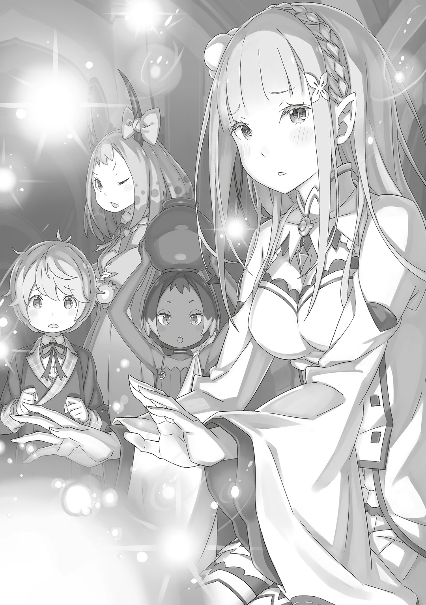

— …Мэделин?

Встретив Мэделин Эшарт, которая нагло расхаживала по крепости, Эмилия удивилась и окликнула ее.

На внезапный зов та остановилась, повернула голову с черными рогами и скривила лицо, будто съела чего горького.

В ответ Эмилия взмахнула рукой, как бы показывая, что вокруг ни души,

— Тебе не обязательно так на меня смотреть. Я же здесь одна.

— …А что это меняет? Я, дракон, корчу такое лицо, потому что это ты.

— Э, серьезно? Но почему?

— Ты что, черт возьми, забыла? Пришла, значит, со своим снегом, еще и подралась со мной, драконом, и Мезореей! Мне тебя после этого с распростертыми объятиями встречать или что?

Мэделин повысила голос, ее золотые радужки заострились. Эмилия кивнула со словами: «Понятно…» и задумалась об их отношениях.

Действительно, и в Городе-крепости, и в решающей битве за столицу Империи Эмилия сражалась с Мэделин. Они обе находились в Рапгане, когда началось «Великое Бедствие», но больше не пересекались. Если подумать, они впервые вот так спокойно разговаривали.

— В последний раз я видела Мэделин, когда превратила ее в глыбу льда.

— …! Так значит это была ты? Я, дракон, пошевелиться не могла, мне было так холодно, так опасно… да ты все берега попутала!

— Э, прости. Я собиралась тебя потом разморозить, но вы с Мезореей куда-то ушли, поэтому…

— А ты на нас, драконов, все не сваливай, человек!

Мэделин оскалила клыки, причем с такой бодростью и силой, будто сейчас полетит кусаться. Эмилия удивилась ее резвости, но при этом вздохнула с облегчением.

В конце концов, как она слышала, Мэделин и Мезорея одно время были на стороне «Великого Бедствия».

— Но в итоге вы стали за нас — мне Гарфиэль так сказал.

— …Тот тигр-полузверь, да?

— Ага, он мой надежный товарищ и что-то вроде младшего брата. Гарфиэль ооочень сильный.

— …

Эмилия кашлянула и гордо выпятила грудь, на что Мэделин замолчала со смешанными чувствами. Не то чтобы она, дракон, сомневалась в ее словах, тут дело было в другом.

В молчании Мэделин чувствовалось что-то близкое к досаде или стыду.

— …Мэделин, ты останешься «Генералом» Империи?

— …Кх, а тебе что-то не нравится?

— Нет-нет, ты все не так поняла. Просто я слышала, что Мезорея полетел домой, вот и подумала, а что же будешь делать ты.

Эмилия отвела взгляд от Мэделин и посмотрела на небо за пределами крепости.

Редко встречающийся драконид, Мэделин, и «Облачный Дракон», Мезорея… Она толком не знала какие у них были отношения, но если они искренне любили друг друга, то, возможно, это было что-то вроде связи между Духом и Пользователем Духовных Искусств.

А раз так, значит, Мезорея был для Мэделин таким же, каким Пак был для Эмилии. Разлучиться с кем-то настолько дорогим, должно быть, было ой как непросто.

— Что-то такое было и у меня. Правда, тогда я не выбирала, прощаться или не прощаться… Вот почему я думаю, что Мэделин ооочень смелая, раз так решила.

— Само собой, черт возьми. …Не сравнивай себя, человека, и меня, дракона.

— Может, ты права, а может, и нет. Да, ты драконид, но разве тебе все равно не больно прощаться с кем-то дорогим?

— Какая же ты противная, черт возьми…!

Противная , никогда она еще не слышала, чтобы ее так называли, отчего в груди у нее появилась горечь. За последнее время Эмилию не так часто называли «Полудьяволом», да и ей уже не было так от этого больно. …Жаль, что женщины, которая так смело называла ее «Полудьяволом», больше нигде не было.

— …

— С чего это ты так резко замолчала? Я, дракон, считаю это неуважением.

— Мхм, да. Прости меня.

— ～～ !!!

Эмилия отбросила лишние мысли и извинилась, что заставило Мэделин покраснеть.

Драконид не знал, что и сказать, он сделал глубокий вдох, уставился прямо на полуэльфийку, а затем,

— Говорить с жалкими человечишками так изматывает, но тебя это касается в особенности.

— Ну, говорить со мной вообще ооочень волнительно. Субару так подметил.

Если судить по тому, что сказал ей Субару, то при встрече с Эмилией люди волновались. Ее очень расстраивало то, что она ничего не могла с этим поделать. Субару всегда списывал это на самое разное, например на «E ・ M ・ T», но, скорее всего, виной тому было то, что она — Королевская Кандидатка, либо же что — полуэльфийка.

— Вот почему я расслабляю щеки как могу — не хочу, чтобы это происходило.

Раз Эмилия не могла повлиять на свое положение Кандидатки, на свое происхождение, серебряные волосы и аметистовые глаза, что так напоминали «Ведьму Зависти», она старалась хотя бы быть доброй и мягкой.

И вот, стараясь изо всех сил, Эмилия спросила у Мэделин: «Что думаешь?». Драконид сделал глубокий вдох и,

— Из-за тебя я, дракон, теперь думаю, что оставаться здесь было ошибкой.

— Эмм, ничего страшного? Мы уезжаем из Империи через несколько дней, так что…

— Черт возьми, да я не про это! Мне все равно, будешь ты здесь или соберешь манатки!

От того, что на нее накричали короткими очередями, глаза Эмилии расширились. Мэделин положила руку на бедро и взглянула на внешнюю сторону крепости,

— Ради этой страны, ради этой земли я, дракон… нет, Балрой пожертвовал собой.

— …Да.

На шепот Мэделин Эмилия кивнула.

Она слышала, что нежить по имени Балрой прекрасно выполнил свою роль, что, когда небо озарил мощный свет, он был среди облаков, окутывающих столицу Империи.

Эмилия сражалась со Сфинкс, которая превратилась в подобие Ехидны, а потому не могла отвлечься. Она понятия не имела, что за человек этот Балрой.

— Ооочень жаль, что я не успела сказать ему спасибо.

— Не строй мне, дракону, глазки!

— Строить глазки…?

— Даже если возлюбленному дракона не сказали спасибо, он все равно сделал, что должен… До самого конца он не давал мне, дракону, лезть в его дела.

На ее хриплый и немного одинокий голос Эмилия сузила свои аметистовые глаза.

Чувства, которые Мэделин держала в своем маленьком тельце, показались ей знакомыми. Точнее, она и правда была с ними знакома.

В конце концов, Субару тоже порой решал все сам, не советуясь с Эмилией.

— Но он делал так не потому, что думал, что не может на меня положиться, и не потому, что я ему не нравлюсь, а потому, что он дорожит мной, но эта его черта все равно ооочень плохая.

— Ты…

— Я дорога для него, поэтому сложно на такое обижаться, даже как-то нечестно.

Если бы кого-то не ценили, и вместо этого думали о нем, как о ненадежном и противном, он бы изо всех сил старался исправить это мнение. Но поскольку Эмилию и так воспринимали в хорошем свете, вряд ли можно было что-то изменить.

— Вот почему это нечестно. И что же делать таким девушкам, как мы?

— …Нечестно.

Мэделин опустила глаза, словно размышляя о чем-то.

Несмотря на то что она не знала Балроя, Эмилия более-менее понимала, что недовольство, которое Мэделин испытывала к нему, было близко к тому, что она сама чувствовала к Субару.

Увы, хотя их заботы и были похожи, решение, которое приняла Мэделин, не подходило для Эмилии.

В конце концов…,

— …Я не могу остаться в этой стране, земле, которую защищала Присцилла.

Присцилла отдала за нее свою жизнь. Она была «Подругой» Эмилии, и ее уход все еще не казался реальным, хотя прошло уже несколько дней.

— …

Было бы замечательно, если бы они стали близкими настолько, чтобы называть друг друга подругами. Однако Присцилла ушла до того, как это случилось, поэтому только Эмилия однобоко называла ее так.

Перед тем, как исчезнуть, она пришла к ней и Анастасии, когда они беседовали за столиком, и у них завязался приятный разговор… Эмилия будет еще долго, очень долго вспоминать об этом с большим сожалением.

То мирное, нежное время, которое они провели вместе, должно было повториться еще много-много раз, гораздо дольше, намного насыщеннее; в конце концов, Эмилия начала мечтать о том, чему уже не суждено было сбыться.

И тут, когда Эмилия рисовала в голове будущее потухших мечт…,

— …А?

Разница в их росте… она была не важна, голова Эмилии упала на плечо Мэделин. Еще бы чуть-чуть и голову полуэльфийки пронзил бы один из драконидских рогов.

— Эм, Мэделин? Как внезапно…

Зачем так пугать , — Эмилия попыталась было отчитать Мэделин, но не успела.

Ибо…,

— Не плачь.

— …

Эмилия удивленно моргнула и вдруг заметила, как капельки какой-то воды стекали по платью Мэделин, оставляя за собой мокрые узоры. Сначала она даже не поняла, что это такое, что происходит, но из слов, сказанных ей, тут же догадалась. …Слезы — вот что это было.

Почему, из-за чего, из-за кого она их лила — объяснять не стоит.

— Я-я думала, думала, что мы станем, что мы могли бы стать подругами.

— …

— В конце-то концов, я-я поладила с Анастасией-сан… хорошо поговорила с Фельт-чан и Круш-сан, поэтому подумала, что вот, осталась только Присцилла, должно быть, самая большая упрямица… У меня наконец-то получилось поболтать с ней по душам, я-я подумала, что мы будем так и дальше…

— …

— Думала, что теперь-то мы сдружимся. Я так хотела с ней подружиться.

В ее голосе, как бы поспевая за рекой слез, начали нарастать эмоции.

Присцилла была дерзкой, иногда сильно злой, да и ее взгляд казался таким, будто она всегда все знала, но Эмилия все равно чувствовала, что внутри та была с сердцем большим, добрым.

Огромное, громаднейшее чувство сожаления, чувство скорби вырывалось из плачущей полуэльфийки…,

— Я, дракон, буду…

— А?

— Я, дракон, буду оберегать ее для тебя.

Тут Мэделин погладила по голове Эмилию, отчего та растерялась.

Они не видели лица друг друга. Если Эмилия была в слезах, то что же тогда происходило с Мэделин?

Ответа на этот вопрос не будет, ведь девочка-драконид продолжила…,

— Балрой защищал эту чертову страну, эту Империю. У меня есть причина, я, дракон, буду защищать эти земли. …Та, по которой ты так плачешь, тоже отдала жизнь за эту страну. Так что…

— …?

— Я, дракон, буду оберегать ее так же, как они. В отличие от слабых людишек, у меня, дракона, с этим проблем не будет.

Когда дело касалось разговоров серьезных, то смотреть друг другу в глаза было крайне важно.

Но сейчас Эмилия подумала, что к лучшему, что они не смотрят друг на друга.

На свете есть слова, сказать в лицо которые очень трудно.

Может быть, именно поэтому у Мэделин сейчас хватило смелости.

— …Мхм. Большооое спасибо.

— Просто сказала, что думаю. Мне, дракону, не нужны никакие «спасибо».

— Да, но я все равно хочу поблагодарить тебя. Спасибо, Мэделин.

В ответ на еще одну благодарность Мэделин фыркнула.

То ли потому, что ее это искренне раздражало, то ли чтобы скрыть свое смущение, — Эмилия понять не могла, так как не видела ее лица. Надо же, даже в таких разговорах было счастье, была радость.

Она дорожила, восхищалась этим, словно ребенок.

И тут…,

— …О, погляди-ка туда, Мэделин!

— А!?

В сердце Эмилии поднялось глубокое, сильное чувство.

Увидев маленькую тень, идущую по тропинке напротив крепости, полуэльфийка удивилась настолько, что схватила Мэделин за рога и повернула ее голову в ту сторону.

Эмилия сосредоточилась на новом лице. …Это был маленький мальчик с розовыми волосами, слуга Присциллы, Шульт.

— Шульт-кун…

Поймав его взглядом, полуэльфийка почувствовала большой, болезненный комок в груди.

Смерть Присциллы сильно ударила по Эмилии, ведь она уже рисовала себе с ней светлое будущее. Но горе тех, кто по-настоящему любил Присциллу, вряд ли можно было с чем-то сравнить.

Эмилия понимала, что, сравнивая свои горести и несчастья с чужими, она лишь подкидывала дров в собственную боль.

— …Кх.

— Эй! Ты!

Как только она это поняла, Эмилия вскочила и побежала к коридору, где был Шульт. Сзади ее окликнул испуганный голос Мэделин, но она не остановилась.

Не раздумывая ни секунды, Эмилия пронеслась через крепость и свернула в нужный коридор,

— Шульт-кун!

— …Эмили-сама, это вы?

Шульт обернулся, его маленькие, худенькие плечи вздрогнули от громкого голоса Эмилии.

Его вид… Она не могла не ахнуть. Аккуратная, чистая одежда, ухоженные пушистые розовые волосы, но… красные глаза, бледное лицо, его усталость в общем — все это было невозможно скрыть.

Вместо того, чтобы просто плакать в своей комнате, Шульт вышел погулять.

— Ты вышел на улицу. Это ооочень…

Тут Эмилия призадумалась, стоит ли ей продолжать словами «хорошо» или «похвально».

Она поспешила к нему, не в силах усидеть на месте, однако сейчас с большим трудом подбирала слова. Что же ей выразить Шульту: сочувствие, поддержку или…,

— Вам не нужно передо мной извиняться, Эмили-сама.

— …Ах.

— Ведь вы сдержали свое обещание.

Эмилия сожалела о своем поведении: Шульт повесил нос и начал мямлить.

Он видел ее нерешительность насквозь и не хотел, чтобы она извинялась. …Перед битвой с «Великим Бедствием» Эмилия пообещала Шульту, что обязательно вернет Присциллу домой.

Но с этой задачей справилась сама Присцилла, Эмилия ничего не сделала.

Ей не нужно было за это извиняться, ведь если извинится, то все усилия Шульта, все слова, которые сказала ему Присцилла, окажутся ложью-враньем-обманом.

— Не грусти, Эм.

— …О, так значит, тут Шульт-кун и Утаката-чан.

Внезапно Эмилия заметила девочку, которая выглянула снизу… Утакату.

Она была ровесницей Шульта, его близкой подругой. Видимо, Утаката решила остаться здесь — с ним.

Тут маленькая судракийка слегка кивнула полуэльфийке.

— Мии и Таа пока заняты. Суу и Аа выглядят так, будто у них проблем по горло. Только Уу и остается быть рядом с Шуу.

— Понятно. Ты молодец, что не оставила его одного, спасибо тебе.

— Не за что, Эм.

Утаката вытянула руку вперед — это напомнило Эмилии о Субару — и они стукнулись кулачками.

Затем полуэльфийка снова повернулась лицом к Шульту и,

— Разве тебе не положено отдыхать в своей комнате?

— …Я уже наотдыхался. Сам по себе я слаб и мал, а потому почти никогда тяжело не работал… теперь я должен сделать много-много всего.

— Шуу такой трудяш. Душа Прии упокоится с миром.

— Да.

— …

Эмилию поразило то, как естественно сказала это Утаката, и то, как Шульт просто одобрительно кивнул.

Маленькая судракийка наклонила голову и спросила удивленную полуэльфийку: «Что такое?»,

— Все в жизни возвращается на круги своя, будь то добыча, люди, враги или союзники. Так думают Уу и остальные. Ну, я к тому, что Мама Уу и Прии тоже вернутся. В этом я не сомневаюсь.

— …И что будет после того, как они вернутся?

— Перерождение. И, возможно, даже в другом обличье, например, как добыча, как человек, как враг, как союзник или как что-то совсем-совсем другое. Да, так и будет, сомнений нет.

Считалось, что души умерших кружат по миру, а после возвращаются вновь.

Эмилии было трудно себе это представить, но такая идея нравилась ей больше, чем мысль о том, что после смерти все просто заканчивается.

После смерти Од человека покидает тело и растворяется в мане мира. Если бы после растворения Ода его след или форма оставались, то…,

— …Неужели это и есть «Книги Мертвых»?

Эмилия вспомнила, что лично убедилась в правдивости слов Утакаты.

В библиотеке Сторожевой Башни Плеяд, где хранились «Книги Мертвых» с воспоминаниями умерших, были собраны следы множества людей этого мира. Их сохранность говорила о том, что кто-то посвятил время и силы тому, чтобы записать души усопших в эти книги.

— …

Эмилия впервые почувствовала сильную тягу к «Книгам Мертвых».

В отличие от того случая, когда Субару потерял «Воспоминания» в башне, на этот раз то была настоящая тяга.

У Эмилии тоже были люди, с которыми она рассталась и которых никогда не забудет. …Фортуна, Дейзе и многие-многие другие, — даже если в Великом Лесу Элиор растает лед, ей не суждено увидеть их вновь.

Прощание с Фортуной и остальными было горьким, окончательным.

Именно это и вызывало в Эмилии такую тягу… печаль, с которой она была не в силах справиться.

Если возможно, она хотела бы узнать, о чем думала Фортуна в свои последние минуты и надеялась ли она увидеть то же будущее, что и Эмилия, за пределами той легкомысленной беседы.

Этот способ принять тяжелую реальность, принять смерть Присциллы… если бы у нее не было времени на чувства, она бы наверняка выбрала именно его.

— Меня подобрала Присцилла-сама. Она выбрала меня.

— Шульт-кун…

Шульт напряг щеки и медленно поднял лицо, говорил он при этом вяло, но с рвением.

Круглые глаза мальчика налились слезами, он продолжил.

— Присцилла-сама искренне, по-настоящему любила все самое прекрасное и удивительное. Поэтому она… меня… Если я окажусь никчемностью, то только опозорю ее имя…!

— …

— Я этого не допущу.

Он ответил с такой силой, на которую только был способен, отчего Эмилия расширила глаза.

На мгновение ей показалось, что в глазах Шульта мелькнул свет.

Такой же свет был в глазах Присциллы, которая жила как пламя.

…В эту секунду Эмилия поняла, что Шульт определился со своим будущим.

Теперь ему предстояло столкнуться со множеством испытаний. Но он не собирался сдаваться, не унывал и не боялся.

Он решил разжечь в своем сердце пламя и использовать его как топливо, чтобы всегда сохранять решимость.

— Я много чего не могу сделать одна, и хотя я учусь изо всех сил, я все еще многого не знаю.

— Эмили-сама?

— Понимаю, что с моей стороны это может показаться эгоистичным, ведь даже сейчас, да и в будущем, я буду полагаться на других, чтобы они закрывали мои недостатки, поддерживали меня, помогали, — но все равно, позволь мне это сказать.

— …

— Я всегда готова тебе помочь, Шульт-кун. Ты можешь на меня рассчитывать.

Эмилия положила руку на грудь и прямо сказала об этом Шульту.

Неважно, сдержала ли она свое обещание вернуть Присциллу или нет. Ей было жаль Шульта, ведь он потерял кого-то дорогого. Это было ее решение, без каких-либо еще причин.

Она хотела поддержать его выбор, его новый путь.

— …Спасибо, Эмили-сама.

На мгновение Шульт задумался, а затем разжал губы и ответил.

Хотя Эмилия дала эгоистичное обещание, она не жалела об этом, однако чувствовала, что потом ей придется извиниться за это перед Розваалем и Отто.

— Я рада. Надо будет рассказать об этом остальным… А Ал и папа Райнхарда тоже здесь?

Теперь, когда Присциллы больше нет, важным вопросом стало будущее владений Бариэль. В полной мере обсудить эту тему в Империи Волакия было бы сложно.

Особенно Алу, который вместе с Субару видел, как исчезает Присцилла.

— …Субару.

Произнося имя своего Рыцаря, Эмилия с досадой осознала, как много дел у нее накопилось.

До их воссоединения в Империи, Субару и Рем уже вовсю общались с Присциллой. Эмилия не знала о том времени, которое они провели вместе, но сейчас им наверняка было больнее, чем ей.

По правде говоря, она хотела бы быть рядом с ними, даже если это означало терпеть сильную боль и печаль.

— После того как мы все обсудили, я наконец-то готова…

Субару и Рем, у которых болела душа; она очень хотела поговорить с ними.

Пока Эмилия решалась, Шульт продолжил:

— Ал-сама все еще в своей комнате. А Хейнкель-сама попросил воды…

Отпустив эти слова, Шульт посмотрел на Утакату, которая держала в руках пустой кувшин для воды. Они собирались наполнить его и отнести Хейнкелю.

Разговор затянулся, потому Эмилия решила, что пора возвращаться к своим делам. Но когда она открыла рот, чтобы попрощаться…,

— …О-оо, а-аа.

Вдруг Эмилия услышала низкий стон из глубин коридора и подняла глаза. Она моргнула от удивления, когда увидела того, о ком они только что говорили.

Стоило им встретиться взглядами, как…,

— Хейнкель-сама! Вы решили выйти на улицу?

Громко воскликнул Шульт, увидев Хейнкеля, который выглядел изможденным, со взъерошенными красными волосами и неухоженной щетиной. Казалось, он не следил за собой с тех самых пор, как закончилось «Великое Бедствие».

У него были жуткие черные круги под глазами. Очевидно, Хейнкель давно не спал. В его запавших голубых глазах появился странный блеск, когда он посмотрел на них… нет, на Эмилию.

— Мы уже несем вам воды, так что…

— Э-… Эмилия-сама…!

Шульт радостно поспешил поддержать его пошатывающееся тело, но Хейнкель, даже не взглянув на него, выкрикнул имя Эмилии.

Полуэльфийка нахмурилась, кивнула и сказала: «Эй»,

— Ты выглядишь ооочень бледным. Как и сказал Шульт, тебе нужно попить воды и отдохнуть. Если ты еще и не ел, то я схожу тебе за едой…

— Нет, нет, все это неважно… да, правда, неважно это. Гораздо, куда важнее другое, Эмилия-сама, мне срочно нужно с вами поговорить!

— …Кх.

Эмилия попыталась осторожно дотронуться до плеча Хейнкеля, чтобы его успокоить, но он вдруг схватил ее за руку. Она испугалась силы его хватки. Следом Хейнкель приблизил свое лицо к Эмилии.

Затем, когда его глаза, такого же голубого цвета, как у Райнхарда, дрогнули,

— Неужели вы не позволите мне… не позволите вы мне служить вам, Эмилия-сама? Несмотря ни на что! Несмотря ни на что, я буду вам полезен, тем более на Королевских Выборах…!

— Ч-чего это ты? Так внезапно… Разве ты не служил Присцилле?

— Я принесу пользу! Я могу сдержать соперников! Есть конкуренты, которых во что бы то ни стало нужно убрать, чтобы выиграть на Королевских Выборах, да? Пока они на пути, победить не удастся. Но если у вас буду я, то Райнхард не станет проблемой.

— …Кх.

Видя мрачное поведение Хейнкеля, Эмилия растерялась.

В последняя время она начала думать, что решать проблемы до того, как успеет о них подумать, — это ее сильная сторона, но теперь была вынуждена замолчать перед чужими заблуждениями.

Чудовищно непоследовательный Хейнкель выставил себя в ужасном свете… возможно, так он пытался справиться с потерей Присциллы.

— Видимо, тебе ооочень грустно…

— Но это чистая правда! Вы ничего не сделаете с Райнхардом, если у вас не будет меня. Именно поэтому мисс Присцилла и приняла меня в лагерь. Ее поступок говорит сам за себя. Эмилия-сама! Так давайте же работать вместе, чтобы у мисс Присциллы не было сожалений!

— …

Если бы в словах Хейнкеля была хоть капля тоски по Присцилле, Эмилия бы прислушалась к нему.

Но она не почувствовала в его голосе никакой грусти. Если бы он действительно скорбел, это отразилось бы и на лице Шульта.

Поэтому Эмилия прикусила губу и…,

— Прекра…

— Закрой свой рот, ничтожность.

В тот же миг мощный удар снизу влетел прямо в челюсть Хейнкеля. Пьяница вскрикнул и без сознания рухнул на пол.

Силы этого удара было достаточно, чтобы у обычного человека голова слетела с плеч.

— М-Мэделин!?

— Да просто почувствовала, что что-то здесь пахнет слабостью. На такого, как он, даже время тратить противно, черт возьми.

Она встряхнула руку, которой ударила Хейнкеля, и с презрением выплюнула эти слова.

Когда Эмилия побежала к Шульту, Мэделин медленно пошла за ней и молча наблюдала за ситуацией, пока ее терпению не пришел конец.

— Хейнкель-сама! Хейнкель-сама! Вы живы?

— Хватит ныть. Даже если я, дракон, ударю этого ничтожного человечишку со всей силы, он все равно не умрет, и меня это жесть как бесит. Я, дракон, просто вырубила его.

Шульт подскочил к отключившемуся Хейнкелю. Учитывая силу удара, его волнение было оправдано.

Эмилия не понимала, почему Мэделин так поступила.

— Мэделин…

— Я, дракон, буду оберегать Империю, но что за ее пределами — нет. Поторопись и забери с собой эту ничтожность. Следующего раза не будет.

— …Мм.

Эмилия поняла, что так Мэделин хотела прийти к общему решению. Поэтому полуэльфийка присела рядом с Шультом и посмотрела на Хейнкеля.

Его челюсть приняла настолько сильный удар, что он сразу же потерял сознание. Эмилия аккуратно положила руку на голову Хейнкеля.

— Я не ооочень сильна в этом деле, но попробую тебя немного подлечить перед тем, как ты отправишься в лечебницу…

Эмилия использовала магию исцеления, чтобы вылечить последствия удара Мэделин. И тут Шульт, который беспокоился за Хейнкеля, сказал,

— А, Эмили-сама… Хейнкель-сама, эм, он правда очень много работал.

— Шульт-кун…

— Хейнкель-сама тоже скорбит по Присцилле-сама. Кажется, у него был с ней какой-то договор. Просто хочу сказать, что он всегда старается изо всех сил и…

— Мм, не волнуйся, все будет хорошо.

— …Да, вы правы.

Когда Шульт поклонился и опустил глаза, Эмилия постаралась улыбнуться. Она надеялась, что этим хоть немного сможет утешить его.

Затем Утаката, которая держала на голове кувшин с водой, удивленно посмотрела на Эмилию, исцеляющую Хейнкеля, и сказала,

— Ты такая крутая, Эм.

От спокойных слов Утакаты Эмилия слегка ахнула. Это была простая оценка девочки-судракийки… но она помогла Эмилии понять кое-что важное.

Что она уже не просто очередной человек, оплакивающий смерть Присциллы, что она заслужила право быть рядом с теми, кто тоже скорбел.

И хотя она думала о Субару и Рем…,

— …Присцилла, ты такая дурында.

Эмилия поняла, что время оглядываться на свою жестокую подругу подошло к концу. То было одинокое, мимолетное мгновенье, которое заставило ее задрожать сердцем и душой.

