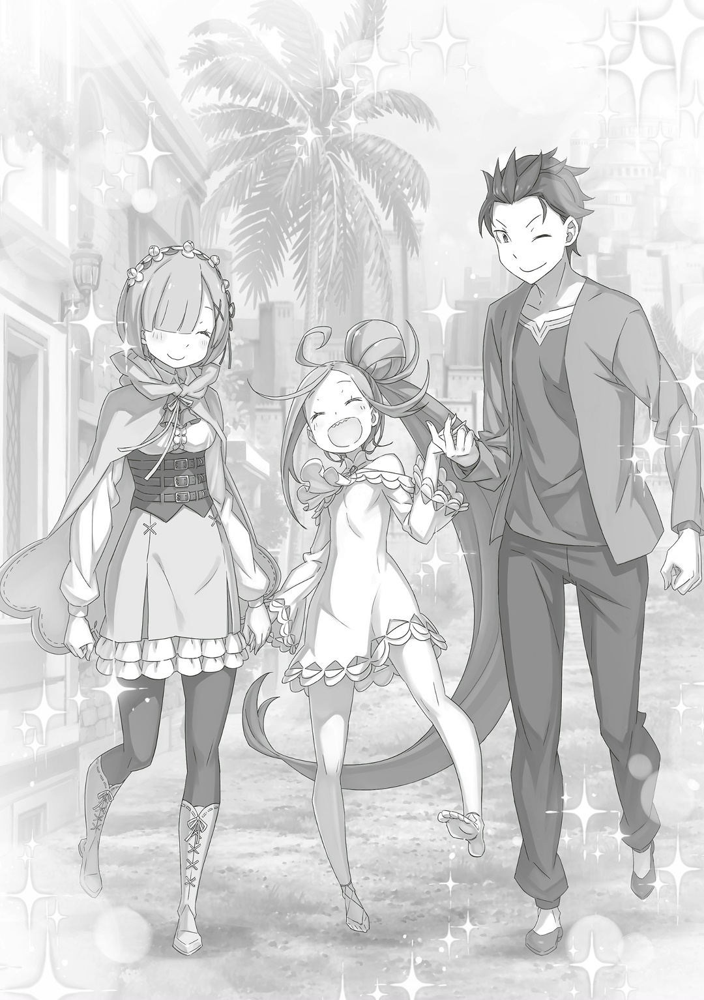

…Ее голубые глаза наблюдали за множеством чужих выборов.

Родившись из пустого и порожнего, она всегда тянулась к яркому свету. Греясь в его тепле, эта девочка медленно строила свою личность.

Поначалу ее старались держать подальше, но врожденная доброта помогла ей не остаться в стороне, и постепенно отношение к ней изменилось.

Со временем на нее даже начали полагаться. Ныне же все поняли, что она стала новой версией себя, отчего ей дали другое имя.

Непринятие и принятие, конфликт и согласие, вера и доверие, а затем одобрение и прощение…

Он пришел, чтобы сделать множество выборов.

Бесчисленные, безграничные, бесконечные выборы, каждый из которых был результатом его желаний. И иногда вблизи, иногда издалека, иногда преодолевая все физические и духовные преграды, она наблюдала за ним .

Но не все его решения приводили к тому, чего он хотел.

И даже так он делал все возможное, чтобы продолжать выбирать.

У нее не было никого, на кого можно было бы положиться, но она видела в нем пример для подражания. Поэтому, даже если все ее усилия не окупятся, она будет двигаться дальше.

В этом не было ничего такого: восхищаться его примером, восхищаться его образом жизни.

…Ей тоже надо было делать выборы.

Непринятие и принятие, конфликт и согласие, вера и доверие, а также одобрение и прощение — как той, кому посчастливилось испытать все это на себе, она хотела идти тем же путем.

Неважно, будь то ошибки или грубые промахи: а совершала она их много.

Не для того, чтобы замаскировать, скрыть, забыть или не замечать свои неизгладимые шрамы, а для того, чтобы помнить про них.

Не для того, чтобы быть правой, а чтобы идти к справедливости, точно так же, как он когда-то выбрал свой путь.

Чтобы его решение… Решение Нацуки Субару выбрать ее не обернулось ошибкой.

— …Вот уж не думал, что на разговор со мной попросишься именно ты.

Чтобы открыть дверь, ей понадобилось не физическое, а эмоциональное усилие. И там, за внушительным письменным столом, сидел мужчина с волосами цвета воронова крыла, который, перебирая большую стопку бумаг, заговорил с ней.

В его проницательных черных глазах читалось, что он тоже сделал множество выборов, и именно благодаря тому, что выбрал один путь из многих, он и стал тем, кем есть сейчас.

Все это было результатом его действий.

А потому…,

— Как видишь, я занят. Эта… Медиум О'Коннелл уже говорила со мной от твоего имени, так что я уделю тебе немного времени, но недолго. Если у тебя есть какое-то желание, и оно соответствует твоим заслугам, я постараюсь его выполнить. Однако…

Тут мужчина замолчал и, оторвавшись от стопки бумаг, посмотрел на нее. В глубине черных глаз Мудрого Императора мелькали сотни мыслей и идей.

И вот, глядя на ту, кто стояла у двери, он снова разомкнул свои тонкие губы, и,

— Мне нечего о нем сказать. Я не планирую его навещать, да и не должен. …Если только это не то, чего ты хочешь.

На этот вопрос девочка покачала головой.

Она хотела кое-что у него узнать, но это не касалось того, о ком он заговорил.

Скорее всего, сейчас девочка ничем не могла ему помочь. И то же самое можно было сказать и об окружающих его людях. Следовательно, причина того, что она пришла сюда, крылась в чем-то другом.

Определенно, он придет в себя и продолжит выбирать.

Девочка готовилась к тому дню, когда юноша снова встанет на ноги.

Чтобы, когда он решит встать, она тоже могла сделать правильный выбор…,

— Тогда чего же ты хочешь?

Черные глаза мужчины уставились прямо на нее, отчего на мгновение она замерла.

В этой большой Империи, пожалуй, за его решениями пристальнее всего следили три пары глаз: ее голубые, бледно-синие глаза одной доброй девушки и черные глаза мужчины напротив.

Вот почему она сейчас говорила с ним, с тем, кто прекрасно понимал всю тяжесть каждого выбора.

И…,

— …Уу!

Таким образом, рожденная из пустого и порожнего, она собралась сделать свой выбор.

△ ▼ △ ▼ △ ▼ △

…Именно тогда, когда Субару и остальные из лагеря Эмилии собрались покинуть Империю, в Волакии, где всегда было очень солнечно, с самого утра лил дождь.

— Серьезно, я ненавижу эту страну…

Климат Империи даже не удосужился отправить их домой в хорошем настроении, — Субару никогда не привыкнет к подлостям Волакии.

Но несмотря на то, что он ненавидел эту страну, люди, которых он здесь повстречал, были не такими уж и плохими.

Это, пожалуй, можно назвать лучшей стороной того времени, которое он провел в Империи, однако…

— Мистер, я перед тобой в большом долгу! Пожалуйста, будь счастлив и в Королевстве!

— О чем это ты, Флоп-сан? Должен тут только я, и мой долг растет даже сейчас. Блин, я тебе так ничем и не отплатил…

— Хахаха, не говори глупостей. Только представь, какое мы с сестрой заграбастали себе состояние, и все благодаря тебе, Мистер! И у меня, и у Медиум теперь есть вторые половинки. Прям-таки пир на весь мир!

С этими словами торговец ударил себя по груди.

Пока Субару саморазрушался, Флоп показал мужественность и получил себе Таритту. Черноволосый юноша так им восхищался.

Таритта, которую, как и ее старшую сестру Мизельду, привлекала только внешность, очаровалась добротой Флопа. Субару был рад, что все сложилось именно так.

Он благословлял Таритту и Флопа.

— Мистер, большое тебе спасибо!

— …

Когда Флоп обнял его, у Субару перехватило дыхание. Юноша неосознанно напрягся всем телом, но тут торговец заговорил своим обычным… нет, голосом еще более эмоциональным, чем обычно,

— В тот день, когда ты подошел ко мне и Медиум, с Миссис на спине, я сразу подумал, что наша встреча судьбоносна. И я не ошибся. Под далеким небом я буду желать счастья тебе и твоим близким.

— Ах…

— Если еще когда-нибудь приедешь в Империю, то не стесняйся, приходи ко мне в любое время. И наоборот, если мне доведется побывать в Королевстве, то очень хотелось бы на тебя рассчитывать, Мистер! Никогда не откажусь от твоей помощи!

Флоп О'Коннелл отпустил Субару и привычно улыбнулся, сияя так же ярко, как луч полуденного солнца.

С самой первой секунды их встречи и до сегодняшнего прощания он ни разу не терял в своей жизнерадостности, — от этого у Субару внутри все сжалось.

Первым, кого он встретил в Империи Волакия, был Император с замотанным тряпками лицом, а за ним уже шло «Племя Судрак», которое всегда находилось где-то рядом на всем его пути. …Но, несомненно, именно братом и сестрой О’Коннелл, Флопом и Медиум, Нацуки Субару был по-настоящему благословлен.

Сейчас он осознал это вновь, да еще и очень, очень сильно…,

— …Да, и тебе тоже большое спасибо, Флоп-сан! Я люблю тебя!

С улыбкой до ушей он поблагодарил его от всего сердца.

△ ▼ △ ▼ △ ▼ △

— …Не говори каждому второму «я люблю тебя». Из-за этого кажется, что ты несерьезен.

— Но я не говорю это каждому второму. Только тем, кого правда люблю.

— Вот как? Эмилии-сан и Беатрис-чан тоже?

— Беако я говорю это утром, днем и вечером, а Эмилии-тан… вот тут все сложнее… о, я же еще могу сказать это твоей старшей сестре!

— А?

— Прости, сказал на эмоциях, но все же я имел в виду то, что имел в виду.

Под пристальным взглядом ее бледно-голубых глаз Субару извинился и отступил назад.

Несмотря на то, что совсем недавно он прощался с Флопом, обстановка вокруг изменилась. И все же, даже после эмоционального прощания с другом, Субару не заплакал.

— Нельзя мне так легко лить слезы… Ведь на людях настоящий мужчина может заплакать только три раза за жизнь.

— Серьезно?

— Да, серьезно… Хм? А почему ты не спрашиваешь, что это за три раза?

— У тебя такое лицо, будто ты сейчас на коленях будешь умолять, чтобы спросили, как же с тобой тяжело…

— Слишком грубо!

Субару возмутился от столь жестоких слов, на что Рем лишь фыркнула. Однако, несмотря на всю обычность их разговора, он вздохнул с облегчением.

В последние дни между Субару, Рем и остальными чувствовалось волнение, во многом из-за проблем первого. Он заставил их сильно беспокоиться, поэтому теперь твердо решил исправить это своими поступками в будущем.

— А как насчет тебя, Рем? Как ты поговорила с Катей-сан?

— Не могу сказать, что все прошло гладко… но да. Она пообещала отправлять мне письма. Я бы тоже хотела отправить ей одно, но пока не знаю, что такого написать.

— Письмо подруге, значит? Ну, можно написать, как у тебя дела, спросить, как у нее, и все такое. Хотя сам я никогда не писал письма друзьям, поэтому не уверен.

— А нормально ли вообще писать письма по таким пустякам?

— Ну, да.

Он ответил на сомнения Рем и прикинул, о чем могла думать Катя.

Субару, который видел последние минуты жизни Тодда, так нормально и не поговорил с его невестой. Несмотря на это, Катя оставалась рядом с Рем и стала ее подругой, за что он был ей очень благодарен и желал только хорошего.

Субару был уверен, что Катя не ждала от переписки с Рем каких-то захватывающих драматических историй.

— Важно то, что вы общаетесь, и что заботитесь друг о друге. Думаю, главное показать, что даже если вы на расстоянии, у вас всегда есть место в сердцах и мыслях друг друга.

— …

— Я-я опять сморозил что-то глупое, да?

— …Нет. В кои-то веки ты сказал что-то дельное.

Рем покачала головой на неуверенный вопрос Субару. Затем, мягко улыбнувшись, она продолжила,

— Ты прав, не стоит мне так волноваться. Будь я на месте Кати-сан, то не стала бы ждать от своих писем ничего особенного. Просто знать, что письмо дошло, было бы уже достаточно.

— Вот и я о том же.

Ее ответ заставил Субару улыбнуться и показать ей большой палец вверх. Хотя Рем специально не обратила внимания на его жест, ей не было неловко, и она продолжила спокойно идти рядом с ним.

Учитывая, как сложно складывались их новые отношения в Империи, такая перемена казалась настоящим чудом.

— …

И вот, распрощавшись со многими, Субару и Рем отправились к месту назначения… там их тоже ждала особа, с которой нужно было попрощаться.

Той, с кем Субару и Рем нужно было попрощаться, оказалась…,

— …Спика.

— Е! Уау!

Она обернулась на свое имя, и лицо ее засветилось. Золотистые волосы Спики, собранные в хвост, развевались, когда она быстро побежала к Субару и Рем.

Черноволосый юноша широко раскинул руки, чтобы ее обнять…,

— Ой.

— …А? Так ты бежала к ней?!

Рем поймала Спику, когда та прыгнула к ней на руки.

«Е!», — простонала девочка. Рем сначала удивилась, но затем улыбнулась и погладила Спику по голове.

Тут Субару вздохнул и заложил руки за голову.

— Все еще цепляешься за Рем, да? А если б я сделал то же самое, то уверен, Рем посмотрела бы на меня очень, очень неприветливо.

— Ха? Так это очевидно, разве нет?

— Видишь? Вот об этом я и говорю! Спика, помоги мне!

— Уу, уу! Ау, аау!

— Смотри, а вот Спика… нет, стоп, подождите, она что, злится на меня? Спика, ты на стороне Рем? Я что, сам за себя?

Спика, все еще обнимая Рем за талию, строго взглянула на Субару. В ответ он лишь опустил плечи.

Субару почесал голову: впрочем же, такое общение Рем и Спики успокаивало его душу.

— …

Если подумать, неспокойные дни в Империи Волакия начались именно с Субару, Рем и Спики.

Они шли бок о бок, а их взаимодействие напоминало игру «камень-ножницы-бумага»: Субару был слаб против Рем, Рем — против Спики, а Спика — против Субару.

Их отношения изменились, и сегодня случится еще одна перемена.

В конце концов…,

— Но ты же не хочешь прощаться с Рем, так почему бы тебе не забыть об Империи, и не вернуться с нами в Королевство?

— Ууу!

— О, так ты наконец-то одумалась! Да-да, истину глаголишь! Я тоже думаю, что шла бы эта Империя куда подальше!

— Но она же головой качает. Не коверкай желания Спики-чан.

Рем сузила глаза и посмотрела на Субару, отчего он надул щеки и замолчал. Спика же энергично закивала с серьезным лицом.

По ее выражению было ясно, что менять свое решение она не собирается.

Субару не мог с этим смириться.

…Спика решила остаться в Волакии.

Она останется в Империи, чтобы выполнить свой долг.

Именно это и выбрала Спика, пока Субару «Спарковался» с Эскадроном Плеяд.

— Ты хочешь остаться в Волакии, чтобы с помощью «Звездного Поедания» отправить всю нежить обратно в Од Лагуну… Сама-то идея хорошая, правда.

«Ведьма» по имени Сфинкс воскресила большое количество нежити и использовала их как свое основное оружие.

Даже после того, как закончилось «Великое Бедствие», оставшаяся нежить продолжала прятаться в Империи. Спика решила, что ее долг — отправить на тот свет каждую из них.

Однако…,

— Нежить больше не оживает. Даже без «Звездного Поедания» одной победы уже достаточно, чтобы их убить. Тебе не обязательно это делать, Спика.

— Аа, ау. Уу! Уу, уу!

— Говоришь, иначе души мертвых не вернутся туда, где им место? Ну… Наверное, ты лучше меня в этом разбираешься, но ты правда уверена, что это так работает?

— Ууу!

Субару попытался ее переубедить, но Спика кивнула и показала, что уверена в своем решении.

И вот так он уже почти десять раз любыми способами старался ее переубедить, но — безуспешно.

Субару расстраивало, что Авель, с которым советовалась Спика, воспользовался его отсутствием (он «Спарковался»), и утвердил ее решение.

Конечно, даже если бы с Субару посоветовались, он не был уверен, что смог бы нормально поговорить со Спикой в своем узколобом состоянии.

Но все же…,

— Я этого не вынесу… Не вынесу того, как он всегда получает то, чего хочет, когда сам постоянно находится за кадром.

— Не думаю, что справедливо говорить, будто во всем виноват Авель-сан. Это решение Спики-чан, да и она сначала посоветовалась с Медиум-сан.

— Я знаю! Знаю, но он все равно меня бесит…!

Рем покачала головой, глядя на Субару, которым двигали эмоции.

На ее лице ясно читалось, как тяжело ей было расставаться. Рем, как и Субару, много думала о будущем Спики.

Она сильно повлияла на нынешнюю Рем, «Воспоминания» которой еще не вернулись. По правде говоря, разлука со Спикой была для нее гораздо тяжелее, чем для Субару.

И тем не менее…,

— Почему нам с тобой можно делать, что захотим, а Спике-чан нет…? Она ведь постоянно волновалась за нас.

— Рем…

Нежно поглаживая Спику по голове, Рем уважала ее решение.

В отличие от Субару, который не мог с этим смириться, она уже решила попрощаться с ней. Он восхищался решимостью Рем и, конечно же, понимал ее точку зрения.

— Но все равно это больно…

Неважно, что ему говорили: что он глупый, обидчивый, неудачливый, чрезмерно опекающий, отвратительный или жуткий, Субару все равно было больно.

Решение Спики, конечно, удивляло. Субару тоже хотел, чтобы души погибших во время «Великого Бедствия» обрели покой, но сильнее всего его беспокоило, чтобы она не попала в беду.

Прямо сейчас он хотел бы просто взять и положить всех своих близких в какую-нибудь коробку, чтобы они всегда были рядом.

— Но ни Спика, ни Рем не поместятся в мою коробку…

— …С чего это ты вдруг заговорил о коробках?

— Да какие коробки! Сейчас важней Спика, а не коробки там какие-то!

— Но ты ведь первый про это заговорил… Авель-сан подошел к этому серьезно: он выделил двух сильнейших людей Волакии для Спики-чан.

— Но Сеси хорош только в том, что он сильный! Он плохо повлияет на Спику!

Воскликнул Субару.

Спика выбрала особый путь, а Авель предложил, чтобы ей помогали Сесилус Сегмунт и Аракия.

Да с такой помощью она никогда не угодит в опасность, однако,

— Я еще не все сказал. Их минусы перевешивают плюсы. Блин, Авель будто перекинул все свои заботы на Спику.

— Не надумывай. Аракия-сан… Дух, которого она поглотила, своей силой поднимал мертвых: Авель сказал, что из-за этого она теперь чувствует, где прячется нежить…

— О, меня и Аракия когда-то травмировала! Доставала меня своей водой! Сеси, который вроде бы может общаться, но на самом деле не может, и Аракия, которая вроде бы не может общаться, и на самом деле не может… Теперь я волнуюсь еще больше! Спика! Может не надо ввязываться в плохую компанию этих чудищ…?

Тут он замолчал.

Ведь Спика внезапно прыгнула ему на грудь. Субару удивился и машинально поймал ее легкое тело, а когда посмотрел вниз, то увидел, что она смотрит прямо на него.

А затем…,

— Уау.

Спика улыбнулась: тут Субару окончательно понял, что ее не переубедит.

— …Авель, этот ублюдок. Пока я был занят, он просто пошел и договорился обо всем со Спикой. Ну какой же он подлец, подонок и гаденыш.

— Это уже слишком. Почему бы просто не сказать, что он хитрый, коварный и в общем сложная личность.

— Ну, я это только что и сказал, нет?

— …Я тоже не хочу прощаться со Спикой-чан.

Слабым, хриплым голосом он ворчал на сложившуюся ситуацию, а Рем, держа эмоции при себе, спокойно ему отвечала.

Но Субару все равно чувствовал, как тяжело ей было расставаться, да и прекрасно ее понимал, однако ничего поделать не мог. Тут он поближе притянул Спику к себе и крепко-крепко ее обнял,

— Лады, послушай, не надейся ни на Авеля, ни на Сеси. Если у тебя будут проблемы, то иди сразу к Медиум-сан и Флопу-сан. И пусть они даже письма тебе пишут.

— Уу.

— Очень важно иметь цель, но не нужно на себя слишком давить. Делай все в своем темпе. Поспешишь — людей насмешишь, а в этом мире так вообще умрешь. Вот мои золотые правила.

— Аа, уу!

— Здесь нет строгого дедлайна или фиксированной даты. Так что мы оба не знаем, когда все это закончится, но даже так… Я буду скучать и ждать.

— Уу, уу, еау, ауа, аау.

— Ты решила, как правильно использовать свою силу. Я горжусь тобой, Спика. …Мне еще работать и работать над собой, чтобы стать таким же крутым.

Он искренне так думал.

Спика решила использовать Полномочие «Чревоугодия» правильно, так, как хотела. С этой силой она залечит глубокие раны Империи.

Это был способ Спики оставить позади свое темное прошлое, оставить Луи Арнеб.

— …Уау!

Субару не был уверен, что она правильно поняла его искреннее восхищение ее примером.

Но тут Спика быстро крутанулась, выскользнула из объятий юноши, схватила его за руку и потянула за собой.

Следом она также потянулась свободной рукой к Рем и,

— Е!

— …Да, Спика-чан.

Она с улыбкой приняла руку девочки.

Спика держала руки Рем и Субару: и вот так эта троица двинулась вперед. …Хотя они провели много времени вместе, еще никогда эта троица не шла вот так, бок о бок.

Честно говоря, Субару и не думал, что такое может случиться. Но в этот последний имперский день у них получилось.

— Ууу!

В хорошем настроении Спика качалась взад-вперед, держась за руки Субару и Рем. Тут последние два встретились взглядами.

И ни с того ни с сего они засмеялись.

— Пффф. — Хихи. — Аау, уау!

Все трое заливались смехом, когда шли к месту встречи.

Так закончилась их история в Империи Волакия, начало которой они положили вместе.

△ ▼ △ ▼ △ ▼ △

— …Эту девчонку больше не будут считать Архиепископом Греха. Я снял груз с твоих плеч.

— Ты…

Когда Субару гладил шею Патраш, которая загружала в повозку багаж, удивительно небольшой, если считать все произошедшее, Император Волакии заявил об этом с самодовольным лицом.

— Прошу, не умри из-за очередного восстания и дай власти смениться хотя бы раз. Я устал туда-сюда бегать, чтобы спасать твою наглую рожу.

— Глупец, ты мне больше не нужен. Возвращайся туда, откуда пришел.

— Гаденыш…

— Впереди тебя ждет большая ноша, и в этом не может быть сомнений.

— …

Авель снова съязвил, так же естественно, как и дышал, но в его словах скрывался более глубокий смысл.

Субару беспокоился, сможет ли Император, который говорил такими сложными намеками, правильно управлять Империей, но…,

— Ну, у тебя же теперь есть Медиум-сан и остальные, так что, думаю, не пропадешь.

Услышав от «Звездочета» пророчество о «Великом Бедствии», которое начнется со смерти Винсента Волакии, Авель посвятил на подготовку к нему все свое время: он отказался даже от личных дел и отношений.

Пророчество сбылось, но не так, как ожидали. Теперь Авель будет жить Винсентом Волакией, который не зависит ни от кого и ни от чего: ему больше не нужно тратить время, чтобы подготовиться к «Великому Бедствию».

Поначалу он может быть растерян, но потом вырастет как личность и научится брать во внимание окружающих.

И в доказательство тому…,

— Что касается предыдущей темы, то эта девчонка взяла на себя большой долг. Она пообещала сделать все возможное, чтобы избавить Империю от страданий. …Она обязательно получит репутацию не хуже своей дурной славы.

— …

Авель правда хотел поддержать решение Спики остаться в Волакии.

Их история в Империи началась с трио Субару, Рем и Спики. …Авель, как первый, кто вмешался в их историю, выбрал своеобразный способ отплатить за все.

Сколько бы Субару ни говорил, в прошлом Спика все равно была Архиепископом Греха «Чревоугодия». Поэтому многие так и будут обвинять и ненавидеть ее.

То, что люди, которые относились к ней с недобром, правда были, отрицать или оставлять без внимания не стоило.

Тем не менее, если Спика стремилась обосновать свое существование, заявить, что теперь она будет другой, если она хотела, чтобы это нашло отклик, у нее не было иного выбора, кроме как работать.

…Ей нужно было сделать себе великую славу, которая перекроет ее ужасное прошлое, чтобы Спике позволили жить как Спике.

— Запомни, Нацуки Субару: Волки Меча Священной Империи Волакия никогда не забывают полученных ран — будь то раны от врагов или союзников.

— Авель…

— Если есть что сказать, говори, я слушаю. Ты и те, кто с тобой, равноценны Волкам Меча.

Субару почувствовал, что так Авель… что так Винсент Волакия, человек, который никогда не склонялся перед другими и не допускал, чтобы с ним игрались, обнажил свое сердце.

Его слова затронули самые глубины души Субару. Авель лишь кивнул в ответ.

— Это была великая услуга. …На протяжении всего своего пути и с завтрашнего дня ступай по земле твердо и уверенно.

— …Ты тоже. Блин, если что, я теперь тебе даже руку не протяну, когда ты упадешь.

— Глупец.

Его губы, когда он оскорбил Субару, сложились в улыбку, которая была другой, не такой насмешливой, как обычно.

И вот, когда он смотрел на Императора…,

— …

Тут Субару развернулся к драконьей повозке и зашагал вперед.

Император смотрел на черноволосого юношу, пока тот шел к повозке, возле которой собрались Эмилия и остальные. Когда Субару увидел всех, кто его провожал, включая, конечно же, Эскадрон Плеяд, он перевел дух.

— …

«Спарка» Субару, где он хотел загладить вину перед девятьсот тридцать одним человеком; несмотря на его мольбы разобраться с шестьюстами семьюдесятью тремя оставшимися ударами, никто из них и ухом не повел.

Теперь все они стояли здесь и смотрели на Субару, который всегда лаял, но не кусался…,

— …Ах.

…Бойцы Эскадрона Плеяд выстроились в ряд и подняли руки: их грубые ладони создали путь для Субару, словно ханамичи 5 .

Он сразу понял, для чего это было сделано, и поднял лицо. Юноша сдерживал слезы и терпел, терпел, терпел, терпел, терпел, а затем…,

— Я люблю всех вас!

Субару снова сказал то, на что жаловалась Рем, и побежал.

Он двинулся к рядам протянутых слева и справа рук, чтобы дать всем им пять. Словно шум дождя, зазвучало много хлопков.

Это были не просто хлопки: некоторые руки били Субару по телу. Те, кто знал Нацуки Шварца, толкались, пихались и сбивались в кучу, скорее всего, уже и забыв о шестистах семидесяти трех недобитых ударах «Спарки».

— Я, в своем качестве, рад.

Четыре большие руки похлопали юношу по спине.

— Благодаря тебе я, простой сын мельника, живу так, как мечтал!

Субару дал пять человеку, который был гораздо крепче, чем выглядел.

— Бля-бля-бля! Короче, спасибо тебе за все, Шварц!

Юноша дал пять хвосту ящера, чей голос дрожал, а слезы текли рекой.

— Никогда не забывай… мы… мы твои братки…!

Проходя мимо всех и каждого, он получил удар в лицо, схватился за подбородок, кивнул и сказал: «Не забуду!».

А затем…,

— …Шварц-сама.

Пробившись через толпу, он подошел к девочке в кимоно. Она ждала Субару в самом конце вместе с Йорной.

Черноволосый юноша остановился и первым делом посмотрел на госпожу Города Демонов.

— Йорна-сан, спасибо за все. А еще…

— Не нужно извиняться. Это дело между мной и этим дитем.

— …

— Ты можешь приходить к нам в гости в любое время, и мы встретим тебя с распростертыми объятиями.

Субару увидел нежную улыбку госпожи Города Демонов и кивнул.

Затем он посмотрел на девочку, стоявшую рядом с Йорной, на Танзу, и,

— Все-таки вернулась к моему старому псевдониму?

— …Просто к нему я больше привыкла, ну и вот.

— Мне тоже непривычно, когда ты зовешь меня как-то по-другому.

Субару улыбнулся и присел перед ней.

Раньше их взгляды были на одном уровне, но теперь, из-за разницы в росте, он присел на колени, чтобы поговорить с ней на одной высоте.

Танза очень, очень сильно помогла Субару в Империи.

— …В следующий раз мы точно не проиграем.

— …? Что?

— Когда-то ты наложила на меня это магическое заклинание. Благодаря ему я не сдался.

Танза моргала от удивления, пытаясь вспомнить подобные слова, но — ни в какую.

В конце концов, огромный долг благодарности, который Субару никогда не сможет ей вернуть, остался только в его голове.

И это было прекрасно. Неважно, сказали эти слова в нынешней петле или нет, это было замечательно.

Субару, без сомнения, чувствовал нескончаемую благодарность и радость, поэтому…

— Я люблю тебя, Танза.

— …Если будете так продолжать, потом пожалеете, Шварц-сама.

— Рем тоже мне такое говорила. Если бы у вас было больше времени, вы бы, наверное, хорошо поладили… хотя тогда ваших холодных взглядов стало бы еще больше!

— Пожалуйста, не волнуйтесь так… И кстати, если вы будете считать это прощанием навсегда, это может позже вас задушить, Шварц-сама.

— Хм? Что это значит?

— Очень-очень скоро узнаете.

Субару наклонил голову, но Танза не дала ему ответа.

Она лишь легонько ударила по протянутой ладони Субару и, внеся свой вклад в «Спарку» из хлопков, как и другие ее товарищи по эскадрону, нежно сжала его руку своими обеими,

— Спасибо, что позволили мне остаться под вашим присмотром дольше, чем планировалось изначально. Пожалуйста, будьте в добром здравии.

— Как много слов! Можно было и попроще это сказать!

— А вот и нет. Пожалуйста, возвращайтесь домой.

Прощаясь с холодной Танзой, Субару криво улыбнулся и погладил ее по голове.

Он принял то, что она от него не отмахнулась, и ее загадочное отношение, как прощальный подарок.

А затем…,

— Уу!

Когда он обернулся, Спика и Рем ждали его перед драконьей повозкой.

Субару уже долго говорил о том, что не может отпустить Спику. И вот он снова собирался сказать, что хочет забрать ее с собой, но внезапные объятия Спики ему помешали.

Субару крепко обнял ее в ответ и погладил по голове. Затем он посмотрел вверх и,

— Позаботься о Спике, Сеси.

— Хорошо, Босс!

Услышав ответ сильнейшего Империи, который хоть и был надежным, но сильно беспокоил, Субару дал ему финальную пятюню.

После этого черноволосый юноша развернулся.

Он окинул взглядом лица всех вокруг и тяжело вздохнул.

И тут…,

— Эй, вы все, еще увидимся! …ВИИИКТОРИ!!!

— …ВИИИКТОРИ!!! — …ВИИИКТОРИ!!!

Когда Субару поднял обе руки к небу и выкрикнул свою фирменную фразу, голоса Эскадрона Плеяд зазвучали с новой силой.

Те, кто не знал обычаев эскадрона, были возмущены такой внезапной громкостью, а сами члены Плеяд, наоборот, громко смеялись и плакали; развернулась очень шумная и нелепая сцена.

— …До самого конца ты остаешься безмерным глупцом, чья дерзость не знает границ.

И действительно, эта смехотворная сцена прощания разрослась до таких масштабов, что сам Император Волакии не смог промолчать.

△ ▼ △ ▼ △ ▼ △

— …Интересно, как же там будет наша Спика? Справится ли она без нас?

— Хватит уже об этом думать, я полагаю! Перестань, в самом деле! Полагаю, сейчас эта девушка рассуждает гораздо более здраво, чем Субару.

В драконьей повозке на обратном пути Субару положил подбородок на руку и смотрел в окно, а Беатрис, сидя у него на коленях, дергала его за щеку и ругала.

Юноша поджал губы под ее выговором, но ничего не сказал.

Она была права. Спика и правда сейчас мыслила куда яснее, чем он.

Она приняла свое прошлое как Архиепископа Греха и всерьез начала избавляться от этого позорного титула, даже если это и был грех другой «Ее», о котором она ничего не помнила.

— Ты вел себя со Спикой-чан достаточно холодно, чтобы она поняла каково это.

— О, все ясно. Хотя все сложилось как сложилось, Барусу так и остался узколобым, даже к девочке, которая к нему сильно привязалась.

— Ухх…

Прямо напротив него сестры Óни держались за руки и осыпали его язвительными высказываниями.

Их слова касались прошлых поступков Субару, и он ничего не мог им возразить. Хотя трогало видеть сестер такими дружными, ему было трудно улыбнуться.

— А лично мне ее решение очень даже нравится. Прежде всего, если бы мы взяли Спику с собой, нам бы пришлось держать ее в коробке, чтобы не нахвататься проблем…

— Мне кажется, или твоя коробка нужна для чего-то совсем другого и куда менее уютная, чем моя?

— Кто знает? В любом случае, Империя и лагерь Анастасии договорились по этому вопросу… Думаю, это лучший вариант из всех.

— До крутого меня многое не доходит, но если она порешает всех зомби, то сможет вернуться к нам? Если да, то будем надеяться, что она быстро разберется.

Субару оценил откровенность Гарфиэля, который сказал, что ждет возвращения Спики, особенно по сравнению с более строгим и реалистичным взглядом Отто.

Гарфиэль недолюбливал Архиепископов Греха, однако…,

— Крутой я тоже дрался с Капитаном и остальными, пытался вас убить. Но, как и с «Двойным Погружением Винуэра», у всех должен быть второй шанс.

— У тебя большое сердце. В отличие от кое-кого…

— Если уж на то пошло, скажу так: «большие сердца» Нацуки-сана и Гарфиэля больше напоминают бездумно распахнутые двери!

Субару и Гарфиэль стукнулись кулачками, когда Отто недовольно закричал.

Черноволосый юноша уже давно не слышал его таким громким. Освободившись от тяжести спасения Империи, Субару почувствовал себя прежним.

Конечно, это не означало, что его беспокойство о друзьях или разлука со Спикой испарились, но…,

— …Мы с тобой.

Эмилия мягко обратилась к Субару, который в задумчивости сузил глаза.

Когда он повернулся на мягкое прикосновение ее руки, то увидел нежный аметистовый взгляд полуэльфийки, от которого у него все сжалось в груди.

Никто не спрашивал Субару.

Не спрашивал, как он себя чувствует, прошла ли его печаль и прочие обычные вопросы.

Он чувствовал себя разбитым, ему было больно, он не знал, станет ли когда-нибудь лучше. Однако все вокруг понимали его чувства без слов.

— Спасибо, Эмилия. Спасибо за то, что спасла меня.

— Мхм.

— Спасибо всем. Спасибо за то, что спасли нас.

Субару поблагодарил Эмилию и всех остальных, кто пересек границу и попал в страну кровавой бойни, в Империю Волакия, чтобы спасти их.

Каждый ответил на его благодарность по-своему,

— …

Субару кое-что потерял.

То, что он потерял, больше никогда не вернется, больше никогда не покажется ему на глаза.

Это был ее образ жизни, она оставалась верна лишь самой себе . Ни разу она не поступала так, как хотел Субару или кто-либо еще. До самого конца, во всех возможных смыслах.

Может, именно поэтому, несмотря на то что он так много о ней думал…,

— …Я помню только то, что ты улыбалась.

Субару скорбел о ней , о той , кто выгравировала в его памяти свою бесстрашную и гордую душу.

Нацуки Субару оплакивал ее именно так; он смешал искреннюю благодарность и признательность за то, что она провела свои последние минуты, разговаривая с ним.

И…,

— …

Хотя Субару был благословлен товарищами, его беспокоила другая драконья повозка, которая направлялась в Королевство… лагерь покойной Присциллы и те, кто остался позади.

Пока Розвааль в той повозке, скорее всего, обсуждал будущее владений Присциллы Бариэль, Субару думал о другом.

Этим было…,

— …Ал.

Ал, который был рядом с Присциллой, когда она исчезала, и который обнимал ее до самого конца.

Пока Субару «Спарковался», а Авель с головой погружался в работу, чтобы почтить память сестры, другие тоже пытались заполнить пустоту в сердце от смерти Присциллы. Но Ал лишь сидел в своей комнате.

Он был настолько раздавлен потерей своей госпожи, что, казалось, просто исчез. Однако теперь он возвращался в Королевство.

И причиной его возращения было…,

— «…Брат, я хочу тебя кое о чем попросить. Слышал о Башне «Мудреца»? Говорят, там хранятся книги умерших. Я хочу прочитать там одну книженцию.»

— …«Книга Мертвых» Присциллы.

У Субару были противоречивые чувства: не растопчет ли это последние желания Присциллы, которая так благородно ушла из жизни?

Но он видел, как Ал прощался с Присциллой, он видел отчаяние своего друга, своего брата. Поэтому Субару хотел ему помочь.

И вот…,

— Ничего, если я снова попрошу тебя о помощи, Шаула?

Отправиться еще раз в путешествие к башне, которая находилась на краю Песчаного Моря… это было единственное, чем Субару мог помочь Алу и не прибегнуть к «Посмертному Возвращению».
