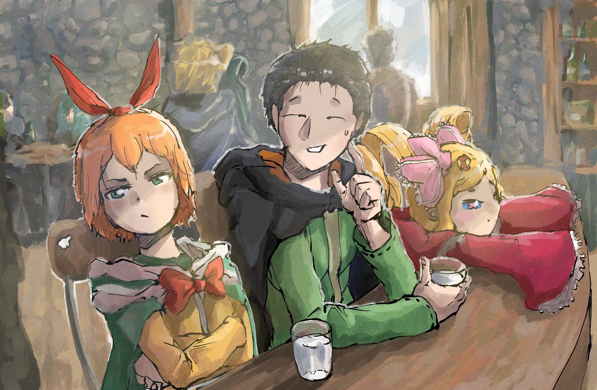

…Прошло уже почти три месяца с последнего посещения Субару «Мирулы», ближайшего города до Песчаных Дюн Аугрии.

Ранее они еще собирались заехать в него на обратном пути из Сторожевой Башни Плеяд, но с неожиданным переносом Субару в Волакию планы поменялись.

В итоге, за эти три месяца, он приезжает в этот полуразрушенный придорожный городок уже второй раз.

— Добро пожаловать в Песчаный Ветер.

Когда Субару и остальные вошли, их встретил владелец заведения, с недовольным видом потиравший очки.

Черноволосый юноша вдруг вспомнил, что в прошлый раз его встречали точно так же, а затем попытался стряхнуть с себя весь песок. Конечно, полностью избавиться от него не получилось, поэтому, приняв за неизбежное недовольство хозяина заведения, он сел за прилавок.

— Чего желаете?

— Молоко, холодное. — Молоко, теплое, я полагаю. — Молоко, я бы тоже хотела теплое.

Лицо владельца мрачнело с каждым заказом молока, но он не стал жаловаться или ругаться: хозяин молча отправился подогревать напиток, показывая, что как бы сильно ему это ни нравилось, он остается мастером своего дела.

Пока владелец заведения работал, Субару снял повязку с лица.

— Фух, в прошлый раз мы проскочили мимо «Песков Времени», но буря там до сих пор не утихает, я ее недооценил.

Когда говорил, Субару вытаскивал песок изо рта пальцами. Тут сидящая рядом с ним девушка кивнула и,

— Хоть ты и говорил, что так и будет, но мои волосы все в песке… Придется мне их потом хорошенько расчесать. А заодно и тебя причешу, Беатрис-чан.

— В самом деле, сколько раз тебе повторять? Внешность Бетти можно рисетнуть 6 по щелчку пальца, я полагаю. Забудь о Бетти и сосредоточься на себе, в самом деле.

— Да, я знаю, но у тебя такие волосы, Беатрис-чан, прям ух. За ними точно стоит поухаживать, я так хочу.

— Прекрасно тебя понимаю. Расчесывать волосы Беако это та еще адвенчура 7 .

Субару каждое утро причесывал и завязывал фирменные двойные хвостики Беатрис, поэтому его мнение здесь имело вес. Хотя ее волосы и не нуждались в уходе, все это было скорее для хорошего времяпрепровождения.

Тут Беатрис, с чьими волосами обращались как с музейным экспонатом, надулась.

— Шикарные волосы и милые щечки Бетти вам не игрушка, я полагаю.

— Про щечки мы, конечно, не говорили, но они тоже для нас как мини островок нежности, Беако.

— Их наверное так приятно тискать, да?

— Еще как!

Посмотрев на своего сторонника, выпалил Субару, после чего усадил Беатрис к себе на колени.

Та удивленно вскрикнула, но было уже слишком поздно. Не только потому, что она не могла выбраться, но и потому что два пальца уже ткнули ее щеки с разных сторон.

— Стоять, в самом деле! Мы же на людях, я полагаю! В руках-то себя нужно держать хоть иногда, в самом-то деле!

— О, помню, раньше Беако была такой стеснительной, а сейчас уже, конечно, не так сильно. Она так всего боялась, что… что ходила за мной даже в туалет.

— Это было в самом начале нашего контракта, я полагаю! Полтора года назад, в самом деле!

— Но вы так и остались очень близкими, разницы между сейчас и тогда почти нет. Я прекрасно понимаю, почему Беатрис-чан так привязана к Субару.

Тут Петра положила голову на плечо Субару. Он удивился этому, а она лишь хихикнула и посмотрела на него.

В ее-то возрасте ей особенно нужна была забота, но она всегда старалась вести себя как взрослая, поэтому не баловалась. Субару нашел это поведение милым, поэтому погладил ее вместе с Беатрис…

— Вот и ваше молоко… Что здесь происходит?

— О, уже? Хорошо, Беако, возвращайся на место~.

— Говорит Бетти вернуться на место, когда сам же ее на колени без согласия и посадил, я полагаю! Совсем берега попутал, в самом деле!

Субару взял кружку с подогретым молоком, улыбнулся озадаченному владельцу заведения, посадил Бетти рядом с собой и передал ей ее напиток.

И вот, когда ему наконец подали кружку с холодным молоком…

— О, кажись я вспомнил. Ты ж тот парень, который отправился к «Пескам Времени» с той миленькой девушкой, да?

— А, так вы меня помните? Да, это я тот парень, который заказывал молоко в прошлый раз.

— Я слышал, что кто-то все-таки добрался до Башни «Мудреца». Похоже, скоро туда поедет много людей из столицы.

— …

— У вас получилось добраться до туда?

В его тихом голосе звучали волнение и надежда.

Взгляд Субару, который только что отпил из кружки с молоком, упал на ногу владельца заведения… Там был протез. Видимо, и он тоже когда-то пытался покорить Песчаное Море.

Может, владелец заведения хотел дать Субару и его товарищам несколько дружеских советов о том, как добраться до башни. Но тут черноволосый юноша, усмехнувшись, поднял палец вверх и ответил на его вопрос:

— Да, я добрался до башни и встретил там «Мудреца». …Шумного, приставучего и милого «Мудреца». У нас появились кое-какие дела, поэтому мы собираемся вернуться туда еще раз.

Так он ответил.

△ ▼ △ ▼ △ ▼ △

…Путешествие в Песчаные Дюны Аугрии, возвращение в Сторожевую Башню Плеяд.

Оно началось по просьбе Ала, который потерял в Империи Волакия свою любимую госпожу, Присциллу Бариэль.

Он хотел найти одну «Книгу Мертвых» в Сторожевой Башне Плеяд… Ал хотел прочитать книгу умершей Присциллы и узнать, о чем она думала.

И Субару не мог отказать ему в такой искренней просьбе.

— Присцилла была бы в ярости.

Закрывая глаза, он вспоминал улыбку «Принцессы Солнца» и ее гордый характер.

Субару понимал, что то, что они хотели сделать, противоречит убеждениям Присциллы, поэтому ему, естественно, представлялся только ее сердитый и презрительный взгляд.

Тем не менее, он думал об этом и с другой стороны.

Если бы у Субару не было «Посмертного Возвращения» или «Посмертно Возвратиться» было бы нельзя, и он потерял кого-то важного, как это случилось с Присциллой, смог бы он удержаться от желания узнать последние мысли этого «кого-то»? …Этот вопрос ставил в тупик, его мысли и убеждения сразу становились бессильными.

Конечно, сам Субару не собирался читать «Книгу Мертвых» Присциллы.

Черноволосый юноша не считал, что имеет на это право, и не думал, что сможет это вынести. Так что Субару не знал наверняка, может ли Ал прочитать ее книгу.

Но если кто-то и имел на это право, то либо Авель, либо Йорна, либо Ал.

Вот почему…,

— Я помогу ему найти ее «Книгу Мертвых». Я отправлюсь с ним в башню… Это все, что я могу сделать для Ала и Присциллы.

Нетрудно было догадаться, что Присцилла не хотела бы, чтобы ее «Книгу Мертвых» читали.

Но если бы она знала, что ее смерть так сильно сломает Ала, что он совсем не сможет оправиться, возможно, она была бы не против. Может, Присцилла бы поняла, что это его способ справиться со своей болью.

Субару, который видел, как та исчезает в лучах утреннего солнца, чувствовал, что в разговоре между Алом и Присциллой был смысл.

Тем не менее…,

— Чтоб ты знал, Рам с вами не едет. Рем нужно отдохнуть, она только что вернулась домой. Если хочешь трудиться до смерти, делай это в одиночку.

Кроме Рам, которая сразу же заявила об этом, многие были против того, чтобы Субару отправился в Сторожевую Башню Плеяд вместе с Алом. Особенно возражали Отто и, что удивительно, Эмилия.

— Я согласен с Рам-сан. Не только Рем-сан, но и ты, Нацуки-сан, наверняка сильно вымотался в Империи. Я даже представить не могу, какой это был стресс и нагрузка. Может, тебе пора немного отдохнуть?

— Я ооочень хорошо понимаю, почему Субару так за него волнуется. И еще понимаю, как тяжело сейчас Алу… Но, хотя башня и не виновата, в прошлый раз Субару перенесло в Волакию, так? Если он снова туда поедет, боюсь, что его опять может куда-нибудь перенести, например, в Густеко…

Мнение Отто было осторожным, а Эмилии тревожным.

Оба они заботились о Субару, и отмахиваться от них было бы неправильно. Но сейчас было важно помочь Алу, поэтому он решил отправиться в башню.

Все, что он мог пока для них сделать, это извиниться…,

— …Гарфиэль, могу я попросить тебя об одолжении? — О, конечно, Оттобро. Да, я буду присматривать за Капитаном и остальными.

— Беатрис, держи Субару за руку и никогда не отпускай. — Само собой, в самом деле. Бетти тоже не хочет чувствовать вину, как это было тогда, когда Субару и остальных отправило в Империю, я полагаю.

Пока Субару искал слова, чтобы их убедить, Отто и Эмилия, которые должны были ему помешать, передали это дело Гарфиэлю и Беатрис. Когда черноволосый юноша удивленно на них посмотрел, они просто пожали плечами,

— Когда я узнал, как там Ал-сан, я сразу понял, что все так и будет… Но мы с Эмилией-сама должны поехать в столицу, чтобы рассказать о Присцилле-сама. Так что…

— Я говорила Беатрис и Гарфиэлю, что тоже хочу поехать. Я ооочень хочу с вами, но…

Взвесив на весах разума свою позицию и эмоции, Эмилия твердо решила играть собственную роль.

Как Кандидатка Королевских Выборов, она должна была сообщить о том, что по просьбе Авеля вмешалась в битву с «Великим Бедствием» в Империи Волакия, и что в этой битве погибла Присцилла.

Королевство Лугуника наверняка сильно потрясет эта новость. Это также может сильно повлиять на Королевские Выборы.

И все же…,

— Ты единственный, кто может помочь Алу, Субару, ведь ты последний, с кем говорила Присцилла. …Позаботься об Але.

При виде ее искренних аметистовых глаз у Субару пересохло во рту.

Ему было очень, очень жаль, что добрые Эмилия и Отто взяли на себя его ношу, чтобы все сложилось так, как он хотел. Воистину, как ее рыцарю, и как человеку, вовлеченному в события Империи Волакия, ему следовало поехать в столицу вместе с ней.

Субару чувствовал себя избалованным добротой окружающих.

— …Эй! А вот я точно с вами поеду.

Пока Субару, тронутый теплотой своих друзей, почти что плакал, Петра подняла руку и заговорила.

Конечно, путешествие в Сторожевую Башню Плеяд будет долгим. Нужно, чтобы кто-то присматривал за всеми в пути, да и в самой башне.

Петра, вызвавшаяся на эту роль, покраснела и энергично начала говорить,

— Я буду полезна! Сестренка Фредерика и сестренка Рам, пожалуйста, присмотрите за особняком и Эмилией-сама!

— Х-хорошо… Ты так воодушевлена.

— Да! Меня постоянно оставляли в стороне, поэтому я решила, что в этот раз ну вот точно пойду!

Хотя Фредерика и была удивлена смелым поведением Петры, она кивнула.

Субару был не против, чтобы Петра пошла с ними. Так вопрос о том, кто отправится в Сторожевую Башню Плеяд, был решен. И тут Субару в последний раз обратился к Рем.

Вернувшись из Волакии в Лугунику, он хотел медленно восстановить ее старые «Воспоминания» о прошлом в особняке Розвааля… хотя тот особняк был не таким, как предыдущий, который был полон воспоминаний о Рем.

— То, что ты будешь дальше без меня, немного грустно, но…

— Так было и тогда, когда я воссоединилась с сестрой. Но, прошу, не расстраивайся из-за этого… Ты точно едешь?

— Да. Я не могу оставить Ала одного. Ты ведь меня понимаешь?

— Понимаю. И именно поэтому ты трус.

От такого ответа Субару широко распахнул глаза.

«Что-то я переборщила», — сказала Рем, а затем склонила голову и,

— Пожалуйста, возвращайся целым и невредимым. А пока я постараюсь вспоминать как можно меньше, чтобы ты не расстраивался.

— Нет, не нужно… Я не хочу вмешиваться в твои дела, Рем.

— Думаю, у тебя так не получится. …Потому что я знаю, что все, что ты делаешь, так или иначе влияет на меня.

Она надавила на его грудь, поэтому Субару не смог ничего сказать.

Затем Рем посмотрела на него, высунула язык и весело улыбнулась, как бы говоря, что она его поймала. Это еще больше заставило Субару потерять дар речи.

…Именно так Рем и остальные подталкивали Субару вперед. Время шло, а он все не менялся.

△ ▼ △ ▼ △ ▼ △

…И вот, в этот день они снова прибыли в город рядом с Песчаными Дюнами Аугрии.

У Субару заныло в груди, когда он вспомнил всех, кто отправил его в путь, и даже смотрителя башни, с которым он попрощался после первой попытки бросить ей вызов.

Когда владелец заведения узнал о том, что они все-таки добрались до башни, он просто опустил глаза.

— Унк? Эй, Унк?

— …

Субару, опасаясь реакции владельца заведения, окликнул его, но безрезультатно. Тогда черноволосый юноша посмотрел на Беатрис, чтобы узнать, не сделал ли он что-то неосторожное.

Но она лишь покачала головой и,

— Ничего такого, я полагаю. Просто у тебя усы все в молоке, в самом деле.

— АА! Почему ты раньше не сказала? А я тут выпендривался, значит, такой!

— Это было круто. А еще мило.

— Эмилия-тан — единственная, кому, я думаю, подходят эти слова…

Милая и крутая — именно так можно описать Эмилию, когда у нее хорошее настроение. Обычные люди могли быть или милыми, или крутыми. Но она была чудовищной красавицей, сочетающей в себе аж два эти качества.

Как бы то ни было…,

— Вот, значит, как. Вот, значит, как…

Отстранившись от Субару, который суетливо вытирал верхнюю губу, владелец заведения бормотал что-то себе под нос. Затем он потер глаза и с силой ударил кулаком по прилавку,

— Хорош, мужик, это жестко, ты молодчина просто! Значит, угощать тебя сегодня надо!

— Реально!? Просто я хотел много чего у тебя купить, чтобы нормально переправиться через Песчаное Море, так что давай-ка мне сюда всю еду в баре!

—Ээ, а ты здесь губу не раскатывай, а!

— Блин, а я знал, знал, что так и будет, ну почемууу!

Субару весело рассмеялся вместе с владельцем. Но тут хозяин заведения озадаченно посмотрел на девушек, которых привел с собой черноволосый юноша.

Видя, что Эмилии здесь нет, владелец заведения, должно быть, засомневался. Это было очевидно, однако…,

— К сожалению, та девушка сейчас не с нами, но она благополучно вернулась домой.

— О как. Если с ней все в порядке, то хорошо, однако… похоже, у тебя еще более ненадежная компашка, чем в прошлый раз.

— Бетти хочет, чтобы вы знали, что она тоже была тут в прошлый раз, я полагаю. Просто она ухаживала за другими и не смогла прийти сюда, в самом деле.

— А я здесь новенькая, но не собираюсь отставать от сестренки Эмилии.

— Ого, какая уверенность в себе. Надежнейшая у меня компания, не наговаривай мне тут.

Субару, который давно не гладил ее по голове, протянул руку к гордо выпятившей грудь девушке. Но вдруг ее рука его остановила.

Тогда девушка… Петра посмотрела удивленному Субару прямо в глаза.

— Субару, ты что, пытался меня сейчас погладить?

— Э? Да, но… значит, ты против?

— …Я не против, но могу я тебя кое о чем спросить? Субару, ты тоже гладишь по голове сестренку Эмилию и сестренку Рем?

На этот серьезный вопрос Субару несколько раз удивленно моргнул и задумался. Он вспомнил, что гладил Эмилию и Рем по голове, хотя сейчас, если бы он попытался сделать это с нынешней Рем, то рисковал бы вывихнуть руку. К тому же, даже просто подумать о том, чтобы погладить Эмилию по голове, было очень сложно.

— Нет, этих двоих я по разным причинам не глажу.

— Тогда и меня не гладь.

— Ты серьезно!?

— Да.

Субару был в шоке. Он не ожидал, что Петра может стать такой бунтаркой.

Когда Беатрис увидела Субару в таком подавленном состоянии, она сказала: «Ну и дела, я полагаю» и, пожав плечами, добавила,

— Тогда ты можешь погладить Бетти, в самом деле. Сколько хочешь, я полагаю.

— Ух~, пожалуйста, теперь всегда разрешай мне гладить Беако сколько хочу.

— Хехе, зависит от того, как Субару себя будет вести, в самом деле. Впредь гладь аккуратнее, чтобы Бетти не обижалась, я полагаю.

— Ну и высокую планку же ты задрала! Но я ее осилю…!

Субару сосредоточился на кончиках своих пальцев и протянул к ней руку. От его мягкого прикосновения, Беатрис издала «Ой» и,

— Н-ну… пойдет… скорее даже хорошо? Прямо-таки хорошо, я полагаю? Подумать только, в самом деле, в тебе скрывался такой большой потенциал!

— Как глупо, Беако. Разлука только укрепляет любовь, знаешь ли.

— Я тоже так думаю. Разлука и правда ее укрепляет, да?

— Петра-сан? Здесь есть какой-то скрытый смысл…?

Пока Субару богоподобно гладил голову Беатрис, Петра пристально посмотрела на него и подвинула свой стул поближе. Она сделала вид, будто бы не понимает, о чем речь, и спросила: «А что, есть?», отчего он вздрогнул.

— Что ж, вижу, компашка у вас веселая. Но не думаю, что это хорошо. Если в первый раз у вас все получилось, это не значит, что во второй раз можно вести себя так, будто это легкая прогулка.

— Да, знаю. Самой большой угрозы — стрелка в откровенной одежде — больше нет, но даже так Песчаный Ветер и Зверодемоны все еще тут как тут. К слову, в прошлый раз Унк дал нам хороший эдвайс о птицах: что они летят к башне! Это нам очень помогло.

— Я рад… Значит, ты готов к тому, что тебя ждет. И что же ты собираешься делать дальше?

— Контрмеры.

Если кто-то решит покорить Песчаные Дюны Аугрии, ему придется столкнуться с тремя препятствиями: Песчаным Ветром, который усиливается от «Песков Времени»; Песчаным Морем, в котором живут свирепые Зверодемоны; и Шаулой, которую уже не нужно было бояться.

Таким образом, главное препятствие на пути: Зверодемоны. Их придется победить, чтобы справиться с «Песками Времени»…,

— Боже, это место, как всегда, завалено пес~ком.

Субару и остальные услышали у входа недовольный голос, а также шум сметаемого песка. Они обернулись и увидели ту, кого так ждали. Это была девушка в черном платье и с волосами, заплетенными в три пряди.

Заметив на себе взгляды Субару и остальных, она на секунду удивилась, а затем улыбнулась и,

— Эй, Братец, значит, ты добрался, да? И Петра-чан с Беатрис-чан тоже здесь. Рада вас вид~еть.

Сказав это, девушка… Мейли Портрут махнула рукой, и из ее волос выпрыгнул маленький скорпион, который сразу же завилял хвостом.

Именно так Мейли и маленький багровый скорпион встретили долгожданное воссоединение с Субару и остальными, которые вернулись в Королевство Лугуника.

Тут черноволосый юноша улыбнулся владельцу заведения за прилавком и сказал,

— Эта девушка — наш главный помощник в покорении Песчаных Дюн Аугрии.

— Получается, черноволосый юноша, у которого не все дома, и три маленькие девочки… Может, добраться до Башни «Мудреца» не так сложно, как я думал?

Субару почесал щеку одной рукой, а другой погладил Беатрис. Он обдумывал слова владельца заведения. Однако такая реакция казалась ему вполне естественной, ведь их группа и правда была довольно необычной.
