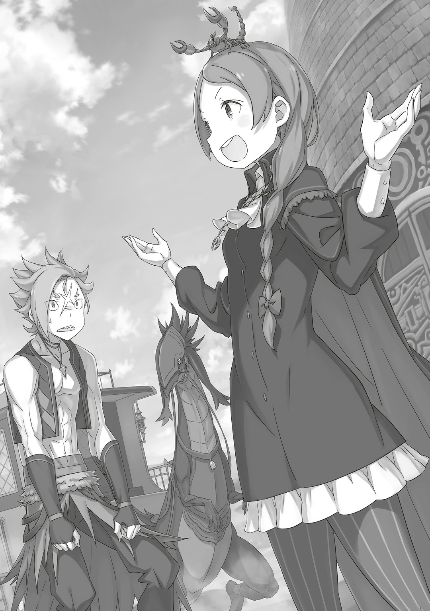

— Ясне~нько. Синеволосая сестрица очнулась? Братец, ты ведь очень-очень за нее волновался, да, значит тебе сейчас ле~гче?

— Ага, я все еще помню то чувство, когда Рем открыла глаза. Блин, да я хорошо помню даже то, как она мне пальцы сломала.

— …Э~й, Петра-чан. По-моему, братец стал еще более чудаковатым, чем ра~ньше.

— Ну, много всего произошло. Долгая история, но однажды он даже переоделся в девушку, а еще уменьшился до размеров Беатрис…

— Че~го?

Мейли, которая только-только к ним пришла, с озадаченным видом облокотилась на стойку и подперла подбородок рукой.

Субару хотелось пожаловаться на то, что его считают чудаком. Но Мейли услышала лишь краткое описание его приключений в Империи, а потому ее реакция была вполне понятной. Связь между тем, что было раньше, и тем, что происходит сейчас, казалась неясной, отчего даже ему захотелось почесать голову.

— Ну, если мне дадут все рассказать, то тогда это не будет звучать так бредово.

— …Серьезно, я полагаю? А вот Бетти слушала всю историю с самого начала, и на части с переодеванием совсем-совсем потеряла нить происходящего, в самом деле.

— Как, почему? Это вообще-то было закономерно, логичнейше я бы даже сказал…

Почему-то операцию по захвату Города-крепости совсем не поняли, хотя результаты ясно показывали, что переодевание Субару, Авеля и Флопа в женщин оказалось удачным решением.

Черноволосый юноша протестовал, но ни Беатрис, ни Петра, ни Мейли, которая пила холодное молоко, не были особо заинтересованы.

В любом случае…,

— Бл~ин, значит, хотите снова по башне погулять… Братец, ты же ведь не собираешься опять куда-то пропасть и оставить Петру-чан одну-одине~шеньку?

— Мы уже не раз говорили об этом… Ну, не то чтобы много, но говорили. Короче, я думаю, что меня больше не должно никуда перенести.

— Как-то мне от этих слов не легче…

Увидев обеспокоенные взгляды девочек, Субару поправил руку, которой держал Беатрис… к слову, Мейли находилась на ее месте. С одной стороны сидела Петра, Мейли с другой, а Беатрис была у него на коленях. Он на мгновение задумался о том, что делать дальше.

…Субару оказался в Империи Волакия из-за событий в Сторожевой Башне Плеяд.

В то время, незадолго до случившегося, в зеленой комнате башни кое-что произошло: появилась Спика, которую тогда принимали за Луи; среди суматохи дело приняло неожиданный оборот.

Этим оборотом было…,

— …Пенальти 8 за использование «Посмертного Возвращения» сработало не так, как ожидалось.

Так предположил Субару.

Он был на чаепитии у Ехидны в «Святилище» и рассказал ей о «Посмертном Возвращении». Все закончилось плохо не только из-за неприятной реакции «Ведьмы», но и из-за катастрофы в реальном мире.

Тогда он открыл Ехидне правду о «Посмертном Возвращении». Это привело к наказанию, которое накрыло и опустошило «Святилище» черной тенью. …Субару подумал, что нынешняя ситуация похожа на ту.

Луи Арнеб, которую он встретил в «Коридоре Воспоминаний» и которая узнала о «Посмертном Возвращении», вдруг оказалась в зеленой комнате.

Именно поэтому черная тень по ошибке направилась убивать свидетелей.

И в результате стычки между «Ведьмой Зависти» и «Божественным Драконом», которому было поручено защищать башню, Субару отбросило силовым полем…,

— Но это лишь догадки.

В конце концов, они так и не выяснили, почему Субару оказался в джунглях «Племени Судрак».

Неясно, было ли это случайностью или результатом действий «Ведьмы Зависти», либо же «Божественного Дракона». Однако, учитывая последующие события, Субару не верил, что это произошло по ее умыслу.

«Ведьма Зависти» потеряла его из виду, пока он не позвал ее на Острове Гладиаторов.

…Там Субару впервые назвал ее Сателлой.

С тех пор, хотя «Посмертное Возвращение» осталось прежним, он изменил свое отношение к «Ведьме Зависти».

И это изменение было…,

— …Субару? Судя по твоему взгляду, ты сейчас о чем-то очень сильно беспокоишься, я полагаю.

Беатрис в объятиях повернулась к Субару и приложила пальцы к его лбу, пока он молчал и угрюмо думал. Он не мог не улыбнуться этому прикосновению и ее словам.

— Поздновато уже думать о моем взгляде. Как правило, люди говорят о том, какое у меня страшное лицо или что-то типа того.

— Субару, твое лицо просто очаровывает, когда к нему привыкаешь, в самом деле. То, что у тебя страшное лицо, это просто бред тех, кто тебя даже не знает, я полагаю.

— Да, правильно, Беатрис-чан, ты права. Она ведь права, Мейли-чан?

— Д~а. Думаю, и ты, и Зверодемоны красивы по-своему.

— Беако и Петра слишком мягки со мной, так что мнение Мейли, пожалуй, ближе всего к правде. Я с этими глазами вообще-то восемнадцать лет живу. Ничего другого я от них уже и не жду…!

На самом деле, год опыта уже показал ему, что обычные иссекайные стереотипы об «Обратной Связи Между Красотой и Уродством» работают не так, как ты ожидаешь.

По мнению Субару, красивых людей было видно сразу, а его глаза всегда казались всем уродливыми.

— Хватит-о-моих-глазах. Ну, в общем, не стоит переживать, что меня опять куда-то занесет. Пока можно расслабиться и не бояться, что у всех снова будут проблемы, если я отправлюсь в башню.

— Яс~но. Что ж, мне все ра~вно. В конце концов, пока тебя не было, я хорошо справлялась со своими дел~ами.

— Делами… Подождите-ка, это значит…!

Глаза Петры загорелись, когда она посмотрела на Мейли, которая самодовольно улыбнулась.

Субару слышал о том, чем она занималась в Королевстве, пока он возвращался из Империи.

Мейли переговаривалась с высокопоставленными чиновниками Королевства: своей способностью она помогала им безопасно проводить людей через Песчаные Дюны к Сторожевой Башне Плеяд.

В обмен она просила прощения за свои старые преступления и средства на будущее.

— Судя по твоему тону…

— Д~а, у меня получи~лось. Я заставила этих деловых стариков… как их там называют? Совет Мудре~цов? Я заставила их пообещать мне свободу.

— У тебя получилось! У тебя получилось, Мейли-чан!

— Кьхя!

С торжественным лицом Мейли гордо поделилась своей победой, которая заставила Субару распахнуть глаза. Петра, обрадованная еще больше, чем он, потянулась, чтобы взять эту маленькую победительницу за руку.

В результате обе девочки взялись за руки прямо возле живота Беатрис,

— Я тоже, пожалуй, присоединюсь.

— Щекотно, в самом деле, но Бетти тоже не прочь поучаствовать. Ты умница, я полагаю.

Субару и Беатрис тоже приложили свои ладони: таким образом, они вчетвером взялись за руки в знак большой дружбы.

Владелец заведения по другую сторону прилавка бросил на них странный взгляд, но Субару решил не обращать на него внимания и просто насладиться моментом.

Тут Мейли тоненьким голоском сказала: «С-спасибо~…», после чего продолжила,

— В-в общ~ем, моя способность управлять Зверодемонами здесь на вес золота. Я использую ее, как ты и попросил, так что не забудь потом сказать мне спасибо.

— Ого, как дерзко. Но ладно, я не против такого. И да, я обязательно скажу спасибо. А ты, похоже, прям готовилась к этому моменту, да?

— О чем это ты? Хочешь, чтобы я снова столкнула тебя с лестницы?

Хотя Субару понимал, что так Мейли просто прятала свое смущение, воспоминания о падении с лестницы заставили заныть каждую косточку в его теле.

Однако еще больше внимания, чем Мейли, привлекла…,

— Мейли-чан? Ты про что это сейчас? Что ты натворила?

— Ах…

— Слушай, я так и не успела узнать все, что произошло, но что там случилось в башне? Ты уже извинилась за то, что дала Субару пропасть, но может, есть еще что-то, за что тебе нужно извиниться?

— Э-э~м, Петра-чан, ты меня чу-чуть пугаешь…

— Мейли-чан.

— Ииик!

Тут Петра крепко сжала руки Мейли, чтобы не дать ей уйти.

Когда последняя это поняла, то обратилась к Субару в мольбе,

— Б-братец… Братец, помоги мне…

— Прости, Мейли. Совет Мудрецов может и не замечать твои грешки, ведь ты очень важна для них, но твои друзья здесь, чтобы преподать тебе урок. И, знаешь, именно такие друзья и правда на вес золота.

— В самом деле, не нужно просто сожалеть. Из сожалений нужно извлекать уроки, я полагаю.

— Ну блииин~!

С этими словами Субару поднял Беатрис на руки, отодвинул свой стул и отошел. Петра тут же пододвинулась к Мейли, чтобы не дать ей улизнуть.

Субару и Беатрис смотрели на них и пили молоко…,

— В самом деле, молодец, что тогда спас Мейли.

— …Спасибо.

Беатрис тихо поблагодарила своего партнера. Субару нежно гладил ее по голове и смотрел за милым общением Петры и Мейли.

…Над головой плачущей Мейли щелкал клешнями маленький скорпион.

△ ▼ △ ▼ △ ▼ △

…У Гарфиэля Тинзеля был большой долг.

Он до боли чувствовал всю ответственность, которая упала на его плечи.

Его товарищи доверяли ему. Если Гарфиэль будет рядом, то Субару, Беатрис и Петра, которые отправились в Сторожевую Башню Плеяд, не окажутся в опасности.

Он понимал это и хотел показать, что они в нем не ошиблись.

— Эй, советую тебе хлебнуть воды. Здесь очень сухо из-за песка, никогда не знаешь, когда в горле может пересохнуть.

Гарфиэль обратился к Алу.

В драконьей повозке, которую тянула Патраш, сидел мужчина в шлеме и обнимал колени… он-то и был главной причиной этого путешествия к Сторожевой Башне Плеяд.

В прошлом Ал был Рыцарем Королевской Кандидатки Присциллы Бариэль. Она исчезла прямо на его глазах, поэтому, чтобы справиться с потерей своей госпожи, он хотел найти в башне ее «Книгу Мертвых».

Гарфиэль не знал, хорошо это или плохо.

— …

Когда Гарфиэль впервые услышал о «Книгах Мертвых», он сильно захотел увидеть их вживую.

Но времени обсуждать эту тему не нашлось: их главная цель тогда была спасти Субару из Империи.

Гарфиэль обожал читать книги о великих людях. В «Святилище» он часто учитывался ими до посинения. Одной из его любимых была «Легенда о Рейде Астрея» — книга, описывающая жизнь Рейда Астрея, с которым Субару и остальные встретились лично.

Когда Гарфиэль узнал, что в библиотеке, где хранятся «Книги Мертвых», собраны воспоминания о жизни не только Рейда, но и многих других легендарных личностей, его сердце замерло от волнения.

Но вот желание Ала прочитать «Книгу Мертвых» Присциллы он не поддерживал: так ему подсказывала логика.

Разве то, что ты знал человека, дает тебе право читать его «Книгу Мертвых»? Или, может, именно это и делает ее чтение чем-то неправильным? …Ни Гарфиэль, ни Субару не знали ответа на этот вопрос.

А потому…,

— Пока ты не сделаешь в башне то, что должен, не вздумай откиснуть. Эй.

Гарфиэль стиснул клыки и бросил Алу флягу с водой. Она полетела к нему и…,

— …А, да, ты прав, приятель. У меня как раз в горле пересохло.

Ал ловко поймал флягу, приподнял правой рукой челюсть шлема и аккуратно поднес горлышко к губам.

Сделав несколько глотков, он шумно выдохнул «Аххх~» и,

— О да, как освежающе. Спасибо, что обо мне заботитесь. Хотя вы, наверное, должны злиться на меня за то, что я заставил ваш лагерь разделиться.

— Да брось, ты что, совсем не врубаешься, что да как сейчас?

— Ну, плюс-минус понимаю. Думаю, в отличие от старого пьянчуги, который просто пропал неизвестно куда, я спокоен, по-настоящему спокоен.

— …

Он помахал ему пустой флягой, на что Гарфиэль тяжело вздохнул, чувствуя себя так, словно проглотил горькую ягоду.

Ал упомянул Хейнкеля. Из-за смерти Присциллы ему было очень плохо; в итоге, он пропал за несколько дней до их отъезда из Империи.

Гарфиэль пытался его найти, но в городе с тысячами душ это оказалось просто невозможно.

— Эмилии-сама тоже плохо…

Когда Хейнкель пропал, Эмилия почувствовала страшную вину.

Он слышал, что до этого она встретилась с ним по случаю, о котором Гарфиэль и остальные ничего не знали. Хейнкель тогда сильно прицепился к Эмилии, но потом пропал, так и не поговорив с ней еще раз.

Это расстраивало и Гарфиэля. …Ведь они не раз случайно пересекались, и даже вместе сражались против «Великого Бедствия».

— Эй, а ты за него не переживаешь?

— Хм? Думаю да, но это потому, что мы уже не молоды. Людям в возрасте нужно заботиться друг о друге.

— Да при чем тут возраст! Переживать о своих — это нормально. Если уж ты об этом заговорил, значит, у тебя еще есть Беатрис, Эмилия-сама и бабуля, которым уже под лет так сто!

— Хм, похоже, у брата совсем все сложно, если весь лагерь по возрасту раскладывать. А, ну… думаю, ты в общем-то прав, приятель. Просто…

— Что?

— У меня и так сейчас есть о чем подумать, извини.

С этими словами он поднял руку с флягой и опустил голову, оставив Гарфиэля в замешательстве.

Тинзелю стало стыдно за то, что он так надавил на Ала. Гарфиэль просто вылил на него свои чувства.

К тому же…,

— …Что-что, а от Капитана ты отличаешься.

Гарфиэль сузил свои изумрудно-зеленые глаза, кончиком языка проверил остроту клыков, скрытно взглянул на Ала и вспомнил, что говорил Отто.

…Смерть Присциллы оставила глубокие душевные раны у всех, но у Субару и Ала они были особенно сильны. Каждый из них справлялся с этим по-своему.

Чтобы загладить свою вину, Субару заставил товарищей, которых встретил в Империи, избить его в «Спарке».

У них получилось остановить его жалкое и безрассудное искупление, но, будь то равноценная или даже большая помощь, Алу сейчас нужно было «что-то другое».

Гарфиэль не чувствовал ничего странного в ответах Ала, но… до того, как Субару и остальные предложили сопровождать его, он собирался отправиться в башню в одиночку.

Это было равносильно самоубийству. Гарфиэль слышал от своих товарищей, насколько суровы Песчаные Дюны Аугрии. Возможно, Ал впал в такое отчаяние, что был не против погибнуть по пути в башню.

— «Я помогу ему найти ее «Книгу Мертвых». Я отправлюсь с ним в башню… Это все, что я могу сделать для Ала и Присциллы.»

Никто не остановил Субару, когда он это говорил.

Отпустить Ала одного означало бросить его умирать в песках. …Все в лагере считали, что они потеряли уже достаточно.

— Эй, разве брат с остальными не ушел по делам? Может, тебе лучше пойти к ним, приятель, ты ж тут самый сильный. А за этой повозкой я и один могу присмотреть.

— …Ты реально думаешь, что мы можем оставить типа из другого лагеря одного? Крутой я здесь, чтобы приглядывать за тобой.

— Тяжко, когда тебя держат за чужака. Мы же вроде вместе Империю спасали, нет?

И именно по этой же причине Ал потерял все, что было ему дорого.

Каждый оплакивал, отчаивался и сожалел по-своему. Гарфиэль тоже когда-то застрял в тупике, и ему ничего не оставалось, кроме как потерять надежду.

Чтобы встать на ноги, он черпал силы у Субару, Рам, Отто и всех остальных.

Теперь Гарфиэль хотел помочь другим, кто оказался в похожей ситуации.

— …Думаю, крутой я мог бы помочь и мужику.

Хейнкель, который пропал без вести, тоже должен был потерять надежду. Гарфиэль понимал, как сильно это ударило по его жизни.

Именно поэтому ему было жаль Хейнкеля, которому пришлось взвалить все на свои плечи.

— …А в повозке у вас довольно мрачно. Давяще.

Как раз в ту секунду, когда Гарфиэль об этом подумал, дверь драконьей повозки отворилась, и кто-то заговорил.

Тинзель удивленно обернулся, увидел знакомое лицо, а затем выдохнул с облегчением.

— Ты зачем так пугаешь? Крутой я уже подумал, что это «Голос Ветра Вузла».

— Прошу простить меня за мою грубость, но, если учесть ваш долг, не будет ли проблемой то, что вы не готовы к неожиданностям? Вопрос.

— Гх, это…

— Еще раз прошу простить меня за мою грубость, я просто хотел сбить вас с толку. Извинения.

С этими словами к ним вошел мужчина с худым лицом, аккуратно подстриженными темно-синими волосами и моноклем… Клинд, который приложил палец к губам и подмигнул.

Он создавал вокруг себя странную обстановку. Клинд был слугой родственницы Розвааля, Аннерозы Милоад, и не ладил со старшей сестрой Гарфиэля, Фредерикой.

Более того, именно с ним они договорились встретиться в Мируле, ближайшем к Песчаному Морю городе.

— Ты как раз вовремя, черт возьми! Где эта девчонка… где Мейли?

— Она со мной. Разумеется. Я, как дворецкий, просто делал свою работу, так что не стоит меня хвалить.

— Ты что, правда думаешь, что любой дворецкий может так просто перенести драконью повозку через всю страну?

Гарфиэль был сыт по горло Клиндом, который с величайшим почтением держал руку на груди.

Роль, которую Клинд сыграл в возвращении Субару и Рем из Империи, была настолько велика, что он мог бы даже стать самым ценным игроком, MVP лагеря.

Судя по всему, он мог использовать магию, похожую на «Пересечение Дверей», которая позволяла перемещаться в пространстве. Поэтому, чтобы тогда отправиться в Империю, Клинд был для них незаменим.

Они встретились здесь, чтобы забрать Мейли, которая была нужна для прохождения Песчаных Дюн Аугрии.

— Мейли-сама я отправил к Субару-сама и остальным. Я пришел сюда, чтобы об этом доложить. Похвала.

— Спасибо. Кстати, ты случаем не прихватил с собой Эмилию-сама или Оттобро?

— Мои извинения. Господин смог заплатить только за то, чтобы я тогда помог спасти Субару-сама и Рем-сама. Перенести Мейли-сама это меньшее, что я мог для него сделать. Откровенно.

— …Ясно. Если есть причины, значит, не буду заставлять тебя делать то, что тебе не под силу.

Клинд глубоко поклонился. Хотя его тон оставался ровным, он постоянно извинялся, казалось, у него были причины, которые от него не завесили.

Раньше Гарфиэль терял контроль, когда превращался в зверя, но он смог это побороть. Тинзель не знал, были ли у Клинда такие же проблемы, поэтому не стал делать выводы, хотя у него и был похожий опыт.

— Ну, мы не одни тут такие крутые. Эй, Ал-сан, это наш союзник Клинд, он дружит с ублюдком Розваалем.

— Хотя это очень грубо, но трудно отрицать. Меня зовут Клинд. Рад знакомству. Поклон.

Гарфиэль вспомнил про Ала, поэтому быстро представил Клинда. Дворецкий слегка улыбнулся, повернулся к мужчине в шлеме и поприветствовал его.

Гарфиэлю показалось странным, что Клинд, который долгое время работал с Розваалем, теперь отрицает, что хорошо с ним ладит, но…,

— …Ал-сама? Странно.

Тут Клинд нахмурился.

Причиной тому был Ал, который никак не отреагировал.

— …

Он молчал и пристально смотрел Клинду в глаза.

Хотя Ал носил шлем, можно было легко почувствовать его шок и замешательство.

Гарфиэль не понимал, в чем дело, а потому,

— А? Клинд, вы знакомы?

— …Нет, простите, но я его не знаю. Ал-сама, мы раньше не встречались? Уточнение.

Клинд покачал головой.

Как уже говорилось, он умел использовать особую магию и был отличным дворецким. Клинд обучил Фредерику и Рам как слуг, а также научил Субару пользоваться кнутом. Может, он и не был сильнее Гарфиэля, но его манеры показывали, что он необычный человек с большой силой.

Если Клинд ничего не помнил, значит, они точно раньше не пересекались.

А что касается Ала, то…,

— …Нет, не встречались. Это первый раз.

— …Так какого черта ты тогда молчал?

— Виноват, просто мне трудновато запоминать новые лица. …Ты сказал, что тебя зовут Клинд-сан, да? А меня — Ал. Я в большом долгу перед братом и вашими соратниками.

— Я к вашим услугам. С нетерпением жду возможности поработать с вами. Вечно.

— Вечно это как-то многовато, но да, я тоже с нетерпением жду возможности с тобой поработать.

Он махнул рукой в ответ на легкомысленные слова Клинда.

Гарфиэль почувствовал, что Ал вел себя как-то странно, но решил об этом не говорить.

— Думаю, не особо важно.

Теперь, когда Клинд привел Мейли, можно было отправиться в Песчаные Дюны Аугрии.

Сила Мейли могла отгонять Зверодемонов, но впереди было еще много препятствий, например, «Пески Времени».

Он слышал, что в прошлый раз, чтобы с ними справится, Эмилии и Юлиусу пришлось показать, на что они способны.

— Теперь время и крутому мне показать себя! Крутой я полюбасу защищу Капитана с остальными!

Прорычал Гарфиэль, стукнув кулаками перед грудью.

Внутри него крепло чувство цели и твердый дух, которые вели его вперед.

△ ▼ △ ▼ △ ▼ △

…Такой была решимость Гарфиэля, которая только разгоралась от его волнения.

— Как хор~ошо, что мы все добрались. Я рада, что ничего плохого не случи~лось.

С этими словами Мейли спрыгнула с места кучера на песок и раскинула руки, чтобы открыть огромную дверь башни.

Они без труда прошли через восточный край Песчаных Дюн Аугрии, дорогу к Сторожевой Башне Плеяд, которую не преодолел даже «Святой Меча».

— Гх…

Гарфиэль поклялся защищать своих товарищей и вроде бы должен был радоваться, но все равно недовольно шмыгнул носом.

