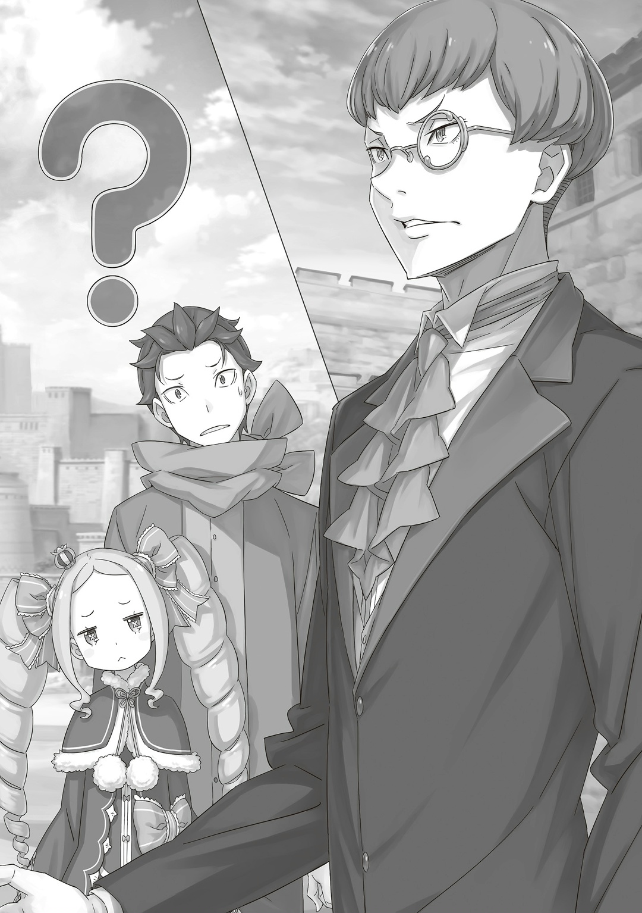
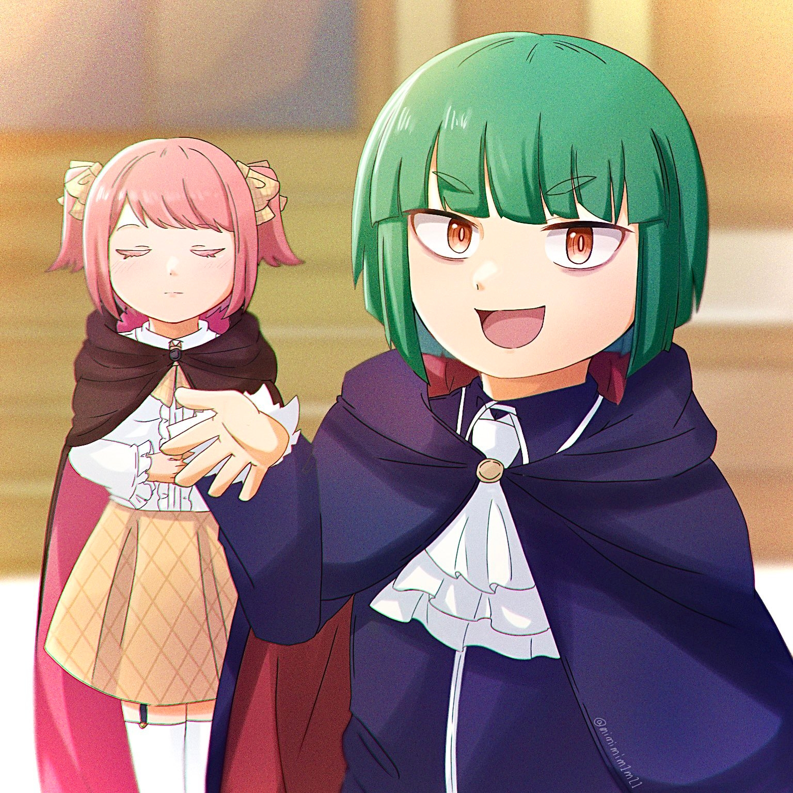
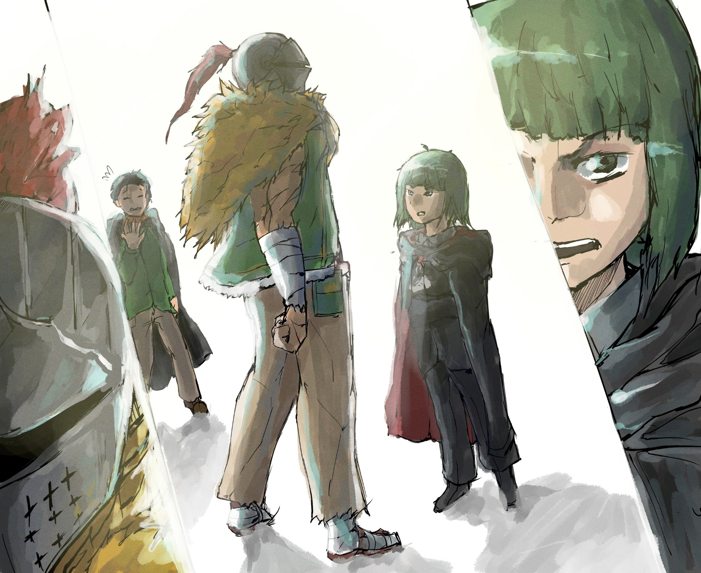

— …Я рад, что вы вернулись целым и невредимым. Облегчение.

В нескольких словах Клинд порадовался возвращению черноволосого юноши.

С тех пор как Субару стал Рыцарем Эмилии, он старался быть достойным этого звания. Именно Клинд помогал ему в тренировках, показывал, как управляться с хлыстом, а также многое-многое другое, что придало ему уверенности в себе. Его можно было считать учителем Субару в этом мире.

Хотя Клинд и работал в особняке, он держался на расстоянии от других. Но, когда он заговорил о том, что Субару вернулся домой, то коснулся его плеча и слегка улыбнулся: черноволосый юноша был так этим удивлен.

Сам Субару тоже беспокоился за Клинда, с которым, казалось, было все нормально.

— Да, конечно. Или, лучше сказать, извини. Клинд-сан, я слышал, что ты очень помог Эмилии-тан и остальным, когда они пошли за мной.

— Не стоит. Я сделал все, что мог, и получил за это хорошую плату. Приемлемо.

— Клинд-сан…

— А разве извиняться в такой ситуации не идет против норм лагеря? Вопрос.

— А?

— Если бы на вашем месте была Эмилия-сама, на которую вы равняетесь как на своего учителя, и которая растет чистой и храброй, но при этом остается по-детски доброй, что бы она сейчас сказала? Мысли.

Тут Субару задумался.

Он понимал, что Клинд говорил о ней с уважением, словно о ребенке с большим потенциалом.

Эмилия не стала бы извиняться за то, что ей помогли, а сказала бы…,

— Не «извини», а «спасибо».

— Именно. Хороший ответ.

Клинд говорил, как обычно, без улыбки и спокойно.

На это Субару слегка почесал щеку и неловко улыбнулся. Возможно, именно эта загадочность Клинда и сыграла свою роль в тяготах Аннерозе и сложных чувствах Фредерики, которую тот знал уже много лет.

Фредерика, хотя и говорила, что не любит Клинда, но часто о нем упоминала. Впрочем, переживания ее были личными и обсуждать их сейчас не стоило.

— В письме говорилось, что Фредерика будет с вами, но что-то я не вижу ее высокую фигуру. Проверка.

— Хм? А, точно. В последний момент она передумала и уехала вместе с Розваалем.

Глядя в небо, Субару ответил на вопрос Клинда.

Сейчас лагерь Эмилии разделился на группы, и каждая занималась своими делами в Королевстве Лугуника. Эмилия и Отто отправились в столицу рассказать о событиях в Империи. Рам пока осталась в особняке вместе с Рем, которая пыталась вспомнить старые места. А Розвааль и Фредерика поехали на юг… в поместье Бариэль.

После смерти Присциллы и ее мужа Лейпа владения Бариэль остались без хозяев. Могли возникнуть большие проблемы, поэтому, чтобы их избежать, Розвааль отправился туда вместе с Шультом и Фредерикой.

— Фредерика отлично ладит с детьми, и поэтому сразу понравилась Шульту, так что ей можно спокойно доверить все дела, я полагаю. А вот от одной мысли о том, что Розвааль мог поехать туда один, становится страшно, в самом деле.

— Я тебя понимаю, но не нужно так часто об этом говорить. Хотя Розвааль стал сильно мягче… Эмилия-тан попросила его помочь Шульту, и он сразу же согласился.

Как и всегда, Беатрис была очень резка в отношении Розвааля. Но в этот раз черноволосый юноша был благодарен Маркграфу за то, как он себя повел. Эмилия, которая поговорила с Шультом, пока Субару «Спарковался», тоже обрадовалась, что он взял эту ситуацию на себя.

Честно говоря, Субару задумался: может, Розвааль помогал лагерю Присциллы только для того, чтобы получить власть над их владениями? Даже если так, он все равно считал, что этот хитрый Маркграф заслуживает доверия куда больше, чем многие властолюбивые люди… по крайней мере, так Субару думал сейчас.

Если уж речь зашла о том, чтобы лезть в дела чужих лагерей, то черноволосый юноша уже давно совал свой нос куда сильнее и больше, чем Эмилия или Розвааль.

— …

Субару мысленно поблагодарил его за то, что он не сдержал своего обещания.

«Посмертное Возвращение»… хотя Розвааль и не знал, что спусковым крючком была «Смерть», он понимал, что у Субару есть сила все исправить. Поэтому после битвы в «Святилище» он сказал, что не даст ему опускать руки, когда дело дойдет до потери близких.

Розвааль пообещал, что, если Субару не сможет спасти кого-то важного, он сожжет все в адском пламени, чтобы заставить его изменить этот мир.

То была не пустая угроза или шутка, а искреннее обещание.

Однако Розвааль решил пока не делать ничего ужасного, будто бы для того, чтобы еще больше усугубить всю трагичность этой ситуации.

То ли он передумал, то ли не считал Присциллу тем человеком, ради которого мир должен перезагрузиться. Субару очень надеялся на первое.

— Вот почему Фредерика сейчас с Розваалем. Если ты так хочешь ее увидеть, Клинд-сан, то можешь просто к ним переместиться…

— К сожалению, я не могу так просто перемещаться куда захочу. Условия. А что касается Фредерики, то… Отрицание. Просто…

— Хм?

— Просто я переживал, что все могло пойти не по плану. Пустяки.

Когда Клинд сказал это и покачал головой, Субару приподнял брови.

Понять его было легко, но не всегда все должно идти по плану. Не обязательно быть готовым ко всему: нужно уметь и приспосабливаться.

Прежде всего, если бы не Фредерика, сопровождать Розвааля пришлось бы Петре. И тогда бы весь лагерь беспокоился еще больше.

Поэтому разделиться именно так было вполне нормальным.

— …

— Клинд-сан?

— …Прошу простить меня за то, что я всегда хожу вокруг да около. Спасибо. С учетом того, кто я есть, мое заявление вышло за все рамки. Беспокойство.

При этих словах Клинд склонил голову. Субару подумал, что в его поведении, когда он вот так проводит черту между собой и другими, есть что-то одинокое. Клинд всегда умел разделять свои и чужие обязанности, но…,

— Я не Розвааль и не Аннерозе, поэтому не думаю, что со мной можно переборщить. Запомни, Клинд-сан, ты один из нас.

Не зря он поблагодарил его минутой ранее.

Если кто-то пошел на такое, лишь бы тебе помочь, то кто он, если не хороший товарищ?

— Клинд-сан, мы с тобой оба на стороне храброй и милой Эмилии-тан, да?

— …Да. Подтверждаю. Однако, в отличие от вас, Субару-сама, я просто хочу посмотреть за тем, как она растет и развивается. Прямо с колыбели.

— Какая-то это большая разница между теми, кто поддерживает одну и ту же Кандидатку, пропасть, я бы даже сказал!

— А Братец бы гордился Эмилией, я полагаю.

Очевидно, что даже в их лагере были разные мнения о том, как нужно поддерживать Эмилию, хотя Беатрис высказалась наиболее здраво.

В любом случае, Клинд проделал большой путь с Мейли, которая нужна была им для того, чтобы пройти Песчаные Дюны Аугрии.

— И куда ты теперь, Клинд-сан?

— Хотя это касается жизни моей госпожи, я уже давно не могу сосредоточиться на своих обязанностях дворецкого. Самокопание. Когда Господин и Эмилия-сама вернутся домой, у них наверняка снова будет много дел. Поэтому я бы хотел оставить вас на Фредерику и вернуться обратно… Мысли.

Клинд сузил глаза: через его монокль было видно беспокойство.

Он думал о своей госпоже, Аннерозе.

Несмотря на свой юный возраст, Аннерозе уже была настоящей аристократкой. Однако она могла оказаться в опасности в любой момент. Клинду, как ее дворецкому, наверняка было не по себе оставлять ее так надолго.

Вот почему…,

— …У нас все схвачено, Клинд-сан. Петра надежна. Гарфиэль рядом. Ты можешь возвращаться к Аннерозе.

△ ▼ △ ▼ △ ▼ △

После этого Субару и его группа отправились покорять Песчаные Дюны Аугрии с Мейли на борту, и, хотя они справились со всем на ура…,

— …Серьезно, крутой я вообще себя не показал.

— Ну, я сказал Клинду-сан, что все у нас будет хорошо, и мы попрощались, поэтому, если бы у нас реально возникли проблемы, ему бы поплохело. Думаю, к лучшему, что ничего не случилось.

— Это да. Я врубаюсь, что для нас это шик. Но все же, крутой я так хотел показать возможности, и что теперь?

Грустный Гарфиэль стоял у входа в Сторожевую Башню Плеяд.

Под порывами Песчаного Ветра он совсем уж сгорбился. И тут Мейли, самая незаменимая фигура, чтобы пройти Песчаное Море, скрестила руки на груди и надула щеки.

— Че~го это ты? Ну, моей вины здесь не~т. Если клыкастый братец так хочет покрасоваться своей силой, то, может, пусть он сам один кружок по пескам сде~лает?

— Мейли-чан, не надо его провоцировать! Прости, Гарф-сан. Мейли-чан не со зла это. Она просто не знает, когда нужно держать рот на замке…

— Петра-чан так жес~тока…

Когда вмешалась Петра, Мейли пришлось забрать свои слова назад.

Но не только разговор в Мирульском баре был тому причиной; просто в отношениях между этими двумя Петра почему-то оказалась выше всех.

— Может, это из-за разницы между тем, кто кормит, и тем, кого кормят?

— Вряд ли, в самом деле. Найти в особняке кого-то, кто мог бы посоперничать с Петрой, — это очень сложно, я полагаю. Может, только Эмилия и Рам, в самом деле.

— Эмилия-тан сильна от природы, а Рам сильна просто так.

Субару кивнул Беатрис, как бы соглашаясь с ее мнением.

Они точно знали, что никогда не победят Петру.

— Что-то мне не очень хорошо от того, что я сюда вернулся.

При виде величественной башни в сердце Субару появилась тупая ноющая боль.

В Империю Волакия он попал именно отсюда, и хотя многое произошло с тех пор, здесь по счастливой случайности оказалась Спика.

Однако больше всего сердце Субару сейчас болело из-за той, кого он потерял.

— …

Шаула. …Она была первой, кого Нацуки Субару не смог спасти.

К этому добавилась и Присцилла. Хотя Субару должен был понимать, что «Посмертное Возвращение» не всесильно, он все равно до боли осознал это еще раз.

Никогда больше он не хотел получать такие душевные раны.

— Теперь можно спокойно выдохнуть, я полагаю. Все-таки проходить через все это, чтобы попасть в башню, так тяжело, в самом деле.

Беатрис, чувствуя настроение Субару, ведь они держались за руки, решила не говорить о его чувствах. Черноволосый юноша кивнул ей и сказал: «Да».

Сторожевая Башня Плеяд была видна даже с Мирулы. Плотность облаков и пыли вокруг нее сильно уменьшилась, поэтому страха потерять башню из виду уже почти не было.

Конечно, Песчаный Ветер уже не мог стать сильнее. Но теперь, когда он уже покорил его однажды и знал, как искривляется пространство в «Песках Времени», он с нетерпением ждал того, чтобы показать свое мастерство.

— Гарфиэль нам очень помог, когда следил за повозкой и проверял скалы с долинами, но он все равно расстроился, я полагаю.

— То, что мы избежали бед, полностью заслуга Гарфиэля. Но даже так ему нужно над собой немного поработать, чтобы постоянно не думать, что он плохо справился, раз не смог поработать мускулами.

Если перечислять тех, кто больше всего помог преодолеть Песчаное Море, Гарфиэль точно вошел бы в тройку лучших. Конечно, на первом месте была Мейли, а на втором…,

— Извини, что постоянно беру тебя во всякие опасности, Патраш. Твоя стамина 9 и то, что ты умеешь прорываться вперед, выручали меня уже много-много раз.

— …Додогюююн.

Когда Субару окликнул Патраш, она завыла, будто говоря, что это само собой.

В Империи Волакия и в очередной раз на пути к Сторожевой Башне Плеяд она была просто незаменима для их команды.

Путешествие продолжалось долго, и времени на отдых не было. Поэтому, как только они вернутся в особняк и у них найдется время отдохнуть, нужно будет поблагодарить Патраш: расчесать ее, сводить на прогулку или что-то еще.

И вот, пока Субару и остальные радовались, что добрались…,

— О…

Выйдя из драконьей повозки вслед за Субару и остальными, Ал спокойно посмотрел на башню и что-то прохрипел.

От мимолетных эмоций в голосе Ала Субару почти напряг щеки, но быстро ущипнул их пальцами, чтобы не выдать себя.

За все это путешествие Субару старался не волноваться и не слишком серьезничать перед Алом. Цель их поездки была такой, какая она есть. И хотя было сложно вести себя так, будто ничего особенного не происходит, с Алом он хотел не избегать серьезных тем.

Будь даже ситуация совсем-совсем другой, Субару думал бы точно так же.

— Вот и Сторожевая Башня Плеяд. Может, в дороге было немного тесновато, но я рад, что мы добрались.

Затем Субару погладил щеку, которую ущипнул, и обратился к Алу. Тут мужчина в шлеме снова взглянул на башню и,

— …Мне не было тесно. Все очень заботились обо мне, так что, хотя я и был обузой, мы добрались без проблем.

— Ты не обуза.

— Ах, виноват, виноват, здесь не было сарказма или иронии. А, черт… ляпнул лишнего. И так себя ведет взрослый человек, м-да уж.

Ал медленно покачал головой и коснулся лба шлема. Черноволосый юноша, который понимал, как тому сейчас было тяжело, не мог подобрать нужных слов.

Как Субару переживал за Ала, так и Ал переживал за Субару и всех остальных.

Даже если человек попытается скрыть, что ему плохо, на самом деле он все равно будет расстроен: притворство не лечит. В итоге он может начать говорить лишнего.

— В самом деле, никто не думает, что ты обуза. Полагаю, у всех бывают плохие дни. Просто главное в этом не утонуть, в самом деле.

— …Блин. Прям за душу берет. Спасибо, Беако-чан.

— …Так ко мне обращаться может только Субару, я полагаю. В следующий раз будь повнимательнее, в самом деле.

Беатрис раздраженно ответила Алу, а Субару погладил ее по голове.

Затем он направился к Гарфиэлю и остальным, которые хотели открыть главные ворота башни…,

— …Спасибо, брат.

Ал поблагодарил Субару, отчего тот на мгновение остановился, но затем просто махнул рукой через плечо и пошел дальше вместе с Беатрис.

У Субару было много сомнений по поводу того, правильно ли было ехать в Сторожевую Башню Плеяд, особенно касаемо поисков «Книги Мертвых» Присциллы.

Но, прежде чем думать о том, найдут они ее «Книгу Мертвых» или нет, одно он знал точно: его беспокойство за Ала было не зря.

Поэтому…,

— Субару. Эта большая дверь, как нам ее открыть?

— А, она, конечно, огромная, но не такая тяжелая, как кажется. Если я навалюсь на нее всем телом, да толкну посильнее, дверь должна немного приоткрыться.

— Ты правда так сможешь!?

— Это вр~яд ли. До этого ее открывали полуголая сестрица и Эмилия-сан… а потом и «Святой Меча».

Рядом с Петрой, которая удивленно распахнула глаза, стояла Мейли и обнимала себя за локти.

Было неожиданно слышать, как она упоминает «Святого Меча», но, очевидно, во время отсутствия Субару, чтобы получить одобрение Совета Мудрецов, Мейли вместе с Фельт и Райнхардом посетила башню.

Другими словами, это был уже третий визит Мейли сюда. Вероятно, во всем мире она занимала первое место по количеству посещений Сторожевой Башни Плеяд, и, скорее всего, в будущем ее счет будет только расти.

— Д~а, когда я пришла сюда в первый раз…

— Эй-эй, может, сразу к делу перейдем? Крутые мы еще успеем поговорить, а пока давайте уже войдем в башню. Если для того, чтобы открыть дверь, нужна сила, то вот тут-то крутой я и буду полезен…

Гарфиэль перебил Мейли, которая хотела рассказать о своих прошлых путешествиях, хрустнул костяшками и шагнул вперед. Разговор о силе его только подстегнул, и он решил, что настало время показать себя. А тут еще и Субару подбодрил его словами: «Я рассчитываю на тебя». …В эту секунду кое-что случилось.

— …А?

Гарфиэль уже собирался было поработать мускулами, как тут раздался звук скрежета камня о камень… дверь медленно открылась.

Разумеется, он опять ничего не сделал.

Напротив Гарфиэля, который разинул рот от удивления, из двери выглянул…,

— …Как вам такое, удивлены? Раз сюда будет приходить все больше людей, и еще, чтобы очистить Песчаные Дюны от миазм, я сделал новое изобретение.

Раздался уверенный и гордый голос какого-то парня.

Лицо его, полное улыбки и хвастовства, медленно, но верно открывалось взору Субару.

Это оказался зеленоволосый, аккуратно подстриженный парень в черной мантии.

— Чтобы открыть эту дверь, мое устройство пропускает небольшое, но нужное количество маны через магический круг. Оно сразу же отметает одну из главных проблем башни: неудобные ворота. И название моему творению — «Высокоэффективная Магическая Индукционная Дверь».

— …Это лишь дверь, которая открывается сама. Ее можно назвать просто и понятно: «Автоматическая Дверь».

— А!?

Когда волнение парня все нарастало и нарастало, холодный голос остудил его пыл.

Ахнув, парень… невысокий, словно ребенок, парень в мантии уставился на стоящего рядом человека, указал на него пальцем и задрожал всем телом,

— Мисс Флам! Сколько вам еще повторять? Пора бы уже запомнить. Да, мое изобретение выглядит скромно, но это новейшая технология, которая скоро будет повсюду. Вот почему мне нужно дать ему хорошее название…

— Такое трудно произнести, не говоря уже о том, чтобы запомнить. А вот «Автоматическая Дверь» хорошо подходит.

— Но это как-то несолидно…!

Рядом с парнем в мантии, который застыл на месте и распахнул глаза, медленно покачала головой девочка с розовыми волосами.

Субару поприветствовал двух примерно одинаковых по росту людей… казалось, эта пара уже и забыла про то, что нужно здороваться, поэтому он их окликнул,

— Эй, простите, что прерываю вас, но кто вы…

— Бра~тец, это Мастер-сан и Флам-чан.

Когда Субару попытался узнать, кто эти люди, вмешалась Мейли.

Судя по «мастер» и имени девочки, а также по тому, что она знала этих людей, он уже догадывался, кто они.

В прошлый раз, когда Мейли отправилась в Сторожевую Башню Плеяд вместе с Фельт и остальными, они оставили здесь людей, чтобы следить за зданием и держать связь. Значит, это был лагерь Фельт…

— Мм, Гарфиэль-доно? Давно не виделись, аж со времен Пристеллы, да? Как у вас, интересно, дела? Это я, Эццо Каднер!

— Эццо-сама сегодня такой веселый и шумный, впрочем, как и всегда.

— Я не шумный, зачем вы на меня клевещете, мисс Флам!

Сердито глядя на девочку по имени Флам, он представился: Эццо Каднер… по слухам, умный маг из лагеря Фельт.

Раз уж Эццо назвал его по имени, можно было подумать, что Гарфиэль сейчас обрадуется встрече со старым знакомым, но…,

— О-опять, опять крутой я себя не показал, опяяять.. гх…

Но он беспомощно опустил руки и поник.

△ ▼ △ ▼ △ ▼ △

— …Понятно. Я не знаю всего, что произошло, но Присцилла Бариэль-сама…

Услышав весть о смерти Присциллы, Эццо вознес безмолвную молитву.

Его молитва, чтобы дать покой душе Присциллы, была наполнена мудростью, мудростью, которую также можно было увидеть и в его юной, детской внешности, характерной для полурослика.

Как член лагеря Фельт, он, разумеется, знал о Присцилле, их сопернице; несмотря на новость о ее смерти, он сохранил спокойствие и посмотрел на Ала.

— Ал-доно, примите мои соболезнования. У меня не было случая встретиться с Присциллой-сама, но я слышал от мисс Фельт, что она — грозная соперница, с которой лучше не шутить. У нее был сильный характер. Ваша госпожа, бесспорно, была выдающейся личностью.

— …Да, спасибо, Эццо-доно.

Эццо выразил свои соболезнования, на что Ал, тише воды, ниже травы, поблагодарил его.

Незнакомец, скрывающий лицо под стальным шлемом, и парень в мантии, который, несмотря на юную внешность, показывал зрелость; хотя их разговор мог показаться странным со стороны, они были искренни.

— Ну что ж, Нацуки-доно и Гарфиэль-доно, вы приехали в сюда прямо из Империи?

— Да. Путь вышел коротким, потому что мы не заезжали в особняк, а сразу поехали в башню.

— Понятно. Должно быть, вам было нелегко расставаться со своей госпожой, Эмилией-сама. Райнхард-доно тоже всегда не хочет уходить от мисс Фельт, и это ее раздражает.

— Похоже, они ладят друг с другом, но по-своему… Хотя, подозреваю, Райнхарду доставляет видеть хмурые лица Фельт.

Фельт было удивительно плевать на Райнхарда. Возможно, для него, привыкшего к вежливому обращению, ее реакции были чем-то новым, освежающим.

Если это и правда было причиной, почему он оставался рядом с Фельт, значит, у Райнхарда весьма неплохой характер.

— Хотя причина, скорее всего, в том, что она — его драгоценная госпожа… как ты и сказал, Эццо-сан, мне было тяжело расставаться с Эмилией-тан. Просто…

С того дня, как Эмилия и все остальные отправились в Империю, прошло уже почти два месяца.

За это время вопросы по Королевским Выборам почти не продвинулись. Им нужно было срочно сообщить в столицу обо всех переменах в отношениях с Империей. …В том числе и о смерти Присциллы, что вызвало бы настоящий переполох в Королевских Выборах.

Поэтому доклад в столицу откладывать было нельзя.

В то же время нельзя было забывать и про Ала. Несмотря на его желание отправиться в башню, они его всячески удерживали.

Даже так…,

— Мы об этом особо не спорили. Честно, я слишком много хотел и просил, но они знали, что так и будет, поэтому… мне даже как-то неловко.

Эмилия и остальные уже знали, что скажет Субару, поэтому приготовили все, чтобы выполнить его просьбу как можно лучше и безопаснее.

Несмотря на все их дела, такие как доклад в столицу и вопросы с владениями Бариэль, они разрешили Субару и его группе отправиться в Сторожевую Башню Плеяд.

— Ясненько… хм-хм, значит, так все и было, да?

— …?

— А, ничего, просто сам с собой разговариваю. Это очень похоже на то, как вы оценили отношения мисс Фельт и Райнхарда-доно; по-своему. В конце концов, я даже не могу представить, что творилось в Империи.

Эццо провел пальцем по своей тонкой челюсти и кивнул.

В его манерах и поведении было что-то спокойное, поэтому неудивительно, что Мейли называла его «мастер».

В любом случае…,

— Раз мы наконец добрались до башни, пора бы и отдохнуть… именно это я и хотел бы сейчас сказать, но, думаю, здесь есть те, кто не сможет усидеть на месте, когда цель так близка. Так что не будем тянуть…

— Значит, хотите пойти в «Тайгету», хм? Разумеется, останавливать я вас не буду. Позвольте мне лишь уточнить один момент. …Ал-доно.

Субару быстро пересказал их планы и обстоятельства, а затем взглянул на вход в башню, в которой спиральная лестница вела на пять этажей вверх. Он хотел перевести разговор на тему третьего этажа, их цели, но тут Эццо прервал его, обратившись к Алу.

Когда к нему повернулся мужчина в шлеме, парень в мантии поднял один палец вверх,

— Я, конечно, не знал Присциллу-сама лично, но хочу сказать одно: по тому, что я о ней слышал, разве можно представить, что она бы хотела, чтобы вы читали ее «Книгу Мертвых»? Или, даже так, вы все равно хотите найти книгу своей покойной госпожи?

— …

— Эццо-сан…

— Я попрошу тишины, Нацуки-доно. Сейчас я спрашиваю Ала-доно. Это очень важный вопрос.

Сразу после того, как он попросил его замолчать, кончик поднятого пальца Эццо тускло засветился. Тут Субару почувствовал, что не может издать горлом ни звука. Черноволосый юноша мигом понял, что это была какая-то магия, и осознал, что тот владеет ею в совершенстве.

И вот, когда Субару силой запретили говорить, Эццо обменялся взглядом с Алом,

— Терять дорогих очень больно. Я, да и многие другие, знаем каково это. Но все не идут после этого в башню, чтобы найти «Книгу Мертвых» своего близкого. И уж тем более, если бы сам умерший этого не хотел.

То, что сказал Эццо, было резким и резонным, но могло ранить.

— …

Ал молчал. Его лицо скрывал стальной шлем, поэтому было невозможно узнать, что он сейчас чувствует.

Но было очевидно, что он страдает от большой душевной раны, что он буквально тонет в крови и боли. Субару и все остальные очень хотели ему помочь.

Именно поэтому лагерь Эмилии принял единогласное решение…

— Вы правы, Эццо-доно. Большинство сами встают на ноги после потери близких и даже не вспоминают о «Книгах Мертвых».

— Значит, вы со мной согласны. Но, похоже, вам все-таки есть что сказать.

— Да. То, о чем вы сказали… Принцесса… Присцилла, она и правда не хотела бы, чтобы кто-то читал ее «Книгу Мертвых».

— …

— Но она умерла.

От такого Субару беззвучно ахнул.

Впервые услышав, как Ал говорит о смерти Присциллы, черноволосый юноша почувствовал, словно его порезали острым лезвием.

И это была не просто боль, а ощущение, будто он терял кровь, отчего ему поплохело.

Тут Ал продолжил…,

— Присциллы больше нет. Поэтому она мне ничего не скажет.

— …Ясно.

На слова Ала, у которого, казалось, на мгновение замерло сердце, Эццо опустил глаза.

Сердце Субару окатил тот же холод… после того, как он лишился пламени, солнца, известного как Присцилла, Ал чувствовал пустоту в душе.

На лице Эццо отразились те же чувства, что и у Субару. Затем парень в мантии вздохнул и…,

— Чтобы вас проверить, я заставил вас сказать то, чего вы не хотели. Я прошу прощения.

— …Так было нужно. Рано или поздно я должен был это сказать.

Когда Ал ответил хриплым голосом, Эццо глубокомысленно кивнул.

Затем парень в мантии щелкнул пальцами и,

— Простите, Нацуки-доно. Просто я хотел поговорить с ним без голосов посторонних.

— Ах, ааах~, ааах~, мой голос вернулся… Что это только что…

— Магия Тени… так может показаться, но на самом деле это Магия Света. Вы не потеряли голос, нет, просто он был усилен настолько, что никто не смог бы его услышать. Что-то вроде ультразвука, который издают летучие мыши.

— Ты так можешь…? Я тебя недооценил. И все же…

Субару схватился за горло и посмотрел на Ала. Тут Эццо догадался, что тот хотел сказать, и заговорил: «Я понимаю»,

— В конце концов, это не мое дело, но, если бы мне что-то не понравилось, я бы его остановил. Если вопрос можно решить только так, то у меня нет выбора.

— Но все… в порядке?

— Давайте без глупостей. Каждый из вас уже по-своему с этим смирился, так? К тому же, если бы я умер, то хотел бы, чтобы люди прочитали мою «Книгу Мертвых», если захотят. Мне бы хотелось, чтобы они узнали о моей жизни и что-то да из нее вынесли.

— …

— К слову, хотя у меня не слишком чесались руки, но я прочитал уже довольно много «Книг Мертвых»! Большинство из умерших, скорее всего, задались бы вопросом, как я мог!

Спокойное и зрелое выражение лица Эццо изменилось, когда он повысил голос. Оно стало таким же уверенным, как когда он показывал «Автоматическую Дверь» башни.

Субару, хоть и удивился такой перемене, понял, что это был трюк, чтобы снять напряжение. Это придало Эццо еще больше человечности в его глазах.

По правде говоря, Субару, который только недавно вернулся из Империи, где каждый мог стать врагом, был рад встретить кого-то, с кем можно было спокойно поговорить.

В любом случае…,

— Извините, что задержал вас. Мне неловко отнимать время у Нацуки-доно и остальных, кто уже знаком с башней. Но, похоже, я бывал здесь больше всех и лучше всего знаю библиотеку. Так что я проведу вас. …Мы направляемся к главной достопримечательности Великой Библиотеки Плеяд, в «Тайгету», где хранятся «Книги Мертвых».

И вот, это время наконец-то настало: они приехали в Сторожевую Башню Плеяд.
