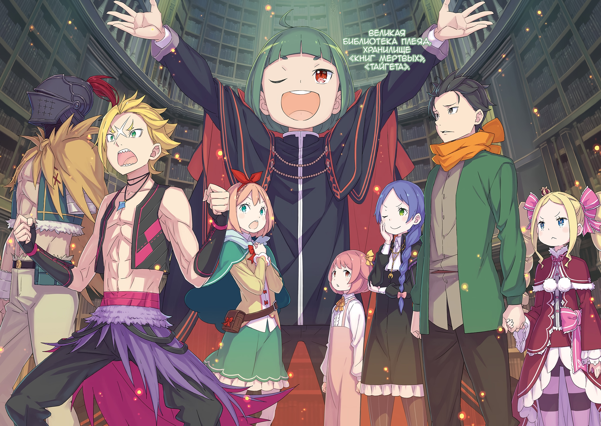
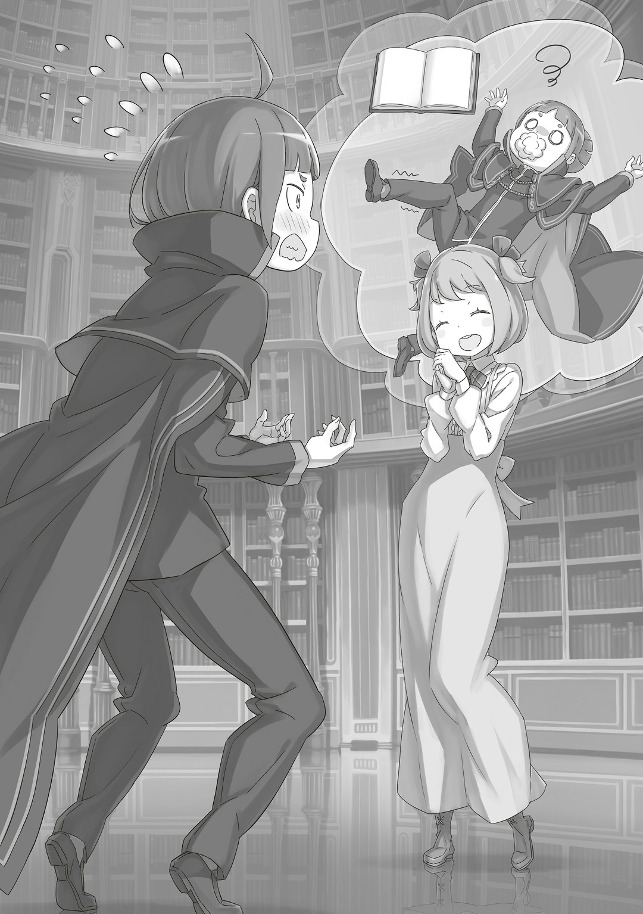

…Великая Библиотека Плеяд.

Шаула назвала это место именно так, когда впервые привела сюда Субару и остальных. Она вспомнила эти слова и объяснения, которым ее учили четыреста лет. Скорее всего, Шаула услышала это название от хозяина башни, потому что сама вряд ли придумала бы что-то подобное.

Но теперь…,

— …Великая Библиотека Плеяд, хранилище «Книг Мертвых», «Тайгета».

За спиной Эццо тянулись ряды книжных полок.

Полки окружали лестницу, ведущую вниз, и уходили во все стороны. Хотя Сторожевая Башня Плеяд была довольно большой, это место явно не могло в ней поместиться, так что, скорее всего, здесь было какое-то расширение пространства.

— Это можно было сделать с помощью Магии Тьмы, в самом деле. Но вот создать технику, которая будет держаться веками без чьего-либо контроля, это уже что-то за гранью человеческих возможностей, я полагаю.

Ответил Великий Дух на опасения Субару. Когда Беатрис увидела сложную магию башни, она, естественно, удивилась.

В любом случае…,

— …

Впервые попав в хранилище, Гарфиэль и Петра молча расширили глаза, удивленные количеством полок, точнее, книг… «Книг Мертвых». Это было ожидаемо. Когда Субару узнал, что за книги хранятся в «Тайгете», он тоже потерял дар речи.

— Это все… книги умерших людей, да?

Удивленно пробормотала Петра.

Она слегка опустила глаза, — Субару подумал, что это нормально. Петра была смелой и не раз попадала в ситуации, когда и взрослым было бы не до шуток. Она даже справилась с «Песками Времени» и Песчаным Ветром. Но «Тайгета» была слишком жутким местом, чтобы Петра могла оставаться спокойной.

— …Кх.

То же самое можно было сказать и о Гарфиэле: он оглядел все книгохранилище и выдохнул. Он был вторым членом лагеря после Эмилии, который спокойно воспринял происходящее. Гарфиэля удивило не жуткое настроение книг, а их количество. Раньше он видел много нежити в Империи Волакия. Возможно, именно воскрешение и спасение мертвецов и помогло ему сейчас. Субару волновала реакция Петры и Гарфиэля, но больше всего он беспокоился о человеке, который тоже впервые пришел в это место…,

— …

Ал вздохнул и окинул взглядом библиотеку. Он не удивился так, как Петра. Его взгляд был более спокойным, чем у Гарфиэля, но при этом в нем чувствовалось волнение. Из-за этого у Субару даже пересохло в горле.

И вот, пока черноволосый юноша мешкался…,

— …Не могу прочитать.

Ал спокойно подошел к книжной полке, взял один том и одной рукой открыл. Он даже не колебался. И поскольку все это было так естественно, Субару с запозданием среагировал «АА!» и,

— Куда-КУДА ты, стоп! Зачем так внезапно! Ты меня напугал!

— Хм… а, моя вина. Просто увидел и открыл, не подумал даже.

— Ты же даже не знаешь, как здесь все работает! Нельзя так бездумно идти все трогать, это опасно!

С этими словами Субару бросился выхватывать книгу из рук мужчины в шлеме. Он был шокирован, что все произошло так внезапно, и еще вспомнил о ситуации Ала. Во время путешествия мужчина в шлеме ничем особо не делился, скорее всего, из-за сильного желания найти «Книгу Мертвых». Субару хотел показать, что понимает его. Но это не значит, что он не будет осуждать бездумное поведение Ала.

— Я же тебе уже говорил: здешние Книги совсем-совсем другие, они гораздо опаснее, чем можно подумать. Я один раз даже чуть Мейли не стал.

— Что за шут~ки! Какой уж~ас!

Мейли повысила голос, но это была не шутка. Субару знал, какой вред могут принести «Книги Мертвых». В прошлом путешествии, когда Мейли погибла, он прочитал ее книгу. Это сильно повлияло на его разум, погрузило его в ее жизнь: в его голове даже поселилась несуществующая Мейли. Честно говоря, теперь его привязанность к ней была настолько сильной, что она часто удивлялась. Это во многом произошло из-за ее книги. Если привязанность возникает через сочувствие и понимание, то «Книги Мертвых» были отличными сватами. Но они не давали встретиться с живым человеком, поэтому такое развитие событий было возможно только для Субару.

— С этими книгами нужно быть осторожным, а то можно потерять себя.

— Потерять себя, ха… Звучит неплохо, можно попробовать разок.

— Ал…

— Шутка, просто шутка. Несмешная, никчемная шутка.

Когда Ал погружался в самоиронию, щеки Субару краснели. Он надеялся, что это поможет мужчине в шлеме встать на ноги. Субару послушал просьбу Ала и привел его в башню. Но сомнения черноволосого юноши росли. Он не знал, поможет ли это или только усугубит раны Ала.

— Нацуки-доно дал отличный совет. Гарфиэлю-доно и мисс Петре тоже нужно быть осторожнее. Ал-доно уже получил свой выговор. Если бездумно прочтете «Книгу Мертвых», ваш разум может безвозвратно пострадать.

Эццо предостерег тех, кто впервые пришел сюда. Его слова, как и слова черноволосого юноши, были полны тонкостей. Эццо, как и Субару с Юлиусом, испытал книги на себе, поэтому прекрасно знал, о чем говорит.

— Хотя на психический урон обычно не обращают внимания, ведь его не видно внешне, он может доставить кучу проблем. Исцелить его магией не получится. Кроме того, в здешних местах много миазм, что может сильно повлиять на ваше настроение. Я тут один из старших, поэтому если что-то будет не так, просто дайте знать.

— Б-большое спасибо, Эццо-сан…

— Вы замечательный старший, Эццо-сама. Как и ожидалось, вы хотели сказать, что, когда впервые прочитали «Книгу Мертвых», то описались и упали в обморок с пеной у рта.

— Мисс Флам! Вы обещали держать рот на замке!

— Когда я нашла вас таким, я была в полнейшем шоке.

Эццо пафосно ударил себя в грудь, но, когда Флам раскрыла его позор, он мигом покраснел. После того как Петру, которая секунду назад смотрела на него с восхищением, шокировала эта история, она сказала: «Эццо-сан…?». Почувствовав ее взгляд, Эццо тут же заговорил,

— Ах, нет, неправда это! Ну, может, и правда, но слова мисс Флам слишком чересчур. Да, я и правда упал в обморок, но с тех пор я понял хитрость, как читать «Книги Мертвых», поэтому больше такого не случалось!

— Хитрость? Она реально есть?

— Да! Если проще, то нужно очистить свой разум и закрыть сердце. Если настроиться именно так и отстраниться, то «Книгу Мертвых» можно будет воспринимать как книгу.

— Звучит просто, но сколько бы раз я это ни слышала, я так и не поняла, как это сделать.

Пока Флам медленно качала головой, Эццо искал поддержки у остальных. Но ни Петра, ни Гарфиэль, ни Субару, ни Беатрис, ни Мейли ничего не поняли. Эццо в шоке воскликнул: «Серьезно…!». Но если так действительно можно было защитить свой разум, было бы просто чудесно. Субару, как тот, кто читал «Книги Мертвых», понимал, насколько абсурдно это звучит. Честно говоря, даже услышав об этой хитрости, он не думал, что сможет так же.

— Понял, да? По неосторожности можно уже не оправиться. Так что прикасаться к любой книге, кроме той, которую ты ищешь…

— Мне лучше их не трогать. …Я понял. Послушаю твой совет. Но, даже без этого, благодаря брату и остальным, я без проблем добрался до башни. Я не могу жаловаться.

— …Что ж, теперь, думаю, все будет нормально.

Затем Субару вернул книгу, которую взял у Ала, на полку. Он не знал имени человека на переплете, но обращался с ней осторожно, как с надгробием. «Книги Мертвых» на ощупь напоминали надгробные камни или могильные плиты. Поэтому он испытывал странное желание не поднимать шум.

В любом случае…,

— Среди такого количества книг найти ту, что вы ищете, будет непросто. Лучше нам всем сосредоточиться на ее поисках. В конце концов, количество книг продолжает расти даже сейчас.

Эццо говорил о пути, который отличался от прохождения через Песчаное Море; это был путь через книжное море, и они не знали, где лежит их победа.

△ ▼ △ ▼ △ ▼ △

— «Я — Волканика. В соответствии с древним заветом, я прошу воли у тебя, достигшего вершины.»

Глубокий и торжественный голос раздался, потрясая души всех, кто его услышал; это был голос существа высшей расы. На фоне бескрайнего голубого неба на вершине здания восседал величественный Дракон… «Божественный Дракон» Волканика, который смотрел на шокированного Гарфиэля. Светловолосый парень уже видел одного такого Дракона. Во время недавнего «Великого Бедствия» в Империи Волакия Субару и другие доверили ему сразиться с «Облачным Драконом». Хотя Гарфиэль победил Мезорею не полностью, он гордился тем, что не проиграл. Драконы считались самыми могущественными существами в этом мире. Люди, полулюди, Зверодемоны и Духи — все меркли перед Драконами. И хотя Гарфиэль был несовершенен, сражаясь с таким существом, он чувствовал, как растет в силе.

Однако…,

— «…Ты, достигший вершины башни. Ступай на Первый Этаж, всемогущий проситель.»

Величественный, светящийся сине-белым «Божественный Дракон» Волканика отдыхал на вершине башни. Чутье подсказывало Гарфиэлю, что тот находится на совершенно ином уровне, нежели «Облачный Дракон». Хотя внешне это и не было заметно, сила между Волканикой и Мезореей была примерно, как разница между взрослым и ребенком.

— …В прошлые разы я не мог на него поглядеть, но теперь, да, прям завораживает.

Когда Субару смотрел на Дракона за спиной Гарфиэля, он чувствовал трепет. Черноволосого юношу унесло в Империю прежде, чем он успел встретиться с Волканикой в Сторожевой Башне Плеяд. Хотя Субару уже видел «Облачного Дракона», он был так же восхищен, как и Гарфиэль. А ведь Эмилия и Волканика когда-то сражались друг с другом.

— Эмилия-сама сражалась с ним… Это же полное безумие…

— В самом деле, Бетти тоже чувствовала себя будто на грани. Не только Эмилия, я полагаю, но и Субару, Рам, Анастасия и все остальные были в беде…

— Да, ты тогда очень за нас всех переживала, Беако. Спасибо тебе за все.

Субару с серьезным видом погладил Беатрис по голове. О том времени нельзя было говорить с теплотой. Ведь тогда Субару потерял память, Мейли предала их, а еще они столкнулись с «Мудрецом» и «Чревоугодием». Полнейший беспорядок.

— Если б там был крутой я, Капитана не отправили бы в полет до самой Империи…

— Хм, а звучит-то как, в самом деле. Гарфиэль, я полагаю, ты хочешь сказать, что справился бы с теми проблемами, с которыми даже мы нормально не справились?

— Гх, нет, я не об этом…

— Это одна из лучших шуток Бетти, я полагаю. Бетти знает, что ты не об этом, в самом деле.

Беатрис рассмеялась, глядя на Гарфиэля, который смутился, подумав, что, возможно, сказал что-то неосторожное. Когда светловолосый парень вздохнул с облегчением, Субару сказал: «В общем», после чего продолжил,

— Заставил я всех, конечно, поволноваться… Не скажу, что я рад этому, но, если подумать, Империя могла бы погибнуть, если бы всего этого не случилось…

— Мы не можем сказать, что все сложилось хорошо, я полагаю. Нельзя забывать про Ала, в самом деле.

— Не только он. Шульт и тот мужик тоже.

Беатрис и Гарфиэль ответили Субару, который почесывал щеку пальцем. Тут же в голове светловолосого парня возник образ разрушенного лагеря после смерти Присциллы. Хейнкель исчез, а Ал отправился за ее «Книгой Мертвых». Даже самый оптимистичный Шульт пытался взять себя в руки, но все еще был в смятении. Оставлять все это на одного Розвааля было слишком тревожно и жестоко, но Субару вздохнул с облегчением, когда Фредерика вызвалась остаться с Маркграфом. Черноволосому юноше очень хотелось бы помочь всем, одному за другим, двигаться вперед к лучшему будущему…,

— Прости, что так вышло, Капитан. Просто я очень хотел хоть раз увидеть «Божественного Дракона».

— Мне тоже было интересно, так что не извиняйся. Вполне нормально, что фанаты захотят увидеть знаменитость, если узнают, что она где-то на верхнем этаже отеля… Хотя, может, идти так и пытаться встретиться со знаменитостью это уже плохие манеры, а? Может, мы перешли черту?

— Винить вас не за что, я полагаю. А если кто-то и вправе, так это сам Дракон, в самом деле. Вот только…

— «Я — Волканика. В соответствии с древним заветом, я прошу воли у тебя, достигшего вершины.»

— Глаза и уши вас не обманывают, я полагаю.

На слова Волканики Беатрис пожала плечами. Гарфиэль сомневался, но, когда встретился с «Драконом», понял, что это правда: из-за долгого-долгого времени Волканика стал воспринимать мир вокруг расплывчато, однако его необычная аура все равно выделяла его среди всех.

В любом случае…,

— Понятно, всегда найдется кто-то покруче. Рано мне еще зазнаваться.

— …Ты сильный, Гарфиэль. Думаю, в списке самых сильных довольно быстро можно дойти до тебя, если считать от сильнейшего.

— А разве крутой я не сильнейший?

Убедившись в своем положении, Гарфиэль легонько стукнул Субару кулаком в грудь, показывая, что не обижен. Субару тихо хмыкнул от его удара и кивнул со слезами на глазах.

И вот, пока они разговаривали…,

— …О, значит, вы пошли к «Божественному Дракону».

В эту секунду к ним подошел Эццо, который поднялся по лестнице. Парень в мантии посмотрел на Гарфиэля, затем на Субару, а потом на Волканику и…,

— Понимаю. Тайны этой башни, конечно, интересны, но сам «Божественный Дракон» Волканика! Он же сыграл большую роль в создании Лугуники такой, какой мы ее знаем сегодня! Аж дух захватывает!

— Ха-ха, возможно, Эццо-сан не ожидает, но я тоже обожаю Драконов. Волканика слишком велик для такого, но стать дрэгэн райдером 10 — это одна из моих детских мечт!

— Дрэгэн райдером…!? Капитан, ты просто обязан потом рассказать об этом крутому мне!

— Хорошо. Ну, это что-то типа «Всадников Летающих Драконов» из Империи.

Гарфиэль заинтересовался незнакомыми словами Субару и кивнул. Он догадывался, что речь идет о чем-то интересном. Наблюдая за их разговором, Эццо наклонил голову и потрогал подбородок,

— Я думал обсудить Волканику с исторической или научной точки зрения, но это подождет до следующего раза. …Итак, Нацуки-доно, как и просили, я объяснил Алу-доно, что такое библиотека. Сейчас с ним осталась мисс Флам.

— Большое спасибо. С Флам-чан я еще не общался, но она очень надежная, да?

— Не переживайте. Она из тех, кто сразу скажет «нет», если ей что-то не понравится. Хотя, как слуге, мне немного обидно, что она так часто во всем отказывает…

— У нас тоже есть служанка, которая сразу же говорит «нет», если ей что-то не нравится, я полагаю.

— Ах, эт точно.

Гарфиэль и Субару переглянулись и кивнули в ответ на слова Беатрис.

Возлюбленная Гарфиэля была гордой и уверенной в себе женщиной. Она всегда ясно выражала свое мнение, несмотря на то, что была служанкой. И это нравилось Гарфиэлю. Возможно, Флам была такой же… может, женщины с персиковыми волосами все такие?

— Кстати, у мисс Флам есть сестра-близнец по имени Грассис. Они похожи не только внешне, но и по характеру, поэтому с ними ох как тяжело.

— А у вас в лагере просто куча народу: старик Ром, Без, Моз, Гов и все такое… О, кстати, Эццо-сан, а как ты вообще к Фельт попал?

— В свое время я был обязан мисс Фельт и Райнхарду-доно. Если вкратце, они мной сильно заинтересовались, и вот теперь я с ними.

— В таком случае, ты просто находка! Прям как наш Отто.

Находка — так часто говорил сам Отто.

Если говорить о схожестях Отто и Эццо, то это, пожалуй, их зеленый цвет. Правда, у первого он был в одежде, а у второго — в волосах. Похоже, все зеленые находки были надежными. Когда Гарфиэль подумал об этом, то улыбнулся.

— Кажется, вы чем-то довольны, Гарфиэль-доно.

— Ничего такого, просто мысли. Крутому мне как-то неловко слышать «-доно». «-доно~» звучит слишком громко, если ты понимаешь, о чем я.

— Да? Ну, лично мне так не кажется, но… Тогда буду звать тебя Гарфиэль-кун, я так еще Рачинса называю — Рачинс-кун — ну, и еще пару человек так же.

— Да, так и называй, мы ж ведь не в первый раз встречаемся.

Гарфиэль махнул рукой, на что Эццо кивнул и сказал: «Понял». Тут Субару посмотрел на них и сказал: «Кстати, об этом…»,

— Вы уже встречались раньше? Но когда?

— Уверен, вы помните Пристеллу… когда Культ Ведьмы напал на Город Водных Врат. Мисс Фельт позвала меня, чтобы я помогал восстанавливать город. Там мы и встретились, а, я еще и с Отто-доно знаком.

— Вот оно как значит…

— О, крутой я помню, мы тогда еще поссорились… Ну, это долгая история.

Это было, когда Субару и остальные отправились в Сторожевую Башню Плеяд. Пока Отто оставался в Пристелле, чтобы оправиться от ран, Гарфиэль помогал восстанавливать город и вытаскивать «Останки Ведьмы», запечатанные под городом. Одним из членов этой команды был Эццо… вместе с Гарфиэлем, Рикардо и, по какой-то причине, Лилианой.

— Похоже на группу, которая наворотит дел, я полагаю…

— Хотя время было непростым, я многому научился. Конечно, Гарфиэль-кун мне много раз помогал. И хоть мне неудобно говорить об этом при нем, он правда крутой парень.

— Хехе, что ты, что ты. — В самом деле, для него это пустяки.

Субару и Беатрис выглядели даже счастливее Гарфиэля, когда тот так беззастенчиво его хвалил. Светловолосый парень понимал, что Эццо не просто хороший учитель, но и отличный маг. Правда, было немного обидно, что Гарфиэль недооценил его из-за того, что рядом с ним обычно находился еще более выдающийся маг, Маркграф.

— …Ладно, укрепим нашу дружбу позже, сначала нужно разобраться с текущими делами. Пока мисс Флам приглядывает за ним, давайте поговорим про Ала-доно.

— …Ал.

— Да. Есть кое-что, что я хочу с вами обсудить… Я подозреваю, что Ал-доно хочет воскресить Присциллу Бариэль-сама, а что думаете вы?

— Что…!? — А?

На слова Эццо, который гладил подбородок, голоса Субару и Гарфиэля перекрыли друг друга. Когда он вдруг сказал слово «воскресить», светловолосый парень не сразу понял, о чем речь. В это время Беатрис удивленно расширила глаза.

— Что ты имеешь в виду, я полагаю? Воскрешение мертвых…? Если речь о «Таинстве Бессмертного Короля», то мы уже сыты этим по горло, в самом деле.

— Полагаю, вы сейчас говорите о случае в Империи, о котором я слышал лишь краем уха. «Таинство Бессмертного Короля» меня очень интригует, но я сейчас не о нем. Я про то, о чем Нацуки-доно совсем недавно говорил в шутку.

— Я…?

— …Псевдовоскрешение с помощью «Книги Мертвых» Присциллы Бариэль-сама. Думаю, Ал-доно хочет переписать себя, чтобы получилась она.

— …

Слова Эццо, лишенные каких-либо эмоций, проникали в мозг Субару. Псевдовоскрешение мертвых… для Гарфиэля это не имело смысла. Но по удивленному лицу Субару, на лбу которого выступил пот, он понял, что это не бессмыслица. Черноволосый юноша лишь молчал. И тут Эццо продолжил,

— Я прочитал двенадцать «Книг Мертвых». В первый раз я, как и сказала мисс Флам, провалился. Но если судить по ощущениям тогда… думаю, перезапись разума возможна.

— …Субару говорил, что чужие «Воспоминания» почти слились с ним воедино, я полагаю. Но мне трудно верится, что сознание того, кто читал книгу, после этого полностью пропадет, в самом деле.

— С чувством того, что твой разум сейчас с кем-то смешается, это и правда так. Но что, если читатель будет хотеть именно этого? Если он пришел с настроем исчезнуть, разве тогда его разум просто не улетучится?

— …

— Конечно, это лишь теория. Я не проверял ее на практике. Но если задуматься о мотивах человека, который ищет «Книгу Мертвых», чтобы вернуть дорогого, то именно это и приходит на ум.

Пока Эццо делился мыслями, Беатрис глубоко и нехарактерно для себя хмурила брови. Гарфиэль молчал: он напрягал каждую извилинку своего мозга, чтобы разобраться в вопросе, и думал, что уже начинает потихоньку понимать. Даже если «Книги Мертвых» были полны воспоминаниями и чувствами умерших…,

— Не получится.

— Хо, почему ты так думаешь?

— Потому что, ээ… кх, потому что, ээ, типа, как бы это сказать. Душа! Души не будет. Книга ее не даст.

В голове у Гарфиэля все перепуталось, но он скрежетнул клыками и выдал какой-никакой ответ. Ему было трудно все нормально объяснить. Но Гарфиэль понимал, что люди не могут состоять только из «Воспоминаний» и «Информации». На его ответ Эццо сузил глаза и,

— Да, я того же мнения, что и ты.

— …А?

— Что за выражение лица и голос? Вся твоя мужественность улетучилась за секунду. Соберись и успокойся.

Когда Гарфиэль выдавил из себя ответ, Эццо посмотрел на его обеспокоенное лицо. Затем он поднял палец и сказал:

— Гарфиэль-кун попал прямо в точку. Даже если все эмоции мертвого можно пережить воочию, и даже если предположить, что разум можно переписать, это все равно не будет воскрешением. Это будет рождение новой сущности, которая просто унаследует воспоминания, опыт и эмоции умершего.

— Новая сущность…

— Я не считаю, что это настоящее воскрешение. Интересно, многие ли думают так же? Вот почему я хочу разобраться. …Хочет ли Ал-доно воскресить свою госпожу? Если для этого он выбрал «Книги Мертвых», то, скорее всего, у него не получится.

— …

— Но если он хочет сохранить Присциллу-сама в своем сердце, то это уже другое дело.

Медленно покачав головой, Эццо закончил говорить. От его слов Гарфиэль заскрипел клыками и посмотрел на Субару, ведь тот должен был больше всех сочувствовать Алу. Тут черноволосый юноша задумался и,

— Я дурак? Нет, я дурак.

— Субару…

— Пока мне не сказали, я даже и не думал об этом… Я считал, что Ал просто хочет узнать, о чем думала Присцилла в свои последние минуты. И еще я надеялся, что он возьмет себя в руки, когда будет искать ее книгу…

Субару прижал кулак ко лбу и упрекнул себя за то, что даже не подумал об этом. Увидев, как он себя корит, Гарфиэль взял его за руку и сказал: «Капитан». От таких терзаний легче не будет. Гарфиэль прекрасно это понимал благодаря своему белому шраму на лбу.

— Не думаю, что вам стоит себя винить. Я просто подумал об этом, потому что у меня был опыт с «Книгами Мертвых» и привычка смотреть на все под разными углами. Мы все еще точно не знаем, хочет ли Ал-доно сделать это, но…

— Знаю. Да, ты прав, Эццо-сан. …Если Ал решил исчезнуть, чтобы вернуть Присциллу, то это не выход.

В глазах Субару, который стиснул зубы, была решительность. Тут он посмотрел на Гарфиэля, который держал его за руку, и,

— Извини, заставил волноваться.

— Не извиняйся. Крутой я тут, чтобы присматривать за тобой, Капитан. В конце концов, Оттобро и Эмилия-сама рассчитывают на меня.

— Что ж, ничего не поделаешь.

Когда Гарфиэль отпустил его руку и пожал плечами, Субару криво улыбнулся. Затем черноволосый юноша сказал: «Хорошо» и,

— Давайте договоримся — Алу ни слова об этом. Если он сам к этому не пришел, это может стать лишним поводом. Главное — не оставляйте его одного.

— Да, если он найдет книгу без крутых нас и начнет ее читать, остановить его уже не получится.

— Было бы хорошо найти книгу раньше него. Неважно, покажем мы ему ее или нет. Главное, что книга даст нам преимущество.

— …Эццо-сан, мне неприятно думать об этом в таком ключе.

— Капитан…

Изначально Субару думал, что Ал совсем не знает, что делать. Начнем с того, что мужчина в шлеме был доставлен в башню, чтобы собраться с силами. Но если приезд сюда только заставил Ала растеряться, это было похоже на то, как если бы Субару поставил повозку перед драконом.

— …

Гарфиэль смотрел на пол и проклинал Сторожевую Башню Плеяд. Почему башня хранит воспоминания умерших в виде «Книг Мертвых»? Зачем она искушает тех, кто их ищет, и мучает Субару и остальных?

— Ал сейчас ищет книгу, я полагаю?

— Да, должен.

— А та девочка по имени Флам, которую ты, в самом деле, оставил вместе с ним, кто она?

— В ее семье много поколений служили роду Астрея, так что, несмотря на возраст, Флам не стоит недооценивать. Без магии я бы с ней вообще ничего не смог бы сделать.

Тут Гарфиэль попытался вспомнить, как вела себя Флам. Он не заметил, чтобы она двигалась с какой-то ловкостью, но ее поза была очень красивой. Она держала центр тяжести так, что могла посоперничать с Рам. Но это не означало, что способности Флам были равны способностям Рам. Однако если она работала на род Астрея, от нее можно было ожидать большой силы.

— Скорее всего, чтобы найти книгу, Ал-доно откажется от еды и сна. Мы, конечно же, ему поможем, но… Как долго вы планируете быть в башне?

— …На три дня. И Ал не против.

Три дня — таков был срок их пребывания в Сторожевой Башне Плеяд. Если за это время не получится найти «Книгу Мертвых» Присциллы, они покинут башню и вернут Ала в поместье Бариэль к Шульту. Вот почему Субару хотел помочь ему всеми силами. Было бы здорово, если бы все это пошло Алу на пользу. Но было также еще кое-что, что нужно выполнить за эти три дня…,

— …Долг, который крутой я должен выполнить, несмотря ни на что.

Гарфиэль сжал кулаки так, что аж кости заскрипели. Он решительно взял на себя всю ответственность. Он выполнит то, что поручили ему Эмилия, Фредерика, Отто, Рам, Рем… и Розвааль.

— «…Ты, достигший вершины башни. Ступай на Первый Этаж, всемогущий проситель.»

И вот, пока Гарфиэль думал о волнующем будущем, «Божественный Дракон» смотрел на него и его союзников: его намерения были неясны, а взгляд оставался таким же неизменным и двусмысленным.
