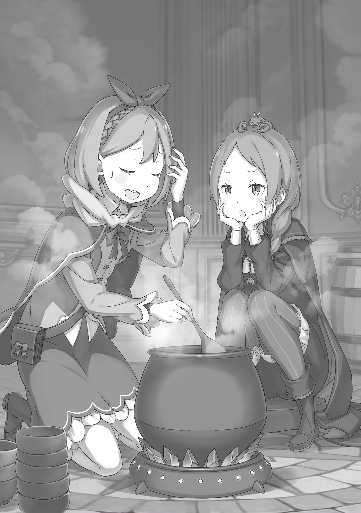
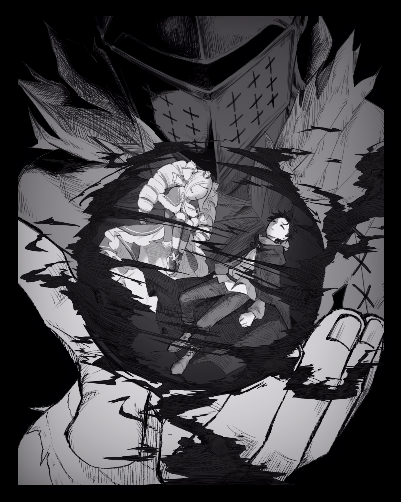

— Я понимаю, что все волнуются, но мне кажется, они уж слишком грубо себя ведут.

Она поделилась своими мыслями, когда готовила ужин для всех в Сторожевой Башне Плеяд. С тех пор, как они прибыли в башню, прошло уже полдня. Всего у них было три дня, поэтому Субару с остальными поспешили в библиотеку за нужной книгой. Готовя ужин для всех, кто вернется голодным, Петра заметила, что обстановка в библиотеке была совсем уж не рабочая.

— Ни Субару, ни Гарф-сан никак не могут сосредоточиться на поисках книги. Эй, ты слушаешь?

В ответ на вопрос Петры Мейли рассеянно кивнула головой и сказала: «Да, слу~шаю». Тут девочка со скорпионом на голове зачерпнула ложкой суп из кастрюли и попробовала на вкус,

— Очень вку~сно. Петра-чан, ты готовишь все лу~чше и лу~чше.

— Спасибо, конечно, но мне еще нужно много работать, чтобы достичь уровня Фредерики. А тут еще и грозная сестренка Рем появилась на горизонте…

— Неужели она и правда такая грозная? Но она ведь ничего не помнит, да? Тогда я не думаю, что она вообще тебе конкурент, Петра-чан, ни на кухне, ни в чем-либо дру~гом.

— Ты ничегошеньки не понимаешь. Она влюбилась в него однажды, и кто знает, вдруг это случится еще раз… странно это все.

Петра понизила голос, раздумывая о том, как обстоят дела у Субару и Рем.

Рем долгое время была в коме, но наконец очнулась, и это радовало Петру. Субару и Рам всегда заботились об этой спящей красавице, а сама Петра каждый день присматривала за ней, пока та спала. Она видела и прекрасно понимала, насколько сильно черноволосый юноша дорожит Рем. Честно говоря, Петра думала, что, если бы спящая красавица не проснулась, она так и не поняла бы, насколько грозную соперницу получила в любви. Когда они познакомились, Рем показалась ей искренней и трудолюбивой, но что-то в ее поведении было не так… что-то странное. После потери памяти спящая красавица часто спорила с Субару и даже сейчас вела себя с ним очень грубо и холодно.

— Странно, странно это все.

— Хммм, поня~тно. Но братец же ведь такой же, нет~? Сколько на него ни смотри, а он всегда делает какую-нибудь странность или глупость.

— Да, я тоже сначала думала, что Субару странный… Подожди, а разве то, как ты это сейчас сказала, не странно, Мейли-чан?

— Пере~стань себе надумывать тут всякого.

Мейли высунула язык и подняла руки с недовольным выражением лица. Тут Петра посмотрела на нее и сказала: «Ну блин~», решив на время отбросить свои подозрения. Перед их поездкой в Империю Мейли сказала ей то же самое: что она слишком много беспокоится. Но Петра считала, что осторожность в отношении Субару как раз таки нужна. Любой, кто проведет с ним время, поймет, что этот черноволосый юноша настоящий симпатяга. И чем больше его узнаешь, тем сильнее это чувство становится: она боялась, что для кого-то это может перерасти во что-то большее.

— Даже в Империи он много кому понравился… Людей, которым понравился Субару, стало примерно на тысячу больше.

— Ты сейчас так преувели~чиваешь? На тысячу… как-то это слишком много…

— А ведь их становилось все больше и больше! Конечно, большинство из них были мужчинами, так что ничего страшного, но все равно мне нужно быть очень осторожной.

Мейли посмеялась над этим, как над шуткой, но Петре было не до смеха: одной рукой она крепко сжимала кулак, а другой мешала кастрюлю, чтобы та не закипела. Мысли о Субару все никак ее не отпускали. Если бы она так часто о нем не думала, он мог бы ни с того ни с сего скрыться из виду, случайно подойти к кому-то, кому было очень больно, и пойти на многое ради него.

…Точно так же, как сейчас: они были в башне, чтобы помочь Алу двигаться дальше.

— Ал-сан… он…

— О, в начале ты ведь говорила что-то про груб~ость. Что ты имела в ви~ду?

— Что вижу, то и говорю. Субару и Гарф-сан слишком навязчиво следят за Алом-сан…

— Серь~езно, а эти двое хоть когда-то за кем-то нормально следили…? Что за Ал-сан? Тот маленький парень? Или тот мужчина в шлеме?

— Мейли-чан…

Не проявляя интереса, Мейли закончила пробовать еду, отошла от кастрюли, села на багаж и положила подбородок на ладони. Тут Петра нахмурилась и сказала: «Блин». Так как Мейли присоединилась к их группе лишь недавно и поэтому слышала только часть того, что происходило в Империи, это было неудивительно, но…,

— Не веди себя так, будто уже все сделала. Ты одна из нас, Мейли-чан, так что старайся быть в курсе дел.

— Даже если ты так просишь, пока мы не захотим вернуться домой, у меня нет особой раб~оты. Поэтому ничего не могу с собой поде~лать… И еще, Петра-чан, мне кажется, я совсем не подхожу вашей гру~ппе.

— Об этом не переживай. Ты же получила помилование Совета Мудрецов? Гордись собой. Держи голову высоко и мило улыбайся.

— Ах да, точно, нужно мило улыб~аться.

Петра вздохнула, глядя на Мейли, которая сидела с серьезным лицом. Хотя эта девочка не была плохой в глубине души, она так привыкла играть роль злодея, что уже сама не знала, искренняя она или нет.

— Ох… Сколько еще людей мне нужно учить с нуля…

— Ты всегда такая занятая, Петра-чан~. Интересно, ты вообще когда-нибудь отды~хаешь?

— И по чьей же, интересно, вине я отдохнуть-то не могу! К тому же…

— К то~му же?

— Не скажу, что я устала. Но если тот, от кого я больше всего хочу отдохнуть, все не сдается и не сдается, то это только усложняет мне задачу!

— …

— А, и я не про Отто-сана! Ему самому нужно найти время хорошенько выспаться… Хотя бы шесть часов в день!

Хотя Отто и не привык много спать, но, в отличие от Розвааля, это было не из-за нехватки сна. Он просто слишком много усердствовал. В доказательство можно привести случаи, когда, после завершения большой работы, он мог спать более полусуток, как убитый.

— А я ведь говорила ему, что не нужно сравнивать себя с Господином, который все время и везде мухлюет, но он меня совсем не слушает.

— Хе~хе… Тебе и правда так не нравится этот «Господин», Петра-чан~? Разве тебе сейчас не легче от того, что ты не с ним?

— Да, поэтому мы так легко с сестренкой Фредерикой и разлучились. А еще это значит, что она мне доверяет.

Петра впервые осталась за главную в долгом путешествии, которое длилось больше десяти дней. Хотя раньше ее оставляли так только на день или два. На встрече с Западным Маркграфом и в путешествии в Империю с ней всегда были Фредерика или Рам. Но теперь она была одна.

Из-за этого ее пыл был другим. Ей нужно было присматривать за всеми.

— Вот почему я волнуюсь за Ала-сан… Да, это тот, что в шлеме.

— Ага-ага, а он довольно-таки заме~тный. Разве не из-за него мы приехали в ба~шню?

— Да. Он очень хочет прочитать одну «Книгу Мертвых»… Надеюсь, это ему поможет.

— …? Странное решение проб~лемы. Ал и правда тебя так сильно забо~тит?

— Нет, сейчас я больше переживаю за Субару и Гарфа-сан.

Тут Мейли наклонила голову и спросила: «А что они?». Казалось, это интересовало ее больше, чем тема Ала, и она, нахмурившись, посмотрела на Петру.

Та ответила на ее взгляд словами: «Потому что» и продолжила,

— Они слишком сильно переживают и думают, будто это уже и их проблема тоже. Когда твои близкие или друзья переживают трудности, ты ведь иногда так стараешься их поддержать, что и сам начинаешь чувствовать себя не очень, ведь так?

— …Кто зна~ет? Это пра~вда так?

— Может, я зря с тобой вообще об этом говорю, Мейли-чан…

Петра, которая искала сочувствия, встретила лишь пустой взгляд Мейли. Она почувствовала, что ее переживания, как прилив, отталкиваются от ее молчания, поэтому она тут же сосредоточилась на черноволосом юноше и светловолосом парне. Петра слышала, что Субару и другие подозревают, что Ал ищет «Книгу Мертвых» Присциллы, чтобы ее воскресить. Она не знала, возможно ли это, но понимала, почему Субару и остальные так внимательно следили за каждым шагом мужчины в шлеме.

— Сначала я хотела, чтобы Ал-сан прочитал книгу, но теперь думаю, что, может, не надо? Мои мысли и чувства совсем-совсем не совпадают.

Петра понимала, что, когда мысли и чувства не сходятся, все идет наперекосяк. Это касалось не только ее, но и других людей. Результаты будут лучше, если и цели, и действия будут совпадать.

Значило ли это, что у Субару и остальных мысли и действия совпадали?

— …

— Как по мне, Петра-чан слишком много беспо~коится. …О~?

Вдруг Мейли что-то заметила, отчего Петра спросила: «Что?» и посмотрела на вход в помещение. На четвертом этаже было много комнат. Когда Петра и Мейли готовили ужин в одной из них, к ним подошел тот, о ком они только что говорили…,

— Как поживаете? Я пришел на вкусный запах. Вы, девочки, готовите ужин?

С этими словами Ал слегка помахал рукой. А за ним молча шла Флам, видимо, чтобы удостовериться, что он не останется один. Петра на секунду растерялась от появления этой пары, однако…,

— Д~а, готовим… точнее, я просто смотрю, как Петра-чан гот~овит.

— Открыто халтуришь, значит? Хотя мисс Мейли проделала большую работу на пути сюда, я не могу ее осуждать.

— Разуме~ется. Пока мы здесь, никто не посмеет меня осуж~дать.

— Бесспорно, бесспорно. Спасибо тебе, спасибо тебе.

Ал поклонился высокомерной Мейли, используя только правую руку для жеста благодарности. Пока эти двое разговаривали, Флам подошла к Петре, которая помешивала еду в кастрюле, и,

— Спасибо за вашу работу. Извините, что оставила готовку на вас.

— О? Все в порядке. Флам-чан, ты ведь одна заботилась об Эццо-сане, пока мы не приехали, да? Можешь пока оставить такие дела на нас.

— Большое спасибо. Эццо-сан постоянно забывает про еду и сон, ведь он всегда так увлечен тем, что делает; это проблема.

— Я тоже знакома с таким типом людей…

Петра сочувственно кивнула, услышав ее искренние слова. Флам тоже была служанкой, но, скорее всего, на год или два младше ее. Хотя она выросла в семье, которая служила роду Астрея, поэтому у нее могло быть больше опыта, чем у Петры, но все равно…,

— Давай вместе стараться и заботиться обо всех. Можешь со мной поделиться всем, чем захочешь.

Она хлопнула себя по груди и говорила с Флам так, словно та была ее младшей сестрой. Как бы ни улучшались ее навыки, Петра все равно оставалась самой младшей в лагере. Сколько бы она ни старалась, возраст не обгонишь. Это была другая сторона того, что Петра самая младшая. Конечно, несмотря на миловидность Беатрис и Эмилии, ей было сложно общаться с ними как с младшими, ведь им было больше четырехсот и ста лет. Поэтому возможность поговорить с кем-то помладше, например, с Шультом и Утакатой, была для Петры очень ценной.

— Большое вам спасибо, Петра-сама. У меня уже есть о чем с вами поговорить.

— Да. Да? И о чем же?

— Сколько бы я ему ни говорила, Господин все равно относится ко мне и моей сестре как к детям. Что же мне делать?

— Р-Райнхард-сан~… Ты же про него?

Тема разговора неожиданно стала очень серьезной, отчего Петра растерялась. Хотя она и не знала Райнхарда ван Астрея лично, все в Королевстве Лугуника слышали о «Рыцаре из Рыцарей». Хотя, по мнению Петры, Субару был более удивительным Рыцарем, но давать такую оценку Райнхарду, которого она никогда не видела, было бы неуместно.

В любом случае…,

— Я понимаю, каково это, когда с тобой обращаются как с ребенком, а ты этого не хочешь. Для начала перестань давать ему гладить себя по голове.

— По голове… Ну, кроме меня, Грассис вроде не против, когда Господин так делает. Я в стороне.

— Это не то чтобы плохо, понимаешь? Но вот это отношение, как к ребенку, конечно, очень не очень.

Петра только-только пыталась разобраться с этой сложной ситуацией в отношениях, поэтому ее ответы Флам казались немного странными. Услышав ее слова, Ал кашлянул.

— Хм, Ал-сан, что такое?

— Виноват, виноват. Но эдвайс, который ты дала Флам-чан, совсем ей не подходит. Похоже, у вас с ней разные чувства и цели…

— Ой, правда? Тебе не нравится Райнхард-сан?

— Мне нравится Господин, но не как мужчина.

— А, ээ, поняла…

Петра смутилась, поняв, что ошиблась, и слегка высунула язык. Затем она посмотрела на Ала и сказала: «Ничего себе»,

— Ал-сан, а ты с лету понял, что да как.

— Эй-эй, я уже взрослый мужик, как бы. Я повидал и хорошее, и плохое, хоть в основном и через других людей.

— Если через других, то, значит, нечего тебе хвастаться.

— Это не хвастовство, а скорее самоирония… ой-ой.

Ал пожал плечами, и тут его живот громко заурчал, на что Петра улыбнулась и сказала:

— Потерпи еще немного, я почти закончила.

— Ах~, виноват, что так спешу. Но это нужно не мне, а моему желудку.

Петра кивнула и сказала: «Поняла» разговорчивому Алу, который разбрасывался шутками. Она все еще беспокоилась, что Субару и Гарфиэль относились к нему слишком чересчур. Она понимала, почему они волновались из-за всех этих разнообразных, запутанных предположений. Но Ал, по крайней мере, старался казаться лучше. По-настоящему подавленный человек не смог бы так заботиться о других.

— Стар~икан, так ты умеешь есть?

И тут, не обращая внимания на Петру, Мейли обратилась к Алу. Мужчина ответил: «А как иначе» и стал возиться со своим шлемом.

— Голод — это проблема… Если не есть и не пить, ты теряешь силы, и это отдаляет тебя от цели.

— Это пра~вда. Но не пить, не есть и не спать — тоже вариант. В конце концов, у тебя всего три дня.

— Мейли-чан…

— Нет-нет, ничего. Я знаю, что у меня есть лимит, и очевидно, что мне нужно работать сейчас на все сто.

Ал махнул рукой, понимая, что не может опровергнуть слова Мейли. Но затем он постучал пальцем по шлему и добавил «Но»,

— Я клоун принцессы. Бороться в бешеном отчаянии — это не совсем про меня.

— Ал-сан…

— К тому же, хоть я и обещал ограничиться тремя днями, но ведь это же не срок? Время не измеряется песочными часами. Думаешь, если я буду плакать и умолять, мне добавят еще полдня или около того?

— …Пфф!

Петра не удержалась от смеха, когда он вдруг начал приводить такие резкие аргументы, хотя еще секунду назад говорил серьезным голосом. И правда, если бы Ал расплакался и стал умолять, им, наверное, пришлось бы продлить время еще на полдня.

Однако…,

— Не все будут от такого в восторге, но, пожалуйста, не забывай пить, есть и спать.

Если бы они рассчитывали на это с самого начала, то сроки не имели бы смысла. Петра должна была проявить строгость, которой не хватало всем остальным. Даже если она знала, что в итоге ее могут переубедить.

— В эти три дня я постараюсь изо всех сил помочь Алу-сан с Субару и остальными. …Так, все готово.

— Как строго.

Затем Петра перелила содержимое кастрюли в миску и легонько передала Алу пробу. Мужчина взял ее, приподнял подбородок своего шлема и поднес к губам,

— Горячо, горячо… Но вкусно.

Петра была довольна, когда Ал сказал это полушепотом.

△ ▼ △ ▼ △ ▼ △

— Осмелюсь сказать, что, кроме «Мудреца», который и создал эту библиотеку, я прочитал «Книг Мертвых» больше, чем кто-либо другой в этом мире. И я хочу поделиться своим мнением: неповторимость этой библиотеки кроется в том, что она помогает заново пережить историю прошлого.

После ужина Субару и остальные вернулись в «Тайгету». Там Эццо присматривал за Алом и помогал ему найти нужную книгу, одновременно с этим читая лекцию Субару и остальным. Его голос был низким и хорошо звучал в библиотеке с высокими потолками, хотя его внешность могла сбивать с толку. Несмотря на то, что они были в разных лагерях и не имели общих целей, доброта и умение найти общий язык Эццо заслуживали похвалы. Похоже, Флам не интересовалась этими темами, поэтому его желание поговорить на них было велико. В любом случае, лекция Эццо была интересной, и слушать ее было увлекательно.

— Даже если так, говорить, что это помогает «пережить историю прошлого», всего лишь преувеличение, в самом деле. Я знаю, что «Книги Мертвых» рассказывают о жизнях умерших, но масштаб, я полагаю, другой.

— Строго говоря, мисс Беатрис права, но это только с точки зрения одной книги. Если прочитать несколько книг, то ситуация кардинально меняется.

Так как они разделились, чтобы осмотреть книжные полки, то говорили достаточно громко; они будто нарушали покой школьной библиотеки, отчего чувствовали легкую вину. И тут Субару наклонил голову на ответ Эццо.

— Если подумать, Эццо-сан прочитал уже больше десяти «Книг Мертвых», да… Мы же считаем только тех, кого ты знал? Разве тогда это не высокий процент попадания?

— Хоть в библиотеке он уже долго, ты верно метишь, Капитан. Крутой я ищу уже больше половины дня, но ни одно имя, которое я бы знал, на глаза мне так и не попалось.

— А вот у тебя низкий процент попадания, в самом деле… Знакомых мне имен много, я полагаю. Но имена самих знакомых — это совсем другая история, в самом деле.

Пробормотала Беатрис, держась за руки с Субару и глядя на ту же полку, что и он. За четыреста прожитых лет она, как ходячая энциклопедия, то и дело натыкалась на знакомые имена. Возможно, Беатрис не всегда их упоминала, но каждый раз, когда она видела одно из них, ее руки, соединенные с Субару, выдавали это. Черноволосый юноша же и не думал спрашивать о тех, кого она не упомянула.

— Вряд ли Эццо-сан настолько самолюбив, чтобы просто хвастаться своей удачей. Если у тебя есть какой-то секрет, не мог бы ты про него рассказать?

— Мне жаль вас разочаровать, но дело не в удаче, Ал-доно. Нацуки-доно и его товарищам нужно быть осторожнее… и начать сомневаться в предпосылках.

— Сомневаться? — В предпосылках?

Эццо был красноречив, но Субару и Гарфиэль нахмурились, услышав его слова. Парень в мантии был очень доволен их реакцией и ответил: «Да!» с явным воодушевлением в голосе,

— Как сказал Нацуки-доно, чтобы «Книга Мертвых» раскрыла свой потенциал, нужно знать человека, о котором она написана. Я могу назвать несколько причин для такого ограничения, но все они — лишь предположения, поэтому отложим их в сторону. Главное, что из этого следует, это то, что пережить жизнь тех, кто умер давным-давно… например, в Эру «Ведьм», будет невозможно.

— Я и так не особо хотел в тех временах копаться, даже если бы мог, но… эта предпосылка, ты в ней сомневаешься?

— Ты серьезно ща? Почему ж так?

— Если бы не было какого-нибудь обхода, Эццо бы не прочел двенадцать «Книг Мертвых», я полагаю.

— Хахаха, приятно слышать, что мою любознательность так оценивают!

Хотя это не было похвалой, слова Беатрис подняли настроение Эццо. Он выглядел как человек, который мог бы быть отличным учителем. Субару всерьез задумался над его словами, но ответ пришел не сразу.

Вместо него…,

— …Хотя это вряд ли, но одна возможность на ум все же приходит.

— О, ура-ура! Тогда объясните, Ал-доно, о какой возможности речь?

— Итак, мое предположение: можно читать «Книги Мертвых» только тех, кого знаешь. Поэтому «Книги Мертвых» тех, кто умер давно, прочитать не получится. …Но если ты знаешь кого-то, кто умер давно, то сможешь.

— Подожди, но разве мы только что не говорили, что это невозможно?

— Да? Напомнить в каком мы месте?

Ал повел рукой, как бы указывая на «Тайгету». Субару поначалу не понял, о чем он, но потом осознал.

Этим было…,

— Если прочитать чью-то «Книгу Мертвых», то можно пережить чужую жизнь. А значит, круг людей, которых вы знаете, может расшириться. Если это так, то…

— В самом деле, можно увеличивать количество жизней, которые можно пережить, и время, на которое можно вернуться назад. То, что Эццо имел в виду, наконец-то обрело смысл, я полагаю.

— Пережить историю прошлого, все так, все так…!

Подхватив рассуждения Ала, Субару и Беатрис посмотрели на Эццо. Тут парень в мантии выскользнул из-за книжной полки, раскинул руки и кивнул.

— Блестяще. Приятно видеть, как молодые сами решают сложные загадки. Даже я, хоть и знаю больше, все равно впечатлен.

— А, извини, но я старше тебя, Эццо-сан.

— Бетти тоже не нравится, когда к ней относятся как к молодой, в самом деле. Я Великий Дух, который живет уже четыреста лет, я полагаю.

— Ой, я не хотел вас обидеть! Но вот Нацуки-доно и Гарфиэль-доно — молодые, так? Если бы вы только видели их лица, когда они догадались, о че…

— Гх…

Слова ликующего Эццо оборвались на полуслове, когда в глазах Гарфиэля промелькнуло недовольство.

Светловолосый парень, который что-то подсчитывал на пальцах, выглядел растерянным и никак не мог понять, о чем говорили Субару и остальные.

— Если читать «Книги Мертвых», то знакомых станет больше? Их станет больше, но количество «Книг Мертвых», которые останется прочитать, уменьшится? Увеличится? Короче, крутой я ни хера не въехал, че за пургу ты мне здесь несешь, мужик…

— …Не парься, Гарфиэль. То, о чем мы говорим, никак не связано с тем, что мы сейчас делаем. Тебе не обязательно это понимать.

Субару криво улыбнулся, успокаивая Гарфиэля, над головой которого, казалось, витало множество вопросительных знаков. Теперь они поняли, как Эццо смог прочитать двенадцать «Книг Мертвых». Это была не просто удача. Эццо использовал свой опыт, чтобы читать все больше и больше книг. Он познакомился со множеством людей через «Книги Мертвых», что помогло ему увеличить их число. Эццо думал, что если повторять этот процесс много раз, то можно вернуться в прошлое на сотни лет, возможно, даже до времен «Ведьм».

К сожалению, Субару не интересовала та эра, однако…,

— …Сателла.

В голове Субару мелькнуло имя, и он закрыл глаза, чтобы отогнать эту мысль. Хотя он и говорил, что ему неинтересно, что было четыреста лет назад, одно имя его все же интриговало. Но человек с этим именем не умер, а был запечатан, так говорили. А значит, ее «Книги Мертвых» здесь быть не могло. А даже если бы она и была, Субару вряд ли смог бы ее прочитать. …Да и проверять это ему совсем не хотелось.

— Но даже если ты знаешь, как это сделать, прочитать двенадцать «Книг Мертвых» — это почти как самоубийство. Потрясающая работа.

— Даже если использовать техники для очищения разума, это, конечно, было нелегко. Каждый раз, когда я читал «Книгу Мертвых», мне приходилось разделять себя и новую информацию. Что касается безопасности, то между книгами нужно делать перерыв на дня два.

Эццо вел себя безрассудно, но, когда Субару понял, что это было продумано, ему стало спокойнее. Читать по книге каждые два дня: возможно, скорость все же могла меняться.

В любом случае…,

— Не уверен, что слово «приятный» здесь подойдет, поэтому просто скажу, что разговор вышел интересным. Сэнк ю 11 .

— Между интересом и удовольствием есть тонкая грань. Если вы так внимательны к тому, что говорите, то не стоит винить себя за свои чувства. И спасибо, что выслушали мою лекцию.

— И тебе.

Субару видел, как Ал вежливо разговаривает с Эццо, отчего почувствовал, как спокойнее ему становится на душе. Когда черноволосый юноша впервые неосторожно потянулся к «Книге Мертвых», это казалось опасным. Но хотя книгу Присциллы еще не нашли, волнение, которое исходило от мужчины в шлеме, ослабло. Несмотря на привычку Ала отпускать самокритичные шутки, Субару почувствовал облегчение от легкости в его голосе.

— Да, это так тяжело, когда постоянно сомневаешься во всех вокруг.

Он вспомнил свои первые дни в Империи Волакия. Не зная, кому можно доверять, а кому нет, он провел немало времени в страхе. Это сильно давило на его психику. Но позже, когда к нему присоединились Эскадрон Плеяд, Эмилия и остальные, ему стало легче.

Тут Субару взял себя в руки и посмотрел на книжные полки.

…Он увидел «Книгу Мертвых» с именем «Нацуки Субару».

— …

Затаив дыхание, черноволосый юноша неподвижно смотрел прямо на нее. В прошлый раз чтение такой «Книги Мертвых» помогло Нацуки Субару вернуть «Нацуки Субару». Тем не менее, от вида этой книги у него заныло в животе. И тут он решил немедленно уйти от нее куда подальше,

— Нет…

Подождите ; Субару остановился. То, что эта «Книга Мертвых» была здесь, его вполне устраивало. Но не будет ли опасно просто отвести взгляд и оставить все как есть? Здесь был Ал, который, как и Субару, пришел из другого мира. Название книги «Нацуки Субару» было написано на языке кандзи: скорее всего, он сможет ее прочитать. Если Ал найдет эту книгу и откроет ее, это может привести к большим последствиям. То, что он узнает о жизни Субару, начавшейся в этом мире, может быть и хорошо. …Но это могло вызвать наказание за то, что кто-то узнал о «Посмертном Возвращении», и черноволосый юноша не знал, к чему это все может привести.

— …

Та, кто, похоже, дала ему силу «Посмертного Возвращения», «Ведьма Зависти»… Сателла. Субару понял, что у нее не было к нему никакой злобы. Но он не был уверен, что из-за этого она смягчит наказание. Может, тогда лучше спрятать книгу?

— Субару? Ты чего такой напряженный, в самом деле? Тебе нужно в туалет, я полагаю?

— Нет, не в этом дело… Просто я нашел одну неприятную «Книгу Мертвых». Теперь я хочу спрятать ее куда подальше.

— Неприятную…? Ты что, в самом деле, нашел книгу Присциллы?

— Логично, что ты так подумала. Но нет, не угадала.

Субару покачал головой, отвечая на подозрения Беатрис. Он не мог рассказать ей о «Посмертном Возвращении» и до этого избегал объяснений, опираясь на их связь. Но сейчас ситуация несколько усложнилась. Конечно, Беатрис не умела читать кандзи, поэтому не смогла бы понять, что это книга «Нацуки Субару». Но прятать книгу и обманывать ее было бы слишком безответственно.

Поэтому…,

— Беако, эту книгу ни за что нельзя читать. Если кто-то по ошибке ее откроет, «Ведьма Зависти» может появиться еще раз.

— О-о чем ты говоришь, я полагаю…?! В самом деле, если она появится, тебя могут снова отправить в Империю! Этого нельзя допустить, я полагаю!

— Вот именно. Поэтому…

Субару аккуратно взял с полки книгу «Нацуки Субару». Осторожно, стараясь ее не открыть, он тихо шептал Беатрис. На его слова она нахмурилась и кивнула с серьезностью в лице.

— Мулак.

Затем Беатрис использовала Магию Тени, отчего тело Субару стало легким, как перышко. Он запрыгнул на книжную полку и тихо перепрятал книгу.

— Я будто мальчишка, который затеял шалость в школьной библиотеке…

Этот поступок, лишенный страха перед Богом, мог обеспокоить любого библиотекаря, особенно Беатрис, которая много лет работала в «Запретной Библиотеке». Но выбора не было. Через три дня, перед тем как они с Алом покинут башню, нужно будет вернуть эту книгу на место.

— Хотя есть риск, что Эццо-сан найдет ее и прочтет… Может, лучше тогда просто избавиться от нее?

— Избавиться от чего, брат?

— ААААААААА!!!

Когда Субару вернулся к Беатрис, он ломал голову над тем, как лучше поступить с книгой «Нацуки Субару». И тут черноволосого юношу внезапно окликнул голос, заставивший его громко вскрикнуть. Субару тотчас же обернулся и увидел Ала, который удивился такой бурной реакции.

— Ой-ой, ты чего так перепугался, брат? Я просто хотел завязать разговор.

— А, да, прости, что испугал. Я закричал гораздо громче, чем хотел.

— Да не, не переживай, я не так сильно испугался. А вот ей, наверное, сейчас хуже, чем мне.

— Ей?

Тут Субару посмотрел туда, куда указал Ал, и издал «Ах», когда увидел Беатрис: она сидела на корточках, закрывая уши руками, а на ее глазах блестели слезы,

— Ч-что это был за крик, в самом деле…? Мои уши, уши Бетти зазвенели, они звенят, я полагаю!

— Прости меня! Я не специально! Я люблю тебя!

— Я тебя не слышу, в самом деле! Говори громче, я полагаю!

— Беако лавли 12 ! Беако прити 13 !

Когда Беатрис вот-вот могла расплакаться, Субару искренне взывал к ней через любовь. Она надула щеки, замолчала, а затем глубоко вздохнула.

И тут,

— Что ж, раз уж ты так сильно любишь Бетти, я тебя прощаю, в самом деле. Скажи спасибо моей доброте, я полагаю.

— Спасибо, большое-большое спасибо, я бесконечно люблю тебя. …Ну что ж…

Субару погладил Беатрис по голове и повернулся к Алу. Мужчина, который наблюдал за их любовными утехами, спросил: «А, вы закончили?», возясь со своим шлемом,

— Ты, похоже, очень любишь своего Духа, брат. Извини, что помешал вашему «медовому месяцу».

— Да не парься. Если уж на то пошло, то проводить время с Эмилией-тан и остальными после Империи было гораздо… а, нет, нельзя такое говорить!

Когда Ал легкомысленно пошутил, Субару хотел ответить в своем стиле, но осознал, что говорит что-то не то, и прикрыл рот рукой. Увидев это, мужчина в шлеме криво улыбнулся и:

— Все нормально, брат, ты прав. И еще раз спасибо. Наверное, было непросто выделить для меня эти три дня.

Субару не знал, что ответить на его благодарность. Мужчина в шлеме сам предложил провести три дня в Сторожевой Башне Плеяд, чтобы повысить шансы на успех. Но для Субару это также было доказательством того, что Ал не эгоист.

— Беако-чан, прости, что взял брата с собой. И спасибо, что поехала со мной.

— …Само собой, Бетти всегда будет рядом с Субару, в самом деле. Но Бетти не собирается повторять одно и то же, я полагаю. Больше никогда меня так не называй, в самом деле.

— Понял, понял. Она у тебя очень добрая, брат, твоя дочка.

— Ага. Беако просто чудо: она такая легкая, как вата, и вся состоит из доброты и любви.

На слова Ала Субару еще крепче сжал руку Беатрис, отчего она отвернулась в смущении и спрятала лицо. Глядя на ее реакцию, черноволосый юноша улыбнулся и вздохнул,

— Ал, как дела с поисками?

— …Пока ничего. Я надеялся что-то найти за эти три дня, но с таким количеством книг это все равно что искать иголку в стоге сена.

— …

Ал рукой указал на остальную часть библиотеки. Сказать, что там было много книг, — не преувеличение. Сколько людей погибло в этом мире… нет, с момента создания Великой Библиотеки Плеяд? Узнать об этом по одной книге за раз было не в подъем. К тому же, как сказал Эццо, книг становилось больше каждую секунду, это не говоря уже о днях.

— Но не отчаивайся. Мы все здесь, чтобы помочь тебе.

— Брат…

— Это правда, в самом деле. Нельзя допустить, чтобы ты закончил с разбитым сердцем из-за того, что после всего этого большого пути не нашел книгу, я полагаю. Поэтому не сдавайся, в самом деле.

— …

На их добрые слова Ал молча опустил глаза. Субару заметил, как тот медленно открывает и закрывает ладонь правой руки, почувствовал его нерешительность. Но именно этого он и добивался… Субару хладнокровно хотел вызвать у него именно такую реакцию. Ал приехал в Сторожевую Башню Плеяд, чтобы прочитать «Книгу Мертвых» Присциллы. Однако Субару надеялся, что, когда тот увидит библиотеку и сосредоточится на смерти Присциллы, то сможет прийти в себя, даже если и не найдет ее книгу. Поведение Ала показывало его самозабвение и то, что он изменил свое отношение к происходящему вокруг. Субару понимал, что от этого может почувствовать себя виноватым, поэтому добавил,

— Ал, когда мы с Беако говорим, чтобы ты не сдавался, мы имеем в виду не только поиск книги. Мы хотим, чтобы ты не сдавался в том, что для тебя действительно важно.

— Важно…?

— Да. И не «мне это надоело» или «у меня не хватило времени», а понять, что для тебя и правда имеет значение. Вот что, по-моему, действительно важно.

Могло показаться, что Субару предлагает ему смириться со смертью Присциллы, но это не то, что он хотел сказать. Дело не в том, жива она или нет. Даже если не найдешь нужную книгу, важно понять, что для тебя действительно важно. Скорбеть о ней, вспоминать ее и в итоге найти выход. …Без этого не обойтись.

И вот…,

— Сделай все возможное за эти три дня, а мы тебе поможем, чем сможем.

— Но не нужно отказываться от сна и еды, я полагаю. А то станешь как Отто, в самом деле.

Субару ободряюще улыбнулся, а Беатрис подмигнула ему. Тут Ал вздохнул и, медленно подняв шлем, сделал долгий, насколько это вообще возможно, предолгий вздох.

— Значит, три дня, да?

— Да. И никаких продлений… Ну, если будешь сильно просить, я, возможно, подумаю, но не рассчитывай на это с самого начала!

— Если мы вернемся позже, чем планировалось, нас отругает Эмилия, я полагаю.

— Суровая ругань от Эмилии-тан…! Это, наверное, настоящее зрелище.

Не важно, какие у нее эмоции, какое лицо и под каким углом, Эмилия всегда была настолько милой, что Субару терял ясность ума. Но он не собирался лишний раз ее беспокоить и хотел видеть только ее улыбку.

— Что ж, какое бы лицо у нее ни было, суть Е ・ М ・ Т останется прежней…

Увидев ошарашенное лицо Беатрис, черноволосый юноша пожал плечами и снова посмотрел на Ала.

Встретившись взглядом с Субару, мужчина в шлеме кивнул и…,

— …Оль Шамак.

…В следующий миг мир Нацуки Субару померк.

△ ▼ △ ▼ △ ▼ △

— Три дня. Большинство бы подумало, что что-то может случиться только на третий день.

Он прижал ногой то, что упало на пол «Тайгеты» и вот-вот собиралось укатиться.

— А значит, это большинство потеряет бдительность сразу после приятной беседы первого дня.

Присев на корточки, мужчина поднял черный шар, который остановил ногой. Холодный и твердый на ощупь, он чем-то напоминал обычный стеклянный шар, однако не был таким хрупким, что к лучшему. …Это была тюрьма, которая могла захватить даже «Ведьму».

— Брат… нет, Нацуки Субару… Я не убью тебя.

Все отчаянно пытались убить Нацуки Субару, но никто не понимал, что это бессмысленно. А если кто-то все же попытался, то мигом все вокруг становилось полем битвы черноволосого юноши. А сражаться с ним на его поле боя было наотрез нельзя.

И вот…,

— Начало положено, Учитель. …Я стану самим собой.

Присциллы Бариэль больше не было.

Таким образом, Ал… Альдебаран начал действовать, чтобы выполнить цель, от которой он когда-то отказался.

…Так и началась битва за изгнание Нацуки Субару из этого мира.
