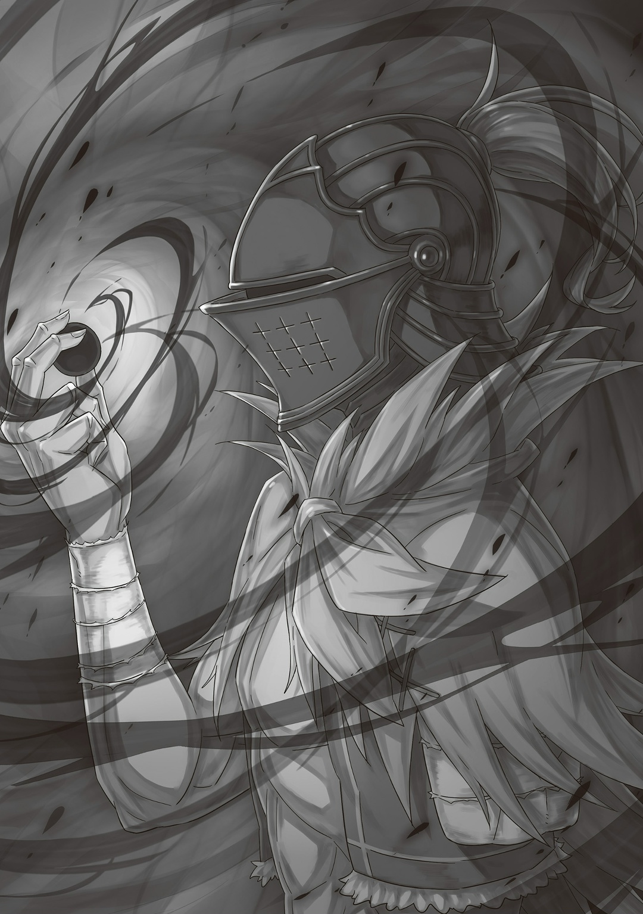
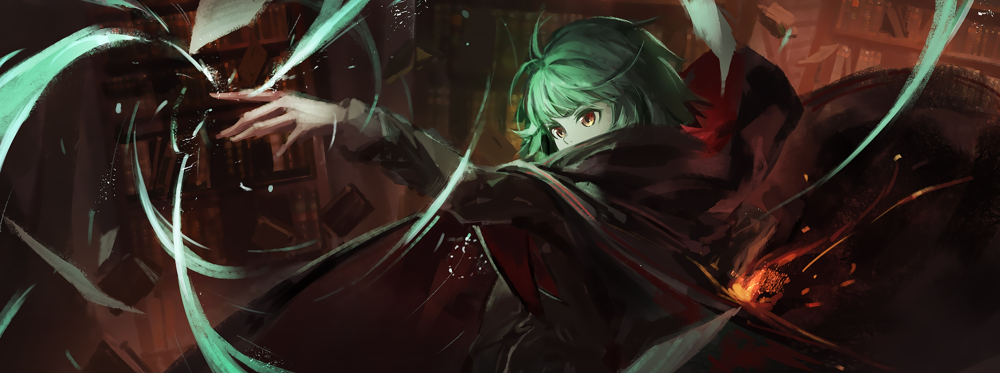
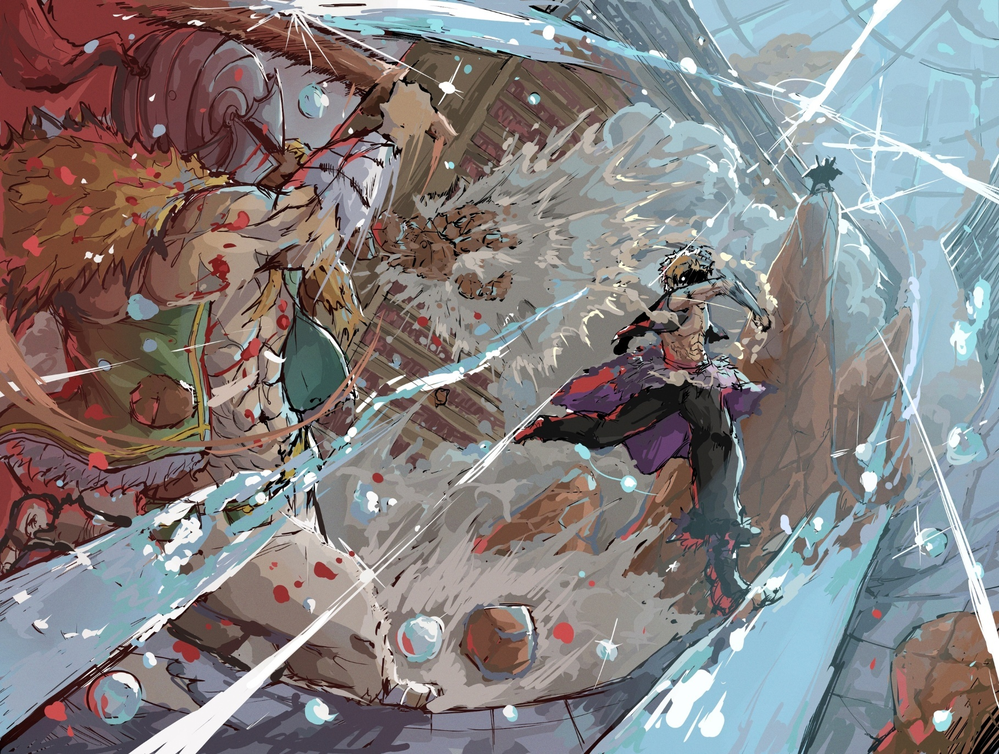
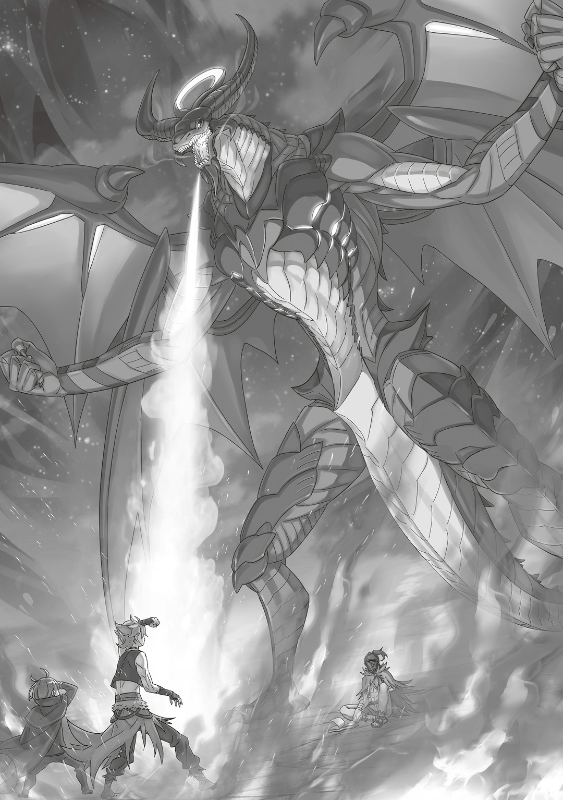

— …Расширение территории, переопределение матрицы.

Эта неизменная фраза — объявление войны всему миру; так однажды сказала одна «Ведьма». Магия — это способ менять реальность и нарушать законы природы с помощью заклинаний. Грубое, сложное вмешательство, равносильное переписыванию сюжета. По сути, заклинания были чем-то вроде вежливого предупреждения: «Сейчас я уничтожу мир».

Конечно, такое предупреждение могли проигнорировать или отвергнуть: например, если техника была плохо продумана, если активация провалилась из-за недостатка маны, или если результат вышел не таким, как задумывалось.

Однако то, что он сделал, не было магией.

И хотя то была не магия, эта неизменная фраза, как и ее суть, оставалась вызовом всему миру.

Вот почему…,

— …Расширение территории, переопределение матрицы.

Предвестие гибели мира, который не хотел умирать, но он все равно собирался его уничтожить. Уничтожить. Убить. Погубить. Разорвать. Сжечь. Раздавить. Растоптать. Порвать. Разрушить. Ликвидировать. Любое слово подходило. Это было что-то вроде магии. …Главное, что суть оставалась той же. С этой неизменной фразой он был готов на все. Что бы ни случилось, как бы ни сложились события, чего бы это ни стоило… Нацуки Субару должен исчезнуть. И менять свое решение он не собирался.

Именно поэтому…,

— …Расширение территории, переопределение матрицы.

Пусть даже этот звездный свет обойдется ему в миллиард, он все равно до него дотянется.

△ ▼ △ ▼ △ ▼ △

…Четыре тысячи шестьдесят один раз.

Больше всего ему пришлось потрудиться, чтобы убрать с доски Маркграфа с его шутливыми выходками.

Маркграф, умный и опытный боец, не повелся бы на слезливые истории, особенно если учесть, как он относится к лагерю При… нет, ко всему, что ему невыгодно.

Так как он не смог предложить Маркграфу ничего выгодного, стало ясно, что это бесполезно. Но факт оставался фактом: тот, у кого острое чутье на прибыль и убытки, часто улавливает недостатки лучше всех остальных.

Поэтому ему лучше было сделать так, чтобы Маркграф подумал, что понесет убытки, если не пойдет по его пути. Как только это стало понятно, управлять им стало куда проще.

Вся эта ситуация с Шультом: он не чувствовал вины. Чтобы избежать беспорядков в поместье Бариэль, все равно пришлось бы прибегнуть к чужой помощи.

Можете говорить что угодно, мне все равно. В конце концов, ее больше нет с нами.

…Девятьсот семьдесят два раза.

Вторыми по сложности оказались сестры Óни, особенно старшая: очень грозный противник.

С самого начала он уже знал, что с ней нужно быть осторожным. Обмануть чутье старшей сестры было трудно. Но он все-таки нашел ее слабость… младшую сестру без «Воспоминаний». Теперь-то он знал, что нужно делать. Старшая сестра хотела как можно скорее вернуться домой с младшей. …Как же это было удобно. Она была и крикливой, и невозмутимой одновременно: по-настоящему проблемный враг.

И хотя младшая сестра была менее осторожной, чем старшая, «Воспоминания» из Империи тоже сделали ее грозным противником.

Так вертеть их сестринской любовью, конечно, больно, но ничего. В конце концов, ее больше нет с нами.

…Шестьсот тридцать три раза.

Сложнее всего было найти общий язык с министром внутренних дел, который, как и он сам, был неприветлив к посторонним.

Несмотря на мягкую внешность, у министра был жесткий характер. Если посчитать его уступчивым, можно легко наступить на грабли. Он был противником, который внушал настоящий страх.

Метод для того, чтобы поставить его в тупик, был похож на тот, что использовался с Маркграфом. Но, так как министр был более человечным, удалось найти общее решение и выдвинуть условия, на которые он согласился.

Условия были таковы: никакого оружия, трехдневный срок и сопровождение доверенным боевым товарищем. Требовать большего было бы опасно. К тому же, если разговор с ним как-то прервется, надежды его продолжить уже не будет. …Решающим моментом стало то, что министр понял: мужчине в шлеме, который отчаянно рвался в башню, нужна помощь.

Так горько пользоваться его добротой, но что поделаешь. В конце концов, ее больше нет с нами.

…Девяносто четыре раза.

Хотя попыток понадобилось немного, важно было исключить обладательницу Редкой Крови из числа тех, кто направлялся к Песчаному Морю. Она всегда быстро предлагала себя в попутчики. Он не сомневался в ее человечности и способностях, но ее кровь помешала бы его целям. Самый быстрый и надежный способ подтолкнуть такого человека в нужном направлении — это использовать его сострадание. Он знал, что она чувствует себя частью группы и не хочет идти против течения, поэтому управлять ею было легче легкого. На данный момент он мог сказать, что хорошо понимает большинство отношений в их лагере. Если бы ей сказали, что то, что она хочет присоединиться к их группе, приведет к появлению пары, которая станет проблемой для одного ребенка, она мигом поменяла бы свое решение. Он не делал невозможное возможным, а просто использовал то, что было под рукой.

Мне нечего сказать, но это нормально. В конце концов, ее больше нет с нами.

…Пять раз.

Он отлично знал, как манипулировать «Ее» чувствами. Честно говоря, это было проще простого. Заботливая, сострадательная и доброжелательная «Девушка» легко верила всему, что он говорил. «Она» воспринимала каждое его слово как правду, потому что по своей природе была очень великодушной. Он не должен был оплошать с «Ней» ни разу… а значит, причина его неудач крылась не в «Ней», а в нем самом. Ему было морально трудно обмануть эту «Девушку» или изменить «Ее» мнение под свои цели. Если бы он не слушал голос своего сердца, наполнить «Ее» аметистовые глаза горем было бы очень просто. «Девушка» сопереживала его боли, и если бы он попросил «Ее» о чем-то важном ради При… «Она», естественно, согласилась бы.

Мне все труднее спасти себя, но это не страшно. В конце концов, ее больше нет с нами.

…Ноль раз.

Субару был самым легким противником. Он знал его насквозь, а потому даже не сомневался. Ему оставалось только подобрать правильный момент.

И вот…,

— …Оль Шамак.

Втянуть Беатрис в этот козырь было крайне важно.

— …

Незнакомое заклинание и странная техника замедлили реакцию Беатрис всего на секунду, но этого оказалось достаточно. Она защищала Субару, а потому именно эта пауза стала роковой брешью. То, как она сразу притянула его руку к себе, можно было назвать примером идеальной работы Контрактного Духа… но именно этого Альдебаран и добивался.

— Три дня. Большинство бы подумало, что что-то может случиться только на третий день.

…Оль Шамак был козырем против «Ведьм» — запрещенной техникой-печатью, которая насильно закрывала Врата цели и блокировала ее движения. О ней нельзя было никому рассказывать, и даже сама «Ведьма», которая ее создала, передавала эти знания только устно… и только Альдебарану. Почему она доверила это запретное искусство именно ему, так и оставалось загадкой. Возможно, дело было не в доверии, а в том, что она знала: Альдебаран точно использует эту технику по назначению и не ошибется.

— А значит, это большинство потеряет бдительность сразу после приятной беседы первого дня.

По правде говоря, Альдебаран никогда не думал использовать эту запретную технику против «Ведьм». …Точнее, он никогда не использовал ее на тех, против кого она действительно предназначалась. Другими словами, запретная техника, которую она создала и передала ему, наконец-то увидела свет.

— Брат… нет, Нацуки Субару… Я не убью тебя.

В разгар битвы с «Великим Бедствием» он использовал ее против Сфинкс, которая назвалась «Ведьмой». Однако у нее не было Ведьминского Фактора, и она не смогла проявить свою истинную силу. Поэтому сегодняшний день стал первым, когда «Оль Шамак» был использован по назначению.

— …

Он поднял с пола черный стеклянный шар. Внутри него были заточены Нацуки Субару и Беатрис. …Так как Беатрис была Великим Духом атрибута Тени, было бы очень плохо, если бы она изучила эту запретную технику. Он не знал, когда использовал Оль Шамак, станет ли она его целью. Но ему повезло. Заключив контракт с Нацуки Субару и разделив с ним Врата, Беатрис попала под действие запретной техники. Теперь она была запечатана в черном шаре. Добиться этого было сложно, однако…

Ее больше нет с нами. Вот почему…,

— Начало положено, Учитель. …Я стану самим собой.

Это случилось сразу после того, как Альдебаран решительно заявил об этом.

— ЭЭЭЭЭЭЭЭЙ ТЫ…!!!

Светловолосый зверь издал мощный боевой крик, разрушил пол библиотеки и полетел к нему со скоростью стрелы. Его сильная рука могла за секунду разнести Альдебарана в клочья. Даже если бы удар пришелся ему не по голове, а по плечу, силы зверя хватило бы, чтобы он потерял сознание. Но это могло произойти только в случае, если бы удар вообще был нанесен.

— …Кх.

— УБЛЮДОК, КАКОГО ХЕРА ТЫ СЕЙЧАС СДЕЛАЛ!?!?!?

Свирепый зверь бросился к нему с невероятной скоростью. Хотя изумрудно-зеленые глаза Гарфиэля пылали яростью, он не ударил мужчину в шлеме, а схватил его за руку и прижал к полу. Альдебаран не успел даже принять защитную стойку, а просто закричал от боли, когда его челюсть ударилась об пол. Тут Гарфиэль прижал колено к его спине, обнажил клыки и,

— ОТВЕЧАЙ!!! ЧТО ТЫ СДЕЛАЛ С КАПИТАНОМ И БЕАТРИС?! КУДА ОНИ ПРОПАЛИ?! Эта магия…

— Ты ошибся, Гарф-чан.

— Аа?

На допрос Гарфиэля Альдебаран ответил низким голосом. Зверь попытался было закричать в ответ, но в этом не было смысла. Нет, прежде всего, не имел смысла сам диалог.

— Тебе нужно было меня просто вырубить.

С искренним ответом Альдебаран пошевелил языком во рту. Затем, не обращая внимания на недоумение Гарфиэля, он развернул упаковку с препаратом за моляром и проглотил ее. И тут, когда от сильного жара кровь в теле Альдебарана начала закипать…,

× × ×

— ЭЭЭЭЭЭЭЭЙ ТЫ…!!!

Оттолкнувшись от пола со взрывной силой, свирепый зверь полетел вперед. Но он не собирался бить мужчину в шлеме, а просто хотел схватить его за руку и сбить с ног. …В эту секунду Альдебаран уклонился от удара и поднял локоть.

— Гха!?

— С этим…

Я его остановлю ; но как только он подумал об этом, удар зверя пришелся прямо по его торсу.

Альдебаран ударил Гарфиэля локтем, но тот, не обращая внимания на кровь из носа, ответил мощным ударом ноги, сломав бедро мужчины в шлеме и отправив его в полет. Попадать ударами было очень трудно.

— УБЛЮДОК…!!!

— Еще разок.

Рухнув вместе с книжными полками, он развернул упаковку с препаратом. Тут боль охватила все его тело и…,

× × ×

— ЭЭЭЭЭЭЭЭЙ ТЫ…!!!

Свирепый зверь с боевым кличем бросился вперед. Уклонившись от его атаки, Альдебаран выставил локоть вверх. Если бы он просто ударил Гарфиэля по носу, результат был бы таким же, как и в прошлый раз. Хотя он понимал это, Альдебаран не мог избежать его удара. В таком случае ему оставалось лишь надеяться, что удар зверя пойдет не по плану.

— Гбкхгткнхагхх!?

На локоть, который вот-вот должен был столкнуться с лицом противника, он надел каменную защиту; замахнувшись с силой, похожей на удар большим камнем, он врезал своему противнику. Кровь из носа Гарфиэля брызнула во все стороны, когда он полетел мимо Альдебарана.

— С этим…

Гарфиэль влетел в полку, и сверху на него посыпались книги. Альдебаран заметил это краем глаза и отпрыгнул назад, думая, что избежал первой атаки.

Но тут…,

— …Эль Шиха.

После того как Альдебаран приземлился на землю, он почувствовал, что все его тело стало вялым… нет, неподвижным. Это было из-за огромного количества воды; нечто совершенно недопустимое в библиотеке…,

— Прошу прощения за мои плохие манеры. Я сделал это нарочно, хотя прекрасно знаю, что влага — величайший враг книг.

— …Кх.

— Огонь бы все сжег, ветер бы разнес библиотеку, а земля испачкала бы книги, поэтому я выбрал воду. Я принял это трудное решение в моменте. Что ж, это я объяснил, а теперь…

Тут невысокий парень с поднятой рукой… Эццо Каднер медленно подошел к нему и взмахнул черным плащом. Это было не для вида, он следовал тактике: магу нужно было следить за движениями противника.

Альдебарану было приятно, что к нему относятся с такой осторожностью, но не похоже, что он мог оправдать эти ожидания. В конце концов, вода полностью покрывала его тело… на него как будто надели водонепроницаемый костюм. Из-за этого он не мог нормально дышать и двигаться. Но Эццо продолжал держать расстояние.

— Ал-доно, можете объяснить, что здесь происходит? Что за магию вы использовали? Я такую никогда раньше не видел. И что случилось с Нацуки-доно и мисс Беатрис? Они так волновались, что вы можете отчаяться и начать пренебрегать собой. И вот как вы с ними…

…Сто шесть раз.

Парень в мантии быстро проявил здравомыслие, которое обычно присуще взрослым. Несмотря на молодую внешность, Эццо Каднер был удивительно искренним: он отвечал честностью на честность и уважением на уважение. Это было заложено в его корнях. Поэтому, общаясь с Эццо, нужно было тоже быть искренним и уважительным. …Парень в мантии оставался спокойным, хотя всегда ждал худшего от других. Его подход к жизни сильно отличался от подхода Розвааля, — это несмотря на то, что оба они были магами. Если бы на его месте был Маркграф, он бы быстро сжег конечности Альдебарана, разорвал бы ветром его легкие, лишил бы сознания и заточил бы его тело в землю, даже не думая о «Книгах Мертвых». Но Эццо не стал бы этого делать. Вот почему,

— …Кх, что вы сделали!

Когда лицо Альдебарана в водяной оболочке потемнело и окрасилось в насыщенный красный цвет, Эццо закричал со всей серьезностью в голосе. Мужчина в шлеме изрыгнул свои жареные, расплавленные внутренности. Тут же парень в мантии развеял водное заклинание и попытался переключиться на магию исцеления, но было уже слишком поздно. Он не успел спасти Альдебарана…,

× × ×

— …Эль Шиха.

— Эль Дооона!

В отличие от изящной магии парня в мантии, его заклинание было грубым. Неуклюжая земляная броня быстро покрыла тело Альдебарана и впитала в себя всю жидкость.

— Чего!?

Земляные доспехи тут же превратились в грязь, что позволило Альдебарану встать и отпрыгнуть назад. Он скользнул по полу библиотеки и отступил подальше, чтобы лучше видеть тех, кто был настроен против него. Эццо, который внимательно следил за ним, и Гарфиэль, который был погребен под кни…,

— НУ ВСЕ, СУКА, ТЫ ДОИГРАЛСЯ!!!

Гарфиэль высунул руку из-под горы книг и, оттолкнув книжную полку, шагнул вперед. Светловолосый парень шагал осторожно, чтобы не наступить на книги, и пристально смотрел на Альдебарана. Тут Гарфиэль вытер тыльной стороной ладони кровь с лица: его кровотечение прекратилось через пару секунд. С самого начала его боевая сила заметно отличалась от силы Альдебарана. Подавшись вперед своим массивным, крепким телом, Гарфиэль собирался рвануться к нему, но…,

— Гарфиэль-кун, прошу тебя, остановись! К нему нельзя так бездумно подходить!

— ААА!? Сейчас не время тянуть резину, Мастер-сан! Капитана и Беатрис поглотил этот херов шар! Нам нужно срочно…

— Нет! Такую магию, как у него, я никогда раньше не видел! Кроме того, он с легкостью отбил обе наши атаки! Он реально опасный тип!

— …Кх.

— Я ни разу не показывал ему, на что способен. И все же он так быстро справился с моей водой. Это нельзя назвать просто мастерством в бою. Нам нужно сохранять спокойствие. Мы единственные, кто может его остановить.

Сдерживая вспыльчивого Гарфиэля, Эццо Каднер перешел на спокойный тон. Его слова подействовали: ярость на лице светловолосого парня постепенно сошла на нет. Эццо показал проницательность, когда всего за один бой уловил часть хитрых способностей Альдебарана. По сути, Каднер был прав. Как бы Альдебаран ни пытался найти идеальный путь, он не смог выбросить за борт Эццо, Флам и Гарфиэля, который сопровождал их в результате уступки лагеря Эмилии. Но, даже так, мужчине в шлеме удалось подавить силы противника, ограничившись лишь сильным воином и магом.

— Но это все равно было в сто раз сложнее, чем обычно.

Бормоча себе под нос жалобы, Альдебаран внимательно посмотрел на своих противников. Эццо, который следил за каждым его движением, и Гарфиэль, который вернул себе самообладание, — они были готовы ко всему.

И именно поэтому…,

— Э-эй, ублюдок, че эт с тобой!? — …Кх, что вы сделали!

Уловив шок в голосах Эццо и Гарфиэля, Альдебаран упал на колени, а затем и полностью на пол. Силы покинули его, а из шлема хлынула кровь: и вот так он покатился вниз по ступенькам библиотеки…,

× × ×

— Гарфиэль-кун, прошу тебя, остановись! К нему нельзя…

Так бездумно подходить! Когда Эццо попросил Гарфиэля успокоиться, Альдебаран схватил ближайшую книжную полку и толкнул ее вниз, как в домино, начав атаку на парня в мантии, который стоял дальше по ступенькам. Обычно полки «Тайгеты» держались за счет веса «Книг Мертвых» и не падали так легко… но если подложить под них «Камешки», то ситуация изменится.

…Триста девяносто семь раз.

С самого начала он собирался сделать это место полем боя, ведь здесь было много препятствий, и можно было легко подготовиться. Он уже давно все сделал. Каждый раз, когда у них появлялись подозрения, он просто отвлекал их на что-то другое.

— …А вот это уже плохо!

Когда полки начали на него падать, Эццо поднял шторм, остановив цепную реакцию и стараясь не дать «Книгам Мертвых» упасть на пол.

Его забота о книгах была достойна уважения, однако…

— Дона.

Вслед за этим полки слева, справа и сзади от Эццо тоже начали падать.

С новой волной падающих полок и книг парень в мантии решил больше не пытаться их спасти, а потому быстро понесся по ветру, уклоняясь от атаки.

— МАСТЕР-САН!!!

Гарфиэль, которого больше не сдерживал Эццо, расширил глаза и с чистой яростью посмотрел на Альдебарана. Увидев его пылающие изумрудно-зеленые глаза, мужчина в шлеме попятился назад. И тут в руке, между средним, безымянным и мизинцем, он зажал черный шар и, приподняв шлем двумя оставшимися пальцами, сунул его в щель…,

— Ам.

…Хотя шар был большим и вызывал ужасные ощущения при прохождении через горло, он все же смог протолкнуть его в желудок.

— Т-ты, УБЛЮЮЮЮЮДОК!!!

Тут же Гарфиэль поддался ярости и бросился вперед. Когда мощный, беспокойный шторм устремился к нему со скоростью, за которой не мог угнаться глаз, Альдебаран был отброшен ударом кулака.

Жестокий удар впился в его внутренности, недавний ужин сразу же вышел наружу, и мужчина в шлеме почувствовал, что его вот-вот вырвет шаром, который он проглотил, отчего прикусил моляры.

А затем…,

— …Расширение территории, переопределение матрицы.

…Он еще раз объявил войну всему миру.

△ ▼ △ ▼ △ ▼ △

…Ярость окрасила зрение Гарфиэля в красный цвет. Часть ее была направлена на Ала, который превратил Субару и Беатрис в черный шар. Но больше всего Гарфиэль злился на себя. Отто, Эмилия и другие доверили ему важную роль. Все они с нетерпением ждали Субару, который наконец-то вернулся из Империи Волакия. Но у каждого из них была своя роль, поэтому они доверили все Гарфиэлю. Конечно, Беатрис, Петра и Мейли также выполняли свои роли. Однако основная задача Гарфиэля все равно была защищать Субару.

Именно поэтому…,

— Крутой я… ТУПОЙ ДЕГЕНЕРАТ!!!

Его клыки треснули от ярости, но «Божественная Защита Духов Земли» тут же их восстановила. Однако затем они снова треснули. Гарфиэль был по-настоящему зол и внимательно следил за Алом. Помня слова Эццо, светловолосый парень знал, что должен был следить за мужчиной в шлеме, чтобы тот не сделал ничего опасного для Субару и остальных.

Однако Гарфиэлю нужно было следить не только за Алом, но и за Субару.

— «Гарфиэль, послушай. Пожалуйста, присматривай там за Нацуки-саном. Хотя он, наверное, не будет делать ничего глупого из-за Присциллы-сама, он может случайно наделать делов из-за Ала-сан.»

— …Кх.

Внимание Гарфиэля разделилось на два из-за слов его старшего брата. В результате реакция светловолосого парня на действия Ала запоздала на полшага. И мужчина в шлеме воспользовался этим полушагом на полную катушку, будто видел все наперед. …Нет, Ал предвидел не только эти полшага, но и все последующие шаги.

— ХЫАААА!!!

Ал едва успел пригнуться, когда ревущий Гарфиэль замахнулся кулаком. Светловолосый парень задел его только мизинцем, из-за чего заскрипел клыками. Гарфиэль продолжал промахиваться. Сколько бы ударов он ни наносил, ни один так и не достиг своей цели.

А что касается Ала…,

— Дона.

От короткого заклинания врага у Гарфиэля волосы встали дыбом, отчего он наклонился вперед. Через секунду каменная глыба, которая появилась в воздухе, ударила его по лицу. Удар был точным, учитывая угол, под которым он наклонил голову. Изо рта светловолосого парня вырвался болезненный стон, а его губа оказалась рассечена. Это было слабо. Для Гарфиэля, который сражался с высококлассными воинами Империи и даже с «Драконом», это было очень слабо. Судя по всему, это был максимум его противника.

— Хаа, хааа…

Тяжело дыша, Ал, который произнес заклинание, ударившее Гарфиэля по лицу, не расслаблялся и оставался начеку. Его усталость не была уловкой — он и правда выдохся. Гарфиэль считал, что разница в их силах была настолько велика, что одного мощного удара хватило бы, чтобы вырубить Ала. Хотя, возможно, даже не понадобился бы мощный удар. Если бы хоть один удар Гарфиэля попал в цель, бой бы мигом закончился. А за одну секунду он мог нанести десятки таких ударов. Нет нужды говорить, что такими темпами Ал выдохнется окончательно.

И хотя это должно было быть легко…,

— Я не могу попасть… Кх!

Гарфиэль недоумевал, что с ним происходит. Движения и контратаки Ала показывали большой разрыв в мастерстве по сравнению с ним. И это было не высокомерие — просто Гарфиэль как воин намного превосходил его. И все же он не мог ни ударить, ни уклониться. Гарфиэль все промахивался, а Ал все попадал. Хотя удары мужчины в шлеме не могли серьезно травмировать светловолосого парня, их хватало, чтобы остановить его и помешать следующим атакам…,

— Гарфиэль-кун, отступай, живо! Я тебя прикрою!

Гарфиэля остановила слабость под ногами, будто почва резко стала жидкой. Словно ругая его за то, что он не может продолжать атаку, Эццо крикнул, чтобы тот отступал. Парень в мантии пришел на помощь, чтобы прикрыть его магией с тыла. На секунду Гарфиэль подумал, что стоит послушать Эццо и оценить странную тактику Ала, однако…,

— Да-да, давай, правильно, отступай. Быстрей вали плакаться своей сеструхе и бабке, Гарф-чан.

— …Я ТЕБЯ НАХУЙ УРОЮ!!!

В глазах Гарфиэля вспыхнула ярость, и он, широко взмахнув руками, бросился на Ала. На этот раз светловолосый парень не собирался останавливаться ни перед чем. Даже если не получится увернуться от ударов Ала, Гарфиэль просто врежется в него всем телом и схватит.

— Это проблема.

Когда Ал понял, что хочет сделать Гарфиэль, он тяжело вздохнул. Светловолосый парень твердо встал на ноги, опасаясь каких-либо махинаций с землей, а затем бросился вперед.

Гарфиэль с огромной силой полетел к Алу… Внезапно его зрение помутилось.

— …Гх!

В глаза Гарфиэлю ударило знакомое ощущение, отчего он издал стон. Такое же чувство он испытывал, когда столкнулся с Песчаным Ветром по пути в башню.

Мелкие песчинки полетели Гарфиэлю прямо в глаза и безжалостно лишили его зрения. Это был очередной грязный трюк Ала, который заставил его остановиться. …Нет, Гарфиэль решил, что его руки и ноги не дрогнут ни перед чем. Больше всего Ал боялся безрассудного нападения. Поэтому Гарфиэль, даже когда перестал видеть, все равно решил схватить мужчину в шлеме.

— …Гарфиэль-кун!!!

Когда он решил продолжить атаку, его окликнул отчаянный голос Эццо. Услышав предупреждение об опасности, Гарфиэль почувствовал, как что-то приближается к его лицу, отчего широко раскрыл рот, чтобы поймать это клыками.

Удар в лицо сразу после того, как он ослеп, должен был его остановить. Однако это не сломило решимость Гарфиэля сделать все возможное.

— Пхотом тебя вылечу, ублюдок!

Почувствовав, как его клыки вонзаются в кулак врага, Гарфиэль крепко сжал челюсти и пообещал себе потом исцелить мужчину в шлеме.

Какое хладнокровное решение, ведь Ал был одноруким. Если бы Гарфиэль лишил его единственной руки, он больше не смог бы сражаться. Именно поэтому светловолосый парень планировал разорвать ее от запястья до локтя…,

— …А?

Укусив его руку посильнее, Гарфиэль кое-что понял. Кулак, который он поймал клыками, по форме напоминал левую руку… но ведь у Ала не было левой руки.

— …Бгкхгах!?

В следующее мгновение кулак Ала во рту Гарфиэля сильно раздулся: это сломало светловолосому парню челюсть и разбило его клыки на мелкие кусочки. Кроме того, пальцы кулака впились глубоко в горло Гарфиэля, которому тут же захотелось вырвать. …Затем расчетливый, мощный удар обрушился на челюсть светловолосого парня по диагонали.

— Кха… Кх!

Ослепленный Гарфиэль почувствовал, как мир словно перевернулся. Удар в челюсть оглушил светловолосого парня, отчего его ноги подкосились. Уже на волосок от гибели Гарфиэль с запозданием кое-что понял. Отчаянный крик Эццо был предупреждением: если он примет удар Ала, все закончится именно так. Другими словами, все пошло по плану мужчины в шлеме.

— Помнишь, я говорил, что с безрассудством труднее всего? Я соврал. Те, кто не умеет думать, мне не угроза.

Обида и унижение от этих колких слов все больше разжигали ярость в голове Гарфиэля.

△ ▼ △ ▼ △ ▼ △

Натиск был неумолимым и безжалостным, будто шторм или торнадо, ведь любого, кто под него попадет, сразу же сметет, как какой-нибудь листок. По идее, эта битва должна была быть односторонней, но на деле все оказалось совсем по-другому.

— Гарфиэль-кун!!!

Эццо закричал из-за спины Гарфиэля, когда увидел, что происходит. Светловолосый парень полетел на мужчину в шлеме, чтобы не дать ему сбежать. Эццо отчетливо видел, как поле зрения Гарфиэля заволокло тонкой пеленой песка.

И это была не магия, а простой песок из Песчаного Моря. Затем, увидев атаку, которая последовала за ослеплением Гарфиэля, Эццо закричал. Ал восстановил свою левую руку с помощью магии и нанес ею удар. Гарфиэль открыл рот, чтобы укусить земляную руку: это могло плохо кончиться. И мрачное чутье Эццо тут же подтвердилось — новая рука мужчины в шлеме взорвалась прямо во рту у светловолосого парня.

— …ГКХАГКАХХК!?

Рука Ала расширилась и разрушила рот Гарфиэля. Клыки и кровь светловолосого парня брызнули в разные стороны. Вдобавок к этому, Ал ударил оцепеневшего Гарфиэля прямо по челюсти своей правой рукой в каменной перчатке. Светловолосый парень рухнул на колени. …Последовательные движения мужчины в шлеме были эффективны, чрезвычайно эффективны.

— Да такое даже в заранее спланированном бою невозможно…!

Когда Ал мастерски останавливал Гарфиэля шквалом ударов, которые казались невозможными даже в показных боях, настороженность Эццо достигла предела. Конечно, если бы светловолосый парень прекратил атаковать, это было бы очень кстати…,

— Я понял, вас нельзя недооценивать! Будьте готовы лишиться не только левой руки, но и как минимум одной ноги! …Уль Шиха!!!

Он не мог использовать свою магию из-за того, что Гарфиэль сражался вблизи с Алом, поэтому решил ослабить противника мощным заклинанием. Повинуясь воле Эццо, мана вступила в действие и мир вокруг изменился. На свободу вырвался яростный поток «Ветра».

Это было ложное заклинание, похожее на водное заклинание класса Шиха, но на практике оно могло менять саму магию. Эццо также использовал беззвучное Гоа, чтобы создать ловушку и атаковать врага с обеих сторон. Одновременное произнесение двух заклинаний было очень сложной техникой, настолько сложной, что, по слухам, для этого нужно два мозга, и только пять человек в мире могли это сделать. По сравнению с Розваалем, у Эццо была небольшая задержка при одновременном применении заклинаний, но он компенсировал это с помощью ложного и беззвучного заклинания.

— Сейчас…

Пусть и не решающий, но все же важный удар , — так думал Эццо, но действия Ала все изменили. Мужчина в шлеме внезапно отвернулся от буйства невидимого ветра и принял его удар на спину, погружаясь в огонь впереди себя. Конечно, эта огневая сила не могла его испепелить, но серьезные ожоги были неизбежны. Ал был беззащитен… нет, он превратил каменную перчатку на правой руке в тонкий щит и пробился сквозь огонь.

— ЫААААА!!!

Даже если бы он прорвался через стену пламени, ветер бы все равно его унес: Ал сильно ударился бы о стены и пол и больше не смог бы нормально двигаться.

Однако…,

— …Да быть не может.

Пробормотал Эццо в полном шоке. Он не мог поверить своим глазам. Ал, подхваченный ветром, действительно был беззащитен, и его тело врезалось в самые разные места башни. …Однако, как будто предвидя каждое столкновение о поверхность, Ал создавал подушки из грязи, которые почти полностью гасили урон. И вот так мужчина в шлеме выбрался из хватки ветра.

— …

Ситуация зашла так далеко, что Эццо не оставалось ничего другого, кроме как принять свои самые абсурдные предположения за реальность. Навыки Ала были значительно хуже, чем у Гарфиэля. Но он даже уклонился от атаки Эццо, лучшего мага Королевства. Наверняка за этим стояла какая-то техника, которая нарушала все правила. Если бы Эццо предположил, что это в теории может быть, то…,

— Он что, будущее видит?

При мысли о такой нелепой возможности Эццо вздрогнул. Среди великих воинов и мастеров боевых искусств были те, кто мог чувствовать противника и предугадывать его шаги. Даже маги могли предсказать действия врага, наблюдая за маной перед заклинанием. Но объяснить то, что делал Ал, было невозможно. Это не было простым чутьем или опытом. …У Ала было идеальное решение для всего.

Эццо, как учитель, часто передавал знания другим. Он понимал, что неестественные ответы связаны с неестественными процессами. Объяснение, в котором пропущены важные части, часто оказывается просто попыткой угадать правильный ответ. То же самое можно сказать и о том, что происходило с Алом.

Проблема была в том, что…,

— Помимо запечатывания Нацуки-доно и мисс Беатрис, у него еще есть и какая-то другая магия…

Магия, о которой не знал даже Эццо, а он прочитал всю доступную литературу и изучил почти все атрибуты. Если это была какая-то запретная техника, о которой не сохранилось записей, значит, велика вероятность, что существуют магические техники, не относящиеся к шести основным атрибутам.

— …

Эццо мог читать любые движения мужчины в шлеме. Учитывая это, он все равно поднял оценку угрозы Ала до максимума. Грозный враг с неизвестной магией и намерениями… такое описание больше не подходило. Его следовало приравнять к Архиепископу Греха или даже к «Ведьме».

А значит…,

— …Пока у меня еще есть мана в запасе, я буду сражаться!

△ ▼ △ ▼ △ ▼ △

Когда раздался громовой раскат, Петра не хотела верить, что он реален.

И все же…,

— …Кх.

Она прикусила внутреннюю сторону щеки, чтобы проснуться от боли, но это была реальность. Здесь не было места для молитв о лучшем. Люди часто выбирали самые простые, удобные и безопасные пути, но что они будут делать, если и правда случится что-то плохое? Они просто отдадут кого-то важного или дорогого в руки опасности ради своего сиюминутного эгоизма?

— …Мейли-чан, сюда!

Как обычно, Мейли только мешала и ничем не помогала, но хорошо, что она оказалась рядом. Благодаря этому Петра протянула ей руку помощи. Тут Мейли, когда ее потащили за руку, посмотрела на потолок, откуда доносились громкие звуки, и,

— …Петра-чан, похоже, кто-то поссо~рился.

— …Не знаешь, кто именно?

— Нет~. Но братец и клыкастик вряд ли бы поссорились, так что это либо Мастер-сан, либо тот в шле~ме.

— Эццо-сан и Ал-сан…

— Если это Мастер-сан, то с Флам тоже нужно быть настороже.

В отличие от напряженной Петры, тон и выражение лица Мейли оставались такими же, как обычно. Разница между ними была очевидна. Мейли уже привыкла к таким ситуациям, тогда как Петре было очень трудно. Однако опыт из Империи помог ей не паниковать. Все, что Петра узнала в Волакии, должно было хоть немного пригодиться ей в жизни.

— Что же де~лать? Может, нам подн~яться к ним?

— …Нет, лучше не надо. Если бы мы были там с самого начала, это было бы одно, но если мы влезем сейчас, то только помешаем.

— Что~ж. Тогда просто можно послать туда маленького Багрового Скорпиона…

В ответ на странное заявление Мейли скорпион вылез из ее волос и защелкал клешнями. Он был энергичным и решительным, однако от него не было бы особой пользы. Если бы туда пошли Мейли и Петра, все могло бы быть иначе.

Петра покачала головой и успокоила пыл маленького Багрового Скорпиона.

Плюсом к этому…,

— …Нам нужно быть на чеку.

Судя по тому, что сказала Мейли, кто-то сражался на верхнем этаже… в библиотеке с «Книгами Мертвых». После ужина туда пошли люди, и среди них были те двое, а также Нацуки Субару.

— Субару…

Словно в молитве, Петра пожелала ему безопасности. Рядом с Субару были Беатрис и Гарфиэль, поэтому она надеялась, что с ними он будет в порядке.

И тут…,

— …Пееетра! Мейли!

— …Кх, Гарф-сан!?

Петра вздрогнула, когда услышала громкий голос Гарфиэля. После ее ответа светловолосый парень ворвался в комнату, где она сидела с Мейли. Увидев знакомое лицо, Петра обрадовалась, но ненадолго, ведь…,

— Ты сильно ранен…! Что случилось? Тебе нужна помощь, и срочно…!

— Бырее лечи меня Магией Све-кх…! Потороп-кхись!

— …Хк!

Гарфиэль, с кровью на лице и без нескольких клыков, обратился к Петре с просьбой. Тут же она сосредоточилась на том, чтобы помочь ему Магией Света.

Ее магия была слишком нестабильной, чтобы использовать ее на ком-то, кроме себя, но свирепое выражение Гарфиэля не оставляло ей выбора. В таком случае Петре нужно было победить свою слабость прямо здесь и сейчас.

— КХААААААА!

— Кья~а!?

Под действием Магии Света Гарфиэль уперся руками в пол и разорвал каменное покрытие. Мейли вскрикнула от его неожиданных действий и спросила: «Что ты дела~ешь?». В ответ Гарфиэль повернулся ко входу в комнату и…,

— РЫА!

Гарфиэль зарычал и заблокировал вход куском пола. Петра очень хотела расспросить его обо всем, она думала, что он пытается помешать кому-то войти, однако быстро поняла, что дело не в этом, когда увидела, что происходит через щель под заблокированной дверью.

— …Во~да?!

Мейли снова закричала, а маленький красный скорпион на ее голове удивленно вытянул хвост и клешни. Глаза Петры расширились: она услышала и увидела, как мутный поток воды с огромной силой затопил коридор четвертого этажа башни. Кто это мог сделать? Зачем? С какой целью?

— Значит, читаешь все наперед… Почему же ты тогда ничего с этим не сделал…?

Гарфиэль уперся ногами в пол, чтобы сдержать бушующую воду. Петра ужаснулась злобной, воинственной улыбке Гарфиэля, которая еще и была смешана с гневом. Почему же он пришел к ним один?

— …Держись!

Петра решила держать все вопросы при себе и протянула руку, чтобы помочь Гарфиэлю.

— …Кх.

Когда Петра положила руку ему на спину, Гарфиэль напрягся всем телом. Конечно, тонкие руки девушки не могли дать ему сил, ей было бы куда лучше сосредоточиться на своей Магии Света. Но именно так Петра возложила все свои заботы и веру на спину Гарфиэля, и он оправдает ее доверие.

В конце концов, шум большого потока воды в коридоре затих: он превратился в слабую струйку, похожую на последние капельки, падающие из водостока после дождя. Гарфиэль, который все это время использовал силу своих двух, расслабил ноги. Он отодвинул каменную плиту, которой загораживал вход, и глубоко вздохнул. Затем он повернулся к Петре, которая все еще касалась его спины, и,

— Гарфиэль-кун, бегом ко мне! Наверх, не к «Тайгете»!

Возможно, это тоже была магия, но голос Эццо прозвучал настолько громко, что было трудно определить, как далеко он находится. Гарфиэль поднял голову, его острые клыки были сломаны. На секунду он задумался, стоит ли объяснять ситуацию Мейли и Петре,

— Мейли и ты… Объясню позже…!

— …Это Ал-сан?

— …Да.

Гарфиэль лишь подтвердил ее догадку, а затем выскочил в мокрый коридор, чтобы встретиться с Эццо. Петра смотрела ему вслед до тех пор, пока его спина не скрылась из виду. Тогда она выпустила дрожащий вздох и закрыла лицо руками.

— Не плачь, не плачь, не плачь, не плачь, не плачь, не плачь…

Отчаянно пытаясь прогнать нарастающий внутри ужас, Петра повторяла про себя эти слова снова и снова, но не помогало.

— Петра~чан.

Мейли тихо положила руку на голову девушки, которая все еще прятала лицо в ладонях. Сначала Петре это не понравилось, но потом она поняла, что Мейли просто любит гладить людей по голове. Тут девочка со скорпионом на голове вздохнула и,

— Наверное, это моя ви~на… Не всем могут помочь добрые слова братца и сестрицы.

— Нет, это не…

Так , — хотела сказать она, но вместо этого всхлипнула. Ей не хватило уверенности ответить на слова Мейли.

△ ▼ △ ▼ △ ▼ △

Когда на Альдебарана обрушился мутный поток воды, который затопил весь коридор, он почувствовал беспомощность. Его противники нашли хорошую стратегию. Эццо игнорировал любые его провокации и оправдания. Хотя у него была жульническая способность, дававшая ему большое преимущество, его упорно преследовали люди, которые быстро учились ему противостоять. Впечатляюще, теперь здесь не было места отговоркам.

— …Угхухгху.

Поток воды не оставлял Альдебарану выхода, безжалостно лишая его сил и тепла. Он не мог поставить ноги или за что-нибудь ухватиться. Чем больше Альдебаран боролся, тем быстрее терял силы. Вода была просто везде, и он не мог ничего с этим сделать. В отличие от ветра, который имеет направление, справиться с потоками воды было невозможно. Альдебарану оставалось только умирать и умирать. Он даже не представлял, сколько воды в итоге проглотил.

И только…,

— Ух… Бху… Абхх… Кх.

Альдебаран тяжело дышал и отплевывался от проглоченной жидкости. Обессиленный, он опирался на единственную руку и пытался избавиться от воды, которая переполняла его тело: она текла из носа, рта, глаз и ушей. Альдебаран больше не чувствовал нижней части своего тела и боялся проверить, не случилось ли чего. И вот, выплюнув столько воды, сколько мог…,

— …Ну что ж, теперь, когда у вас больше нет сил сопротивляться, давайте послушаем, что вы скажете.

Маг и воин медленно поднялись по лестнице и посмотрели на Альдебарана сверху вниз. Он не мог остановить их, когда они тащили его наверх. Несмотря на усталость, силы для борьбы у них еще оставались. Альдебаран же был насквозь промокшим, как потрепанный утопленник, с телом, покрытым ранами.

— Фхффхх.

Альдебаран расслабил руку, на которую опирался, и упал, лежа теперь лицом вверх. На небе, где садилось солнце и наступала ночь, уже виднелись звезды. Глядя на мерцающие огоньки, которые смотрели на него сверху вниз, Ал почувствовал, как от всей души ненавидит небо. Он ненавидел звезды, ненавидел их за то, что они просто светили с высоты.

— Капитан и Беатрис, мухой вернул их сюда, я тебе говорю…!

Хотя у Гарфиэля не хватало нескольких клыков, он сразу сказал это Альдебарану. Вместо того чтобы жаловаться на беспорядок, который творился у него во рту, он беспокоился за Субару и Беатрис, что восхищало. Альдебаран почти было захотел за него поболеть, но их взгляды прямо различались. Печально. Альдебаран не ненавидел Гарфиэля. Он вообще никого из них не ненавидел: ни его, ни Эццо, ни Петру, ни Мейли, ни Флам, ни тех, с кем ему, возможно, придется сражаться в будущем. Он ненавидел лишь себя и Нацуки Субару.

— ЭЙ, УБЛЮДОК, ТЫ СЛЫШИШЬ МЕНЯ ВООБЩЕ!?

— Пожалуйста, успокойся, Гарфиэль-кун. Даже если его молчание выглядит как провокация, Ал-доно все равно ничего не сможет сделать. Теперь уже нет смысла нас провоцировать. Он должен был это понять.

— …

— Похоже, у вас есть какая-то магия, которую никто никогда раньше не видел… что-то вроде запретного искусства. Но это не делает ее всесильной. Будь то я или кто-то другой, с ней можно справиться. Каким бы мастером боевых искусств вы ни были, вам не победить в каждой битве.

Сдержав эмоционального Гарфиэля, Эццо все говорил и говорил. Его слова оказались весьма убедительными для Ала, с которым он до сих пор поступал так, как ему вздумается. Благодаря своей силе и проницательности Эццо победил Полномочие Альдебарана. Мужчина в шлеме был не в силах даже пошевелиться и больше не мог оправдываться.

Только…,

— …Вы правы, Эццо-доно. Мне не победить в каждой битве.

Лежа на спине, Альдебаран подтвердил слова парня в мантии. На это Гарфиэль и Эццо отреагировали каждый по-своему. Первый разозлился, а второй стал еще более внимательным. То, что они оставались осторожными даже после этих слов, так его раздражало.

Раздражает, ну и ладно. В конце концов, ее больше нет с нами.

…Семьсот сорок восемь раз.

Именно столько попыток он провел в бесцельном блуждании, чувствуя полную беспомощность. Менялось только место, куда его уносило мутное течение. Как только вода его смывала, Альдебаран уже ничего не мог сделать. Она постоянно уносила его все дальше и дальше.

И вот, наконец, ему удалось вытянуть выигрышный билет.

— Мне не победить в каждой битве. Поэтому мне нужно выиграть только последнюю.

— Что вы…

— Я хотел попасть именно сюда. Это место — мой единственный шанс на победу.

Не обращая внимания на озадаченные лица Эццо и Гарфиэля, Альдебаран тут же продолжил. У него не было времени ждать. Сейчас он просто говорил все, что приходило в голову, чтобы не потерять сознание. Альдебаран не хвалился успехом и не собирался заявлять о своей победе, а просто хотел, чтобы они поняли… что это всего лишь часть всей звездной пыли, которую он накопил.

— …

Когда пара показала, что не понимает, о чем речь, Альдебаран, который все еще лежал на полу, поднял руку и указал в определенном направлении. Заметив, что в той стороне что-то упало, Эццо и Гарфиэль поперхнулись. Они не знали, что это, а потому насторожились.

То, что упало…,

— Это «Книга Мертвых»…!

— И чья же!?

Она была вся в воде, но все же сохранила форму книги. Когда они увидели ее промокшие страницы на полу, их глаза расширились, а голоса задрожали. Они еще не осознавали, что происходит, а даже если бы услышали ответ, то, скорее всего, его бы не поняли. С самого начала Альдебаран пришел в башню, чтобы найти именно эту «Книгу Мертвых» и использовать ее в своих целях. Он знал, что другого способа избавиться от Нацуки Субару не будет.

Эта «Книга Мертвых»…,

— …На ней мое имя.

— …

Когда Эццо и Гарфиэль услышали это, то обомлели. Наступила большая пауза, но Альдебаран не мог ею воспользоваться. Поэтому он доверил эту редкую возможность «Альдебарану».

Маг и воин смотрели на промокшие страницы «Книги Мертвых», которые лежали на полу. Затем их глаза медленно поднялись и обратились к кому-то другому. Перед ними появилась бледно-лазурная форма жизни, которая считалась самой сильной в этом мире. Она тут же расправила крылья и заговорила.

— «…Вам выпали плохие звезды.»

В следующую секунду «Божественный Дракон» Волканика… нет, «Божественный Дракон» Альдебаран безжалостно выпустил мощнейшее дыхание на застывших мага и воина.

