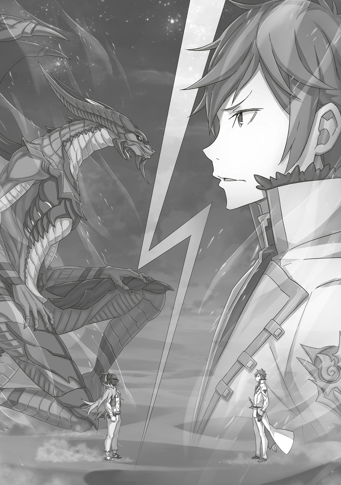

…Двести восемьдесят девять раз.

После решающей схватки на него напал новый, неожиданно безжалостный враг, который непонятно как пережил потоп. И действовал он в одиночку, потому что больше некому было остановить мужчину в шлеме. Без вопросов и колебаний, враг много раз ломал ему шею, когда тот спускался по лестнице без сил.

— Ну ты даешь, маленькая мисс.

Он мог только догадываться, сколько тяжелых тренировок ей пришлось перенести, чтобы достичь такого мастерства в своем-то возрасте. Он слышал, что она — близнец, но была ли ее сестра такой же сильной? …Даже если Альдебаран не спросит сейчас, очень скоро он узнает об этом на деле, ведь теперь весь мир ополчился против него.

— …Кх.

Раздался легкий вздох: ее тонкая рука не смогла сломать позвонки Альдебарана, ведь, когда она попыталась ударить его сзади, он закрыл шею камнем. Но враг не собирался отступать. Как только она поняла, что атака провалилась, то метнулась к Альдебарану с левой стороны и попыталась ударить его сбоку. Этот мощный удар, усиленный «Методом Потока», должен был пробить бок мужчины в шлеме, проскользнуть через ребра и вырвать его сердце; удар, который контрастировал с ее милыми руками. Даже если бы она не убила его сразу, боль все равно была бы мучительной. Именно поэтому…,

— А-айгх!

Не успела девочка нанести удар, как Альдебаран вытянул руку с глиняным протезом, схватил ее за два пучка волос и с силой прижал к стене. В следующую секунду его каменная рука превратилась в грязь и приковала ее к стене. С прикованными руками и ногами, но свободной головой… Флам посмотрела на Альдебарана,

— Я слабее тебя, маленькая мисс. У меня нет ни таланта, ни способностей, ни одной руки, шлем мешает мне видеть, а еще я устал от бесконечных боев. …Это моя победа.

— Ал-са…

— Цыц.

Он щелкнул пальцами правой руки перед лицом Флам и закрыл ей рот каменным кляпом. Если бы только она могла двигать руками и ногами, то легко бы его вытащила. И вот, наконец, можно сказать, что еще одна проблема была решена.

— …

Альдебаран глубоко и протяжно вздохнул. В его вздохе не было ни капли облегчения; скорее, в нем была подавленность, он совсем не радовался победе. Если представить это как подъем на гору, то это было еще только начало. Даже самый позитивный человек не стал бы радоваться в самом начале. Не говоря уже о том, что радоваться мужчине в шлеме было нечему.

— Даже если вы так на меня смотрите, маленькие мисс, я не буду оправдываться.

Тут Альдебаран обернулся и посмотрел на двух девушек, которые молча стояли в коридоре четвертого этажа.

…В миндалевидных глазах первой была холодная враждебность, а в круглых глазах второй — срочность.

— Эта мисс очень злится, так что не мог бы ты не подхо~дить?

Когда Альдебаран повернулся к ним, девочка с косой… Мейли шагнула ему навстречу. На ее голубых волосах сидел Зверодемон, который иногда появлялся во время их путешествия. Его хвост светился и выглядел угрожающе. Конечно, он был опасен только если укусит в жизненно важную точку, но…

— Ну, я понимаю, что ты не хочешь, чтобы я к вам подходил. Но я ничего не собираюсь с вами делать, маленькие мисс.

— Ты ведь нас искал, д~а? С чего бы нам тебе вер~ить.

— Это правда, но все не так, как вы думаете.

В ответ на холодное отношение Мейли Альдебаран поиграл пальцами по краю шлема, тщательно подбирая слова. Тут девушка, которая все это время тихо смотрела на них, сказала: «Зачем…» и,

— Зачем же вы тогда к нам пришли, Ал-сан?

…Петра задала вопрос твердо, не отводя взгляд, из-за чего Альдебаран замолчал.

— …

Мейли, как бывшая наемная убийца, уже привыкла к жестокостям, но было удивительно видеть, насколько жесткой стала Петра, ведь раньше она была простой деревенской девочкой, которая хотела стать служанкой. Альдебаран выбрал момент, когда все были расслаблены, и осуществил свой план так, чтобы никто не заметил. Петра и остальные не знали, что происходит. Наверняка в ее маленькой голове крутилось множество вопросов и волнений, которые хотели вырваться наружу криком или слезами. …Но Петра держала это в себе.

— Я сделал, что хотел. Мне больше нечего здесь делать. Я пришел попрощаться.

— Попрощаться…?

— Гарфиэль и Эццо без сознания на вершине башни. Они выживут, если ты поспешишь их вылечить.

— …Ах.

От эгоистичных слов Альдебарана Петра напряглась и приготовилась к бою вместе с Мейли. Но решимость девушек ослабла, когда он упомянул самый верхний этаж башни. Альдебаран не собирался их жалеть.

— И что дальше? Будете со мной драться? Если постараетесь, может, и победите… Но если проиграете, те двое тоже умрут.

— Вы… Вы трус…!

— Да, знаю, и за это я ненавижу себя до глубины души.

После того как Петра сурово посмотрела на Альдебарана, он осудил себя за то, каким плохим взрослым стал. Но на деле именно такие отвратительные и трусливые взрослые всегда побеждали. …Умная и смелая Петра быстро оценила риски. Она не могла позволить, чтобы Гарфиэль и Эццо погибли, если начнет драку с нулевыми шансами на успех.

— А где сей~час братец и Беатрис-чан?

— Они спят, как младенцы. Они такие добрые, и очень друг другом дорожат. Я не стал их разлучать, потому что это разбило бы мне сердце.

Альдебаран ответил Мейли, которая вместо Петры спросила о Субару и Беатрис. К сожалению, он не собирался говорить им больше. Если Гарфиэля и Эццо спасут, они все равно узнают. Он не хотел провоцировать Петру и Мейли. Даже если Альдебаран мог использовать расширение территории и разобраться с этим, он очень устал.

— Эй, вы хоть и сказали не подходить, но там же выход. Мне нужно туда.

Альдебаран поднял руку и медленно двинулся к девушкам. Он хотел показать, что не собирается им вредить, поэтому не опускал ладонь.

— …

Петра и Мейли молча уступили дорогу Альдебарану. Когда он проходил между ними, лишь багровый скорпион клацал своими клешнями, казалось, возмущаясь за обеих девушек…,

— Знаешь, Ал-сан, а я ведь за эти три дня хотела помочь тебе всем, чем бы только смогла.

— …

— Я ненавижу тебя.

Среди всех ран, которые Альдебаран получил в Сторожевой Башне Плеяд, надрывный, вымученный голос девушки был самой тяжелой.

△ ▼ △ ▼ △ ▼ △

Когда Альдебаран спустился ко входу в башню, там шла душераздирающая битва, совсем не похожая на ту, что была с Петрой и Мейли на четвертом этаже. В ней участвовал черный земляной дракон, Патраш, которая привезла их группу сюда вместе с Альдебараном. Однако теперь она сражалась против…,

— «Привет, я. Сделал, что хотел?»

Громадная форма жизни заговорила с ним, но ее голос, хоть и был торжественным и тяжелым, совсем не звучал серьезно. Спокойно открыв одной рукой большие ворота башни, Альдебаран увидел «Дракона» с сияющей голубой чешуей. Раньше его звали Волканикой, а теперь — «Альдебаран».

— …ДОДОГЮЮЮН.

Патраш продолжала рычать, сражаясь с «Альдебараном». Если честно, все спутницы Субару были психически ненормальными. …Да и вообще, все женщины, которых Альдебаран встречал, казались примерно одинаковыми. И только одна из них была слабой.

В любом случае…,

— Эй, «Дракон», прекращай издеваться над слабыми. Ты и так с виду чокнутый, а так еще чокнутее.

— «Не называй меня чокнутым. Если я чокнутый, то ты тем более. Люди, даже если о таком и думают, все равно не делают. …Я про то, что ты подчинил «Божественного Дракона».»

С новым голосом и внешностью, к которым он не привык, «Альдебаран» говорил, шевеля крыльями. В ответ на его слова Альдебаран просто пожал плечами. Даже если бы его назвали чокнутым психом, это была отчаянная стратегия, которую он выбрал, потому что мог. Поскольку «Альдебаран» тоже был Альдебараном, можно было не сомневаться, что он поступил бы так же, поэтому говорить такое было глупо.

— «Прости, наземный дракон-чан, но советую тебе прекратить. Если тебя убить, ты не сможешь спасти своих друзей из Песчаного Моря.»

— …

— «Что?»

— Ничего, просто подумал, что ты и правда я. Даже угрожаешь так же.

Чтобы остановить Патраш, «Альдебаран» использовал ту же логику, что и Альдебаран с Петрой и Мейли; он и не знал, что думать по этому поводу.

Как бы то ни было…,

— Ты летать-то умеешь?

— «Ну… Думаю, да. Но учти, что я еще привыкаю.»

— Звучит как-то совсем уж ненадежно…

Тут Альдебаран залез на хвост «Альдебарана» и запрыгнул ему на спину. Мужчина в шлеме немного беспокоился. Уцепившись за выступ на чешуе «Дракона», он крикнул: «Погнали!».

— «…Лифт оф*!»

* Lift off — взлет/взлетаем.

В следующее мгновение «Альдебаран» издал задорный рык и взмыл в небо. «Дракон» разбросал песок сильным ветром и быстро поднялся на высоту самой верхней части Сторожевой Башни Плеяд. Оттуда он начал удаляться прочь. Тут Альдебаран оглянулся на тех, кого оставил в башне…,

— «Ты что, сожалеешь?»

— Да. Если говорить о сожалениях, то у меня они были еще четыреста лет назад.

Когда над ним посмеялся он сам, Альдебаран цокнул языком. «Альдебаран» хотел сказать, что нельзя оглядываться назад, — и он был полностью прав. Если снова представить это как гору, он все еще находился только в начале пути. Теперь, стремясь к звездному свету за пределами миллиарда, который он решил достичь любой ценой, Альдебарану нельзя было ошибаться.

— «Да не парься ты. Я ж теперь с тобой. Со мной лучше, чем без, ведь так?»

Пока его крылья рассекали ночное небо над Песчаным Морем, «Альдебаран» говорил с хорошим настроением. В нем были «Воспоминания» из «Книги Мертвых», но этот оптимизм, скорее всего, шел от того, что он получил новое тело. Слишком пессимистичным быть тоже не стоило, ведь Альдебаран получил поддержку, о которой можно было только мечтать.

Оставалось…,

— …Вам следует остановиться.

△ ▼ △ ▼ △ ▼ △

…В тот момент, когда он уже собирался прикинуть свои дальнейшие действия, его пронзил свет.

— …

С силой рухнув на Песчаное Море в эту прохладную ночь, «Дракон» медленно поднялся. Альдебаран, который спрятался в его крыльях, покачал головой и спустился на песок. Вдруг в поле зрения мужчины в шлеме и «Дракона» появился он.

— …

С волосами красными, как пламя, с глазами голубыми, как небо, в одежде безупречно белой, как и подобает его взглядам, рыцарству. Ведь он — избранный мира сего…,

— Флам благословлена «Божественной Защитой Телепатии». Она и ее сестра, Грассис, могут общаться на расстоянии в любое время, пусть и раз в день.

Он честно объяснил, что здесь делает. Избранный проявил внимание и сочувствие к растерянному мужчине, который попал в неожиданную ситуацию.

— …Спасибо за объяснение. Ты, наверное, уже привык к тому, что на тебя жалуются, да?

— Для начала я хотел бы разобраться в ситуации. …У меня много вопросов.

— …

— Советую сразу же сдаться. Я бы не хотел вас убивать, по возможности.

Молодой человек, который держал руку у «Меча Дракона» на поясе… Райнхард ван Астрея величественно заявил об этом перед Альдебараном и «Альдебараном».

— …

Его достойное поведение и храбрая поза — он сиял даже в царстве ночи… этому человеку, которому суждено было стать Героем, Альдебаран, в котором уже давно угасли Героические Грезы, хотел кое-что сказать.

Он уже давно говорил все, что хотел, поэтому…,

— Хватит строить из себя непойми кого, Герой. Я все равно выиграю. Тебе выпали плохие звезды.

Смотря на звездное небо над бескрайним морем песка, Альдебаран столкнулся с Райнхардом.

…Это было непримиримое столкновение между тем, кого любил мир, и тем, кого он ненавидел.
