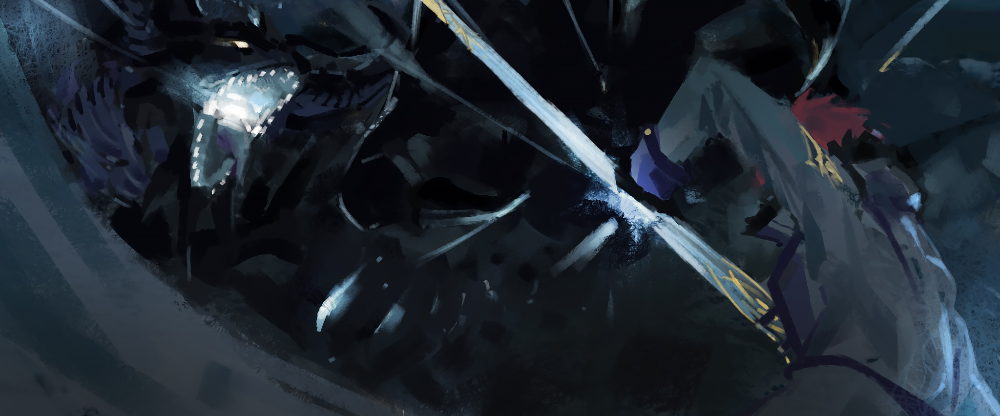
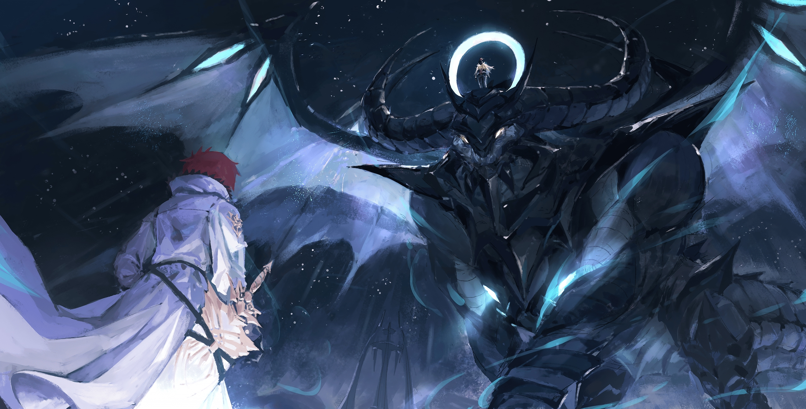
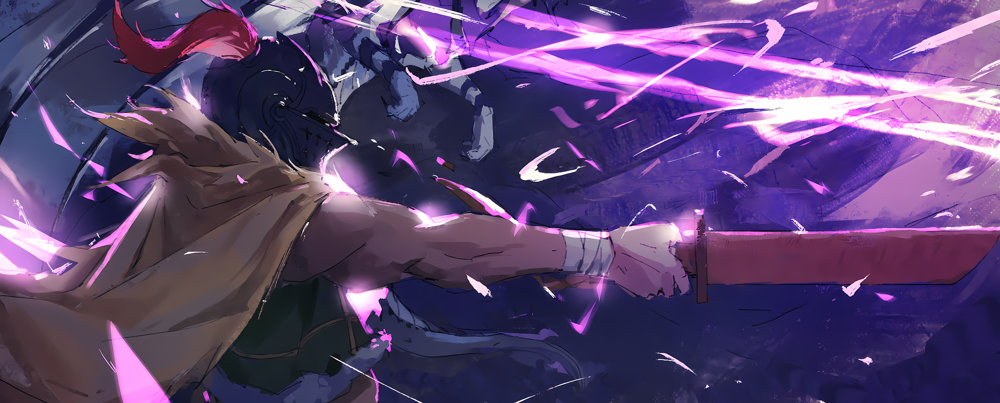
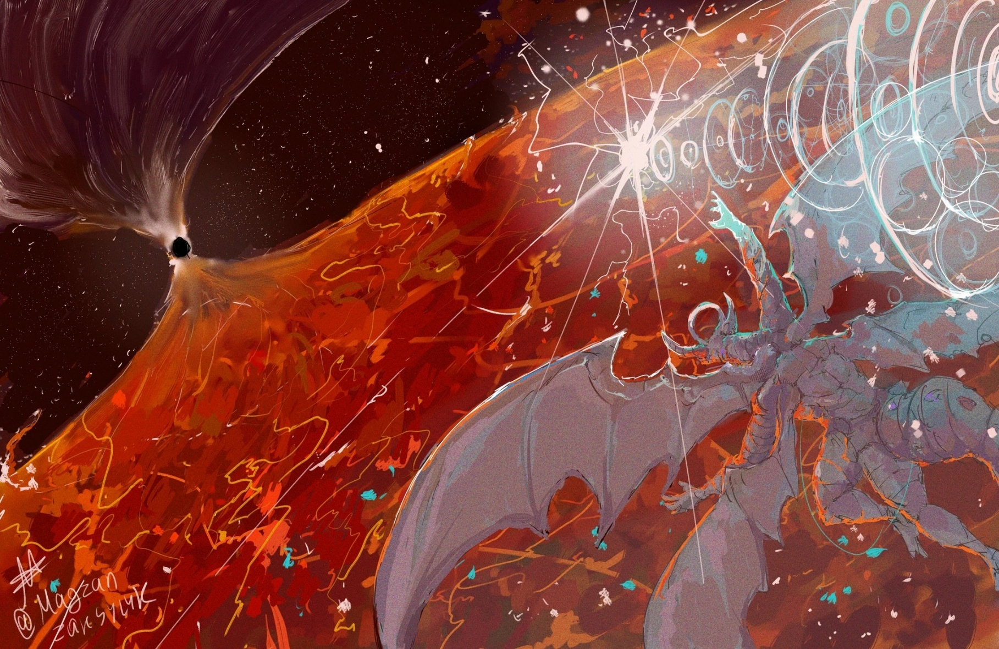
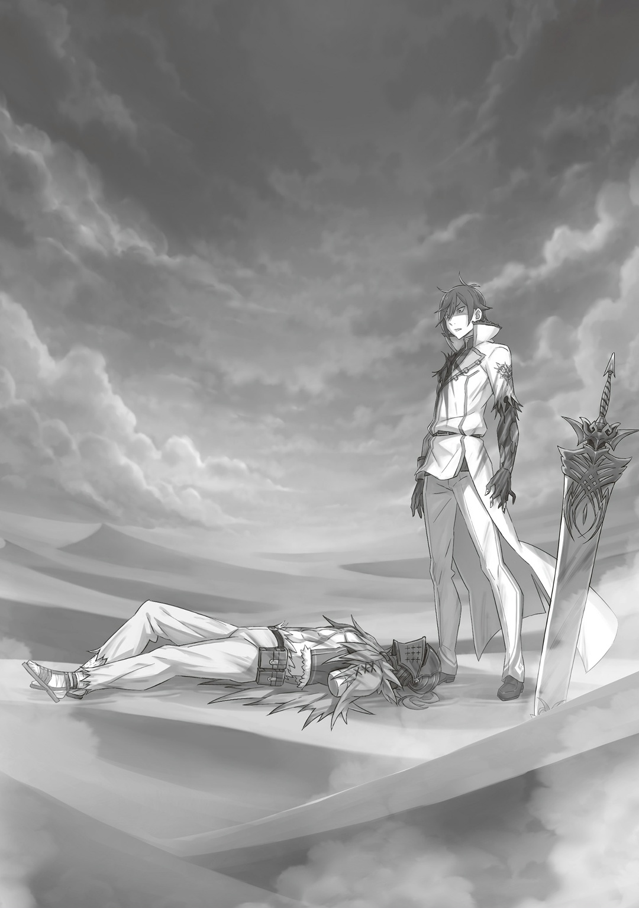

— …

Волосы цвета яркого пламени, глаза цвета ясного неба; он был Героем до мозга костей, избранным. Воистину, его рождение благословил сам мир.

Две полные противоположности стояли в центре холодного Песчаного Моря. Грозный Райнхард окинул взглядом Альдебарана, у которого волосы тут же встали дыбом.

…«Святой Меча», Райнхард ван Астрея. И говорить не стоит, что в Королевстве Лугуника… да что там, во всем мире ему не было равных — вот почему для Альдебарана он был одним из двух худших врагов, страшным сном. Второй — Нацуки Субару, но он успешно устранил его Оль Шамаком, прихватив еще и Беатрис.

…Райнхард ван Астрея не имел себе равных. «Синяя Молния» Сесилус Сегмунт был быстрее; Халибель «Хвалитель» был искуснее в техниках; «Безумный Принц» Вейг А́дгард был дальше от смерти; Четыре Великих Духа имели больше маны; Архиепископы Греха обладали абсурдными Полномочиями; «Ведьмы» Греха забрали больше жизней; хорошие люди лучше лгали; плохие люди лучше стояли на своем. Много кто превосходил Райнхарда в чем-то одном, но, тем не менее, он все равно оставался сильнейшим.

…Этого человека Альдебаран и должен был победить.

— Плохи дела.

— «Поздняк уже жаловаться на карты. Просто используй меня, как джокера.»

— …Что можешь сказать о «Святом Меча», «Драконий» я?

— «Да то же самое, что и ты, человечий я… Хотелось бы мне так сказать, но в этом теле я хорошо чувствую его силу. У нас все даже хуже, чем ты думаешь.»

За спиной Альдебарана стояла высшая форма жизни, которая щурилась золотыми глазами на Райнхарда… «Божественный Дракон» Волканика, а точнее — его пустая оболочка, в которую вложили «Воспоминания» Альдебарана. Для беспомощного мужчины в шлеме этот «Альдебаран» был настоящим спасением. Они разделяли одни и те же идеи, знания и мысли. Поэтому Альдебаран будет играть во всю, выжмет максимум, откинет всякую сдержанность. И вот, когда он закончил перебирать карты в руке…,

— …Из рода «Святых Меча», Райнхард ван Астрея.

— …

Альдебаран сузил глаза, по его телу прошла дрожь. Для воинов этого мира объявлять свое имя и титул перед противником было обычной вежливостью, так делали даже Архиепископы Греха. Кто-то — чтобы отстоять свою гордость, кто-то — из уважения к противнику, кто-то — чтобы почувствовать превосходство, а кто-то — чтобы не трусить; у всех разные причины.

По взгляду Райнхарда можно было легко понять, что представился он из уважения к Альдебарану.

…«Святой Меча» знал о том, что случилось в башне, но такая вот уж у него была черта, можно сказать, пропасть между ним и другими. Альдебаран ему об этом не скажет, однако…,

— Архиепископ Греха Культа Ведьмы, представляющий «Гордыню», Страйд Волакия.

— …Кх.

— Шучу.

…Таким образом, Альдебаран вытер ноги об уважение противника.

— «…РЫЫЫАААА!!!»

От такой грубости Райнхард расширил глаза; неуклюжий рев создал белый свет, который понесся к «Святому Меча». Атака крайне неудачная, видно, что «Альдебаран» еще не привык к новому телу… даже так, она была очень мощной. Для сравнения, прошлое дыхание можно было назвать лишь чихом, Эццо и Гарфиэлю повезло.

В следующий миг Райнхарда накрыл белый свет, изменивший Песчаное Море навсегда. Это, конечно, его не убьет, но, если не пытаться, ничего и не выйдет. Поэтому…,

— «…Кх, отступай, я!!!»

— Гха-а-а-а-а!?

Из свежего кратера повалил белый дым; «Альдебаран» ловко подцепил Альдебарана когтем и отбросил в сторону. Мужчина катился по ровному песку, пока, наконец, не остановился. Затем он стряхнул грязь со шлема, поднял голову и… понял, что «Альдебаран» его защитил: Райнхард должен был пострадать от мощного дыхания, но остался цел и молниеносно прыгнул к «Дракону». Так началась битва двух монстров.

— «У тебя нету ожогов!? Как так!?»

— Позаимствовал силу «Меча Дракона». Даже когда наш мир погибнет, этот меч не пропадет. Так его выковали. Им я и парировал твою атаку.

— «А кажется, что это больше твоя заслуга, чем меча! И ты так и не объяснил, почему не обжегся!»

— «Божественная Защита Загара».

С безразличным ответом Райнхард крутанулся в воздухе и нанес удар ногой, который «Дракон» сразу же встретил когтем. Раздался звук, как от пушечного выстрела или салюта. Последующие удары были такими же мощными. Мало кто в мире мог бы дать здесь какой-то бой, но для «Святого Меча» и «Дракона» такие атаки были обычными. Они сражались без передышки.

— В какую же херню я все-таки вляпался, кха-а-а-а…!

Череда быстрых атак; череда мощных взрывов; череда ударных волн. Все это сдувало и песок, и Альдебарана, который отчаянно пытался ухватиться хоть за что-нибудь. Спрятаться было негде — бой двух сильнейших существ этого мира делал любое укрытие опасным. Убежать тоже не вариант. …Есть предел обновлениям матрицы.

Если уйти слишком далеко от заданной матрицы, Территория рухнет, и жалкий Альдебаран потеряет последнее преимущество перед Райнхардом.

— …Сильный, но раньше ты был сильнее.

После серии ударов по врагу Райнхард отступил и с серьезным видом заговорил. Отдышки ни у одного из них не было, они еще не устали. «Альдебаран» удивленно издал «А?», на что Райнхард, положив руку на рукоять «Меча Дракона», покачал головой и сказал: «Ничего» и,

— Недавно, вместе с Флам, Эццо-доно и остальными, я приезжал в Сторожевую Башню Плеяд, и тогда, из-за недоразумения, повздорил с тобой… с «Божественным Драконом» Волканикой. Если сравнить, сейчас твои движения и намерения другие.

Когда «Святой Меча» отметил это, «Альдебаран» просто промолчал.

Тогда Райнхард сражался с настоящим Волканикой… правда, тот был лишь «Драконьей» оболочкой, которая продолжила свой род.

Если сравнивать того Волканику с нынешним, можно было заметить большие перемены. Райнхард продолжил,

— Сейчас ты слабее. Почему?

— «…Гх.»

— …?

— «Нет-нет, нет, нет-нет, нет-нет-нет, вопрос вполне закономерный. Говоришь, типа я подрастерял в силе, да? Это логично, ведь тогда все сходится. Вот почему…»

Тут «Альдебаран» замолчал и оскалился в ехидной улыбке, которую даже на морде «Дракона» можно было легко распознать,

— «Я хочу тебе кое-что показать.»

Следом он взмыл в воздух и рванул к Райнхарду, стремясь раздавить его своими крыльями. Из-за такой явной атаки «Святой Меча» совсем забыл, что песок это не место, где можно твердо стоять… впрочем, «Божественная Защита Игр с Песком» решала эту беду. Поэтому Райнхард легко проскочил между крыльями «Альдебарана» и ударил его туда, где у человека было бы солнечное сплетение.

— «Гхкх…!!!»

«Святой Меча» поставил одну ногу на песок, а вторую впечатал во врага. «Альдебаран» полетел вверх; Райнхард прыгнул следом… даже выше. Он коснулся «Дракона» пальцами ног и остановил его движение вверх.

— Извини, но так нужно.

Райнхард стоял на спине «Альдебарана», занося руку для удара карате, который был острее и смертоноснее любого меча. Казалось, что он легко отрежет «Божественному Дракону» хвост, однако…,

— «Сказал же, что хочу тебе кое-что показать… Подожди еще чуток.»

«Альдебаран» успел зарычать перед тем, как вкусить удар карате. Услышав в его рычании горечь и коварство, Райнхард нахмурился. И вот, глядя на высших существ с земли, Альдебаран сказал:

— …Время плана А.

— …Кх.

Райнхард никак не мог услышать голос Альдебарана. С другой стороны, было бы не удивительно, если бы он его все-таки услышал. Но сейчас нет смысла выяснять, так это или не так.

…Ведь свет звезды, которая мерцала в ночном небе, устремился прямо к «Святому Меча».

△ ▼ △ ▼ △ ▼ △

…Аль Шарио — это заклинание, которое считалось особенностью «Ведьмы» былых времен и входило в число запрещенных техник. Звезды на небе — гигантские куски маны, поэтому с помощью притяжения маны одного типа можно было сбросить одну из них на землю. Однако для этого требовался не только высокий контроль над магией, но и невероятное количество маны, чтобы направить ее в нужное место. Сложность заклинания оправдывалась его мощью: количество маны в свете звезды могло сравниться с Великим Духом. Поговаривали, что с помощью Аль Шарио однажды был уничтожен целый вейр «Драконов». Это заклинание превосходило даже «Драконье» дыхание, а потому считалось одним из самых разрушительных.

— Магия — это чудесная способность воплощать в реальность все, что только придет в голову. Создание заклинания, которое затмит даже дыхание «Дракона», неизбежно, если учесть, что есть те, кто хочет его превзойти. Ну разве не прекрасно, что люди такие «Жадные»?

Так однажды сказала Альдебарану самодовольная «Ведьма» с белыми волосами. Он до сих пор злился, вспоминая ее лицо, но верил, что она не врала. «Ведьма» показала ему все на деле. Это было нечто, что превосходило даже дыхание «Дракона», и стояло во главе всех разрушений человечества.

— Дрянь.

Все можно было улучшить с помощью новых идей и магии. Аль Шарио не исключение. Мужчина в шлеме, скрежеща зубами, вспоминал наставления «Ведьмы» и жаждал использовать силу звездного света. …Альдебаран не хотел признавать, но обучаясь у «Ведьмы», он получил множество знаний, в том числе и магических. Но, даже если бы он освоил все теории и методы, ему не хватало таланта. Это было похоже на то, как если бы человек умел нагревать воду, но не мог наполнить даже чашку. Так зачем же тогда «Ведьма» передала Альдебарану эти знания? Неужели она просто хотела похвастаться? Или, может, даже если магия ему не по силам, она надеялась, что он сможет использовать их, чтобы преодолеть трудности? Но все это было лишь следствием истинной цели «Ведьмы»…,

— «…Аль Шарио.»

«Дракон» поднялся в небо и произнес заклинание, чтобы сбросить звезду в Песчаное Море. В Волканике не было души, но он все еще обладал большой силой… Теперь «Альдебаран» хранил свои «Воспоминания» в «Драконьей» оболочке, поэтому мог раскрыть давно забытые сокровища «Ведьмы». Другими словами, именно с этой целью она и наделила его знанием. Сочетание знаний и «Драконьей» оболочки станет тем, что поможет Альдебарану и «Альдебарану» пройти через стену из миллиарда кирпичей.

— …

Глядя на небо со спины «Дракона», даже Райнхард удивился. Звездный свет был таким же мощным, как тот, что выпустила Сфинкс в Империи Волакия, где уже были предвестия конца света. После всех грязных приемов она использовала эту запрещенную технику. Альдебаран дрожал, видя, как «Дракон» выполняет ее без какой-либо помощи, но продолжал следить за Райнхардом в небе. Он не верил, что от Аль Шарио невозможно защититься. «Синяя Молния», которого считали равным «Святому Меча», сразил падающую звезду одним взмахом катаны. Звезда была уничтожена мастерством Сесилуса и силой «Меча Грез»; Альдебаран не думал, что Райнхард повторит его подвиг, но недооценивать его было нельзя. Поэтому…,

— «О, ООООО…!!!»

Прежде чем Райнхард успел что-либо сделать с падающим светом, «Альдебаран» зарычал, развернулся в воздухе и ударил его крылом. «Святой Меча» встретил удар локтем и коленом, но цель «Дракона» была не навредить, а просто оттолкнуть его в сторону звезды.

— «…РЫААААА!!!»

Райнхард мог передвигаться по воздуху, используя облака как опору благодаря Божественной Защите. Но не успел «Святой Меча» восстановить равновесие, как рев «Альдебарана» сдул все облака поблизости и запустил его в небо. Без опоры и пути для отступления Райнхард оказался под звездным светом. В такой ситуации, куда хуже, чем у Сесилуса, он не справится с мощью звезды…,

— …Получено.

Райнхард вытянул ногу, чтобы коснуться пальцем звезды. Взрыв тут же поглотил «Святого Меча»… так должно было быть, но никакого взрыва не случилось.

Он просто остановил звезду.

— Что… — «…за бред?!»

Уклониться или принять удар… Райнхард выбрал ничего из, а сделал невозможное. Голоса Альдебарана и «Альдебарана» эхом разнеслись по Песчаному Морю. К их удивлению, «Святой Меча» поднялся по краю звезды, встал на ее вершину и сказал:

— «Божественная Защита Равновесия на Шаре».

— «Равновесия на шаре…?» — Для тебя это что, просто огненный шар?!

Альдебаран потерял дар речи, глядя на свет разрушения, который «Святой Меча» принял за огненный шар. Но вскоре это молчание сменилось ужасом. Если «Божественная Защита Равновесия на Шаре» соответствовала своему названию, то можно вспомнить, что акробат в цирке не просто стоял на шаре, но и управлял им, как захочет…,

— «Какая же все это чушь.»

Райнхард стукнул ногой по звезде: в следующий миг она изменила траекторию и направилась к «Альдебарану». В ответ «Дракон» заворчал и встретил атаку мощным дыханием.

— …

Через секунду яркий багрово-белый свет залил небо. Ночь на время исчезла. Звезда должна была поразить Райнхарда, но все пошло не по плану: она взорвалась, разлетевшись на множество сверкающих осколков, которые взрывали все Песчаное Море.

— Гха, гхх…

Разумеется, Альдебарана задело, все его тело обожгло, он упал на песок. Вскоре мужчина в шлеме услышал гул, который отличался от звука падающей звезды. С трудом повернув голову, он увидел «Альдебарана» с одним сломанным крылом и другим отрубленным… «Дракон» беспомощно лежал на земле. А затем…,

— Очень жаль, что до этого дошло.

Грустный Райнхард шагал к мужчине в шлеме. «Святой Меча» никак не пострадал от разрушительного света звезды. Альдебаран слышал, что Архиепископ Греха «Жадности» однажды убил Райнхарда, но как? Здесь он уже ничего не изменит. «Святой Меча» всегда правильно оценивал ситуацию. …И вот, мужчина в шлеме проиграл уже в восьмитысячный раз. Однако…,

— …Пробуем еще.

В эту секунду позади Райнхарда «Альдебаран» приподнял голову и выпустил слабое дыхание, подобие своей былой мощи. «Святой Меча» не мог закрыть на это глаза и просто уклониться. …Ведь Альдебаран находился прямо на линии огня.

— Не позволю…!

Райнхард развернулся, вытащил все еще горячий «Меч Дракона» и с размаху нанес удар. Его голос был полон негодования, а сердце — гнева, ведь «Альдебаран» решил пожертвовать своим союзником.

Как мило с твоей стороны, в следующий раз я этим воспользуюсь. …С такими мыслями мужчина в шлеме развернул упаковку с ядом.

— Подож-…!

Райнхард сразу заметил, что что-то не так, обернулся и помрачнел: Альдебаран бился в судорогах, из его рта шла кровавая пена, а сознание уплывало в другой мир…,

× × ×

— …Вам следует остановиться.

Величественный голос прорезал холодное небо; луч света пронзил летящего «Дракона». Все тело Альдебарана зазвенело. Машинально, после сотен падений насмерть, он уцепился за выступ на спине «Дракона», чтобы не сделать прыжок с парашютом без самого главного… парашюта. Вместе со своим единственным союзником мужчина в шлеме упал на песок, а затем…,

— Советую сразу же сдаться. Я бы не хотел вас убивать, по возможности.

— Хватит строить из себя непойми кого, Герой. Я все равно выиграю. Тебе выпали плохие звезды.

…Уже в восемь тысяч четыреста шестьдесят седьмой раз началась битва Альдебарана.

△ ▼ △ ▼ △ ▼ △

…Битва с Райнхардом ван Астрея началась в ночном небе над Песчаными Дюнами Аугрии. «Дракона» пронзил яркий свет, отчего он полетел вниз. Альдебаран совсем не удивился, ведь знал, что этот день однажды настанет. Но мужчина в шлеме все равно думал, что наступил он уж слишком рано, он хотел сразиться, когда не будет так измотан. …Ответы Альдебарана были решительными только до тех пор, пока он не услышал «Вам следует остановиться» в сотый раз. После восьмитысячного повторения этих слов его былая смелость исчезла.

К слову, в начале он слышал «Вам следует остановиться» сотни-сотни раз, пока крылья «Дракона» не опустили его на Песчаное Море. До этого Альдебаран неудачно приземлялся, что снова и снова возвращало его к «Вам следует остановиться».

— У меня словно груз с плеч упал, когда я наконец понял, что это говорит Райнхард…!

Не знать, кто на тебя нападает, не очень хорошо для психики. Впрочем, для Альдебарана физическая боль была не самой страшной. Он боялся не столько телесных повреждений, сколько душевных. Когда Альдебаран понял, кто именно повторял «Вам следует остановиться», он будто из лабиринта выбрался. Но радость длилась недолго.

— Хорошо, что, хотя бы, это не софтлок 15 .

У Полномочия Альдебарана есть слабость — ее можно безвозвратно установить перед самым тупиком. До сих пор он чудом ни разу не ошибся, однако это не гарантировало, что так будет всегда. Поэтому каждые пятнадцать секунд он определял и переопределял матрицу. Благодаря этому он вернулся прямо перед словами: «Вам следует остановиться», но если бы точка возврата стояла после «Вам следует», то все начиналось бы с «…остановиться», и изменить это было бы уже нельзя. После обновления матрицы путь назад закрывался навсегда, так что у Альдебарана не оставалось выбора — нужно победить Райнхарда, используя матрицу, которая начиналась со слов «Вам следует остановиться». Таким образом, он слышал эту фразу уже восемь тысяч раз. Эта битва напоминала подъем на неприступную гору с черепашьей скоростью, но с «Альдебараном» у него оставалась возможность дать какой-никакой бой «Святому Меча». Чтобы победить врага, Альдебаран всегда раскладывал его на составляющие. Если понять, из чего состоит противник, можно легко раскрыть его суть. Райнхард был сильнейшим не просто так. …Было то, что делало его таким. Поэтому Альдебаран разложил «Святого Меча» на три составляющие: «Сердце, Технику и Тело».

Тело. …Райнхард обладал невероятной физической силой, и дело тут не в Божественной Защите. Его уникальный Од распространял ману внутри и снаружи тела без малейших потерь, и для этого ему ничего не нужно было делать. Существует техника под названием «Метод Потока», которая усиливает тело с помощью манообращения, обычно для ее освоения требовались талант и годы упорных тренировок, но Райнхард от рождения имел «Избыточный Круговорот Маны», а потому был сильнее всех остальных. Его дыхание в сотни раз превосходило глубокий вдох обычного человека.

Техника. …После восьми тысяч попыток Альдебаран понял, что у Райнхарда по меньшей мере двести пятьдесят одна Божественная Защита. Среди них были как основные, вроде «Божественной Защиты Святого Меча», так и более полезные в бою, например, «Божественная Защита Опережения» или «Божественная Защита Уклонения от Стрел», а еще необычные, такие как «Божественная Защита Тумана» и «Божественная Защита Игр с Песком». Были и очень странные, например, «Божественная Защита Шнурков» и «Божественная Защита Многослойной Одежды». Райнхард обладал таким количеством мощных и редких Божественных Защит, что каждая из них могла бы стать достоянием для любой страны. Его умение приспосабливаться было настолько сильно, что, даже попав в ловушку для самой умной «Ведьмы» в мире, он бы легко из нее выбрался.

Сердце. …Слова о том, что он принадлежит к роду «Святых Меча», могли намекать на то, что Райнхард не считает себя образцом этого титула. Однако для тех, кто ему противостоял, его самоосуждение ничего не значило. Что бы он ни чувствовал, подвиги и преданность долгу делали Райнхарда настоящим «Святым Меча». И на врагов Королевства… да что там, всего мира — он глаза не закрывал. Райнхард ван Астрея нес долг «Святого Меча», он был винтиком в колесе, который создали для уничтожения врагов мира сего.

Такой был вывод Альдебарана после оценки «Сердца, Техники и Тела» «Святого Меча». Проще говоря, чтобы победить Райнхарда, нужно было разрушить каждую из этих частей. А значит…,

— …Вам следует остановиться.

С этими словами, когда свет пронзил «Дракона», началась очередная битва Альдебарана.

△ ▼ △ ▼ △ ▼ △

…Восемь тысяч восемьсот восемьдесят восемь раз.

— …Вам следует остановиться.

После стольких попыток Альдебаран понял, что для Райнхарда, который имел «Избыточный Круговорот Маны» в теле, Песчаные Дюны Аугрии — худшее место. Там было слишком много миазм, которые влияли на его силу. Другими словами, нигде в мире Райнхард не был так ослаблен, как здесь. Даже под сильнейшей гравитацией Аль Кларма, где давление было настолько высоким, что «Альдебаран» едва мог его выдержать, Райнхард со всем справлялся. И все же в Песчаных Дюнах Аугрии сила «Святого Меча» не могла проявиться в полной мере.

— …Еще раз.

× × ×

…Десять тысяч двести двенадцать раз.

— …Вам следует остановиться.

С помощью преломления света удалось скрыть то, что все вокруг затянуло ледяной стеной. Герметичное пространство изо льда наполнилось туманом, и, когда вода в нем испарилась, случился взрыв. Райнхард не мог предвидеть разгерметизацию из-за парового взрыва, так как такое явление еще мало изучали в этом мире; это была атака, сочетающая магию и науку. План заключался в том, чтобы одновременно обмануть «Божественную Защиту Уклонения от Огня» и «Божественную Защиту Уклонения от Воды», используя не обычный огонь или воду, а взрыв пара; однако, получив «Божественную Защиту Игр с Огнем», делающую взрывы безвредными, и «Божественную Защиту Игр с Водой», устраняющую урон от воды, он приспособился даже здесь.

— …Еще.

× × ×

…Шестнадцать тысяч восемь раз.

— …Вам следует остановиться.

Перепад температур между магией Огня и Воды создал грозовые облака, а магия Ветра и Земли напитала «Меч Дракона» электричеством. В Райнхарда с невероятной скоростью начали бить молнии, от которых ему было не уклониться. Это чем-то напоминало Сесилуса, Альдебаран уже привык видеть такие скорости, когда был в Империи. Но Райнхард с помощью «Божественной Защиты Грозовых Облаков» справился и с этим. Хотя молнии ему ничего не сделали, они сильно намагнитили «Меч Дракона», поэтому Альдебаран перешел к следующему этапу. …Используя магнитную силу, он обездвижил Райнхарда горсткой песка, богатого магнетитом. Но и эта атака была блокирована «Божественной Защитой Игр с Песком» и «Божественной Защитой Скольжения по Грязи». Альдебаран снова проиграл.

— …Дальше.

× × ×

…Шестьдесят четыре тысячи семьсот девяносто девять раз.

— …Вам следует остановиться.

Предыдущая неудача заставила Альдебарана забыть о том, что должно было укорениться в его голове. Мужчина в шлеме не зацепился за выступ на спине «Дракона»; его швыряло из стороны в сторону, он потерял лево и право, просто летел вниз. Вдалеке послышался рев «Дракона», который не успел поймать своего союзника. Альдебаран проверил рот языком — уже в десятый раз яд вырвался наружу. Падение с такой высоты точно убило бы его, но он все равно хотел избежать случая на миллион. Поэтому, чтобы перестраховаться, Альдебаран и проглотил яд. Прежде чем он упал на землю, его пронзила острая боль, от которой закипела кровь. Все вокруг помутнело и…,

— …Далее.

△ ▼ △ ▼ △ ▼ △

…Сто тридцать две тысячи сорок четыре раза.

— …Вам следует остановиться.

Снова и снова, снова и снова, снова и снова, снова и снова, снова и снова, снова и снова, снова и снова, снова и снова, снова и снова, снова и снова, снова и снова, снова и снова, снова и снова, снова и снова, снова и снова, снова и снова, снова и снова, снова и снова, снова и снова, снова и снова, снова и снова, снова и снова, снова и снова, снова и снова, снова и снова, снова и снова, снова и снова, снова и снова, снова и снова, снова и снова, снова и снова, снова и снова, снова и снова, снова и снова, снова и снова, снова и снова, снова и снова, снова и снова, снова и снова, снова и снова, снова и снова, снова и снова, снова и снова, снова и снова, снова и снова, снова и снова, снова и снова, снова и снова, снова и снова, снова и снова, снова и снова, снова и снова, снова и снова, снова и снова, снова и снова, снова и снова, снова и снова, снова и снова, снова и снова, снова и снова, снова и снова, снова и снова, снова и снова, снова и снова, снова и снова, снова и снова, снова и снова, снова и снова, снова и снова, снова и снова, снова и снова, снова и снова, снова и снова, снова и снова, снова и снова, снова и снова, снова и снова, снова и снова, снова и снова, снова и снова, снова и снова, снова и снова, снова и снова, снова и снова, снова и снова, снова и снова, снова и снова, снова и снова, снова и снова, снова и снова, снова и снова, снова и снова, снова и снова, снова и снова, снова и снова, снова и снова, снова и снова, снова и снова, снова и снова, снова и снова, снова и снова, снова и снова, снова и снова, снова и снова, снова и снова, снова и снова, снова и снова, снова и снова, снова и снова, снова и снова, снова и снова, снова и снова, снова и снова, снова и снова, снова и снова, снова и снова, снова и снова, снова и снова, снова и снова, снова и снова, снова и снова, снова и снова, снова и снова, снова и снова, снова и снова, снова и снова, снова и снова, снова и снова, снова и снова, снова и снова, снова и снова, снова и снова, снова и снова, снова и снова, снова и снова, снова и снова, снова и снова, снова и снова, снова и снова, снова и снова, снова и снова, снова и снова, снова и снова, снова и снова, снова и снова, снова и снова, снова и снова, снова и снова, снова и снова, снова и снова, снова и снова, снова и снова, снова и снова, снова и снова, снова и снова, снова и снова, снова и снова, снова и снова, снова и снова, снова и снова, снова и снова, снова и снова, снова и снова, снова и снова, снова и снова, снова и снова Райнхард повторял это в битве, которая длилась не дольше, чем две минуты, но с каждым разом Альдебаран узнавал и делал все больше.

— Хватит строить из себя непойми кого, Герой. Я все равно выиграю. Тебе выпали плохие звезды.

Альдебаран остановился перед Райнхардом, потянулся в карман, достал книгу и поднял ее над головой с раскрытыми вверх страницами. Это была «Книга Мертвых», которую он забрал из Сторожевой Башни Плеяд… книга Альдебарана. Если ее прочитает Райнхард, то потеряет душевное равновесие… к победе это все равно не приведет, ведь «Святой Меча» обладал «Божественной Защитой Кошмаров», которая защищала его разум. Полностью свести на нет воздействие Полномочия она, скорее всего, не могла, но все равно спасала Райнхарда. Мужчина в шлеме показывал свою «Книгу Мертвых» не только «Святому Меча», но и «Альдебарану».

— «Сопряжение завершено.»

«Альдебаран» опустил глаза на страницы влажной «Книги Мертвых»; ее содержание въедалось прямо в его мозг, загружая «Воспоминания». В этой книге записывались все ожесточенные сражения с Райнхардом, которые пережил Альдебаран. …Так он давал своему напарнику, который остался за пределами Территории, понимание происходящего. Сейчас не было ни одного успешного плана, но из всех неудач только знание причин их провала значительно улучшало мастерство «Альдебарана». Именно поэтому Альдебаран всегда внимательно следил за каждым сражением.

— …Меня можно победить только если я сдамся.

Такова была твердая уверенность Альдебарана, который продолжал пытаться. Я не остановлюсь, несмотря ни на что. …С такими мыслями я это и начал.

— …Из рода «Святых Меча», Райнхард ван Астрея.

Эти слова, как и «Вам следует остановиться», он слышал уже больше ста тысяч раз. Тут Альдебаран сделал глубокий вдох и сказал,

— Я… Звезда-Последователь.

Это заявление, которое, казалось, было сделано просто так, Райнхард воспринял всерьез и двинулся вперед. Расстояние между ними исчезло мгновенно. Несмотря на ослабление от миазм Песчаного Моря, «Божественная Защита Игр с Песком» позволяла ему игнорировать плохую опору, а «Божественная Защита Ночного Неба» давала ему силу в ночное время суток. Неся на поясе «Меч Дракона», Райнхард шаг за шагом приближался к «Альдебарану».

— «…РЫЫЫАААА!!!»

Получив «Воспоминания» о более чем ста тысячах сражений, отчаянный рев превратился в свет разрушения, который столкнулся с Райнхардом лоб в лоб. Дыхание «Дракона» не было магией или чем-то подобным — это был мощнейший поток маны, чистый и примитивный, уничтожающий все на своем пути. Он был настолько сильным, что мог стереть с лица земли Песчаное Море. От него не мог уклониться даже Райнхард. …Поэтому «Святой Меча» и не стал уклоняться.

— Ха…

В тот же миг вспышка, которая не уступала по силе дыханию «Дракона», рассекла свет пополам. Райнхард взмахнул «Мечом Дракона» Рейда, который оставался в ножнах. Сам легендарный клинок не коснулся воздуха, но, объединяя силу неразрушимых ножен и собственную мощь, «Святой Меча» разрезал дыхание «Дракона». И затем…,

— План Д, номер двадцать три!!!

— «…Аль Гоа.»

Альдебаран закричал, на что «Дракон» залил все вокруг огнем. Он знал, что рано или поздно ему предстоит сразиться с Райнхардом. …Именно поэтому Альдебаран подготовил множество планов на случай встречи со «Святым Меча» и поделился ими с «Альдебараном», передав все свои «Воспоминания». Между ними не было необходимости в долгих стратегических переговорах.

— …

Адская вспышка не превратилась в огненный шар, а охватила пламенем Песчаное Море. Все вокруг озарилось ярко-красным светом. Прохлада стала пылающим жаром. Пламя из маны «Дракона» было настолько мощным, что песчинки мгновенно расплавились и превратились в стекло. Это напоминало момент, когда звездный свет Аль Шарио разрушил Песчаное Море. Из различий — в этот раз разрушение было более впечатляющим, а из сходств — «Святой Меча» появился прямо из его центра…

— «Божественная Защита Уклонения от Огня».

Мужчина с огненно-красными волосами смело шагнул в огненно-красную атаку, которая превратила бы любое живое существо в пепел или, в лучшем случае, уголь. Райнхард взмахнул рукой и отогнал пламя, благодаря «Божественной Защите Уклонения от Огня».

Если бы огонь был сильнее, «Святой Меча» получил бы «Божественную Защиту Игр с Огнем», что позволило бы ему раскрыть все свои силы даже в аду. Но ни огненные атаки, которые сводила на нет «Божественная Защита Уклонения от Огня», ни изменения местности, которые останавливала «Божественная Защита Игр с Песком», не были настоящей целью Альдебарана. На самом деле…,

— …Кх.

Внезапно Райнхард, который стоял посреди пламени, нахмурился и схватился за горло. «Святой Меча» понял. …Понял, что не может дышать.

— «…РЫЫЫАААА!!!»

«Альдебаран» выпустил огненное дыхание. Перед мощью и взрывной силой белого света Райнхард не мог пошевелиться, отчего на лице его появилась решимость. Это был не взгляд раскаяния или боли, а взгляд того, кто приготовился к тяжелой битве.

— Наконец-то…

Альдебаран сжал кулак, ведь добился своего после десятков тысяч попыток. Чудо, которое поразило Райнхарда, случилось потому, что пламя выжгло весь кислород вокруг него. Из-за Божественных Защит стихии Земли, Воды, Огня и Ветра были бессильны против «Святого Меча», но он не должен был выжить без кислорода — это противоречило бы законам природы. …Так Альдебаран заставил «Святого Меча» стоять на месте.

— Попробуй понять, что я сделал, когда ты полный ноль в науке!

Простой магией или наукой Райнхарда не победить. «Святой Меча» подчинял их своей воле, но все-таки оказался бессилен перед явлением, про которое не знала даже благословляющая его Од Лагуна. Разрушив «Технику» чудом, против которого Божественная Защита не действовала, и ослабив «Тело» миазмами, Альдебаран лишил Райнхарда двух ключевых частей. И тогда…,

— План Л, номер двадцать девять!!! — «План Л, номер двадцать девять!!!»

Прекрасная возможность, чтобы атаковать. Пока «Альдебаран» удерживал Райнхарда на месте с помощью дыхания, Альдебаран использовал особую технику и влил в нее ману «Дракона». Размер Врат и форма Ода отличались как день и ночь. Тем не менее, это был секретный прием, который мог сработать только у Альдебарана с «Альдебараном», ведь у них одинаковый магический почерк, уникальный, как отпечаток пальца. В воздухе появилось два длинных цилиндра, которые покрылись фиолетовыми молниями. Они потрескивали, излучая бледно-голубой свет, и звучали так, будто воздух вокруг них нагревался. Цилиндры концами обратились к Райнхарду. По небу будто протянулись две магические рельсы. Другими словами, это был…,

— …Магический Рейлган.

Магическая рельсовая пушка со снарядами, которые не были ни огненными, ни ледяными, ни свинцовыми. С помощью дао Альдебаран соскоблил чешую «Дракона» для пуль, которые молниеносно полетели в Райнхарда. Каким бы быстрым ни был «Святой Меча», он не мог обогнать молнию. Альдебаран понял это за все попытки.

— …Кх!

«Божественная Защита Первого Взгляда» и «Божественная Защита Уклонения от Стрел» сработали одновременно. «Святой Меча» чутьем отреагировал на атаку, с которой столкнулся впервые, что привело к отклонению линии огня Рейлгана. Райнхард слегка наклонился вперед, отчего пуля пролетела мимо, оставив за собой гигантский полукруг в Песчаном Море. Тем не менее…,

— …Гха.

Из горла Райнхарда вырвался мучительный стон, его кровь брызнула фонтаном и разлетелась по Песчаному Морю. Рейлган не попал напрямую, а лишь задел его. Но даже небольшое касание такой силы может убить, Райнхард не остался бы цел.

Из правого плеча «Святого Меча» впервые за сто тридцать тысяч попыток потекла кровь, и тогда…,

— «Огонь!!!»

Магический Рейлган выстрелил второй раз, и чешуя «Дракона» пробила Райнхарда насквозь. Неизбежная ударная волна вызвала бурю в Песчаном Море, отчего Райнхард исчез. …Нет, он не исчез. «Святого Меча» унесло вдоль траектории пули. Даже Райнхард не мог противостоять силе и скорости прямого попадания Рейлгана. Впрочем, попадание не было прямым.

— …«Божественная Защита Второго Пришествия».

Райнхард сжал в левой руке «Меч Дракона» и снова встретил пулю ножнами. От удара «Святой Меча» сбился с ног, но смертельного урона избежал. …На самом деле, он не упал, а отскочил назад, чтобы рассеять выстрел Рейлгана.

— «…Аль Кларм!»

Как только «Альдебаран» увидел то же самое, что и Альдебаран, он произнес заклинание. За спиной Райнхарда возникла магическая черная сфера с сильнейшей гравитацией. Это была магия, которая не сработала еще во времена восьми тысяч петель… Нет, в этой чрезвычайной ситуации «Альдебаран» превзошел сам себя и развил это заклинание до нового уровня.

Это было не просто мощнейшее поле сверхтяжести, а разрушительная сверхмассивная точка, подобная черной дыре, искривляющая пространство из-за сосредоточенной маны, которой хватило бы, чтобы сбить звезды с орбит.

Когда эта сила коснулась Райнхарда, его отбросило в сторону. Жизнь «Святого Меча» рассыпалась в пыль…,

— …«Божественная Защита Кровопролития».

В следующий миг кончик меча уничтожил точку сгущения пространства и времени.

…«Меч Дракона» доказал свою легендарную прочность, однако Райнхард потерял левую руку.

Два лучших плана Альдебарана все-таки сработали.

Рейлган уничтожил правую руку Райнхарда, а сверхмассивная точка — левую. Ужасно осознавать, что даже это не одолело «Святого Меча».

Тем не менее, это был самый серьезный урон, который Райнхард когда-либо получал. В любом случае…,

— …«Божественная Защита Попадания в Цель».

Райнхард уперся пальцами ног в изрытую Рейлганом и черной сферой песчаную землю. Его окровавленные руки свисали вниз, поэтому он ногой отправил «Меч Дракона» в полет.

— «…Гхк.»

Меч пронзил горло «Альдебарана», и тот с грохотом рухнул на песок. Порывы пыли и вихри сбили Альдебарана с ног. Мужчина в шлеме закашлялся, наглотавшись песка. И тогда…,

— …Тебе следует остановиться.

Глядя на Альдебарана, сказал раненый «Святой Меча». Безрукий Райнхард стоял возле «Меча Дракона», который торчал из земли. Убедившись, что «Альдебаран» потерял сознание, «Святой Меча» посмотрел на мужчину в шлеме.

Он загнал его в угол, нанес столько ударов, и все равно не победил. Как тогда, когда он стремился к миллиарду, но не смог и разочаровал всех. Лишить Райнхарда обеих рук и подчинить себе его «Тело» недостаточно. Атаки, от которых не смогли защитить Божественные Защиты, разрушение его «Техники» — все бесполезно. «Святой Меча» Райнхард ван Астрея был слишком силен. Поэтому Альдебаран сделал долгий, глубокий вдох и…,

— …Твой отец в заложниках у моего сообщника.

Чтобы победить «Сердце» Райнхарда ван Астрея, был разыгран главный козырь.

