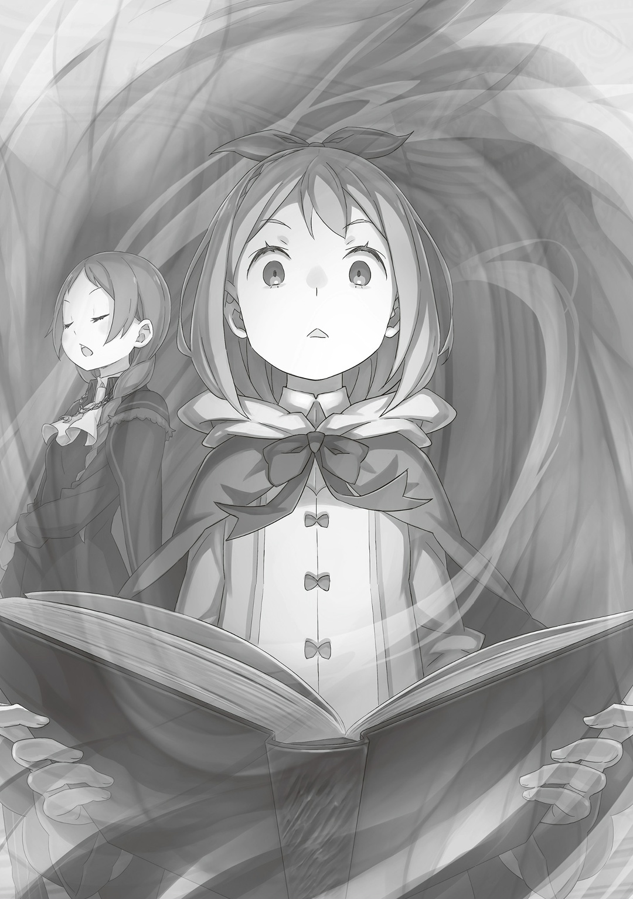

— …Твой отец в заложниках у моего сообщника.

С этими словами Альдебаран понял, что проиграл. Сто тридцать две тысячи сорок четыре попытки — именно столько раз он боролся, чтобы дойти до этой точки; «Ведьма» когда-то научила его считать каждый шаг, каждую петлю. Это был второй раз, когда Альдебаран доходил до такой отметки.

И вот, как и в первый раз, он проиграл. Альдебаран сделал все, что мог: готовился до мелочей, использовал все возможные приемы, переигрывал планы до бесконечности. Но проиграл. Снова. Слабость разливалась по телу Альдебарана горькой волной, она жгла, не давая ему дышать. Проигрывать всегда было тяжело, но чтобы настолько… Его сломило не отсутствие таланта, не отсутствие награды за старания и не отсутствие любви в чужих взглядах. Гораздо больнее было осознавать собственную беспомощность, разъедающую изнутри, как яд.

За это Альдебаран себя и ненавидел.

— …

Путем бесконечных проб и ошибок вместе с «Драконом» он наконец навредил Райнхарду. Но даже это не принесло плодов — все свела на нет нелепая «Божественная Защита Кровопролития», благодаря которой пролитая кровь только усиливала «Святого Меча». В итоге единственным боевым трофеем для Альдебарана стал Райнхард без рук.

Мужчина в шлеме надеялся, что «Святой Меча», впервые почувствовав боль и увидев собственные раны, отчается и поймет, что он не сильнейший.

Однако сильнейший в мире, сильнейший в поколении, сильнейший в истории стоял перед лицом боли с той же непоколебимой решимостью. Даже сейчас, когда его руки разорвало в клочья, лицо «Святого Меча» не изменилось. Именно поэтому…,

— …Понятно.

Под взглядом Райнхарда Альдебаран, который лежал на земле, кивнул. Песок скрипел на зубах, кровь разливалась по внутренней стороне порезанной щеки, вялость, боль, отголоски ударной волны — все это было неважно для мужчины в шлеме. Среди всех битв, число которых перевалило за сто тридцать тысяч, Райнхард не дрогнул ни разу — даже тогда, когда лишился рук. …Кроме того, с глаз «Святого Меча» не сходила страшная печаль.

— Я понял.

Лицо Райнхарда напоминало лицо ребенка, который отпустил руку родителя и потерялся в торговом центре, из-за чего Альдебаран понял,

— Семья всегда тянет нас назад.

— …Кх, откуда мне знать, что ты не врешь…

— Почему бы тебе просто не взглянуть? Например, «Божественной Защитой Чтения Ветра», которая есть у герцогини. Так ты легко поймешь, вру я или нет.

— Я…

— Не можешь, да? …Похоже, у тебя есть какая-то травма, из-за которой ты боишься отбирать чужие Божественные Защиты.

Тут на лице Райнхарда промелькнула боль. В броне непобедимого «Святого Меча» появилась маленькая трещина, как если бы вода начала медленно просачиваться через плотину. С каждой каплей Альдебаран все сильнее и сильнее понимал, что проиграл. Он не победил ни «Тело», ни «Технику» «Святого Меча». Поэтому Альдебарану оставалось лишь подло терзать его «Сердце». Как было видно, это сработало гораздо лучше, чем предыдущие сто тридцать тысяч попыток. Так что теперь Альдебаран будет играть по-грязному, не прольет ни капли крови или пота. И в этом не было вины Райнхарда ван Астрея, который родился, чтобы стать «Святым Меча».

— Тогда, может, обойдемся простой логикой?

— Логикой?

— Да.

Альдебаран поднялся и зашагал к Райнхарду. Возможно, если бы «Альдебаран» очнулся, они бы начали новый бой, пока в «Святом Меча» еще жила неуверенность. Однако «Дракон» не подавал никаких признаков, что придет в себя, поэтому Альдебаран достал ключ к победе над «Сердцем» «Святого Меча». Оставалось только его использовать. …Альдебаран так и поступит.

— Как видишь, я сделал все, чтобы подготовиться к этой битве, «Святой Меча». Уйма планов, миазмы Аугрии и вдобавок…

— …Объединение с «Божественным Драконом» Волканикой.

— Если честно, это получилось только благодаря секретному трюку… но да, объединился. Даже так, я сомневался, что одолею тебя, и, как видишь, не смог. Теперь-то ты понял, да?

— …

— Твой отец служил Принцессе. Шансов… возможностей у меня было предостаточно.

Альдебаран знал, что причина, по которой Присцилла приняла Хейнкеля в свой лагерь, совсем не та, что может показаться на первый взгляд. «Принцесса Солнца» была высокомерной, надменной женщиной, его любимой, она не сомневалась, что все этом мире принадлежит ей.

Ее расположение не зависело от того, красив человек или уродлив. Однако Присцилла не стала бы использовать Хейнкеля, чтобы победить Райнхарда, и не причиняла бы ему боль, чтобы наказать его за нетрезвый образ жизни.

Истинные намерения «Принцессы Солнца» скрывались в глубине ее сердца, которое пылало буйным пламенем. …Возможно, Альдебарану следовало покорить ее неприступное сердце. Он должен был закрыть глаза на невыносимую боль и судорожно протянуть единственную руку в это пламя, пусть она и превратится в уголь, сгорит до самого основания. Тогда Присцилла Бариэль все еще была бы…

— …Ее больше нет с нами.

— Ал-доно?

— Другого пути тоже больше нет, поэтому и колебаться я не стану.

От его слов Райнхард слегка сузил глаза. «Святой Меча» по разным причинам не хотел получать «Божественную Защиту Чтения Ветра», но Альдебаран сказал уже достаточно, чтобы он ему поверил.

— …

Руки «Святого Меча» не заживали. По слухам, когда Райнхард получал любую рану, к нему разом слетались все ближайшие духи, чтобы исцелить; однако Песчаные Дюны Аугрии были ядовиты миазмами, главным врагом духов. Поэтому маленькие помощники «Святого Меча» так и не прилетели. Возможно, за всю историю только Альдебаран довел Райнхарда до такого состояния…,

— …И что ты от меня хочешь?

Выдавив из себя эти слова, Райнхард начал переговоры. В ответ Альдебаран глубоко и протяжно выдохнул, все-таки мне стоило терзать «Сердце» «Святого Меча» , и сказал,

— Ничего такого. Я не буду просить у тебя невозможного, например, присоединиться ко мне. Не буду я и заставлять тебя предать свою госпожу или же делать что-то, чего бы я сам не хотел.

— Что-то мне не верится. Ты взял моего отца в заложники и сейчас делаешь вид, что у тебя есть совесть?

— Ужасный я человек, да? Мне жаль, что тебе пришлось со мной связаться. …Моя просьба проста: я хочу, чтобы ты отпустил нас.

— Отпустить вас?

Да ни за что , — с таким оттенком прозвучали слова «Святого Меча», на что Альдебаран лишь покачал головой. Приказать Райнхарду убить себя или покончить с Советом Мудрецов в обмен на своего отца — не входило в его планы. Альдебаран прекрасно понимал. …Понимал, что Райнхард на такое не пойдет.

— …

«Святой Меча» беспокоился о Хейнкеле, не хотел убивать Альдебарана, каким бы враждебным тот ни был, и переживал за своих товарищей, Флам и Эццо, которые все еще находились в башне. Тем не менее, Райнхард мог отпустить свою доброту и бессердечно пожертвовать дорогим ради защиты мира.

Райнхард мог пожертвовать Хейнкелем, за жизнь которого он искренне волновался; мог убить Альдебарана, которого не хотел убивать; мог оставить дорогих товарищей, Эццо и Флам, на верную смерть. …Таким был «Святой Меча», ведь только тот, кто готов пожертвовать собой ради защиты высшего блага, и мог стать настоящим «Святым Меча».

— Мир не пострадает от того, что ты меня отпустишь. Даже наоборот, из Королевских Выборов уйдут два больших жулика, так что твоей госпоже будет легче победить.

— Фельт-сама не захочет стать Королем такой ценой.

— Как благородно, но оно и понятно. Если бы она была другого типа, то сразу разобралась бы со всеми после начала выборов.

Альдебаран прекрасно понимал, что это не станет его козырем. После преград и неожиданных поворотов Присцилла, в конце концов, признала всех Кандидаток. И те, кого она одобрила, не могли позволить себе такие грубые и недостойные сделки. Получается, все эти переговоры были лишь спектаклем с заранее известным концом. Сколько бы Альдебаран ни говорил, он оставался серьезной угрозой — это было очевидно, если взглянуть на руки Райнхарда.

Даже если бы он сказал, что не опасен, никто ему не поверит. «Святой Меча» Райнхард ван Астрея не даст Альдебарану уйти. Так в чем же тогда смысл этого разговора? Ответ прост. …Все, что задумал Альдебаран, было только ради будущей цели.

— …Уже тут как тут?

Внезапную перемену в обстановке первым заметил Альдебаран, ведь с нетерпением ждал этого гостя. …Ждал того, кто положит конец его бесконечной битве со «Святым Меча».

И это…,

— …Быть не может.

Через полсекунды после Альдебарана Райнхард уловил чье-то присутствие, отчего с губ его сорвалось удивление. «Святой Меча» видел и пережил гораздо больше, чем большинство людей его возраста, он заглядывал в самую бездну этого мира. Даже когда «Божественный Дракон» Волканика, которого связывал Пакт с Королевством Лугуника, превратился во врага, он сохранял самообладание. Однако сейчас Райнхард лишился дара речи. И это неудивительно: он столкнулся с тем, чего никогда раньше не видел. Сторожевая Башня Плеяд на Песчаных Дюнах Аугрии… Ее построили не для того, чтобы измученный битвами «Мудрец» ушел на покой, и не потому, что любопытная «Ведьма» захотела разместить там безвкусную библиотеку, создать которую она обманом заставила Од Лагуну,

— …«Ведьма Зависти».

…А чтобы охранять то, что там запечатали.

△ ▼ △ ▼ △ ▼ △

…Сто тридцать две тысячи сорок четыре раза — в это же время:

— Первую помощь я оказала, но…

С этими словами Петра закончила перевязывать одного из двух раненых, Гарфиэля, который потерял сознание. Его и Эццо перенесли на Четвертый Этаж. Петра занималась Гарфиэлем, а Эццо занималась…,

— Я тоже. Спасибо за бинты.

— Не за что. Ты как, Флам-чан, в порядке?

— Да. К счастью, Ал-сама лишь сдерживал меня, так что я не пострадала.

В ответ Флам демонстративно провела рукой по своему телу. Петра помрачнела, когда услышала это имя. С Флам, конечно, обошлось, но вот с Гарфиэлем и Эццо все было очень плохо… Ал, он виноват. Мужчина в шлеме не тронул Флам, Петру и Мейли, но это его никак не обеляло.

— Вы уже все~?

Петра в досаде сжала кулак, когда сзади их окликнула Мейли. Девушка со скорпионом на голове, которая сказала, что будет охранять башню, а не лечить раненых, сейчас смотрела на перевязанных Гарфиэля и Эццо,

— На Братце и Мастере-сан много бин~тов.

— …У них страшные ожоги по всему телу. Если бы только кто-то из нас хорошо владел магией исцеления…

— Мне жаль, молодой господин отбил у меня всякое желание учить магию.

— Петра-чан, не гру~сти. Вот я, например, даже бинтовать нормально не умею, а уж до магии исцеления мне тем более дал~еко. Когда лечила Эльзу, я все выдумывала на хо~ду.

Даже после оправдания, которое не было оправданием, и утешения, которое не было утешением, Петре не полегчало. Пусть у нее и не было способностей к магии исцеления — разновидности Магии Воды, именно из-за сомнений она так и не научилась нужным навыкам.

— Вот бы Гарф-сан очнулся…

Пусть он бы и лечил сам себя, но в лагере Эмилии Гарфиэль единственный хорошо владел магией исцеления.

Его сила крылась в выносливости и стойкости, а благодаря «Божественной Защите Духов Земли» он восстанавливал силы, просто стоя на почве, и при этом всем мог использовать магию исцеления. Так что ни Петра, ни другие члены лагеря никак не ожидали, что первым проиграет Гарфиэль. …Нет, Гарфиэль проиграл не первым.

— Субару…

Петра прижала кулак к груди и прошептала это имя. Субару и Беатрис так и не нашли. Ал расправился с ними до Гарфиэля и остальных, но куда же они могли подеваться? Она боялась даже думать об этом… но допускала, что от их тел просто избавились.

— Но, если смотреть по поведению Шлемчика, вряд ли это так, д~а?

— Ты просто хочешь меня успокоить…

— Нет~. Тогда бы я тебе соврала, а я не вру, я правда так ду~маю.

— …

— И тут дело не в том, что я одолжила сил у Зверодемонов-чан, просто очень сложно полностью избавиться от двух тел~. Вот почему я думаю, что он не убил Братца и Беатрис-чан, а взял их каким-то другим спос~обом.

Мейли приложила палец к губам и предположила, на что Петра вздрогнула от кучи плохих мыслей. Но она была права: лучшим вариантом будет, если они не мертвы. Если Субару и Беатрис куда-то унесли, то их еще можно было спасти. Только вот о чем тогда думал Ал…,

— …О чем бы ни думал Ал-сама, его планы пойдут под откос.

— Ого, вижу, ты в этом прям уверена~.

На внезапные слова Флам Мейли закрыла один глаз и наклонила голову, играя пальцами с косой.

— Если в общих чертах, я рассказала своей младшей сестре, Грассис, о том, что здесь случилось. Она была рядом с молодым господином, так что рассказала и ему.

— Молодой господин…?

— Молодой господин — это «Святой Меча», Райнхард ван Астрея.

Флам гордо выпятила грудь, глаза Петры округлились от упоминания «Святого Меча», а Мейли издала «О~о~о», в котором чувствовалось одновременно и презрение, и сочувствие.

— Ес~ли придет «Святой Меча»-сан, то все, что задумал Шлемчик, точно пойдет прахом. Мне даже его жаль.

— Не понимаю, как ты можешь такое говорить, Мейли-чан…

— «Святой Меча»-сан сраж~ался с «Божественным Драконом»-чан, будто это какой-то пустяк, так что… О~о, Шлемчик и «Божественный Дракон»-чан объединились же, да? Ладно, тогда рановато говорить, что мне его жа~ль.

— …А мне его не жаль было бы в любом случае.

Петра, наоборот, желала ему зла. То, что Ал растоптал ее чувства, было не так страшно. Она, хотя и доверяла ему, едва его знала, поэтому и боль была не такой сильной.

По-настоящему пострадали те, кто знал Ала лучше, чем она. Субару и Эмилия искренне волновались за него, поэтому нашли время для этого путешествия. …Ал просто предал их.

— Я не прощу тебя…

Временами Петра чувствовала себя узколобой. Но дело было не только в обиде на Ала. Со времен «Святилища» она так и не простила Розвааля, да и в Империи ей приходилось сталкиваться со многим, чего простить она ну уж совершенно не могла.

Всем сердцем и душой Петра не хотела их прощать. Она была доброй только с теми, кто не делал ничего, чего бы она не простила. Поэтому, когда рядом с Петрой оказывались по-настоящему добрые, искренние люди, она чувствовала себя ужасно.

— Петра-чан, ты очень доб~рая. Это я точно тебе гов~орю.

Петра опустила глаза, из-за чего Мейли легонько погладила ее по голове. По лицу было видно, что она — недовольна собой.

— …Это будет трудновато, но давайте отнесем Гарфа-сан вниз по лестнице. С его Божественной Защитой ему лучше лежать на земле.

Предложила Петра, она не обратила внимания ни на лицо Мейли, ни на то, что ей гладили голову. К счастью, Гарфиэль и Эццо были не очень тяжелыми, ведь Петра и Мейли — всего лишь две слабые девушки…,

— Отлично. Раз уж мы все здесь, возьмем еще и Эццо-сама, а то муторно по одному таскать.

С этими словами Флам в одиночку подняла двух мужчин.

Хотя Флам — ровесница Петры и Мейли, она была гораздо сильнее их. Возможно, ее сила объяснялась ролью служанки в особняке «Святого Меча». Как бы то ни было…,

— Думаю, это еще не конец.

Мужчина в шлеме предал их и ушел вместе с «Божественным Драконом», однако теперь его должен был остановить «Святой Меча», которого позвала Флам. Подруги Петры были уверены, что теперь-то планам Ала, какими бы они там ни были, конец, но сама она сомневалась.

Возможно, дело в том, что она не знала Райнхарда лично. А еще ей показалось странным, что Ал, которому так доверял Субару, не учел в своих планах Райнхарда.

Что если даже Райнхард не остановит Ала, что тогда?

— …А?

Это случилось, когда Флам вынесла Гарфиэля и Эццо из комнаты. Петра и Мейли собирали вещи и уже собирались идти за ней. …Но внезапно Петра нащупала на дне сумки что-то странное. Это была…,

— …Книга?

Петра коснулась книги, которая почему-то оказалась в сумке, и сразу поняла, что это. Сомнений быть не может: это — одна из многих «Книг Мертвых», которые стояли на полках Третьего Этажа. То, что она ее нашла, само по себе не было странным.

Странным было то, что она лежала в сумке. Эццо заранее строго сказал им не выносить «Книги Мертвых» из библиотеки, и все ему кивнули. И все же вот — «Книга Мертвых». К тому же…,

— …Это сумка Субару.

В ней лежали личные вещи Субару и Беатрис.

Почему-то в сумке, где хранились такие вещи, как «Дневник Роста Беатрис», который вел Субару, и предметы первой необходимости, например, сменная одежда, была тайно спрятана «Книга Мертвых».

— Что на ней написано…? Не могу разобрать.

Петра, рассматривая обложку, проглотила слюну и нахмурила брови. Она знала, что на лицевой стороне книги всегда пишут название… в случае с «Книгами Мертвых» — имя человека, чью жизнь и смерть в ней записали.

Любой мог прочитать название, но имя конкретно этой книги безвозвратно выцарапали.

— …

Петра попыталась разобрать название и понять, почему ее спрятали в сумке.

Очевидно, название выцарапали, чтобы скрыть, чья это «Книга Мертвых», а в сумке спрятали, чтобы, скорее всего, ее никто не нашел.

И раз эта «Книга Мертвых» лежала в сумке Субару…,

— Субару ее спрятал…?

— Петра~чан? Я уже собрала вещи, а ты~?

— …Мейли-чан.

Петра обернулась на голос Мейли. Та сначала не заметила ничего странного, но, увидев книгу в ее руках, очень удивилась.

— Петра-чан, что это за книга~…

— …Я нашла ее в сумке Субару. Может, в ней…

— В ней что~?

— …Может, в ней есть подсказка, почему все это случилось?

Крепко сжимая переплет книги, Петра решила, что это и правда может быть так. Внезапное безрассудное поведение Ала… Изначально он хотел просто прочитать «Книгу Мертвых» Присциллы Бариэль. Конечно, у него могла быть и другая цель, но все равно она была в этой башне.

Что, если Ал искал именно эту «Книгу Мертвых», а Субару спрятал ее от него?

Что, если именно из-за они и поссорились?

— Если прочту эту книгу, может, узнаю.

— …Не дум~аю, что это хорошая идея, лучше не надо.

— …

— Петра~чан, я понимаю, что ты не хочешь сидеть, сложа руки~, но…

Беспокойно сказала Мейли, на что Петра высунула язык и ответила: «Прости». Что бы та ни сказала, она хотела довести дело до конца. …Субару и Беатрис снова и снова повторяли ей, что читать «Книги Мертвых» опасно. Эццо говорил, что нужно просто опустошить, закрыть свой разум, однако она сомневалась, что у нее получится.

Так или иначе, Петра Лейт была не из тех, кто сидит тихо и ничего не делает. Именно поэтому…,

— …Мейли-чан, если что вдруг — я на тебя рассчитываю.

— Просить меня о таком, Петра-чан, значит, совсем не разбираться в лю~дях

После этого Петра протяжно вздохнула и медленно перевернула страницу «Книги Мертвых», которую положила на колени…,

— …Ах.

…Она прикоснулась к «Воспоминаниям», к Табу мира сего.

△ ▼ △ ▼ △ ▼ △

Альдебаран не знал точно, случится это или нет. Девушки в башне могли просто забиться в угол и плакать, и тогда бы его карта-ловушка не сработала. В этом случае ему пришлось бы укладывать кирпичи уже до миллиарда. Тем не менее…,

— Прочитают или не прочитают, но точно задумаются.

Петра, Мейли и Флам были умны не по годам, очень талантливыми. Альдебаран предположил, что, когда они спасут Гарфиэля и Эццо с порога смерти, то захотят действовать, а не сидеть на месте. Тогда бы они кое-что нашли. …«Книгу Мертвых» в сумке Нацуки Субару. Девушки сразу бы подумали, что все это не просто так, что это единственная надежда, которую оставил после себя черноволосый юноша, что если рискнут сейчас, то выберутся из беды. Их запугали, загнали в тупик, поэтому мысль о том, что это часть плана Альдебарана, точно не придет.

Эта «Книга Мертвых» была имени…,

— …«Нацуки Субару».

…того, кто нарушил естественные законы этого мира. Воистину, эта «Книга Мертвых» — величайшее Табу. Так что же будет, если ее прочитать? Описать словами трудно, а вот показать на деле…,

— …Быть не может.

Еще раз повторил Райнхард, он распахнул глаза и стоял как вкопанный. Сколько бы он ни удивлялся, угроза все равно не исчезнет. Если «Святого Меча» благословил мир, то он же его и проклял. Благословения, проклятия — все это сторона одной медали; сейчас на доску встал кто-то такой же сильный, как и он. Поэтому…,

— Даже «Святой Меча» тут уже ничего не исправит.

Мужчина в шлеме сел и скрестил ноги, глядя на ночное Песчаное Море… На эти земли пришла угроза, которая окрашивала все вокруг во тьму, даже слабый свет звезд на песке. С восточного края мира, дальше, чем Башня «Мудреца», из запечатанного Храма, которого сторонилось все живое, надвигался символ разрушений и гибели. Табу нарушили, а потому «Ведьма Зависти» пришла в этот мир. Именно Альдебаран подготовил эту бомбу замедленного действия против Райнхарда…,

— …Кх, я должен…

— Ты меня не убьешь, я сделаю все, чтобы выжить. Если ты сейчас же не пойдешь к ней, весь мир погибнет. Не то, чтобы меня это волновало…

— Что ты…

— Даже если мир погибнет, я не пропаду. …В любом случае, на меня она внимания обращать не будет.

По этой же причине Альдебаран сам бы не запустил эту бомбу. Для это был некто смелый, с зорким глазом и большим складом ума, который просто хотел выпутаться из беды.

— Райнхард, я не хочу, чтобы мир погиб. Наоборот, я хочу, чтобы он жил.

— Кх…

— С твоим отцом все будет нормально. …А теперь иди.

— Ал-доно, не надейтесь, что все всегда будет идти так, как вы хотите.

Скрежеща зубами от досады, Райнхард выдал самые грубые слова, которые только мог. Затем, с излишним рыцарством, он оттолкнулся ногой от песка. Обратившись спиной к Альдебарану и «Альдебарану», «Святой Меча» рванул перехватывать магические руки «Ведьмы Зависти», когда они уже летели, чтобы поглотить Сторожевую Башню Плеяд. …В ту же секунду Альдебарану показалось, что из мира исчез звук, цвет, свет, тепло и все-все остальное.

— …

Белый удар «Святого Меча» встретился с черным разрушением «Ведьмы», породив цвет, который не был ни черным, ни белым. Это было нечто, что могло сравниться со светом звезды, молниями и пламенем, которые использовались в битве между «Святым Меча» и «Божественным Драконом». И такой взрыв был не один, а два, три и даже четыре. Снова и снова, снова и снова, без остановки, без конца; рождая заново тепло, свет, цвет, звук, разделяя мир на до и мир после, два монстра сражались. …Бесконечная битва между той, кто никогда не остановится, и тем, кто никогда не погибнет.

— «…Я вырубился? Что случилось?»

Все пошло по плану: Райнхарду пришлось столкнуться с «Ведьмой Зависти».

Исторический бой между «Святым Меча» и «Ведьмой Зависти», хоть и происходил в километрах от башни, был настолько мощным, что его ударные волны доходили и до них. Видимо, из-за этого он и очнулся. Распластавшись на песке, «Альдебаран» почувствовал позор, позор для сильнейшего «Дракона», но сузил глаза, следя за растущими вдалеке ударными волнами,

— «Похоже, дела у нас идут неплохо.»

— Ага. Полусонная, ослабленная «Ведьма Зависти» и ослабленный из-за миазм и рук «Святой Меча»… Это стоило ста тридцати тысяч попыток. Ну что, летим?

— «У меня першит горло, а еще у этой «Драконьей» оболочки почти не осталось маны. Думаю, улететь с Песчаного Моря будет раз плюнуть.»

— Прекрасно. Узнаешь, что случилось, через сопряжение. А сейчас мы должны…

Лететь ; тут, когда он попытался встать, что-то с огромной силой прилетело издалека в его ноги, однако «Альдебаран» быстро защитил его хвостом. Маленький камешек покатился по песку. …Скорее всего, Райнхард кинул его в Альдебарана, пока сдерживал магические руки «Ведьмы Зависти».

— «Они летят один за другим! Пока я за ними слежу, все будет нормально!»

Под натиском мелких камней «Альдебаран» расправил крылья, чтобы защитить союзника. Альдебаран же стоял и восхищался чувством долга Райнхарда. Осознавая свою роль спасителя мира, «Святой Меча», тем не менее, отдавал всего себя тому, что в эту роль не входило. …Райнхард был алчнее, чем само воплощение жадности, которое лично знал Альдебаран. Он подумал, что, возможно, это связано с влиянием кого-то из окружения «Святого Меча»,

— …Говорил же тебе, Герой. Я выиграю, несмотря ни на что. Даже если мне придется проиграть сто тысяч раз.

Альдебаран оставил эти слова, которые бы никак не услышала вторая сторона, и поднялся вместе с «Альдебараном» в небо. «Святой Меча», который сдерживал одержимость «Ведьмы Зависти», что была темнее ночи, выглядел как мученик, в одиночку противостоящий великой угрозе. Если мир погибнет, этот мученик останется единственным выжившим.

— «Сейчас лучшая возможность напасть на «Святого Меча» с двух сторон.»

— …И что тогда? Если Райнхард умрет, некому будет держать врата ада закрытыми, а нам нужно, чтобы он играл роль эдакого замка́.

— «Я просто предложил.»

— С его смертью всему придет конец.

С самого начала Альдебаран не хотел, чтобы Райнхард умер. Если бы они не использовали такие мощные атаки, то не смогли бы даже его ранить. «Святой Меча» был как высокая стена.

— Не надеяться, что все всегда будет идти так, как я хочу, ха.

Величественная стена, мученик, который останется здесь; Альдебаран вспомнил его прощание. Может, это была сила какой-то Божественной Защиты? Может, Райнхард получил и использовал что-то вроде «Божественной Защиты Уязвимых Мест» или «Божественной Защиты Слабых Точек»? С помощью большого количества попыток Альдебаран добился нужного исхода. Но, несмотря на то что у него была такая сила…,

— Ты прав, у меня никогда не получалось так, как я искренне хотел. Ни разу.

После ста тридцати двух тысяч сорока четырех попыток мужчина, лишенный как благословений, так и проклятий, чувствовал себя проигравшим.
