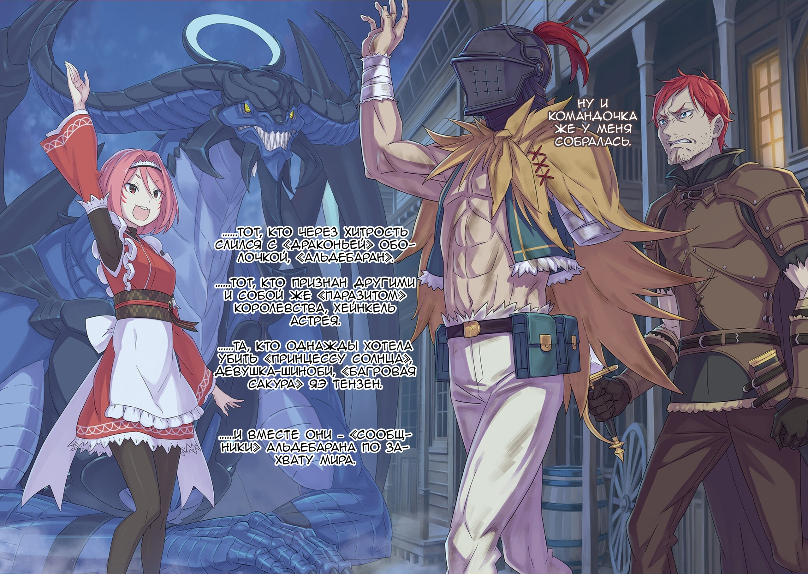

…Пришел настоящий кошмар.

— Кх-х-х, кх, кх-ы-а-а…!

Голова… нет, сама душа отказывалась понимать происходящее. Чувство, будто обстоятельства «До» ушли навсегда, безвозвратно отделились от «Сейчас», и только тело жило в этом кошмаре. Хотелось закричать, но нечто залезло в его рот, чтобы полакомиться кишками… умирал, он умирал, скоро придет конец, конец этому безобразию, его съедали заживо, невыносимо, мучительно, изо рта вытекала желтая желчь, холод земли, судороги, боль заставляла корчиться, изгибаться, извиваться, бежать, нужно бежать… а затем тусклое помещение, казалось, в ней его жизнь и родилась, но нет, просто он уже проходил через это, не один раз его пытали, мучили, терзали…,

…Почему?

Безобразию, дикости, ужасной беде, пустой жестокости, опасности, угрозе, очередному кошмару.

«За что»?

…Почему, почему, почему, почему, почему?

За какие грехи? В чем он провинился? А если и провинился, неужели это справедливо? Если это недоразумение никак не исправить, то зачем же его повторять, утопать в нем, можно же просто искупить с нуля.

И все же, все же, все же… «За что»?

…Почему, почему, почему, почему, почему, почему, почему, почему, почему, почему, почему, почему, почему, почему, почему, почему, почему, почему, почему, почему, почему, почему, почему, почему, почему, почему, почему, почему, почему, почему, почему, почему, почему, почему, почему, почему, почему, почему, почему, почему, почему, почему, почему, почему, почему, почему, почему, почему, почему, почему, почему, почему, почему, почему, почему, почему, почему, почему, почему, почему, почему?

И тут, на этот всем вопросам вопрос…,

— «Ты приглашен… на Ведьминское чаепитие.»

Словно проклятие, словно благословление, ее восторг снизошел на его беду.

△ ▼ △ ▼ △ ▼ △

— …Петра-чан!

Ноги Петры подкосились, но ее подруга, Мейли, успела ее подхватить. Пять секунд — именно столько ей понадобилось, чтобы прочитать «Книгу Мертвых». Магические книги, которые позволяли пережить истории почивших… Про них есть интересная подробность: найти и прочитать жизнь любого, кто придет в голову, не получится — нужно, чтобы ты был с ним как-то связан.

Не выйдет бессовестно читать книги всяких незнакомцев. Хотя бессовестно это или нет — вопрос философский. В любом случае, рассуждать на эту тему лучше не с Мейли, она сама искала кое-какую «Книгу Мертвых».

Важнее сейчас то, что Петре удалось прочитать книгу с неизвестным названием…,

— Петра~чан! Петрочка, очн~ись! …Плохо-плохо, все очень пло~хо!

Мейли осторожно коснулась бледной щеки Петры, но глаза́ она так и не открыла. Потеряла сознание? Просто заснула? Упала в обморок? Багровый скорпион на голове Мейли беспокойно защелкал клешнями, чтобы привести Петру в чувство, но бесполезно. Откроешь «Книгу Мертвых» — и в голове пронесется целая чужая жизнь: неимоверная нагрузка на мозг. Флам рассказывала, что, когда Эццо впервые прочитал такую книгу, он отключился, обмочился и стал пускать пену изо рта. К счастью, девичье достоинство Петры никак не пострадало…,

— …Кх.

C лица Петры не сходила агония или, скорее, страдание, она тяжело дышала, словно в лихорадке.

— Чьи же «Воспоминания» ты там увид~ела…?

Мейли посмотрела на «Книгу Мертвых», которая упала на колени Петры, и осторожно отшвырнула ее ногой куда подальше, она не хотела закончить так же. …Имеет ли эта «Книга Мертвых» что-то общее с Мейли и Петрой?

— Это же не книга Эльзы, да~?

В ее сознании мелькнула Эльза Гранхирт, ведь они обе ее знали.

Целая толпа приехала в башню, чтобы рыться в «Книгах Мертвых», поэтому неудивительно, если бы Субару случайно нашел книгу Эльзы и спрятал ее в сумке подальше от Мейли. Но…,

— …Хм, ты пра~ва. Думаю, Братец не стал бы царапать назв~ание.

Багровый скорпион замахал хвостом из стороны в сторону, на что Мейли тихо кивнула. Да, сомнений не было, ведь она доверяла Нацуки Субару. Однажды он сказал ей, что она должна не забывать об Эльзе Гранхирт. …Если бы он нашел ее книгу, то сомневался бы, но в конце концов рассказал бы.

А сомневался бы он из-за того, что волновался за Мейли и Эльзу. Значит, эта «Книга Мертвых» была кого-то другого…,

— …?

Мейли подняла голову, когда почувствовала внезапную тревогу багрового скорпиона, который уперся красными глазами в пустую стену башни. Дрожь пробежала по ее позвоночнику, когда она кое-что поняла.

Чутье скорпиона сработало, и вряд ли оно было на что-то хорошее. Через секунду обстановка накалилась: за стенами башни, за Песчаными Дюнами Аугрии появился некто, чью жуть можно было ощутить за километры.

— Что за~… Нет~нет~нет!

В голову ей пришел худший из возможных исходов, Мейли быстро сунула скорпиона за воротник и взяла Петру на руки. Что-то находилось за стеной башни, она почувствовала… почувствовала, что сюда идет страшная «Ведьма», та, кто отправила Нацуки Субару и Рем на юг в Империю Волакия.

— В-все очень~очень плохо!

В прошлый раз «Ведьму» перехватил «Божественный Дракон» с вершины башни, но сейчас он ушел вместе с Алом. Если бы не Волканика, вряд ли бы все закончилось только тем, что Субару и Рем пропали. Иначе говоря…,

— Вот и сказочке кон~ец?

От безнадежности, от мысли о том, что скоро умрет, Мейли тяжело вздохнула, но на душе у нее стало легче… она поняла, что в последние минуты неосознанно пыталась защитить Петру.

— Братец, ну ты и бест~олочь…

Так же неосознанно она решила и поругаться на него. Ее голос звучал тихо, глухо. Мейли обняла тело Петры, чтобы хоть как-то ее защитить. Но чем же защищать? Мейли просто маленькая худенькая девочка. Она пожалела, что ела мало мяса…,

…Тут, как только «Ведьма» почти приблизилась к башне, кто-то вмешался.

— …

Она не знала, что случилось. Но свет и звук прорвались сквозь толстые стены башни, отбросив Мейли и Петру в конец комнаты.

— А~а~а!

Вскрикнула Мейли, когда полетела назад.

К счастью, стена была близко, поэтому она удержала Петру. Если бы не это, они бы сильно ушиблись. Тем не менее, их волосы и одежда растрепались, а комната превратилась в беспорядок: багаж и вещи в нем разбросались повсюду.

— Что произ~ошло…?

— Петра-сама! Мейли-сама! Вы целы?!

В глазах потемнело, а потому Мейли села на пол. Петра на ее руках все еще не приходила в себя. Тут Флам забежала в комнату, чтобы проверить, живы ли ее подруги. Горничная из особняка «Святого Меча» уносила Гарфиэля и Эццо на нижние этажи, и поэтому пропустила то, как Петра прочитала «Книгу Мертвых». Серьезная Флам опустила уголки глаз и сказала:

— Молодой господин пришел. Сейчас он сдерживает врага.

— Сдержи~вает? И кого же он сдержи~вает…?

— …

— «Ведьму Зависти»?

Лицо Флам сразу побледнело. Она не была так потрясена, даже когда Ал предал их и объединился с «Божественным Драконом». Мейли сталкивалась с «Ведьмой Зависти» уже во второй раз, поэтому удивилась гораздо меньше, но Флам — нет, поэтому пришлось сказать: «Изв~ини». У большинства при одном только осознании, что «Ведьма Зависти» существует, кровь стыла в жилах.

— А сестрица Эмилия сильна дух~ом…

То ли потому, что очень решительна, то ли потому, что ей тогда хватило смелости и наглости. В любом случае, ожидать, что все будут, как Эмилия, нельзя. Тут Мейли встала с Петрой на руках и,

— «Святой Меча»-сан сейчас с ней сраж~ается?

— …Да. Молодой господин сдерживает врага, но с трудом.

— …Здесь больше нельзя оставаться, нам нужно уход~ить.

Она не знала, почему опять пришла «Ведьма Зависти», но причина, скорее всего, где-то в башне. Может, все это из-за Мейли? Из-за того, что она слишком часто бывает в башне? Как только Мейли об этом подумала, ее затылок ущипнула клешня багрового скорпиона, который высунулся из-под одежды.

— Извини, забыла, что во всех бедах ты сидела у меня на гол~ове.

— Мейли-сама! Скорее уходим! Давай мне Петру-сама…

— …Я донесу ее~. Флам-чан, давай так: я — несу Петру-чан, а ты — занимаешься Патраш-чан и осталь~ными.

Мейли отказалась от помощи, положила Петру на спину и медленно встала. Флам на секунду задумалась, не зная, что же сказать, но затем кивнула и ушла.

— Спускайся по лестнице, а я пока подготовлю повозку.

— Да, хор~ошо.

Мейли двинулась следом за быстрой Флам. Пока шла, она думала о той злосчастной сумке… о «Книге Мертвых», из-за которой Петра потеряла сознание,

— Нет, потом просто спрошу Петру.

Клацанье клешней скорпиона снова привело ее в чувство. …Нужно просто дождаться, пока Петра переварит в голове жизнь «Человека» из той книги. С такими мыслями Мейли побежала изо всех сил. Внезапно слеза вырвалась из закрытых глаз Петры, а затем…,

— Пожалуйста, прости… Мне так жаль тебя, Субару…

Тихое извинение и маленькая слеза; так раскалывалось сердце Петры Лейт. Только вот эти душераздирающие слова никто так и не услышал — их заглушила битва между «Святым Меча» и «Ведьмой Зависти».

△ ▼ △ ▼ △ ▼ △

— Молоко, холодное.

Альдебаран сел на стул у прилавка и озвучил хозяину заведения заказ. В Мируле был всего один кабак. Обстановка в нем напоминала ветхие таверны из типичного вестерна, а народу здесь было целое — ноль. Хотя, может, сюда и ходили люди, Альдебаран точно не знал, ведь пришел в этот кабак, когда и совы, и пташки еще спят. В такое время никто не работает, но хозяин все равно распахнул двери и понимающе принял гостя. Этому образцовому работнику Альдебаран сказал,

— Мне и в голову бы не пришло сделать плохое такому трудолюбивому человеку, как вы. За ваш труд я заплачу как следует.

Глядя на бородатого продавца, Альдебаран пожал плечами и некультурно оперся локтем о прилавок. Похоже, хозяин жил в этом кабаке, так как открыл ему дверь в ночной рубашке, но пожаловаться мужчина в шлеме хотел не на это, а на то, что тот никак не решался налить в кружку молоко. И все потому…,

— «Что бы ты ему ни сказал, все равно это звучит как угроза, я.»

— Думаешь?

— «Однорукий мужчина в черном-черном шлеме пришел черной-черной ночью и постучался в черный-черный кабак — звучит как история из сборника страшилок, лично я бы тебе дверь не открыл.»

— Хочешь сказать, его страх — моя вина…?

Из-за стены прозвучал «Божественный Дракон»… самое уважаемое существо в Королевстве Лугуника, который и говорил еще как какой-то преступник. Естественно, «Альдебаран» в кабаке не помещался, а потому ждал в тесноте на улице. То, что «Дракон» стоял снаружи, смелости продавцу отнюдь не прибавляло. Подозрительный мужчина и «Божественный Дракон» заглянули попить молока поздней ночью… с такими случаями на работе хозяин заведения точно не сталкивался.

— …Ваше молоко.

Со страхом в голосе он подал гостю холодный напиток в деревянной кружке. Альдебаран забрал заказ, сказал: «Тэнк ю» и кивком указал на входную дверь.

— Не могли бы вы еще принести моему старому другу на улицу бочку молочка, водички, ну или что у вас там есть попить? В общем, что угодно, но только не алкашку. Ему нужно быть в здравом уме и твердой памяти.

— «Да ни хера мне твой алкоголь не сделает, я ж, мать твою, «Божественный Дракон», не очкуй.»

— Помню был такой «Дракон» из мифов… ну так вот, он хотел погубить спиртное, а в итоге погубил себя. Будет ой как херово, если ты умрешь… Короче, тебе нельзя, ты можешь пригодиться мне в любую секунду.

— «Тц, ну хозяин, ну пожалуйста!»

«Альдебаран» в окне понуро опустил голову и цокнул языком, отчего раздался звук, будто кто-то выстрелил. Хозяин заведения обомлел, немного поколебался, но все-таки собрался с силами: взвалил на плечи бочонок и пошел на улицу. Тут Альдебаран увидел, что одна из ног продавца — протез… он пожалел, что поручил ему такую трудоемкую задачу. Мужчина в шлеме чувствовал, что мог бы донести бочку и сам, но…,

— …Я устал сильнее, чем обычно.

У него невыносимо болела каждая косточка, но, если сравнивать с душевной усталостью, это было просто ничто. Психически он был измотан так, словно сражался с грозным врагом сто тридцать две тысячи сорок четыре раза. …Нет, это еще мягко сказано. Он измотался так, как если бы его победили сто тридцать две тысячи сорок три раза подряд, а потом еще и покончили с ним на сто тридцать две тысячи сорок четвертой попытке. Хотя можно было сказать, что план сработал и «Святой Меча» Райнхард ван Астрея попал в ловушку, но Альдебаран не чувствовал, что победил, скорее, он чувствовал поражение, беспомощность и маленькое…,

— Облегчение, что все получилось… ха.

Альдебаран разобрался с двумя главными противниками на своем пути, но чувствовал лишь слабое облегчение, — вот насколько ничтожным он был. Мысль о том, что ему с легкостью удалось загнать их в угол, звучала для него, как ирония. …Альдебаран изранил всех, кто был в башне, включая Райнхарда, и число его жертв будет только расти. А то, что он устроил под конец…,

— «Святой Меча» против «Ведьмы Зависти», прям-таки битва века.

Альдебаран пробормотал это, приподнял челюсть шлема и отпил молока из кружки. В окне краем глаза он видел и даже слышал отголоски ожесточенной, разрушительной битвы в Песчаном Море. Белые вспышки снова и снова озаряли ночь, поднимались песчаные бури, раздавались громовые раскаты. Пусть люди и не догадывались, что происходит, но чутьем понимали, что эта картина ничем не отличается от той, что развернется в день конца света. Вот почему жители Мирулы даже в этот поздний час встали с кровати, выбежали на улицу и с ужасом смотрели на Песчаное Море.

— …

Солнце взошло, пришел новый день, а битва все никак не прекращалась. Казалось, мирулийцы будут наблюдать за ней вечно. Не то, чтобы они думали, что до них это не дойдет, просто их ослепил необычайный свет. Незрячие мирулийцы боялись, поэтому шли на голоса других, собирались в группы. Как мотыльки на пламя, они слепо тянулись к этому разрушительному свету. Еще одной причиной того, почему мирулийцы стояли на месте, была…,

— …Обалдеееть~! Глазам не верю~! «Дракон»~! Пока не подошла ближе, сомневалась до последнего~!

Внезапно навязчивый, неуместно веселый голос девушки разорвал ожесточенность боя в Песчаном Море. Он доносился снаружи кабака, поэтому Альдебаран поставил молоко на прилавок, слез со стула и повернулся ко входу. В следующую секунду…,

— Ты здесь, Альдебаран!? А ну пшел вон отсюда!

Красноволосый мужчина с силой распахнул двери кабака, заметил человека в шлеме и грубой походкой зашагал к нему. Затем он достал меч и направил его острие на Альдебарана, из-за чего тот поднял единственную руку и сказал: «Притормози-ка»,

— Сначала сказал выметаться, а теперь меч к горлу приставил, ты определись.

— К словам не придирайся! Лучше скажи, кто стоит снаружи! Это же, это же…!

— Снаружи?

— Дурака из себя не строй!

Едва Альдебаран наклонил голову, как его схватили за воротник, заставили подняться и вытолкали из кабака. Толчки острой болью отдавались в спине мужчины в шлеме, он хотел сказать: «Я бы так и так вышел», но его бы все равно не послушали. Ничего не поделаешь. …В конце концов, то, что он всем сердцем желал, находилось на улице.

— О, Ал-сама, вот вы где… вас что, в заложники взяли?

— Да кому-то просто кровь прилила к голове. Не провоцируй его, а то мне несдобровать.

— Ну вооот, опять вы так говорите~. Ал-сама, я же знаю, что вас не убить~.

Девушка в красном наряде горничной легкомысленно махнула рукой на Альдебарана, к спине которого приставили меч. Она чем-то напоминала капризную кошку. Жаловаться на ее беспечность Альдебаран не хотел, да и бесполезное это дело, хотя вслух он ей об этом не скажет. Как бы то ни было…,

— «И что будешь делать, я?»

— Не говори так, будто тебя это не касается, я.

Когда «Божественный Дракон» с улыбкой и высоко поднятой головой взглянул на него, Альдебаран набрал в легкие воздуха и, развернувшись на месте…,

— Ну и командочка же у меня собралась.

…Тот, кто через хитрость слился с «Драконьей» оболочкой, «Альдебаран».

…Тот, кто признан другими и собой же «Паразитом» Королевства, Хейнкель Астрея.

…Та, кто однажды хотела убить «Принцессу Солнца», девушка-шиноби, «Багровая Сакура» Яэ Тензен.

…И вместе они — «Сообщники» Альдебарана по захвату мира.

△ ▼ △ ▼ △ ▼ △

…Шестнадцать раз.

Отец Райнхарда ван Астрея стал настоящим козырем. Хотел Альдебаран его использовать или нет, но он бы точно подготовился заранее. Вот почему он убедил отчаянного Хейнкеля, подобрав правильные слова. Хотя они и числились в одном лагере, между ними не было дружбы.

У красноволосого мужчины всегда была ясная и понятная цель, можно сказать, преданная любовь. …Хейнкель, которого Альдебаран как любил, так и ненавидел, согласился помочь, но только при одном условии…,

— …Ты пообещал мне «Драконью Кровь»! И вот, перед нами сидит «Дракон»! А ты говоришь мне подождать?

Злой Хейнкель плевался слюной, казалось, он вот-вот замахнется мечом на Альдебарана, который лежал на улице, как послушная собака. Только вот лезвие красноволосый мужчина направлял прямо в грудь «Дракона»… в сердце «Драконьей» оболочки. …«Драконья Кровь» обогащала любую землю и лечила все болезни. Эта легенда передавалась в Королевстве Лугуника из поколения в поколение. Когда «Три Героя» победили «Ведьму Зависти», говорили, что «Божественный Дракон» даровал Королевству три святых дара, один из которых — «Драконья Кровь». В нынешнее же время большинство «Драконов» улетели вдаль, так что получить ее стало почти что невозможно. Но теперь то, что Хейнкель так давно искал, стояло прямо перед ним. Десять лет он гонялся за этим чудом, и, наконец, вот оно — аж сердце колотилось.

— Наконец-то, Луанна наконец-то…!

— …Твоя жена?

— Да. Моя жена… она так долго спала, но с «Драконьей Кровью» наконец-то проснется! Вот почему я согласился на всю твою херню!

— Ты очень помог, признаю. По правде, без тебя бы я ничего не сделал твоему сыну.

— Тогда…!!!

Из-за волнения Хейнкеля нормальный разговор совсем не получался. Альдебаран тайно обновил матрицу и уже подбирал слова, чтобы успокоить собеседника, как вдруг…,

— Эмм~, извините, что перебиваю, но у меня есть вопросик~!

— Че те надо, служанка!? У меня тут важный разговор с этим шлемоголовым…

— Хейнкель-сама, а вооон там, где мерцают огоньки, не ваш сын, случаем, сражается?

— …А?

С волосами цвета между розовым и красным, девушка… Яэ указала в сторону Песчаного Моря, в котором бушевала битва. Тут Хейнкель, чьи мысли были заняты лишь «Божественным Драконом», удивленно заморгал,

— …Эй, что это все значит? Там что, сражается…

— «Святой Меча» и «Ведьма Зависти».

— …Кх! П-почему… Как до этого, мать твою, дошло!?

Хейнкель распахнул глаза, глядя на Песчаное Море, где его сын сражался с «Ведьмой». Затем его плечи затряслись и,

— Я на это не подписывался! Ты должен был использовать меня, чтобы подавить его! Мы же договорились… Останови, останови их немедленно! Какая «Ведьма Зависти»? Ты что, с ума сошел…!?

— Извини, но не могу. Мы не договаривались, что я буду их останавливать. А свою «Драконью Кровь» ты получишь, не волнуйся.

— Гх, кх…! Тогда…!

— Тогда что?

— …Ах.

Как бы злость в нем не кипела, Хейнкель замялся и отвел взгляд. Альдебаран с жалостью смотрел на его малодушие. …Мужчина в шлеме сочувствовал ему. Судьба тоже не щадила Хейнкеля, он родился в семье не своего уровня. Однако в отличие от Альдебарана, красновлосый мужчина оказался слишком слаб, чтобы справиться с этим.

Хейнкель снова и снова нерешительно поднимал и опускал меч,

— Хейнкель-сама, честно, я не хочу лезть в ваши личные дела, так что, может, просто перестанете ныть?

Не в силах просто стоять и смотреть, Яэ заговорила ледяным голосом. От ее слов Альдебаран приложил руку ко лбу, а Хейнкель распахнул глаза и яростно впился в нее взглядом. В ответ она лишь улыбнулась и наклонила голову.

И вот, с улыбкой на губах, но без смеха в глазах, Яэ сказала:

— Сами же согласились, а теперь сами же и жалуетесь? Двух зайцев не поймаешь, одного все равно придется отпустить восвояси, это же очевидно. Вы что, дите малое?

— …Кх, он мой сын, а не какой-то заяц!

— Ладненько~, говорить с вами себе дороже~. …Ал-сама?

Альдебаран покачал головой, когда Яэ переключилась с Хейнкеля на него. Эта девушка не умела держать все в себе, она знала лишь одно — как убивать, поэтому…,

— …Помоги, я.

— «Обращайся.»

В следующую секунду «Альдебаран» замахнулся предплечьем на Хейнкеля, который со злостью смотрел Яэ в глаза, и повалил его вниз. Она издала «Огооо~», когда подул сильный ветер, и затем увидела красноволосого мужчину в земле.

— Прости, старик, но пока без «Драконьей Крови». Мне нужно, чтобы «Божественный Дракон» еще пожил.

— Извини, что перебиваю, но Хейнкель-сама живой вообще? Лично меня бы этот удар убил.

— «Старик не умер. Пусть я и не сдерживался, но от такого он не умрет. Я давно понял, что он крепкий орешек.»

— …Думаю, самое время спросить: почему «Божественный Дракон»-сама говорит в точности, как Ал-сама?

— Потом расскажу. Сейчас время на вес золота.

Следом Альдебаран присел на корточки рядом с Хейнкелем, чтобы вернуть его меч в ножны. …И тут кое-что случилось,

— А?

Когда его руку схватили, Альдебаран ахнул. Хейнкель не потерял сознание после удара «Дракона», хотя по его глазам было видно, что он мало что различал. Тем не менее, отец «Святого Меча» кровожадно посмотрел на мужчину в шлеме, который затем,

— Я сдержу обещание, ты получишь свою кровь. К слову, я не допущу, чтобы Райнхарда поглотила «Ведьма Зависти». …Просто доверься мне.

— …

Хейнкель вяло опустил голову, вряд ли он ему искренне поверил. Альдебаран освободил руку из его хватки и посмотрел на Яэ, которая подняла ногу, чтобы ударить красноволосого мужчину,

— У меня всего одна рука, и я очень устал. Можешь ты его понести?

— О, мне дали право выбора? Если да, то, пожалуй, откажусь.

— Нет, это приказ. Ты его несешь.

— Тц~, Ал-сама, ну вы и грубиян~, ладненько~, понесу его~.

Яэ показала язык, наклонилась и вытащила Хейнкеля. Тут Альдебаран посмотрел на «Альдебарана» и,

— Что ты там о старике сказал?

— «А? А-а, да ничего такого. Только то, что он крепкий орешек.»

— …А если еще вспомнить его характер и во что он вляпался, то его жизнь — сплошная боль. Жалко его.

Альдебаран чувствовал, что извиняться перед Хейнкелем за все это бессмысленно, но все равно желал ему счастья. Несмотря на трудные обстоятельства, проблемы красноволосого мужчины еще не худшие в мире. Хотя, наверное, подобные утешения Хейнкель едва ли захочет слышать.

— К тому же, после всего того, что я сделал, вряд ли у меня получится казаться хорошим парнем.

Альдебаран понимал, что уже поздно сожалеть и пытаться загладить вину. Вместо этого он окликнул красную горничную,

— Яэ, деньги.

— Вы что, тарелочник? Вооот~ держите.

Яэ пошарила в одежде, достала кожаный мешочек и бросила его Альдебарану. Из него он достал золотую монету, подкинул ее большим пальцем и сказал…,

— За доставленные неудобства.

Альдебаран отдал монету молчаливому хозяину кабака. Рядом с «Драконом» стояла пустая бочка из-под воды, так что тот выполнил все их заказы. Благодаря нему Альдебаран дождался своих сообщников и немного отдохнул.

— Но это же мои денюжки.

— Заткнись. Я знаю, что ты только приехала, но нам нужно отправляться в путь.

— С тренировками шиноби я и не такое повидала. Старосты заставляют нас полмесяца без сна и перерывов бегать из столицы Империи в деревню с одной лишь бамбуковой трубочкой для воды.

— Твои рассказы о безумстве шиноби никогда не закончатся, ха.

Яэ хотела сказать, что после такого тяжелого опыта для нее это пустяковое дело, но Альдебаран уловил лишь безумие ее деревни и вспомнил, как в Империи сталкивался с самыми опасными шиноби. Так или иначе…,

— П-подождите…! Пожалуйста, подождите.

Как раз когда они собирались уходить, их остановил хозяин кабака. С такой разношерстной командой и после недавней атаки «Дракона», смело заговорить с ними было настоящим подвигом. Продавец сглотнул слюну, взглянул на Альдебарана и сказал:

— Пожалуйста… Пожалуйста, остановите бой у Сторожевой Башни Плеяд! Вы ведь «Божественный Дракон» Волканика, да?

— Э-э…

На мольбу владельца кабака Альдебаран постукал пальцем по шлему и вздохнул. Он заметил, что их окружили жители Мирулы, которые умоляюще смотрели на «Альдебарана». В их глазах читались не только страх и беспокойство, но и уважение с надеждой.

Они надеялись, что известный «Божественный Дракон» остановит бой, который, казалось, мог привести к глобальным переменам. Но…,

— «Не обессудьте, но это не моя работа.»

— …Кх.

— «Эту беду уже решает «Святой Меча». Но это не значит, что ваш город не пострадает. Вам лучше уехать отсюда на несколько дней.»

— Несколько дней… А можно узнать, на сколько именно?

Хозяин таверны, услышав неожиданный ответ «Божественного Дракона», не отступил: он задал еще один вопрос, чтобы успокоить всех вокруг определенностью. Так как же долго это будет продолжаться?

— …Семь дней.

— …

— Через семь дней все закончится. …Семь дней — и причина конца света исчезнет навсегда.

С этими словами Альдебаран повернулся спиной к мирулийцам и пошел прочь. За ним шла Яэ с Хейнкелем на спине, а еще шумный «Дракон».

Альдебаран и его «Сообщники», которые встали против мира сего, продолжили свой путь. Им нельзя останавливаться.

— Продолжаем. …Я стану самим собой.
