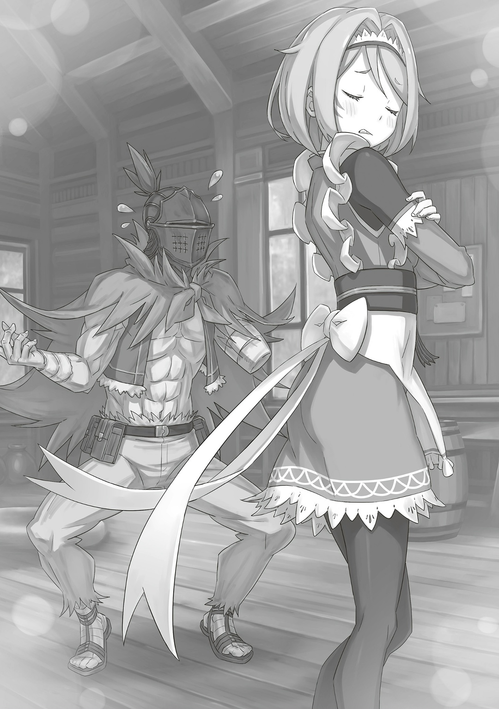
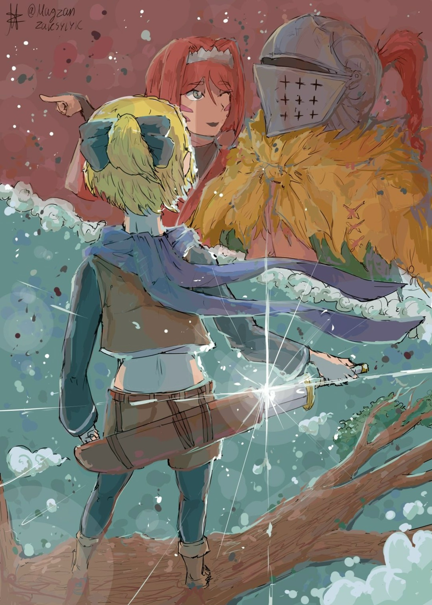

…Большой холм; густая трава; ясное голубое небо; легкий ветерок; белый стол; зонтик. Черноволосый некто бессознательно сел напротив беловолосой девушки, которая попивала чай. От горячего напитка шел пар, но его аромат нос почему-то не улавливал. …Будто это и не чай вовсе — просто образ кружки с жидкостью. Видимо, девушка напротив была не совсем честна сердцем.

— Ч-что со мной случилось?

Вопрос.

Вопрос, чтобы распутать клубок мыслей от недавнего ужаса.

— Разве ты сам не знаешь?

Ответ.

Ответ, который не потянул ниточку от запутанного клубка. Почему же на вопрос не ответили? Недовольство пришлось оставить при себе, все-таки это мнение со стороны, мнение наблюдателя.

— Ехидна! Я хочу уйти отсюда, сейчас же!

Нервный порыв превратился в смелость, которую сразу же использовали, чтобы выйти из тупика. На этом зеленом холме, напротив девушки, которая назвалась «Ведьмой», черноволосый некто снова почувствовал что-то необъяснимое, загадочное. …Да, в который раз.

Снова и снова, снова и снова, снова и снова, снова и снова, опять.

Так было всегда. В любых обстоятельствах, в любом положении, в конце концов, приходило то, чего он совсем не мог понять. Даже так черноволосый некто раз за разом поднимал голову и боролся. …Боролся, не жалея себя.

— Почему бы тебе просто не попробовать?

…Пожалуйста, хватит.

…Умоляю, прошу тебя, хватит. Не заставляй говорить, рассказывать, делиться. Не нужно.

— Усердно работать ради желаемого — это благородно. В этом я не сомневаюсь. Достойные старания и делают жизнь достойной.

…Пожалуйста, хватит. Пожалуйста, прекрати. Пожалуйста, остановись. Прошу тебя, умоляю.

…Хватит, хватит, хватит, хватит, хватит, хватит, хватит, хватит, хватит, хватит, хватит, хватит, хватит, хватит, хватит, хватит.

…Достаточно.

— Ехидна. Я могу возвращаться после… «Смерти».

…Ах, а-а, х-хк, пожалуйста.

…Пожалуйста, не страдай.

…Пожалуйста, не плачь.

…Пожалуйста, не мучайся.

…Пожалуйста, не бойся.

…Пожалуйста, не дурачься.

…Пожалуйста, не прощай.

— Твой вопрос «почему» открыл двери нашего чаепития. А когда ты выпил чай от «Ведьмы», то стал его почетным гостем. Как хозяйка этой чайной церемонии, я приветствую тебя. …Ну же, расскажи, расспроси меня о том, что тебя так волнует.

…Пожалуйста, пожалуйста, пожалуйста, пожалуйста, пожалуйста, пожалуйста, пожалуйста, я прошу тебя.

…Умоляю, прошу тебя, хватит.

— В конце концов, ломать голову в поисках ответов для меня лучшее из наслаждений.

…Прошу тебя, пожалуйста, не помогай ему.

△ ▼ △ ▼ △ ▼ △

…Умственную усталость, в отличие от физической, не заметишь глазом — в этом и ее коварство. Конечно, есть явные признаки: ты плохо соображаешь, злишься по пустякам, а под глазами у тебя черные мешки. Но все же это больше относилось к физической усталости; во всяком случае, по мнению Альдебарана.

Умственную усталость не унять ни прикосновениями, ни магией. Тебя не спасут ни связи, ни слова. …Только время лечит, приводит тебя в чувство, сглаживает острые углы разума. Именно поэтому…,

— Перерасширение территории, переопределение матрицы.

С этими словами Альдебаран наконец почувствовал, что спокоен. Впервые за шесть часов мужчина в шлеме обновил матрицу — его способность позволяла повторять одно и то же время раз за разом, при этом он помнил о предыдущих петлях.

Пока для всех вокруг время было одно, Альдебаран глотал яд в своей территории, чтобы отдыхать столько, сколько захочет. Эту особенность он использовал и в битве против Райнхарда, чтобы обдумывать планы.

— Правда, почти ничего не работало…

В итоге битва закончилась тем, что он разыграл карту, которую очень не хотел разыгрывать, поэтому назвать это победой язык не поворачивался. В лучшем случае это ничья, а в худшем — поражение для обеих сторон. Как бы то ни было, сейчас Альдебаран легче соображал и меньше злился. Что касается кругов под глазами, то не беда — есть шлем, как раз под стать его измотанному телу и духу… нет, физически он тоже был в лучшем виде. Высшая форма жизни, «Дракон» с неисчерпаемыми запасами маны… это преувеличение, но мана все же была, поэтому в дело пошли исцеление Магией Воды и усиление Магией Света. Можно с уверенностью сказать, что Альдебаран еще никогда не пребывал в такой хорошей форме.

— Хотя это все равно что муравью увеличить силу в сто раз; сколько его не баффай, против человека он ничто.

Если думать в таком ключе, то его противники — не люди, а скорее слоны или львы. Как бы печально это ни было, даже самому сильному Альдебарану за всю историю не победить в честной схватке. Его удел — быть проигравшим. Оставляя в стороне всю эту жалость к себе…,

— Семь дней.

Альдебаран прислонился к стене из грязных досок и поставил на нее ногу. Сейчас он отдыхал в охотничьем домике, который Яэ нашла в лесу. К счастью, хозяин жилища был в отъезде, поэтому делать они могли что хотят. Мягкой постели и горячей купальни здесь не было, но от посторонних глаз дом укрывал — для Альдебарана это главное. Впредь, по возможности, следует избегать ненужных сражений и лишний раз не привлекать к себе внимание. Небольшое представление, которое они устроили в Мируле, — просто исключение: Альдебарану надо было дождаться сообщников, а еще ему до смерти хотелось молока. Помимо этого, он хотел посоветовать жителям города убираться подальше. В конце концов, всего в нескольких десятках километров от Мирулы разворачивалась битва между сильнейшими мира сего. Райнхард, которого Альдебаран столкнул с «Ведьмой Зависти», сражался не на жизнь, а на смерть. Последствия этой битвы с легкостью могли выйти за пределы Песчаного Моря. Здесь не может быть и речи о спокойствии — мирулийцам необходимо уехать из города. Срок в семь дней был тесно связан с этой битвой. …Более того, он полностью от нее зависел. Насколько Альдебаран знал, «Святой Меча» и «Ведьма Зависти» равны по силе. Их битва — это замкнутый круг, бесконечное столкновение. Правда, это лишь в том случае, если сражаться будут только эти двое. Так продлится ли эта битва тысячу дней? Определенно — нет. Потому что…,

— Мир погибнет раньше, чем кто-то из них победит. Если до такого дойдет, все будет кончено.

Вот почему он поклялся положить конец их битве.

— Столько всего… Мне нужно многое успеть…

Альдебаран прикоснулся рукой ко лбу шлема и сделал долгий, глубокий вдох. Полномочие помогло унять умственную усталость, а Магия Воды и Магия Света — физическую. Но даже так Альдебаран чувствовал всю тяжесть того, что возложил на свои плечи. Конечно, теперь у него не было никого, кому бы он мог излить душу…,

— …А мооожет, тебе перестать упрямиться и просто положиться на кого-нибудь~? Сам же жаловался, что у тебя одна рука и все такооое~, расслабься уже.

— …Ты, Яэ?

— Да-да — я, Ал-сама~. Полезная шиноби-горничная на все руки к вашим услууугам~.

Девушка, которая появилась без единого звука… Яэ с улыбкой отшутилась. Когда она сложила руки за спиной и зашагала к нему, Альдебаран пожал плечами и сказал:

— «Полезная» и «на все руки» еще ладно, но вот то, что ты шиноби, может значить что угодно, явно лишнее.

— Серьезно~? А я ведь, чтобы не перегружать, откинула варианты «миловидная», «очаровательная» и «неотразимая». А ну-ка, Ал-сама, тогда давайте вы меня кратко опишете.

— …Покорная кошкогорничная-шиноби.

— О~ооох, прекрасных дам такое описание только отпугнет. А еще «шиноби» почему-то оставили, сами же жаловались.

Яэ посмотрела на него с презрением, на что Альдебаран цокнул языком и бросил грубое: «Лучше помолчи, ты». Мужчина в шлеме не хотел тратить время на перепалки с сообщницей, с которой его не связывали ни дружба, ни нужда искать общий язык. У него были дела поважнее.

— Разве ты не должна присматривать за стариком? А еще проверить, куда ведут распутья, проследить, чтобы к охотничьему дому никто не подошел, и приготовить еду.

— Звучит как абьюз. Так ведь на вашем языке говорят, Ал-сама? Сплошной абъюююз~ и эксплуататорство.

— Ты же полезная горничная-шиноби на все руки, нет? Так соответствуй.

— Да блииин~, ну вы и злюка, Ал-сама, прям бес и дьявол в одном лицеее~.

С этими словами Яэ показала язык, но Альдебаран бросил на нее серьезный взгляд, из-за чего она подняла палец и сказала: «Все-все, я поняла»,

— Еду я приготовила — просто паек шиноби. Все вокруг осмотрела, посмотрела. В этом лесу Зверодемоны водятся, представляете~? Еще нашла удобную тропинку, но вам все равно не помешает размять ноги и спину. А вот Хейнкель-сама…

— Что с ним?

— Бесполезен, не хочу его бесконечно таскать, поэтому кое-что придумала — сделаем из него живую приманку против Зверодемонов… Ой~, прошу, не делайте такое лицо, я просто пошутила.

— Ты не видишь мое лицо.

— Да, но слышу. Громковатый вы, Ал-сама.

Сказав что-то одновременно понятное и непонятное, Яэ отвернулась, но Альдебаран продолжал смотреть на нее. Вскоре она сдалась, тяжело вздохнула и,

— Хейнкель-сама связан. Как только он очнется, я сразу узнаю, а если попытается сбежать, тогда его руки и ноги, ну… скажем так, они уйдут в свободное плавание.

— В свободное плавание? Думаешь, получится?

— Ну не стальной же он, сломается. Я умею находить слабые точки. Хоть вы и спросили, получится ли, но, наверное, рассердитесь, если с ним что-то случится, да?

— Еще бы.

— Тогда не буду~. Зачем мне вас злить.

Альдебаран расслабился, когда Яэ смиренно подняла руки. Хоть говорила она легкомысленно, к тому же любила пошутить, все же ему не врала. Мужчина в шлеме прекрасно понимал: после всего того, что он заставил ее пережить, Яэ не станет замышлять что-то против него. Альдебаран приложил все усилия, чтобы безжалостно сломить ее непокорный дух… нет, ее волю. Яэ сотрудничала с ним по кое-какой причине.

…Яэ Тензен — наемная убийца, которую послали, чтобы избавиться от Присциллы Бариэль. После объявления о своем участии в Королевских Выборах имя «Принцессы Солнца» разнеслось по Империи Волакия. Было лишь вопросом времени, когда люди поймут, что на самом деле она — Приска Бенедикт, которая выжила после «Церемонии Императорского Отбора» и переехала в другую страну. Яэ послал один из «Девяти Божественных Генералов» Волакии — Чиша Голд; она должна была устранить угрозу на корню. Яэ, под маскировкой, устроилась служанкой в поместье Присциллы и быстро завоевала репутацию прилежной и старательной горничной. Шульт ее просто обожал; Альдебаран относился к Яэ с теплотой; даже «Принцесса Солнца» прониклась к ней симпатией.

Но Яэ никогда не теряла из виду свою истинную цель и, в итоге, нацелилась на Присциллу. Поэтому…,

— В тооот~ день Ал-сама был таким страшным. Я многое пережила за свою жизнь, тяжелые испытания под видом тренировок в моей деревне, например… но так страшно мне было впервые.

— …Хочешь, чтобы во мне проснулась совесть?

— Ну хоть раз в жизни почувствуете мою душевную боль. Осозна́ете наконец, что значит быть мной, вашей верной слугой после того рокового дня. Разлучили меня с госпожой и Шультом-чан, значит… заставляете исполнять все ваши хотелки… а еще трогаете меня там, где хотите…

— Когда это я тебя трогал?!

Альдебаран остановил заигрывания Яэ, которая обнимала себя за стройные плечи. Ее слова звучали как клевета, хоть и говорила она это только ему… видимо, чтобы отговорить его от чего-то, либо просто подразнить. Тут Яэ кокетливо взглянула на Альдебарана и добавила:

— …Ну, если хотите, то все в ваших руках, трогайте где угодно. Вы сильно устали, так что я не против вас утешить, Ал-сама.

— …

— А? Хихихи~? Молчание — знак согласия? Тогда пойду приготовлю постель, пока вы не передумали…

— Нет, я молчу, потому что думаю, как тебя заткнуть. Кроме того, ты же сама говорила…

— Что говорила?

— Что даже если мы станем ближе, тебе это ничего не даст.

Альдебаран указал на Яэ пальцем, пытаясь понять ее истинные намерения. К сожалению, сколько бы она ни старалась его соблазнить, он не согласится. Альдебаран прожил более десяти лет на Острове Гладиаторов, где прошел через все самые хитрые уловки. Ему надоело выслушивать подобные предложения. К тому же, Яэ уже не в первый раз пыталась соблазнить Альдебарана. Она с притворной грустью провела рукой по своему телу и с усмешкой сказала:

— Знаете, а ведь это тоже оружие шиноби. Так что, когда меня отвергают, мне очень больно.

— Если оружие не работает, зачем им пользоваться? Путать цель и средства — плохая идея.

— Спасибо за совет. …В конце концов, если бы я заставила вас влюбиться в меня, мое будущее было бы обеспечено. Правда, эта надежда умерла вместе с вашей госпожой.

— …

— Ой, какое сердитое лицо.

Слова Яэ, когда она наклонила голову, глубоко ранили сердце Альдебарана. Она сделала это намеренно, а он безропотно принял душевный удар. Хотя это и не говорилось прямо, Альдебаран когда-то решил всеми силами защищать жизнь Присциллы, поэтому Яэ верила, что ее госпожа будет в целости и сохранности. Теперь, когда все это рухнуло, обвинений от нее не избежать.

— Не буду говорить типа «это не то, о чем мы договаривались». Я так до конца и не поняла, что на самом деле случилось. Просто я верила, что Ал-сама защитит свою любимую госпожу.

Проводя пальцем по своим губам, Яэ терзала сердце Альдебарана. Мужчина в шлеме молча принимал боль от ее слов: он считал, что полностью это заслужил…,

— Не поймите меня неправильно. Ал-сама, я вовсе не обвиняю вас в том, что вы не защитили госпожу.

— А?

— Мне нравилась госпожа. Я пыталась ее убить только из-за приказа. Она была благородной, умной, красивой и, вопреки всему, очень доброй. Но что поделать, если госпожа умерла. Мертвых не вернуть. Хотя, говорят, недавно в Империи их возвращали.

Несмотря на то, что Альдебаран никогда не рассказывал Яэ о событиях в Волакии, она как-то узнала о «Великом Бедствии». Но его волновало не это, а истинный смысл ее слов. Если Яэ не собиралась обвинять его в смерти Присциллы, тогда чего же она добивалась?

— Мои слова — это просто слова~. Больно вам от них или нет — решаете вы, Ал-сама. Я всего лишь объясняю.

— Объясняешь?

— Вы же сами спросили, почему, так? Почему я хочу вас утешить… нууу~, только вы это чуть грубее сказали.

— …

— Раньше я хотела, чтобы вы любили и защищали меня, но теперь понимаю, что можете и не защитить, так что цели изменились.

С этими словами Яэ приблизилась к Альдебарану и тоже села на пол, скрестив ноги. Затем она посмотрела ему в глаза и сказала:

— Ал-сама, я вас не соблазняю. Скорее, это я так подстраховываюсь.

— А?

— Вы начали то, что уже никак не остановить, так, Ал-сама~? Предали всех вокруг и выпустили «Ведьму Зависти», чтобы отвлечь «Святого Меча»… Теперь пути назад нет. Если дадите слабину, все пойдет коту под хвост. Так чтооо~…

Яэ на секунду замолчала, а затем осторожно коснулась пальцем шеи Альдебарана. Когда ее короткий ноготь слегка защекотал кожу мужчины в шлеме, она прильнула губами к его уху и прошептала:

— Пожалуйста, добейтесь своего, Ал-сама. Если нужно, прошу, пользуйтесь моим телом, способностями, навыками — чем угодно. Я всегда готова утешить вас или помочь выплеснуть злость.

Ее дыхание участилось, а нежный голос звучал так искренне, будто касался самой души. Вдруг уголки рта Яэ чуть приподнялись, обнажив острые клыки, а затем…,

— И, когда вы добьетесь своего, пожалуйста, умрите раз и навсегда. Ал-сама, если вы не умрете, я никогда не смогу жить спокойно.

Сказав это ужасающе кокетливым тоном, Яэ широко улыбнулась. Именно поэтому она помогала Альдебарану, даже если это означало встать против всего мира. …Альдебаран уже давно смирился, что умрет. Это было понятно еще с самого начала. Даже если он достигнет цели, это не избавит его от вины за содеянное. Его не простят, не призна́ют, не поймут. Но он и не искал прощения с пониманием. Пожалуйста, не прощайте меня.

Когда все закончится, Альдебарана точно сожгут на костре. Именно Яэ Тензен хотела, чтобы его сожгли… нет, он сам этого желал.

Когда все закончится, он с радостью примет судьбу, станет пеплом, подобно женщине, которая сожгла себя ради спасения родины.

…Когда все закончится, Альдебаран, наконец, распустит территорию и разрушит матрицу.

— …

Альдебаран и Яэ были так близко, что могли чувствовать дыхание друг друга, но между ними не было ни намека на романтику или влечение. Она — лишь жалкая девушка, пойманная в цепи монстра, а он — глупый, грустный клоун, который отчаянно притворялся этим самым монстром.

И тут, когда их молчание затянулось…,

— …Гха-а-а-а! Что за!? Почему я… Кха!?

Тишину грубо разорвал чужой крик: Хейнкель наконец-то очнулся. Если верить словам Яэ, красноволосый мужчина мог тяжело пострадать от любого неосторожного шага.

— …Развяжи старика, а то мало ли что.

— Вы уверены? Его смерть ничего не поменяет.

— Поменяет, я пообещал ему «Драконью Кровь». Я держу свое слово… Обещания — это важно.

— Обещания… Хорошо, тогда пообещайте и мне…

— …

— Если вы дадите мне слово, я не трону Хейнкеля-сама. Я — ваша верная слуга Яэ.

Она слегка высунула язык, а в глубине ее глаз вспыхнула убийственная решимость. Альдебаран закрыл глаза, поднял правую руку и вытянул мизинец. Но Яэ не поняла, что это значит: на мгновение ее лицо стало похожим на лицо обычной девушки. …Альдебаран вспомнил, как когда-то Присцилла была так же сбита с толку, увидев этот жест. И вот,

— Нужно переплести мизинцы и проговорить обещание — такой ритуал.

— Переплести мизинцы… какой раз~врат~.

— Это не разврат. Не хочешь — не надо.

— Я хочу, хочу. Вот так, мизинец Яэ-чан и мизинец Ала-сама теперь вместе.

Ее слова звучали двусмысленно, но Альдебаран промолчал. Затем их переплетенные мизинцы покачались вверх-вниз, пока он говорил:

— Мы сплели мизинцы. Кто из нас солжет, пусть тысячу игл проглотит тот. …Мизинцы разнимаем.

Яэ выглядела счастливой, тогда как Альдебаран, которому желали смерти, испытывал противоречивые чувства. И все же, глядя на нее, он не мог не признать, что такие слова, как «миловидная», «очаровательная» и «неотразимая», правда ей подходили.

— К-кто-нибудь, кто-нибууудь, помогите! Гх, кха! Помогите мне!!!

Жалобные крики Хейнкеля, про которого совсем забыли, эхом разносились по лесу.

△ ▼ △ ▼ △ ▼ △

— Ты об этом пожалеешь, стерва горничная…

— Пожалуйста, не обзывайтесь~, Хейнкель-сама. Как видите, мы тут скрываемся и в нашей команде мало людей, так что за вами не всегда будут присматривать.

— Почему меня нельзя было просто положить? Нахера связывать и подвешивать…

— Я подумала, что при виде крови~ вы успокоитесь и придете в себя~. Это просто милый ход бедной Яэ, чтобы сохранить нашу маленькую группу.

— Ты…

Хейнкель стиснул зубы, потирая красную полосу на шее от веревки: там сочилось немного крови. Его рука невольно потянулась к мечу; в ту же секунду глаза Яэ засверкали. Но Альдебаран заметил это и вмешался со словами: «Стоять»,

— Яэ, спокойно. Старик, ты знаешь вообще, кто она та-…

— Начхать мне на нее! Когда я пришел в поместье Бариэль, ее уже не было!

— Агась~, мы не пересекались. Подумать только, что на замену красивой и умной Яэ-чан пришел он. Шульт-сама, наверное, недоволен~.

— На самом деле, Шульт-чан хорошо ладит со стариком.

— Ну надо жеее~, неожиданно. Ну, зато с сыном Хейнкель-сама точно не ладит.

— Ты…

— Яэ.

Мужчина в шлеме бросил строгий взгляд на ее очередное поддразнивание. Она сложила руки за спиной, поклонилась и неискренне сказала: «Мои извинения~».

Альдебаран рассказал Хейнкелю о своих планах и попросил его заранее покинуть Укрепленный Город, чтобы встретиться с Яэ. В итоге эти двое совсем не сдружились. Красноволосый мужчина терпеть ее не мог, а горничная-шиноби настолько откровенно его недолюбливала, что это не вязалось с тем, как она ведет себя обычно.

— Прости, старик, но тебя и Яэ мне не заменить. Я не прошу вас быть друзьями, просто не мешайте друг другу.

Понимая, что переучить Яэ не получится, Альдебаран попросил уступок у Хейнкеля. Жаль, но у красноволосого мужчины не было особого выбора: на кону стояла «Драконья Кровь». И вот, вопреки ожиданиям Альдебарана, Хейнкель мрачно буркнул: «Ладно» и,

— Ты уверен, что все закончится через семь дней?

— …Да. Я серьезно настроен разобраться со всем за неделю.

— Не забудь под конец отдать мне «Драконью Кровь». Только посмей не сдержать свое слово… А что насчет «Ведьмы Зависти»?

— У меня есть план, как от нее избавиться. Не бойся.

— Я не боюсь…!

— …

— Я…! Я не боюсь…!

Но поведение Хейнкеля говорило об обратном. Альдебаран задержал на нем взгляд, а затем без лишних слов развернулся и пошел вслед за Яэ, которая направлялась к выходу из леса. Как уже говорилось, им следует избегать ненужных событий. Впереди их ждал долгий путь на запад, через земли Королевства Лугуника.

— Мне кажется, что все не пройдет так гладко~. В конце концов, люди «Святого Меча» уже знают о ваших преступлениях, я права?

— Не называй это преступлениями… Да, знают. Когда Флам связалась со своей сестрой, вряд ли рядом был только «Святой Меча». В случае чего Райнхард мог еще кому-нибудь рассказать. …Вот почему мы его используем.

— Используем? Вы про «Божественного Дракона»-сама?

— Да.

С ними не было «Дракона», потому что Альдебаран хотел, чтобы он кое-что сделал, используя свою славу и большое тело.

— «Божественный Дракон» улетел в другую сторону… Я отправил его на север, чтобы отвлечь внимание.

Альдебаран сомневался в точности «Божественной Защиты Телепатии» Флам, но если информация о его предательстве и враждебности «Божественного Дракона» правда разошлась, то одно только появление Волканики стало бы угрозой для всего Королевства и притянуло бы к себе всеобщее внимание. Без Райнхарда им придется привлечь к делу лучших рыцарей, иначе с Волканикой они даже за стол переговоров не сядут. Поэтому…,

— Естественно, противник не ожидает, что я отпущу наш главный козырь.

Никому и в голову бы не пришло, что он расстанется с «Божественным Драконом», которого так старался заполучить в сообщники. Но Альдебаран не хотел лишний раз светиться, а такой заметный союзник, как Волканика, только осложнил бы дело.

«Альдебаран» полностью разделял цель, планы и ожидания мужчины в шлеме, а потому готов был сделать все, что потребуется. Уверенно и без промедлений Альдебаран двигался к цели. Разумеется, не без помощи Яэ…,

— Ал-сама, у нас проблема.

Яэ внезапно остановилась, отчего у Альдебарана перехватило дыхание. Хейнкель, который шел позади, спросил: «Что случилось?», но горничная-шиноби не отозвалась, а молча смотрела за деревья… точнее, за пределы леса.

— У нас худший из возможных вариантов… засада.

— …Кх.

— Что? Засада!? Тогда для кого, черт побери, все это было!? Весь этот дерьмовый план с «Драконом»!

Альдебаран стиснул зубы, а Хейнкель повысил голос: он был скорее расстроен, чем зол. Трое думали одинаково — почему это случилось? Почему на Волканику закрыли глаза?

— Эй! Слышишь меня, шлемоголовый? Я знаю, что ты там!

— …

Чей-то голос раздался внезапно, будто враг намеренно подгадал их смятение. В отличие от неимущих, имущие никогда не упускают подобных возможностей — «Принцесса Солнца» тому яркий пример. Вот почему соперница Присциллы Бариэль на трон обладала таким же даром.

И вот, за лесом их поджидало второе пришествие «Золотого Льва»…,

— Похоже, мой никчемный Рыцарь немного задолжал вам. Ладно, так уж и быть, я улажу все за него. …Не привык он, чтобы за ним подтирал задницу кто-то, кроме меня.

