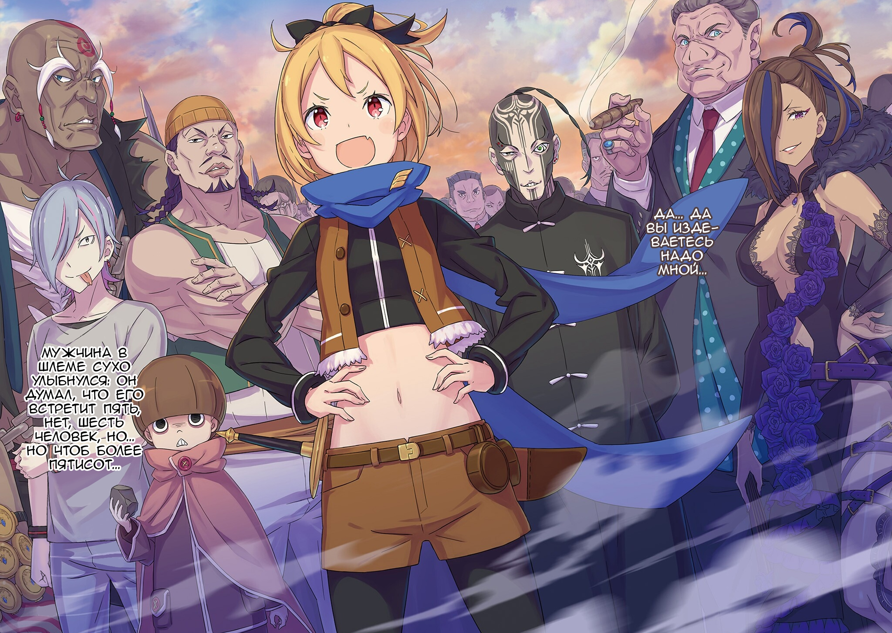
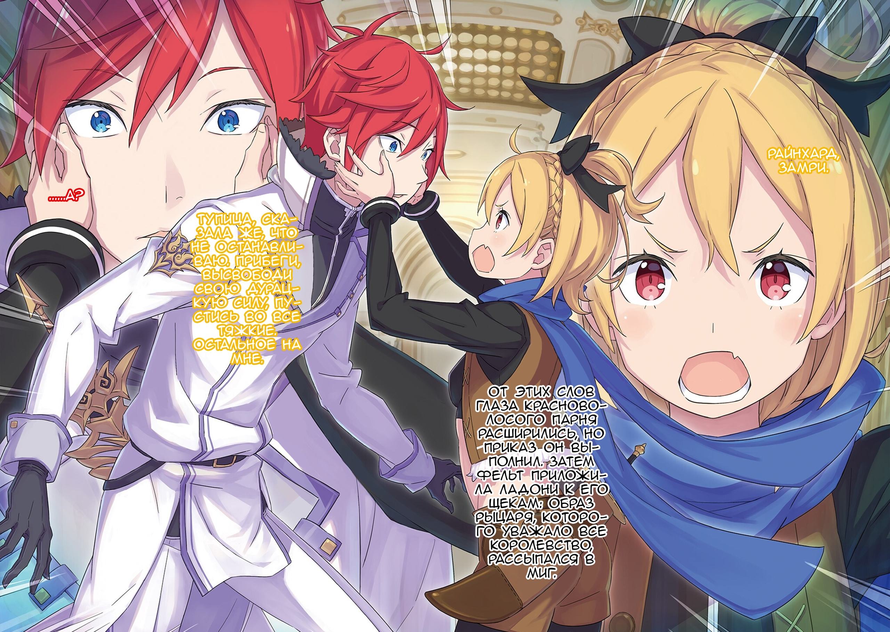
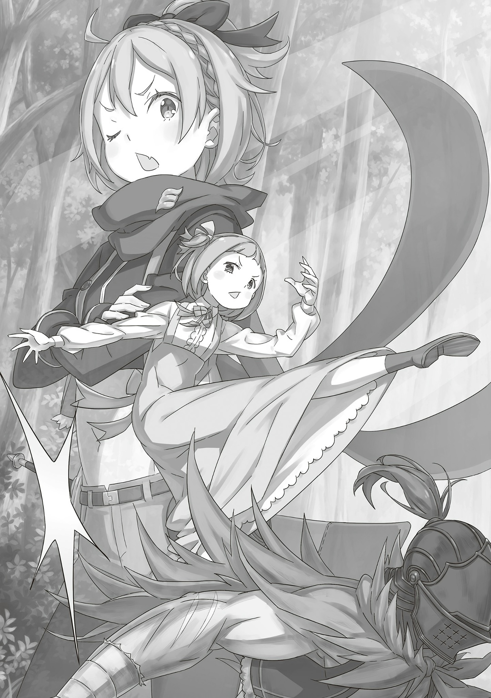
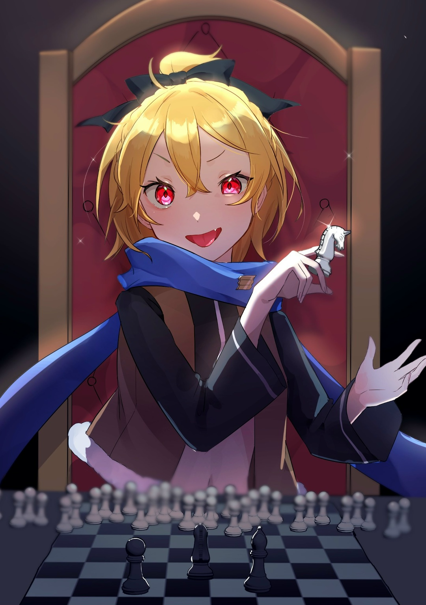

…Трудности, беды, знать про которые мог только он; дни, время, когда сожалел, раскаивался, когда его мучила совесть; черноволосый некто рассказывал обо всем, что пережил; небывалый беспредел и чудовищное бремя, от которых леденела душа; хотелось посочувствовать ему, утешить, обнять, но нельзя — можно лишь наблюдать. Он выговорился, выплеснул все то, что так давно держал в себе. Однако его настрой смотреть только вперед, не опускать руки, так и остался хрупким, словно стеклянная ваза.

— Что ж, насчет платы.

Цена, чтобы выйти из мира грез — вот, что имела в виду противная «Ведьма».

Беловолосая девушка с озорством высунула язык: пустой миловидностью она незаметно дергала за ниточки.

— Да, решено.

В прошлый раз «Ведьма» потребовала забыть о чаепитии, но что же потребует теперь? Черноволосый некто поневоле насторожился, но девушка, будто в насмешку, лишь коснулась платка, который развевался на ветру.

…По краям белой ткани тянулась золотая обшивка, а посередине красовалась мордашка серого кота, Великого Духа.

— Платок Петры…?

Хотелось закричать во все горло: «Хватит!». Во всю мощь легких крикнуть: «Достаточно!». Броситься наперерез жуткой «Ведьме» и прокричать: «Прекрати!». Жаль — ни горла, ни легких, ни даже ног для этого не нашлось, а больше и некому было вмешиваться. Бесконечные «Остановись! Не надо!», которые раз за разом прокручивались в голове, в сердце, в самой душе, конец этому уж точно не положат.

— Плату за чаепитие я взяла. Жду тебя, всем сердцем жду тебя в гости еще раз.

Мой платок помог, какое же счастье, облегчение… но почему? Зачем «Ведьме» этот обычный кусок ткани? Все это было так странно, так загадочно, пугающе.

— Ехидна свое слово сдержала. Чаепитие я не забыл.

Мир грез… нет, все вокруг побелело, а затем черноволосый некто очнулся в темном, холодном месте — именно отсюда он и попадал к «Ведьме». …Вот только на этот раз что-то было не так.

— …Эмилия, где она?

Сердце заколотилось, чутье стало бить в набат. Петли повторялись, они всегда начинались одинаково. Так почему же? Что пошло не так? Гробница, наверное, она просто вышла из Гробницы, нужно тоже, быстрее… Лунный луч ударил ему в глаза, а затем и…,

— Мрак…?

«Святилище» поглощала тьма — дело рук «Ведьмы» куда страшней, чем прошлая. Мольба остановить все это, вопль, плач, слезы, сопротивление не помогут, да никогда и не помогали. Такова история, таков тернистый путь, через который он постоянно пробивался, чтобы спасти себя и других.

…А я? Помогла ли я хоть чем-то?

△ ▼ △ ▼ △ ▼ △

…Шестым чувством Яэ уловила засаду: следом раздался знакомый самоуверенный голос. Шлемоголовый; так к нему обратились. Отвлечь врагов «Драконом» не получилось, а жаль, теперь придется выпутываться из беды…,

— Эй-эй, это что, та светловолосая соплячка?! Которая себе в лагерь Райнхарда заграбастала?! С хера ли она вообще здесь? Я думал у нас все шито-крыто!

Неразбериха сразу окрасила лицо Хейнкеля в растерянность. Альдебарана выбило из колеи так же сильно, но его эмоции заглушил самый шумный из сообщников.

— …Черт, я матрицу обновил пятнадцать секунд назад.

Он менял ее, чтобы, в случае чего, переиграть внезапное нападение. К сожалению, такая тактика вышла боком. Всего пятнадцать секунд: теперь битва неизбежна. …Для Альдебарана засады были куда страшней обычных внезапностей. Не важно, проницательностью или догадкой, но враг подобрал лучшую минуту.

— Госпожа «Святого Меча»… Получается, нам поперек встала почтенная Фельтушка~…? Хм-м-м, Хейнкель-сама, чую время вам стать жертвой и состроить жалобные глазки~.

— …Кх, ниче те мое заложничество не даст! Шалупонь за лесом хочет, чтобы Райнхард возглавил Дом Астрея, а меня угораздило лебезить с вами… убьют меня и не подумают, вот что они сделают!

— …Ваааушки~, а минусы будут? Похоже, сами Боги ниспослали нам образцового заложника~.

— Слушай сюда, служанка, засунь свои дерьмовые шуточки куда подальше! У нас тут враг вообще-то на пороге!

Вот только она не шутила. Пока Хейнкель кричал, Яэ пожала плечами, посмотрела на Альдебарана и спросила: «Что будем делать~?». Против двух растерянных мужчин средних лет она спокойно отнеслась к происходящему: похоже, тренировки шиноби отточили ее дух. Сколько бы миллионов раз не умирал, Альдебарану еще до такого расти и расти…,

— Старик не пойдет.

Если за лесом и правда ждал лагерь Фельт, то делать из Хейнкеля заложника не вариант. Однако, если такое случится, на его могиле нужно будет написать «Здесь покоится любимый и уважаемый Хейнкель Астрея». Альдебаран не видел цельной картины, а потому на ум ему ничего толкового не приходило.

— Стойте здесь. Туда пойду я.

— Чт-… Ты что, крышей поехал? Эта баба, она ж шиноби, нет? Если кому и идти, то ей! Ну же, служанка, скажи ему!

— …Ал-сама, так будет лучше всего?

— Да.

Яэ покорно отошла назад, склонила голову и ответила: «Тогда идите~». Краснолицый Хейнкель попытался было настоять на своем, но…,

— Все будет тип-топ~, Хейнкель-сама. Не нужно волноваться; Ал-сама и не такое проворачивал: например, «Божественного Дракона» себе подчинил. Он знает, что делать, уверена.

— Я… Ну… Может быть и так…

Хейнкель нехотя согласился с Яэ. Ожидаемо, слава старого Волканики во многом помогала. Даже сейчас, когда их обошли, она вселяла уверенность, что Альдебаран не падет без боя. К сожалению, в этой петле плана у него еще не было.

— Логово Óни или яма со змеями? Что же из?

Так и так — мучение. Альдебаран спрятал эти беспокойные мысли под шлем и одиноко удалился от сообщников. Личность врага, его враждебность, боевая мощь — все это нужно было узнать, чтобы найти ключ из этой передряги…,

— …А? Смело ты вышел, небось ко всему уже подготовился, да?

Высокие деревья на пути закончились и взору предстала равнина. Там, с улыбкой обнажая белые клыки, стояла золотоволосая девушка с красными глазами; как и ожидалось, Фельт.

— …

После Райнхарда его уже вряд ли что удивит. Собрав все знания о лагере Фельт, Альдебаран примерно оценил силы врага: со «Святым Меча» и «Серым» — Эццо, он уже разобрался. Оставалось трио бывших разбойников, младшая сестра Флам, которую он еще не видел, и старый великан, что когда-то ворвался в Королевский Замок.

Сама Фельт навряд ли была сильнее «Принцессы Солнца». В битве один на один даже Присцилла не сравнилась бы с Альдебараном. Быть может, Фельт скрывает свою истинную силу? Впрочем, у него все равно было множество способов ее победить.

Так Альдебаран думал прежде, чем вышел из леса…,

— Да… да вы издеваетесь надо мной…

Мужчина в шлеме сухо улыбнулся: он думал, что его встретит пять, нет, шесть человек, но… но чтоб более пятисот…

△ ▼ △ ▼ △ ▼ △

…Фельт выросла в трущобах. Конечно, сейчас она была положением намного выше, но в ней все еще жил дух нищеты. Еда, вода, одежда, дом — все есть, но вот только это принадлежало не Фельт, а Райнхарду, семье Астрея. То, что «Святой Меча» стал ее Рыцарем, ей личных владений отнюдь не прибавило. Вкусная еда, качественная одежда, спокойный сон — Фельт такие «Карты» попросту не нужны, у нее есть качества «Быть Сильной» и без них. Смелость перед любыми трудностями, чутье на неприятности, ловкость, востроглазость — вот что подарила ей жизнь в трущобах… А случай с «Охотницей за Потрохами», где она познакомилась с Райнхардом, эти качества только отточил.

Оттачивала она их и после, когда усердно училась, чтобы не опозориться на Королевских Выборах. …И все же у Фельт так ни разу и не получилось отбиться от рук Райнхарда. Так или иначе, она расширила свой кругозор и теперь замечала то, чего не видела раньше, предчувствовала беды. …Например, когда Флам телепатией сообщила Грассис о том, что случилось в Сторожевой Башне Плеяд.

— …Фельт-сама, мне нужно спешить в Песчаные Дюны. Скорее всего, придется сразиться с «Божественным Драконом». Наш бой может выйти за Песчаное Море, и тогда потерь не избежать.

— Тормозни-ка… Ты же вроде говорил, что в этой песчаной свалке тебя больше всего ослабляет, да? Думаю, биться с тобой там лучший варик для врага.

— …Да, все из-за миазм. Даже так, мне нужно идти — в башне Флам и Эццо-доно. К тому же…

Известие Грассис пробудило в «Святом Мече» чувство долга. Фельт ответила ему: «Да знаю я» и почесала голову. Как же ей сейчас не нравилось лицо Райнхарда, но куда важнее было сказать ему, что…,

— Я тебя не останавливаю, просто не иди один. …Возьми с собой нас.

— Фельт-сама, такое я точно…!

— Сам безрассудствуешь, а другим, значит, не даешь? Губу раскатай, не только ты здесь хочешь сделать все возможное.

— …

Райнхард не знал, что ответить, но оно и понятно: враг победил Эццо и Флам, а еще объединился с «Божественным Драконом». Под угрозу могло попасть все Королевство: трудность, решить которую должен был настоящий «Святой Меча».

— Не понимаю.

— Чего именно вы не понимаете?

— О телепатии Флам он вряд ли знает, но даже так… Все живое вокруг сразу бы почувствовало силу «Божественного Дракона». Очевидно, ты бы тоже ее ощутил и помчался бы туда. О чем вообще думает этот шлемоголовый?

— Хотите сказать, он меня так выманивает?

— А что, по-твоему, лучше: ждать врагов или надеяться, что они не пожалуют?

Райнхард всерьез задумался над догадкой Фельт. Если ждет, значит, верит в свою победу? Неспроста он объединился с Волканикой. «Божественный Дракон»; миазмы Аугрии; победит ли Райнхард?

— Все равно… Все равно я должен идти. Кто, если не я?

— …Райнхард, замри.

От этих слов глаза красноволосого парня расширились, но приказ он выполнил. Затем Фельт приложила ладони к его щекам: образ Рыцаря, которого уважало все Королевство, рассыпался в миг.

— Тупица, сказала же, что не останавливаю. Прибеги, высвободи свою дурацкую силу, пустись во все тяжкие. …Остальное на мне.

— …А?

Еще чуть-чуть и они соприкоснулись бы носами; в секунду, когда небесно-голубые глаза «Святого Меча» дрогнули от удивления, дверь в комнату с силой распахнулась. На порог впопыхах заявилось знакомое трио…,

— Как раз вовремя. Вы сделали все, что я просила?

— Ха-а, ха-а-а… Как же тяжело… — А чем наши-то повозки вам не угодили? Уж их-то мы точно не боимся случайно поломать, миледи. — Придурок, а как же земляной дракон, он… Забей. С нами что, еще и Ром будет? Да что вообще стряслось, ска́жите уже наконец? Грассис нам ничего не говорит.

— Драконья повозка на месте, как и заказывали.

Трио разгильдяев еле протиснулось в дверной проем, а следом за ними зашла и сонная Грассис. На толпу гостей Райнхард посмотрел изумленно, словно глупый ребенок. Фельт лишь усмехнулась и сказала ему:

— Эй, а ну-ка личико попрезентабельнее сделал.

— Фельт-сама…

— Не думай, что ты один здесь за работой, Райнхард. Ты не сильнейший, тебе не под силу даже с этими тремя одновременно за руки взяться.

Фельт демонстративно пожала плечами. Тут Райнхард моргнул, набрал в легкие воздуха и медленно смахнул эмоции с глаз…,

— …Да. Я — «Святой Меча», которому не по силам взять их троих за руки.

Он кивнул, но не как «Святой Меча», а как старый-добрый Райнхард.

△ ▼ △ ▼ △ ▼ △

Госпожа поручила своему Рыцарю задание; нужно было торопиться. Райнхард тащил драконью повозку, которую нашли Грассис и остальные. По пути из столицы Королевства в Песчаные Дюны он доставил лагерь Фельт в Дом Астрея.

— Вынужден вас покинуть, Фельт-сама.

— Давай-давай, надери ему там зад!!!

Хоть у Райнхарда и была «Божественная Защита Уклонения от Ветра», но еще раз оказаться в подобной экстренной поездке Фельт не хотела. …«Ведьма Зависти» внезапно появилась в Песчаных Дюнах и до сих пор сражалась со «Святым Меча». Враг оказался куда страшнее, чем можно было ожидать.

— Саму «Ведьму Зависти»… Да я даже в свои лучшие годы на такое бы не пошел. Я этого шлемоголового знать не знаю, но у него точно не все дома.

Старик Ром протяжно вздохнул, поглаживая большой ладонью свою лысую голову. Они встретились с ним во владениях Астрея. Как и Эццо, Ром был главным стратегом в их лагере. На его слова Фельт покачала головой и,

— Не знаю, не походил он на сумасшедшего. Его видок и речь, конечно, своеобразные, но не хуже черноволосого братана и кошатины Круш-чан.

Об Але Фельт думала ни плохо ни хорошо. …Как и другие Рыцари, он очень дорожил своей госпожой, поэтому вывод напрашивался сам собой:

— …Большая потеря резанула его сердце.

…В начале даже как-то не верилось. Внутренние распри Империи Волакия забрали жизнь Присциллы Бариэль. Фельт узнала об этом в столице Королевства. Ничего особенного она по этому поводу не чувствовала. В Присцилле кипела жизнь: казалось, смерть должна была протянуть к ней руки в последнюю очередь.

— …Все мы рано или поздно помрем. Это просто нужно принять. Но видимо шлемоголовый не такой, как все.

— И что же он задумал? Флам доложила телепатией, что на его стороне «Божественный Дракон». Он что, вместе с собой решил еще и весь мир забрать?

— Вряд ли, конечно, но…

Отвернуться от всех и вдогонку потащить на дно весь мир, — так, значит, он скорбел по Присцилле? …Нет, дело не в этом. Если бы Ал хотел разрушить мир, то сперва бы избавился от Райнхарда.

— Помоги он «Ведьме»… «Ведьме Зависти», Райнхард уже давно бы проиграл. У него какая-то другая цель.

— О? Рачинс пасть разинул? Раз Мастер в башне, решил за него головой лагеря побыть?

— Ага, конечно. Мое мнение одно: драпать всем нужно и поскорее. «Ведьма Зависти» нам не по зубам.

Рачинс цокнул длинным языком и огрызнулся на Фельт. Рядом с ним стояли и поддакивали Кэмберли с Гастоном:

— Да, госпожа, правильно он говорит! Там ж еще «Божественный Дракон»! Нам хана, если пойдем!

— Фельт, мы, надеюсь, сюда приехали просто людей забрать, да?

— И это тоже.

— Видишь, Кэм? Она… В смысле «и это тоже»?!

На секунду Гастон обрадовался, но затем до него дошло. Фельт рассмеялась со словами: «В прямом, в прямом» и,

— Мысленно готовиться к худшему не вредно, но вот дебоширить тут не надо. Вас одна «Ведьма» уже на уши ставит.

— Конечно она ставит! А вам, что ли, вообще по барабану?! Это ж «Ведьма», «ВЕДЬМА»!

— Твою барышню вроде так же называют, не?

— Тото «Коварная Кокетка», а не «Ведьма», плюсом она ничего такая, все у нас пучком!

— Кэм! Говори по делу!

Рачинс с силой ударил по карте на столешнице, чтобы вернуть разговор в нужное русло, а затем:

— Без плана нам точно кабзда.

— Полюбасу все хотят делать ноги, значит, будем делать ноги!

— Все будет так, как скажет она.

Вмешался старик Ром; Фельт молчала; Рачинс недоверчиво хмыкнул; Гастон помрачнел; у Кэмберли подкосились ноги; ответ, они ждали ответ главы лагеря. С каких же пор трио бывших разбойников такое дружное?

— Не люблю я, когда люди просто сидят и ждут: ждут, пока плохое уйдет, ждут, пока кто-то разберется за них. Всегда не любила.

— А пыл-то какой, ха. В кого же ты такая уродилась?

— Кто знает, кто знает. У моего приемного папаши спросите.

На слова Рома, который покачал головой, Фельт игриво высунула язык. Затем она резко обернулась и посмотрела на тех, кто ждал ее окончательного решения.

И вот,

— Время показать, на что мы способны. …Моего Райнхарда оставили в дураках, так что не сдерживаемся! Наваляем врагу за обе щеки!

△ ▼ △ ▼ △ ▼ △

…Лагерь Фельт двинулся в путь. На восточном крае мира бушевала битва между Райнхардом и «Ведьмой Зависти». Виновник всего — Ал — скрылся в Песчаном Море вместе с «Божественным Драконом»… Куда же они направились?

— Местные говорят «Дракон» улетел на север. Если так, то с ним и шлемоголовый… Но…

— «Если так»? А что, может быть по-другому?

— Может. Планы шлемоголового довольно-таки дотошны: он даже продумал, как остановить Райнхарда. Сдался ему этот городок? Вряд ли он прилетал просто так.

— Думаешь, он спецом показывал всем «Дракона»?

— Думаю, да. …В конце концов, «Божественный Дракон» может взлететь настолько высоко, что обычный люд его попросту не увидит. И все же люд увидел: говорит, на север они ушли.

Ром выдвинул необычное предположение. Все всегда лежит на поверхности, но только не в этом случае; Фельт тоже так думала,

— И для чего тогда вся эта показуха?

— Очевидно, шлемоголовый нас так отвлекает… Север и восток отпадают, остаются юг с западом.

— …Принцесса умерла в Империи. Может, он хочет с помощью «Божественного Дракона» разжечь войну с Волакией? Мы и так с этой страной не особо дружим, а он… хотя навряд ли.

В такой ситуации разногласий между нациями не избежать. Однако это противоречило бы официальному письму о развитии дипломатических отношений между Волакией и Лугуникой, которое пришло вместе с вестью о смерти Присциллы. Тем более что всему виной был бы Ал, а не само Королевство. Фельт продолжила:

— Так и так он смертник, который тянет всех за собой. Тогда…

— …Тогда что?

— …Чутье подсказывает мне, что он полетел на запад, но не знаю точно — на северо-запад, юго-запад или прямо на запад.

— Если «Дракон» просто отвлекает нас, то северо-запад мы убираем. Остаются два варианта…

— Да, всего два…

…И вот, Фельт выстроила на равнине мощь своего лагеря и не только. Дом Астрея не располагал большой армией, все-таки был Райнхард, поэтому пришлось выкручиваться. Небольшой отряд солдат вывозил жителей из городов, где мог бы пройти враг. Они могли себе это позволить. Главное — защита, а еще важнее…,

— …С тобой точно что-то не так, девчонка.

— …Да не-не-не, ты просто не врубаешь. Мне вот ее решительность нравится: захотела и втянула нас — вассалов настоящего насилия — в свои дела. Как ее сторонник, я могу держать нос высоко.

— …И где же, интересно, этот твой нос? Из-за вызывающих татуировок ничегошеньки не разглядишь.

Разные манеры, но единая сторона. Один — большой жилистый свиночеловек, ростом со старика Рома. Другой — вызывающий чудак с лицом, покрытым синими татуировками весов. Третий — настоящая красавица в кокетливом наряде, который совсем не подходил к обстановке вокруг. …«Черное Серебро», «Весы» и «Сад Цветочной Тюрьмы». Между ними не было и намека на дружбу, но всех их объединяло одно. …Приказ Фельт. Здесь собрались влиятельные люди, которые заправляли преступным миром Фландрии, города к северо-востоку от Дома Астрея. Фельт познакомилась с ними из-за одного случая и общалась до сих пор. Вся ее армия состояла из преступников, которых мучали угрызения совести, но зло они творили крайне необходимое. Около пятисот живых душ доверились чутью Фельт и хотели ей помочь.

— Ха! Ну у меня и армия собралась! Аж глаз радуется!

Фельт приставила руку козырьком ко лбу и сверху-вниз оценила строй из пяти сотен уголовников. По правде говоря, ей хватило бы и пятидесяти человек: фландрийцы оказались куда вовлеченней.

— Хотя они знают, что враг обвел Райнхарда вокруг пальца… Блин, все бы отдала, чтобы тебе это показать.

Показать Райнхарду, что в мире много людей, которые не подожмут хвост перед такими трудностями, которые будут сражаться несмотря ни на что.

— Ну, ясен пень, есть и такие, как Кэмберли: настолько упрямые, что никогда не дадут заднюю.

Пролепетала Фельт, а затем повернулась спиной к союзникам и хрустнула шеей. Впереди стоял большой дремучий лес. Она вдохнула столько воздуха, сколько могла, и крикнула:

— Эй! Слышишь меня, шлемоголовый? Я знаю, что ты там!

Так началась их битва.

△ ▼ △ ▼ △ ▼ △

…Невообразимое зрелище; от неожиданности Альдебаран застыл.

— Точно издеваетесь…

Все пошло не по плану. Восхищение и страх — вот что он почувствовал. Каждый из них выделялся, не походил на других, но они все равно выстроились здесь, на равнине, чтобы дать отпор. На лице Альдебарана поневоле появилась сухая улыбка. Врагов собралось намного больше, чем он ожидал.

— …

Что же делать? Неожиданности всегда заставали его врасплох; разные мысли крутились в голове. Альдебарану не быть таким же спокойным, как Яэ. Если бы не Полномочие, она никогда бы не встала на его сторону. Как бы то ни было…,

— А ты, видно, большая шишка, Фельт.

Ключевая фигура, которая превзошла все его ожидания. За минувшие три месяца Фельт выросла как личность. И неудивительно: за первый год ее талант признала даже Присцилла. Влияние Фельт намного превышало влияние Альдебарана. …Даже так, он не отступит.

— Пришли меня поприветствовать? Спасибо, конечно, но у вас там «Святой Меча» в беде. Может, лучше ему поможете…?

— …Без обид, шлемоголовый.

— …

У Альдебарана было множество вопросов, но Фельт перебила его, почесала голову и закрыла один глаз. А затем…,

— Мы с Ромом решили, что перво-наперво заткнем тебе рот.

— …Кх.

Ужас охватил Альдебарана, но приходить в себя было уже слишком поздно: маленькая тень выпрыгнула из кустов леса и со всей силы ударила его по шее.

— Кха, кху…

Мозг завыл; колени подогнулись; силы ушли. Уголком зрения он увидел того, кто нанес этот удар: девочка с двумя пучками розовых волос ловко приземлилась на траву и посмотрела на него сонными глазами. Ее лицо показалось Альдебарану очень знакомым.

— Это тебе за Флам.

Младшая сестра Флам; удерживая себя в себе, Альдебаран лишь пробормотал ей:

— Я… еще… не… умер…

Машинально он проглотил яд за моляром. Его сознание начала затягивать тьма. Глотать отраву стало так обыденно, так привычно. Душа и тело Альдебарана уже приспособились к такому. Против этой тактики ничего не мог сделать даже Райнхард. В конце концов, только Альдебаран лучше всего знал, как убить Альдебарана…,

× × ×

— Эй! Слышишь меня, шлемоголовый? Я знаю, что ты там!

Боль пропала; энергичный, властный голос мигом привел его в чувство. Новая матрица, новая враждебность, новая битва, новая попытка.

— Эй-эй, это что, та светловолосая соплячка?! Которая себе в лагерь Райнхарда заграбастала?! С хера ли она вообще здесь? Я думал у нас все шито-крыто!

И снова: Хейнкель поднял кипиш, а Яэ попыталась успокоить его, но только чтобы еще сильнее спровоцировать. Что же узнал Альдебаран за первую попытку? Трио бывших разбойников, старый великан и младшая сестра Флам — он надеялся, что их будет всего пять. Но в засаде сидело стократно больше.

— Похоже, ими командует кто-то чересчур мозговитый.

Со «Святым Меча», Райнхардом ван Астреей, ему пришлось нелегко, но кто же знал, что…,

— Серьезно, я всем сердцем ненавижу подобные тактики, Фельт.

…Так еще раз началась неизбежная битва между Альдебараном и врагом, который превосходил его числом.

