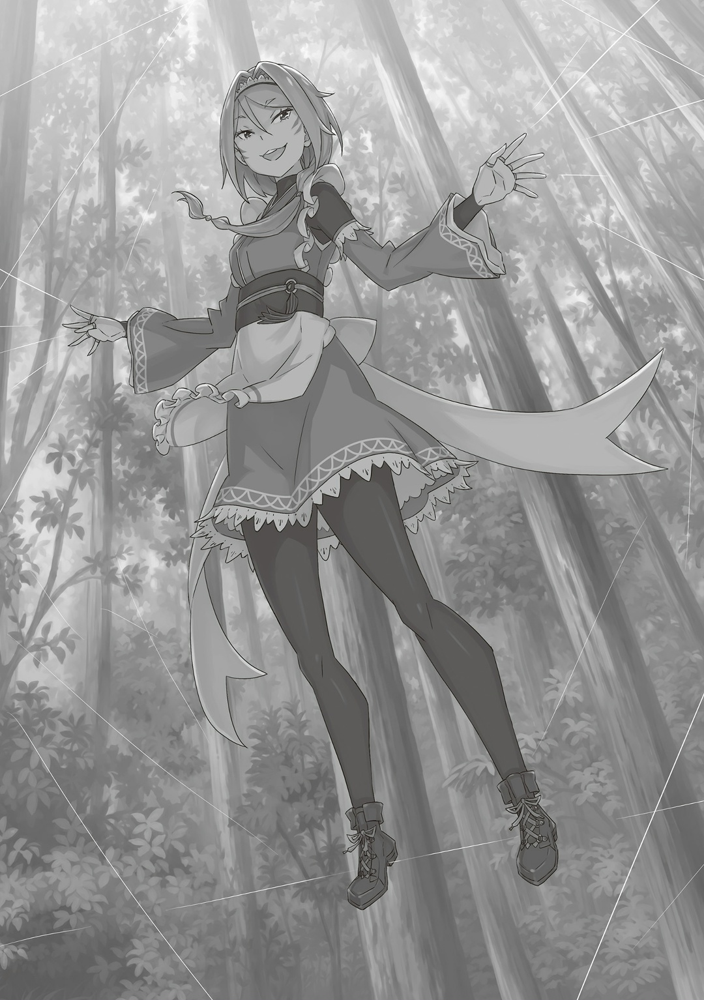

— …Люблю тебя.

Мир перекрыли бесстрастные слова о любви.

— …

«Звук», был ли он вообще? Треск, грохот, скрежет, хруп, трещание, хруст, звон, дребезг, громыханье…

— …Люблю тебя, люблю тебя, люблю тебя.

«Звук», был ли он вообще? Казалось, всему пришел конец. Мрак насильно заключил в объятия одну живую душу, любовью гуляя по ее ушам. Чернота куда ни погляди. Хоть глаз выколи. Тьма сменила свет навеки. В этой пучине душа вдруг осознала: все исчезло, пропало. И важное, и неважное потеряло свой цвет…,

Принять такой исход — слабость? …Нет, это мягкосердечие.

Сдаться в руки мраку — слабость? …Нет, мягкосердечие.

Отмахнуться от бесстрастной любви — слабость? …Мягкосердечие.

— …Люблю тебя, люблю тебя, люблю тебя, люблю тебя.

Всем, что только есть, душа закричала на пошепт безоговорочной любви. Бесполезно. Без толку. Всецело ее не отвергнуть.

— Люблю тебя, люблю тебя, люблю тебя, люблю тебя, люблю тебя, люблю тебя, люблю тебя, люблю тебя.

Промелькнула надежда. В своем сердце душа припасла три сокровенных места. Вот только их уже заняли. Даже так: промелькнула надежда. Но душа совсем не благоволила этой жалкой, низкой любви. Тогда оставалось одно…,

— Люблю тебя. Люблю тебя. …Люби меня.

…Надежда.

— Люби меня. Люби меня. Люби меня. Люби меня. Люби меня, люби меня, люби меня, люби меня, люби меня, люби меня, любименя, любименя, любименя, любименя, любименя, любименя, любименялюбименялюбименялюбименялюбименялюбименялюбилюбилюбилюбилюбилюбименяменяменяменяменяменялюбименялюбименялюбименялюбименялюбименялюбименя. …Люби меня.

Ожидаемый исход.

Предсказуемый. Все равно что ребенка обмануть. Даже легче, чем моргать или дышать.

Закономерно.

Ибо любили не ради другого, а ради себя. Если думать лишь о себе, забыть о чувствах второй стороны, то исход будет именно таким. Стыд, да и только.

— …Ненавижу тебя.

…Сердце застыло от таких холодных слов.

— Никогда не полюблю. Ни за что.

…Застыло так, словно это сказали ей, наблюдателю. Внезапное чувство, будто скоро умирать. Но даже этот страх смерти меркнул перед тем, что ожидало впереди. В конце концов…,

— Платок Петры…?

…Конец настал. Петля сомкнулась на шее.

△ ▼ △ ▼ △ ▼ △

…Флам выжила и сообщила Райнхарду о происшествии в башне. Мужчина в шлеме прекрасно понимал, что о его предательстве узнают Фельт с Советом Мудрецов. Грозных врагов он хотел отвлечь «Драконом», но ничего не вышло: золотоволосая девушка сделала ход конем. Альдебаран недооценил ее. Примерно пять сотен человек пришли на равнину драться. Так она собиралась одолеть мужчину в шлеме.

— Сколько же в этом мире звездных игроков, не счесть… И я им не чета́.

— Слушай сюда, служанка, засунь свои дерьмовые шуточки куда подальше! У нас тут враг вообще-то на пороге!

Буркнул Альдебаран, пожимая плечами. А следом раздался недовольный крик. Красноволосый мужчина ругался на все живое… нет, на Яэ. Ибо нечего из него заложника делать. Так или иначе…,

— Старик дело говорит. Пора закругляться с шутками. Уверен, мы всё разрулим.

Альдебаран поджал губы. Не время жаловаться на судьбу. Нужно превозмогать. Нужна стратегия. Хейнкель стоял в растерянности, бледный. Яэ улыбалась, как-то странно улыбалась. Интересно, почему? Неважно. Итого выходит: две карты в руках и его бездарность.

— Негусто, но и у врага бойцы тоже черт-те какие.

— Каким же макаром ты это разруливать собрался? Перво-наперво, наш противник, он…

— Пятьсот человек. Что-то где-то около-того ждут нас за лесом. На рыцарей или стражников они не походят. Но драться точно умеют. Фельт у них там птица высокого полета, поэтому нам нужно повидаться с ней лично. Придется.

— Целых пятьсот, опупеееть~!

Быстро же они нашли людей. Яэ в изумлении поднесла палец к губам. Альдебаран был того же мнения: враг времени даром не терял, а работал в поте лица.

— Погоди-погоди-погоди! Полтыщи?! Полтыщи не солдат?! Что за нахер!? Нет, погодите, погодь, ты… Ты как об этом узнал?

— Не бери в голову, старик. Не важно, как я об этом узнал. Важно, что их пять сотен. И да, не забывай про нашу сделку. …Пойдешь против меня — и «Драконьей Крови» тебе не видать.

— Гх…

— Тех, кто переобувается на ходу, люди ой как не любят. Заруби себе это на носу.

Хейнкель раздосадовался, но больше ничего ему не пискнул. Он ничем не отличался от осла, перед мордой которого повесили аппетитную морковку. Хотя, в защиту Хейнкеля, можно сказать: тянулся он за морковкой редчайшей, ключевой. Ради нее не стыдно и голову склонить. Ведь других таких морковок можно и не найти.

— Пока Хейнкель-сама молчит в тряпочку, спрошу: что делать будем~? Пятьсот человек — это вам не хухры-мухры, головняк самый настоящий.

— Головняк? А я думал Волакия вырастила из тебя образцового шиноби.

— Какой я вам образцовый шиноби, если даже с наемным убийством госпожи не справилась~? Да и мы, шиноби, больше по одиночным целям мастаки. С такими требованиями вам к «Синей Молнии» надо.

— Справедливо.

Яэ сердито надула губы. Хотя и ненадолго, но однажды Альдебарану довелось объединить усилия с Сесилусом Сегмунтом. Этот бойкий актер был таким же чудовищем, как и Райнхард. Так что Яэ ничего не выдумывала. Такую бы силу Альдебарану, и тогда — ну, враг, ну погоди! К сожалению, его воздушные замки разбились о реальность еще в юности. Поэтому Альдебаран сказал…,

— Нас трое, их — полтысячи. Соваться к ним… это как с ножом на перестрелку прийти. Наша фора: лес. Так что просто по-тихому обойдем их, и всё.

Фельт окликнула его не просто так. Она знала, что он в лесу, но не знала, где именно. Иначе на них бы уже давно напали. Если будут искать — разделятся, а это Альдебарану очень даже на руку…,

— Ёюшки~, Ал-сама, беда, у нас беда.

Нужно действовать. Но внезапно Яэ насторожилась. Она дернула Альдебарана за рукав и пальцем указала в ту сторону, где ждала армия Фельт. Там, где-то там мужчина в шлеме увидел…,

— А они, видать, серьезно за нас взялись~.

…В лес очередью бросали поленья, из которых валил белый дым.

△ ▼ △ ▼ △ ▼ △

— Ну еще бы он сюда просто так пришел.

Жаловалась Фельт, стоя среди сплошной толпы на равнине. В лесу прятался враг… Или не враг: она сразу не решила, как его назвать. Другом, беглым приятелем или ее хорошим знакомым он точно не был. Но, чтобы в солдатах взыграла кровь, лучше его как-то обозвать. Вот почему Фельт громко и прямо объявила, что шлемоголовый… Ал — враг. И что он прячется где-то в лесу.

— А он точно там? Отвечаешь? Просто не хочется оказаться туполобой девкой, которая притащилась откашлять вопросики с пустым лесом.

— Хахаха, можете во мне не сомневаться, «Золотой Лев». Хоть у меня рабочий всего один глаз, но мне даже напрягаться не надо, чтобы их увидеть.

Сказал с явным акцентом начальник «Весов»… Манфред Мэдисон. В его подразделении все обязательно набивали себе на теле татуировку весов — так они доказывали свою преданность. Но сам Манфред зашел с этим слишком далеко: бритая голова, лицо, шея, даже глазное яблоко — всё в татуировках.

А это только из обнаженных частей. Вообразить страшно, что могло твориться у него под одеждой. К слову, чудаком он был не только внешне. …Но и внутренне.

— …«Божественная Защита Дальновидности».

Его левый глаз татуировки почему-то обошли стороной. Сейчас он вращал им, всматриваясь в густой лес. Так почему же обошли? Интересная подробность: еще недавно левый глаз Манфреда покрывали татуировки. А все дело в том, что он просто заменил его другим. Да, Манфред засунул себе в орбиту глазное яблоко своего подчиненного,

— Как и думал, нельзя привыкнуть к чужой Божественной Защите. Даже так — я их увидел.

— Как полезно. Но противно. Но полезно… Но противно. Расскажешь, как это провернул?

— Вы восхитительно прямолинейны. …К сожалению, нам, «Весам», строго запрещено рассказывать, как воровать Божественные Защиты. Все-таки — одна из наших тайн.

Манфред подтвердил, что в лесу есть враг, однако про сам способ умолчал. Но Фельт и не сомневалась. Ведь в прошлом уже изрядно намучалась с этой «Божественной Защитой Дальновидности». Тут она промолвила:

— Значит, выходить они не собираются…

— Тогда мы заставим их силком.

Старик Ром подхватил слова Фельт и хрустнул мощной шеей. Стратег-великан выжал максимум из «Божественной Защиты Дальновидности» и на ее основе составил стратагему. Следующим ходом против врага в лесу станет…,

— Сжечь дерево-пирофит — дело трудное, а дыма оно выделяет при поджоге немерено. Окачивай его водой сколько хочешь — гореть оно не перестанет. Безупречная стратагема.

Простой и понятный план. Гастон и другие головорезы сразу принялись закидывать в лес подожженные поленья. Всё, как и сказал Ром: дерево-пирофит хорошо дымилось, но огонь не разносило. Вот так забелел густой лес. Тут Ром сказал:

— Видимости мы их лишили. Возможно, переполошили. Но изюминка нашего плана совсем-совсем не в этом: подождем, пока они вдохнут немного дымку.

— Бьюсь об заклад, кашлять они будут долго.

— Да, битый час в адских муках. К слову…

Старик Ром прищурился: поодаль от них стоял Кэмберли с хозяйкой «Сада Цветочной Тюрьмы», Тото. По приказу ее подчиненные вызвали в лесу магическую бурю. Порыв ветра не корежил деревья, а наоборот — мягко разводил их в стороны. Теперь белый дым мог свободно гулять по лесу. Ром негромко прибавил:

— Бывают люди, которым нипочем яд или тяжелые раны. Но за всю мою бесцельно долгую жизнь я не знавал никого, кто не корчился бы в муках от удушающего дыма.

Фельт была рада это слышать, но ее сильно смущал Ром — слишком уж хорошо он умел воевать. Чем же он раньше занимался? Она не знала, но зато понимала и чувствовала: Ром стыдится своего прошлого. Фельт не собиралась лезть не в свое дело. Может, когда-нибудь он сам ей все расскажет. Поэтому она лишь отрезала:

— Вот как. …А мой старик Ром не пальцем деланный.

△ ▼ △ ▼ △ ▼ △

— …Дым.

Все и так было хуже некуда, а тут еще и он. Враг действовал умно. Альдебаран удивленно наблюдал, как белый дым медленно расползается по лесу. Тут вмешался самый шумный из сообщников…,

— Э-эти суки поджигают лес! Они хотят сжечь нас заживо!

— Спокойствие~, только спокойствие~. Сильный огонь сожжет наши останки, а так враги не поймут — отправились мы к праотцам или нет. К тому же они еще и сами могут под огонь попасть. Если соединить «глупость» и «тактику», то «хорошего плана» не получится, смекаете, Хейнкель-сама?

— А наш противник умом и не блещет! Не забывай — она трущобная! Такие наперед не думают вообще!

— Какой трындец~, Ал-сама!

— Слышу. Старик, помолчи пока.

Хейнкель сильно нервничал, поэтому Альдебаран приказал ему молчать. Всё ради «Драконьей Крови». Жаль, что нельзя так же приказать сдаться врагам.

— …Яэ права. Думаю, они хотят взять нас удушающим дымом. Я слаб, он быстро меня уложит. Что насчет тебя, Яэ?

— Выдержать яды с пытками мне раз плюнуть, но вот только не удушающий дым. Никакие тренировки не спасут от слез и кашля.

— Ясно. Тогда остается просто бежать.

Выбора не было. Беда лишь в том, что враг именно этого и добивался. …В природе человека заложено бежать от любой опасности. Созданный врагом ветер обрубал им пути к отступлению… и оставлял только нужные.

— Снова я кого-то недооценил! Думал, они лес не смогут окружить! Ага, конечно!

Будь то небольшое войско, как у Альдебарана, или даже военная рать, дымом и ветром их можно подбить на глупость. Так Фельт с легкостью оцепила лес, который бы даже полтысячи человек не окружило. Тут Альдебаран промолвил:

— Думаю, это не Фельт, а кто-то очень мозговитый. Тц, мы у них как на ладони…

Альдебаран горько цокнул языком и мысленно нарисовал карту мира. Ему нужно было идти далеко-далеко на запад… Осталось шесть дней. Вот почему с Фельт лучше долго не засиживаться.

— Ал-сама!

— …Кх, Яэ, ты показываешь, где ветер! Старик, ты слушаешь Яэ и бежишь напролом! Руби все деревья на пути!

— …л-ладно.

— Я вас не слыышуу~, вы мямлите.

— ЛАДНО, ГОВОРЮ!!!

Хейнкель растерялся от резких указаний мужчины в шлеме, но потом закричал и бросился расчищать путь мечом. Следуя за ним по пятам, Альдебаран задумался. Они удалились от исходной точки, поэтому нужно было восстановить территорию, но если он изменит матрицу сейчас, то уже не вернется в положение до белого дыма. Все-таки в первой попытке Фельт не использовала ничего удушающего. Даже так, из головоболи оставалось пять сотен человек.

— Куда нам лучше пойти?

…В конечном счете Альдебаран победит. Ведь он уже обыграл «Святого Меча» и Нацуки Субару. А больше достойных соперников и не было. Главное — то, что следовало после победы. Так какой же путь приведет к этому быстрее?

— Ал-сама, нельзя забывать про Хейнкеля-сама. Если, конечно, мы не хотим, чтобы он погиб.

— …Ты права. Идем!

После секундного раздумья Альдебаран кивнул Яэ и побежал дальше. Попутно он переопределил матрицу… С новой исходной точкой Альдебаран легко отбросил все возможности до. Жизнь — это череда выборов. Большинство из них принимается мгновенно, без оглядки. Ничего страшного в этом нет. Альдебаран поступал так не раз. Что съесть завтра утром? Какой носок надеть первым — правый или левый? К решениям в бою он относился так же — без лишних колебаний. Пусть у него и Нацуки Субару возможностей куда больше, чем у обычных людей, особо нет смысла цепляться за выборы. …В конце концов, если Альдебаран не рискнет, то застрянет здесь надолго.

— Хейнкель-сама, дорога все хуже и хуже, нужно свернуть направо. Вооон то здоровенное дерево видите? Хорошо бы его смахнуть.

— Это не так-то просто, служанка! Ха…!

— Ооо~, чумааа! А вы, погляжу, неодушевленное только так рубите!

По приказу Яэ Хейнкель срубил большое дерево, но затем заскрипел зубами. Тут Альдебаран заметил — дым медленно окутывал их и густел. Это означало, что…,

— …Их засада уже рядом.

△ ▼ △ ▼ △ ▼ △

…Рачинс командовал отрядом засады. Его боевой строй встал у выхода из леса. Честно говоря, он боялся не справиться. Кровь стыла в жилах. Его жизнь пересеклась со «Святым Меча», «Божественным Драконом» и «Ведьмой Зависти».

— За что мне все это… В какой момент я свернул не туда?

Жаловался Рачинс. В отчаянии он теребил волосы и топтал траву. Иногда полезно дать волю эмоциям. Рачинса раздражало, что под его ногами сорняки не ломаются, а просто гнутся. Нет, даже хуже: они с силой упирались в его подошву. Живучие. Бесстыжие. Упрямые. Неподатливые. И правда — сорняки… Они чем-то напоминали ему друзей. Рачинс протяжно вздохнул. С недавних пор его жизнь сильно изменилась. Он был так далеко от дома. Но куда бы ветер ни уносил семена, сорняки так и останутся сорняками. Их травинки могли отличаться оттенком, толщиной стеблей, но им было не суждено вырасти в дерево или цветок.

— Куда бы меня ни занесло, я есть я.

Рачинс цокнул языком. Хотя никто не утверждал это прямо, чужое отношение говорило само за себя. Затем он заменил отчаяние с недовольством на цель и решимость. И вот, когда его дыхание выровнялось…,

— …Враг уже на подходе!

Один из головорезов начал бить в набат. В поле собрались люди преступного мира Фландрии, уголовники уровня Гастона, Кэмберли и Рачинса… нет, намного хуже, закалённее. В обычных обстоятельствах с ними лучше не пересекаться, но сейчас их объединяла цель. Рачинс взглянул на лес. Если все шло по плану, дым пригонит шлемоголового и его спутников сюда. Вот тут-то их и встретит отряд засады…,

— …А?!

Из леса выскочили. Но не мужчина в шлеме, а пушечное ядро. …Если точнее, из леса вылетело большое дерево. Оно яростно раскручивалось из стороны в сторону.

— …

Ствол толщиной с туловище Гастона и длиной в десять метров. Он летел сверху прямо в сердце их строя. Опасно. С криками головорезы разбежались, куда глаза глядят. Между тем…,

— …Эль Гоа!

Пальцем Рачинс выпустил магию. В голубом небе расцвел ярко-красный цветок — взрыв. Дерево разлетелось на кусочки. Его щепки ранили, но все же не сломали строй. Затем Рачинс закричал…,

— Вы че там, ворон считаете, или что, бляди! Яйца в кулак взяли быро, я вам говорю, сука! Кто очкует, тот не пляшет! Давно уж пора вбить это в свою тупоголовую башку!

Рачинс обратился к тем, кто струсил в самую трудную минуту. Со злости он даже выхватил нож, лезвием указал на лес и спросил головорезов: «Усекли?». Они видели, как в начале Рачинс жалобно ворчал, поэтому могли принять его за слабака. Но теперь пора показать, чего он стоит.

— Надеюсь, уже доперли, насколько же вам подфартило, что я здесь! Шлемоголовый может выскочить в любую секунду. Глаза разули и палим, где…

Он , — но договорить Рачинс не успел. «Берегись!!!», — закричали головорезы. Рачинс сердито развернулся. В его неприветливых глазах горела ярость. Из леса полетели деревья больше предыдущего.

— Твою-то мать!!!

Следом в небе прогремела череда ярких взрывов… На их строй подул буйный ветер. Нескольких головорезов сбило с ног. Глядя на них, ошарашенный Рачинс снова поднял лезвие в сторону леса. Их положение резко изменилось. Если так будет и дальше, они проиграют.

— …ЗА ДЕЛО, СУКИНЫ ДЕТИ!!!

Рачинс закричал на срыв и бросился в бой. Так он хотел поднять боевой дух. …Боевой дух своего отряда. Уличные драки его кое-чему научили: если драка неизбежна, бить надо первым. Хороший удар всегда покажет, что на самом деле представляет из себя противник. От ран человек отнюдь не зверел — он слабел от каждого пропущенного удара. С чувствами так же. И все же первый удар получили именно они. Вот почему им нужно было взять себя в руки…,

— ХААААААААААААА!!! ВПЕРЕД-ВПЕРЕД!!! — ХААААААААААААА!!! ВПЕРЕД-ВПЕРЕД!!!

Пылкая и легкомысленная толпа подхватила настрой Рачинса. Они яростно приближались к лесу. Все ближе и ближе. Чувствуя их силу за своей спиной, Рачинс произнес заклинание…,

— …АЛЬ ГОА!!!

С кровожадным криком он поднял руку вверх. Над головой Рачинса вспыхнул гигантский огненный шар… По силе это заклинание типа Гоа стояло намного выше класса Эль и Уль. Об этом знал любой новичок в магии. Для Рачинса создать такой шар — великое достижение. Головорезы воодушевились. Следом он запустил его высоко в небо. Огненный шар сжег бы все деревья на пути. Вот почему врагу нужно было срочно его погасить…,

— Да-да, давайте, брыкайтесь там!

Сказал Рачинс и, в насмешку, высунул язык. На его кончике сверкало разноцветное кольцо. Из леса по-прежнему вылетали большие деревья, но в шар так и не попадали. А все потому, что Рачинс их обманул. Он растянул обычный Гоа, но сделал вид, будто это Аль Гоа. Огненный шар потух еще от первого дерева, поэтому остальные снаряды просто вре́зались в равнину. Фальшивый Аль Гоа отвлек врага и заставил его зря потратить боеприпасы. И вот так отряд Рачинса прорвался в лес…,

— Мы кропаль опешили от внезапной атаки, но даже так…!

Пятьдесят человек добрались до леса в целости и сохранности. И всё благодаря Рачинсу. Но тут…,

— …Эх~, если б Хейнкель-сама не волновался, вы бы досюда не дошли~.

Раздался сладкий женский голос. Рачинс остановился. Нехорошее предчувствие. Он поневоле замер… нет, не так. Рачинс почувствовал неладное, но остановился не по своей воле. Он не мог двигаться. Не только он. Пятьдесят головорезов тоже. А все из-за…,

— Я хороша в бою один на один, правда, но всему есть предел.

Горничная с розовыми волосами глядела сквозь листву на застывший отряд Рачинса. Растерянные головорезы кричали, но всё без толку. …Высоко в деревьях. Нет, в воздухе. Стройная девушка гордо парила в воздухе и улыбалась. Они могли двигать только головой и глазами.

— Вот почему мне пришлось связать сотню человек. Разом.

Ужасающие боевые способности. Такие же ужасающие, как личность. Вот какая горничная сопровождала шлемоголового.

△ ▼ △ ▼ △ ▼ △

…Хейнкель рубил деревья, а потом они использовали их как снаряды. Усиление «Божественного Дракона» помогло, но это все равно было тяжело.

— Пользуетесь мной да еще и так грубо. Ал-сама, если соединить «грубо» и «использовать», то получится «эксплуататорство», знаете ведь?

Яэ и Альдебаран таскали тяжелые деревья на пусковую площадку. Она жаловалась на каждом шагу. Чтобы запустить снаряды в воздух, он использовал науку…,

— Старик, по моему сигналу тяни руки что есть сил. Не сдерживайся.

— Плевать на служанку, я хочу задать тебе пару вопросов, Альдебаран…!

— Сейчас не время! «Драконья Кровь», помни про «Драконью Кровь»!

— …Кх! Да жду я твой сигнал, жду!

Применить научные знания поможет Хейнкель. Он еще не напрягся, но вены уже вздулись по его телу. А виной всему — пьянство. Судьба не одарила его талантами, вот он и пил.

Они специально угодили в ловушку врага. …Сильное войско ждало их у выхода из леса. С ними нужно было разобраться как можно быстрее.

— Старик!

Хейнкель тут же стиснул зубы и напряг мышцы. Альдебарану с ним по силе не тягаться. Пушка выстрелила: дерево взлетело вверх. Сначала — пробный выстрел, а потом и все остальные. Врагов нужно убрать с дороги, иначе…,

— Эй, что ты…!

Закричал Альдебаран. Они надеялись, что все получится, но…,

— Хейнкель-сама перепугался огненного шарика… Как какая-то скотина на пастбище~.

В небе вспыхнул шар из огня. Настолько большой, что его можно было увидеть даже за лесом. Хейнкель испугался, поэтому, не дожидаясь сигнала, выстрелил из пушки. Из-за этого враг пробрался в лес и никак не пострадал. Яэ снова язвила в сторону Хейнкеля. Было за что. …В конце концов, теперь ей разгребать последствия его ошибки.

Она обездвижила пятьдесят человек оружием, которое тянулось по всей округе из пальцев ее рук…,

— …Это… нитки?

Тяжело дыша, промолвил один из врагов. Альдебаран сразу узнал бывшего разбойника, который теперь работал на Фельт. Кажется, его звали Рачинс. Тут Яэ издала «Ох~» и сказала:

— Правильно. Но мои нитки далеко не швейные. Это одна из техник шиноби. Хотя, по правде, я не встречала других, кто бы ее использовал.

Служанка смотрела на головорезов с высоты. На самом деле Яэ не парила. Она на чем-то стояла. …С помощью Техники Стальных Нитей Яэ раскидала тончайшие веревочки по всему лесу. Тут Альдебаран прибавил:

— Можно сказать, она — «Пользователь Нитей»… Это мой любимый тип оружия из романов.

— Ого, ушам не верю~. Ал-сама, вы меня только что похвалили~? Похоже, завтра пойдет дождик~.

— Я не договорил: оружие мне нравится, а вот его владелец не очень.

На его слова Яэ сердито высунула язык. Альдебаран на нее даже не взглянул. Он взобрался с помощью ниток на дерево и оглядел врагов сверху вниз. Стальные нити Яэ было почти не разглядеть. Они, как паутина, туго опутали отряд Рачинса. Служанка ловко орудовала пальцами, а потому хорошо умела связывать. Но стальные нити можно использовать и по-другому: например, как с недавней пушкой — обмотать ими срубленное дерево, поднять его в воздух, а затем слегка дернуть за них, чтобы закрутить и отправить снаряд в путь. А еще обмотать руки Хейнкеля нитками и заставить его что-то тянуть, словно рабочую лошадь. К сожалению, их пушка не нанесла врагам никакого урона. Даже так, без Яэ Альдебарану пришлось бы нелегко.

— С количеством врагов повышается и уровень сложности.

Альдебаран справился с Гарфиэлем и Эццо, но если бы против был кто-то еще, все стало бы намного сложнее. Конечно, он бы все равно победил, но попыток бы ушло гораздо-гораздо больше. Поэтому, чтобы избежать боя два на один, Альдебаран и провоцировал Гарфиэля.

А в поединке один на один он обыграл даже Райнхарда. Чем больше врагов, тем больше нужно попыток. Альдебаран благодарил небеса за то, что рядом с ним оказалась Яэ. Хотя ее способности могли пригодиться в местах и получше. Самый шумный из сообщников внезапно спросил:

— Эй, что дальше-то делать будешь? Ты… прикажешь нам убить их?

Хейнкель горько посмотрел на отряд Рачинса. Красноволосый мужчина мог дрогнуть, когда против вставал кто-то сильный, но сейчас дело было не в трусости. Альдебаран покачал головой и,

— Не, убивать не обязательно. Лучше ранить. Враги закроют глаза на погибших, а вот на раненых пришлют целителей. Так мы поубавим их мощь.

— Понял. Да, я тоже об этом думал.

— Блинский~, а я вот нет. Вы так быстро нашли общий язык. Чувствую себя третьей лишней~.

Хейнкель облегченно вздохнул. Возможно, Яэ сделала вид, что не думала об этом, просто из жалости к нему.

Главная цель Альдебарана и его сообщников — ослабить противника. Для этого нужно действовать с умом, а не слепо забирать чужие жизни. Именно поэтому один из головорезов издал…,

— Хе.

— А? Че ты, шкет? Услышал, что тебя не грохнут, и сразу расслабился?

— Кто из нас тут еще расслабился, алкаш… Черт, не только волосы и глаза, но и все остальное… ты прям вылитый он.

— …

Рачинс сверкнул зубами и злобно уставился на Хейнкеля. Не столько взгляд, сколько его слова заставили красноволосого мужчину замолчать. Альдебаран сразу решил, что их разговор пора заканчивать. Чтобы вмешаться, он наклонился к нити, которая обвивала деревья,

— Это и тебя касается, шлемоголовый!

— А?

— Ты и алкаш, вижу, дохера расслабились. Пришло время надрать вам зад по-настоящему.

Казалось, головорез пустословил. Но Альдебаран быстро смекнул, что Рачинс не из тех, кто несет чушь просто так. В ту же секунду он осознал, в чем заключался его замысел. Но осознал слишком поздно.

— …Неуклюжий, заторможенный, точно свинья в хлеву.

Потому что кулак «Короля Свиней» с мощью пушечного ядра врезался в его тело.
