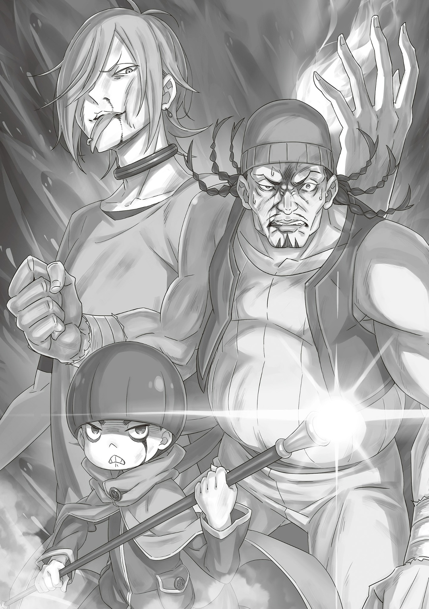
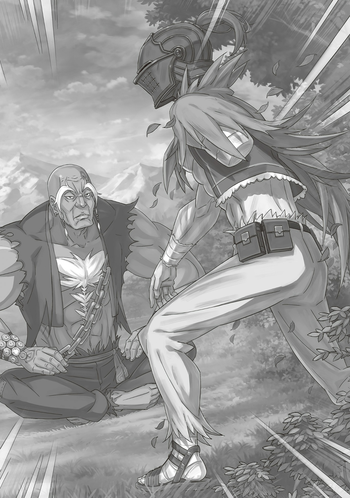

— …Расширение территории, переопределение матрицы.

Секунда за секундой, миг за мигом, мгновение за мгновением Альдебаран двигал мир вперед. Полномочие не возвращало его далеко назад. Оно могло как помочь выиграть, так и помочь проиграть.

— …Расширение территории, переопределение матрицы.

Шаг за шагом, ход за ходом, движение за движением Альдебаран проверял и направлял фигуры к шахматному мату. И как только первоклассные воины сохраняют спокойствие, когда в битве все может решить одна-единственная ошибка?

— …Расширение территории, переопределение матрицы.

Это же относилось и к людям умным. Таких Альдебаран считал настоящими чудовищами — они никогда не чувствовали крови и боли, но все равно строили полную картину мира у себя в голове. Так или иначе…,

— …Расширение территории, переопределение матрицы.

Для Альдебарана не существовало безнадежных битв. Все живое было вправе разделать его под орех, ведь он наплевал на законы мира, которым следовали лучшие воины и мудрецы. Побоку, жалуйтесь, сколько влезет, зато…,

— …Расширение территории, переопределение матрицы.

Победа всегда будет за мной.

× × ×

— …Тебе бы перенять покорность поросят, когда они просят сыпануть им в корытце побольше прикормки.

Низким рыклым голосом сказал «Король Свиней»… Дольтеро Амур. Шутка прозвучала хрипло, с оттенком безысходности. Но еще бы — все его жилистое тело изрезала стальная нить. «Король Свиней» обильно истекал кровью. То, что он все еще держался на ногах и никак даже бровью не повел, пугало до чертиков. Тут Альдебаран заговорил:

— Да понял я уже, что не боишься смерти. Отчаянный ты. Но боль никуда не деть, я-то знаю.

— Ну и бредятину же ты выдал. Смерть и боль рождают страх, это да… но нужно просто перебороть его.

— …А ты уверен, что это так работает?

По мнению Дольтеро, страх смерти и страх боли — это одно и то же. Но Альдебаран думал по-другому: они точно отличались. Боль, например, разносилась по телу.

— …Свинью спросить забыли.

С этими словами изо рта Дольтеро пошла белая пена. А все потому, что толстую шею «Короля Свиней» пару десятков раз обмотала стальная нить. Он пытался просунуть под нее два пальца, чтобы укусить ртом воздух, но бесполезно — в голову быстро перестала поступать кровь. Затем и ноги изменили ему — Дольтеро упал на колени. Его пятьдесят пять подчиненных были рядом, однако двинуться уже не могли. «Король Свиней» и его армия — победить их стоило невероятных усилий… А если точнее: двадцать три тысячи восемь раз. Даже для такого ветерана поражений, как Альдебаран, это было чересчур. Слаженные атаки «Черного Серебра», конечно, повлияли на это число, но не так сильно, как бездарность. Бездарность Альдебарана. Ведь нить вокруг шеи Дольтеро шла не от Яэ, а от пальца мужчины в шлеме. Он позаимствовал ее кольцо. Тонкой ниткой Альдебаран защищался от атак врагов и, по итогу, намертво намотал ее на шею Дольтеро. У него ушло двадцать тысяч попыток на то, чтобы с нуля научиться Технике Стальных Нитей.

— …

Раздался глухой стук о землю — «Король Свиней» наконец потерял сознание. Но даже в отключке он, чтобы не упасть на бок, выставил кулак вперед. Непоколебимая гордость. Хоть он и враг, но признаю — боевой дух у него что надо.

— Ха~, вы ужасный человек, Ал-сама! Я же так хвасталась! Так хвасталась, что на всем белом свете лишь я одна овладела этой техникой, а вы… Я ни за что не переживу этот позор~.

Внезапно возмутилась Яэ, которая держала на нитях остальных врагов. Альдебаран переводил дыхание и смотрел на побежденного «Короля Свиней». Весь бой служанка щурилась, точно кошка, наблюдая, как мужчина в шлеме использует ее кольцо. Но Альдебаран не смог принять ее похвалу:

— Ерунды не неси. Меня щас судорога хватит, а я всего одним кольцом пользовался. У тебя же их все десять… Выходит, под маленьким телом скрываются сильные мускулы?

— Э~? Вы все-таки захотели узнать, что у меня там под одеждой~? А я ведь частенько предлагала поглядеть, но вы же злюка.

— …Я ненадолго заберу твое кольцо.

Альдебаран пропустил заигрывания Яэ мимо ушей и погладил кольцо, которое надел на безымянный палец правой руки. Он пробовал его и на других, но по удобству они уступали. Вообще, я не хотел надевать кольцо на эту руку, но выбора мало — левой-то у меня нет. Я поплачу об этом, но после боя. Как бы то ни было…,

— Старик, ты как там? Совсем про тебя забыл, с этим головняком разбирался.

— В-, всё, всё нормально. …Нормально.

Неуверенно ответил Хейнкель. За этот бой он мало что сделал — лишь разбил «Зеркала Переговоров», когда Яэ обездвижила врагов. В основном красноволосый мужчина просто стоял в ступоре. Конечно, если сравнить с Гастоном, Хейнкеля трудно назвать сильным бойцом… это не говоря уже о Дольтеро. Но все же Альдебаран не мог винить его за малодушие. У каждого имелся такой враг, с которым сама душа отказывалась сражаться. Для Яэ это был Альдебаран, а для Альдебарана… забудьте.

— …Альдебаран, ты… что вообще тут происходит?

— Хм?

— Этот свин сильнее тебя во всем… Он должен был размазать тебя по земле одной левой. Но в итоге ты победил. И никак не пострадал.

— …

Хейнкель говорил с Альдебараном, как с кем-то великим. А он, надо признать, наблюдательный. Хотя, если смотреть с его стороны, то да — я сделал невозможное. Альдебаран был намного слабее Дольтеро. По сути, он победил только из-за того, что пытался раз за разом.

— …Такое вот он чудовище~.

Без страха в глазах подытожила Яэ. Альдебаран не стал возражать. В конце концов, она давно поняла, что он из себя представляет.

— Ал-сама — чудовище. Мы заодно с чудовищем, смекаете~?

— …Знаю я тех, кто похож на чудищ, но вот он…

— Не путайте тех, кто похож на чудищ, с теми, кто чудище и есть. Жалкие подделки даже упоминания не стоят, я считаю~.

С этими нежными словами Яэ расплылась в улыбке. Хейнкель ничего ей не ответил — просто промолчал.

— Плевать, кто я, сейчас нам нужно двигаться дальше. Яэ, ты разбираешься с мелочью, я — с главными. Старик, а ты зеркала разбивай.

— Гх, ага, услышал тебя.

— Да~да~а. Слушаюсь вас, Ал-сама.

Рядом с Хейнкелем, который робко кивнул, Яэ подняла руки и пошевелила пальцами. Тут Дольтеро связали стальные нити и подняли его в воздух вместе с остальными врагами. Это была подстраховка на случай, если он и Рачинс очнутся. Мужчина в шлеме сожалел, что все до такого дошло.

— Башка раскалывается…

Альдебаран недооценил союзников Фельт. Он думал, у нее нет хороших бойцов, кроме Райнхарда и Эццо. Но оказалось, что великан, Грассис, Гастон и виновница торжества Фельт — очень грозные противники…,

— Знаете, Ал-сама, дали бы вы мне хоть чуточку свободы, все было бы гораздо-гораздо проще~.

— …

— Все-таки лучше всего у меня получается не связывать, а душить — в этом вся я.

Из раза в раз Яэ соблазняла Альдебарана, однако сейчас дело было в другом. В отличие от Хейнкеля, который не мог сражаться на полную из-за своего малодушия, служанке мешали приказы мужчины в шлеме. Дай он ей свободу, этот лес мигом бы окрасила кровь пятисот человек.

Но она не злилась — в ее характере было подчиняться чужим приказам. А потому причина, по которой Яэ так сладко прошептала это на ухо Альдебарану…

— …За предложение, конечно, спасибо, но нет.

— Облооом~.

…заключалась в том, что она не сомневалась — ей откажут. Служанка показала ему язык и протянула: «Бе~е~е».

Яэ добилась своего — Альдебаран почувствовал прилив сил. Ее милые заигрывания хоть немного, но сняли его усталость.

— У нас есть возможность проскользнуть через юг, но мы пойдем другим путем… Здесь ты и проиграешь, Фельт.

— Ладненько~. Значит, следуем плану?

Спросила Яэ, словно их недавнего разговора никогда и не было. Альдебаран кивнул, а затем мысленно представил великана и Фельт, которые продумывали план на другом конце леса. Потом он тихо сказал:

— Вы сильны, правда. Только вот… Вам выпали плохие звезды.

△ ▼ △ ▼ △ ▼ △

…Когда разбили третье «Зеркало Переговоров», Ром убедился:

— Удача тут явно ни при чем.

Шлемоголовый всегда проходил мимо подделок. Без второго зеркала пропала нужда в третьем, поэтому великан снял его с наручей и бросил на землю.

Рачинс и Дольтеро проиграли. Ром, конечно, держал в голове такую возможность, но все равно очень удивился. Он много лет знал «Короля Свиней» и в его силе ничуть не сомневался.

— Родись он на десяток лет раньше, точно бы вошел в историю «Войны Полулюдей».

Ром искренне так считал. Сам же Дольтеро от такой оценки рассмеялся бы во все рыло. Очевидно, он не изменил бы исход «Войны Полулюдей». Скорее всего, «Король Свиней» погиб бы от рук «Демона Меча» или «Святой Меча» того времени. Тут и там ему суждено было проиграть. Что же тогда получается, шлемоголовый равен по силе «Демону Меча»?

— Едва ли.

Великан покачал головой. По правде сказать, Рома тяготили мысли о «Демоне Меча». Этого бойца не победила бы даже многотысячная армия. И такое мнение строилось не на его силе, а на известности. Слава «Демона Меча» как бы говорила неприятелям: «Вам не победить».

Так же и здесь — преступники Фландрии видели в Фельт свою Королеву, а потому послушно следовали за ней. Известность штука полезная. Ее-то и не хватало шлемоголовому. Страха он не внушал, но вот его характер — настоящая загадка.

— Значит-са, нужно нам взять эту загадку, да разгадать. …Стреляйте!

По приказу Рома около двадцати головорезов засуетились вокруг магической пушки — легко перевозимого оружия, из которого, если правильно охлаждать, можно стрелять постоянно. Но гораздо ценнее — в денежном плане — была Магическая Огненная Руда в дуле этого орудия. Ее еще называли…,

— …«Ночная Расплата».

Головорезы подожгли руду. В следующий миг белые огни, похожие на молнии, прорезали небо и унесли за собой облака. Свет сменил сумерки. Вот так легко этой рудой можно было превратить ночь в день. Но на деле эти камни не так просты: они изменяли окружение обманом. Если проще — они накладывали иллюзию на реальность. Теперь…,

— …Если враги читали наши передвижения как-то с неба, то уже нет.

Ром держал в голове возможность, что битва может затянуться, а потому подготовил «Ночную Расплату» — и не прогадал. Потом, в ходе боя, великан предположил, что враг может наблюдать за ними с небес — это бы объяснило, почему шлемоголовый всегда выбирает правильные варианты.

Следующие ходы недруга покажут, правильная ли это была догадка…,

— «Докладывает шестой отряд: мы нашли шлемоголового! Следуя нашему пла-… А-А-А!?»

Шлемоголовый разбил четвертое зеркало. Выходит, с небес враг не наблюдал. К счастью, великан не рассчитывал на это с самого начала. Между тем, Ром приказал армии постоянно меняться «Зеркалами Переговоров», но даже так шлемоголовый нашел и разбил два настоящих.

Из других вариантов…,

— Может, у них есть какой-то Великий Дух? Или Божественная Защита? Либо же они как-то читают наши мысли… А может…

Ром перечислил все, что пришло на ум. Вряд ли шлемоголовый работал с Великим Духом, иначе они бы сразу заметили, как он заимствует его силу.

Хотя если враг заимствует Магию Тени или Света, то понятно, почему не заметили. Однако Духи с таким атрибутом встречаются очень редко. Возможность этого, конечно, была, но звучала она крайне…,

— …сомнительно. Седьмой, на восток; девятый, на юго-восток. Прибегите к шестому, но не помогайте ему — объединитесь в один отряд, а затем возьмите в руки обычные и магические камни. Нам нужно заставить шлемоголового показать больше одной Божественной Защиты.

Людей с полезной Божественной Защитой можно было по пальцам пересчитать, а уж тех, у кого их несколько, и вовсе двое — «Святой Меча» и «Безумный Принц». Шлемоголовый вполне мог стать третьим. Поэтому…,

— Закидай врага трудностями и посмотри, как он будет из них выпутываться, и тогда сразу поймешь, какая у него Божественная Защита. …Недаром же меня называют: тот, кто убил больше всего носителей Божественных Защит.

△ ▼ △ ▼ △ ▼ △

После «Ночной Расплаты» враги начали двигаться как-то странно. Альдебаран все никак не мог найти настоящее зеркало.

— Они меняются зеркалами! Я не успеваю…!

Вражеские атаки, будто проверяли его на что-то. Мужчина в шлеме уже не понимал, где попытка убить, а где — нет. Смертельные удары были ему на руку, а вот с безвредными он совсем не знал, что делать.

— По барабану, я так и так от любой царапинки начинаю все заново.

Но закрыть на это глаза Альдебаран не мог. Попыток стало в разы больше.

— Старая лысая душнила, тебе бы реально не помешало открыть форточку.

△ ▼ △ ▼ △ ▼ △

С каждым разбитым зеркалом Ром беспокоился все сильнее и сильнее. На удивление, преступники Фландрии до сих пор его слушались. Большинство из них, должно быть, вообще не понимали, что здесь делают, но все равно послушно выполняли приказы. Настоящие примеры для подражания. Ром терял карты в руке, зато все больше узнавал о силе шлемоголового.

— А головорезы, я погляжу, на все готовы. Фельт хорошо ладит с фландрийцами, но небеса, похоже, выбирают тех, кто превозмогает боль.

«Ночная Расплата» забрала возможность наблюдать с небес и у них. Но теперь, когда мана от нее разошлась по лесу, можно сказать точно: враг не работал с Великим Духом. В прошлом Ром тренировался определять Божественные Защиты на Райнхарде, а потому…,

— У шлемоголового не «Божественная Защита Первого Взгляда» и не «Божественная Защита Второго Пришествия». Если это не «Божественная Защита Бурной Погоды» и не «Божественная Защита Логова Тигра», то вариантов осталось всего ничего…

Другие защиты, конечно, могли пригодиться врагу, но точно не здесь. Ром держал их в уме, но уже вычеркнул из возможных вариантов. Значит, сила шлемоголового не была связана с магией, Духом или Божественной Защитой… тогда оставалось только Полномочие.

— Изменять под себя законы мира… Шлемоголовый, а разве это не слишком дерзко для обычного человека?

△ ▼ △ ▼ △ ▼ △

Поток волнообразных атак изменился. Вместе с ним изменилась и тактика врага. Альдебаран стиснул зубы — худшие опасения подтвердились. Судя по всему, старый великан… Валга Кромвель догадался, что он использует Полномочие. Бесконечные попытки через расширение территории и переопределение матрицы… Скорее всего, Валга еще не понял, как работает Полномочие Альдебарана, но точно был близок. Чтобы разгадать этот секрет, головорезы пробовали разными способами атаковать мужчину в шлеме. Так у них отпали два очевидных варианта — магия и Божественная Защита. Тогда-то Валга и начал подозревать, что дело тут в чем-то нелепом и невообразимом — в Полномочии. Умные люди, как например — Эццо Каднер, относительно легко могли догадаться о том, что мужчина в шлеме обладает особой способностью. Но загнать Альдебарана в угол все еще было непосильной задачей. В башне Эццо нашел хорошее решение — залить водой все пути к отступлению. Но здесь, в лесу, Валга такое не провернет. Тревога никак не сходила. Альдебаран сомневался каждый раз, когда обновлял матрицу. Исправлять ошибки становилось все труднее. И вообще, почему Валга Кромвель до сих пор жив, да еще и служит Фельт? Разве он не жестокий стратег «Войны Полулюдей», который своими стратагемами забрал тысячи жизней? От их союза у Альдебарана раскалывалась голова. Он хотел высказать вслух все, что о них думает. Безумие, не иначе.

△ ▼ △ ▼ △ ▼ △

Теперь сомневаться в худших опасениях не приходилось. Ром подавил неприятное чувство в груди и нервно потер лысину. Он был уверен: у шлемоголового есть Полномочие… особая сила, которая могла изменять законы реальности. Как говорили, ею владели «Ведьмы». Во времена «Войны Полулюдей» Ром познакомился со Сфинкс. Тогда она назвала себя неудачным творением «Ведьмы», которое не смогло воссоздать Полномочие. Ром хотел помочь Фельт, но… человек с такой способностью был очень опасен. Неспроста даже «Ведьма» хотела заполучить эту силу. Варианты поубавились: шлемоголовый либо читал мысли, либо видел ближайшее будущее. Ром больше склонялся к последнему. Хотя, если враг читал мысли, то выбрал бы своей целью именно его, стратега армии. Вот почему Ром отдал два противоречивых приказа: первый отряд должен был проходить мимо шлемоголового, а второй — атаковать его. Почему-то враг пошел именно на безобидное войско и оказался, можно сказать, перед молотом и наковальней. Читай он мысли Рома или бойцов отряда, этого бы не случилось. А значит, оставалось лишь одно — шлемоголовый видит будущее. Ром распутал клубок из вариантов, но это его вовсе не обрадовало. Сфинкс говорила, что Полномочия нарушают законы мира, но предвидение будущего — это уже слишком. И что мне против такого делать? Безумие, не иначе.

△ ▼ △ ▼ △ ▼ △

— …Все, кто не владеет «Методом Потока», отступайте! Но не стойте на месте, двигайтесь! Нельзя отдыхать!

Громко приказал тяжеловесный Гастон и ринулся к шлемоголовому. Через «Зеркало Переговоров» громила узнал. …Что враг мог видеть ближайшее будущее.

— Ну, знач, я угандошу его прежде, чем он что-то поймет!

С этим рыком Гастон изменил свой план. Раньше он хотел закончить все одним ударом, но теперь будет перекрывать врагу пути к отступлению. В ответ на его слова шлемоголовый топнул по земле и сказал:

— Умная мысль, Гастон. Но, увы, не сработает.

Внезапно поднялась земляная стена и укрыла его от удара. Затем он превратил землю в перчатку и врезал Гастону по лбу. Громила с силой отлетел назад и, во время полета, заметил — враг замахивался еще раз.

— НЕ ДАААААААМ!!!

Гастон превратил порыв от удара в заднее сальто и поднял ногу на врага. Это ловкое движение напоминало трюк, который однажды провернула Фельт, чтобы вырваться из хватки Райнхарда. Даже старик-садовник из Дома Астрея разинул рот, когда увидел, как тяжеловесный Гастон выполняет такие акробатические трюки…,

— А ты хорош. Целых четыре раза меня так подловил.

Отточенный удар громилы не попал по врагу. Вместо этого Гастон почувствовал, будто чья-то большая рука дернула его вверх за правую ногу. …Быстро он понял — это была не рука, а невидимая нитка, которая тянулась от пальца шлемоголового. Получается, Техникой Стальных Нитей владела не только та служанка.

— На ее фоне я просто бездарь с одной ниточкой.

На мрачные слова шлемоголового Гастон стиснул зубы. Правая нога громилы была поднята на высоту головы, а левая слегка касалась земли. В этом нелепом беспомощном положении Гастон не мог пошевелиться. Тут шлемоголовый повернулся спиной к громиле и сказал:

— Старик, я к Яэ. Оставляю его на тебя.

Шлемоголовый решил, что с Гастоном покончено, и начал уходить прочь. На его место встал отец Райнхарда. Гастон слышал о нем, но никогда не видел вживую, поэтому сразу подметил: волосы и глаза у этого пьяницы от Астрея, но дух — точно нет. Лицо родителя Райнхарда ясно говорило, что он помогает шлемоголовому только потому, что у него нет выбора. Красноволосый враг предупредил его:

— …Кх, тебе лучше лишний раз не рыпаться, а то… гха!

Гастон ударил по щетинистой морде пьяницы и уже замахивался на шлемоголового, как внезапно потерял равновесие и рухнул на землю. …Он вырвался из нити ценой лодыжки. Тут шлемоголовый заговорил:

— Ты, твоя нога…

— Подумаешь, нога! Тут на кону моя жизнь стоит! Запомни: я не дам заднюю из-за какой-то там боли!

— …

— А по вам, чертям, сразу видно, что вы против воли сражаетесь! И меня это жесть как бесит! Да как вас только земля носит, если вы даже труд своих корешей-то толком не уважаете!

Яростно закричал Гастон и, из последних сил, поднялся на ноги. Из его правой лодыжки хлестала кровь, даже виднелась кость, но он все равно встал и посмотрел врагу в глаза. У Гастона были причины сражаться до конца.

Например — девушка, которую он любил.

Девушка, которая, узнав про злодея в шлеме и «Божественного Дракона», могла бояться, могла переживать, но все равно обняла Гастона, сказала ему не волноваться и отправила в путь.

Например — товарищи, которых он уважал.

Друг, который вечно ворчал, но только потому, что переживал за своих. Другой друг, который вечно боялся, но никогда не забивался в угол. Наставник, который вечно надоедал своими длинными речами, но был очень добрым и верил в силы каждого. И гордая, верная своему слову девушка, которая превращала собственную горькую судьбу в великую силу.

Например — мужчина и женщина, на которых он равнялся.

Мужчина настолько сильный, что мог защитить все дорогое. Женщина настолько прекрасная, что увидишь ее раз — и уже никогда не забудешь.

…Гастон помнил, за кого сражался.

— Ради дорогого сердцу, мы все жизнь отдадим! А вам даже сражаться-то не за кого, черти! Вы, суки, недостойны битвы.

Всей душой зарычал Гастон и снова рванул к шлемоголовому. Громила шагнул вперед правой ногой: он был готов потерять ее навсегда, стать инвалидом на всю оставшуюся жизнь. Даже тогда Гастон найдет свое место в мире. Даже тогда дорогие ему люди будут рядом, чтобы в случае чего помочь. …Гастон хотел только одного — начистить морду шлемоголовому. Громила подпрыгнул в воздух и замахнулся левой ногой. Если враг опять поднимет земляную стену, Гастон снесет ее кулаками. Во что бы то ни стало, он разобьет шлем врага…,

— …Попал.

Шлемоголовый атаковал ровно в ту секунду, когда подпрыгнул Гастон. Каменная перчатка ударила громиле в лицо, отчего он отлетел далеко назад.

— Да вы… блядь… издеваетесь…

Попал, говоришь? А я вот ни разу. Гастон потерял слишком много крови. Он проиграл. И вот, когда в глазах его начало темнеть…,

— …ХААААААА!!!

…Раздался высокий голос. Гастон знал, кто это. Краем глаза он увидел вспышку света.

△ ▼ △ ▼ △ ▼ △

…«Звездный Посох» — вот как называли этот «Метеор».

Практически все «Метеоры» создала одна «Ведьма» забавы ради. Но в «Звездный Посох» она вложила всю душу, а если точнее — в кристалл мудрости. «Ведьма» сотворила его, чтобы заткнуть болтливого «Дракона». Этот «Метеор» брал ману пользователя и превращал ее в звездный луч. Его свет был слаб и мал, чтобы навредить «Дракону» — то ли дело Аль Шарио — но со своей задачей справился. Так или иначе, для обычного человека этот луч — невероятная сила, для которой даже тренироваться не нужно. Альдебаран перепробовал множество способов, но все без толку. От этого звездного луча не убежать: он летел до тех пор, пока не настигнет цель. Безумие, не иначе. Мужчине в шлеме ничего не оставалось, кроме как:

— Не обессудь, старик.

Под ногами Хейнкеля поднялась земля и подбросила его в воздух. Он оказался прямо между Альдебараном и звездным лучом. Красноволосый мужчина успел лишь грозно взглянуть на бывшего союзника и произнести: «Альдеба-…». В следующую секунду белый свет, который когда-то заставил замолчать самого «Дракона», пронзил старого мечника насквозь.

— …Кха, о… ГХОА-А-А!!

У Альдебарана бы уже давно сварились кишки, но Хейнкель просто присел на корточки и скорчился от боли. Его аномальную живучесть он заметил еще в Волакии, или когда его в Мируле стукнул «Альдебаран». …Но Хейнкель все равно чувствовал боль. Тут Альдебаран посмотрел на того, кто выпустил этот луч…,

— …Ты, Кэмберли?

…Поодаль стоял полурослик и опирался на «Звездный Посох». Из его носа капала кровь. Чтобы пережить вражескую атаку, Альдебаран потратил двести двадцать одну попытку. Он знал головорезов по именам и характерам уже лучше, чем сами головорезы. Они мне уже как свои… ладно, вру. Терпеть их не могу, каждого. Так или иначе…,

— …Для этого «Метеора» нужна огромная сила, слабак его так просто не использует. Ты как это сделал?

— Как…? Вот и гадай до конца своих дней.

— …Да ну, «Гексель»?

Побочные действия «Гекселя» — вздутие вен на шее и лбу, а также кровь из глаз и носа. В сыром виде плоды Бокко просто восстанавливали ману, но стоило их по-особенному приготовить, как они становились «Гекселем» — запрещенным в Королевстве Лугуника наркотиком. Он перегружал Врата, заставляя их избыточно вырабатывать ману. Так у Кэмберли получилось использовать «Звездный Посох».

— Но он же изнутри тебя убивает, нет? Ты это, завязывай…

— Рачинс и Гастон бились до конца… А Райнхард даже сейчас. Я горжусь своими корешами, мне с ними повезло… Я не забьюсь в угол, я тоже буду биться до конца.

Кровь текла из глаз и носа Кэмберли. Она резко выделялась на его жутко бледном лице. Однако в голосе полурослика не чувствовалось отчаяния. Он умирал, но улыбался.

— Почему вы все такие упорные, почему…

Недалеко от Хейнкеля, который корчился от боли, лежал Гастон. Этот громила не смог ранить Альдебарана кулаками, зато сильно ранил словами. Не только он, все остальные головорезы тоже. Двадцать девять тысяч двести двадцать одна попытка — и всему виной их упорство…,

— …Эй, шлемоголовый, а ты небось жизнью-то своей никогда и не рисковал.

— …

— А я рискую. Даже сейчас рискую. Ведь мне есть, за что. У меня есть яйца. И я это доказал… Кх!

— …Расширение территории, переопределение матрицы.

Секунда за секундой, миг за мигом, мгновение за мгновением Альдебаран двигал мир вперед. Полномочие не возвращало его далеко назад. Оно могло как помочь выиграть, так и помочь проиграть.

— …Расширение территории, переопределение матрицы.

Шаг за шагом, ход за ходом, движение за движением Альдебаран проверял и направлял фигуры к шахматному мату. И как только первоклассные воины сохраняют спокойствие, когда в битве все может решить одна-единственная ошибка?

— …Расширение территории, переопределение матрицы.

Это же относилось и к людям умным. Таких Альдебаран считал настоящими чудовищами — они никогда не чувствовали крови и боли, но все равно строили полную картину мира у себя в голове. Так или иначе…,

— …Расширение территории, переопределение матрицы.

Для Альдебарана не существовало безнадежных битв. Все живое было вправе разделать его под орех, ведь он наплевал на законы мира, которым следовали лучшие воины и мудрецы. Побоку, жалуйтесь, сколько влезет, зато…,

— …Расширение территории, переопределение матрицы.

Победа всегда будет за мной.

× × ×

— …Тебе бы перенять покорность поросят, когда они просят сыпануть им в корытце побольше прикормки.

Низким рыклым голосом сказал «Король Свиней»… Дольтеро Амур. Шутка прозвучала хрипло, с оттенком безысходности. Но еще бы — все его жилистое тело изрезала стальная нить. «Король Свиней» обильно истекал кровью. То, что он все еще держался на ногах и никак даже бровью не повел, пугало до чертиков. Тут Альдебаран заговорил:

— Да понял я уже, что не боишься смерти. Отчаянный ты. Но боль никуда не деть, я-то знаю.

— Ну и бредятину же ты выдал. Смерть и боль рождают страх, это да… но нужно просто перебороть его.

— …А ты уверен, что это так работает?

По мнению Дольтеро, страх смерти и страх боли — это одно и то же. Но Альдебаран думал по-другому: они точно отличались. Боль, например, разносилась по телу.

— …Свинью спросить забыли.

С этими словами изо рта Дольтеро пошла белая пена. А все потому, что толстую шею «Короля Свиней» пару десятков раз обмотала стальная нить. Он пытался просунуть под нее два пальца, чтобы укусить ртом воздух, но бесполезно — в голову быстро перестала поступать кровь. Затем и ноги изменили ему — Дольтеро упал на колени. Его пятьдесят пять подчиненных были рядом, однако двинуться уже не могли. «Король Свиней» и его армия — победить их стоило невероятных усилий… А если точнее: двадцать три тысячи восемь раз. Даже для такого ветерана поражений, как Альдебаран, это было чересчур. Слаженные атаки «Черного Серебра», конечно, повлияли на это число, но не так сильно, как бездарность. Бездарность Альдебарана. Ведь нить вокруг шеи Дольтеро шла не от Яэ, а от пальца мужчины в шлеме. Он позаимствовал ее кольцо. Тонкой ниткой Альдебаран защищался от атак врагов и, по итогу, намертво намотал ее на шею Дольтеро. У него ушло двадцать тысяч попыток на то, чтобы с нуля научиться Технике Стальных Нитей.

— …

Раздался глухой стук о землю — «Король Свиней» наконец потерял сознание. Но даже в отключке он, чтобы не упасть на бок, выставил кулак вперед. Непоколебимая гордость. Хоть он и враг, но признаю — боевой дух у него что надо.

— Ха~, вы ужасный человек, Ал-сама! Я же так хвасталась! Так хвасталась, что на всем белом свете лишь я одна овладела этой техникой, а вы… Я ни за что не переживу этот позор~.

Внезапно возмутилась Яэ, которая держала на нитях остальных врагов. Альдебаран переводил дыхание и смотрел на побежденного «Короля Свиней». Весь бой служанка щурилась, точно кошка, наблюдая, как мужчина в шлеме использует ее кольцо. Но Альдебаран не смог принять ее похвалу:

— Ерунды не неси. Меня щас судорога хватит, а я всего одним кольцом пользовался. У тебя же их все десять… Выходит, под маленьким телом скрываются сильные мускулы?

— Э~? Вы все-таки захотели узнать, что у меня там под одеждой~? А я ведь частенько предлагала поглядеть, но вы же злюка.

— …Я ненадолго заберу твое кольцо.

Альдебаран пропустил заигрывания Яэ мимо ушей и погладил кольцо, которое надел на безымянный палец правой руки. Он пробовал его и на других, но по удобству они уступали. Вообще, я не хотел надевать кольцо на эту руку, но выбора мало — левой-то у меня нет. Я поплачу об этом, но после боя. Как бы то ни было…,

— Старик, ты как там? Совсем про тебя забыл, с этим головняком разбирался.

— В-, всё, всё нормально. …Нормально.

Неуверенно ответил Хейнкель. За этот бой он мало что сделал — лишь разбил «Зеркала Переговоров», когда Яэ обездвижила врагов. В основном красноволосый мужчина просто стоял в ступоре. Конечно, если сравнить с Гастоном, Хейнкеля трудно назвать сильным бойцом… это не говоря уже о Дольтеро. Но все же Альдебаран не мог винить его за малодушие. У каждого имелся такой враг, с которым сама душа отказывалась сражаться. Для Яэ это был Альдебаран, а для Альдебарана… забудьте.

— …Альдебаран, ты… что вообще тут происходит?

— Хм?

— Этот свин сильнее тебя во всем… Он должен был размазать тебя по земле одной левой. Но в итоге ты победил. И никак не пострадал.

— …

Хейнкель говорил с Альдебараном, как с кем-то великим. А он, надо признать, наблюдательный. Хотя, если смотреть с его стороны, то да — я сделал невозможное. Альдебаран был намного слабее Дольтеро. По сути, он победил только из-за того, что пытался раз за разом.

— …Такое вот он чудовище~.

Без страха в глазах подытожила Яэ. Альдебаран не стал возражать. В конце концов, она давно поняла, что он из себя представляет.

— Ал-сама — чудовище. Мы заодно с чудовищем, смекаете~?

— …Знаю я тех, кто похож на чудищ, но вот он…

— Не путайте тех, кто похож на чудищ, с теми, кто чудище и есть. Жалкие подделки даже упоминания не стоят, я считаю~.

С этими нежными словами Яэ расплылась в улыбке. Хейнкель ничего ей не ответил — просто промолчал.

— Плевать, кто я, сейчас нам нужно двигаться дальше. Яэ, ты разбираешься с мелочью, я — с главными. Старик, а ты зеркала разбивай.

— Гх, ага, услышал тебя.

— Да~да~а. Слушаюсь вас, Ал-сама.

Рядом с Хейнкелем, который робко кивнул, Яэ подняла руки и пошевелила пальцами. Тут Дольтеро связали стальные нити и подняли его в воздух вместе с остальными врагами. Это была подстраховка на случай, если он и Рачинс очнутся. Мужчина в шлеме сожалел, что все до такого дошло.

— Башка раскалывается…

Альдебаран недооценил союзников Фельт. Он думал, у нее нет хороших бойцов, кроме Райнхарда и Эццо. Но оказалось, что великан, Грассис, Гастон и виновница торжества Фельт — очень грозные противники…,

— Знаете, Ал-сама, дали бы вы мне хоть чуточку свободы, все было бы гораздо-гораздо проще~.

— …

— Все-таки лучше всего у меня получается не связывать, а душить — в этом вся я.

Из раза в раз Яэ соблазняла Альдебарана, однако сейчас дело было в другом. В отличие от Хейнкеля, который не мог сражаться на полную из-за своего малодушия, служанке мешали приказы мужчины в шлеме. Дай он ей свободу, этот лес мигом бы окрасила кровь пятисот человек.

Но она не злилась — в ее характере было подчиняться чужим приказам. А потому причина, по которой Яэ так сладко прошептала это на ухо Альдебарану…

— …За предложение, конечно, спасибо, но нет.

— Облооом~.

…заключалась в том, что она не сомневалась — ей откажут. Служанка показала ему язык и протянула: «Бе~е~е».

Яэ добилась своего — Альдебаран почувствовал прилив сил. Ее милые заигрывания хоть немного, но сняли его усталость.

— У нас есть возможность проскользнуть через юг, но мы пойдем другим путем… Здесь ты и проиграешь, Фельт.

— Ладненько~. Значит, следуем плану?

Спросила Яэ, словно их недавнего разговора никогда и не было. Альдебаран кивнул, а затем мысленно представил великана и Фельт, которые продумывали план на другом конце леса. Потом он тихо сказал:

— Вы сильны, правда. Только вот… Вам выпали плохие звезды.

△ ▼ △ ▼ △ ▼ △

…Когда разбили третье «Зеркало Переговоров», Ром убедился:

— Удача тут явно ни при чем.

Шлемоголовый всегда проходил мимо подделок. Без второго зеркала пропала нужда в третьем, поэтому великан снял его с наручей и бросил на землю.

Рачинс и Дольтеро проиграли. Ром, конечно, держал в голове такую возможность, но все равно очень удивился. Он много лет знал «Короля Свиней» и в его силе ничуть не сомневался.

— Родись он на десяток лет раньше, точно бы вошел в историю «Войны Полулюдей».

Ром искренне так считал. Сам же Дольтеро от такой оценки рассмеялся бы во все рыло. Очевидно, он не изменил бы исход «Войны Полулюдей». Скорее всего, «Король Свиней» погиб бы от рук «Демона Меча» или «Святой Меча» того времени. Тут и там ему суждено было проиграть. Что же тогда получается, шлемоголовый равен по силе «Демону Меча»?

— Едва ли.

Великан покачал головой. По правде сказать, Рома тяготили мысли о «Демоне Меча». Этого бойца не победила бы даже многотысячная армия. И такое мнение строилось не на его силе, а на известности. Слава «Демона Меча» как бы говорила неприятелям: «Вам не победить».

Так же и здесь — преступники Фландрии видели в Фельт свою Королеву, а потому послушно следовали за ней. Известность штука полезная. Ее-то и не хватало шлемоголовому. Страха он не внушал, но вот его характер — настоящая загадка.

— Значит-са, нужно нам взять эту загадку, да разгадать. …Стреляйте!

По приказу Рома около двадцати головорезов засуетились вокруг магической пушки — легко перевозимого оружия, из которого, если правильно охлаждать, можно стрелять постоянно. Но гораздо ценнее — в денежном плане — была Магическая Огненная Руда в дуле этого орудия. Ее еще называли…,

— …«Ночная Расплата».

Головорезы подожгли руду. В следующий миг белые огни, похожие на молнии, прорезали небо и унесли за собой облака. Свет сменил сумерки. Вот так легко этой рудой можно было превратить ночь в день. Но на деле эти камни не так просты: они изменяли окружение обманом. Если проще — они накладывали иллюзию на реальность. Теперь…,

— …Если враги читали наши передвижения как-то с неба, то уже нет.

Ром держал в голове возможность, что битва может затянуться, а потому подготовил «Ночную Расплату» — и не прогадал. Потом, в ходе боя, великан предположил, что враг может наблюдать за ними с небес — это бы объяснило, почему шлемоголовый всегда выбирает правильные варианты.

Следующие ходы недруга покажут, правильная ли это была догадка…,

— «Докладывает шестой отряд: мы нашли шлемоголового! Следуя нашему пла-… А-А-А!?»

Шлемоголовый разбил четвертое зеркало. Выходит, с небес враг не наблюдал. К счастью, великан не рассчитывал на это с самого начала. Между тем, Ром приказал армии постоянно меняться «Зеркалами Переговоров», но даже так шлемоголовый нашел и разбил два настоящих.

Из других вариантов…,

— Может, у них есть какой-то Великий Дух? Или Божественная Защита? Либо же они как-то читают наши мысли… А может…

Ром перечислил все, что пришло на ум. Вряд ли шлемоголовый работал с Великим Духом, иначе они бы сразу заметили, как он заимствует его силу.

Хотя если враг заимствует Магию Тени или Света, то понятно, почему не заметили. Однако Духи с таким атрибутом встречаются очень редко. Возможность этого, конечно, была, но звучала она крайне…,

— …сомнительно. Седьмой, на восток; девятый, на юго-восток. Прибегите к шестому, но не помогайте ему — объединитесь в один отряд, а затем возьмите в руки обычные и магические камни. Нам нужно заставить шлемоголового показать больше одной Божественной Защиты.

Людей с полезной Божественной Защитой можно было по пальцам пересчитать, а уж тех, у кого их несколько, и вовсе двое — «Святой Меча» и «Безумный Принц». Шлемоголовый вполне мог стать третьим. Поэтому…,

— Закидай врага трудностями и посмотри, как он будет из них выпутываться, и тогда сразу поймешь, какая у него Божественная Защита. …Недаром же меня называют: тот, кто убил больше всего носителей Божественных Защит.

△ ▼ △ ▼ △ ▼ △

После «Ночной Расплаты» враги начали двигаться как-то странно. Альдебаран все никак не мог найти настоящее зеркало.

— Они меняются зеркалами! Я не успеваю…!

Вражеские атаки, будто проверяли его на что-то. Мужчина в шлеме уже не понимал, где попытка убить, а где — нет. Смертельные удары были ему на руку, а вот с безвредными он совсем не знал, что делать.

— По барабану, я так и так от любой царапинки начинаю все заново.

Но закрыть на это глаза Альдебаран не мог. Попыток стало в разы больше.

— Старая лысая душнила, тебе бы реально не помешало открыть форточку.

△ ▼ △ ▼ △ ▼ △

С каждым разбитым зеркалом Ром беспокоился все сильнее и сильнее. На удивление, преступники Фландрии до сих пор его слушались. Большинство из них, должно быть, вообще не понимали, что здесь делают, но все равно послушно выполняли приказы. Настоящие примеры для подражания. Ром терял карты в руке, зато все больше узнавал о силе шлемоголового.

— А головорезы, я погляжу, на все готовы. Фельт хорошо ладит с фландрийцами, но небеса, похоже, выбирают тех, кто превозмогает боль.

«Ночная Расплата» забрала возможность наблюдать с небес и у них. Но теперь, когда мана от нее разошлась по лесу, можно сказать точно: враг не работал с Великим Духом. В прошлом Ром тренировался определять Божественные Защиты на Райнхарде, а потому…,

— У шлемоголового не «Божественная Защита Первого Взгляда» и не «Божественная Защита Второго Пришествия». Если это не «Божественная Защита Бурной Погоды» и не «Божественная Защита Логова Тигра», то вариантов осталось всего ничего…

Другие защиты, конечно, могли пригодиться врагу, но точно не здесь. Ром держал их в уме, но уже вычеркнул из возможных вариантов. Значит, сила шлемоголового не была связана с магией, Духом или Божественной Защитой… тогда оставалось только Полномочие.

— Изменять под себя законы мира… Шлемоголовый, а разве это не слишком дерзко для обычного человека?

△ ▼ △ ▼ △ ▼ △

Поток волнообразных атак изменился. Вместе с ним изменилась и тактика врага. Альдебаран стиснул зубы — худшие опасения подтвердились. Судя по всему, старый великан… Валга Кромвель догадался, что он использует Полномочие. Бесконечные попытки через расширение территории и переопределение матрицы… Скорее всего, Валга еще не понял, как работает Полномочие Альдебарана, но точно был близок. Чтобы разгадать этот секрет, головорезы пробовали разными способами атаковать мужчину в шлеме. Так у них отпали два очевидных варианта — магия и Божественная Защита. Тогда-то Валга и начал подозревать, что дело тут в чем-то нелепом и невообразимом — в Полномочии. Умные люди, как например — Эццо Каднер, относительно легко могли догадаться о том, что мужчина в шлеме обладает особой способностью. Но загнать Альдебарана в угол все еще было непосильной задачей. В башне Эццо нашел хорошее решение — залить водой все пути к отступлению. Но здесь, в лесу, Валга такое не провернет. Тревога никак не сходила. Альдебаран сомневался каждый раз, когда обновлял матрицу. Исправлять ошибки становилось все труднее. И вообще, почему Валга Кромвель до сих пор жив, да еще и служит Фельт? Разве он не жестокий стратег «Войны Полулюдей», который своими стратагемами забрал тысячи жизней? От их союза у Альдебарана раскалывалась голова. Он хотел высказать вслух все, что о них думает. Безумие, не иначе.

△ ▼ △ ▼ △ ▼ △

Теперь сомневаться в худших опасениях не приходилось. Ром подавил неприятное чувство в груди и нервно потер лысину. Он был уверен: у шлемоголового есть Полномочие… особая сила, которая могла изменять законы реальности. Как говорили, ею владели «Ведьмы». Во времена «Войны Полулюдей» Ром познакомился со Сфинкс. Тогда она назвала себя неудачным творением «Ведьмы», которое не смогло воссоздать Полномочие. Ром хотел помочь Фельт, но… человек с такой способностью был очень опасен. Неспроста даже «Ведьма» хотела заполучить эту силу. Варианты поубавились: шлемоголовый либо читал мысли, либо видел ближайшее будущее. Ром больше склонялся к последнему. Хотя, если враг читал мысли, то выбрал бы своей целью именно его, стратега армии. Вот почему Ром отдал два противоречивых приказа: первый отряд должен был проходить мимо шлемоголового, а второй — атаковать его. Почему-то враг пошел именно на безобидное войско и оказался, можно сказать, перед молотом и наковальней. Читай он мысли Рома или бойцов отряда, этого бы не случилось. А значит, оставалось лишь одно — шлемоголовый видит будущее. Ром распутал клубок из вариантов, но это его вовсе не обрадовало. Сфинкс говорила, что Полномочия нарушают законы мира, но предвидение будущего — это уже слишком. И что мне против такого делать? Безумие, не иначе.

△ ▼ △ ▼ △ ▼ △

— …Все, кто не владеет «Методом Потока», отступайте! Но не стойте на месте, двигайтесь! Нельзя отдыхать!

Громко приказал тяжеловесный Гастон и ринулся к шлемоголовому. Через «Зеркало Переговоров» громила узнал. …Что враг мог видеть ближайшее будущее.

— Ну, знач, я угандошу его прежде, чем он что-то поймет!

С этим рыком Гастон изменил свой план. Раньше он хотел закончить все одним ударом, но теперь будет перекрывать врагу пути к отступлению. В ответ на его слова шлемоголовый топнул по земле и сказал:

— Умная мысль, Гастон. Но, увы, не сработает.

Внезапно поднялась земляная стена и укрыла его от удара. Затем он превратил землю в перчатку и врезал Гастону по лбу. Громила с силой отлетел назад и, во время полета, заметил — враг замахивался еще раз.

— НЕ ДАААААААМ!!!

Гастон превратил порыв от удара в заднее сальто и поднял ногу на врага. Это ловкое движение напоминало трюк, который однажды провернула Фельт, чтобы вырваться из хватки Райнхарда. Даже старик-садовник из Дома Астрея разинул рот, когда увидел, как тяжеловесный Гастон выполняет такие акробатические трюки…,

— А ты хорош. Целых четыре раза меня так подловил.

Отточенный удар громилы не попал по врагу. Вместо этого Гастон почувствовал, будто чья-то большая рука дернула его вверх за правую ногу. …Быстро он понял — это была не рука, а невидимая нитка, которая тянулась от пальца шлемоголового. Получается, Техникой Стальных Нитей владела не только та служанка.

— На ее фоне я просто бездарь с одной ниточкой.

На мрачные слова шлемоголового Гастон стиснул зубы. Правая нога громилы была поднята на высоту головы, а левая слегка касалась земли. В этом нелепом беспомощном положении Гастон не мог пошевелиться. Тут шлемоголовый повернулся спиной к громиле и сказал:

— Старик, я к Яэ. Оставляю его на тебя.

Шлемоголовый решил, что с Гастоном покончено, и начал уходить прочь. На его место встал отец Райнхарда. Гастон слышал о нем, но никогда не видел вживую, поэтому сразу подметил: волосы и глаза у этого пьяницы от Астрея, но дух — точно нет. Лицо родителя Райнхарда ясно говорило, что он помогает шлемоголовому только потому, что у него нет выбора. Красноволосый враг предупредил его:

— …Кх, тебе лучше лишний раз не рыпаться, а то… гха!

Гастон ударил по щетинистой морде пьяницы и уже замахивался на шлемоголового, как внезапно потерял равновесие и рухнул на землю. …Он вырвался из нити ценой лодыжки. Тут шлемоголовый заговорил:

— Ты, твоя нога…

— Подумаешь, нога! Тут на кону моя жизнь стоит! Запомни: я не дам заднюю из-за какой-то там боли!

— …

— А по вам, чертям, сразу видно, что вы против воли сражаетесь! И меня это жесть как бесит! Да как вас только земля носит, если вы даже труд своих корешей-то толком не уважаете!

Яростно закричал Гастон и, из последних сил, поднялся на ноги. Из его правой лодыжки хлестала кровь, даже виднелась кость, но он все равно встал и посмотрел врагу в глаза. У Гастона были причины сражаться до конца.

Например — девушка, которую он любил.

Девушка, которая, узнав про злодея в шлеме и «Божественного Дракона», могла бояться, могла переживать, но все равно обняла Гастона, сказала ему не волноваться и отправила в путь.

Например — товарищи, которых он уважал.

Друг, который вечно ворчал, но только потому, что переживал за своих. Другой друг, который вечно боялся, но никогда не забивался в угол. Наставник, который вечно надоедал своими длинными речами, но был очень добрым и верил в силы каждого. И гордая, верная своему слову девушка, которая превращала собственную горькую судьбу в великую силу.

Например — мужчина и женщина, на которых он равнялся.

Мужчина настолько сильный, что мог защитить все дорогое. Женщина настолько прекрасная, что увидишь ее раз — и уже никогда не забудешь.

…Гастон помнил, за кого сражался.

— Ради дорогого сердцу, мы все жизнь отдадим! А вам даже сражаться-то не за кого, черти! Вы, суки, недостойны битвы.

Всей душой зарычал Гастон и снова рванул к шлемоголовому. Громила шагнул вперед правой ногой: он был готов потерять ее навсегда, стать инвалидом на всю оставшуюся жизнь. Даже тогда Гастон найдет свое место в мире. Даже тогда дорогие ему люди будут рядом, чтобы в случае чего помочь. …Гастон хотел только одного — начистить морду шлемоголовому. Громила подпрыгнул в воздух и замахнулся левой ногой. Если враг опять поднимет земляную стену, Гастон снесет ее кулаками. Во что бы то ни стало, он разобьет шлем врага…,

— …Попал.

Шлемоголовый атаковал ровно в ту секунду, когда подпрыгнул Гастон. Каменная перчатка ударила громиле в лицо, отчего он отлетел далеко назад.

— Да вы… блядь… издеваетесь…

Попал, говоришь? А я вот ни разу. Гастон потерял слишком много крови. Он проиграл. И вот, когда в глазах его начало темнеть…,

— …ХААААААА!!!

…Раздался высокий голос. Гастон знал, кто это. Краем глаза он увидел вспышку света.

△ ▼ △ ▼ △ ▼ △

…«Звездный Посох» — вот как называли этот «Метеор».

Практически все «Метеоры» создала одна «Ведьма» забавы ради. Но в «Звездный Посох» она вложила всю душу, а если точнее — в кристалл мудрости. «Ведьма» сотворила его, чтобы заткнуть болтливого «Дракона». Этот «Метеор» брал ману пользователя и превращал ее в звездный луч. Его свет был слаб и мал, чтобы навредить «Дракону» — то ли дело Аль Шарио — но со своей задачей справился. Так или иначе, для обычного человека этот луч — невероятная сила, для которой даже тренироваться не нужно. Альдебаран перепробовал множество способов, но все без толку. От этого звездного луча не убежать: он летел до тех пор, пока не настигнет цель. Безумие, не иначе. Мужчине в шлеме ничего не оставалось, кроме как:

— Не обессудь, старик.

Под ногами Хейнкеля поднялась земля и подбросила его в воздух. Он оказался прямо между Альдебараном и звездным лучом. Красноволосый мужчина успел лишь грозно взглянуть на бывшего союзника и произнести: «Альдеба-…». В следующую секунду белый свет, который когда-то заставил замолчать самого «Дракона», пронзил старого мечника насквозь.

— …Кха, о… ГХОА-А-А!!

У Альдебарана бы уже давно сварились кишки, но Хейнкель просто присел на корточки и скорчился от боли. Его аномальную живучесть он заметил еще в Волакии, или когда его в Мируле стукнул «Альдебаран». …Но Хейнкель все равно чувствовал боль. Тут Альдебаран посмотрел на того, кто выпустил этот луч…,

— …Ты, Кэмберли?

…Поодаль стоял полурослик и опирался на «Звездный Посох». Из его носа капала кровь. Чтобы пережить вражескую атаку, Альдебаран потратил двести двадцать одну попытку. Он знал головорезов по именам и характерам уже лучше, чем сами головорезы. Они мне уже как свои… ладно, вру. Терпеть их не могу, каждого. Так или иначе…,

— …Для этого «Метеора» нужна огромная сила, слабак его так просто не использует. Ты как это сделал?

— Как…? Вот и гадай до конца своих дней.

— …Да ну, «Гексель»?

Побочные действия «Гекселя» — вздутие вен на шее и лбу, а также кровь из глаз и носа. В сыром виде плоды Бокко просто восстанавливали ману, но стоило их по-особенному приготовить, как они становились «Гекселем» — запрещенным в Королевстве Лугуника наркотиком. Он перегружал Врата, заставляя их избыточно вырабатывать ману. Так у Кэмберли получилось использовать «Звездный Посох».

— Но он же изнутри тебя убивает, нет? Ты это, завязывай…

— Рачинс и Гастон бились до конца… А Райнхард даже сейчас. Я горжусь своими корешами, мне с ними повезло… Я не забьюсь в угол, я тоже буду биться до конца.

Кровь текла из глаз и носа Кэмберли. Она резко выделялась на его жутко бледном лице. Однако в голосе полурослика не чувствовалось отчаяния. Он умирал, но улыбался.

— Почему вы все такие упорные, почему…

Недалеко от Хейнкеля, который корчился от боли, лежал Гастон. Этот громила не смог ранить Альдебарана кулаками, зато сильно ранил словами. Не только он, все остальные головорезы тоже. Двадцать девять тысяч двести двадцать одна попытка — и всему виной их упорство…,

— …Эй, шлемоголовый, а ты небось жизнью-то своей никогда и не рисковал.

— …

— А я рискую. Даже сейчас рискую. Ведь мне есть, за что. У меня есть яйца. И я это доказал… Кх!

Кэмберли покрепче схватился за «Звездный Посох» и попытался еще раз выстрелить звездным светом.

Попытался.

— Гххаа-аа-а-а…

Но ману из ниоткуда не возьмешь. Если кто-то слабый попробует использовать этот «Метеор», он не только не сработает, но и накажет пользователя. «Звездный Посох» поджег Врата Кэмберли. Из всего его тела повалил белый дым. Этот предохранитель «Ведьма» поставила, чтобы дети даже не думали брать в руки «Звездный Посох». Жестокое наказание, которое она назвала предохранителем, наглядно показывало — в ней не было ничего человечного. У Кэмберли закатились глаза, он начал падать на спину…,

— Кэр-кун!

Но его успела подхватить женщина-головорез. Темная кожа, откровенное платье — это была начальница «Сада Цветочной Тюрьмы». Она обняла полурослика и сурово взглянула на Альдебарана, который затем ей сказал:

— …Можешь на меня так не смотреть. Я не хочу и не буду никого убивать.

— Ты…

— Семь… нет, уже шесть. Нам нужно шесть дней, не больше, и мы прекратим. …Но вы мне каждый раз не верите.

Начальницу «Сада Цветочной Тюрьмы» звали Тото. А до этого Альдебаран изрядно настрадался с Дольтеро, начальником «Черного Серебра». Взгляд женщины, которая обнимала своего любимого, был таким же острым, как у «Короля Свиней». Тут Альдебаран прищурил глаза и спросил Тото: «Значит, драки хочешь?». С ней он еще не сражался, ни разу. Впереди Альдебарана также ждал бой с Грассис и Фельт. Тото напряглась всем телом и кивнула мужчине в шлеме, как бы говоря: «Ну давай, попробуй». Альдебаран лишь усмехнулся и повернулся к ней спиной. В следующее мгновение…,

— …Кха, ах!

Тото уронила железный веер. Она подняла его, чтобы разорвать стальную нить вокруг шеи, но не смогла и рухнула на землю. Яэ не оставила ей и шанса. Служанка подошла к Тото, которая потеряла сознание, подняла веер и сказала:

— Оюшки, да тут есть яд. По запаху и цвету это… джиранме? Он людей на раз-два убивает. А она основательно за вас взялась~.

— Только злиться тут не надо.

— Я вообще-то девушка милая и добрая~! Когда это я вообще на вас злилась! И да, это вы, Ал-сама, виноваты: сами же к этой женщине спиной повернулись. Я понимаю — вам все равно, сколько умирать, но…

— …Против нее я не умирал. Спасибо за помощь.

Альдебаран не соврал. Яэ надула губы и замолчала. Перед этим она жаловалась, что он никогда не говорит ей спасибо, а теперь закатила глаза на его искреннюю благодарность. Альдебаран не хотел в этом разбираться — считал бесполезным.

— Так, с этим отрядом покончено. …Как там старик?

— Обгорел, но жив-здоров. Блин~, он будто не с нашей планеты пришел, такой живучий.

— Ясное дело. Он же из семьи Астрея.

— Из Астрея? Он-то?

Но происхождение не избавляло его от боли. Яэ оценила состояние Хейнкеля и посмотрела на Альдебарана так, будто предлагала бросить старого мечника здесь. Мужчина в шлеме промолчал и взглянул на северо-запад.

— …

Их загнали на юг при помощи дыма. Альдебарану и его сообщникам пришлось пойти против полутысячной армии, чтобы вернуться в место, где все началось…,

— …Хм-м, странно. Такое чувство, будто мы встречаемся уже не в первый раз, шлемоголовый.

— Аналогично. Я все время думал о тебе — наверное, дело в этом.

На той самой равнине, откуда их начали преследовать, Альдебаран встретился лицом к лицу с финальным боссом… Валгой Кромвелем. Шла двадцать девять тысяч двести двадцать первая попытка.

△ ▼ △ ▼ △ ▼ △

На широкой равнине сидел Валга Кромвель. Он скрестил ноги и подпер щеку рукой. Даже сидя, он был в высоту с Альдебарана. Наверное, все из-за его большого тела, либо из-за коротких ног мужчины в шлеме.

— А мы чем-то похожи. Я тоже комплексую из-за роста.

— Это вряд ли. Мне на ноги всегда как-то побоку было. Хотя, в молодости, я злился на судьбу, мол, эх, вот бы тело пошире да руки подлиннее…

— Ну, по виду я бы тебя стариком не назвал. Сколько тебе вообще лет, если не секрет?

— Да кто его знает. Как век прожил, так сразу считать надоело. Бросил я это дело.

Холодно отвечал Валга. Если не считать эльфов, которые умирали только по собственной воле, великаны — это самая долгоживущая раса. К сожалению, сейчас они стояли на грани вымирания, потому что в прошлом разозлили одинокую «Ведьму». У людей былых времен точно не было чувства самосохранения. Альдебаран продолжил:

— Воин, который убивал «Драконов» ради мяса. «Ведьма», которая из-за одного великана решила истребить его расу. Эльф, которого взяло влияние «Ведьмы Зависти»… и это даже не конец.

— А ты хоть и молод, но историю знаешь хорошо. Теперь понятно, как ты подружился с «Ведьмой Зависти».

— Подружился? Ужасная шутка.

Очевидно, Валга пытался его спровоцировать. Альдебаран не смог промолчать. Шутка или нет — он даже слышать этого не хотел.

— Она меня не выносит. Мы даже взглядами не пересекались.

— …Пересечься взглядом с «Ведьмой Зависти»? Ха, ужасная шутка.

— Вот и мне не смешно. А еще ты, душнила, используешь тактики, которые я ненавижу всем сердцем… Кстати, где мисс Фельт?

— А что, надеялся взять ее в заложники, чтобы по-быстрому победить? Ты правда думаешь, что она где-то рядом?

Альдебаран цокнул языком, а Валга усмехнулся и посмотрел на лес, где еще недавно кипел бой. Потом великан продолжил:

— Значит-са, взял да без труда убил пятьсот человек?

— Кто бы говорил. Вспомни, сколько жизней ты угробил на «Войне Полулюдей». К тому же… хотя не, забей.

— …

Альдебаран едва не проговорился. …Это была бескровная битва. Они не убивали головорезов. Их еще можно было спасти магией исцеления. Но скажи он это сейчас, возникло бы много вопросов. Как и подметила Яэ, все было бы гораздо проще, если бы они могли убивать. Однако Альдебарана не волновало число попыток — в мире, который любила она , там, где он еще мог на что-то повлиять, не умрет никто. Правда, было одно исключение — Нацуки Субару. Вот почему Альдебаран шел бескровным путем…,

— …Ты ненавидишь, когда кто-то умирает на твоих глазах, да?

…

…

…

…А?

— …А?

— Я начал подозревать, когда узнал, что Эццо и Флам выжили.

— Эй…

— Флам выживет и использует «Божественную Защиту Телепатии», чтобы «Святой Меча» отправился в Песчаные Дюны, где его сильно ослабляет… План-то хороший, но непонятно, зачем оставлять в живых Эццо. Да и Флам после Божественной Защиты тебе бы уже навряд ли пригодилась.

— Эй, старина, ты…

— С такими большими планами разумно было бы рубить любые угрозы на корню. …Ты спрашивал, где Фельт? Я отправил ее к побежденным отрядам.

Валга поднял руку с наручами и постучал по одному из незакрытых «Зеркал Переговоров». На нем появилось лицо Фельт. Альдебаран и его сообщники разбили двенадцать зеркал, а это было тринадцатым, последним.

— Если размотать головорезов из нитей, они снова встанут в строй. Ну, не все пятьсот, конечно, но, может, больше сотни.

— Старый хер…!

Валга заулыбался, а на лбу Альдебарана вздулась вена, но из-за шлема этого не было видно. Раз враги никого не убивали, великан решил развязать головорезов. Однако Альдебаран с сообщниками предвидели это: они не просто связывали, но и ломали им руки-ноги…,

— На всякий я дал каждому из них «Гексель». Теперь сражаться ты будешь с теми, кто не просто не боится ран, но и не чувствует боли.

— …Кх, я тебя услышал! Сто, двести — да плевать мне! Я буду пытаться…

Из раза в раз , но Альдебаран не договорил. Валга прищурился: он будто сквозь шлем смотрел. Когда враг затаил дыхание, великан подытожил:

— Ясно. …Значит, мы разговариваем в первый раз.

— …

На секунду Альдебаран замер. Он не сразу догадался, о чем сказал Валга. Но затем по его спине пробежал холодок. Мужчина в шлеме понял — этот великан опаснее «Святого Меча».

— ЯЭ…!!!

Во всю глотку закричал Альдебаран. Он приказал Яэ атаковать из засады. Они должны немедленно связать Валгу Кромвеля. Они должны закрыть ему рот, но не убивать. Великан ошибся — у Альдебарана были свои причины идти бескровным путем.

— Тебе пора ложиться спать, дед! Дней так на шесть!

И в этом ему поможет Яэ…,

— …Вот ты где.

Вдруг раздался чей-то голос — он повис в воздухе, словно аромат тысячи ядов. Все это время вызывающий мужчина прятался в траве на равнине. Его тело покрывали татуировки весов. Он прищурил большой правый глаз, который казался чужим, будто он взял его у кого-то другого и просто засунул себе в орбиту.

Его правое и левое глазное яблоко сильно отличались по размеру. В лесу мужчина, Манфред, сразу разглядел Яэ, которая по приказу выскочила из засады. Скрытность шиноби не помогла. Начальник «Весов» приложил ладонь к правому глазу, а левым уставился на служанку. Потом он сказал:

— Стой, где стоишь.

— …Кх.

Манфред нашел Яэ благодаря «Божественной Защите Дальновидности», а затем заставил ее встать на месте с помощью «Божественной Защиты Принуждения». Он что, использовал две Божественные Защиты?

— Ты Апостол Тифон…?!

Проскрежетал зубами Альдебаран. Яэ быстро вернула власть над своим телом и метнула стальные нити в Валгу. …Но из-за этого промедления в бой успели вмешаться новые сверхлюди.

— …Это тебе за Флам.

Из той же травы, что и Манфред, выпрыгнула Грассис и ударила Яэ ногой в живот. Сообщница машинально скрестила руки для защиты, но не помогло — она все равно отлетела назад. Грассис владела «Методом Потока».

— Лично я твоей Флам ничего не сделала!

— Но ты заодно с теми, кто сделал. Это вам всем за Флам.

Удар Грассис сломал Яэ руку. Хейнкель остался в лесу. Он еще не оправился от луча «Звездного Посоха», да и даже если бы оправился, вряд ли смог бы помочь. А значит…,

— …Перерасширение Территории. Переопределение матрицы.

Альдебарану придется собственноручно победить Валгу Кромвеля.

— …Вот ты и растерялся, шлемоголовый. Промедлил — значит, проиграл. Золотое правило.

Стоило Альдебарану использовать Полномочие, как Валга начал что-то жевать. Мужчина в шлеме постоянно прокусывал пакетик с ядом, поэтому сразу понял, что происходит. Сейчас Валга мог принять только…,

— «Гексель»…

Рука великана тотчас потянулась к мужчине в шлеме. Альдебаран успел отклониться назад, но упал на землю. Валга поднялся на ноги. Казалось, из-за наркотика он увеличился в размерах. Альдебаран еще не знал, на что способен Валга, но уже чувствовал страх. Как и другие головорезы, великан будет драться не на жизнь, а на смерть. И вот, когда мужчина в шлеме затаил дыхание…,

— …АЛЬДЕБАРАН!

Закричал кто-то, на кого он уже не надеялся… Хейнкель указывал на небо. Красноволосый мужчина беспокоился. Но не боялся. Это могло значить только одно: в небе парил тот, кто положит конец их битве.

— Вот и… — …Время вышло.

Начал мужчина в шлеме, а закончил великан. Положение на поле боя менялось с невероятной скоростью. Альдебаран уже думал, что победил, но Валга… Казалось, он ждал эту секунду. …В руках великана вспыхнул свет, который однажды уже озарил небо.

△ ▼ △ ▼ △ ▼ △

…«Гексель» усилил Врата Рома. Великан раздавил магический камень «Ночной Расплаты», чтобы поставить врагу шах и мат.

— Если шлемоголовый видит будущее, то ведет себя он уж слишком странно.

Ром давно отбросил вариант с чтением мыслей. Враг видел ближайшее будущее. Но тогда были несостыковки. Будущее диктуют выборы множества людей. Предугадать их все и среагировать — невозможно. Они менялись зеркалами ежесекундно. И все же шлемоголовый сразу находил правильные. А что, если он сначала смотрел, что случится, а потом уже действовал? Тогда все начинает обретать смысл. Получается, он раз за разом обыскивал головорезов, чтобы найти настоящее зеркало.

— Я живу в безумном мире.

Недовольно отрезал Ром. Он хотел закричать во все горло. И как же ему победить этот… возврат из будущего? Как поставить врагу шах и мат?

— Должна же быть лазейка.

Шлемоголовый не мог предугадать все беды. Иначе не было бы никакой битвы в лесу. Иначе он не стал бы драться против Райнхарда, а безопасно по-тихому заманил бы его в ловушку. Из этого следует: шлемоголовый может возвращаться только в недавнее время.

Если он мог выбирать исходную точку для Полномочия, то делал бы это там, где ему ничего не угрожает. …А что, если заставить его думать, что угрозы нет, а на деле устроить ловушку, из которой он уже не выберется? Для этого Ром использует…,

— …Значит, «Божественный Дракон» вернулся по твоему зову?

— …

Когда в небе показалось высшее существо, все осознали: битве конец. Пришел тот, кто был сильнее всей армии головорезов вместе взятых. «Божественный Дракон» мог стереть эту равнину с лица земли одним дыханием. Вот почему он выпустит слабый огонь, чтобы положить конец этой битве. Рому оставалось одно — заставить «Дракона» дыхнуть не туда, куда он хотел.

— …Чтобы создать день, «Ночная Расплата» перекрывает небо иллюзией.

Только опытные маги могли управлять действием «Ночной Расплаты». Именно поэтому Ром съел «Гексель». Это была одна из стратагем, которую он так и не использовал во время «Войны Полулюдей». Она должна была пригодиться, чтобы в обмен на свою жизнь прикончить армию Королевства и того, кого они охраняли.

— Это старый план: заманить врагов в одно место и потом, ценой собственной жизни, уничтожить их мощным заклинанием. Сегодня точно получится.

Из-за иллюзии «Божественный Дракон» не увидит, что действительно происходит на равнине. Но ему же приказали закончить эту битву, поэтому он выпустит дыхание. Так огонь «Дракона» уничтожит место, которое враг счел безопасным.

— …Кх.

Шлемоголовый попытался убежать, но Ром схватил его за ногу. Тогда враг просто посмотрел на «Божественного Дракона», пасть которого наполнилась белым светом.

— …Фельт.

Перед смертью Ром вспомнил любимую внучку: ее младенчество, детство, как она росла. Ее жизнь пронеслась перед глазами великана за долю секунды. Ром усмехнулся. Сколько злости во мне было, а я даже давно покойных Либре и Сфинкс не вспомнил. Так промелькнули его последние мысли. Рома и шлемоголового испепелило пламя «Дракона»…,

— …Да чтоб вас!

Внезапно звездный луч пронзил небо и попал в щеку «Дракона». Дыхание полетело в другую по-настоящему безлюдную равнину.

— А…?

Из-за ударной волны Ром упал на спину. Шлемоголового по-прежнему держали за ногу, поэтому он тоже упал и вскрикнул от боли. Враг должен был проиграть из-за дыхания «Дракона», но…,

— А ведь чуйка моя говорила, что что-то тут не так, и вот те на! Сражаться с готовностью умереть и убивать себя спецом — понятия вообще-то разные! Дурак ты, деда Ром!

С этими словами девушка покрепче сжала «Звездный Посох» и сверкнула красными глазами. С ее щек капали слезы.

…Внучка Валги Кромвеля разрушила его стратагему в пух и прах. Он проиграл.
