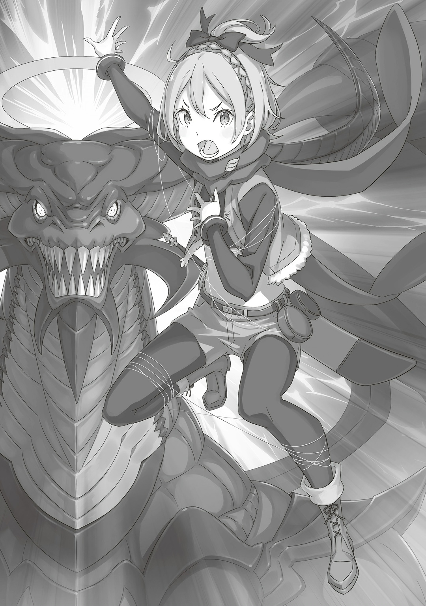

…План Рома с первых слов не понравился Фельт.

— Слушай, Фельт, если тебя схватят, мы сразу проиграем, а они точно попытаются — ты для них быстрый ключ к победе. Надеюсь, ты это понимаешь.

— Конечно, я тут что-то типа главной фигуры в шахматах. Отмахиваться от твоего плана я не буду, но сидеть и ждать, как дура, пока вы все порешаете, я тоже не собираюсь.

— Для военачальников вполне нормально сидеть и ждать конца боя… Эй, ну не смотри ты так!

Военачальница не захотела принимать свою часть плана. Великан потер лысину и вздохнул. Фельт хорошо знала этот жест. Ром всегда делал так, когда пытался ее в чем-то убедить. И на этот раз великан хотел сказать следующее:

— Ладно-ладно, я понял, уговорила. Ты не будешь сидеть и ждать. …Тогда медленно иди по пятам за шлемоголовым.

— Э, мне прямо в тыл к врагу идти? И зачем?

— Так мы всегда будем знать, где он. А еще тебе придется искать выживших в побежденных отрядах, чтобы устроить новую засаду.

Если проще, Ром хотел загнать шлемоголового в угол, перекрыть ему пути к отступлению и победить. Для этого великан разделил полутысячную армию. Скорее всего, первым отрядом придется пожертвовать. Этого не избежать.

— …

— Фельт, это война…

— Ага. Я не Райнхард, чтобы наивно верить в победу без жертв. Просто мне это не нравится. Ты можешь умереть и все такое.

Ее часто недооценивали из-за внешности, но Фельт никогда не жила в иллюзиях. Она выросла в трущобах, где чужая жизнь почти ничего не стоила, а потому знала: раз жизнь хрупка, важно прожить ее сильной.

— …Ты права, Фельт. Мне тоже не нравятся бессмысленные жертвы.

— А люди из Фландрии на этом целую философию построили. Если бы не их заморочки, столько бы народу на равнине не собралось.

Головорезы строго следовали плану Рома из-за философии, которая укоренилась в преступном мире. Их истина сильно отличалась от истин кровавых трущоб. Работая с головорезами, важно уважать их взгляды. Но сейчас во главе армии стояла Фельт, а значит, все должны подчиняться ее истинам. Вот почему…,

— …Начнем. Я выиграю этот бой, но по-своему.

Даже если ее путь к победе отличался от других, она уже сделала свой выбор.

△ ▼ △ ▼ △ ▼ △

Ром закрыл крышку «Зеркала Переговоров», через которое они общались. Фельт почувствовала неладное и ускорила шаг.

— Старик говорил, что у него еще есть последний козырь…

Истекая кровью, сказал Кэмберли. Фельт распутала головорезов из нитей. Они помогут раненному полурослику. Затем она выхватила из его рук «Метеор» и изо всех сил побежала дальше. И вот, когда Фельт выбежала из леса…,

…Она увидела Рома и шлемоголового, которых вот-вот должен был испепелить «Божественный Дракон».

— …Да чтоб вас!

Не думая, Фельт подняла «Звездный Посох» и прицелилась в летающего врага. Она видела, как этот «Дракон» сражался с Райнхардом. Она знала, насколько он крепок. Но все равно попыталась остановить его.

— «…Ай!»

Звездный луч прилетел в пасть врага. «Божественный Дракон» недостойно вскрикнул от боли, его дыхание полетело в другую сторону. Пустая, безлюдная равнина неподалеку сравнялась с землей. Скорее всего, Фельт разрушила все планы Рома. Но ей было все равно.

— А ведь чуйка моя говорила, что что-то тут не так, и вот те на! Сражаться с готовностью умереть и убивать себя спецом — понятия вообще-то разные! Дурак ты, деда Ром!

Закричала Фельт, скрипя зубами от злости. Ром и шлемоголовый, которые затеяли величайшую битву умов, изумленно уставились на нее. Хотя с ее глаз капали слезы, Фельт не дрогнула.

— Если бы я этого не сделала, Райнхард мне б потом целую вечность ныл.

Они могли преодолеть любую трудность, если бы шли на все, даже на самую большую жертву. Но Фельт не хотела побеждать любой ценой. Ей была важна именно ценность победы. Она решила держаться за свои истины. Иначе говоря…,

— Надо жить сильными, деда Ром, а иначе какая нам польза от победы?

△ ▼ △ ▼ △ ▼ △

— …Я проиграл.

Альдебаран признал очевидное. Последняя стратагема Валги Кромвеля попала в самое яблочко… в слабое место Полномочия. Возвращение «Божественного Дракона» стало точкой отсчета, которая перекрыла все пути к отступлению для Альдебарана. Дыхание должно было устрашить врага и остановить битву, но превратилось в смертельную ловушку. Альдебаран попал в бесконечную матрицу, в которой не убежишь от «Смерти», пока не потеряешь душу. Но страшна была не только хитроумная стратагема Валги Кромвеля, который превратил «Войну Полулюдей» в кровавую гражданскую войну.

— Головорезы срывали все мои планы.

Именно из-за них Альдебаран и проиграл. Постоянные волны атак полтысячи бойцов, каждый из которых бился до последнего вздоха. С каждым вражеским натиском Альдебаран терял психические силы и рассудок. Из-за любой ошибки он начинал по-новой. И прямо на пороге победы Альдебаран допустил роковую ошибку. Стычка с Валгой вывела его из себя, и он обновил матрицу в неудачном месте. А может, это и было частью плана Валги? …Неважно, какая ловушка, неважно, какой враг, Альдебаран победит его, несмотря ни на что. «Великий Стратег» безжалостно растоптал высокомерие мужчины в шлеме. Он доказал, что даже если его Полномочие не одолеть, самого Альдебарана легко. Мужчина в шлеме не победил там, где было нужно победить, подвел тех, кто на него надеялся, и теперь оказался здесь. Альдебаран владел силой не по уровню…,

— …Присцилла, я…

Не смог тебя спасти , но он не успел прохрипеть эти слова.

— Всем стоять на месте!

Резкий голос прорезал тягучую тишину. Появление «Божественного Дракона», крах плана «Великого Стратега», встреча всех ключевых фигур… Во все это внезапно вмешалась Яэ. Стальными нитями она связала Грассис у входа в лес, а еще Манфреда на углу равнины. Сверх того…,

— …Кх, это те нити, которые связали Рачинса и остальных?

Фельт отпустила «Звездный Посох» и цокнула языком. Ее руки и ноги тоже связали стальные нити. Положение в бою сменилось. Яэ заговорила:

— Прошу простить за грубость, благородная Фельт-сама.

— Какая я тебе благородная… Лучше скажи, зачем помогаешь шлемоголовому?

— Да просто подчиняюсь тому, кто сильнее, вот и все~.

С привычной легкостью сказала Яэ и высунула язык. Тут Альдебаран отступил на шаг от Валги, который стоял на коленях. Его стратагема провалилась. Великан чувствовал опустошение. Однако в его умных, проницательных глазах отражалось не поражение, а что-то более важное.

— …Делайте со мной что угодно, только не трогайте Фельт.

— Я ждал этих слов, хотя видеть тебя таким совсем не хотел.

Валга с трудом выдавил мольбу. Альдебаран ответил ему искренне. Они сами развязали этот бой, а теперь просят не трогать Фельт? Нелепо. Но если это означало конец стычке в лесу, злость уступала место облегчению. Теперь Альдебарану придется пересмотреть план на неделю вперед, однако сейчас его беспокоило другое — он закончил бой с первым, кто смог его победить после «Ведьмы».

— «Привет, я. Вижу, дерьмово тебе тут без меня.»

«Дракон» взмахнул крыльями, опустился на землю и обратился к Альдебарану. Честно говоря, для того, кто чуть не сжег их дотла, он вовсе не выглядел виноватым. Но «Альдебаран» бросил отвлекать внимание Королевства и за полдня прибыл сюда, так что Альдебаран решил не заострять на этом внимание.

— «Похоже, тебе пришлось подраться с Фельт и ее бандой. Но что случилось под конец?»

— Враг устроил ловушку, чтобы ты испепелил меня. Чувствую себя так, будто мне поставили мат и даже ход не дали сделать. Еще чуть-чуть — и все так бы и произошло.

— «Брр, аж неприятные воспоминания всплыли, как меня переиграл Учитель.»

Альдебаран тоже вспомнил «Ведьму», которая передала ему всевозможные знания… и как она размазала его в шатрандже. От этого воспоминания ему стало не по себе. Но, конечно, нельзя сравнивать настольную игру и реальный бой с применением Полномочия.

И все же Валга был страшным противником.

— Хотя не, меня больше пугает влияние Фельт, перед которой вы все преклоняетесь.

— …Мы не служим Фельт.

— …Хм, понял.

Присцилла и Фельт сияли по-разному, хотя обе были Кандидатками на трон. Это как сравнивать два солнца: оба ослепляют и прожигают взгляд, но по-своему. Дело не в том, какое солнце правильнее, а в том, какое выберет человек. Валга, например, выбрал Фельт.

— …И, похоже, не он один.

Альдебаран оглянулся и увидел их: из лесной чащи выходили головорезы. Они были ранены, но не утратили боевого духа.

— …

Похоже, Валга не блефовал. Головорезы будут вставать снова и снова, пока не победят. Альдебаран окончательно осознал, что выбрал путь, где каждый станет его врагом.

— Все изменилось. Теперь у вас нет шансов. Та же история, что и со «Святым Меча» и «Ведьмой Зависти». …«Божественный Дракон» полностью ломает правила игры.

Высшие существа — как игроки, которые во время шахматной партии просто бьют соперника кулаком. Они существовали вне рамок. Одного из них он запечатал. Другого подавил. Третьего использовал. А четвертого сделал союзником. …Альдебаран пользовался каждой возможностью на полную. Поэтому…,

— Игра окончена. Мы уходим. Больше не преследуйте нас.

— …Фельт-сама, не могли бы вы не двигаться?

— …?

Спокойный голос Яэ прервал совет Альдебарана. Мужчина в шлеме повернулся к ней. Сообщница стояла на спине Фельт, которую удерживали стальные нити, и смотрела на нее холодным взглядом. Светловолосая девушка только фыркнула:

— Да не двигаюсь, не бузуй. …Лучше смотри за мной.

Эти несколько слов заставили нахмуриться не только Альдебарана и Яэ, но даже Валгу. Что она задумала? Альдебаран сразу подумал, что это какая-то уловка. Но Фельт была связана. Она не могла ни ударить, ни убежать, ни даже пошевелиться. …В ее красных глазах горела сила воли. Она совсем не выглядела беспомощной.

— «Эй, у нас проблема, я.»

Сказал «Дракон», потирая щеку после луча «Звездного Посоха». Он говорил с Альдебараном, с которым разделял воспоминания и сознание, но при этом смотрел на Фельт. …Смотрел так, будто не мог оторвать взгляд. Прежде чем Альдебаран успел сообразить, что происходит, «Альдебаран» по привычке потянулся к металлическому шлему и произнес:

— «Почему-то я не хочу отказывать Фарселю… Кхм, то есть Фельт.»

Эта фраза окончательно дала понять — что-то случилось.

△ ▼ △ ▼ △ ▼ △

— «…Фарсель, безрассудность твоя утомила не только меня, но и всю твою родню.»

Уставший «Божественный Дракон» обратился к Фельт. Это случилось, когда она, чтобы покрасоваться перед Мейли, дерзнула пересечь Песчаные Дюны и направилась к Сторожевой Башне Плеяд. Тогда Райнхард случайно напугал «Дракона». В страхе он атаковал Фельт и остальных. Она никогда не видела более зрелищного сражения — казалось, половина Аугрии должна была исчезнуть. К счастью, увидев Фельт, «Дракон» остановился и отступил. Именно тогда он и произнес эти слова.

— Как ты меня назвал? Фарсель?

Фельт взбесилась. Ей хватило образования, чтобы узнать это имя. Если «Божественный Дракон» назвал кого-то Фарселем, то речь шла о последнем «Короле Льве», Фарселе Лугуника. Когда-то он заключил с ним пакт. Короче говоря, он принял ее за него. Фарсель был мужчиной, так что Фельт это сильно задело. За полтора года с начала выборов она заметно подросла и в целом выглядела здоровее. Она давно перестала быть тощей. Вот почему Фельт нельзя было спутать с мужчиной. Их знакомство не задалось с первых секунд. Но на этом все не закончилось. Никто не знал, какие у Волканики были отношения с Фарселем, но к Фельт он начал относиться сразу хорошо… точнее, он почему-то сильно к ней привязался. Настолько, что, несмотря на свой маразм, без раздумий выполнял любые ее приказы.

— Пакт между Волканикой и Королевской Семьей Лугуника, значит…

Точных записей о связи «Короля Льва» и «Божественного Дракона» не сохранилось. Но Фельт понимала, что это была не просто дружба или пакт. К тому же она не могла не заметить, как Волканика сдерживал давнее соглашение. Он спутал ее не только из-за цвета волос или глаз. Она догадывалась, в чем причина, но без Райнхарда рядом не собиралась озвучивать свои мысли. Главное сейчас — Фельт заменяла Фарселя. То есть…,

— …Лучше смотри за мной.

Шлемоголовый, служанка и «Божественный Дракон» откликнулись каждый по-разному. По тому, как повел себя Волканика, стало ясно, что он просто не мог ей не подчиниться. Это был единственный способ справиться с мужчиной в шлеме, который заимел себе в союзники известного «Дракона». Убедившись, что все сработало, Фельт крикнула:

— Армия, отступайте! Этому бою конец!

— Чего…?

— «Божественный Дракон» слушается меня! Отступайте!

Шлемоголовый стоял в замешательстве, пока довольная Фельт смотрела на Рома. От волнения на лбу великана появилось несколько морщин.

— Фельт, я…

— Деда Ром, я же говорила, что так сделаю, когда вернется «Божественный Дракон». Ты же проворачивал все втихую. А я всегда честна с тобой. Так что права здесь я, и не спорь.

— Мгх…

Ему нечего было сказать. И Фельт, и Ром вместе думали, что делать, если вернется «Божественный Дракон», но у каждого имелся свой план.

— Эй, это правда?

Шлемоголовый обратился к высокому «Божественному Дракону». Тот громко выдохнул и сказал:

— «Полная. Ты мне вообще спасибо сказать должен за то, что я на сторону Фельт не переметнулся. Если бы ты не был мной, я бы так и сделал.»

— Ну и шутки у тебя…

Мужчина сгорбился, теребя пальцем шлем. Фельт смутило, что «Божественный Дракон» вел себя не как раньше, но сейчас нужно было использовать свое положение, чтобы Ром и остальные спокойно ушли.

— …А Фельт-сама, случаем, берега не попутала?

— …

Следом за вражеским шепотом светловолосая девушка почувствовала, как что-то сдавливает ей шею. Присмотревшись, она заметила тонкую нить, которая оставила на коже кровавую полоску. Это было дело рук служанки-шиноби… Яэ.

— Эй, Яэ! Я же просил действовать только по моему приказу…

— Простите, Ал-сама. Можете наказать, но скажу прямо: Фельт-сама нужно убить здесь и сейчас. Ваша болтовня с «Божественным Драконом» ничего хорошего не сулит.

— Это… — «…Яэ, не смей. Иначе сильно пожалеешь.»

«Божественный Дракон» пригрозил служанке. Один лишь взгляд высшего существа мог раздавить морально любого. Но Яэ без страха посмотрела ему в глаза.

— Я боюсь только Ала-сама, а ваш грозный-прегрозный вид меня ничуть не пугает.

— «ЯЭ-Э-Э…!»

— Вы оба, хватит! Враги могут этим воспользоваться!

Шлемоголовый вмешался в их перепалку и нервно взглянул на светловолосую девушку с великаном. Фельт была связана и не могла ничего сделать, а вот Ром все это время выжидал подходящую секунду. Поняв это, Яэ с «Божественным Драконом» немного успокоились.

— Ничего не изменилось: Фельт-сама все еще опасна~.

— Знаю… Есть другие пути, как мы можем это решить, я?

— «Не-а. Дело здесь не в каких-то угрозах или клятвах. Нет, и точка. Иначе моя личность пойдет по швам .»

Мнения троицы разошлись. У шлемоголового имелись свои планы, которым Яэ и «Божественный Дракон» должны были следовать. Сейчас все могло обернуться, как угодно. Поэтому Фельт заговорила:

— Давайте разойдемся по-хорошему. Вы не трогаете нас, а мы — вас.

— …Много хочешь. Может, тебе и повезло, Фельт, но мы уделали вас в пух и прах. С чего это вдруг мы должны согласиться?

— Ты и сам все понимаешь. Мы могли сражаться с вами, пока не прилетел «Божественный Дракон». Но раз он не определился со стороной, то придется вам, пятерым, снова драться против пятисот.

— …

Пока Фельт говорила, она пыталась понять, о чем думает шлемоголовый. Его лицо было скрыто, так что ей приходилось разгадывать все по мелочам: по дыханию и движениям. Фельт понимала, что все шло спокойно лишь потому, что шлемоголовый никого не убивал. Но если вдруг он передумает, им конец. Яэ могла задушить ее и остальную армию нитью так, что «Божественный Дракон» и глазом не моргнет. Вот почему Фельт осторожно подбирала слова. …Чтобы донести до шлемоголового: в драке больше нет смысла.

— Заруби себе на носу, у Рома еще куча планов. Продолжим драться — он снова что-нибудь придумает.

— …Угрожаешь, значит? Но мне все равно — иначе все это повторится. Если мы мирно разойдемся, вы просто опять нападете на нас.

— Да. Поэтому я хочу кое-что предложить. …Я стану вашей заложницей.

— …Кх.

Шлемоголовый немного вздрогнул. Фельт поняла, что он удивленно расширил глаза. Похоже, враг клюнул. Она неторопливо продолжила:

— Если я буду с вами, никто из моих не нападет. Вы же этого хотите?

— Не-а~. Взять с собой главную занозу? А если вы, Фельт-сама, сбежите? Что тогда?

— Так не снимай с меня нити. А ты, «Божественный Дракон», если я попытаюсь сбежать и помру, не надо злиться — это будет моя вина.

— «Эй-эй-эй, Фарсель, такого же не будет, да?»

— Я не Фарсель.

Яэ с «Божественным Драконом» задумались. Тогда Фельт посмотрела на шлемоголового и,

— Ну что? Решай уже.

— …Мне не нужен лишний геморрой.

— …

— Но и ссориться с самим собой я тоже не хочу. Вариант с заложницей неплохой, правда…

Он сделал небольшую паузу, так как тщательно подбирал слова, а затем…

— РГХАААААААААААА…!

Ром набросился на шлемоголового со спины. Своими мощными руками он обхватил его шею и живот, пытаясь взять в заложники.

— …Дона.

Шлемоголовый произнес заклинание. Каменным протезом он сильно ударил Рома по челюсти. Великан с грохотом рухнул на землю. Фельт уже собралась броситься к нему, но быстро вспомнила про нить на шее. Шлемоголовый только вздохнул:

— Правда, за удар по старику тебе придется нас простить.

Так шлемоголовый, добавив последнее условие к согласию на мир, принял ее предложение.

△ ▼ △ ▼ △ ▼ △

…Валгу унесли на плечах Грассис и Гастон. Мужчина в шлеме следил, как отступают пятьсот грозных головорезов. Он убедился, что они скрылись за горизонтом. «Альдебаран» тоже перепроверил. Не осталось никого, кто мог бы их преследовать.

— «Все отступили.»

— Точно? Могу ли я теперь тебе доверять? Ты ведь меня не предашь?

— «Типа как в манге, где гг предает другая версия его самого? Не. Сейчас я держу нейтралитет и к тебе, и к мисс Фельт. Пятьдесят на пятьдесят.»

— Да я уже на грани…

Слова «Дракона» звучали пугающе. Непонятно, насколько им можно было доверять. «Альдебаран» мог быть только «Альдебараном». Они разделяли «Воспоминания» и личность, но он никогда не станет Альдебараном. «Дракон» был сильным союзником, который помогал ему со сложными задачами. Нельзя допустить, чтобы он стал кем-то выше этого.

— …Ал-сама~, я осмотрела вещи Фельт-сама~.

Взмахом руки Яэ прервала глубокие раздумья Альдебарана. Сообщница выполнила приказ. Он хотел проверить, не подсунул ли Валга что-то в сумку Фельт.

— Нашла что-нибудь?

— Ну~, у нее там было «Зеркало Переговоров». Но я его уже разбила.

— Серьезно!? Эй, Фельт!

— Я не врала. Не кричи на меня.

Фельт выглянула из-за гигантского «Дракона» и недовольно ответила на крик Альдебарана. Сумка лежала неподалеку, но вряд ли она успела что-то туда подложить. Тогда мужчина в шлеме посмотрел на служанку, которая высунула язык и издала «Беее~».

— Я пошутила, Ал-сама~.

— Ты…

— Вы такой серьезный, пожалуйста, не дуйтесь, Ал-сама~. Это вам за то, что меня не слушаете.

— …Прости.

— Слишком тихо. Нет извинения — нет прощения.

— Прости!

Громко извинился Альдебаран. Яэ демонстративно закрыла уши. Она вела себя как ребенок, но это было неудивительно. Альдебаран жестоко обращался с ней, заставлял сдерживаться, запугивал и не обращал внимания на ее желания. Одним словом — тиран.

— Да уж, я понимаю, что вы хотели меня обыскать, но чтоб просто так — это уже перебор.

Недовольно ворча, Фельт вышла из тени «Дракона». Альдебаран взглянул на Яе, но служанка продолжала держать руки на ушах. Похоже, она решила не оправдываться за свою выходку, а просто притвориться, что ничего не слышит.

— …Прими это как должное. Фельт, думаю, я боюсь твоего старика даже больше, чем ты думаешь.

— Ха! Еще бы! Мой деда Ром — он тебе не абы кто… Но за то, что он меня обманул, я его не прощу.

— «Похоже, тут все друг друга не прощают. Всё почти закончилось ничьей.»

Фельт оживилась, как только заговорила о Валге. «Альдебаран» ухмыльнулся. Она подняла голову, посмотрела на его «Драконью» морду и вдруг спросила:

— Ты ведь не Волканика, да?

Этот вопрос был вполне ожидаем. Если Фельт знала «Божественного Дракона» еще до того, как он прочитал «Книгу Мертвых», не удивительно, что у нее появились подозрения. Пропускать их мимо ушей и ждать, пока она начнет жаловаться, тоже не лучший вариант.

— Шлемоголовый, ты говоришь, прям как братец из лагеря Эмилии, ха…

— …Руководство решило, что с таким образом я, как персонаж, продаваться не буду, поэтому теперь ищу новый стиль. И еще — не называй меня так. Я — Альдебаран.

— Альдебаран? Раньше было зву́чнее.

— Руководство решило, что зву́чнее не значит лучше, а им нужно продавать.

Альдебаран решил пока не вдаваться в подробности. Если Фельт останется с ними надолго, «Дракон» сам расскажет ей, почему знаменитый Волканика превратился в легкомысленного шута.

— Ладно, пора менять план. У нас всего пять дней.

Они задержались из-за сражения с Фельт. Но если так подумать, с «Альдебараном» будет намного быстрее. Он все равно планировал вернуть «Дракона» позже. Беспокоило одно: удалось ли отвлечь армию Королевства на севере?

— Вариант оставить Фельт здесь даже не обсуждается?

— «Если бы не приказ смотреть за ней, то можно было бы обсудить.»

— Но тебя же никто не заставляет.

— «Да. Я просто хочу делать все, что она скажет.»

От такого ответа Альдебаран схватился за голову. «Святой Меча» Райнхард, «Великий Стратег» Валга Кромвель, а теперь еще и «Божественный Дракон» Волканика — все на стороне Фельт… Сколько же звезд на ее небе судьбы?

— Но я этим звездам не проиграю.

Даже если это была не самая чистая победа. Даже если рядом теперь стояла бомба замедленного действия. Альдебаран пройдет через все трудности. Главное не забывать об этом и двигаться вперед. Вдруг вмешалась Фельт:

— Что дальше? Куда пойдем?

— …

— Не скажешь? Ну-ну. Но знаешь, если долго держать рыбу без корма, она может сдохнуть. И вонять будет у тебя дома, Альдебаран.

Фельт выкрикнула его имя и улыбнулась, сверкнув клыком. Вокруг ее шеи была натянута стальная нить. Она стала заложницей. Но в ее взгляде не было ни капли подчинения. Альдебаран на секунду задумался, но все же заговорил:

— Мы летим к Великому Гейзеру Моголейд. Он находится в самом сердце Карараги. Там есть дыра, которая соединяет этот мир с местом, куда никто не может попасть. Мне нужно туда кое-что выбросить.

— …И ради этого ты устроил вcю эту херню?

— Да. Так нужно. Чтобы я стал собой.

Фельт не поняла смысла этих слов, но Альдебаран и не собирался объяснять. Голосом он дал понять: дальше не спрашивай. Она прищурилась, будто хотела что-то сказать, однако передумала. Он догадался, про кого вспомнила Фельт. Жаль, ее больше нет с нами.

— …Кх! Ч-что? Что за черт!? Что случилось?! Эй! Альдебаран! Служанка! Почему моя… кх?! Кх… Моя спина болит, адски болит!

Хейнкель очнулся и громким криком разорвал тишину. Теперь мужчина в шлеме точно почувствовал, что бой в лесу закончился. И хотя Хейнкелю вряд ли бы это понравилось… Альдебаран все равно хотел сказать ему спасибо.
