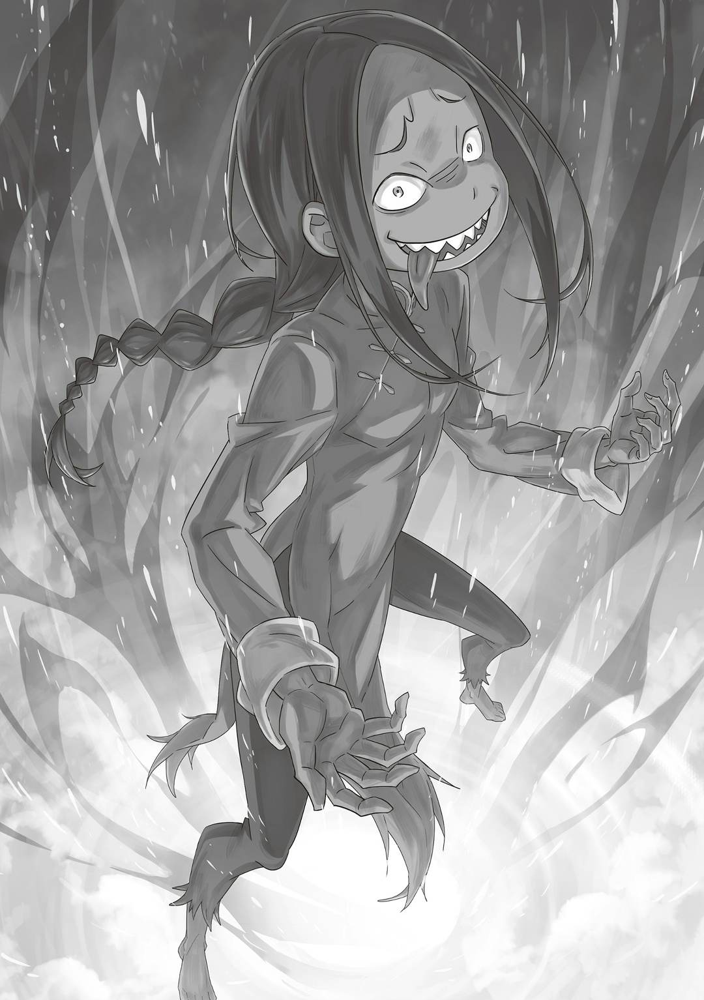
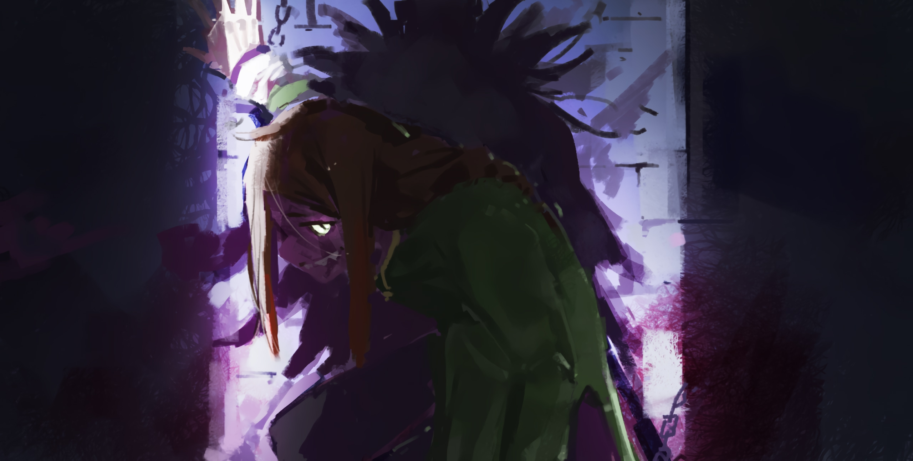
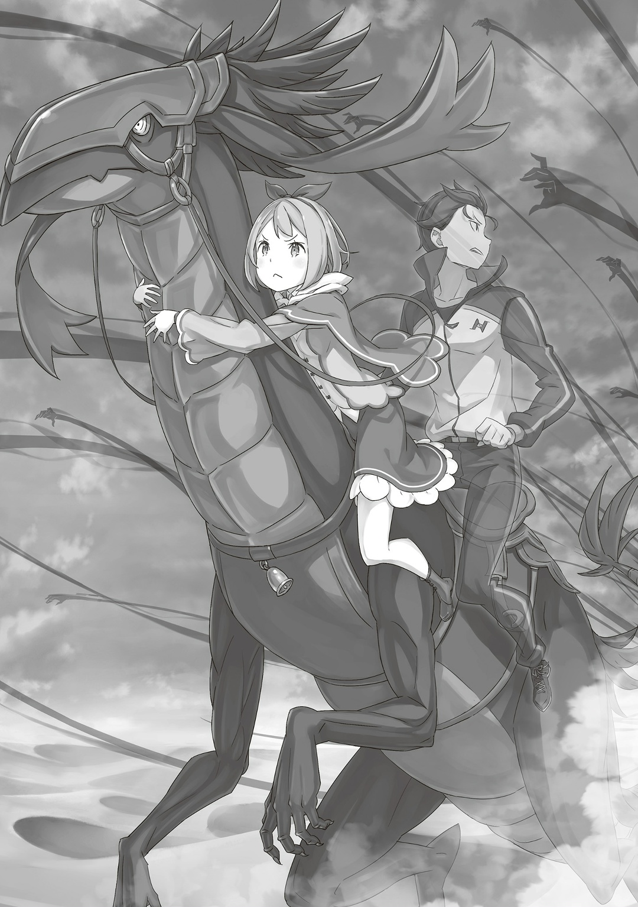

…Прошло несколько часов с битвы в лесу. Ром очнулся.

— Они забрали Фельт… Плохие мы бойцы, даже победить нормально не можем.

Доложил ему Рачинс. От поражения у него кололо в груди. Ром тоже стыдился, но не так сильно — он уже не раз проигрывал.

— Тут нечем гордиться.

Интересно, можно ли было пересчитать победы Рома по пальцам рук? Даже если он одерживал маленькие победы, к концу войны всегда оказывался проигравшим. Зато каждый раз оставался жив. Стоило ли этим гордиться, Ром не знал. Но именно позор поражений однажды привел его к незаменимому сокровищу. …Теперь же это сокровище отобрали. Ром продолжил:

— Как там Фельт можно узнать с помощью…

— Увы, они разобрались с «Божественной Защитой Дальновидности». Служанка шлемоголового не промах. Манфреду повезло, что ему только один глаз выкололи.

— Понятно. Что ж, ожидаемо.

«Божественная Защита Дальновидности» позволяла находить и отслеживать цель на расстоянии. Ей пользовался начальник «Весов» Манфред Мэдисон. Он вставил себе в орбиту глаз, дающий эту способность. «Весы» отличались от «Черного Серебра» и «Сада Цветочной Тюрьмы». Это была печально известная группа с темным прошлым, которая жила не во Фландрии. Их главное умение — красть чужие защиты. Ром не знал, как именно, но догадывался: носителя оставляли в живых и забирали ту часть тела, которая наделяла Божественной Защитой. …Конечно, просто заменить себе глаз не хватило бы, чтобы все заработало. У «Весов» был какой-то секрет. К сожалению, враг догадался выколоть глаз Манфреду. Проследить за Фельт не получится. Ром прибавил:

— И все-таки чудо, что мы выжили.

— Чудо, ха? Я так не думаю.

Ром потер подбородок, а Рачинс громко цокнул языком. Они рискнули жизнью и выжили. Подобно имперскому солдату, Рачинс не стал жалеть вслух, что не умер. Шлемоголовый никого не убивал, но даже так они проиграли. Ром разделял его стыд. К счастью, Рачинс нашел в себе силы двигаться дальше. А значит, у него еще есть будущее. Как и у Гастона с Кэмберли.

— …Ром-сама, вы очнулись?

— Ты, Грассис? Да, я пришел в себя.

Пришла Грассис. В последний раз Ром видел ее связанной нитью. Она выглядела гораздо лучше, чем Рачинс. Грассис и Флам с рождения обучались в семье Астрея. Несмотря на юный возраст, они не уступали многим воинам, которых знал Ром. Именно «Метод Потока» помог Грассис быстро восстановиться.

— Но это не значит, что можно бросаться куда ни попадя… Как там твоя Божественная Защита, Грассис?

— Скоро будет готова… Если, конечно, Флам не погибла.

— Не говори так…! Но да, мы точно не знаем, жива ли она… Даже если шлемоголовый ее не тронул, в дюнах еще сражается Райнхард…

— Рачинс-сама, только не вешайте нос, хорошо?

— Я? Вообще-то, это тебя здесь должны успокаивать!

Грассис легонько похлопала Рачинса по спине. Он огрызнулся и высунул в досаде свой длинный язык. Но она не испугалась, а проскользнула за спину Рома и бросила на него трагичный сердитый взгляд. Это была их обычная игривая перепалка. Ром положил руку на маленькую голову Грассис, нежно взъерошил ей волосы и сказал:

— Мы все одинаково волнуемся за тех, кто сейчас в башне. Дай знать, как будешь готова использовать Божественную Защиту.

— …Вас поняла, распорядитель.

— Да кто вообще так говорит!?

Рачинс удивился ее странному обращению. Грассис коротко кивнула и подняла руку Рома. Именно из-за бурных ответов Рачинса сестры постоянно и дразнили его. Возможно, вести себя как ни в чем не бывало — это то, что сейчас было нужно как Грассис, так и ему.

— Молодежь должна жить во всю и не слушать никого, а думать — это уже наша забота.

Ром выбрал хорошее поле боя. Собралось пятьсот головорезов. Но они все равно проиграли. И Фельт теперь в заложниках. Хуже было только на «Войне Полулюдей». Но это поражение отличалось от других — оно не было непредвиденным и бесплодным. …Они знали, что в минуту отчаяния шлемоголовый может призвать «Божественного Дракона». Поэтому держали в запасе козырь — Фельт. Волканика был главной силой шлемоголового. Если не победили, то хотя бы захватили его мощного союзника. К тому же они узнали о Полномочии врага.

— Второй раз на те же грабли он не наступит. А теперь еще и Фельт в его руках… Придется искать новые способы победить.

Ром не опускал руки. Шлемоголовый решил их не убивать. Никто не пострадал. Поэтому они могли нанести еще один удар. И это вовсе не трусость или бесчестие.

— Почему-то шлемоголовый не хотел терять ни секунды. Похоже, нормально он не отдыхает. Скоро усталость обнажит слабые места в его Полномочии. Если Фельт склонила «Божественного Дракона» на свою сторону, то возможностей у нас теперь побольше. Странно, но шлемоголовый и его сообщники не ладят…

Размышлял Ром. Поражение осталось позади. Мысли переключились на следующую битву. Стратагема уже складывалась. Кто-то мог бы назвать это хладнокровием. Его внучку похитили. Он не знал, как она там сейчас. Но отбросил беспокойство и сосредоточился на главном.

— Блин, теперь мне еще паршивей!

Рачинс не чувствовал ненависти, только стыд, который никак не утихал.

— Рачинс-сама, сделайте все, что в ваших силах.

— Кх! Почему ты ведешь себя так, будто тебя это не касается?

△ ▼ △ ▼ △ ▼ △

— …Расширение территории, переопределение матрицы.

Альдебаран тихо выбрал новую точку перезапуска. На прошлую трудность ушла двадцать девять тысяч двести двадцать одна попытка. Наконец с ней покончено. Можно немного восстановиться. Он вдохнул во всю грудь, поправил шлем и сказал:

— …Ну, вроде нормально себя чувствую.

— Вроде~? Может, еще как-нибудь отдохнете? Мои бедра к вашим услугам.

— Спасибо, обойдусь.

— А они ведь такие мяяягкие~ и упрууугие~.

— Ага.

Взмахом руки Альдебаран отказался от ее заманчивого предложения. Яэ цокнула языком и надула губы. На самом деле, ее это не расстроило. Она уже привыкла к его отказам. И все же Яэ очень помогала Альдебарану. Например, разделяла с ним тяготы.

— Голова уже меньше болит…

Альдебаран почувствовал легкость. Опасность прошла. Напрягаться можно было меньше. Битва с Фельт совсем его вымотала. Он не победил, но и не проиграл.

— Делать ментал рисет в середине боя вообще не вариант — мне не помогает…

Принимать яд и перезапускать матрицу, чтобы отдыхать сколько угодно. Это помогало успокоиться, но усталость тела и мозга так просто не снимешь. Альдебарану нужно было справляться с недосыпом и переутомлением по-другому.

— От твоих бедер я, наверное, только вырублюсь.

— О~, это потому что вы влюбитесь в меня по уши?

— Нет, я буквально вырублюсь. Легкомысленные разговоры — вот что мне реально помогает.

Альдебаран покачал головой и устроился поудобнее. За ними никто не следил. Сейчас они отдыхали, но в целом медленно двигались на запад от места битвы с головорезами. Он решил уделить отдыху немного времени.

— Кстати, вопрос: если я вырублюсь, меня сможет привести в чувство «Драконья Кровь»?

Альдебаран поправил шлем и обратился к «Альдебарану». Тот следил за окрестностями вместе с Яэ. «Дракон» почесал морду когтем и ответил:

— «Хм-м, сложно сказать, все-таки сравниваю свое старое слабое тело с телом «Дракона». Но, думаю, если ты выпьешь моей неразбавленной крови, то просто взорвешься.»

— Ба-бах… Понял, значит, как герцогиня в Пристелле я не отделаюсь.

— «Я думал об этом, когда стал «Драконом». Если не считать Нацуки Субару — у него там вместо кишок одни проклятия — просто чудо, что герцогиня выжила. Наверное, все дело в том, что она прибли́женная к Королевской Семье.»

— …Значит, говоришь, разбавить твою кровь? А ее обычная вода вообще разбавит-то? Так, вроде шиноби не только в ядах разбираются, но и в лекарствах. Яэ, «Драконья Кровь», мнение.

— Никогда не видела, чтобы кто-то ее пил. Честно, я не выдержу, если Ал-сама станет чудовищем пострашнее, так что я против всего этого.

Если отодвинуть чувства на второй план, только у какого-нибудь специалиста получится разбавить «Драконью Кровь». Заветный эликсир так просто не получишь. Белый свет не мил.

— «Да давай я хотя бы магией исцеления тебя подлечу, что ли. Держи, путник, хиллься.»

— Мы в одном пати вообще-то. Ты хиллишь не путника, а дорогого тиммейта.

«Божественный Дракон» выпустил много исцеляющей магии. К сожалению, Альдебаран не был ранен, а левая рука не отросла, зато теперь он точно знал — его вылечат при серьезной ране. Утешение. Правда, при серьезной ране он сразу глотал яд, а не ждал кого-то там. Так что да — утешение.

— Вол-сама, могу я задать вам один вопросец~?

— «…А! Вол-сама это я? Не сразу понял. Какой?»

— Вы там, надеюсь, уже поутихли чувствами к Фельт-сама?

С беспечностью спросила Яэ. В их команде давно гуляло волнение. Альдебаран сузил глаза. «Альдебаран» тоже сузил глаза и ответил:

— «Поутихли, в смысле уменьшились? Нет, даже наоборот. Между нами страшная любовь. И расстояние только ее усиливает.»

— Вы сейчас не так далеко друг от друга, не называй это расстоянием. Блин, да откуда вообще взялась твоя привязанность?

«Дракон» старался говорить в стиле Альдебарана, но не врал. Тут Яэ кивнула и продолжила:

— Ясненько~. Но она правда мешает, эта Фельт-сама. Неужели нельзя от нее просто избавиться?

— «Яэ, я скажу это сейчас, но…»

— Ах~, не торопитесь. Я знала, что вы, Вол-сама, так скажете, но есть же безопасный способ. …Если Фельт-сама попытается сбежать, я, Ал-сама и Вол-сама будем только рады.

— Не-а, я рад не буду.

— Но так исчезнет причина возможных бед!

— …Если она причина возможных бед, тогда ты причина моих возможных беспокойств.

— Ой-йой, кажется, я разворошила осиное гнездо!

Шутливо ответила Яэ. Для нее скоро станет привычкой обсуждать эту тему. Безопасный способ — это условие Фельт. Если она попытается сбежать, ее можно убить. Фельт и «Альдебаран» пообещали, что в этом случае обид не будет. Но Альдебаран не хотел такого конца. Он хотел вернуть Фельт на выборы целой и невредимой, чтобы она боролась за трон в хорошем настроении. Судя по внезапной привязанности «Альдебарана», подозрения о Фельт, которые ходили в Королевском Замке, подтвердились.

— «Дракон» так просто привязаться не мог, тут явно что-то не так. Есть шанс, что оригинальная личность захватит твое тело?

— «Не-а, это же «Драконья» оболочка. Оригинальная личность не выйдет поздороваться. Какие-то остаточные чувства, конечно, дают о себе знать, но не более.»

— …Остаточные чувства? Что ты помнишь?

— «Мне нравится Фарсель и не нравится Рейд. Остальное в тумане.»

— О, «Святой Меча» первого поколения, значит? Не упоминай его так мимоходом, меня это пугает.

Его имя часто звучало от «Ведьмы». Те, кто знал Рейда лично, говорили о нем плохо. А теперь еще и остаточные чувства «Божественного Дракона». Рейд точно был кем-то плохим. Альдебарана беспокоило, что могло скрываться за туманом чувств «Дракона».

— Ладно, не так важно. Яэ и «Дракон» тут. Что с Фельт и стариком?

— Хейнкель-сама сейчас внимательно следит за Фельт-сама~.

— Их нельзя оставлять один на один!

— …Ах~, облажалась, я облажалась~.

— …

Но, похоже, Яэ сделала это нарочно. Альдебаран вздохнул и выпрямился. Это была расплата за условия работы, которые он для нее выставил.

— «О, ты к Фарселю? Точнее, к Фельт? Тогда я тоже…»

— Когда начнешь с ходу называть ее правильно, тогда и увидишься с ней. Может, это поубавит твою привязанность. А то я бы не хотел, чтобы чаша весов склонилась в ее пользу.

Альдебаран приказал Яэ остаться с «Драконом». Она только ответила: «Ура, групповая работа~». Затем Альдебаран в одиночку зашагал к Фельт и Хейнкелю. Они ждали с другой стороны большого дерева, чтобы не подслушивать их стратегическое совещание.

— …Папаша Райнхарда, тебе не нужно передо мной оправдываться.

Это было первое, что услышал Альдебаран. Фельт сидела, прислонившись спиной к большому дереву, а напротив стоял Хейнкель и смотрел на нее сверху вниз. С точки зрения кинематографа он имел над ней психологическое преимущество.

— …Кх, о-оправдываться? С какой стати я должен перед тобой оправдываться? Чепуху не неси, соплячка!

— Что ж ты тогда на меня так смотришь? Как на иголках весь.

— Кто, я…?!

Сильно возмутился Хейнкель, но потом почему-то замолчал. Похоже, тут не работала логика кинематографа. Они отличались по росту и возрасту, но это ничего не значило. Альдебарану стало жаль Хейнкеля. Он бы предпочел поскорее уйти, но,

— Хм? — Альдебаран…

Они заметили его почти одновременно. Альдебарану пришлось подойти к ним. Затем он заговорил:

— Старик, хватит лезть к Фельт. Что бы ты ни сказал, она все равно будет выше тебя.

— Ах… Ты серьезно думаешь, что она может меня переубедить?

— Не важно, кто кого переубедит или переговорит, разговор с ней ты уже заведомо проиграл. Старик, ты со мной заодно. Для нее ты чистой воды предатель… Нет, не только для нее, для любого в Лугунике.

— …Кх, я… знаю. Даже так, я…

Горько пробубнил Хейнкель и опустил глаза, раскрывая и закрывая ладони. Он понимал, какую кашу заварил. Знал, что его поступки запятнают честь Дома «Святого Меча». Осознавал, что этот позор не отмыть. Но был готов на дурную славу, ради…,

— Папаша Райнхарда, тебе нужна «Драконья Кровь», чтобы разбудить свою жену… чтобы разбудить маму Райнхарда?

— Кх, откуда ты…

— Как думаешь, куда меня возил твой сын? Я давно знаю, что творится в семье у этого тупицы. Я много чего слышала от бабушки Кэрол и других.

— Тогда! Ты должна меня понять! Мне нужна «Драконья Кровь»! И Альдебаран пообещал ее мне! Вот почему я пляшу под его дудку…

— Как и сказала, тебе не нужно передо мной оправдываться.

От ее ответа он почувствовал безнадежность, как будто его скудную совесть разорвали на куски, чтобы поиздеваться. Но Фельт не пыталась его обидеть. В подтверждение этого она почесала голову и произнесла:

— Думаю, будет хорошо, если мама Райнхарда проснется. Наверное, у тебя просто нет выбора. Я не стану тебе перечить.

— …

— Твои методы отличаются от наших. Это не хорошо и не плохо, они просто другие.

Фельт говорила с закрытыми глазами. И так было ясно, что ее слова ошарашат Хейнкеля. Стало очевидно, кто контролирует ситуацию. Такими темпами раны Хейнкеля усугубятся. Приставания Яэ помогли. Альдебаран похлопал красноволосого мужчину по плечу, сказал: «Хватит, старик» и увел его подальше от Фельт. Потом он вернулся и продолжил:

— Ты жестока, Фельт. Сердишься на что-то?

— А что, по мне не видно, придурок? Я сдерживаю себя, чтобы не надрать вам всем задницы. Но мне мешает эта херня на шее.

Фельт коснулась тонкой нити и улыбнулась, сверкнув острым клыком. Она много дерзила, но понимала, в каком положении находится. Никто из головорезов не погиб, поэтому Фельт не осознавала всю опасность стальных нитей. Альдебаран прибавил:

— …Я не собираюсь наступать на одни и те же грабли.

— …

Это было не просто заявление, а клятва, которую он дал самому себе. Фельт закалили трущобы. Она была не только Кандидаткой, предположительно, Королевских кровей, но и возможным чудовищем, воспитанным Валгой Кромвелем. Она уже могла быть гораздо опаснее, чем Альдебаран себе представлял. Но даже так он не проиграет.

— Пусть я играю свою последнюю роль, но в моем росте еще есть смысл.

«Альдебаран» стал не таким управляемым. Яэ стала дерзкой и наглой. Хейнкель стал еще отчаяннее. Плюсом, теперь они должны тащить за собой Фельт. …Все шло совсем не так, как он планировал. Взамен на усталость, непредвиденная битва и ощутимое поражение лишили Альдебарана самомнения и преподали важный урок на будущее.

— С этой секунды я буду использовать территорию на максимум.

Он будет постоянно обновлять матрицу, чтобы сразу же реагировать и решать сложные задачи. Это сэкономит время и даст ему преимущество. Но если врагов соберется много, есть риск зайти в тупик. Если действовать по старой схеме, даже с противниками, не такими умными, как Валга, обычная неудача может закрыть ему путь вперед.

— Если долго тянуть с отдыхом, либо перегреется мой мозг, либо откажет мое сердце… Это все равно лучше, чем провалить план.

Альдебаран даже не думал о том, что будет после. Нужно добраться до Великого Гейзера Моголейд, сделать свое дело, а потом исправить, что натворил, и покончить со всем этим. Что будет дальше — ему все равно. Вот почему главное отдать все силы именно на этой неделе.

— …

Пока Альдебаран укреплял свою решимость, Фельт, щурясь, смотрела на него. Он намеренно не обращал внимания на ее взгляд. Даже так Альдебарану было не по себе. Ни характером, ни чертами лица, ни телосложением, ни чем-либо еще, лишь глазами Фельт походила на Присциллу.

— Можешь не смотреть на меня с такими глазами?

— С чего это? Я с ними вообще-то родилась. Но да, они очень выделяются, мне самой не нравятся… хотя нет, раньше не нравились.

— …

— Теперь нравятся. Я буду смотреть на тебя.

Она села на землю, скрестив руки и ноги. Ее взгляд и сила воли — он понимал чувства тех, кто почитал Фельт. Но сейчас ее сияние было для Альдебарана как яд за моляром. Вот только оно не убьет его, а просто будет мучить.

— Что-то я проголодалась. Когда уже вы будете меня кормить?

— Как нагло… Извини, но у нас нет времени. На первом месте дорога.

— Да как вы только с заложниками обращаетесь, а? …Мы направляемся в ту Карарагскую дыру?

— К Великому Гейзеру Моголейд. Там наша конечная цель. Но перед этим нужно кое-куда заехать.

На его слова Фельт приподняла бровь и спросила: «Заехать?». Альдебаран кивнул, повернулся к далекому пейзажу и, мысленно представив заветное место, сказал:

— …Должно быть, сейчас там почти никого нет. Нужно забрать кое-что важное для моего плана.

△ ▼ △ ▼ △ ▼ △

Они благополучно добрались. Альдебаран ошибся — охраны было слишком много. Но учитывая, что скрывали за этими стенами, такая бдительность даже успокаивала. Впрочем…,

— Обычная охрана меня не остановит.

Чтобы схватить Альдебарана, нужно окружить его сотнями бойцов, как это сделала Фельт. Даже в столице, самом важном месте Королевства, для этого понадобился бы целый орден рыцарей. Однако Альдебаран заранее позаботился о том, чтобы этого не случилось.

— Я добрался без проблем, но действенность отвлекающего маневра все равно под вопросом…

Альдебаран и «Божественный Дракон» Волканика разгуливали на свободе. Против них отправился «Святой Меча», но на его пути встала «Ведьма Зависти». Вся армия наверняка была в ужасе. Для них это выглядело как крупнейшая катастрофа со времен буйства «Ведьмы Зависти» четыреста лет назад. Поэтому, если «Альдебаран» появится в небе, Королевство должно показать готовность бросить на него все силы. Даже если ради этого в самой столице останется мало солдат. Таким образом…,

— …Нашел.

…Четыреста семь раз.

После множества проб и ошибок Альдебаран наконец нашел нужное место и вещь. Все было тщательно запечатано: от дверей до сложных механизмов внутри. Без посторонней помощи он бы просто развернулся и ушел. Однако сейчас у Альдебарана был…,

— Клык «Божественного Дракона». Интересно, сколько священных золотых монет он может стоить?

Одной мысли о стоимости этого редчайшего предмета хватило бы, чтобы у всех знакомых Альдебарану торговцев в глазах замелькали золотые монеты. Используя его как катализатор, он разрушил прочную магическую защиту. Раздался ужасающий звук, будто кто-то голыми руками рвал металлические балки. Невидимая стена исчезла. Альдебаран вошел внутрь. Комната была маленькой, даже меньше уборной в поместье Бариэль. Без окон, с одной дверью, она напоминала камеру заключенного… и на самом деле, это и была камера заключенного. Ведь внутри сидел настоящий преступник. Грешник. Олицетворение зла, которому нет прощения.

— Хотя я тоже натворил уже столько, что меня можно спокойно казнить…

И все же оставалось еще кое-что, чтобы умножить грех на грех. Альдебаран протянул руку к черной массе впереди. Это тоже была работа необычных механизмов, но на этот раз помощь «Божественного Дракона» не понадобилась. Эта вещь была другой, но ее суть не отличалась от того, чему его учили. От знаний, добытых ценой крови и мучений. От учений «Ведьмы».

— …

Он коснулся пальцем черной массы. В следующий миг по ней пошли трещины. Она раскололась, как керамика, но без осколков, а затем растворилась в воздухе. На ее месте появился кто-то, стоящий на четвереньках.

— Либо подчиняешься и идешь за мной, либо я убиваю тебя здесь и сейчас.

— Ха…

Некто поднял голову и улыбнулся. А потом засмеялся. Нет, не просто засмеялся. …Он разразился смехом, хохотом, гоготом. Он облизал губы, из которых торчали острые клыки, и сказал…,

— …Как хорошо, так отлично, просто великолепно, замечательно, превосходно, потрясающе-! Наше сердце трепещет от того, как это бесподобно-! Снова пир-! Чревоугодие-!

Так в темной камере, в тюрьме, которая была гробом, пробудился тот, кто носил титул Архиепископа Греха «Чревоугодия» — Лой Альфард. И в его голосе звучали свобода, голод и радость.

△ ▼ △ ▼ △ ▼ △

…Казалось, будто наступил конец света: небо и земля, свет и тьма слились воедино, а границы между жизнью и смертью, собой и другими исчезли навсегда.

— Молодой господин! Молодой господииин!

Громкий, отчаянный голос принадлежал Флам, той, кто редко показывала эмоции. Она смотрела туда, где бушевали черные тени, поглощавшие все на своем пути. Им противостоял красноволосый Герой — «Святой Меча» Райнхард ван Астрея.

— Молодой господииин!!!

Флам верила в силы Райнхарда больше, чем кто-либо другой. Зная его не только как Героя, она сорвалась на крик. Райнхард должен был услышать ее голос, полный боли. Однажды он решил быть тем, кто всегда услышит чужую мольбу. И все же Герой молчал. Сильнейший «Святой Меча» стоял перед великой угрозой. Малейшая ошибка могла стать роковой.

— …

Черные конечности заполняли горизонт. Они хотели раздавить Райнхарда. Однако он, с истерзанными руками, разрубал клетку тьмы «Мечом Дракона». Он повторял это снова и снова, по десять-двадцать раз в секунду. Пот и кровь на его теле сразу превращались в пар. …Так шла битва «Святого Меча» и «Ведьмы Зависти».

— Бл~ин! Все очень пло~хо!

Мейли крепко сжала поводья, пытаясь справиться с незнакомой задачей. Она даже не пыталась привести в порядок свои растрепанные косички. К счастью, умная Патраш могла ехать сама. Гарфиэль и Эццо лежали без сознания. Флам не могла оторвать глаз от Райнхарда. Петра так и не пришла в себя после «Книги Мертвых». Осталась одна Мейли. Теперь не только битва Райнхарда, но и жизнь их отряда зависела от ее слабых рук.

— Слишком громко сказ~ано…

Мейли уже попадала в ситуации, где от нее зависела чья-то жизнь. Но она всегда забирала жизнь, а не защищала ее. Единственный раз, когда Мейли пыталась защитить кого-то, был во время «Испытания» в Сторожевой Башне Плеяд. Такой маленький опыт не поможет против «Ведьмы Зависти».

— Патраш, пожалуйста… Не знаю, понимаешь ты меня или нет, ты же все-таки не Зверодемон… но мы в опасности!

— …ДОДОГЮЮЮН!!!

Патраш фыркнула и рванула вперед. Ее черная чешуя сверкала в вихре пыли. Она повезла их через бескрайние пески…,

— Если так будет и дальше…

Они быстро покинут Песчаное Море.

— …Ах.

Земля дрогнула, как будто ее резко потянули в разные стороны. Патраш потеряла опору. Колеса подскочили. Вся карета взмыла над песками.

— …

Пинч. Это слово промелькнуло в голове Мейли. Субару всегда говорил «Пинч» в таких случаях. Но сейчас это слово ей не поможет. Мейли поняла одно: если ничего не сделать, Патраш потеряет «Божественную Защиту Уклонения от Ветра». А без нее из Песчаных Дюн не выбраться.

…Что же мне делать? Братец, прошу, помоги!

— Спаси нас…!

Слезливые слова сорвались с ее губ. Мир вокруг перевернулся.

— …Доверься мне, Мейли!

Теплый, но громкий голос. Кто-то оттолкнулся от сиденья и прыгнул вперед, к Патраш, которая подлетела в воздух. Большой красный бант, светло-каштановые волосы…,

— Петра-чааан~!

Петра крепко обхватила шею Патраш и уселась в седло. Девушка прижалась к дракону всем своим маленьким телом.

— Патраш! Успокойся! Слушай мой голос!

— …Додогюююн!!!

— Да, хорошая девочка… Сейчас!

По ее команде Патраш взмахнула хвостом, вытянула лапы и приземлилась, вонзив когти в песок. Дракон и карета не перевернулись, а продолжили путь с «Божественной Защитой Уклонения от Ветра». Трудности остались позади. Все благодаря чуткости Патраш и той, кто привел ее в чувство.

— Мейли-чан! Ты как?!

— Я-я в пор~ядке! А ты, Петра-чан? Ты прочла ту книгу…

— Со мной все нормально. Сейчас важно другое.

Глаза Петры сузились. Она посмотрела назад. Там, у Сторожевой Башни Плеяд, Райнхард сдерживал «Ведьму Зависти». Одна мысль о ней пугала. Даже Мейли. Но Петра, сидя на Патраш, лишь сказала:

— Все будет хорошо. Доверься мне.

— Петра-чан…?

— Нам нужно выбраться из Песчаного Моря. Вперед!

Чувствуя странную уверенность, Мейли несколько раз кивнула в ответ. Петра улыбнулась, а затем повернулась обратно. Она крепко держалась за шею Патраш. Все остальное — на Райнхарде. Они мчались, мчались, мчались вперед. Наслаждаясь иллюзией прохладного ветерка, Петра прошептала:

— У нас получится… Правда, Субару?

— «Да, сделаем это! Отдадим все силы!»

Любимый голос того, кого не должно было здесь быть, заставил ее сердце биться сильнее. …Чтобы вывести из Песчаного Моря их единственную надежду, Петра выложится на полную.

