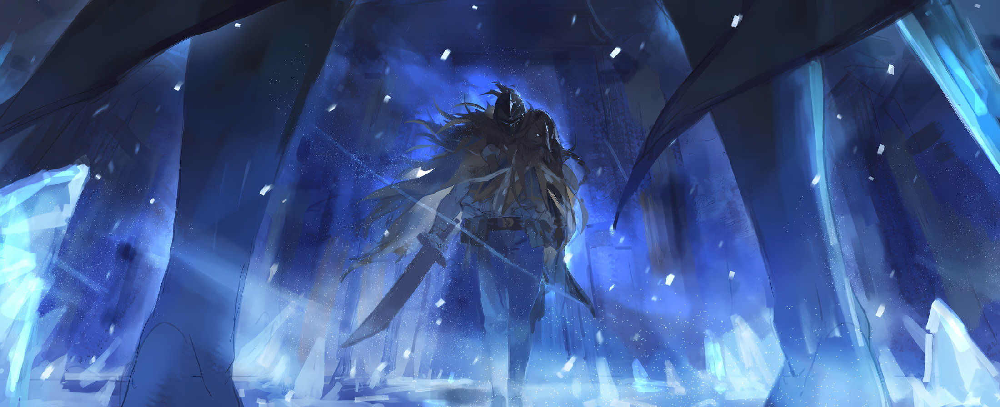

…«Посмертное Возвращение».

Полномочие обратить время вспять, чтобы исправить ошибки. Важная обмолвка — вернуться можно только в обмен на собственную жизнь. Именно так, под влиянием зловещей «Ведьмы Зависти», Нацуки Субару не раз и не два превозмогал непосильные препоны. Надо думать, он умирал десятки раз. И никогда легко. И никогда без предсмертных тягот. И всегда с мыслями, что больше не выдержит. И всегда испуская дух, даже если сердечно не хотел. И, на беду, повторяя «Посмертное Возвращение». И как только не завопить от несправедливости, от нескончаемого горя? И как не убежать от всего… И почему же он просто не убежал?

— …Ему не давало большое сердце.

Потерять кого-то насовсем — да ни за что. Если мог помочь, он на совесть помогал. Даже если не любил, все равно до последнего защищал. Никто, по его мнению, не заслуживал уснуть вечным сном. Так, с героизмом в сердце, он вновь и вновь «Посмертно Возвращался». Всякие испытания, любые каверзы, некие враги, всевозможные Зверодемоны, каждый Архиепископ Греха — все вставали Нацуки Субару острой костью в горле. Их руки багрели от его крови, а затем ими же они рисовали ему душевные раны.

Но теперь я поняла. Теперь я знаю. Да, трудности, неприятели, бедствия тоже виноваты. Не спорю и не сомневаюсь. Но теперь я знаю. Лучше других осознаю: есть те, кто убил Субару больше, чем неприятели, больше, чем бедствия, даже больше, чем жестокая судьба.

…Люди, которые пользовались его добротой.

△ ▼ △ ▼ △ ▼ △

— «Ну, не надо делать из мухи слона.»

— …Легко сказать, Субару.

В поток её мыслей вмешался «Нацуки Субару». Он сидел, прислонившись к краю повозки. Петра, держа поводья, взглянула на него и тяжело вздохнула. Этот «Субару» — лишь её воображение. Довольно легко догадаться: сквозь него лучилось солнце, а еще выглядел он моложе. События в «Книге Мёртвых» охватывали только то, что было полтора года назад… те непростые дни, когда она устроилась горничной.

— С той поры много случилось.

Волей-неволей, но они изменились как в лучшую, так и в худшую сторону. Петра, например, подросла, отрастила волосы, а еще набралась опыта как служанка и как женщина. Субару же очень сблизился с Эмилией и Беатрис, стал чаще проказничать с Отто и Гарфиэлем, а кроме того — возмужал. Вот почему этот «Субару» казался ей ещё совсем зеленым. …И всё равно, даже без мужества, он вёл себя преспокойно. Видимо, Субару родился таким очаровательным.

— Так… Я начала думать куда-то не туда.

Вовремя остановившись, Петра схватилась за лоб и качнула головой. Её ум не зашёл за разум. Как-никак она частенько воображала Субару, заставляла его принимать разные позы и говорить всякое. Петра с молодых ногтей любила сочинять романтические истории и любовные стихи, потому придумывала того, чего не было, и изображала там себя и Субару великими героями. Для нее это было сладостной не́гой, от которой стучало сердце, от которой пылали щеки. Однако «Субару» перед глазами чудился не выдумкой, а живым человеком.

— «На воображение не походит. Ты поосторожней, главное здесь с ума случайно не сойти.»

— Всё хорошо, Субару, мне не впервой воображать невозможное. И да, прекрати читать мои мысли.

— «Вот что правда легко сказать! Знать бы как, я же ведь у тебя в голове, Петра, буквально у тебя в голове!»

— …

От его резкого ответа у Петры спёрло дыхание. «Субару» тотчас же пожалел о том, что сказал, и почесал щеку. Нежность в глазах, неуклюжесть в движениях, забота к другим — за это он и был мил её сердцу. …«Книга Мёртвых» Нацуки Субару помутила её «рассудок». Так взвесила Петра.

Эццо Каднер предупреждал — каждая книжка изматывает ум со страшной силой. И знал он об этом не понаслышке. Однако всё оказалось куда хуже. Впрочем, едва ли Эццо предостерегал именно о том, что человек из «Книги Мёртвых» станет читателю видением.

— …Скрывал «Посмертное Возвращение», говорил, что родился за Великим Каскадом…

Субару нёс чудовищную ношу. Его силой забрали из родных краёв. Он очутился в мире, где не знал никого и ничего. Что же было у него на душе, когда он познакомился с ними? На что шёл, чтобы их спасти? Откуда черпал силы, чтобы бередить ради них своё хрупкое сердце? И всё это… было лишь малой частью того, что она узнала. Ему приходилось переживать ужас за ужасом. Даже не верилось, что все они полтора года назад наконец отпустили его, что с тех пор он не «Посмертно Возвращался». Субару прошел через ад, чтобы подарить им драгоценное сегодня.

— …

От этого знания ей не оправиться. Может, с виду и незаметно, но внутри она беспокоилась. Никак не получалось отмахнуться от чувства, будто из-под ног ушла земля. Петра разговаривала со своим возлюбленным, который был ни жив ни мертв, и чувствовала то счастье, то грусть. Она не владела собой.

— Ничего.

Любовь слепит, но любовь животворит. Петра жила влюбленностью. Я такая, какая я есть, поэтому стараюсь держаться… С трудом, но всё-таки держаться. Сколько себе это ни твержу, никак не уходит чувство, будто я села за руль автомобиля в нетрезвом виде. Водительских прав не было как у нее, так и у Субару. Они и не знали, каково это — водить пьяным… И всё равно Петра волновалась.

— Автомобили, вождение в нетрезвом виде, светофоры, их сигналы для слепых и слабовидящих…

Много нового вереницей всплывало в памяти. Одно сразу тянуло за собой другое. Что-то она уже слышала, а что-то ни разу. Что-то понимала, а что-то даже описать не могла. На вид всё чудилось знакомым, но в то же время чужим. Если она сейчас же не возьмёт себя в руки, то поневоле начнёт носить мужское и орудовать хлыстом.

— «Стопэ, я отдал перк в «хлыст»? А он вообще в мете? Блин, фиг поймешь, что у меня в голове творится после спасения Беатрис…»

— Кстати об этом: мы победили и хорошенько поднадавали Господину, Гарф-сан пересмотрел свой синдром восьмиклассника, Отто-сан перестал нормально спать, а Эмилия-сама выросла как человек.

— «Всё-таки за всем стоял Розвааль, да… Минуточку, его простили? За какие такие коврижки?»

— С этим вопросом тебе к Субару и Эмилии…

Петра хоть и согласилась с их решением, но так и не простила Розвааля. После «Святилища» он много раз выручал лагерь Эмилии, особенно в Империи, но это, считала она, тема другая. Простит его в итоге или не простит — не знала даже Петра. Пока же в мире нарисовалась подло́та хуже Розвааля.

— «…Петра.»

— …С-слова мне не помогут.

Его мягковатый тон и проникновенный взгляд — она забыла, как дышать, хотя, скорее, её сердце забыло, как стучать. Глаза стыдливо заметались: всё лишь бы на него не посмотреть. Оттого Петра сосредоточилась на пути. …Они покинули башню и ехали через дюны. Где-то там, за морем песка, безвозвратно скрылся враг. Даже Патраш с «Божественной Защитой Уклонения от Ветра» за ним не угонится. Редко кто обгонит крылья «Божественного Дракона». Однако у них оставался повод спешить.

— …«Ведьма Зависти». — «…«Ведьма Зависти».»

Вторил «Субару» угрюмой Петре. Сторожевая Башня далеко позади — несколько часов она вела повозку. Страх не отпускал. «Ведьма» вырвалась на свободу. Черными руками она потянулась к Петре, которая узнала того, чего не должна. Тогда наперекор прорве теней, грозящих поглотить весь мир, встал Герой. …«Святой Меча», Райнхард ван Астрея. Отныне от него зависела судьба всего живого. Вдали не затихал страшный грохот, раз-другой по земле приходили мощные толчки, случалось вспыхивал искромётный свет — точно собралась гроза. Сомнений нет, конец света выглядел и звучал именно так. Но на сколько хватит одного Героя? Не знал никто. Зато точно можно сказать, что…

— «Проиграет — и пиши пропало.»

— За Райнхардом… -сан… последую я. И неизвестно, сколько жизней «она» заберёт по дороге.

— «Да, из доброты душевной «она» другим не уступит.»

Из-за шутки «Субару» Петра на секунду представила вежливую «Ведьму Зависти», которая в тесном поезде уступает место слабой бабушке. К сожалению, смеяться совсем не хотелось. Возможно, ей стоит сдаться в руки «Ведьмы», чтобы ненароком не пострадал кто-то случайный…

— «…Этого ты делать не будешь. Я не дам, будь даже ценой моя жизнь.»

— …

На его прямодушие она не нашла слов. Субару всегда оберегал её. Не только её, но и Эмилию с Беатрис. И Рем тоже. Он не дорожил Петрой больше всех, но, несомненно, в сердце его она занимала особо важное место.

Сегодня Петра узнала, что на самом деле таилось за фразами вроде «Будь даже ценой моя жизнь». Нацуки Субару не щадил себя ради дорогого — такой вот уж он был человек.

— …Мне бы не хотелось умереть. Думаешь Ал-сан знает, как остановить «Ведьму»?

— «Конечно знает. Он не дурак: по-любому припас что-то в рукаве, чтобы не дать всем погибнуть.»

— Наверное, всё так.

— «Всё точно так.»

Уверенно отвечал ей «Субару». Петра кивнула. В таком случае нужно догнать Ала и заставить его рассказать, как спасти мир. От всех важных дел голова шла кругом. И только «Субару» дышал надеждой. …Правда, это работало и в обратную сторону. Они разделяли одно сознание, потому он чувствовал все её тревоги.

— Если Ал-сан всё-таки хочет уничтожить мир…

Тогда они в нём ошиблись. Быть может, в отчаянии Ал сам не знал, как останавливать «Ведьму Зависти». Его госпожи, Присциллы Бариэль, больше нет. Той, кого он почитал, кого сердечно любил, больше нет. Он был вправе ненавидеть мир. Но надо верить в лучшее.

— Я, Мейли-чан, Гарф-сан и остальные — все живы…

Ал мог попросить «Божественного Дракона» убить их, но не стал. Значит ли это, что в нем ещё осталось человечное?

— …Редко я так кого обеляю. Пора отвлечься, иначе так и буду накручивать.

— «Сон — лучшее лекарство.»

Петра приложила палец к губам, а «Субару» пожал плечами. Она сузила глаза, когда он неловко улыбнулся и махнул ей рукой. Неясно, как сильно «Субару» влиял на её мысли. Вряд ли «Книга Мёртвых» просто подарила ей неунывающего черноволосого юношу.

— Должны же быть какие-то подводные…

Петра любила Субару, но не хотела им ненароком стать. Главное здесь — не начать осыпать всех добротой, как он. Она восхищалась Субару и Эмилией, желала перенять крохотку их благодушия, но быть ими точь-в-точь опасалась. Только Субару и Эмилия могли быть Субару и Эмилией. Петра хотела одного — научиться возвращать добро добру, а не принимать его должным. Вот почему ей лучше пока попридержать своё сочувствие.

— …Петрочка, пришла моя очер~едь.

Внезапно окно драконьей повозки отворилось и оттуда зазвучал голос. Мейли отдохнула и собралась подменить Петру, но та покачала головой и заговорила:

— Не нужно, лучше дальше отдыхай, Мейли-чан. Ты же несла меня, пока я приходила в себя, а ещё следила, чтобы Зверодемоны не нападали…

— Я сделала не больше Флам-чан: она переносила клыкастого братца и Мастера. А Зверодемоны все разбе~жались из-за «Ведьмы Зависти» и «Святого Меча». У меня ещё полно сил.

Но уставшее лицо Мейли показывало обратное. Очевидно, у неё не получалось отдохнуть. Издали исходило присутствие «Ведьмы». И чувствовалось оно так, будто вот-вот на тебя напрыгнет хищник. Тут не успокоишься, а с её-то ответственностью тем более.

— Флам-чан всё так же спит?

— Д~а, в себя ещё не приходила: до сих пор восстанавливается для «Божественной Защиты». — «Мейли… Вот кого правда не ожидал здесь увидеть.»

Угрюмая Мейли и удивленный «Субару» заговорили в одночасье. В любой точке мира, но раз в день и односторонне Флам могла связаться со своей сестрой-близнецом — вот что делала «Божественная Защита Телепатии». И сейчас она требовалась как никогда. Сила способности зависела от сна. Чем больше придётся передать — тем дольше нужно поспать. Именно поэтому Флам дремала… но вот способ, каким она уснула, пугал.

— Схватила себя за шею и душила, пока не отключилась…

— Отча~янно, но по-другому она не могла: мешали мысли о «Святом Меча». Сразу видно — его приближенная. Она немного младше нас, но с ходу ясно — Флам-чан не от мира сего.

— Совсем не умеешь ты слова правильные подбирать, Мейли-чан. — «Кто бы говорил, Мейли.»

Петра и «Субару» ответили в одночасье. Мейли обиженно поджала губы. Правда, услышала она только слова Петры. Маленькая беседа ненадолго заняла их.

И вот так они двигались вперёд.

— …ДОДОГЮЮЮН.

Внезапно взревела Патраш. Она видела, что случилось в башне, потому трудилась больше всех. Наконец, впопыхах, дракон вывез их из Песчаного Моря.

Начинала виднеться Мирула.

— Петрочка!

— Да! Почти доехали!

Петра сжала поводья покрепче и наклонилась вперед. Патраш мельком взглянула на двух подруг, а затем стремглав бросилась к «финишной прямой».

Она безустанно неслась именно сюда.

— «Что бы мы без тебя делали, Патраш. Большое спасибо.»

Любовь и благодарность, на которую он не получит ответ. «Субару» гладил Патраш, пусть даже рука проходила сквозь. Между тем Петра продумывала путь по Мируле. Чтобы остановить Ала, предавшего своих друзей, понадобится кое-что сделать.

— …Ха.

Получилось. Они проехали через городские ворота. Петра облегченно вздохнула. Перед всем дальнейшим нужно обратиться к тому, кто не поехал с ними в дюны, а попрощался в Мируле…

— Мы вернулись, и нам нужна помощь! Знаю, ты слышишь меня, Клинд-сама!

Кликнула Петра. Пришло время козыря — человека, которому нипочём расстояния.

△ ▼ △ ▼ △ ▼ △

Фельт нахмурилась, заметив, как рядом пробежало крохотное. Ещё с трущоб она не могла к ним привыкнуть. Её воротило от того, как они выглядели, каким цветом блестели. Но выбора не было — приходилось спать вместе. Фельт отнюдь не брезгливая — однажды в ночь, чтобы не замёрзнуть, обнимала жирную крысу. И даже так они ей не нравились — эти жуки Зодда, эти мерзкие враги человечества.

— Куда ни плюнь, везде шастают. Бесят…

Плохая среда им нипочём — живучие твари водились и там. А особенно в грязище — но не всегда. Краем глаза Фельт поймала этого жучка подле чистого и ухоженного здания… поместья в благородном округе столицы. Всё вокруг пышало красотой и роскошью — всюду картины, украшения. Сколько же денег сюда вложила покойная хозяйка? Фельт боялась даже подумать.

— Слушай, у тебя же нити длинные, да? Можешь покромсать одного уродского жучишку?

— Фельт-сама~, Технику Стальных Нитей редко где встретишь~. Веками о ней не вспоминали. А всё потому, что для неё нужны специальные колечки со стальными нитями внутри. Из ниоткуда такие не возьмешь — мне вот «Мастер Проклятых Инструментов» их сделал, сам Груви Гамлет. И всё же — мои дражайшие ниточки, да против каких-то жуков? Не для того я тренировалась, недостойны.

— Много воды, потеряла суть где-то на середине. Ты по делу мне говори.

— Не хочу запачкать свою ниточку жуком, всё тут~.

Горничная-шиноби спрятала руки за спину и отвернула лицо. Фельт издала «Мгм» и пробежалась глазами вокруг. Тот жук куда-то уполз. Беда.

— С ними расслабляться не варик: могут ныкаться за каждым углом, а иногда даже в рожу влететь.

— И такое бывает~? И что тогда — прощай жизнь~?

— Не убьют, но насолить ещё как насолят.

Смириться и отчаяться всегда легче, чем работать и не сдаваться. Хоть в чём-то они сошлись — обе воротили нос от жуков Зодда. Фельт ещё раз оглядела поместье. Даже знать, жившая за столицей, обычно имела владения в благородном округе: очевидно, для важных дел. Дом Астрея, в который её насильно притащил Райнхард, и поместье Бариэль, которое Присцилле строили специально с нуля, — тому наглядный пример.

— Сто пудняк у неё тут слуги были и всё убирали. Но терь почему-то одни жучары. Наверн, как узнали, что хозяйка скопытилась, так сразу смотались кто куда.

— Ой~, главное Алу-сама такое не говорите, ладно~? Не к чему грубиянить~. Да и мне тоже не хочется слышать плохое про госпожу~.

— Чё? Это ты ща просишь меня шлемоголового не злить?

— Нет-нет, можно не пытаться — Ал-сама из себя не выйдет точно. Но… слышать такое ему будет больновато~. А этого мне не надо.

Серьезным тоном предупредила горничная и наклонила голову. Внезапно горло Фельт слегка сдавило — о себе напомнила стальная нить. Тончайшая верёвочка обвивала её шею.

— Зато шлемоголовый вскипит если резанёшь меня.

— Кто знает, кто знает~. Я, как полезная горничная на все руки, должна облегчать жизнь своему хозяину, а от ваших неосторожных слов, мне кажется, ему легко не будет.

— Хозяину? На хозяина и слугу вы чё-то пока не смахиваете. Хотя не мне за такое предъявлять.

В конце концов, Фельт подняла руки, как бы говоря, что всё поняла. Яэ посмотрела ей в глаза, а затем пожала плечами и отпустила нить. Шиноби ясно намекнула — любая неосторожность лишит Фельт пальца, а может и руки. …Горничная вряд ли блефовала — в скорости и меткости с ней не посоревнуешься.

— С тобой рыпаться не прокатит, рисково будет…

В поместье были только они. Если Фельт выберется из плена, то её лагерь больше не будет ничего сдерживать. Осталось понять, как незаметно сбежать, либо одолеть горничную.

— Что и ожидалось от Кандидатки~. Ваше упрямство западает в душу, но, пожалуйста, не делайте лишнего, хорошо~? Некоторых мне совсем не жалко порезать на кубики — разбойников там, Хейнкеля-сама — но вот милых дам трогать я не люблю~.

— Ага, а я вот не люблю слова вроде «милая», «дама», а ещё фразы по типу «Тебе это очень идёт». Следи за базаром, я считаю каждый твой прокол.

— Ой-йой, напугали-напугали~. И что сделаете, когда проколов наберётся много?

— Верну те должки: за каждый прокол по смачной оплеухе.

Пока что она насчитала всего три. Альдебаран, «Божественный Дракон», Хейнкель… они тоже стояли на её счётчике мести. Что-что, а Фельт добросовестно возвращала как благодарности, так и обиды.

— Зад дракону я ещё не надирала, а «Божественному» и подавно. Во всём можно найти плюсы.

— О-го-го~, ваша сила духа пугает. К сожалению, с Волом-сама вам лучше не видеться, а то опять случится беда.

— Беда случится, если ты надолго оставишь папашу Райнхарда с «Божественным Драконом».

— Да~, Хейнкель-сама ради «Драконьей Крови» душу продаст, и не только свою~. Ну, будем надеяться, он ничего такого не сделает~.

Яэ задорно улыбнулась и поднесла палец к губам. В её словах не было ничего смешного. Хоть они и сообщники, но горничной всё равно — умрёт Хейнкель от «Божественного Дракона» или не умрёт.

Сильнейшее существо и заядлого пьяницу пришлось оставить по пути в столицу.

Каждый занял своё место на доске.

— Вы не только государство можете покорить, но ещё и целого Дракона~. Одним словом — обаяшка~.

— Плюс один… Слушай, давай начистоту: папаша Райнхарда получит «Драконью Кровь»? Или вы его просто дурите?

— Поживём — увидим~. Если с «Божественным Драконом» не выйдет, Ал-сама пойдёт в замок столицы за старой «Драконьей Кровью». Он уж постарается, чтоб жёнушку Хейнкеля-сама разбудить~. Хотя вас, Фельт-сама, думаю, такой подход не очень радует.

— Она ещё спрашивает…

Фельт недавно разговаривала об этом с Хейнкелем. Ей не нравился его метод. Однако не посторонним судить мысли, решения и поступки других. Фельт хотела того же, что и Хейнкель, просто другим способом.

— …? Что?

Вдруг она почувствовала пристальный взгляд Яэ. Сидя на диване в гостиной, Фельт нахмурилась. Тут горничная покачала головой и ответила:

— Ничего такого~, просто удивилась. Не думала, что вы тоже хотите разбудить жёнушку Хейнкеля-сама… маму «Святого Меча».

— Ну знаешь, просто этот гад всё время сидит рядом, когда мы едим…

— …?

Яэ не поняла, о чём речь.

К столу в лагере Фельт звали Флам и Грассис. У них установилось одно правило: кто раньше придёт, тот нужное место и занимает. Это касалось всех, кроме Фельт — у неё был личный большой стул.

Так вот: почему-то всегда место рядом с Фельт занимал именно Райнхард. Оттого-то…

— Всегда вижу его рожу, когда ем. Интересно, без неё еда повкуснеет? Надо будет проверить.

— …Поправочка: Фельт-сама не обаяшка, Фельт-сама — икемен~!

— Я ни хрена не поняла щас, но — плюс один!

— Э~, если не поняли, то зачем тогда плюсовать~!

Взбунтовалась Яэ, на что Фельт отвернулась и замолчала. Ей уже привычно сидеть заложником, но это ещё не значит, что можно много болтать. Так недолго и проговориться о чем-нибудь. Тут горничная, держа её на крючке, продолжила:

— Извините, если обидела. Вот, пожалуйста, возьмите~.

С этими словами она тихонько протянула серебряный поднос, на котором лежало два бутерброда. В животе Фельт заурчало. Тогда Яэ хихикнула и,

— Думаете, жуки Зодда и здесь где-то?

— Эти тварюги повсюду, говорю ж. Даже в моём желудке могут быть… Бе, и зачем я это представила. Ладно, отдавай поднос.

Яэ немного подразнила её словами. Фельт окинула горничную взглядом и выхватила съестное. Затем она впилась в теплый бутерброд, хлебом которого были овощи: не слишком сильный, но приятный вкус. Фельт с улыбкой посмотрела на Яэ и показала большой палец вверх.

— Понравились мои хасамияки~? Только их и умею готовить~.

— Зачётные вышли… Только их? Но ты ж ведь горничная… Стоять, а может ты никакая не горничная, а убийца под прикрытием?

— Хм~м~, шиноби мастаки по убийствам, но я правда горничная. Просто больше люблю убираться, нежели готовить~. Ну ладно, не только их — ещё рап умею.

— А разница? Почти такой же бутерброд.

Только в рапе, возможно, использовалось больше овощей. По правде, Фельт не знала, чем он отличался от хасамияки. Как бы то ни было, её накормили. Получается, Альдебаран врал не везде. Но в кое-чём она сомневалась до сих пор. Мужчина в шлеме отделился от Фельт и Яэ, чтобы…

— …Он что, реально пошёл освобождать Архиепископа Греха?

Под стражей в Тюремной Башне столицы находились «Гнев» и «Чревоугодие». Не так давно Фельт воочию увидела, кто такие Архиепископы Греха. Их бесчеловечность она забудет ещё нескоро: по-настоящему неисправимые преступники.

— В Пристелле я билась против «Чревоугодия»… то ли младшего, то ли старшего брата того, кто сейчас в Тюремной Башне. Ещё я повстречала там их сестру. А Архиепископа «Гнева» помогал схватить Райнхард, я его тогда сопровождала. Вот почему я точно знаю — шлемоголовый творит безумие.

— Может быть и так~. Но, знаете, по-настоящему великие дела в здравом уме не делаются. Всё, что проворачивал Ал-сама до сих пор, чистое безумие, разве нет~?

— Если так подумать, то… да. Я ещё могу объяснить его выкрутасы с «Ведьмой» и Райнхардом, но вот с Архиепископом Греха…

— Ну, раз делает, значит, ему это надо~.

— А? Ты не знаешь о его планах?

В ответ Яэ скрестила руки за спиной и улыбнулась. Впрочем, Фельт не сильно удивилась. Она давно заметила — горничная без лишних вопросов верила и следовала за Альдебараном. Словно одержимая, Яэ всегда вставала на его сторону. И только Фельт здесь пыталась найти ответы.

— …«Чревоугодие» жрут «Имена» и «Воспоминания» людей, да ещё и с таким удовольствием.

Круш; Рыцарь Анастасии, Юлиус; знакомая Субару. …Последняя, надо думать, была той самой «Спящей Красавицей», с которой на днях познакомился лагерь Фельт. Так или иначе…

— …Шлемоголовый хочет, чтоб кого-то съели. Других причин, почему он пошёл за «Чревоугодием», не вижу.

Фельт не сдастся даже в плену. От того, кто, можно сказать, победил Альдебарана, она услышала одну мудрость… «Надо жить сильными» — так однажды сказал Ром.

— Ам.

В дело пошёл второй бутерброд. Нужно набираться сил, нужно искать выход, нужно не опускать руки, и тогда найдётся выступ, за который Фельт ухватится. Она слизывала соус с подноса, пока подле от неё…

— Сколько жуков, иу~. Слуг же всего пару дней назад уволили, ну что за ужас~.

Может, это друзья того жука, которого заметила Фельт? Не узнать. Яэ хмуро смотрела на них, как на естественных врагов человечества.

△ ▼ △ ▼ △ ▼ △

…Маленькое, тусклое, затхлое место. Хуже одиночной камеры. Уютом здесь и не пахло. Но вставать на сторону преступника, говорить, что с ним поступили жестоко и бессовестно, не нужно. Уголовнику вернулось соразмерно грехам. Он не дышал — не билось сердце. Можно сказать, его отрезали от мира. Просто так никого в «Чёрный Гроб» не садят. Оттого-то здесь и не убирались. Из хорошего: лучше места для борьбы один на один не найти.

— …Тц, не хотел так сильно. Просто накопилось, сам понимаешь.

Когда по холодному полу зашагали, он резко прислонился к стене. Настолько резко, что зазвенел шлем — сталь ударилась о камень. Раздался небывалый, для этой тюрьмы, грохот. Следом к ногам мужчины… Альдебарана, ничком упал грешник. Именно его здесь держало Королевство. Дыхание можно больше не задерживать — Альдебаран вдохнул. Перед ним распластался Архиепископ Греха Культа Ведьмы… «Чревоугодие», Лой Альфард.

— …

Глубоко вдохнуть и протяжно выдохнуть. Отдышка ушла. Альдебаран огляделся. Разгром: поднялась пыль, треснули стены, разбился пол. Тесно, как в уборной, ноги́ не поставить. Да кто захочет здесь драться? Пришлось, не Альдебаран начал.

— …Я же сказал: либо подчиняешься, либо убиваю. А ты даже не задумался, с ходу напал. Если так не хочется, мог притвориться хотя бы, и потом, в удобную секунду, уже предать.

— …Ха-ха-ха, да что ты говоришь, дядь-.

Прямые жалобы рассмешили Лоя так, что он начал кататься влево-вправо. Внезапно Архиепископ посмотрел на Альдебарана, длинным языком смочил губы и сластолюбиво сказал:

— Мы, голодные-голодающие, проголодались-изголодались-обголодались, а ты говоришь нам ждать далёкую секунду-? Видим, в воспитании детей ты жесток, м-м, как жесток-.

— Воспитывать гнилых недоносков я не собираюсь. В старину, помнится, с детьми помогали все — и бабушки, и дедушки, и знакомые, и соседи — но мы в Лугунике, да и времена изменились. Хотя вмазал я тебе конкретно, приписать в обвинении жестокое обращение можно.

Альдебаран постукал по шлему пальцем, на что Лой снова весело рассмеялся. Архиепископа совсем не волновали сломанные руки и ноги. В старые времена тоже могли наказать — например, палкой — но до такой жути не доходило. Прежде всего, он Архиепископ Греха, а не ребёнок. Его нельзя щадить.

— Что-то подобное я от тебя и ожидал.

Пробурчал мужчина в шлеме; шесть тысяч двадцать два раза. Лой наконец умирён. Сколько зубов потерял Альдебаран, сколько костей переломал — не сосчитать. Было непросто победить.

— Всё время вспоминался Райнхард…

«Причудливое Поедание», Альфард. С помощью силы «Затмения» он использовал способности и приёмы тех, кого съел Полномочием «Чревоугодия». Лой держал в себе опыт уймы воинов, поэтому умело переключался с тактики на тактику, менял боевые стили. Он напоминал Райнхарда, который к любой трудности приспосабливался «Божественной Защитой». Сто тридцать тысяч попыток многому научили Альдебарана. Именно оттого сейчас число не перевалило за четырёхзначное.

— Тебя же после боя в башне не лечили, да? Даже так я еле победил.

— А-? Но ни одна из наших тактик не сработала, впервые такое-. Ты жалеешь нас, дядь-? Если да, то лучшее утешение…

— Кто жаден до еды — дойдёт до беды. Мне ли не знать: я жаренное плохо перевариваю, старый уже.

— Мы лучше знаем: жди беды — когда голодны-.

Смотря во все глаза и улыбаясь во весь рот, проурчал Лой. В его взгляде плавали интерес, аппетит, любопытство, голод, садизм, недоедание и ненасытность. По спине Альдебарана пробежал холодок. Архиепископ думал не о переломах, а о том, как бы скорее поесть. Наверное, для него это было невыносимо. Но сочувствовать ему Альдебаран не собирался. Ведьминский Фактор тут ни при чём: Архиепископы Греха, как и сами «Ведьмы», рождались ненормальными.

— Так… Объяснить тебе, что происходит?

— Хо, неужели расскажешь-? Переломал ребёнку руки с ногами, а теперь идёшь навстречу-? Жалеешь нас, да-. Да, нормальный взрослый кости невинному ребёнку не переломает: замешкается, забоится-. Хотя ты и с виду на нормального взрослого не смахиваешь, дядь-.

— Больно много ты болтаешь… Мы в столице Лугуники, далеко от башни Плеяд. Твой близнец, он…

— …Умер, да-?

— …

— Мы знали-. Родственная связь нам подсказала, дядь-. Глубокая, крепкая родственная связь… ладно, врём мы-. Ведьминский Фактор Лея не чувствуется, сами догадались-. К тому же-…

— Что?

— Нас замуровали здесь, но мы чувствуем настроения вокруг-. Всем страшно, интересно, отчего же-?

Лой облизнул губы. О смерти своего брата Архиепископ говорил равнодушно. Альдебаран невольно ужаснулся. В «Чёрном Гробу»… в печати того же рода, что Оль Шамак, можно ощущать внешний мир? Такого он не знал. Вдруг Лой перевернулся, встретился взглядом с Альдебараном и заговорил:

— Ха, теперь дышится-. Полегчало-… Хм-? Дядь, если «Воспоминания» не врут, ты из Королевских Выборов, да-? Зачем освободил Архиепископа Греха-? Не думал, что скажут о твоей дорогой принцессе-?

— Ты же впитываешь в себя не только боевые стили, но и чужой склад ума? Видимо, умеешь ты только собирать чужой опыт, а не использовать его. Сначала думай головой, потом спрашивай.

— М-м, как грубо-. Задели за живое-? Как хорошо, так отлично, просто великолепно, замечательно, превосходно, потрясающе-! Да, теперь будем спрашивать с умом-! Без необдуманных вопросов по типу: твоя дорогая, дражайшая принцесса умерла-? Сердце сильно болит-? А может душа… ГХА-!

— Да, болит. Будь добр, больше мне такое не задавай.

Альдебаран наступил на его сломанное плечо. С лица Лоя сразу сошла злобная улыбка. Мужчина в шлеме надавил ещё сильнее, потом убрал ногу. С этим Архиепископом будет трудно. Стоило его освободить, как он тут же напал. Ожидаемо, но радоваться нечему. Лой нужен для плана. В других случаях Альдебаран к нему бы не приходил, либо сбросил бы с Великого Каскада.

— …Кх, далеко ты ради нас зашёл, дядь-. Тебе настолько плохо-?

— У тебя язык вообще без костей, или что? И куда только смотрят твои родители.

— Какие, родные-? Родные умерли, когда нас рожали — сестру ещё с собой забрали-. Или наш приёмный родитель-? С приёмным тебе лучше не связываться, дядь-.

— Я и не собирался. …Тебя всё равно уже не исправить.

Разговор зашёл в тупик. Архиепископы Греха всегда болтали без умолку. Они никогда не утешали, только всё усугубляли.

— …

Альдебаран присел на корточки и посмотрел на Лоя. Архиепископ округлил глаза от любопытства, а еще от боли в плече.

— Что такое, дядь-? Что дальше-? Пытать будешь-? Непослушного ребёнка пытать-? Ничего, пытай-. К пыткам мы привыкли-.

— Не. Как и ты, я не верю, что пытки подчинят. Если у врага есть что-то поважнее боли, всё без толку. Поэтому…

— Поэтому, что, дядь-?

— Я подчиню тебя не пытками. …А клятвой.

С этими словами Альдебаран просунул большой палец в шлем и откусил кончик. Резкая боль, капли крови. Затем он потянулся к Лою. Мужчина собирался что-то нарисовать на теле Архиепископа.

— Не двигайся. Хотя без разницы, я управлюсь даже с закрытыми глазами… Сейчас проверим, как оно на деле.

— Раздеть ребёнка и рисовать кровью на его теле-… Даже для нас, Архиепископов Греха, это слишком-. Разврат, отврат, непотребство-. Так и что нам нужно сделать-? Разрушить страну-?

— Нет, страну я бы и без тебя мог разрушить. Кое-что другое. Такое сможешь только ты.

— Работа специально для нас-?

Мужчина в шлеме водил окровавленным пальцем влево-вправо. Щекотно. Лой ухмыльнулся. Похоть в его глазах, в поведении… Только разговоры помогали отвлечься. Казалось, Архиепископ забалтывал его нарочно. Придётся ответить на вопрос.

— …Мне нужно, чтобы ты кое-кого съел. Отказаться не можешь.

— Хммм-? Так и знали-. Да, для другого мы и не годимся-.

Лой отвернул голову и довольно вздохнул. Непонятно, был он против или за. Не так важно. Клятва на душе всё равно заставит.

— Проклятая метка-. Скрупулёзная до безобразия-. Сам до неё додумался, дядь-? Или повторяешь за каким-то безумным Пользователем Проклятых Искусств-?

— Повторяю. Да, он был безумным, но не пользователем проклятий, а магом. Сильнейшим магом в истории. Правда, с дрянным характером.

— А условия клятвы-?

— Съешь кого-нибудь без разрешения — сгоришь и ты, и твоя душа.

Мужчина в шлеме взвалил Архиепископа на плечо. На лицо его он даже не взглянул. Съедавший всех подряд, Альфард был легким, как перышко. Играло на руку. Не хотелось носить тяжесть по Тюремной Башне. Конечно, Альдебаран вырубил стражников, но лучше не расслабляться.

— Теперь к Яэ и Фельт…

Сообщники ждали в поместье Бариэль. Изначально оно принадлежало Лейпу, но с приходом Присциллы всё изменилось. Поместье целиком преобразилось под её вкусы. Лучше надолго там не задерживаться: он быстро заберёт Яэ и Фельт, а потом вернётся к «Альдебарану» и Хейнкелю.

— Дядь, нам нужно повториться-…

Его мысли остановил Лой. Краем глаза Альдебаран заметил, что Архиепископ смотрел на пол. Подрагивая, тот пытался на что-то указать. Мужчина в шлеме присмотрелся…

— Мы чувствовали настроения, пусть и слабо-. Странно, да-? Тюрьма же закрыта от всех-. Здесь не должно быть ни крыс, ни насекомых-. Но почему-то…

— …А?

— Жуки Зодда пробрались-. Подозрительно, да?

Лой неспеша говорил о крохе на полу… жуке Зодда. Они встречались повсюду. И все воротили от них нос. Этих жуков можно сравнить с тараканами из мира Альдебарана. Ничего странного, что они здесь. …Вдруг он осознал.

— …Кх, херово!

Страх. Мужчина в шлеме ускорился. Сломанные руки и ноги Лоя трепыхались. Нужно срочно бежать из Тюремной Башни. Иначе…

— …Достаточно.

Стоило ему ступить за порог тюрьмы, как зазвенел голос. Совсем как колокольчик. Волосы девушки блестели. Похолодало. Шлем затрещал из-за перепада температур на улице и в башне. Кружились снежинки. Но сейчас была не зима. Словно фермер, урожай которого теперь погибнет, Альдебаран обомлел. Девушка решительно ступала по тонкому слою снега, что покрыл окрестности Тюремной Башни. В её красивых аметистовых глазах всегда горел спокойный, мягкий свет. …Нет, сейчас в них горела ярость. А всё потому…

— …Верни Субару и Беатрис.

Тихие, но суровые слова. Поведение под стать правителю страны. Именно такое впечатление создавала эта прекрасная, благородная девушка.

— …

Альдебаран затаил дыхание. «Ведьма Оледенения»… Эмилия грозно нахмурила брови и продолжила:

— Я ооочень зла. И тебя, Ал, жалеть не собираюсь.

