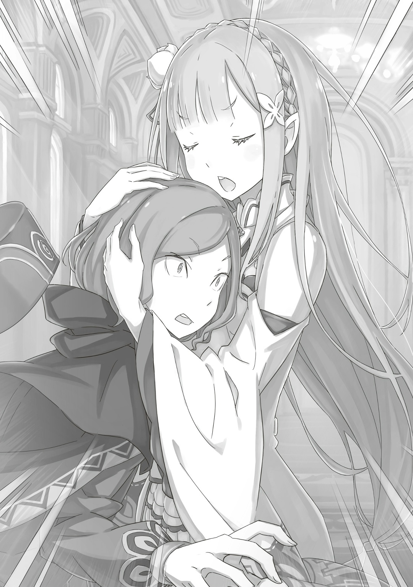
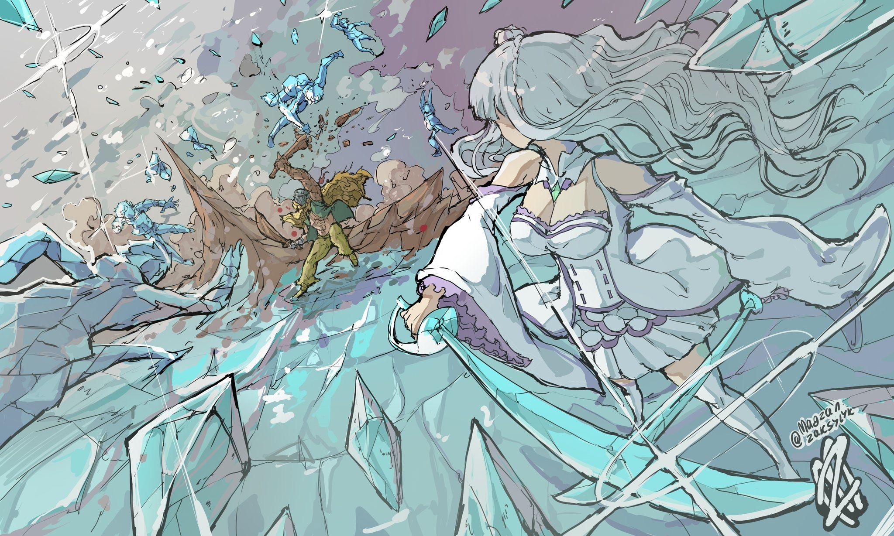
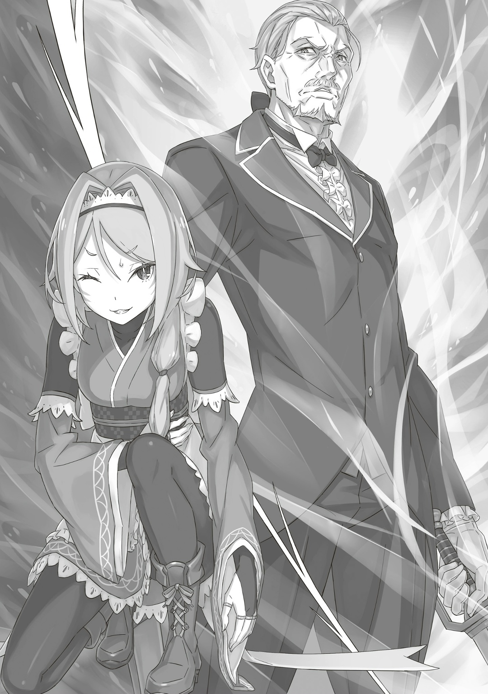

— Я ооочень зла. И тебя, Ал, жалеть не собираюсь.

Тюремная Башня побелела, дул сильный ветер. «Ведьма Оледенения» грозно смотрела на Альдебарана, её аметистовые глаза пылали яростью. Мужчина изумленно встал — у него пересохло в горле. Он видел, как она сражалась в Империи. Тогда на её прекрасном лице читалась серьезность — а ещё храбрость, раздумчивость — но никогда ярость. Значит, впервые…

— …

Ни разу Альдебаран не видел, чтобы она так смотрела. А тем более на него. В голове даже образ не рисовался.

— …Хотя сказать, что это ожидаемо — ничего не сказать.

Улететь с «Божественным Драконом», освободить «Ведьму Зависти» и связать по рукам и ногам «Святого Меча». Очевидно, против Альдебарана ополчится весь мир. …Впрочем, врагов он себе нажил ещё в начале — когда, пусть и не до конца, избавился от Нацуки Субару. Эмилия шла первой в списке. Такова цена его решениям.

— М-м, вот как-? Слышал, дядь-? На тебя злы-. А в злости с ней худо, мы-то знаем-.

— Завали.

— М-м, боюсь-боюсь-.

Архиепископ лишь ухмылялся — нормально двигать телом он не мог. Альдебаран нёс его на плече. Именно группа Нацуки Субару схватила Лоя в башне Плеяд… там была и Эмилия. Вот почему Архиепископ её знал. К тому же Лой съел много «Воспоминаний» и «Имён» в Пристелле — там тоже кто-то мог знать Эмилию. Ладно, сейчас лучше не отвлекаться на Архиепископа, а…

— …Как же тесен мир, давно не виделись, мисс…

С невероятной осторожностью Альдебаран подбирал слова. Но, похоже, общий язык найти не получится, потому что…

— …Кх.

Он даже договорить не успел — Эмилия сразу рванула вперёд. Снег у её ног разлетелся в разные стороны, серебристые волосы потянулись назад. Снежная пелена затягивала горизонт, её локоны блестели поверх, а за ними и…

— Хия-я-я!!!

…Никакой пощады. Альдебаран получил удар ледяной перчаткой по груди.

△ ▼ △ ▼ △ ▼ △

…Вернёмся немного назад.

— Субару и остальные в башне…!

— Мой человечек брякнул мне и сказал, что всех в башне поимели.

Сообщила Фельт в столице Королевства. Эмилия встретилась с ней впервые после Города Водных Врат. Но времени предаваться воспоминаниям не было. Полуэльфийка оказалась в столице не просто так… Она приехала сообщить, что Присцилла Бариэль погибла в Империи Волакия. Сердечно, это было непросто: печальная новость изменит выборы, хватит горем всех, кто знал и любил «Принцессу Солнца».

А потом Фельт рассказала, что…

— Ал…

Зачем? Почему? Эти вопросы Эмилия не произнесла вслух. Неужели из-за Присциллы? Субару и другие поехали с ним в башню. Они хотели помочь, ведь он потерял дорогого человека. Всё лишь бы Ал пришёл в себя, отпустил то, что уже не вернуть. Однако…

— …Фельт-сама, пожалуйста, расскажите с подробностями.

Рядом с Эмилией, которая прикусила губу и сжала кулаки, заговорил Отто. Он тоже приехал в столицу.

Полуэльфийка не могла собраться с мыслями. В противоположность ей стоял Отто — спокойный, несломленный. Но Эмилия знала: на самом деле он злился. Фельт тоже чувствовала это. Уроженка трущоб скрестила руки и продолжила:

— Шлемоголовый взял в заложники Рыцаря и его маленького Духа. Как именно непонятно, но убивать он их вроде не будет.

— Не чтобы убить? А что с остальными?

— Флам передала, что цела. Мейли и горничная Эмилии тоже в поряде. А вот с нашим Мастером и, как его там… Гарфиэлем уже беда, но тоже живы.

— …Ясно, спасибо.

— За что спасибо-то? Сама торопилась рассказать, а то на голову давило.

Прямо сказала Фельт и посмотрела на Эмилию. Полуэльфийка по-прежнему сжимала кулаки, а когда заметила её взгляд, вздрогнула. Глядя на застывшую Эмилию, Фельт прибавила:

— Мы состряпали план: Райнхард подкинет нас на базу, там покалякаем с дедой Ромом и раскидаем за дела дальнейшие.

— В Дом Астрея? Это же рядом с дюнами, Фельт-чан, мы можем поехать с тобой?

— …Эмилия-сама, с ними мы не поедем.

— Но почему?

Эмилия говорила спешно. Вмешался осторожный Отто. Полуэльфийка не понимала, почему её останавливают. Она хотела как можно скорее добраться до башни и помочь друзьям.

— Думаешь, Райнхард всех не довезёт? Ну… Я ооочень постараюсь не мешаться, буду пёрышком…!

— Не, этот-то и тебя, Эмилия, и тебя, браток-зоддовский, даже не почувствует. Дело в другом, да?

— Как бы вы меня там ни назвали, Фельт-сама… но да, в другом.

Фельт и Отто кивнули друг другу. Эмилия перестала что-либо понимать, но не сомневалась — они знают, что делают.

— Фельт-чан, береги себя. Райнхарду тоже это передай. Насчёт Ала…

— С ним ничего не обещаю, извиняй.

— …Ценю твою честность.

Быстрый, тяжёлый разговор. Эмилия обняла Фельт на прощание — уроженка трущоб сделала странное лицо — и проводила из замка. Райнхард забрал Фельт и остальных в Дом Астрея. Им нужно было многое успеть…

— Субару…

Эмилия смотрела в пол. Она осталась стоять в замке. До сих пор полуэльфийка не разжимала кулаки. В башне Плеяд досталось всем. Но больше всего Эмилия волновалась за своего Рыцаря. В Империи он оберегал Рем и Спику, сражался вместе с Авелем, уменьшался до ребенка, снова вырастал, но, к сожалению, не смог спасти Присциллу. Черноволосый юноша заставил избить себя в наказание — полуэльфийка не могла смотреть, когда гладиаторы его колотили. А потом доброту Субару предал Ал…

— Я…

Странное чувство. Казалось, загорелось сердце. Но не грустью и не горем. Она редко такое испытывала: в последний раз, когда сражалась с Регулусом в Пристелле. Тогда это чувство плавало в глазах, горело в груди. Архиепископ из корысти связал сердце своих невест, Сильфи и других. Эмилия обрушила на него настоящий, неподдельный гнев. И сейчас в ней полыхала та же ярость, а может и сильнее.

— Эмилия-сама, спасибо, что не стали возражать.

— Отто-кун…

Хоть Отто и выглядел спокойным, чувствовал он то же самое — неудержимую ярость. Ожидаемо. Он тоже беспокоился о Субару и остальных, отправлялся за ними в Империю. Так больше не может продолжаться…

— Оп!

Она шлёпнула себя по щекам. Отто настолько не ожидал, что удивленно спросил: «Э-, Эмилия-сама?». Полуэльфийка виновато опустила руки — показались красные щёчки — и заговорила:

— Всякое в голове творилось, двух слов связать не могла, поэтому я так. Но сейчас мне легче! …Ладно, насчёт «легче» соврала, но теперь хотя бы говорю нормально.

— …Вот как. Тогда я тоже.

— Ой!

Раздался звонкий удар. Отто хлопнул себя настолько сильно, что Эмилия испугалась. Как бы у него из носа кровь не пошла. Со щеками такими же красными, как у полуэльфийки, торговец заговорил:

— …Нам нет смысла готовиться к тому, что может и не случиться… потому мы с ними и не поехали.

— …А поподробнее?

Эмилия внимательно слушала Отто, который не убирал ладони со щёк. В голове крутилось уйма вопросов. Она хотела многое сказать, но сначала выслушает его. Должно быть, у Отто был ответ на всё.

— Одного Райнхарда на передовой будет достаточно. Фельт это понимает, а потому выбрала вернуться в свои владения, чтобы…

— Чтобы… подготовиться?

— Да. Подумайте сами: напасть на товарищей Фельт, значит, призвать Райнхарда. И всё же… Ал напал.

Полуэльфийка начинала понимать. Она не знала никого сильнее Райнхарда. Несомненно, он был сильнейшим. Даже Пак его так называл.

Поэтому Ал точно что-то подготовил. Что-то против самого Райнхарда. Эмилия продолжила:

— Фельт-чан готовится на случай, если Райнхард не справится… А мы? Нам тоже нужно подготовиться…

— Да, мы будем сразу после Фельт-сама.

— …Поняла. Ал знает, что Райнхард придёт, поэтому подготовился, и теперь нам нужно подготовиться к его подготовке… Так, наверное?

— Правильно. Конечно, можно бесконечно говорить о подготовке к подготовке подготовки. Главное — всё из-за событий в Империи, поэтому даже если «этот человек» тщательно продумал план, подготовится ко всему он бы не успел.

— …Мм, да, логично.

Торговец думал наперёд. Теперь полуэльфийка поняла. Только от одного ей стало больно — Отто перешёл с «Ал-сан» на «этот человек».

Эмилия знала, что для Отто слово «товарищество» многое значило — гораздо больше, чем для других её друзей. Оттого-то он и был надёжным, оттого-то часто и принимал сложные решения.

— …Да, теперь и не знаешь, что о тебе думать, Ал.

Он поступил так из-за чего-то. Точно не просто так. Но Ал перешёл грань — такое Эмилия не простит. Что с Субару? А с Беатрис? Гарфиэль ранен. Петра и Мейли испуганны. Патраш, должно быть, плакала. …Чувство вернулось. Сердце начало полыхать с новой силой.

— …Это я виноват.

Сквозь зубы сказал Отто. Эмилия удивленно замерла. Ладонь торговца со щеки перешла на глаза, он поднял голову вверх. Увидеть его лицо Эмилия не могла — Отто был выше ростом. Но его голос дрожал, значит, он не злился, а…

— Нацуки-сан увлёкся. Это я убедил себя, что он придёт в чувство, если поможет тому, кто горюет по покойной Присцилле-сама. Это я убедил себя, что, если рядом будет Беатрис, с которой он так долго был разлучён, то ничего плохого не случится. Это я доверил Петре-чан позаботиться о нём, помогать, потому что она очень надёжная, храбрая.

— Отто-кун…

— Нет, не только Петре-чан, я доверил всё Гарфиэлю. Это я переборщил, взвалил всё на нашего вспыльчивого и простосердечного Гарфиэля.

— Отто-кун!

Его дрожь в голосе медленно перерастала в срыв. Внезапно Эмилия взяла Отто за руки. Он опустил лицо, и они встретились глазами.

…Ещё никогда она не видела, чтобы Отто плакал.

— Почему… почему у меня всегда всё идёт наперекосяк.

— …

— Если не руками и ногами, так хотя бы головой. Хотя бы так… Но я умный лишь с виду, а на деле просто…

— …!

Всё, что он про себя говорил, его слёзы — она больше не могла. Она потянула его за руки и обняла. Отто замер.

И тогда…

— Неправда! Отто-кун, ты ооочень стараешься ради нас! И мы все это видим. И ты всем нам ооочень дорог, нам важно каждое твоё слово!

— Эми… лия-сама…

— Понимаю. Наверное, моей поддержки будет недостаточно. Но это то, что говорю я, что я чувствую и думаю. Поэтому…

— …

— Ещё не всё пропало. Мы ещё сможем!

Твердо сказала Эмилия, прижимая голову Отто к своей груди. Она будто убеждала себя, но в то же время верила в то, что говорит. Полуэльфийка научилась этому у своего Рыцаря. Они взращивали в себе эту непоколебимую веру по кирпичикам.

— Сдаться — это не про нас!

И правда, сдаваться они не умели. Опустить голову, свернуться калачиком, убежать от всего — это не про них. Они выбирали только один путь — упорно шагать вперёд, делать всё возможное, не падать духом. Похоже, её слова помогли — Отто перестал трястись и,

— …Пожалуйста, отпустите мои руки, а то Нацуки-сан меня потом убьёт.

— Нет, никто не умрёт! Мы не дадим никому…!

— Да! Не дадим! Прошу, отпустите!

Полуэльфийка нехотя разжала его руки. Затем пристально посмотрела в глаза, чтобы проверить, точно ли он пришёл в себя. Торговец вытер лоб платком и вздохнул.

Долго, протяжно вздохнул.

— Знаю, не время, но я кое-что вспомнил.

— И что же?

— …Я вспомнил, почему помогаю Нацуки-сану и вам, Эмилия-сама.

Тихо сказал Отто, вытирая носовым платком слёзы. Его лицо изменилось. Теперь на нём замечалась храбрость.

— Враг похитил Нацуки-сана и Беатрис-чан. По какой причине — неизвестно. Но здесь два варианта — либо цель угрожать нам, либо цель что-то сделать им.

— Либо мы, либо Субару, да?

— Да. Если «Божественный Дракон» правда на стороне врага, то это может угрожать Королевству. Наша роль здесь, в столице.

— Значит, здесь. Мы уж постараемся.

Пока Отто говорил о планах, Эмилия сдерживала порыв внутри.

— …

Сильный порыв броситься спасать Субару и остальных. Грозный порыв не послушаться Отто.

— …Субару.

Она хотела коснуться его. Снова посмотреть в глаза. Услышать голос. В боль, в отчаяние, она хотела быть рядом и поддержать.

Не ярость пылала в сердце Эмилии, а что-то другое. Но понять, что именно, она не могла.

△ ▼ △ ▼ △ ▼ △

— Хия-я-я!!!

Слушать Ала она не собиралась, поэтому сразу ударила по груди. …Всё, как и просил Отто.

— «Прошу, не поддавайтесь чувствам, не разговаривайте с врагом. Его доводы или мольбы можно выслушать потом. Давайте не дадим ему возможности.»

Так сказал торговец перед тем, как она бросилась бежать в Тюремную Башню. «Божественной Защитой Духовной Речи» он узнал, где сейчас Ал и его сообщники. От долгого использования своей способности Отто побледнел. Эмилия не хотела, чтобы он перенапрягался. Но иногда перенапрягаться нужно. Она порой тоже перенапрягалась, поэтому знала, каково это. Вот почему Эмилия сделает всё, чтобы он перенапрягался меньше.

— Как тебе…

Такое! Вдруг она почувствовала странное — ледяная перчатка должна была ударить по Алу, но ударила по чему-то очень твёрдому…

— Вы даже не послушали меня…!!!

Эти слова он словно выдавил из горла. Грудь Ала защитила каменная броня. Упреждающий удар не удался. Но лучше об этом не думать. Если не пошло с первого раза, пойдёт со второго или третьего.

— Почему не выслушаете меня, хотя бы чуть-чуть…

— Потому что! Потому что, Ал… мгх…

— А?

— Я пообещала не говорить… С ТОБОЙ!!!

Каменные доспехи помогли смягчить удар, но от толчка назад не спасли. Держа рот на замке, Эмилия создала двуручный ледяной молот и ударила им поперёк.

Ал одной рукой нёс кого-то на плече. Полуэльфийка не хотела этим пользоваться, поэтому метила в левый бок. После удара наотмашь мужчина не должен встать на ноги. В худшем случае, он просто скорчится от боли.

— Тц!

Он поймал молот левой рукой… каменной рукой из Магии Земли. Удар смягчился. Новую конечность пришлось сразу выбросить — по ней распространялся холод от молота.

— «Нужно отбросить чувства и схватить «этого человека» живьём, иначе мы не узнаем, где Нацуки-сан и Беатрис-сама. Победить, но не убить. Как раз в вашем духе, Эмилия-сама. Главное не забывайте…»

— …Я пообещала не увлекаться, как Субару!

Это обещание она держала в глубине сердца. В следующую секунду Эмилия сделала пару ледяных мечей. …В Искусстве Ледяного Призыва появилась новая особенность: теперь по месту удара шла заморозка. Маны для такого оружия требовалось больше, но Эмилия редко сражалась подолгу. …Как раз то, что надо, чтобы схватить врага живьём.

— Ахахаха-! Дядь, да ты попал-!

— Завали!

Ал закричал на противного задиру… на Лоя Альфарда. Эмилия прикусила губу. Они так старались, чтобы схватить этого Архиепископа. Особенно Юлиус, который решил его не убивать, а ещё Анастасия, которая смирилась с его выбором.

— Но теперь всё насмарку…!

Что бы там ни сказал Ал, Эмилия остановит его здесь и сейчас. А заодно и Лоя.

— Драпаем.

Внезапно под ногами Ала поднялась земля. Мужчину и Архиепископа подбросило в воздух. Они сбегали. Достать их Эмилия бы уже не успела, поэтому…

— …Айсикл Лайн.

Тюремную Башню закрыл круг изо льда. Ал издал «Гх!», когда ударился об него, и полетел вниз головой. Теперь убежать не получится. Эмилия встала туда, куда он должен был упасть, и замахнулась двумя ледяными мечами…

— …Кх!?

Её оружие встретило что-то твёрдое. Эмилия расширила глаза и замолчала. На этот раз это была не просто каменная рука. …Ал слепил ещё и пару каменных мечей.

— Это моё Искусство Каменного Призыва.

— Воровщик…!

— Это ведь Нацуки Субару придумал название, да? Тогда и я могу его использовать.

Каменные мечи встретили ледяные. Ал оттолкнулся от их удара и приземлился на снег. Затем вокруг него начали вылезать новые каменные орудия. Он с легкостью повторил её Искусство Ледяного Призыва. Тут Эмилия заметила: Лой пропал с плеча Ала.

— Только не говори мне…

— Блин, он куда-то сбежал… Шучу. Он мешался, я его скинул ненадолго. Вон.

Когда Эмилия дрогнула, Ал пожал плечами и дёрнул подбородком. Он указал на столб, который подкинул его в воздух. Лоя приковало к нему вверх ногами. Можно сказать, его накрыло земляным одеялом. Встретив взгляд полуэльфийки, Архиепископ заговорил:

— Смотри, не проиграй, сестрёнка, а то придётся нам делать всё, что скажет этот дядька-. Ой ли-? Хотя если победишь, вернёшь обратно в Тюремную Башню, да-? Ха-ха-… Так и так нам худо будет-.

— …Если хочешь, чтобы простили, тебе придётся ооочень долго раскаиваться.

Сказала ему Эмилия и вернулась к Алу. Повезло, что Архиепископ никуда не убежал. Грешника высвободили из печати. Его время там было заморожено, так что о раскаянии не могло быть и речи. Лоя можно было бы посадить туда, откуда он не выберется, и заставить обдумывать свои поступки.

— Но сначала нужно разобраться с тобой.

— О, наконец-то решили поговорить?

— А! С этой секунды буду тише воды.

— Тц. Если поговорим, возможно, поймём друг друга и… Кх!

Внезапно в него полетел ледяной кол. Ал отпрыгнул в сторону. Эмилия рванула вперёд с ещё одним копьём в руках. Каменный меч и ледяной кол разрушились друг об друга. Затем Эмилия создала рапиру, а Ал — тот же меч. Началась битва, где клинки ковались, чтобы разлететься, и разлетались, чтобы выковаться.

— Как хорошо, так отлично, просто великолепно, замечательно, превосходно, потрясающе-! Пир-! Чревоугодие-!

Облизывая губы, Лой смотрел, как сражаются Эмилия и Ал — лёд и земля. Полуэльфийка наносила удары быстро, но мужчина в шлеме уворачивался от всего. С каждой секундой Эмилия чувствовала, что что-то не так. Казалось, вот-вот попадёт, но нет — не попадала. Будто с воздухом сражалась…

— …Расхваливать не хочу, но дерётесь вы хорошо. Неужели так сильно хотите вернуть свою любовь? Завидно.

Ал зашёл слишком далеко. Эмилия была в ярости. Её переполнила решимость во что бы то ни стало низвергнуть жестокого тирана. …Примерно так говорили люди на родине Субару, когда злились 18 .

Мимо ушей она это не пропустит. Ещё больше раздражало то, что он нарочно злил её. Поэтому…

— Давно хотела спросить, Ал, ты всегда какой-то оторванный, когда со мной говоришь, в чём дело?

— …Вы же сказали, что будете тише воды…

— Сейчас не время вспоминать, что было когда-то там! И да!

Тут полуэльфийка подняла над головой меч и обрушила его вниз. Мужчина поднял руку, чтобы защититься каменным оружием… как вдруг кто-то схватил его за ноги. Ал почувствовал чьи-то холодные руки. Это был ледяной солдат по образу Субару, символа-надёжности. Мужчина в шлеме заскрипел зубами и закричал: «Херово!». В следующий миг Эмилия подняла ногу в ледяной туфельке и,

— …Когда смотришь на меня, смотри нормально!

Каменная защита не помогла — мощный удар настиг Ала.

△ ▼ △ ▼ △ ▼ △

— …

Яэ слегка дёрнула бровью — Фельт сразу это заметила. Что-то случилось? Уроженка трущоб точно не знала, но морально готовилась ко всему — всё-таки их разговор могло подслушивать крохотное. Она вспомнила случай, когда ей сказали «приготовиться умереть».

— Сиди тихо.

Обычно глаза Яэ щурились, но не в этот раз. Шиноби приказала заложнику молчать и шагнула к двери комнаты. Фельт не сомневалась: одно лишнее движение — и конец. Яэ медленно потянулась к ручке.

…Внезапно дверь насквозь пробил чей-то меч.

— …Кх!

У Фельт перехватило дыхание. Меч остановился прямо у белоснежного горла Яэ. Точнее, его остановили нити. Она спаслась на волосок от гибели. Но это ещё не всё. …Сверкнул другой меч.

— …

Дверь разлетелась. Яэ успела отпрыгнуть.

Меч против нитей. Раздался звонкий удар стали о сталь. Разлетелись искры — из-за них Фельт сузила глаза. Горничная взмахнула руками: нити заметались, чтобы изрезать всё вокруг. Их встретили два меча. Лезвия немного опутало. Ловким движением враг смахнул нити, а затем…

— ХАААА!!!

— …Кх!

Хрупкую Яэ пнули по животу. Она отлетела назад, провернулась в воздухе и приземлилась на ноги. Затем горничная схватилась за место удара и, глядя на врага, сказала:

— Бить леди ногой в живот… Какой грубый гость~.

— …А с вами, шиноби, можно по-другому?

— Предвзяты вы к нам как-то. Где же ваши манеры~.

— Манерами я не славился от роду, зато славился мечом и ничем, кроме.

Старик стряхнул нити с мечей и голубыми глазами посмотрел на шиноби. Фельт же не смогла пропустить мимо ушей его последние слова:

— Хероту не неси.

Насчёт манер она не знала. Но славился он не только мечом. Многие это подтвердят. Тот, кто некогда отточил мастерство фехтования до предела и стал «Демоном Меча»…

— …Вильгельм Триас. Пришёл скромно искоренить угрозу для Королевства.

Когда услышала его имя, Фельт вздохнула и отошла в угол комнаты. Что думать о таком подкреплении, она не знала, зато:

— …А ты, браток-зоддовский, сложа руки не сидел. В лагере Эмилии, походу, все с прибабахом.

…Сказала Фельт, то ли восхищаясь, то ли поражаясь ими.
