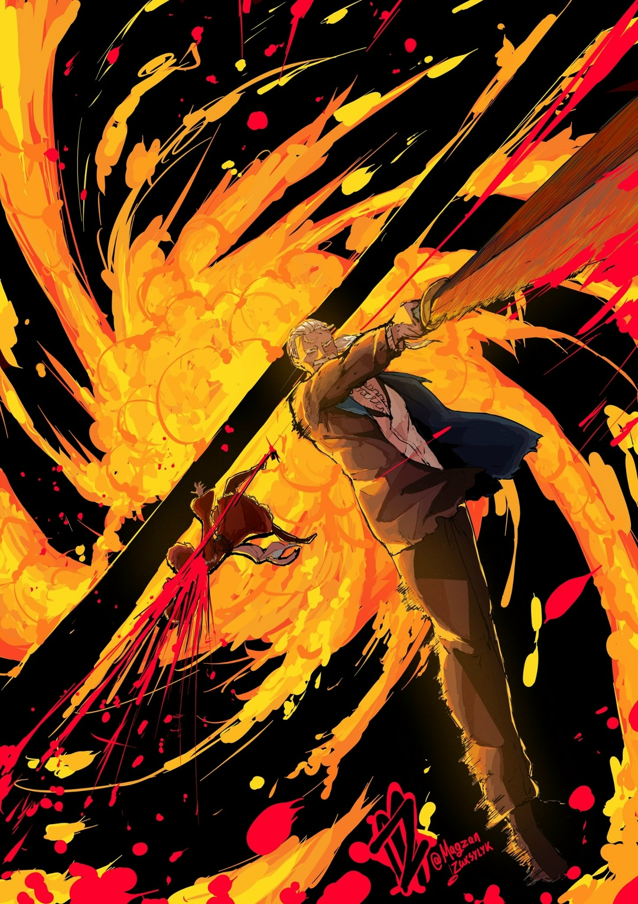

Пришёл некто, чьё владение мечом леденило душу. Её учили оставаться спокойной при любой неожиданности, но сейчас случилось, казалось бы, невозможное.

— …Вильгельм Триас.

Так назвался враг. Яэ Тензен молча насторожилась. Пинок в живот повлиял — теперь обстановка была не на её стороне. Отпрыгни она назад чуть позже, ботинок мечника прошёл бы насквозь. На талии Яэ остался красный след. Сил в этот удар не пожалели; никого не волновало, что она женщина. Мечник прямо признался, что манеры — это не его.

Старый мечник, которого уже сорок лет называли…

— «Демон Меча» собственной особой! Я встретилась со знаменитостью! Ох, сейчас в обморок упаду~… Слышала, вы отомстили за покойную жёнушку. Наверное, большая честь быть мечом Королевства.

— …

— Хм? О, ещё я слышала, что к вам потом покойная жёнушка возвращалась! В Городе Водных Врат чего только не случилось, да? Боюсь представить, каково вам было, хнык-хнык.

— …

Вильгельм непоколебимо смотрел в оба, пока Яэ изображала плач, проводя пальцем по уголку глаза. Два меча в его левой и правой выглядели острыми.

Тут они встретились взглядами. У Яэ не получилось задеть чувства мечника — его голубые глаза даже не дрогнули — зато получилось сыграть злодейку.

— …А я думала вы человек чувств~.

Нельзя полагаться на слухи. Хотя ей рассказал об этом Хейнкель, он-то должен был знать, какой его отец на деле.

В таком случае — нельзя полагаться на Хейнкеля. Нужно было доверить ему Фельт, а не «Дракона». С большой вероятностью он бы облажался, и тогда наконец нашёлся бы предлог убить заложницу и дать от ворот поворот крикливому пьянице.

Вдруг Яэ кое-что заподозрила…

— Меня редко кто может выследить, староста деревни если только… Фельт-сама, не хотите мне что-нибудь рассказать?

— А чё я? Я сидела и не рыпалась, сама знаешь.

— …

— Ну ещё с тобой, дрянью, базарила, на этом всё. Поверь, меня на большее и не хватит.

Недовольно отвечала Фельт в углу комнаты. Когда злилась, она злилась по-настоящему. Будь у неё актерский талант, да такой, чтобы умело играть голосом, это стало бы проблемой. Яэ слегка дёрнула нитью на шее Фельт и,

— Не вздумайте убежать~. Не хочу, чтобы ваша милая голова слетела с туловища в слезах.

— Плюс один. И да, не мне говорить, но…

— Хм?

— Думаешь, самое время отвлекаться?

Фельт высунула язык и издала «Бе-е-е». То, что она даже не пыталась быть милой, выглядело мило. Яэ не отвлекалась, а по-прежнему следила за движениями Вильгельма.

…Мечник стоял на месте, видимо, не зная, что же делать против незнакомой Техники Стальных Нитей. И неслучайно.

…Большинство техник шиноби били в слабые места противника. Боевые приёмы воинов строились на сражении, а техники шиноби на убийстве — проще говоря, дзюцу. Ярчайший пример: Техника Стальных Нитей.

Чем опытнее воин, тем осторожнее он в бою, а чем опытнее шиноби, тем больше ловушек он подготовит — подобно паутине, десять, а может, двадцать слоёв уловок, и так пока…

— …Четыре хода.

— …? О чём вы~?

Яэ нахмурилась, пытаясь понять, что имел в виду Вильгельм. Словесного ответа не последовало. …Последовал другой: мечник сузил глаза. В них шиноби почувствовала враждебность и скорую атаку.

— …Кх.

Она решительно повела десятью пальцами: нити смертоносно полетели к «Демону Меча». Ал приказал ей никого не убивать. Но Яэ не верила, что слабые атаки усмирят мечника; если он выживет после порезов, то прекрасно.

Нитей стало шестнадцать, затем тридцать две. С каждым разом они становились всё тоньше. И вот так, со всех сторон, нитки неслись к Вильгельму. Внезапно он сверкнул мечами и…

— ХАААА…!!!

Быстрыми взмахами Вильгельм поднял вихрь, который смёл всесокрушающие нити. Сталь не переставая билась о сталь. Раскидывались искры, выжигая узоры в глазах. Но не помогло — тончайшие верёвки всё так же метались. Шиноби ослабила напор и приготовилась увеличить их число…

Как вдруг мечник разрезал часть «пола». …А затем ударом ноги подкинул в воздух. Этот «пол» был больше роскошной кровати, потому легко скрыл Вильгельма от глаз Яэ.

— …

Мощным пинком мечник запустил его в шиноби. В тесной комнате бежать было некуда, поэтому Яэ направила порыв стальных нитей на приближающийся «пол». Но не чтобы разрезать, а чтобы опутать и метнуть обратно.

И вот так она кинула «пол» с удвоенной силой и скоростью в «Демона Меча»…

— А?

Раздался громкий, резкий звук. Яэ округлила глаза, когда «пол» остановился. Острие мечника с невероятной точностью воткнулось в его середину. Порыв «пола» был сведён на нет. Воистину великий подвиг, который никогда не повторят обычные смертные. Яэ знала, каково это — её долгое время называли юным дарованием, чудо-ребёнком.

…Даже на старости лет «Демон Меча» не растерял своё великое мастерство.

— Три хода.

Пробормотал Вильгельм, пока Яэ приходила в себя. Она его не видела — мечник прятался за широким и высоким «полом». Но не беда — стальные нити доставали даже до невидимых ей точек. Тончайшие верёвки зазмеились по «полу». Мечник уворачивался от них то влево, то вправо. Но неважно, лево или право, нити всё равно…

…Тут Вильгельм разрубил «пол». Острие его меча почти достало до носа Яэ. Раздался звон — сталь искрилась о сталь. Он подкинул меч и ударил по его навершею. К Яэ со скоростью самой быстрой стрелы полетело лезвие.

Это было последнее, чего она ожидала. Шиноби решила не опутывать странный снаряд тонкими верёвками, а просто слегка сбить его направление и наклонить голову. Острие пролетело мимо её тонкого горла и со звоном воткнулось в стену. За бой Яэ ни разу не отвела глаз от «Демона Меча». Это же и стало роковой ошибкой: шиноби не сразу заметила, что меч воткнулся справа от её шеи. …Теперь для неё остался только путь влево.

— ХАААА…!!!

«Демон Меча» задействовал «пол», как подкидную доску. Затем он оттолкнулся от потолка и во всю прыть полетел к врагу, готовясь нанести косой рубящий удар. …Меч вонзился глубоко в левое плечо Яэ.

△ ▼ △ ▼ △ ▼ △

Вильгельм ван Астрея. …Вильгельм Триас жил в столице Королевства. Он искал способ исцелить свою госпожу, Круш Карстен. Архиепископ Греха «Похоти» влил в неё губительный яд прямо посреди битвы за Город Водных Врат. Он разъедал тело и душу. Круш мучительно страдала. Даже лучший целитель Королевства, Феррис, не смог облегчить её боль. Луч надежды потух. Госпоже Вильгельма не легчало. Тогда появилась возможность… Сторожевую Башню Плеяд покорили. Весть об этом дошла до его ушей. «Мудрец» Шаула, по слухам, знала и могла всё. Возможно, у неё получится вылечить Круш.

— Нам нужно помочь Круш-сама любыми средствами и жертвами!

Феррис отчаянно вцепился в эту возможность. Вильгельм же не нашёл слов, чтобы его утихомирить. Год назад «Воспоминания» Круш съели. Она стала совсем другим человеком. Преданный Феррис всё равно остался с Круш, чтобы поддерживать и помогать. Ему было больно заново дружиться с той, кого знал много лет. Феррису понадобился год душевных страданий, чтобы Круш начала ему доверять… хоть и не так, как раньше, но всё же. Именно тогда пришёл Архиепископ Греха «Похоти», Капелла Эмерада Лугуника. Она влила в Круш яд. К сожалению, Феррис ничем не мог помочь Круш. Вот почему, когда их лагерь узнал, что до Сторожевой Башни Плеяд добрались, в Вильгельме разгорелась надежда. Почему-то группа Субару не сообщила о своём достижении напрямую. Но Вильгельм не стал копаться в решениях других лагерей. Королевство послало в башню отряд, который должен был проверить, безопасно ли там. Вильгельм и Феррис сразу поехали в столицу, чтобы узнать подробности и попроситься в следующую отправку. Тогда-то, в гостевой комнате королевского особняка…

— …Мне нужно вам кое-что рассказать и кое о чём попросить.

Министр внутренних дел лагеря Эмилии доложил им о бедствии, что могло потрясти всё Королевство. С его уст прозвучали имена двух человек, из-за которых Вильгельм взял мечи и,

— ХАААА…!!!

Он разметал беспорядочный поток нитей. После оттолкнулся от потолка и разрезал розоволосую девушку, умелого шиноби, пополам. Каждый миг был на счету, поэтому он закончил бой быстро. Меч с силой вонзился в плечо шиноби и косо прошёл до бедра. Её жизнь разделилась на две части…

Или так должно было быть.

— …Кх.

Девушка стиснула зубы, а затем пол под ней провалился… точнее, её нити покромсали пол на мелкие кусочки.

Она упала в подвал. Вильгельм сразу же прыгнул вслед. В полёте он успел вырвать меч из стены.

Хоть Вильгельм и не разрубил её пополам, но оставил глубокую рану. Шиноби нельзя терять из виду — в тени они становились в пять, а то и в десять раз опаснее — он прекрасно это понимал. Поэтому…

— Тут ты и встретишь свой конец. — Тут вы и встретите свой конец.

Мечник и шиноби заговорили в одночасье. В зияющей тьме Вильгельм увидел нити в тусклых лучах света. …Словно паутина, они опутали подвал.

△ ▼ △ ▼ △ ▼ △

Пока падала, Яэ стальными нитками перевязала левое плечо. Кровотечение остановилось. Лезвие глубоко резануло её нежную кожу, но не забрало жизнь. Скрепя сердце Яэ ужаснулась мастерству «Демона Меча».

Первый ход: он отбился от нитей.

Второй ход: разрубил и отбросил пол.

Третий ход: остановил пол, когда он полетел обратно.

Четвёртый ход: повредил ей плечо.

Мечник не соврал — всего четыре хода.

— Старые маразматики…!

На ум сразу пришёл «Порочный Старик». Этого чудака со скверным характером она знала лично. Вторым же пришёл старый великан. Он встал против Ала и почти победил. А последним — «Демон Меча». Даже сквозь года он не растерял в мастерстве фехтования.

…Три дряхлых зануды, видимо, не знали, когда нужно отправиться на заслуженный отдых. Для начала: потерять жизнь можно везде. И раз они живы, значит, прошли естественный отбор.

— «Потому-то старикашки и опасны. Если думать будешь, что мы там, немощные или хилые какие-нибудь, то помрёшь сама — даже состариться не успеешь. Не мне ли, долгожителю, о таком говорить…»

Яэ вздрогнула, когда вспомнила громкий смех старосты деревни, который за жизнь повидал много ужасного. Искусство шиноби крылось в том, чтобы приковать взгляд врага, отвлечь его от главного, обездвижить и убить.

По части отвлечения врага она была искусной, но ей не тягаться с многолетним опытом старосты. Однако Яэ и не собиралась ему подражать, да и не думала, что проживёт так долго.

Однажды её чуть не убил Ал. Она не верила, что удача продолжит ей сопутствовать. …В конце концов, не каждое чудовище способно щадить.

— …

Вильгельм достал меч из стены и спрыгнул в подвал. Он действовал смело. А всё потому, что уже сражался с шиноби.

Яэ могла бесконечно обзывать шиноби Империи Волакия, у которых не получилось убить «Демона Меча».

Она глубоко вдохнула и выдохнула. Внутри щёлкнул переключатель: теперь в темноте подвала Яэ видела так же, как при свете дня — нет, больше и лучше. Тренировки во тьме дали свои плоды… Глазные яблоки быстро приспособились к новому окружению. Чёрный цвет сменился серым — тогда Яэ развидела «Демона Меча» и раскинула руки.

Враг попал в её сети…

— Тут вы и встретите свой конец. — Тут ты и встретишь свой конец.

Сказали они одновременно, и это их совершенно не смутило. Слова ничего не решали, поэтому оба сосредоточились на том, чтобы убить. «Багровая Сакура» была в подвале как в своей стихии.

…Присцилла не строила подземных ходов — это был пережиток старого владельца особняка, Лейпа Бариэль. По слухам, покойный муж «Принцессы Солнца» никому не доверял и параноил на каждом шагу, поэтому в каждом своём владении строил пути отхода. Дыра в подвал тоже его рук дело. Её выкопали для тайного побега, но Яэ заранее перекрыла ходы, чтобы враги не проникли в особняк. Лейпа она даже в глаза не видела, но всё равно недолюбливала, так как он силой взял в жёны милую Присциллу и хотел использовать её, как марионетку, для управления страной. Однако к его паранойе она относилась с пониманием. Шиноби даже была благодарна Лейпу за эту возможность. В подвале она могла раскидать нити и свободно перемещаться.

Яэ подготовила ловушку и ждала в комнате с Фельт не просто так…

— …Теперь мы будем играть по-серьёзному.

С этими словами Яэ подогнула колени, сняла туфли, раздвинула пальцы ног в чёрных чулках и пустила тончайшие верёвки из колец на каждой из них. Не щадя себя, она умело управляла двадцатью нитями…

— …

Обе стороны искали быстрой победы. Яэ зацепилась коленом за одну из нитей, чтобы перестать падать; тонкая верёвка натянулась и подкинула её вверх.

В большой яме, похожей на колодец, она атаковала первой. Шиноби закружилась в танце, словно лепестки на ветру. За ней тянулись и стальные нити, которые своей красотой пленяли других на смерть. Попадая в её пляс, кровь врагов разлеталась красным цветком. Потому-то её и называли «Багровой Сакурой».

Прекрасные, но безжалостные цветы сакуры распускались во всей красе, только когда впитывали чужую кровь.

— …Кх.

Буйство, которое оправдывало её прозвище, безжалостно понеслось на Вильгельма. Его одежду, кровь и плоть изрезало.

Тут волосы Яэ откинуло назад вихрем двойных мечей. Взгляд Вильгельма заставил её изумиться.

Нити были гораздо длиннее обычного клинка. Вот почему «Демон Меча» только защищался. Пока Яэ свободно перемещалась по тончайшим верёвкам, Вильгельма тянула вниз сила тяжести. Держась на безопасном расстоянии, шиноби размахивала нитками. Прежде чем закончится танец, прежде чем «Демон Меча» уснёт вечным сном:

Шиноби медленно подняла руку. …Пролилась кровь мечника.

Её тонкие ноги плавно прошлись по воздуху, словно по стенке. …Пролилась кровь мечника.

Худым телом шиноби ловко извивалась и изгибалась. …Пролилась кровь мечника.

Танец близился к концу, а «Демон Меча» получал всё больше порезов. Он не мог увернуться от всех нитей. Они резали ему ноги, торс, плечи, шею, щёки и лоб. С каждой каплей крови Вильгельм был всё ближе к смерти…

— …А по глазам не скажешь~.

В глазах «Демона Меча» лучилось спокойствие и желание победить.

— …

Кроме нитей на руках и ногах, были ещё и другие, которые она загодя раскидала по подвалу. Случайно заденешь — и руки с ногами, шею и торс, саму жизнь уже не вернёшь. Эта глубокая яма напоминала пасть Зверодемона, зубы которого разрывали плоть, язык слизывал алую кровь, а желудок переваривал жизнь. В неё-то Вильгельм без раздумий и прыгнул. …Но никакого отчаяния в его глазах не замечалось.

— Похоже, у вас ещё есть что на уме.

Даже если забыть про глаза, шиноби не думала, что с «Демоном Меча» будет легко. Оценку Хейнкеля она уже давным-давно отбросила. Теперь Яэ верила только своим глазам, а потому приготовилось к двум возможным атакам.

Первая: Вильгельм оттолкнётся от стенки и попробует дорубить её тело.

Вторая: он снова попробует метнуть меч в жизненно важные органы.

Не нужно гадать, первое или второе, всё станет ясно через одно мгновение.

— …Тц.

Как только её ноги в чулках описали круг и оставили три пореза на его щеке, Вильгельм взмахом мечей смёл стальные нити на пути.

Сильные ноги «Демона Меча» упёрлись подошвами в стену. Он согнул колени и с новой силой полетел вниз… и заодно метнул мечи в Яэ. В спокойном танце она подпрыгнула и кувырком увернулась от лезвий. Мечи почти задели её бедро и спину. Вильгельм летел следом за клинками. Шиноби атаковала его нитями на ногах. Мечник скрутился и прикрыл голову, проходя через её острую паутину. Ценой порезов, у него получилось.

Яэ отпрыгнула туда, где безоружный Вильгельм до неё не дотянется. Атаки, которых она опасалась, прошли… Но расслабляться ещё рано.

— ХАААА…!!!

От одной стенки Вильгельм прыгнул к другой. Там торчали его мечи. Он быстро вытащил их и ещё раз подпрыгнул. С большой скоростью Вильгельм полетел к Яэ, которая поднималась по косой вверх. …Чтобы догнать шиноби, мечник прыгал от одной стенки к другой, от одной к другой, от одной к другой, от одной,

— Да это издевательство… кх!

В горле шиноби встал ком. «Демон Меча» нагонял её зигзагами. Ничего особенного, так умела и Яэ… но на пути Вильгельма то и дело вставали нитки. И хоть любая ошибка могла стать последней, он не боялся прыгать ввысь. Почему? А потому что он запомнил, где находится каждая нить. Самоуверенность, острое чутье и зоркость — вот главные техники Вильгельма. Он смело нырял в бурю тончайших верёвок.

Ей оставалось только одно — разыграть главный козырь.

— Ху-у.

Яэ перевернулась и вытянулась. Тонкие верёвочки мигом подняли её вверх. Двадцать нитей переплелись с теми, которые она раскидала заранее. Затем шиноби свела руки и ноги вместе. Используя окружение, она могла связать даже сотню головорезов. Всеми силами, рискуя разорвать себе мышцы и сломать кости, Яэ потянула за нити.

В следующий миг они разорвались. Ловушка, подобная разрезанию колбасы маленькой верёвкой. Яэ использовала силу натяжения, чтобы безжалостно покончить с врагом… Это был натиск нитей, направление и размах которого не прочитала бы даже она. Вдобавок к этому,

— …И вот вам на десертик от горничной на все руки!

Глядя на то, как снизу всё шинкуется оголтелыми нитями, шиноби поцеловала кольца на руках. …Языки пламени побежали по тончайшим верёвкам. Вспыхнул неимоверный огонь, который сжигал всё на пути. Багровое сияние нещадно окутало «Демона Меча» и испепелило до неузнаваемости.

— Вы сами виноваты…

Досадно, но пришлось ослушаться приказа Альдебарана. Впрочем, об этом она думала ещё в начале. «Демон Меча» пришёл либо убить, либо умереть. У неё не было выбора, так что…

— Буду держать это в тайне от Хейнкеля-сама~…

— …Зачем же, пусть узнает.

Вильгельм вырвался из адского пекла и,

— …Ах.

Тело шиноби, уже не в танце, полоснул меч. Её кровь пролилась спиралью. От силы удара Яэ закрутилась в воздухе; она распахнула глаза, пытаясь понять, что случилось. Как он пережил буйство нитей и испепеляющее пламя? Последний прыжок Вильгельма отличался — он летел прямо вверх, а не косой линией. Похоже, для опоры «Демон Меча» использовал тончайшие верёвки Яэ.

— Как вы… на моей ниточке…

— Ты много раз показывала. …Что с удачным углом и нужной силой нити не режут.

Быстро, в пылу сражения, рискуя жизнью на каждом шагу, Вильгельм уловил особенность её оружия.

Остался только…

— А… огонь?

— Разрубил.

На прямодушие мечника шиноби удрученно вздохнула. Дерзкий ответ, но вряд ли он врал. Яэ приняла такой исход. Из глубин её сознания всплыли недавние слова, которые она отбросила как бесполезные…

— «Мой отец силён. Очень, зараза, силён. Тебя с Альдебараном, конечно, тоже голыми руками не возьмёшь, но он куда страшнее. Его не просто так называют «Демоном Меча».»

Хоть в чем-то Хейнкель не обманул. Яэ не думала, что Вильгельм страшнее Ала, но он точно был сильнее неё. …Она просчиталась: поверила Хейнкелю лишь наполовину. После «Белого Кита», «Лени» и Города Водных Врат мастерство Вильгельма только отточилось. Яэ была наслышана о его достижениях, но совсем не ожидала, что… он вернёт себе силу времён молодости — времён, когда победил «Святую Меча».

Так прошёл бой в особняке Бариэль…

— …ХАААА!!!

Кровь «Багровой Сакуры» хлынула вновь.

Её танец подошёл к концу.

«Демон Меча» победил.
