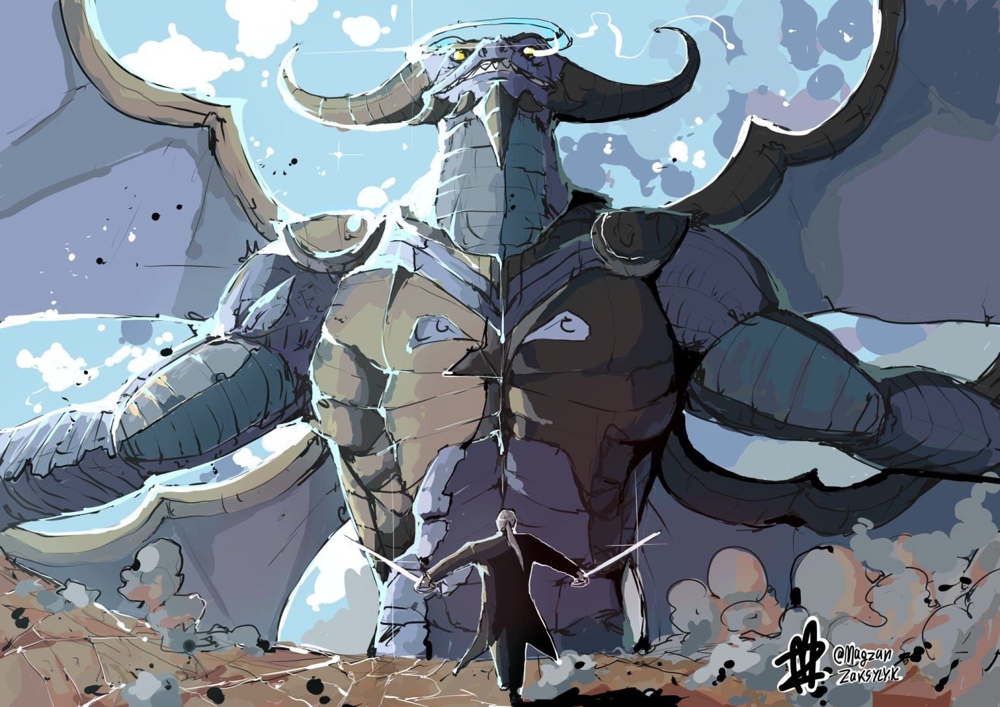
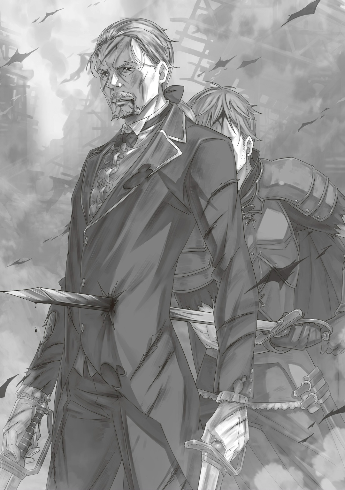
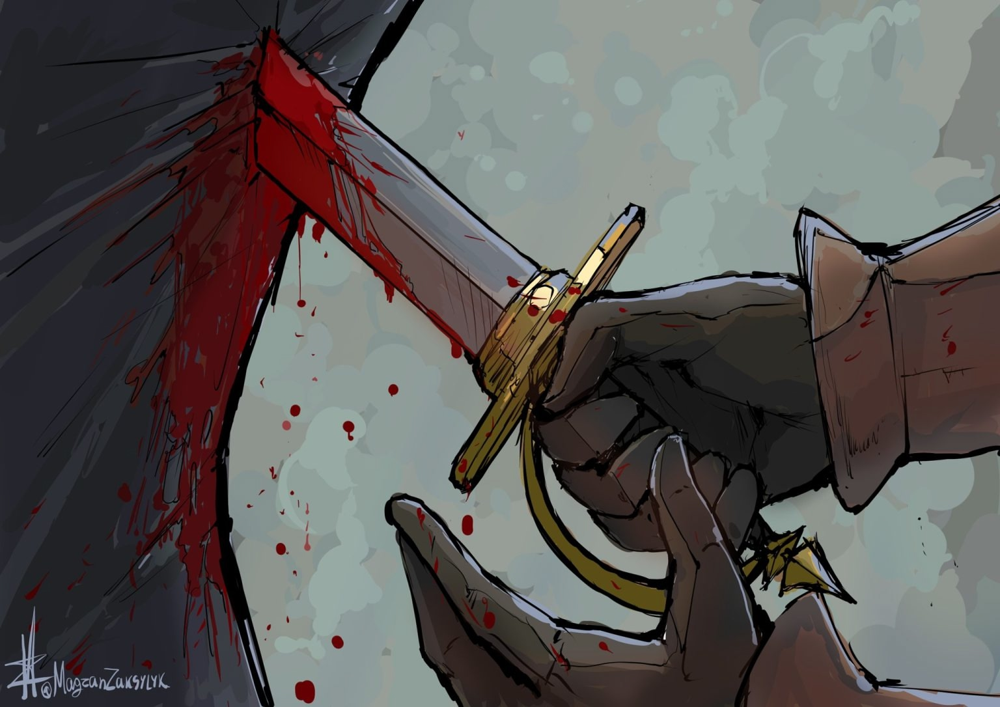

…Да начнётся строфа битвы, о которой будут слагать легенды.

— …

Наперехват взмаху «Демона Меча» «Божественный Дракон» поднял бурю когтями.

Как высшая форма жизни, Драконы господствовали над всеми. Сильнее них были только «Божественные Драконы», когти, клыки и чешую которых можно назвать сокровищем природы. От них раскалялся мир, раздувались небеса и завывал, словно от боли, ветер. Попасть под атаку «Божественного Дракона» — значит, потерять жизнь. Но «Демон Меча» нашёл выход.

Враг прилетел уберечь девушку, которая, надо быть, происходила из рода «Королей Львов». Её волосы метались из-за порывов ветра, она следила за сражением из комнаты.

«Дракон» боялся случайно задеть девушку. Вот почему «Демон Меча» встал прямо перед ней.

Оттого смертоносный натиск «Божественного Дракона» ослаб…

— …

Однако «Демон Меча» отказался от такой тактики и двинулся в атаку — прямо навстречу буре и гибели, с двумя мечами в руках, с угрозой умереть вмиг. Если бы пользовался чувствами врага, ему было бы намного легче. Но это слишком бестактно. Нет, не только бестактно, но и очень грубо, ненужно, бестолково. …«Демон Меча» заберёт победу не жалкими подлостями, а мастерством фехтования.

…Он жил на полях сражений. Битвы за выживание, их пересказы с уст победителей, ужасные убийства, которым нет оправдания… Через всё это прошёл «Демон Меча». Он пролил так много крови, что мог с легкостью в ней утонуть.

Сейчас всё было по-другому.

…Сейчас нет смысла побеждать подлостью. Мастерством фехтования «Демон Меча» заставит врага сдаться.

У него не было времени на обходные пути.

Чтобы его дряхлое, слабое тело вновь стало таким же, как в молодости, ему нужно выковать себя в пекле сражения.

— …

С острым, словно меч, порывом ветра «Дракону» обрезало когти. Слишком тесно. Чтобы размахивать хвостом, чтобы орудовать мечами, это поле боя слишком мало.

«Демон Меча» резко оттолкнулся от пола. Его мечи сверкнули — казалось, из мира пропал звук — и резанули грудь «Божественного Дракона».

Твёрдость их чешуи зависела от маны. Чем сильнее «Дракон», чем больше он прожил, тем прочнее и крепче она становилась. Именно потому чешуя «Божественного Дракона» по твёрдости не уступала алмазу.

Эту алмазную чешую «Демон Меча» пытался пробить колющими и режущими атаками. Его клинки от этого отнюдь не тупились — парные мечи «Триас» сделал тот же кузнец, что выковал знаменитый «Астрея».

Их рукояти удобно лежали в руках, лезвия не зубрились, а вес не мешал…

— …

«Божественный Дракон» не стал просто смотреть на яростный натиск «Демона Меча». И пусть в его голове сидел кто-то другой, сильное тело никуда не делось.

Пожалуй, он был сильнейшей «Драконьей» оболочкой, которая могла без труда вызывать стихийные бедствия.

Од Лагуна наделила «Божественных Драконов» влиять на мир силой. Их рёв разносил небеса, а когти рвали землю. Чешуя легко выдерживала удары «Демона Меча», а грозное присутствие разносилось по всей столице Королевства.

«Божественный Дракон» взмахнул хвостом. …«Демон Меча» вонзил в него клинок. Затем взбежал по хвосту прямо к горлу и сверкнул мечом; «Божественный Дракон» защитился чешуёй на плече и отклонился, чтобы ответить на удар.

И так всё началось по-новой.

— …

«Дракон» распахнул крылья, которые вызвали порывистую бурю. Острый ветер искромсал столицу. «Демон Меча» прорвался сквозь этот вихрь. Хвост сразу последовал за его кровавым следом. Тело мечника отбросило назад — раздался сильный грохот. Это было прямое попадание… нет, «Демон Меча» понял, что уклониться не выйдет, поэтому расслабил пальцы, лодыжки, колени, бедра, поясницу, плечи, шею и голову, чтобы развеять смертельный удар по телу.

Его со всей силы отбросило назад. Он пробил одно, два, три здания, а затем вонзил меч в землю и посмотрел вверх.

«Демон Меча» не собирался сдаваться.

В следующий миг рот «Божественного Дракона» загорелся белым. Мощное дыхание понеслось на мечника.

— …

«Демон Меча» прорубил в нём маленькую щель, чтобы спастись, а затем прыгнул ввысь. «Дракон», разинув пасть, взмахнул крыльями и полетел вниз. Он поймал врага большими клыками, которые по прочности и остроте были лучше когтей на лапах.

«Демон Меча» точно скрестил лезвия с клыками, чтобы не дать «Драконьей» пасти закрыться. Будь он в самой пасти, его бы уже давно раздавило. «Демона Меча» спасло от «смерти» шестое чувство… нет, желание победить.

«Дракон» передумал разрывать его клыками: сильным щелчком языка он создал громкий хлопок и порыв ветра.

— …

Кровь хлынула из ушей «Демона Меча». Его барабанные перепонки лопнули, а полукружные каналы задрожали. Он стиснул зубы и еле устоял на ногах. После его ударил «Драконий» язык: «Демон Меча» с силой вылетел из пасти в небо над столицей. Высоко. Видимо, пока держал врага в пасти, «Дракон» летел ввысь. «Демона Меча» закрутило в воздухе, он стремительно падал на землю. Если ничего не придумает, то разобьётся насмерть. Любой человек с боязнью высоты уже бы давно упал в обморок. Так шла битва жителя небес и жителя земли…

— …

«Божественный Дракон» на этом не остановился. Он вдохнул во всю грудь, чтобы выпустить мощнейший огонь. Это дыхание сожжёт часть столицы и её жителей… нет, все живые души уже покинули благородный округ. Кто-то знал, что здесь будет битва, поэтому заранее вывез жителей. «Дракон» был благодарен этому дальновидному тактику.

— …

Дыхание сильнее и жарче предыдущих понеслось на врага. У «Демона Меча» не нашлось крыльев, чтобы уклониться, и не нашлось способа противостоять силе тяжести. Он не мог даже прямо посмотреть на скорую атаку, так как его сильно раскручивало.

Оставалось только принять удар напрямую…

Внезапно «Демон Меча» нашёл, на что упереться.

— …

Высокая часовая башня, которую он до этого пробил своим телом. «Демон Меча» согнул колени и приземлился на неё. Затем он крепко сжал мечи в руках и посмотрел в небо. …Великий мечник и известный «Дракон» встретились глазами. За ними встретились и острые лезвия с адским пламенем.

— …

Будто разрывало воду, будто разбивалось хрупкое стекло — раздавались самые разные звуки. В мощном огне снова прорубили щель. Дыхание «Божественного Дракона» могло обнажить, уничтожить любую внутреннюю и внешнюю красоту, обратить её в пепел. Тем не менее, «Демон Меча» рассёк пламя взмахом.

…Его мечи, нечто истинно чистое, рубили огонь, истинно злую нечисть.

— …

Дыхание уничтожило весь благородный округ столицы. Не пострадали только часовая башня, на которую встал «Демон Меча», и багровый особняк, который защищал «Божественный Дракон». Остальное прямо вкусило силу его дыхания.

Белая сажа летала повсюду. Она покрыла «Демона Меча», когда он спрыгнул с падающей башни. «Божественный Дракон» по-прежнему парил в небесах.

Тут они снова встретились глазами.

— …

Мастерство фехтования, которое всё ещё оттачивалось, и огненная стихия, перед которой все встанут на колени, столкнулись вновь, а вместе с ними вновь содрогнулось всё живое в столице Лугуники.

△ ▼ △ ▼ △ ▼ △

— «Вот скажи, тебе нравятся цветы?»

Всё вокруг покрыла белая дымка, среди неё слышался голос.

Голос очаровательной девушки, которая стояла спиной к жёлтой поляне.

Пока мир трепетал от «Божественного Дракона», пока защищался и размахивал мечами, Вильгельм вспоминал.

— «Ты полюбил цветы?»

Она была прекрасна.

Он влюбился в неё с первого взгляда, но решил отбросить эти незнакомые чувства.

На этой поляне они встречались ещё не раз.

Вильгельму было хорошо с ней, но он боялся действовать дальше.

Оттого ему было плохо, оттого его душа привыкла медлить и трусить.

Оттого Вильгельм не замечал, как уходит время.

— «Поднимать меч ради других. Мне кажется, это правильно.»

На родной город Вильгельма напали и подожгли.

Тогда его спас её взмах.

Девушка, которая никогда не хотела брать меч в руки, но мир заставил её полюбить фехтование.

Вильгельм разозлился, когда понял, что дал ей повод поднять меч.

Его душа отказывалась это принимать.

Принимать свою слабость, ничтожность, её тайну…

В сердце Вильгельма загорелась ярость.

Пробираясь сквозь неё, преодолевая, отдавая все свои дни мечу, он получил право.

Право встать перед прекрасной девушкой.

Право скрестить с ней мечи.

Тогда он победил её, спас от жестокого Бога Меча, сделал своей.

— «Ты меня… любишь?»

…Или это она сделала его своим? Вильгельм не знал.

Зато точно знал, что ему повезло, что с ней он был счастлив.

С того мгновения, как встретил Терезию, и до того самого, как потерял, Вильгельм был счастлив.

…«Смерть» Терезии всё переломила.

В её последние секунды Вильгельма не было рядом.

Он никак с ней не попрощался, не успел сказать те заветные слова.

Оттого Вильгельм горько плакал.

Тогда он про многое забыл, совершал ошибки.

Вильгельм сильно дорожил тем временем.

Ему не верилось, что всего за один день оно подошло к концу, разрушилось, померкло, словно его никогда и не было.

Их совместные времена пролетели.

Оттого свет в глазах Вильгельма потух.

Но неужели в них больше не вспыхнут новые краски?

Конечно, вспыхнут.

Вильгельм хотел мести.

Поднимая меч ради Терезии, он возвращал краски в свои дни.

Сильный ветер, дикий рёв «Божественного Дракона». Вильгельм рассекал его буйство, пока в глубине души чувствовал, как кровоточат раны — угрызения совести, которые ему ещё предстоит рассечь.

…Сумрачное небо, надгробие для пустой могилы, неутихающее горе и отчаянные молитвы о покое. Стоя среди толпы рыдающих, Вильгельм не помнил, какие слова подобрал, что сказал на прощание с Терезией. Он помнил лишь угрызения совести. Сильные, растущие, невыразимые угрызения совести.

Бедный, ничего не понимающий ребёнок, который не был с матерью и отцом, когда должен был. Именно от его утешений глупый Вильгельм отмахнулся. Он был не в силах их принять, поэтому посмотрел на тёмные тучи, на землю, на лица вокруг, на самого себя и, наконец, на ребёнка…

— «Дедушка, не плачь. Когда бабушка умерла, она не была «Святой Меча», так что «Святая Меча» не проиграла.»

— …Прошу, хватит.

— «Ведь «Святой Меча» нельзя проигрывать. Мне так говорил папа.»

— …Умоляю, хватит.

— «Так что не плачь, дедушка. С домом Астрея всё будет хорошо.»

— Не здесь, не сейчас… Прошу…

Раз за разом он бессильно отмахивался от его слов.

Раз за разом — от утешений, в которые ребёнок верил от всего сердца.

Но потом…

— «Я стал «Святым Меча». …Прямо перед смертью бабушки, я стал «Святым Меча».»

— …Говорил же! Хватит! Что ты от меня хочешь? Не вынуждай говорить, что Терезия… что твоя бабушка умерла из-за тебя!

— «…»

— Не вынуждай… говорить… Кх.

Вокруг всё поблёкло, остался только он и ребёнок. Тут Вильгельм разрубил себя — глупого, недозрелого себя того злополучного дня — и шагнул вперёд.

Слова, о которых молчишь, вторая сторона сама не узнает. Будь у неё даже взаимопонимание, обо всём догадаться невозможно.

Между тем — вторая сторона уловит суть любых слов. И как она к ней отнесётся, зависит от неё же.

Переполнить стакан водой, а потом жаловаться, что он не уместил больше — глупый Вильгельм поступил именно так. Лицо ребёнка… лицо Райнхарда в тот день он не помнил. Тогда Вильгельму не хватило духу опустить глаза, поэтому он не знал и даже не мог предположить.

Его слова дошли не только до Райнхарда.

— «…Ты что, обвинил моего пацана прямо на похоронах мамы? И после такого хочешь его увидеть? Отец, ты, видимо, не понимаешь, что говорить можно, а что вообще нельзя. Ты правда думаешь, что можешь просто попросить у него прощения?»

— «Мой с Луанной ребёнок… Он отнял у мамы Божественную Защиту?! И этим её убил?! Это какой-то бред! Всё… Всё не так!»

— «Я не ты, отец. Я — это я. …Ты не оставил мне выбора.»

Слова не забрать обратно. Обвинения Вильгельма мгновенно разошлись. Когда они дошли до Хейнкеля, который не пришёл на похороны матери, было уже слишком поздно извиняться.

Его глупый выговор дошёл даже то тех, кто не имел никакого отношения к семье Астрея.

Так распространилась правда о том, как Райнхард унаследовал «Божественную Защиту Святого Меча».

Хейнкель наотрез запрещал Вильгельму видеться с внуком.

Райнхард же послушался отца и прекратил общаться со своим дедушкой.

Поэтому Вильгельм отдалился от них и, один, посвятил себя мести.

Только в Городе Водных Врат они снова сблизились, ведь против них встал труп Терезии, но затем рассорились, уже окончательно. …Всё закончилось очередной трагедией.

Но Вильгельм не хотел, чтобы «смерть», «жизнь», «судьба» Терезии разрушила их семью. Он хотел остановить эту трагедию, исправить её.

Против судьбы у Вильгельма было всегда только одно оружие — меч.

…Райнхард — «Святой Меча».

Он не сможет поговорить по душам с Вильгельмом, пока несёт этот нерушимый долг. Райнхард будет прятаться за маской «Святого Меча». Потому не получится перекрасить то блёклое воспоминание. Отныне у Вильгельма ван Астрея… у Вильгельма Триаса не осталось другого выбора — он отдаст всего себя в меч.

Отдаст, чтобы ещё раз выбить клинок из рук «Святого Меча».

△ ▼ △ ▼ △ ▼ △

…Ещё раз: да начнётся строфа битвы, о которой будут слагать легенды.

«Демон Меча» встал против «Божественного Дракона». Закалённая сталь боролась с высшей формой жизни. Благородный округ столицы сравняло с землёй: улицы разворотило, а здания порушились. Такова была великая сила, которой никогда не достигнет обычный человек.

И пусть один был маленьким и атаковал слабо с земли, а другой был большим и атаковал мощно с небес — оба бились на равных. В нынешнее время бои между человеком и «Драконом» случались настолько редко, что свезёт стать её свидетелем хотя бы раз за сто месяцев, а может и лет.

Поразительно, что это была вторая битва «Демона Меча» с «Драконом».

Всё это — карма, ведь он всегда ступал на самые опасные поля сражений, а ещё нечто судьбоносное, раз за разом подбрасывающее ему достойных противников. Обстановка битвы была не на стороне «Демона Меча»: лезвия не пробивали чешую «Божественного Дракона», зато когти и клыки врага с легкостью могли разорвать его. Оставалось только уклоняться, да пытаться победить мастерством, но скоро он дойдёт до своего предела. …С точки зрения логики — да, но совсем не верилось, что «Демон Меча», весь в крови и саже, с обожжённой спиной и бесполезными клинками, тратил последние силы, лишь бы не попасть под когти «Дракона». Его грозный вид, фехтование, которое, казалось, могло вмиг порезать на кусочки любого, и мастерство, не уступающее временам, когда он одолел «Святую Меча».

Всё это вселяло надежду, что он победит.

…«Святая Меча» была надеждой Королевства Лугуника.

Когда эту надежду победил «Демон Меча», казалось, люди должны были отчаяться и упасть духом. Но всё обернулось иначе. Никто не расстроился; наоборот, люди праздновали. Для них родилась новая надежда — «Демон Меча», который стремился к силе и только к силе.

«Демон Меча», который оттачивал себя так же, как и сталь в своих руках.

Прямолинейный, непоколебимый «Демон Меча» вселял надежду на светлое будущее, заставлял их поднимать голову.

Поэтому все верили, что он победит «Божественного Дракона». …Люди видели, по какой тернистой дороге идёт «Демон Меча». Он всегда рубил путь вперёд ради желаемого. Никто не сомневался — он добьётся своего.

Битва между «Демоном Меча» и «Божественным Драконом» зашла в тупик. Никто не наносил переломного удара. Они просто пытались превзойти друг друга в поединке на жизнь.

…Стало ясно — «Демону Меча» и «Божественному Дракону» самим не решить исход боя.

— … — «…»

В сердце разрушенного благородного округа они молча пересеклись взглядами.

Оба молчали по разным причинам: первый от того, что смирился, а второй от изумления.

Ведь внезапно…

— Гха.

Изо рта «Демона Меча» вырвались стон и кровь. Он сразу посмотрел на своё тело… Сзади кто-то проткнул его живот остриём. Кровь полилась ручьём.

«Демон Меча» сразу узнал это лезвие. …Это был его некогда любимый меч, на котором красовалась надпись «Астрея».

Сейчас им владел…

— Хейнкель…

Говорить мешала кровь, так что сказал он это невнятно. Лезвие в теле дрожало. «Демон Меча» сразу понял, что происходит. Повернись он сейчас назад — его тело разрезало бы надвое. Вот почему «Демон Меча» стиснул зубы и просто стоял.

И тут, за его спиной, дрожа мечом «Астрея»…

— …Ты помешаешь мне вернуть Луанну.

— …

— Я не ты… Я не ты, отец. Я — это я. …Ты не оставил мне выбора.

Надломленный, измученный голос, к которому примешивались всхлипы, будто разрывалось его сердце.

«Демон Меча» тяжело вздохнул и вспомнил.

Вспомнил, как жена строго отчитывала его за то, что он тренировками доводит сына до слёз.

Вспомнил, как сын, сквозь боль, просил продолжить тренировать.

Подумать только, ещё тогда его слёзы всё решали.

…Это был переломный удар в спину.

Так закончилась битва между человеком и «Драконом».

Строфа из легенды подошла к концу.
