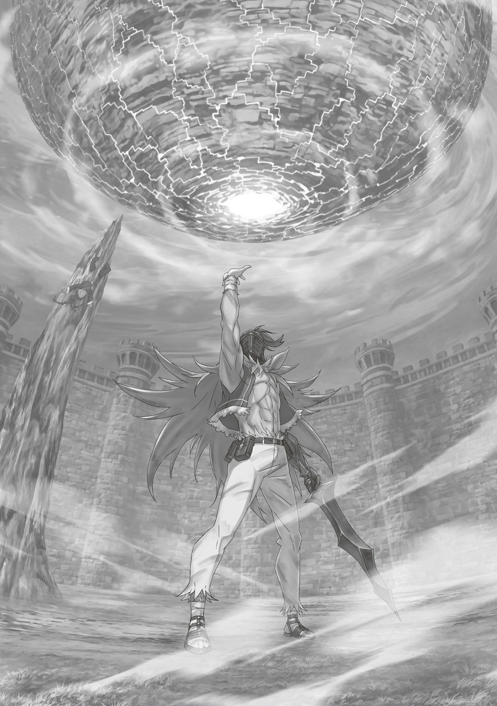
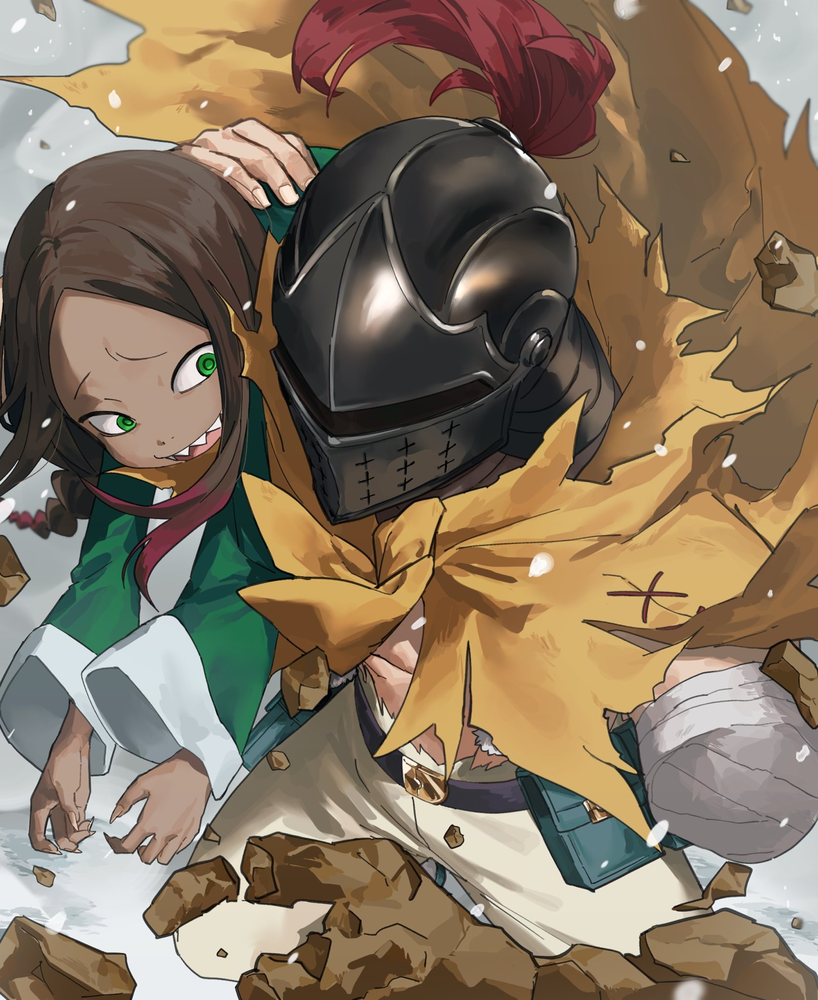

— …Когда смотришь на меня, смотри нормально!

Когда его с силой ударили, в мозгу Альдебарана взвыла сирена. Причиной тому был сам удар и несколько других причин: во-первых, удар был ужасно силен, отчего потрепали его знатно; во-вторых, он был удивлен длинною ног противницы, что этот удар и нанесла, — «Да у нее что, вот это все — нога?!»; в-третьих, нельзя было забывать про главное: кончики ее ледяных сапог раздробили его каменный нагрудник, а уже под ним начал покрываться льдом бок его груди. …Но все же главной причиной было, пожалуй, бьющее точно в цель замечание: «Ты всегда какой-то оторванный, когда со мной говоришь».

— …Кх!

Честно говоря, он был удивлен, что она догадалась до этого. Не то чтобы он возомнил, мол, умеет хорошо скрывать свои чувства, но он был почему-то уверен, что такие тонкости — не ее конек. Правда, если задуматься, то она просто не любила грубить кому-то, однако, когда грубили уже ей, она пропустить это мимо ушей не могла. …Это было вполне нормально, учитывая, что она родилась сребровласой полуэльфийкой.

— Дорого же этот урок мне обошелся…!

К боку, что сейчас покрывался льдом, прицепился ледяной солдат, созданный по образу и подобию столь ненавистного врага. Альдебаран схватил искусственной левой рукой его голову и безжалостно оторвал ее. Послышался крик девушки «А-ах!», после чего тело, уже без головы, с треском обратилось в ледяную пыль.

Похожи даже тем, что легко помирают…

— На, держи!

— Кх! Боже, как жестоко!

Оторванная голова все еще пыталась его укусить, потому он швырнул ее обратно создательнице, которая как раз собиралась продолжать атаковать. Она поймала голову, словно мяч в вышибалах. Альдебаран взглянул на свой живот. Если лед так и продолжит распространяться, то скоро он совсем в ледышку превратится…

— Ну тогда тебе каюк, дядь-. Понимаешь, что надо делать-?

Это намекал Лой Альфард — зритель, наблюдавший за сражением, будучи прикованным к столбу вверх ногами, на способ справиться со льдом. Советы Архиепископа Греха не были ему нужны. И без его подсказок Альдебаран, сжав зубы, полоснул мечом по замерзающему животу. Адски больно, кровь течет… он закрыл рану, что едва не стала сэппуку, каменной «крышкой» — избежал превращения в сосульку.

От боли перед глазами стало все красно, а в ушах отдавался искренне радостный смех Лоя: «Ахаха-! Вот-вот-! Именно так-!».

— …Терпеть такие мучения…

— Эй, эй, ты мне выбора не оставила. Не хочешь видеть боль — сама превращайся в сосульку. Пойми, что твои атаки именно таковы.

— …Согласна с тобой, но и ты не заблуждайся.

— Я заблуждаюсь?

— Ты не сможешь вытерпеть такую же боль по всему телу.

Этими словами она как бы предупреждала, что покроет все его тело те ми же ударами, что пришлись на бок. Лицо девушки резко стало мягче, и вокруг Тюремной Башни, где задул ледяной ветер, началась клубиться белая дымка. Снежинки закружили вокруг поля боя. Альдебаран почувствовал всю серьезность девушки.

— Сказал бы, что даже сердитое личико у тебя милое, да вот боюсь. И еще…

Прямо перед его глазами с треском начало отрастать тело у головы ледяного солдата, которую Эмилия держала в руках. Не «новое лицо 20 », а «новое тело»! Он восстановился за считанные секунды и несколько раз поприседал, чтобы показать: к бою он готов.

Эта, казалось бы, бессмысленная провокация, дотошно повторяющая оригинал, на удивление сильно раздражала.

— …До тошноты похож, до самых мелких деталей.

— Рам так же сказала. Да и все в особняке сказали, что он сильно похож.

— Вот как. Но сам-то он, небось, скривился.

— Почему ты так думаешь?

— Еще бы. Эту рожу он ведь больше всего ненавидит.

Эмилия пошире распахнула свои глаза, а их уголки сердито дернулись. Может, она подумала, что он издевается, но он правда так думал.

Во-первых, если изо льда кого-то и создавать, то почему бы не взять за образец кого-то более надежного и на вид сильного — Гарфиэля, например, а не этого Нацуки Субару. Правда благодаря этому никакие угрызения совести за оторванную голову его не мучили.

— Можно было кого-то понадежнее выбрать.

— …? Я ведь потому и взяла Субару за образец.

— …Ясно. Зря спросил.

Альдебаран высунул язык под шлемом, почувствовав, будто прожевал целую пачку горьких пилюль. Удары были мучительны, но еще больнее ему было от разговора с Эмилией лицом к лицу. Для его Полномочия, его «территории», было очень важно душевное спокойствие. А Эмилия была той самой, из-за кого оно могло расшататься.

— Хренотень.

Честно говоря, эта встреча была просчетом.

После возвращения из Волакии Альдебаран подстроил состав их группы так, как было удобно ему. Он знал, что Эмилия с остальными отправятся в столицу Королевства, но планировалось, что он лишь втихаря стащит Лоя, однако жук Зодда испоганил все его планы.

— …Невезуха пошла еще с Фельт.

Чтобы встретить Райнхарда в крайне неудобном для него месте — Песчаных Дюнах Аугрии, — Альдебаран специально позволил Флам передать сообщение о предателе с помощью Божественной Защиты сестре. По итогу Райнхард оказался в Дюнах, что привело к засаде, однако Фельт, разумеется, все сведения при себе оставлять не собиралась.

Даже когда ее товарищей в башне Плеяд ранили и когда выяснилось, что «Божественный Дракон» переметнулся на сторону врага, она смогла взглянуть на ситуацию с холодной головой и поступить правильно. Сначала он посчитал, что это ей внушил Валга Кромвель, но эта догадка не подтвердилась. Сама Присцилла признала Фельт врагом. Ее задатки правителя не стоило недооценивать.

Как бы то ни было, в этой кошмарной ситуации она поступила правильно, а Эмилия, получившая сведения, впустую их не потратила.

Результатом сего стал наихудший сценарий: побег из Тюремной Башни оказался сорван, и сейчас он дерется с Эмилией.

— …

Эмилия прямо перед ним надела ледяные перчатки и встала рядом с назойливым ледяным солдатом, ставшим в позу «Gear 2». Противница взглянула на него с опаской; по ее аметистовым глазам стало ясно: что бы Альдебаран ни сделал, проигрывать она не собирается. Хотя и так сделать ничего не могу…

Подражая ее «Искусству Ледяного Призыва», он противостоял ей «Искусством Земляного Призыва», однако разница между ними была как небо и земля. О прочности и вовсе речи идти не могло, а уж о земляном солдате и подавно. К тому же ему, банально, не позволяла совесть вредить Эмилии, не то чтобы вообще ранить. …Это, пожалуй, был главный его недостаток.

Раз уж на то пошла речь, то техники Эмилии были очень неудобны Полномочию Альдебарана: все из-за того, что они были нацелены на захват живьем. Потому, после устранения Нацуки Субару и Райнхарда — двух его главных преград, — Эмилия стала для Альдебарана заклятым врагом… худшим «врагом», если не брать в счет еще одного.

— Несмотря ни на что…

Под каким бы он углом ни смотрел на ситуацию, казалось, что надежды совсем нет, отчего хотелось рыдать. Ни разу еще не бывало, чтобы тупик сам собой пропадал от одних его стенаний.

Если он сам не может нанести последний удар тому, кто контрит его, то придется надеяться только на чужое вмешательство. И вот, когда он уже собирался разыгрывать свой козырь…

…он увидел, как в благородном округе столицы летал «Дракон».

— Серьезно?

Пробормотал он, заметив это просекание зрения.

Этой вертикальной линией бледно-голубого света за светлой дымкой в небе был «Альдебаран» — козырь, который он только-только собирался разыграть. Раз «Дракон» летел с такой скоростью туда, где сейчас были Яэ и остальные, значит, девяносто девять процентов для того, чтобы спасти их.

А еще это значило, что в особняк Бариэль послали того, с кем не смогла справиться Яэ; она могла быть жива с шансами пятьдесят на пятьдесят.

На помощь «Альдебарана» надеяться не стоит.

— Серьезно…?

Слово повторилось, однако теперь он понимал, насколько ситуация оказалась хуже: он может все переиграть с помощью Полномочия, призвать «Альдебарана», но тогда Яэ умрет, ведь ей никто не поможет.

Но ни Яэ, ни Фельт незаменимы для его плана не были.

Не были, но…

— ЧЁРТ!

Альдебаран выругался, не воспользовавшись шансом проглотить яд.

Планом A было заставить «Альдебарана» своим присутствием развеять холод Эмилии и сбежать. Раз этот план так и остался планом, оставалось только реализовать план Б.

А чтобы план Б реализовать, этот же план Б нужно было срочно придумать.

В этот же момент…

— Тоже видишь, что там? Если так продолжится, мой сообщник в столице целый дебош устроит…

— Мне сказали не волноваться: с этим разберется другой!

Эмилия неустрашимо атаковала Альдебарана, пытавшегося выиграть время на раздумья.

Даже ощущая за стеной приближение «Альдебарана»… «Божественного Дракона», она все равно верила в своих союзников и не обращала на это внимание, сохраняя самообладание. Это, конечно, наглядно показывало, насколько сильно она доверяла составителю плана, но не было тем, что можно сделать просто потому, что тебя попросили.

И то, что этот ход для Альдебарана был худшим, делало положение просто невыносимым.

— Та! На! Хия! Ха!

Словно вспомнив о первоначальном плане, Эмилия решила не вести диалог, а забрасывать его шквалом атак, не давая передохнуть.

Множество ударов ледяных перчаток посыпалось на него, разбив вдребезги наспех созданный щит. Средь всех разлетающихся осколков он поймал наконечник ледяного копья левой каменной рукой и отбросил его, когда тот начал мерзнуть, отпрыгнув назад. …И тут же в него сбоку влетел ледяной солдат.

— Гха…!

Альдебаран отлетел вперед от удара. Там его уже ждала Эмилия, уже превратившая ледяное копье в ледяной молот, и замахнулась со всей силы. Ее тоненькие гибкие руки напряглись в ударе невероятной мощи.

Воздух буквально оказался убит этим ледяным ударом. В тот момент, когда Альдебаран подумал: «Всё, уже не увернуться», он создал земляную броню, плотно покрывшую тело, и принял на себя удар.

— …Кх!!!

Не в силах даже крикнуть, Альдебаран взлетел в небо.

Броня спасла ото льда, однако как защита она была, как платок между ним и оружием. В глазах все закружилось; летя, он даже не мог понять, где находится. По итогу его остановил жесткий удар, из-за которого он упал на землю.

— Ух~, больно, наверное-. Видимо, у тебя нет выбора, дядь-.

Сверху раздался радостный голос, когда он коснулся заснеженной земли и понял, что врезался в земляной столб, к которому был прикреплен Лой. Его отбросило метров на десять, а кости все болели так, словно их переломали. Не было сил даже огрызнуться.

— Херово…

Он не хотел терять еще больше времени.

Тактика Эмилии, заключавшаяся в понижении температуры вокруг, была чудовищна: чем дольше длился бой, тем больше дебаффов накапливалось, словно снежный ком. Да и пока он мешкал, к ней могло подоспеть подкрепление. Во время боя с Фельт он уже понял, что, чем больше противников, тем сложнее их одолеть. И не было никаких гарантий, что среди них не будет «естественного врага».

— Из-за снега не видно, но, походу, в городе тоже что-то происходит, а-? Может, попробуешь крикнуть погромче, на помощь позвать-? Дядь-.

— Зава… лись. Просто молчи и виси…

Перевернутый Лой любезно бередил нервы Альдебарану, который и так был на грани. Он разозлился. Сильно разозлился. Да так, что ему хотелось умереть лишний разок, чтобы зарядить по этой ухмыляющейся морде. И за пеленой этой злобы он разглядел очертания плана Б.

— Если он — это я…

Он почувствовал, как далеко-далеко в белой дымке что-то дрогнуло, и понял, что сейчас «Альдебаран» ведет бой не на жизнь, а на смерть. Людей, способных сражаться на смерть с «Драконом», насколько знал он сам, было мало. Ему оставалось верить в победу «Альдебарана». И верить не только в это, но и в то, что «Альдебаран», поняв, что не может помочь Альдебарану, уже что-либо предпринял для плана Б.

И чтобы этот неизвестный план Б реализовать…

— Лой! Хочешь жить — живо сюда!

— …Кх! Ал!!

Крикнула Эмилия, распахнув глаза.

В этом крике он расслышал недоверие. Забавно, что, несмотря на то что он уже вытащил Лоя из Тюремной Башни, его репутации было еще куда падать. Ведь до этого он считал, что она оказалась ниже плинтуса еще тогда, когда заключил Нацуки Субару в ловушку.

— Если будет нужно, придется воспользоваться силой Архиепископа Греха. В Империи ведь Субару, вроде, тоже так делал? Что в этом плохого?

— Ты же понимаешь, что дело не в этом!

— Да, понимаю, и всё равно так говорю. Можешь меня ненавидеть.

Он привык, что Эмилия его ненавидит. …Ложь.

На самом деле, раньше она его не то что ненавидела, она просто не замечала его.

— Ты… кх!

Одновременно и опечаленная, и разгневанная Эмилия создала в воздухе ледяные копья. Она умела сражаться не только в рукопашную вместе со льдом, но и как полноценный маг. Эмилия бомбардировала парящими ледяными кольями Альдебарана и Лоя. В этих атаках читалось явно: она хочет завершить бой здесь и сейчас. Однако и эту атаку Альдебаран отразил, оторвав от земли слой почвы и подняв его, словно перевернув татами.

— Даже если ты и говоришь о союзе-…

Земля дрожала от пронзающих ударов. Наспех созданное земляное убежище долго бы не продержалось. Лою, который, казалось, был в той же ситуации, было совершенно по барабану на происходящее. Он недовольно скривил губы, глядя на Альдебарана, который сейчас старался удерживать укрытие, и сказал:

— Как видишь, руки и ноги сломаны, и есть нам нельзя-. И что нам делать-? Может… разрешишь съесть сестренку-?

— Нет. И есть не дам, и буянить.

— Тогда что мы вообще можем-…?

— Есть одно дельце. …Сблюй.

Альдебаран произнес это низким голосом, встретившись взглядом с Лоем, висевшим верх тормашками за спиной на столбе. В ответ Лой распахнул глаза и хищно ухмыльнулся.

— Дядь, а откуда ты про нас так много знаешь-? Неужто ты наш папенька-?

— Я бы покончил собой, будь у меня такие дети.

Они были связаны печатью, что заставляла Лоя подчиняться. Отношение Алдебарана, который и не думал строить дружеские отношения, Лой встретил облизыванием губ, как бы приветствуя его.

Лой Альфард снискал славу как «Причудливое Поедание». И как же этот Архиепископ Греха «Чревоугодия», который был готов запихнуть в рот что угодно, оценил Альдебарана? Впрочем, не было времени задавать вопросы, ответы на которые и так понятно, что будут скверные.

— …Хватит!

В этот момент земляное укрытие пробил ледяной бумеранг — точь-в-точь бумеранг Мэделин Эшарт из Империи. Через пробитую брешь внутрь ворвалась Эмилия. Альдебаран тут же преградил девушке путь увеличенной земляной левой рукой. Его ладонь была прикрыта сверху, словно бейсбольная перчатка, преграждая ей путь мягко, но надежно.

Однако…

— …Кх! Обманка!

Опершись рукой о каменную перчатку, ледяной солдат перепрыгнул через преграду сальтом вперед. Эмилия использовала себя как приманку. Хотелось бы сказать, что обычно в таких ситуациях роль приманки играют болванчики, однако это была ловушка. Ледяной солдат перепрыгнул через голову Альдебарана и приблизился к земляному столбу. Альдебаран создал каменные осколки, которыми попытался остановить его с двух сторон и раздробить на куски, но…

— Тверже прежнего!

Видимо, лед — не кости — теперь были плотнее, отчего ледяной солдат осколки и отбил. Затем, не обращая внимания ни на что, он потянулся к Лою и… тут голова и тело солдата разлетелись в разные стороны.

— Чего?!

Только что разрубившая каменную перчатку ледяным мечом Эмилия прокричала это, увидев всю эту сцену из пролома.

Она, видимо, не поняла, что именно послужило причиной этой картины. …То была стальная нить, протянувшаяся от самого кольца на безымянном пальце Альдебарана: она пробила защиту ледяного солдата и обезглавила его. Таково было искусство стальных нитей, которым он овладел во время битвы с Фельт, используя лишь один палец.

Где умение, там и победа. Сразу после того, как он показал это на деле…

— …Будь выбор, думаю, этот был бы самым забавным-.

Раздался голос, полный мрачного ликования, и Альдебаран… нет, весь мир взвыл от ужаса.

△ ▼ △ ▼ △ ▼ △

Вдруг Альдебаран почувствовал, как разрывается душа.

— Буэ-э-э.

Он мысленно представлял себе принцип и последствия.

Но всё оказалось гораздо хуже.

Ударило не в тело и даже не в разум, а в неосязаемые «Воспоминания».

— Буэ-э-э.

Есть такое явление — дежавю, это когда тебе кажется, что ты где-то уже подобное видел; прямо сейчас Альдебаран… нет, каждая «жертва» чувствовала нечто в десятки тысяч раз сильнее — «Исторжение».

Отчего…

— …Ах.

Хрипло вдохнула Эмилия, ледяное копьё выпало из её руки. Она готовилась его кинуть, но что-то случилось. Оружие растворилось в ману прежде, чем коснулось земли. Аметистовые глаза Эмилии дрогнули, она рухнула на колени. Альдебаран взглянул на неё, скрипнул зубами и отпрыгнул назад.

— Буэ-э-э.

Его тоже мутило, но не настолько. «Исторжение» влияло на всех по-разному. Что логично. Привязанность у каждого была своя. Чувства к этим «Воспоминаниям» у Эмилии и Альдебарана не сходились.

Мерзкий Лой попал в самую точку. Он выбрал «Воспоминания», которые потрясут Эмилию и не помешают Альдебарану…

— Буэ-э-э.

Сдерживая тошноту, мужчина в шлеме поднял руку вверх. Белая дымка ото льда, которая окутала всё вокруг, мешала увидеть небо столицы. Но он не сомневался — «Альдебаран» подготовил план Б. …Бой с Райнхардом их многому научил. Альдебаран и «Альдебаран», одна и та же личность, имели сходный магический подчерк. Тогда, для плана, он заимствовал ману у «Дракона». Однако сейчас они поменялись ролями. «Альдебаран» подготовил в небе план Б, а Альдебаран стал «переключателем».

На самом деле никакого плана Б изначально не было. Он возник внезапно. Поэтому ничего бы не получилось, не будь они одной личностью. Тут Альдебаран влил ману в план Б и привёл его в исполнение…

— …Буэ.

Вдруг вырвалось из его рта, чуть похожее на «Исторжение» Лоя. И затем все стали свидетелями…

— Нет… кх.

Эмилия почувствовала мощный поток маны, её губы задрожали. Она не встала на ноги, а просто посмотрела вверх. …В небе столицы Королевства парил камень размером около ста метров. Казалось, падала скала. Возможно, то же самое чувствовали люди, которые увидели Белого Кита своими глазами, — вид чего-то могущественного в небесах. Но Альдебаран точно не знал.

В любом случае, было очевидно, что дальше…

— Буэ-э-э.

Раздался звук, будто раскололось небо. Вся скала покрылась трещинами, а затем распалась на десять-двадцать валунов, которые быстро полетели вниз…

— НЕТ…!!!

Эмилия мигом поднялась на дрожащие ноги. Если ничего не сделать, эти тяжёлые камни разрушат город и заберут с собой уйму жизней. Такую беду могли остановить только сильные…

— Я всё ещё не собираюсь никого убивать, просто…

— …Кх, Ал!

— Я верю, что ты не дашь городу пострадать.

С надменной, однобокой просьбой Альдебаран побежал к Лою. Он не обратил никакого внимания на ярость Эмилии.

Ледяной солдат, от которого осталась только голова, от безысходности покатился к врагу. Альдебаран безжалостно раздавил его ногой и снял Архиепископа Греха со столба.

— А ты жесток, дядь-.

Он пропустил мимо ушей слова Лоя, взвалил его маленькое тело на плечо и побежал. Будто сражения с Эмилией и не было, Альдебаран мчался во всю прыть.

— Ал! Стоять! Кому говорю! …АЛ!

Душераздирающе кричала она. Все силы Эмилия направила на то, чтобы спасти людей. Побеги она за ним, всё было бы иначе. И Эмилия, и Альдебаран от этого только выиграли бы.

Но она решила помочь другим, а не себе, оттого упустила цель.

— Стой! Верни Субару! Верни Беатрис…!

С сильными чувствами в голосе Эмилия замораживала валуны. Альдебаран поднял землю на пути и перепрыгнул через стену Тюремной Башни. Так он бежал со снежного поля боя, а затем снова бежал, бежал и ещё раз бежал.

— Слышал-? А сестрёнка-то заплакала-.

Об этом можно было спокойно умолчать, но гнусный Архиепископ Греха намеренно проговорил это вслух. Сердце Альдебарана болело от её слёз, но он всё равно бежал и надеялся, что все сообщники будут на месте.

Ледяные башни останавливали поток валунов. Столицу всеми силами пытались сохранить. И рисковому преступнику, и храброму спасителю было плохо. Лишь…

— …Ах~, ну что за угощение, благодарим-!

Смакуя их радости и печали, Лой Альфард облизнул губы в ухмылке.

