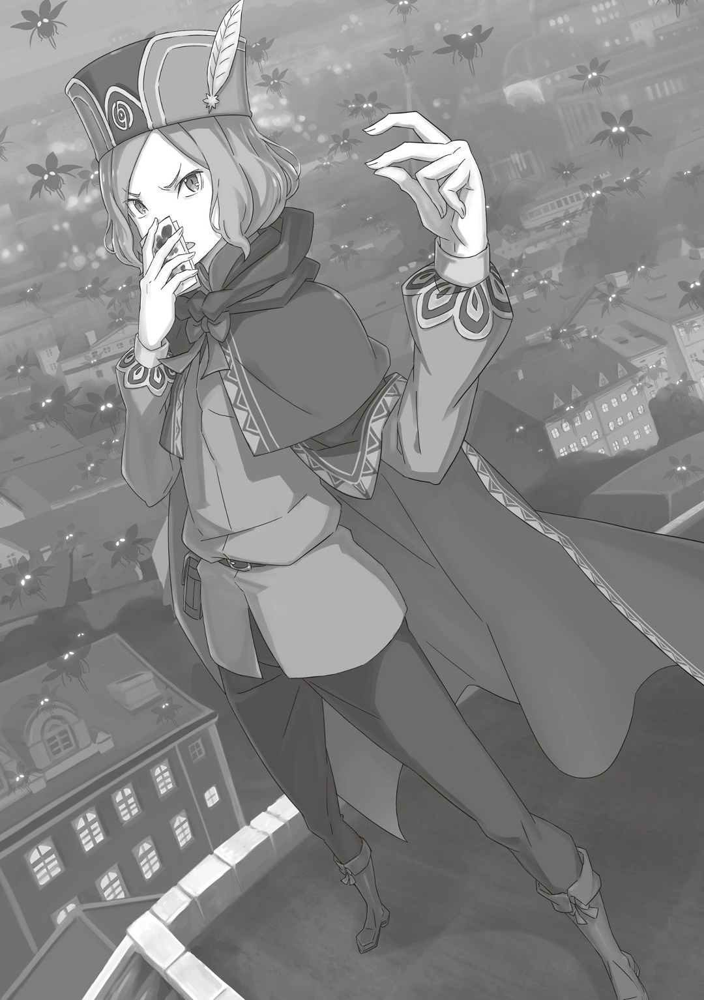

…С грохотом и вспышкой, от которых, казалось, раскололись небеса, появилась гигантская каменная глыба. Хотя вряд ли это можно назвать «каменной глыбой». Это был кусок скалы размером не меньше сотни метров. Такое уже не «глыба», а каменная гора.

И вот, по этой каменной горе побежали трещины. Стометровый «метеорит» разлетелся на куски. …Камни, размером от пяти до десяти метров, полетели на квартал столицы. Пострадать могли от тысячи до десяти тысяч человек. Подобную катастрофу, если мерить «киллрейтом», легко могли устроить Сесилус Сегмунт, «Синяя Молния», или Архиепископы Греха «Жадности» и «Лени»…

— В стародавние времена таких чудовищ тоже хватало.

В его усталом голосе сквозило раздражение с изумлением. Альдебаран стоял на городской стене. План Б… подлая тактика сбросить каменную гору. Его загнали в угол, поэтому пришлось быстро придумать её и тут же использовать. Альдебарану следовало бы бежать, пропуская мимо ушей слезливые крики врага, но он не смог. …Нужно проследить за всем до конца.

— Впечатляет.

Хрипло отрезал Альдебаран, щурясь чёрными глазами на катастрофу столицы. Рёв и свет каменной горы перекрыл, будто перезаписал, столь же оглушительный ответ мира: из земли поднялись роскошные ледяные башни. Вопреки холоду это были руки помощи столице, полные тёплого добросердечия и любви.

Ледяные башни, мерцающие голубовато-белым, казалось, выражали глубокую печаль сотворившего их мага.

— Хе-хе, поэтичненько, дядь-.

Насмешливо сказал Лой на плече Альдебарана. Хотя Архиепископу переломали руки и ноги, мышцами спины он ловко приподнял торс и из-за чужого плеча посмотрел на беду столицы.

Он говорил без умолку. Альдебаран уже был сыт по горло его болтовнёй.

— Это вообще-то ты разошёлся в описании моих терзаний, поэт херов. Я думал так делает только твой мёртвый брат-псевдогурман… впрочем, я вас плохо знаю.

— Ха-ха-! Ты что это, нашего мёртвого брата только что оскорбил-? Некультурно-некультурно-. Хотя Лей и правда любил оценивать свои угощения-. Странный он, да-? У нас ведь один «Желудок Душ» на всех-.

— Он бесстыдный вор, «пожиратель краденого». Да и ты тоже.

— Прошу не называть нас ворами-… Мы всего лишь едим чуточку больше, чем нужно-… Мы просто милые любители вкусно поесть-…

Казалось, Архиепископ заготовил ответ на всё. Благодаря Полномочию «Чревоугодия» Лой Альфард получил богатый словарный запас и силу убеждения. Вот почему он был одним из сильнейших не только среди Архиепископов Греха, но и среди всего мира. Его внешность ребёнка и особенности речи, неприкрыто выдающие гнилую душу, могли легко обмануть, но нельзя забывать: именно он, вместе со своим братом и сестрой, съел уйму чужих знаний и опыта. Оттого, чтобы заставить его подчиняться, Альдебаран выбрал путь насилия и проклятой печати.

— …Ладно, тут всё. Идём дальше.

— Убедился, что сестрёнка справится без тебя-? Дядь, а тебе часто говорят, что ты больной, ну или хотя бы странный-?

— За последние два-три дня ежечасно.

Альдебаран ответил коротко, чтобы не спорить с Лоем, который с ходу угадал, почему они долго стояли на стене. Мужчина в шлеме поторопился прочь. …В благородный округ, который сравняло с землёй.

△ ▼ △ ▼ △ ▼ △

…После Валги Кромвеля Альдебаран понял — достойный противник может дать отпор Полномочию, но всё равно считал — никому его не одолеть.

Альдебаран просто зарубил себе на носу: нельзя расслабляться и считать ворон. Поэтому сейчас он не выбирал лёгкий путь «перезапуска», а каждую новую «жизнь» проживал с умом и усердием, будто выдавливал остатки зубной пасты.

Здесь Альдебаран потратил шесть тысяч семьсот двадцать четыре попытки.

…Много это или мало — каждый решает сам. Альдебаран же любое число считал «подходящим», ведь каждая попытка влияла на следующие. Иногда он тратил одну «жизнь» впустую, просто чтобы дать голове отдохнуть, но даже этот «вздох души» был очень важен. И раз уж желаемое достигнуто, эти шесть тысяч семьсот двадцать четыре раза — «разумное» число.

— …Эй, тварь шлемоголовая.

Их место встречи… заброшенная каменоломня недалеко от столицы. Она хорошо подходила для сборищ негодяев. Здесь, прислонившись спиной к разбитой каменной стене, ждала Фельт. В её красных глазах и поведении читались ярость и презрение. Она скривила губы так, что показались острые клыки, и скрестила руки. Её обращение «шлемоголовый» сменилось на «тварь шлемоголовую». Фельт дёрнула подбородком в сторону столицы вдалеке и,

— Если б не сестрица Эмилия, знаешь, сколько людей раздавило бы насмерть? Ты ж вроде хотел бескровно двигаться, не? Какой-то внезапный напряг и всё, все обещания идут лесом? Какой же ты всё-таки говнюк, а.

— …Ага, тоже рад, что с вами всё хорошо, леди Фельт.

— Чё?

— Это джоук, неудачная колкость, плоский гэг.

Альдебаран отвечал холодно. Фельт уже приготовилась наброситься на него за неискренность, как вдруг с плеча мужчины в шлеме раздался голос:

— Фельт-чан-… Хотели бы мы сказать «не останавливайся, продолжай», но мы и без тебя уже довели дядьку до белого каления-. Лучше смени «приправу» для разнообразия.

— Для какого к чёрту «разнообразия»? …Так вот кто в тюрьме сидел. Ты старший брат? Или младший? Хотя по барабану, у вас у всех рожи тупые.

— О-о, так ты про нас знаешь-? Ах, ну да, ну конечно, Луи мне рассказывала-. Из-за тебя, Фельт-чан, отравился Лей-.

— Ты про того типа, который ко мне с именем прикопался? Так этому мудачью и надо, я считаю.

Язвительность Фельт, которая уже встречалась с «Чревоугодием» в Пристелле — Леем Батенкайтосом — казалось, достигла новой вершины.

И снова про его брата сказали плохое. Лой, как обычно, лишь весело рассмеялся:

— Ха-ха-! К слову, мы и сами не знаем, кто старший, а кто младший, поэтому всегда решали от настроения-.

— Ну и бред же. А вы семейка, я погляжу, «одарённая». Что ж, надо было вам определиться до того, как один подох.

— Ха-ха-ха-! И дядька, и Фельт-чан думают, что ненавистному Архиепископу Греха можно говорить вообще всё, да-? Вот как, значит, вот, значит, как-…

— Эй, тварь шлемоголовая, ты его взял, тебе же и расхлёбывать! Живо заткнул балабола и ответил на мои вопросы!

— В точку — он балабол. А с вопросами и ответами, к сожалению, придётся подождать. Сейчас нужно…

Альдебаран огляделся. Фельт цокнула языком и указала подбородком на полуразвалившуюся хибару в глубине каменоломни. Мужчина в шлеме посмотрел туда…

— …Ал-сама.

— …

Взгляды Альдебарана и Яэ, которая вышла из хибары, встретились. Пахло едой; горничная что-то готовила. Приятно, конечно, но…

— Судя по виду, тебе сильно досталось.

Альдебаран сразу заметил, что она отличается от своей обычной, неуловимо-беззаботной версии. Её сшитое на заказ платье горничной в стиле васу порвалось в нескольких местах, а розовые волосы, за которыми она ухаживала даже на поле боя, растрепались. Но главное — выражение её лица: серьёзное, лишённое обычной игривости.

И вот…

— …Обошлось.

Глядя на Альдебарана, прошептала Яэ и прижала руку к груди. Чувства в её голосе заставили его слегка смутиться. Не подав виду, Альдебаран пожал плечами и,

— Для полезной горничной на все руки выглядишь зашуганной. С каким же таким сюрпрайз-гостем ты любезничала, что даже мне помочь не смогла?

— …Любезничала? Ну и слова вы, конечно, подбираете, Ал-сама. Не забывайте: моё сердце целиком и полностью принадлежит вам.

На мгновение стерев с лица замешательство, Яэ ответила в своей обычной манере, а затем провела пальцами по груди и добавила:

— Но… Страстное времяпровождение с мужчиной действительно имело место. К нам пожаловал «Демон Меча» Вильгельм ван Астрея… точнее, Вильгельм Триас-сама.

— «Демон Меча», значит. Это, конечно…

Неожиданный гость, должно быть, ошеломил Яэ. Однако его трудно было назвать худшим из врагов. Он один из сильнейших в Королевстве, но для Яэ фехтовальщик куда более удобный противник, чем маг. К тому же пристройка поместья Бариэль была её стихией, утыканной ловушками — совершенным охотничьим угодьем «Багровой Сакуры».

Однако, раз уж «Альдебаран» поспешил ей на помощь, значит, мастерство «Демона Меча» превзошло Яэ. Судя по выражению лица, это было не просто поражение, а полный разгром. И во всём этом, возможно…

— Старик, который свернулся в калачик вон там, тоже в этом замешан, да?

Альдебаран указал на… Хейнкеля, который ссутулился у пня для колки дров и обхватил колени руками.

Красноволосый мужчина, понуро опустивший голову, даже не смыл кровь с тела.

Его это кровь или чужая — было не разобрать.

— Так и что случилось?

— …Я валялась без сознания, так что сама не видела, но…

— Но?

— Видимо, Хейнкель-сама победил «Демона Меча»-сама.

— …

Ответ Яэ, лишённый уверенности, заставил Альдебарана затаить дыхание и снова посмотреть на красноволосого мужчину. Разумеется, он знал об отношениях Хейнкеля и Вильгельма.

В итоге сын одолел отца. Странно, Хейнкель ведь был не лучшим фехтовальщиком…

— Вечно он меж двух огней: то сын, то отец.

Альдебаран не знал всех подробностей вражды в семье Астрея.

Он знал лишь, что «Божественная Защита Святого Меча» и титул «Святого Меча» породили непримиримый конфликт между тремя поколениями: отцом, сыном и внуком. А несчастный случай лишь усугубил всё это.

— …

Ни Альдебаран, ни остальные не имели права беспокоиться о душевном состоянии Хейнкеля, который за последние несколько дней стал врагом и Райнхарду, и Вильгельму. Они втянули его в это ради собственной выгоды. Спрашивать «Всё хорошо?» было бы просто лицемерием. Вот почему Альдебаран снова перевёл взгляд на Яэ и,

— А что с «Демоном Меча»? Судя по всему, крови он там потерял много…

— «…Я оказал ему первую помощь, но задерживаться долго не мог, так что помог по минимуму.»

— А?!

Альдебаран подпрыгнул от неожиданности и завертел головой. Но «Альдебарана», чей голос он услышал, нигде не было видно.

Большая «Драконья» оболочка… Он должен был сразу её заметить.

…так Альдебаран думал.

— «Виноват, виноват, сейчас отключу оптический камуфляж.»

Стоило ему это сказать, как в доселе пустом пространстве… возле Фельт появился огромный, устало привалившийся «Дракон». От того, как расплывчатый воздух постепенно обрёл цвет и форму, Альдебаран округлил глаза.

— Оптический камуфляж… Значит, ты преломил свет, чтобы стать невидимым? Такое вообще возможно?

— «Корректировать изображение в реал тайме невозможно. Но если стоять неподвижно, то, как видишь, даже мои габариты можно запрятать.»

— Понял. Невидимый «Дракон»… звучит очень круто и опасно.

Способность, преломляющая свет, возможна при сочетании Магии Света и Ветра, но поддерживать её постоянно — слишком затратно по мане. Да и для слияния с окружением требуется очень точное управление магией, так что возможность достичь нужного уровня совсем невелика. Даже для «Альдебарана» это было тяжело. Именно поэтому он и выжидал в небе столицы, прячась за облаками.

— Вот как ты теперь умеешь… похоже, битва выдалась жаркой.

— «Не менее жаркой, чем у тебя. Если бы не удар в спину, я мог бы и проиграть.»

— Бэкстэп, значит…

Альдебаран покачал головой и переварил два потрясения.

Первое — видимо, «Демон Меча» был ужасно силён.

Хоть «программное обеспечение» и отличалось, «аппаратные характеристики» достались «Альдебарану» от «Божественного Дракона». И при всём при этом — даже после Яэ «Демон Меча» мог победить.

А второе, конечно же, роль Хейнкеля в той битве…

— Победить честно было бы тяжело. Если всё закончилось ударом в спину, то старику, наверное, сильно по менталке ударило.

— Ага. Он со столицы с нами не разговаривает.

— Вот как…

Альдебаран протяжно выдохнул и оглядел собравшихся.

Подавленная поражением Яэ и «Альдебаран», которого впечатлил «Демон Меча». Хейнкель, свернувшийся в калачик после того, как подставил отца, и Фельт, не скрывающая своей враждебности.

И, конечно же, сам Альдебаран — злодей, уверенно идущий по пути труса, с болтливым Лоем на плече.

Паршивая команда, да ещё и изрядно потрёпанная.

— …Все живы.

Альдебаран расслабил плечи, тихо отменил «территорию» и переопределил матрицу. Точка рестарта поменялась. Теперь события в столице прочно закрепились в истории этого мира, а значит, и слёзы её аметистовых глаз.

— Неизбежно. Раз уж решил предать всех, действую без исключений.

Никаких уступок. Никаких душевных метаний. Стоит оступиться — и всё пойдёт прахом. Чтобы вся боль, испытанная телом и душой, обрела смысл, Альдебаран и его сообщники не могли позволить себе остановиться.

— Яэ, если еда готова, то неси. Есть хочу.

— Еду из поместья вынести не получилось, поэтому воровала из лавок по пути. Я записывала, из какой лавки что взяла, так что потом, пожалуйста, всё оплатите.

— Умно… Ладно. Можешь, пожалуйста, вот этого парня на моём плече…

— Связать и подвесить? Сделано.

Яэ двинула пальцами. Тут Альдебаран почувствовал, как с плеча пропала тяжесть. Лой повис на стальных нитях.

— Очередная грубость-. Ну, это всё равно лучше, чем висеть вверх ногами-.

— Пока побудешь так. Как решу, что с тобой делать, так и руки-ноги вылечу. К слову…

— Не забывать про печать, да-? Не забываю-. Ничего не замышляем, ничего не скажем против, будем сидеть смирно и присматриваться-.

— Присматриваться?

— Лей умер-. Заменять «Изысканное Поедание» мы не собираемся-. Лишь попросим внимательно следить за тем, какое угощение кладёшь нам на тарелку-.

Со связанными руками и ногами, в неудобной позе, Лой раскачивался на тончайших верёвках. Альдебаран пожал плечами и переглянулся с «Драконом». Обладатель той же «личности» кивнул огромной челюстью, обещая не спускать с него глаз.

— Кстати, план Б мне очень помог. Благодаря ему и сбежал.

— «О, я думал назвать его «сэконд план», а ты вот, значит, как его обозвал, Ориджин. Ну, главное, что идея та же.»

— Ориджин?

— «Называть тебя «другой я» как-то запутанно, думаю. Так что, как насчёт «Ориджина»? Это типа «первоисточник». А меня тогда называй «прямой потомок» или вроде того.»

— Ориджин, прямой потомок… Звучит как названия в меню семейного рамен-ресторана.

Альдебаран отмахнулся от его предложения словами: «Я подумаю», а затем повернулся к Фельт, враждебность которой до сих пор старался не замечать. В её глазах горела та же ярость…

— А ты с ходу догадалась, что глыбу остановила именно Эмилия.

— Чё? Издеваешься? Никто, кроме сестрицы Эмилии, не отпустил бы тебя взамен на сохранность столицы.

— Кто из нас тут ещё издевается… но да, ты права. Я сбросил камень с неба, потому что знал, что Эмилия переключится с меня на него.

— …Одними оплеухами ты у меня точно не отделаешься.

Фельт сразу поняла подлый трюк Альдебарана и, ещё сильнее скривив губы, пригрозила ему. Эта угроза, словно уличная грубость, была вершиной её ярости. Тут Альдебаран кое-что заметил.

Его преступные действия. Использование доброты Эмилии. Похищение «Чревоугодия».

Из-за всего этого Фельт имела полное право злиться.

Но, казалось, у неё были и другие причины для ярости…

— …То, что случилось с «Демоном Меча», это ведь не твоя вина, Фельт?

— А с чего это она должна быть моей! Она твоя… нет, вина вас всех, и папаши Райнхарда, и деда Райнхарда! Вы все бесите. А ещё больше меня бесит, какую рожу состроит этот гад, когда обо всём узнает.

— …

— Когда он стал моим Рыцарем, всё, что с ним связано, уже не может быть мне безразлично. Запомни кое-что, тварь шлемоголовая.

— …Что именно?

— Даже если ты думаешь, что всё это на твоей ответственности, твои поступки неизбежно будут связывать с принцессой. По сути, ты оскверняешь её труп.

Этот взгляд, эти слова ранили Альдебарана сильнее любого яда. Отношения Рыцаря и госпожи не исчезнут, даже если один из них погибнет. Если Альдебаран заработает дурную славу, это станет и дурной славой Присциллы. Ему напомнили об этом. Альдебаран почувствовал свежую горечь и боль.

Тем не менее…

— Принцессы больше нет с нами. Даже тела не осталось.

— …Чё! Я не о том…!

— А я о том. Такова жизнь.

Сухой ответ заставил Фельт замолчать. Посмертная слава или дурная слава — для покойных это не имеет никакого значения. Радоваться или печалиться из-за репутации мёртвых — это забота живых.

— Вот почему, пока дышишь, бери от жизни всё. Больше мне нечего добавить.

— …Шлемоголовый, да кто ты, чёрт возьми, такой?

— …Я Звезда-Последователь.

— Последователь…?

— Неудачная копия самой яркой звезды.

Тут Альдебаран отвернулся от Фельт и пошёл к поленнице, к Хейнкелю.

— …

Хейнкель даже не поднял голову, даже не взглянул на Альдебарана. Но беспокойное дыхание его выдало. Он точно заметил, что к нему кто-то подошёл. Хейнкель страдал душой. Альдебаран поразмыслил, что бы ему сказать, и наконец…

— Я сдержу обещание. Когда всё закончится, «Драконья Кровь» будет твоей.

— …Кх.

Сейчас Хейнкелю были нужны не утешения, не извинения, а обещание. Красноволосый мужчина судорожно вздохнул. А затем резко схватил Альдебарана за одежду и потянул к себе.

Мужчина в шлеме опустился на одно колено, холодное лезвие коснулось его шеи. Они встретились взглядами. Хейнкель, чьё лицо тоже было забрызгано кровью, прошипел, сверкая налитыми кровью голубыми глазами:

— Несмотря ни на что…!

— …

— Несмотря ни на что, сдержи обещание! Мне очень нужна «Драконья Кровь»… И не забудь убрать «Ведьму Зависти»…!

— Само собой. Я не хочу уничтожать мир. Для этого мне и нужно «Чревоугодие».

Чувствуя острую боль в шее, Альдебаран медленно отвечал. Он слегка поднял руку, чтобы Яэ не вмешивалась. Так они пару секунд сверлили друг друга взглядами.

— Блядь!

Выплюнул Хейнкель и с силой оттолкнул Альдебарана. Мужчина в шлеме кое-как удержал равновесие. Шумный сообщник снова опустил голову и замолчал. Альдебаран потрогал пальцем шлем и тихо вздохнул. Теперь ему известно состояние каждого сообщника. До и после вылазки в столицу все, так или иначе, вымотались, но то, что никто не погиб, и удалось забрать Лоя, должно было это возместить. Альдебаран знал, что не годится на роль лидера. Придётся справляться так.

— Здесь мы можем немного отдохнуть. Поедим стряпню Яэ, поспим, а затем снова в путь. В столице ещё не скоро всё уляжется…

Альдебаран не мог хлопнуть руками, поэтому щёлкнул пальцами, чтобы привлечь внимание всех вокруг. Яэ и Хейнкель, которые были с ним с самого начала, уже почти трое суток провели без сна и отдыха. Наконец, они отдохнут.

…однако Альдебарана прервал валун, который сбросили сверху.

— А…

Сначала он подумал, что это тень упала от проплывающего облака. Но затем его раздавило насмерть.

Где-то вдалеке послышалось какое-то жужжание.

△ ▼ △ ▼ △ ▼ △

…Отто Сувен был в ярости.

Его переполнила решимость во что бы то ни стало низвергнуть жестокого тирана. …В голове пронеслась эта истёртая фраза, которую Субару называл присказкой для гнева. Причина не нуждалась в объяснении. Ал… Альдебаран совершил непростительное. Он предал сердца тех, кто беспокоился и волновался за него, а также нарушил законы Королевства, самых тяжких из которых набралось бы под сотню. Но больше всего Отто разозлило то, что Альдебаран сделал с его близкими.

Отто считал себя мирным человеком.

Он не любил разногласия и часто, если это возможно, избегал неприятностей. Во времена, когда был странствующим торговцем, путешествуя с Фуруфу, Отто редко лез в драку или выбирал силу для решения проблем, разве что когда вынуждали обстоятельства. Но с тех пор, как он присоединился к лагерю Эмилии и занял пост министра внутренних дел, всё изменилось. Отто не нравилось, когда Субару поддразнивал его, называя «боевым министром внутренних дел», но сейчас он отбросил свой главный принцип — стремиться к мирному и спокойному разрешению разногласий. Качество и острота злобы в корне отличались от времён его беззаботной жизни торговца. Если бы Отто продолжал действовать безучастно и уклончиво, то не смог бы защитить дорогое. В то же время он не мог позволить себе забыть об ответственности, которую налагало его положение — доверенное лицо одной из Кандидаток на трон. У Отто, министра внутренних дел лагеря и управляющего землями Мейзерс, была власть и положение, о которых он прежде и мечтать не мог. Чтобы не утонуть в этом и не переоценить своё место, он ежедневно напоминал себе о самообладании. Но эти усилия Отто улетучились в тот миг, когда враг поднял руку на его близких.

— У каждого свои обстоятельства. Но я не стану проявлять снисхождения к тому, кто даже не намерен садиться за стол переговоров.

Хотели жалости — он бы пожалел. Хотели помощи — он бы помог. Такое сочувствие и доброта были присущи всем в их лагере. Отто уважал это душевное благородство. Но если противник растоптал их чувства, воспользовался ими — что ж, тогда ничего не поделаешь.

Хотели милости — получили бы милость. Хотели поддержки — получили бы поддержку. Но если они желают вражды — что ж, тогда будет им вражда.

— Благодаря Эмилии-сама город не пострадал. А жителей благородного округа заранее вывезли. Рыцари Королевства знают своё дело.

Оценивая ущерб, Отто сжал кулаки. Нужно было сосредоточиться на понимании обстановки и её развитии, поэтому он не мог позволить себе негодовать. Лишь глубоко в груди гнездилось горькое сожаление. …О своей жалкой, позорной ошибке. Когда его оглушило первой же тяжестью развернувшихся событий, Отто сокрушался о своей беспомощности. И, что самое ужасное, тогда его успокоила Эмилия. Такого не должно было случиться. Это Отто должен был рассеивать тревоги Эмилии. А на деле он, едва не плача, принял её утешения.

Слова той, кого он должен был поддерживать, заставили его поднять голову.

Она даже хлопнула его по спине.

Эмилии он в шутку сказал, что Субару его убьёт, но в глубине души Отто хотелось себя придушить.

Мёртвым возможность исправиться уже никогда не выпадет. Поэтому Отто не стал совершать такой глупости, как накладывать на себя руки, а напряг все свои умственные силы. К счастью, после того как он чуть не расплакался, в голове всё немного прояснилось. …Хотя в ней по-прежнему гремел гром, вспышки молний помогали разглядеть что-то во тьме.

Он вспомнил, как давным-давно, когда они с Фуруфу были вдвоём, спешил сквозь грозу, и молния ударила в их повозку, спалив весь груз дотла. На сетования Отто его верный дракон сказал: «Давайте порадуемся, что со мной и господином ничего не случилось». И правильно. Если идёшь сквозь грозу, где сверкают молнии, нужно быть готовым к удару грома. …А сгорит ли твоя жизнь от молнии в тот миг, зависит уже от удачи.

Устранить как можно больше влияний, зависящих от удачи, и двигаться через грозу. В этом и заключалась суть беспощадной тактики Отто Сувена. …Ради этого он без колебаний мог разыграть даже такие карты, за которые его назвали бы бессердечным.

— В столице нет боевой мощи, превосходящей Райнхарда-сан или численность бойцов Фельт-сама. Да и вообще, раз уж дело дошло до такого, значит, грубая сила и численность не помогут.

Альдебаран обошёл «Святого Меча», взял с собой «Божественного Дракона», победил сторонников Фельт и пришёл в столицу. У Отто и его товарищей, только что вернувшихся из Империи Волакия и действовавших отдельно от остальных, не было средств встать против. Поэтому приказ Эмилии взять его живым, обращение к Вильгельму и остальным в особняке Королевства не были нацелены на решающий удар.

Конечно, было бы замечательно, если бы Эмилия, Вильгельм и другие победили, но Отто на это не рассчитывал. А средств более опасных, чем бросить в бой все имеющиеся силы, у них не было. …Отто Сувен не обладал ни боевыми навыками Райнхарда ван Астрея, ни стратегическим умом Валги Кромвеля. Он не переоценивал себя настолько, чтобы считать, будто может с ними тягаться. Отто и не надеялся, что сделает больше, чем на самом деле может. …Ему оставалось лишь выложиться на все сто своих возможностей.

— …Заброшенная каменоломня к западу от столицы.

Получив донесение жуков, Отто отметил место на карте и прищурился. В руке он держал окровавленный платок, который прижимал к носу, пытаясь прогнать головокружение. Оверхитинг… так Субару называл истощение от чрезмерного использования Божественной Защиты. Отто вспомнил, как при этом загадочном слове у Гарфиэля загорелись глаза, и слабо улыбнулся.

— Оверхитинг? Прекрасно. Я не остановлюсь…

Сказал Отто и щёлкнул пальцами, обращаясь к собравшимся жукам Зодда. Он отдал приказ о продолжении преследования.

Жуки Зодда добродушны и обладают слабым сознанием. Они разделяют общую цель всем роем, так что, убедив одного, можно считать убеждённым весь рой. А в награду за свои услуги они чаще всего просят «мирной жизни». Эту награду Отто обеспечит, используя своё положение министра внутренних дел. Взамен они будут выполнять приказы, рискуя жизнью отдельных особей, и делать то, что не под силу людям. …Например, прицепиться к «Божественному Дракону»; силой роя из более чем ста тысяч особей обрушить огромный валун на головы противника; собрать все до единого сообщения, оставленные пленённой Фельт.

— …Великий Гейзер Моголейд.

Это было сообщение, которое Фельт оставила, веря, что оно дойдёт до своих. Послание было найдено в разрушенной пристройке поместья Бариэль. То, как она умудрилась передать его жукам Зодда, обманув бдительность врагов, говорило о немалой смелости Фельт. Краткая записка, содержащая лишь название местности в Городах-государствах Карараги, скорее всего, указывала на следующую цель Альдебарана и его сообщников. Если они собираются двигаться туда, то пусть двигаются. …Отто не спустит с них глаз.

Куда бы ни пошли, где бы ни спрятались, Отто, ценой звона в ушах и крови из носа, будет следить за каждым их движением.

— Спокойно поспать у вас не получится. …Теперь весь мир — ваш враг.

Взять и победить Отто Сувен не мог, зато мог ослаблять противника. Таково было ведение войны министра внутренних дел, ведение войны, отличающееся от «Святого Меча» или «Великого Стратега», ведение войны, в котором он выложится на все сто.

