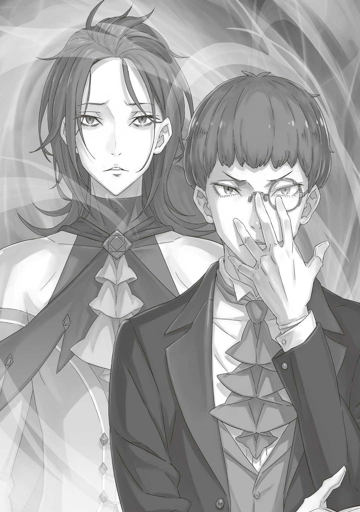

…В то время как отряд Альдебарана без устали преследовали грозные враги, в Королевстве было ещё два места, где кипели не менее ожесточённые битвы.

Первое — битва «Святого Меча», пытающегося предотвратить гибель мира: «Ведьма Зависти» явила часть себя из запечатанного Храма и грозила поглотить Песчаные Дюны Аугрии.

И «Ведьма Зависти», и «Святой Меча» обладали такой силой, что любой другой противник был бы повержен ими в одно мгновение, но поскольку они сошлись друг с другом, битва зашла в тупик. В буквальном смысле их сражение могло бы длиться семь дней и семь ночей. …Ценой гибели мира.

И второе место, в отличие от битв сообщников Альдебарана и «Святого Меча», не сопровождалось столкновениями, но могла повлиять на исход двух других сражений.

Отчаянная борьба тех, кто, во главе с Петрой Лейт, преследовал «Звезду-Последователя».

…О человеке по имени Клинд Петра знала мало.

Он точно был их союзником.

Его госпожа, Аннерозе Милоад, сообразительная девочка, которой не мешали юный возраст и родство с Розваалем — недостаток, что многие сочли бы значительным.

Очарованная Эмилией, она была одной из самых верных сторонниц её лагеря.

Клинд, преданно поддерживавший Аннерозе и пользовавшийся её безграничным доверием как всемогущий дворецкий, в своё время обучал Петру манерам и этикету, когда та только начинала работать горничной.

Не только Петра, но и почти все, кто был связан с особняком Мейзерс, включая Фредерику и Рам, прошли через его руки и познали азы мастерства прислуги.

Поэтому Клинда можно было назвать своего рода прародителем всех слуг особняка Мейзерс, и Петре, по идее, следовало бы относиться к нему как к учителю или наставнику.

Но её восприятие изменил не кто иной, как он сам.

— «Я никогда не брал на себя такой громкой роли, как обучение и наставление. Недоразумение. Я просто передаю то, что услышал от предшественников. Просто так случилось, что я задержался на этой должности дольше других, оттого и возможностей у меня больше. Отказ.»

Такой образ мыслей Клинда можно было бы счесть проявлением скромности или сдержанности.

Но Петра каким-то образом чувствовала, что это были его истинные, неподдельные мысли — мысли человека, который почти никогда не выказывал эмоций.

— «Он ставит себя слишком низко. Из-за низкой самооценки и работа его, видите ли, не заслуживает похвалы… Снисходительный какой!»

Так отзывалась о Клинде Фредерика, которая почему-то была с ним на удивление резка.

Петра, считавшая Фредерику совершенно правой и самой замечательной на свете, была частично согласна с ней, а частично — нет.

Да, на первый взгляд, Клинд казался человеком с низкой самооценкой. Но, с другой стороны, он почти никогда не выказывал сомнений или колебаний, когда своими словами и действиями пытался что-то донести до младших или подчинённых.

Человек с действительно низкой самооценкой колебался бы гораздо больше.

Однако в поведении Клинда такого не было. …Как и у Петры.

— Я, если захочу, всё смогу.

Большинство людей, услышав такое, возможно, усмехнулись бы, сочтя это гордыней, но Петре было не до большинства — ей больше были важны близкие. И она надеялась, что они тоже верят в её решимость.

Петра осознавала, что она — девушка-возможности, которая может раскрыть их по полной.

Осознавала, что она не просто мила внешне, но и наделена талантом, достаточным для того, чтобы идти избранным путём, и упорством, чтобы верить в себя и продолжать трудиться. Всё-таки она — способная девушка, одарённая двумя, а то и тремя талантами.

И как обладательница этих благословений, Петра могла сказать, что Клинд — это не человек с низкой самооценкой, а скорее наоборот — с высокой.

Он осознавал, что обладает выдающимися способностями. Просто не считал это поводом для гордости. Поэтому на первый взгляд Клинд казался скромным и сдержанным.

— Мне это не нравится, совсем.

…О человеке по имени Клинд Петра знала мало.

Она, честно говоря, его не любила.

И это было не только от того, что Фредерика, вежливая и по-матерински нежная со всеми, только с ним вела себя и выглядела по-особенному. Петра догадывалась, какие чувства за этим стояли. Конечно, играло роль и то, что Клинд давно знал Розвааля и, казалось, был с ним в довольно хороших отношениях.

Но главная причина крылась не в его отношениях с Фредерикой или Розваалем, а проистекала из самой сути Клинда.

…Его манера держаться так, будто он уже всего достиг, в корне противоречила принципам Петры — вот что стало главной причиной.

— Мы вернулись, и нам нужна помощь! Знаю, ты слышишь меня, Клинд-сама!

Проехав через ворота Мирулы, ближайшего к дюнам города, громко кликнула Петра. Благодаря Патраш, которая мчалась по Песчаному Морю день и ночь от Сторожевой Башни Плеяд, Петра и остальные, несомненно, вернулись кратчайшим путём и в кратчайшие сроки. И всё же они сильно отставали от Ала, использовавшего крылья «Божественного Дракона». Чтобы догнать его удаляющуюся спину, им была необходима «его» сила.

— Клинд-сама!

Натянув поводья и остановив повозку посреди городской площади, ещё раз кликнула Петра. Но никто ей не ответил. Веря, что её голос точно был услышан, она огляделась по сторонам.

— «А? А где все?»

Сказал Воображаемый Субару. Несмотря на то что солнце стояло ещё высоко, на площади не было ни души. …Нет, не только на площади. Во всём городе.

Мирула всегда производила впечатление захудалого перевалочного городка, но здесь должно было жить не меньше сотни-другой жителей. Странно.

— …Может, тот в шлеме их всех пере~убивал?

— «Что за ужасы тебе в голову лезут! Он же не ты и не Эльза!»

— Мейли-чан, не говори так. …Субару, Мейли-чан теперь добрая, мы её перевоспитали.

Конечно, было бы ложью сказать, что худший сценарий, озвученный Мейли, на мгновение не промелькнул в голове, но эту вероятность можно было отвергнуть, так как безлюдный город не был разграблен. Если бы Ал вместе с Волканикой устроил здесь погром, город был бы разрушен гораздо сильнее, и повсюду царила бы непоправимая разруха. Вид города говорил скорее не о такой бурной катастрофе, а…

— Ночное бегство. — «Похоже, за ночь они все посбегали.»

Петра и Воображаемый Субару заговорили в одночасье. Учитывая, что он — житель её головы, результат был, можно сказать, закономерным, но влюблённая девушка всё равно обрадовалась, что её мысли совпали с мыслями любимого.

Хотя были и другие причины для радости.

— …Несколько неточное выражение, но в целом ваша догадка верна. Проницательность.

С этими словами на опустевшую городскую площадь вышел мужчина. Это был человек, сохранивший утончённую атмосферу, которая резко контрастировала с унылым и безжизненным городским пейзажем. Его странное присутствие ощущалось как капля тёмно-синей краски на белоснежном листе бумаги — ненавязчивая, но ощутимая сила. Казалось, даже если бы это был не захудалый перевалочный город, а шумная толпа в столице, или битком набитая площадка для фейерверков, где то и дело гремели залпы летнего салюта, присутствие этого мужчины невозможно было бы не заметить — таково было его врождённое свойство.

— «Пожалуйста, подождите. В мой мозг загружаются знания Петры».

— …Клинд-сама.

— «А-а, меня опередили!»

Пока досадовал Воображаемый Субару, ещё не знакомый с появившимся мужчиной, Петра спрыгнула с повозки. Всемогущий дворецкий, человек, державший ключ к изменению этой ситуации… Клинд.

— …Судя по состоянию Мирулы и буре в Песчаном Море, повезло, что вы сюда добрались. Удача.

Поправив рукой монокль на левом глазу, Клинд прищурился, глядя на пустой город и на то, что находилось за спиной Петры… на мутное небо и причину этого…

— Похоже, необходимо поговорить. Срочно.

△ ▼ △ ▼ △ ▼ △

— …Понятно. Размышление.

Выслушав краткое объяснение, Клинд коснулся пальцами своего тонкого подбородка и прикрыл один глаз. Размышления обладателя отточенной, резкой красоты сами по себе были величественны, как картина, но, к сожалению, у Петры не было ни времени любоваться этим, ни соответствующего склада ума. Если уж на то пошло, чтобы увидеть красивое лицо, проще было посмотреть в зеркало или на Эмилию.

— Каково состояние Гарфиэля и… Эццо? Подтверждение.

— Жи~вы. Но то, что клыкастый братец, который должен быть о~очень крепким, никак не очнётся, сильно беспо~коит…

— Думаю, Гарф-сан прикрыл Эццо-сана.

Подхватив вторую половину ответа Мейли, Петра подумала о двоих, лежавших в драконьей повозке. Скорее всего, Гарфиэль встал перед полуросликом-магом, чтобы прикрыть его от атаки «Божественного Дракона». Если бы не его самоотверженность, Эццо, возможно, не выжил бы.

— «Значит, Гарфиэль принял на себя удар Дракона…? Я всё ещё не могу до конца принять то, что этот парень способен на самопожертвование, как и то, что ему четырнадцать и он ведёт себя как чунибё 21 .»

— Вообще-то, Гарфу-сан уже пятнадцать. А мне, кстати, скоро четырнадцать.

— «Быстро же летит время. Петра из милашки превратилась в красавицу.»

— …

Следует ещё раз подчеркнуть, что это был всего лишь Воображаемый Субару в голове Петры, а не слова настоящего Субару.

Впрочем, настоящий Субару вполне мог бы сказать нечто подобное. Она это уже слышала. Хотя Петра понимала, что это не лесть, а искренние слова, то, что он мог так запросто говорить это кому-то, кроме Эмилии, вызывало, скажем так, смешанные чувства. Как бы то ни было…

— Я беспокоюсь о Гарфе-сан и о Мастере-сан, но больше всего меня беспокоит Ал-сан. Клинд-сама, вы ведь ждали нас здесь потому, что чувствуете то же самое?

— Не совсем «то же самое». Я остался здесь из-за неприятного чувства, которое возникло, когда я вас провожал, Петра. Подозрение.

— Неприятного чувства?

— Да. Я даже сообщил о нём Субару-сама и Беатрис-сама. Воспоминание.

Услышав то, о чём Петра и Мейли не знали, Клинд печально опустил глаза. Поскольку оба, кому он это сообщил, пропали, он, должно быть, сильно себя упрекал. Его неловкость вызвала сочувствие даже у Воображаемого Субару, который не знал Клинда.

— «Чем больше слушаю, тем сильнее мне кажется, что это я и Беатрис во всём виноваты. Клинд-сан ведь всё правильно сделал: и отчитался, и посоветовался, а мы — нет. Вот и результат, всё закономерно…»

— Субару и Беатрис-чан ни в чём не виноваты. Молчи, Субару.

— «Я что, про себя плохо говорить уже не могу?»

Воображаемый Субару сокрушался, словно столкнулся с вопиющей несправедливостью, но Петра не потерпела бы, чтобы кто-либо, даже сам Субару, так говорил. Тем более, что в данном случае под раздачу попала и Беатрис.

Беатрис милая и самоотверженная, поэтому она не виновата.

Такое непоколебимое пристрастие к «близким», от которого любой другой содрогнулся бы, она показывала без малейших колебаний.

Таковы были правила суда Петры Лейт и решение судьи Петры Лейт.

— И что же побеспо~коило Дворецкого-сан?

— Тогда я не смог указать на что-то конкретное. Неспособность. Но сейчас… Я сомневался в постановке. Опасения.

Клинд, не поднимая глаз, облёк свои мысли в слова. «Постановка», которая его беспокоила, вероятно, относилась к части, когда он провожал Петру и остальных из Мирулы.

— Это не казалось чем-то неестественным. Состав группы был вполне объясним, если вдуматься. …Для создания такой группы надо провести два-три сложных логических обоснования. Замысел.

— Замысел…

Петра мысленно пережёвывала это слово. Клинд говорил туманно и избегал прямых заявлений… он говорил про ошибку в выборе членов группы для путешествия к Сторожевой Башне Плеяд.

Петра чувствовала вину. Что если бы вместе с Субару и остальными пошла не она, а Эмилия, Рам или Отто? Что если бы, как и планировалось изначально, вместо Петры пошла Фредерика? Тогда, возможно, удалось бы остановить Ала. Мейли была нужна для преодоления Аугрии, а Гарфиэль для надёжной охраны. Они — незаменимы. А Петра… Петра заменима.

— …

Следовало настоять: например, попросить отложить путешествие или поехать всем вместе. Но события в Волакии требовали немедленного доклада. А ещё нужно было поддержать Шульта. Им требовались здравые решения. Так и сложился нынешний состав группы.

На это могла повлиять субъективность и корыстность Петры. Её желание ни на миг не расставаться с Субару после долгой разлуки и быть ему полезной. Пока Эмилии и Рем не было рядом, Петра хотела, чтобы её сила и присутствие помогли Субару. Вот почему она не заметила того, что заметил Клинд — неприятное чувство…

— «…Петра, снова ты делаешь из мухи слона.»

Воображаемый Субару коснулся руки Петры, которая крепко сжала подол юбки. Его нежный голос прошептал ей на ухо. К сожалению, слова Субару не помогли Петре.

— «Конечно, не мне говорить, но вполне возможно, что у тебя было такое, ну, скрытое желание быть рядом со мной. В этом нет ничего плохого. Даже если у тебя и было такое чувство, то это всего лишь один процент. Остальные девяносто девять процентов — это доброта Петры, я уверен.»

— Я… Ты так говоришь, потому что я тебя заставила, ты же всё-таки в моей голове…

— «И что мне на такое отвечать?! Это запрещённый приём!»

Воображаемый Субару слегка покраснел и опустил голову. Должно быть, ему самому было неловко говорить, что она хотела быть рядом с ним. Петра вздохнула. Она ненавидела себя за то, что легко поддавалась его доброте. Наверное, дело не в том, что Петра была легкомысленной, а в том, что слова Субару обладали слишком большой силой.

— «Может, это и не твоя вина вовсе.»

— Хочешь сказать… это из-за того, что Ал-сан слишком силён?

— «Честно, никогда не видел, как Ал дерётся… но я точно знаю, как дерётся Райнхард.»

Воображаемый Субару не знал, на что способен Ал, зато видел… мощь Райнхарда. И Гарфиэль, и Эццо — невероятно сильные бойцы, выше уровня Петры. Раз Ал победил, значит, он их сильнее.

Но как бы он ни был силён, ему не сравниться с Райнхардом.

— «Когда впервые увидел его силищу на Складе Краденных Товаров, я ещё плохо понимал здешние реалии… но, видимо, по меркам этого мира он тот ещё монстр.»

— Да. Но Ал-сан справился и с Райнхардом-сан. Флам-чан позвала его с помощью своей Божественной Защиты… и в итоге…

— «Ну, Райнхард не прикончил Ала мгновенно, а ещё у него тиммейт «Божественный Дракон».»

— Думаешь, если бы вместо меня был кто-то другой, всё было бы так же?

— «Скорее всего. Сила тут вряд ли бы помогла.»

Услышав о сомнениях Воображаемого Субару, Петра тоже задумалась.

И правда, в тот момент, когда ты сталкиваешься с Райнхардом, любая сила теряет смысл.

Силой, будь она больше или меньше, невозможно победить Райнхарда и достичь желаемого.

То есть, ужас Ала заключался не только в силе.

— «Алу слишком уж везёт, и слишком уж удачно для него сложились обстоятельства.»

— У тех, кому всегда везёт, есть что-то кроме удачи, да?

— «Да.»

Хотя суть уловить не получилось, Петра запомнила эту часть. Её голова переключилась на другие варианты. Больше она не переживала, что всё испортила. Возможно, Субару так и хотел.

— Петра-чан? Что-то ты замеч~талась, всё в порядке?

— …А, ничего, Мейли-чан, всё хорошо. Клинд-сама.

— Что? Вопрос.

— Здесь точно замешано это неприятное чувство, я уверена. Мы должны его понять, иначе никто не остановит Ала-сан.

— …

— Только мы. Только мы можем его остановить. …Остановить, а потом вернуть Субару и Беатрис-чан.

Петра положила руку на грудь и твёрдо заявила это Клинду. Чтобы накопить силы и выдохнуть последнюю фразу, ей потребовалось немало мужества.

— «…»

Воображаемый Субару со сложным выражением лица смотрел на Петру. Она непоколебимо верила в свой внутренний вывод. Верила до конца. …Петра прочла «Книгу Мёртвых».

В худшем случае, Ал убил Субару и Беатрис, стёр их из этого мира.

Всё-таки в библиотеке лежала «Книга Мёртвых» Нацуки Субару.

— Но мой Субару — не обычный.

Она невольно сказала «мой», но это было правдой. И про то, что он необычный, тоже правда. Нацуки Субару обладал «Посмертным Возвращением» — невероятно тяжёлой, мучительной силой, которой мог правильно распорядиться только очень добрый человек. Петра предположила, что книга, которую она видела, могла быть описанием одной из тех смертей, которые уже случились.

— Вряд ли после «Святилища» Субару ни разу не умирал.

— «Что-то ты в меня совсем не веришь… хотя… одновременное появление всех Архиепископов Греха, Сторожевая Башня Плеяд, адская Империя Волакия… и всё без единой ошибки… мне и самому в это не верится, если честно.»

— …Да.

Когда она поняла, что все блестящие достижения Субару, которые и так считались результатом невероятных испытаний, на самом деле были концентрацией ещё большего ада, чем она могла себе представить, Петра не разочаровалась в Субару, а была потрясена его самоотверженностью. И одновременно она осознала… глубину душевной раны, которую нанесла ему смерть Присциллы. Субару был глубоко, невообразимо глубоко ранен. Именно поэтому он, должно быть, взвалил всё на себя и решил сделать всё возможное для Ала. А он предал его чувства, его решимость, которую никто другой не смог бы повторить: «Я спасу всех, будь даже ценой моя жизнь». Если Ал убил Субару и Беатрис, то, разорви Петра его тело, сердце и душу, всё равно не смогла бы отомстить.

— Бра~тец и Беатрис~чан…

— Они живы. Я уверена.

— …Да~. Беатрис~чан, а особенно Братец, очень жив~учие.

Мейли прошептала это и осторожно положила голову на плечо Петры.

Даже не очень искренняя Мейли от всего сердца беспокоилась о Субару и Беатрис. То, что он вызывал такие чувства у окружающих, было результатом его поступков.

— «И Беатрис, и Мейли… Что же такого сделал будущий я?»

Удивлённо пробормотал Воображаемый Субару, словно речь шла о чьих-то неизвестных ему деяниях. Улыбнувшись, Петра повернулась к Клинду. Она передала ему свою волю и цель. Оставалось ждать ответа. Встретив её взгляд, Клинд тихо выдохнул сквозь тонкие губы и сказал:

— Только вы можете его остановить, да? Смелое заявление. Ваш боевой дух заслуживает внимания. Восхищение.

— …

— Честно говоря, когда «Ведьма» появилась на краю света, я почти смирился с тем, что уже ничего не исправить. Раскаяние. Но если вы горите таким рвением, то…

— Подождите, Клинд-сама.

Петра прервала Клинда на полуслове. Не потому, что разговор мог затянуться, и не потому, что она боялась отклонения от темы. …Говоря словами Клинда, это было то самое неприятное чувство, которое не выразить словами. То, что сказал Клинд…

— Я сказала «мы». В это «мы» входите и вы, Клинд-сама. Не говорите «вы», словно вас это не касается.

— Я… Нерешительность.

— Хоть сейчас и не время, но скажу: Клинд-сама, вы всегда ведёте себя так, словно не из нашего круга, будто вы нам какой-то чужак. Мне это не нравится, совсем.

Ещё можно было бы понять, если бы он общался с лагерем Эмилии с позиции взрослого, человека, чьё положение обязывает держаться несколько отстранённо. Но Клинд был другим. Он был таким со всеми. И с Аннерозе, которую он почитал как госпожу, и с Розваалем, с которым у него были почти приятельские отношения, и с Фредерикой, которая не могла вычеркнуть Клинда из своей жизни.

— Такой образ жизни недопустим в совершенном Королевстве сестрёнки Эмилии.

— …

— Нельзя оставаться в стороне. Если вы живёте, встречаетесь с людьми, разговариваете с ними, видите их лица, то всё хорошее и плохое, что из этого рождается, происходит без всяких оговорок. Нельзя пытаться взять только чуть-чуть или только лучшее, так жульничать нельзя и не нужно.

— Петра-чан…

— Если так жить, когда-нибудь всё важное от вас отвернётся!

Чувствуя прикосновение Мейли к своему рукаву, Петра выпалила это так сильно, что у неё перехватило дыхание. Где-то на середине она уже сама не понимала, говорит ли то, что хочет сказать, и смогла ли донести то, что хотела. Наверное, это влияние Субару из «Книги Мёртвых».

— «Эй-эй, так это я, значит, виноват?»

Сказал Воображаемый Субару, опустив уголки бровей, но она пропустила это мимо ушей. Сейчас важнее был Клинд…

— Всё важное отвернётся, говорите…? Известно.

На ответ Клинда Петра тихо ахнула. Отчасти потому, что в его тихом шёпоте прозвучала такая мучительная эмоция, что у неё сжалось сердце. Но ещё больше её поразило выражение лица Клинда.

— …

Он редко показывал эмоции. Улыбка, гнев, печаль — Петра не припоминала, чтобы он их проявлял; во всяком случае, Клинд выражал всё это бесстрастно. Но сейчас его лицо изменилось. …Оно окрасилось скорбью.

Мучительный голос и скорбное лицо. Когда эти два элемента соединяются, люди называют это мимолётной печалью. В этот момент у Клинда было мимолётно-печальное, тоскливое лицо, словно он вспоминал прошлое.

— Такое… уже случалось. Ностальгия.

— Клинд-сама…

— От меня уже отворачивались, Петра. Самоуничижение.

От его слов Петра вспомнила своё предыдущее высказывание и постыдилась. Она с умным видом рассуждала о чувствах, которые сама только начала понимать. А Клинд, оказывается, уже знал это ощущение и вёл себя так, будто это уже пройденный этап. Но, даже со стыдом, Петра всё равно хотела сказать.

— Даже так…

— …Да, даже так. Восхищение.

— А?

— В итоге я всё отпустил. И пусть это правда, что я стал опустошённым, на пути, который я прошёл после этого, я многое приобрёл. Размышления. …Петра, твои отношения со мной и остальными — одно из того, что я получил. Откровение.

С этими словами Клинд посмотрел вверх. Что он увидел там, в небе, где облака были разорваны, словно из последних сил сдерживая конец света?

— Мне не приказывали остаться. Так почему же я ждал здесь? Из-за неприятного чувства? Думаю, мне просто было невыносимо закрыть глаза. Прояснение.

— …Э-э, Клинд-сама, это значит…?

— Это зна~чит, что ты права, Петра-чан, и он извин~яется.

— Мейли-чан! — «Мейли-пайсен, ну ты даёшь!»

Пока Петра пребывала в замешательстве, Мейли удивила её прямым заявлением. Субару восхищённо назвал её «пайсен 22 ».

Петра не помнила, чтобы он так когда-либо делал, но такая реакция показалась ей очень в его духе. Тут Клинд тихо усмехнулся и сказал:

— Приношу извинения за беспокойство от моей непричастности. Раскаяние. Спасибо, Петра. Признательность. …Теперь я хочу внести свой вклад.

— Клинд-сама…

Петра просияла, увидев, как Клинд почтительно поклонился. Но, словно желая поубавить её восторг, Мейли сказала:

— Дворецкий~сан и не собирался мешать нам или говорить, что не будет сотрудничать. Петра-чан, мне кажется, ты переж~ивала попусту.

— М-может и так, но…

— Нет, Мейли. Исправление. Быть причастным — значит, предлагать решения. Это отличается от роли наблюдателя. Разные люди.

— «Какие люди, речь же про роли была, я запутался!»

— Поняла! Тогда! Клинд-сама, своей таинственной силой перенесите нас туда, где все…

Петра с восторгом наклонилась вперёд. Она хотела, чтобы Клинд использовал свою силу по полной. Сейчас Петра больше всего рассчитывала на его способность к «переносу». Телепортация, мгновенно сокращающая расстояние до цели, была бы незаменима для преследования Ала, который куда-то направился вместе с «Божественным Драконом».

Место назначения врага было неизвестно, но с таким заметным спутником, как «Божественный Дракон», выследить его будет несложно. С помощью Эмилии, Рам и остальных — честно говоря, это было неприятно, но и Розвааля тоже — вполне можно было бы определить его направление и догнать. Так, пыхтя, думала Петра, но…

— К сожалению, моя техника переноса используется не без ограничений. Это довольно неповоротливая сила. Сожаление.

— Клинд-сама, ты лжец! Предатель! — «Обнадёжил, а теперь такое! Обманул наши ожидания, Клинд-сама!»

— Н-не сли~шком ли грубо, Петра~чан? Думаю, Дворецкий-сан ничего пло~хого не хотел.

Луч надежды внезапно скрылся. Из-за этого Петра вместе с Воображаемым Субару разозлились. Но только половина их гнева дошла до Клинда и Мейли. Когда выяснилось, что силу неизвестного механизма, на которую они так рассчитывали, использовать не получится, всё свелось к тому, что их теперь просто будет сопровождать Клинд.

— Если точнее, моя сила не «перенос», а «сжатие» пространства и времени. Объяснение. Изначально предполагаемое расстояние и необходимое время «сжимаются». Но, так как это может сильно повлиять на устройство мира, необходимо снисхождение Од Лагуны. Целесообразность.

— «Од Лагуна? А это ещё что?»

— Источник маны и всего подобного. По знаниям Субару, это что-то вроде Бога без своего сознания… наверное.

Объясняя Воображаемому Субару, склонившему голову от неожиданного слова, она и сама не была до конца уверена. Петра, учившаяся магии у Розвааля, получила общее представление об Од Лагуне, но насколько хорошо она это поняла, неизвестно.

Розвааль говорил, что сам до конца не понимает, что такое этот невероятно огромный сгусток силы, Од Лагуна. Она стояла особняком даже от таких вершин силы, как «Святой Меча», «Божественный Дракон» или «Ведьма Зависти».

— А что будет, если обма~нуть Од Лагуну?

— Неизвестно. И эта неизвестность ужасает. Дрожь.

Он покачал головой. В его словах не чувствовалось намерения обмануть или уклониться от ответа. Клинд, который, казалось, знал всё, придерживался того же мнения, что и Розвааль. Но если так…

— Клинд-сама, но вы ведь уже пару раз получали снисхождение Од Лагуны, да? Как?

— Петра…

— У вас есть какой-то способ, иначе бы вы не смогли использовать свою силу. Что для этого нужно, Клинд-сама? Для магии нужна мана. Чтобы управлять духом, нужен контракт. Получается, для Од Лагуны тоже нужна особая плата?

— …Ты поистине удивительный ребёнок. Восхищение.

Догадки Петры подтвердились. Принеся плату Од Лагуне, можно получить снисхождение — разрешение на использование сверхъестественной силы Клинда.

— «Взятка или подкуп, значит…? А Бог-то продажный.»

Петра была согласна с Воображаемым Субару, который скривился и пробормотал это. С другой стороны, Бог, требующий плату, казался ей более надёжным, чем Бог, дарующий блага просто так. Петра «до смерти» знала, что мир устроен не настолько просто, чтобы получать желаемое, ничем не жертвуя. Поэтому…

— Скажите, что нужно, Клинд-сама. Я обязательно достану это, чего бы мне это ни стоило. Ради Субару, Беатрис-чан и всех остальных.

— Петра~чан, ты ведешь себя стра~нно. Сама же просила говорить не «я», а «мы».

— …Да, точно, простите. И спасибо.

Мейли улыбнулась и взяла за руку Петру. Если подумать, она и представить себе не могла, что у них сложатся такие отношения.

Когда Мейли была заключена в особняке, Петра часто навещала её, потому что хотела тронуть ее состраданием и превратить в союзника.

Она и представить себе не могла, что когда-то Мейли будет так её поддерживать.

— …Способ. Ответ.

Перед Петрой и Мейли, после небольшой паузы, сказал Клинд. В его голосе не было ни колебаний, ни сомнений, ни терзаний по поводу того, стоит ли говорить это детям. Клинд принял нынешние обстоятельства как свои собственные и признал Петру и Мейли верными союзниками.

А затем…

— Чтобы вмешаться в мир, в Од Лагуну, нужна плата — возможность совершить что-либо. Таковы условия использования моего Полномочия, Полномочия Ведьминского Фактора «Уныния». …Признание.

