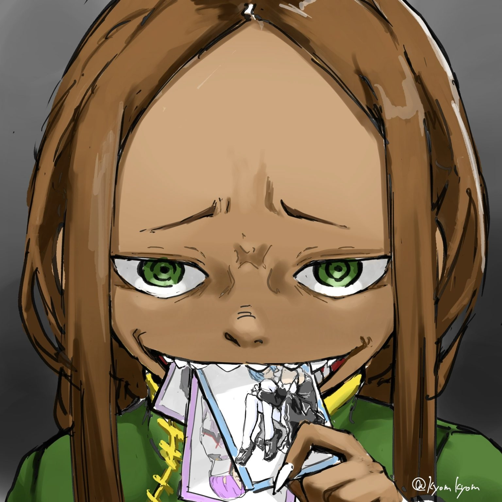

«Перенос» Клинда — сам он объяснял это как «сжатие» — Петра испытывала на себе примерно месяц назад, а Мейли — всего несколько дней тому.

— В первый раз можно сильно удивиться, но бояться нечего.

Так, с высоты своего опыта, Петра предупредила Флам. Это была забота о том, что если хорошенько не объяснить, что произойдёт, та может испугаться. Однако в ответ Флам покачала головой:

— Можете не беспокоиться, большинство неожиданностей и рядом не стояли с молодым господином.

— «Его что, даже свои считают ходячей непредсказуемостью? Да уж…»

Изумлённо высказался «Субару» на столь стойкий ответ. Из воспоминаний, разделённых через «Книгу Мёртвых», Петра знала, как Рейнхард одним взмахом меча снёс здание и сестру Мейли, поэтому вполне могла понять Флам.

— Флам-чан ещё лад~но, а вот за Мастера-сан я переживаю — вдруг проснётся. Когда Дворецкий-сан перенёс нас в первый раз, скорпиончик на моей голове сильно пере~полошился.

— Интересно, а от «переносов» Клинда-сама часто укачивает? Когда мы были в Волакии, некоторым было нормально после «переноса» Спики-чан, а некоторым — плохо.

Мейли пожала плечами, её волосы зашевелились, и из них показался багровый скорпион, который, словно подражая хозяйке, защёлкал клешнями. «Перенос» Спики… возможно, последствия зависели от особенностей организма, но независимо от силы или слабости, кому-то он просто не подходил. Петра была из тех, кому вполне нормально, а вот Гарфиэль сворачивался калачиком и дулся. На её вопрос Клинд поднял палец:

— Хм. Размышление. Не могу сказать, что число попыток или количество испытавших было велико, но до сих пор никто не жаловался на самочувствие. Спокойствие. Полномочие «Уныния» строго говоря не «перенос», а последствия «сжатия» времени и расстояния, которые потребовались бы в обычном случае. Сокращение.

— Сколько ни слушаю, всё равно не пони~маю.

— «Типа как Кинг Кримсон? Хотя нет, думаю, вряд ли Клинд может менять исход во время «сжатия»…»

— Укачает или не укачает — это не важно. Главное, что ваша сила, Клинд-сама, даст нам время, в котором мы нуждаемся больше всего. Этого вполне достаточно.

Так заключила Петра, глядя на склонившую голову Мейли и «Субару», по-своему осмысливающего происходящее.

Слова «Субару» вроде бы можно было понять, но сейчас было жаль тратить на это время и силы. Позже она хотела бы как следует разобраться во всех воспоминаниях и знаниях, чтобы стать той, кто понимает в Субару всё…

— Клинд-сама, попрошу вас.

Время было непозволительной роскошью, поэтому Петра поторопила его. Линза монокля Клинда блеснула.

— Да. Своевременно.

Он кивнул. Учитывая явление, которое Клинд собирался произвести, его непринуждённость выглядела даже обнадёживающе. Пока Петра восхищалась этим, Мейли потянула её за рукав:

— Слу~шай, Петра-чан, насчёт той платы…

— …Всё нормально, Клинд-сама дал своё одобрение.

— Не в этом де~ло… Сама не знаю почему, но если Петра-чан должна будет что-то потерять, то я этого не хо~чу.

— Потерять…

Мейли, казалось, сама не справлялась со своими чувствами. От её слов Петра удивлённо моргнула. Прямое беспокойство от подруги и оценка платы, полученная от Клинда… в этот миг чувства, нахлынувшие на Петру, достигли предела сложности и богатства оттенков.

Вдруг Петра улыбнулась Мейли:

— Спасибо, Мейли-чан. Но всё хорошо.

— …Если ты врёшь, будет просто ужа~сно.

Угроза, выдавленная после долгих раздумий. Петра, улыбаясь её неловкости, кивнула. Она бережно прижала к груди отпущенную руку, а затем поискала взглядом «Субару». Вряд ли он, призрак, куда-то уйдёт, но это было ради душевного спокойствия. Когда она нашла его полупрозрачную спину, «Субару» смотрел вдаль, на Песчаное Море.

— «Если бы я был хоть немного собраннее, ему бы не пришлось так мучиться.»

На востоке… там, где атмосфера кричала, цвет неба ужасал, а земля с грохотом стиралась в пыль — в этой зоне боевых действий всё ещё продолжалась битва «Святого Меча» и «Ведьмы Зависти». Столкновение обладателей чудовищной силы, способное решить судьбу мира. Глядя на профиль «Субару», сокрушающегося о своей беспомощности, Петра затаила дыхание от щемящей тоски. «Субару», беспокоящийся о друге, не коснулся недавнего разговора Петры и Клинда. Строго говоря, от него, человека в голове Петры, нельзя было скрыть ничего, и если бы он захотел, то смог бы полностью раскрыть сведения, от которых она заставила себя отгородиться. Однако призрачный Субару этого не делал. …Было ли это из-за благоразумия и такта «Субару», или же из-за её собственной воли — Петра, в которой смешались самосознание, нежность и воспоминания, не могла разобрать. Но, как бы то ни было, будь то её такт или что-то другое, образ «Субару» строился на том, каким Петра Лейт видела настоящего Нацуки Субару. Поэтому…

— Клинд-сама, будьте добры.

— …Да. Одобрение.

Сохраняя нежность к «Субару», Петра подала знак Клинду.

Петра, Мейли и Флам, а ещё Патраш, Гарфиэль и Эццо — итого шесть человек и одно животное. Если добавить «Субару» и скорпиона, то плюс один человек и одно насекомое. Вся эта группа, позаимствовав силу Клинда, начала действовать. Ради этого предложенная Петрой «плата» была принесена Од Лагуне…

— …

Буквально в мгновение ока мир переключился, «сжатие» завершилось. Стоило закрыть и снова открыть глаза, как пейзаж изменился. Вкус воздуха, ощущаемый языком и кожей, запах мира, коснувшийся обоняния, резко сменились. Петра поняла, что Полномочие сработало.

— …

Она закрыла глаза. За секунду Петра отложила всё в сторону и сосредоточилась на главном. Дальше у них не будет ни секунды на промедление. И вот, когда она собралась с духом…

— А?! Ч-чё за, чё за херь?! Драконья повозка из ниоткуда появилась, вы это видели?! — Э-это Рейнхард?! Только он может подобное вытворять! — А может всё это сон? Тото! Тотооо! Мне срочно нужно полежать на твоих коленочках!

— Если будешь кричать, не полежишь! И вообще, чего вы так все разорались… А?! Откуда здесь драконья повозка?!

Такой шумный и беспокойный «тёплый приём» ожидал их в точке «сжатия», будто нарочно, чтобы охладить пыл Петры.

— «Чего?! Старик Ром ещё ладно, но вот Без-Моз-Гов?! Без-Моз-Гов! Почему они со стариком Ромом?! Что здесь происходит?!»

Именно «Субару» первый отозвался на их «тёплый приём».

△ ▼ △ ▼ △ ▼ △

— Петра-чан! Мейли! Вы целы?!

— …Кх. — «Эмилия-тан…!»

Едва увидев Эмилию, которая, изменившись в лице, подбежала к ним, Петра ощутила, как в её груди взрывом распространилось сладостное чувство. Грудь наполнилась мягким, тёплым, до онемения приторным ощущением, а в голове хлынул поток изысканных слов, восхваляющих её красоту и прелесть. Этот восторг касался не только внешности полуэльфийки, но и манер, речи, и даже, в конце концов, звука шагов.

— Как откровенно… кх…

Захваченная этой явной и сильной волной чувств, у Петры закружилась голова. До сих пор самым сильным влиянием «Книги Мёртвых» она, без сомнения, считала существование призрачного Субару, но это «Эмилия-трясение» могло легко с ним посоперничать. Передозировка Эмилиямином может быть опасна для жизни…

— О чём я вообще думаю…!

Внезапно чуть не потеряв половину себя, Петра с усилием ухватилась за воротник собственной личности и кое-как удержалась. Любовь к Эмилии переполняла её слишком уж бурно. Это само по себе вызывало смутную ревность, но ещё больше Петру задевало то, что её собственные чувства радости от встречи с Эмилией и нежности к ней вытиснились. Это было неправильно. Вот почему Петра, подавив желание воскликнуть «E ・ M ・ T!», раскинула руки. И вот, когда Эмилия, с красивым, заплаканным лицом подбежала к ним…

— Сестрёнка Эмилия-тама…!

— …«-тама»?!

Язык её так знатно подвёл, что она удивила Эмилию прямо перед трогательным воссоединением. Петра едва не назвала её «Эмилия-тан» и попыталась на ходу исправиться, но получилось не до конца. Совершенно не свойственная ей оплошность. Как бы то ни было…

— Какое счастье, вы обе вернулись.

— Да. И вы тоже, сестрёнка Эмилия, целы и невредимы, это самое главное.

Эмилия на чувствах прижала Петру к себе. Та обняла её в ответ.

С другой стороны от них, Мейли, которую тоже обняли, с несвойственной ей прямотой буркнула: «Дыш~ать нечем…» — и робко обняла Эмилию за спину.

— «Да! Видеть Эмилию-тан целой и невредимой настоящее облегчение! А? Она что, за время нашей разлуки ещё милее стала? У неё просто невероятный потенциал роста!»

«Субару», паря в воздухе, с восторгом разглядывал Эмилию, обнимающую Петру и Мейли, со всех сторон. Он оживился. Но это было закономерно. Ведь, судя по времени «Книги Мёртвых», последняя Эмилия, которую помнил «Субару», — это та, что была подавлена в «Святилище». В то время Петра ещё не была так близка с Эмилией, как сейчас, поэтому не могла ей помочь.

Если даже Петра до сих пор об этом сожалела, то досада «Субару», испытавшего всё это вблизи, была несравненно сильнее.

— «А-а! Обалдеть, Петра! Ты видела? Видела, как быстро и прелестно шагала Эмилия-тан?»

— Да, видела.

— «Я так рад…! Так рад…!»

Поэтому она колебалась, стоит ли осаживать «Субару», дрожащего от восторга. Поддакивая его возгласам, Петра втайне вздохнула. Причина этого была одна — увидев Эмилию, она не испугалась.

— Последние секунды «Книги Мёртвых»…

Погружённое во мрак «Святилище» и Нацуки Субару, который убил себя в плену «Ведьминской» одержимости. В тот последний миг Субару-Петра увидели. … «Ведьма Зависти» имела то же лицо, что и Эмилия.

— …

При попытке глубже задуматься о причине, ясные мысли никак не складывались, словно она пыталась дотянуться до чего-то в тумане. И всё же, ярко запечатлевшееся чувство не отпускало. Поэтому встреча с Эмилией была страшна. …Точнее, было страшно, что она не сможет смотреть на Эмилию как прежде.

— Хорошо, что так не случилось… Хотя сердце теперь колотится по-другому.

— А? Петра-чан, что-то случилось?

— Ничего. Просто рада вас видеть, сестрёнка Эмилия.

Скрыв внутреннюю борьбу, Петра от всего сердца радовалась встрече с Эмилией. Полуэльфийка округлила глаза, а затем улыбнулась. На голове Мейли, тем временем, скорпион весело щёлкал клешнями.

И тут…

— …Так вот из-за чего тут так шумно стало — девчушка пришла.

Вмешался низкий, хриплый голос, из-за чего Эмилия издала «Ах!». У входа в комнату, дверь которой она оставила открытой, стояла большая тень. Тот, кто постучал и заглянул внутрь…

— Дедушка Фельт-чан!

Старик, с трудом протиснувшийся в дверной проём… Ром. Увидев его, Эмилия захлопала глазами. На её слова он, поглаживая свою лысину, криво усмехнулся:

— Так можно подумать, что мы с Фельт кровные родственники… Все зовут меня старик Ром. Это первый раз, когда мы вот так, нормально, разговариваем, да?

— Э-э, да. В замке в день начала Королевских Выборов мы не поговорили, а когда Фельт-чан украла у меня регалию, мне было не до спокойных разговоров…

— …Всё хор~ошо.

Эмилия обеспокоенно взглянула на Мейли, которую обнимала.

Сама же Мейли ответила с выражением, в котором смешались досада и признательность за заботу. Нынешний их разговор касался связи Эмилии и Рома… того случая, когда Фельт украла регалию, дающую право на участие в Королевских Выборах, и того, что в этом была замешана сестра Мейли, Эльза. Если подумать, то и эти трое связаны довольно странными узами. А если добавить «Субару», то их уже четверо. Если же включить и Рейнхарда, то этому не будет конца.

— Девчушка… звать тебя так при твоём нынешнем положении неуместно. Можно просто Эмилия?

— Да, конечно. Ещё раз, приятно познакомиться, дедушка Ром.

— «Ух… Они нормально друг другу представились, чувствую себя свидетелем исторического момента.»

— Не так уж это и исторично.

Глядя, как Эмилия и Ром обмениваются рукопожатием, «Субару» сказал нечто столь высокопарное. Конечно, некоторая трогательность в этом была, но его слова звучали так, будто он стал свидетелем воссоединения двух людей, не видевшихся более десяти лет. Отложив восторг «Субару» в сторону…

— Я слышала о Фельт-чан. Тебе, дедушка Ром, и остальным пришлось нелегко.

— Да. Но сейчас важно другое. Петра.

— …Думаю, Клинд-сама вернётся ещё не скоро, так что начнём без него… В конце концов, это гонка со временем.

На её слова Эмилия и Ром кивнули. Да, гонка со временем. Именно ради этого они прибегли к запрещённому приёму.

…Петра и остальные собрались в особняке столицы Лугуники. Среди членов лагеря Эмилии, действовавших порознь, её местонахождение было точно известно, но если и собираться вокруг кого-то, то это могла быть только Эмилия. Подумав так, Петра после воссоединения с Ромом и другими с помощью «сжатия» поспешила в столицу, однако…

— Вся столица разворошена.

— Я давно не была в сто~лице, но когда видела её в прошлый раз, она не была так разрушена, и таких вот «искусств» точно не бы~ло.

К словам Рома, скрестившего большие руки, присоединилась Мейли, глядя в окно. В отличие от этих двоих, Петра оказалась в столице впервые. К счастью, Склад Краденных Товаров, о котором она узнала недавно, находился в трущобах, так что Петра смогла сравнить прежнюю, нетронутую столицу с нынешней. В её воспоминаниях не высилось никаких ярких ледяных башен, и благородный округ с рядами великолепных домов не был так разгромлен.

— Дряхлому мне и раньше это место было не по душе, но чтобы благородный округ превратился в пустырь… По слухам, жителей успели увезти, но это всё равно ужасно.

— Ледяные башни… это вы их сделали, сестрёнка Эмилия?

— А, э-э, да, но у меня была на то причина! Внезапно стало ооочень опасно. И я не могла сдерживаться…!

Когда ей указали на огромные изменения в городском пейзаже столицы, видимые из едва уцелевшего особняка, Эмилия растерялась. С теплотой наблюдая за её суетливостью, Петра вместе с Ромом начала постепенно распутывать клубок произошедших событий…

— …Это из-за Ала-сан?

— …Да. Из-за того, что я не смогла остановить Ала, город пришёл в такой беспорядок.

— Это не ваша вина, сестрёнка Эмилия! Если бы вы не создали ледяные башни, жителям столицы пришлось бы туго… Вот почему вы E ・ M ・ G (Эмилия-тан — Настоящий Ангел-хранитель)!

— М-м, Петра-чан, спасибо… а? Что ты сейчас сказала?

Она решительно покачала головой, отрицая вину Эмилии. Услышав, что к огромному урону, нанесённому столице, причастны Ал и Волканика, Петра, наоборот, почувствовала ответственность. Ведь если бы их злодейские планы удалось остановить ещё в самом начале…

— Так можно беско~нечно. Итог один: всех нас обвели вокруг паль~ца. Главное — виноват тот в шлеме и его дружки.

— Да. Размышлять над ошибками, чтобы больше их не допускать, — это нормально, но вот сокрушаться о том, что что-то не смог в прошлом, не нужно. Это, так сказать, правило, выведенное стариками.

— …Вы правы, зло совершил Ал, и он же должен нести за это ответственность. У нас нет времени сокрушаться!

Слова Мейли и Рома помогли Эмилии собраться, её щеки напряглись. Петра тихо вздохнула и приготовилась. Они правы: малодушие, прикрытое самокопанием, — дурная привычка. А путь всегда должен быть только вперёд.

— «Ал, наверное, думает так же… Иначе бы не перешёл черту — освободил из тюрьмы Архиепископа Греха. Что же творится у Ала в голове?»

Уловив настроение Петры, «Субару» скривился при мысли о бесчинствах Ала. Использовать Волканику, чтобы разрушить столицу, уже было чудовищно, но даже это может померкнуть, когда узнаёшь об истинной цели… освобождение «Чревоугодия», с которым у Петры и остальных были давние счёты.

— Если вкратце перечислить всё, что натворил шлемоголовый, голова кругом пойдёт: напал на приближённых Кандидаток, похитил одного из Рыцарей, переманил на свою сторону «Божественного Дракона» Волканику, использовал «Ведьму Зависти», чтобы сковать «Святого Меча». Сверх того, взял в заложники одну из Кандидаток, вторгся в столицу, наполовину разрушил благородный округ и освободил Архиепископа Греха.

— «Жесть. Сколько лет тюрьмы за такое дадут?»

— На сто смертных казней потянет.

И снова количество и тяжесть преступлений Ала… нет, Ала и его сообщников, были просто немыслимы. Казалось, будто они действуют с таким рвением, словно хотят совершить все злодеяния на свете, но Петра считала, что всё это не от отчаяния, а согласно плану. Да, у Ала был чёткий план. Он последовательно выполнял необходимые шаги, и просто так совпало, что все они были сродни преступлениям века.

— А не луч~ше ли выбрать план, где не нужен Архиепископ Греха?

— В плане есть ещё и «Ведьма Зависти», так что ему нет оправданий…

Собственно, у Петры и не было причин оправдываться за него. Судя по «Книге Мёртвых», Субару считал Ала земляком… тем, к кому можно испытывать не только ненависть, но в итоге тот вышел за рамки простительного. В этом вопросе, пожалуй, сходились мнения всех присутствующих… нет, включая и тех, кого здесь не было, — всех причастных.

— Клинд-сама ушёл за сестрёнкой Фредерикой и остальными. Сестрёнка Эмилия, а где Отто-сан?

— …А! Э-э, насчёт Отто-куна…

— Ясно, опять безрассудствует.

— Ах… да. Прости, я не смогла его остановить.

Эмилия поникла и опустила глаза. Её вины здесь не было. Виноват был Отто, но и то — не полностью. Он и без того постоянно брался за непосильное в лагере, так что Петра, Фредерика и остальные постоянно твердили ему, чтобы он отдыхал, но на этот раз их предостережения были неуместны. Отто, благословлённый «Божественной Защитой Духовной Речи», в такой обстановке слишком уж надёжен.

— Разведка и сбор сведений с помощью насекомых и птиц… полезная Божественная Защита… но, похоже, тягот она взваливает на плечи немало.

— Ага. С пер~вого взгляда можно понять — братец в зелёной шляпе та~кой страдалец.

— Я немало пожил, но о «Божественной Защите Духовной Речи» слыхом не слыхивал. Если про такое полезное благословение никто не знает, значит ли это, что ни один из его обладателей не прожил долго?

Петра была согласна с мрачным предположением Рома. То, что чрезмерное использование «Божественной Защиты Духовной Речи» вредно для здоровья, было очевидно. Петра видела в Империи, как у Отто, злоупотребившего благословением, шла кровь из носа. Тогда это тоже было необходимо, в условиях войны, когда нельзя было позволить себе расслабиться.

— Отто-кун волнуется за Субару и остальных, но особенно за Гарфиэля… Он настроен ооочень решительно.

— Когда Гарф-сан очнётся, он, думаю, скажет что-то вроде: «Оттобро положился на крутого меня, а я его подвёл…». Они так похожи.

— Вау, Петра~чан, у тебя неплохо получилось изобразить клыкастого братца.

Не обращая внимания на удивление Эмилии и Мейли, образы Отто и Гарфиэля, готовых на безрассудства, легко рисовались в воображении.

Гарфиэль всё ещё не проснулся. Его оставили в столичной лечебнице, но нужно было очень внимательно следить, чтобы после пробуждения он не начал безрассудствовать или причинять себе вред.

— Надеюсь, Фуруфу-чан успокоит Отто-сана.

Петра беспокоилась о нём. С какими бы насекомыми или животными он ни договаривался, нужен был сам Отто. Поэтому он в одиночку преследовал Ала и его сообщников… точнее, вместе со своим любимым драконом, Фуруфу.

— «Отто… А не оплошает ли он в самый ответственный момент? Насколько на него вообще можно положиться?»

— Если Отто-сан это услышит, наверное, разозлится так, как никогда.

Субару всегда всё взваливал на себя. Любой в лагере разозлился бы, услышав такое, но Петра думала, что страшнее всех был бы именно Отто.

Тем не менее, это была ноша, которую нельзя было взваливать только на Отто. Если Клинд приведёт Рам, то с помощью её «ясновидения» можно будет разделить бремя. Вдруг Петра вспомнила:

— Сестрёнка Эмилия, я хотела вас кое о чём спросить.

— М? О чём?

— Не знаю, случилось ли это с вами, но перед тем, как мы сюда попали, мне и Мейли-чан вдруг стало плохо…

Вопрос касался происшествия, случившегося примерно сразу после того, как Флам определила с помощью «Божественной Защиты Телепатии», где находится Ром и остальные, и, когда они уже договорились перенестись в столицу… по всему телу Петры пробежали мурашки, её охватил удар, словно что-то перемешало все мысли. От такого ужаса она подумала, не побочный ли это эффект «Книги Мёртвых» или, может, предзнаменование того, что Рейнхард проиграл, и теперь «Ведьма Зависти» идёт за ней. Но поскольку Мейли почувствовала то же самое, Петра пришла к выводу, что это ни то, ни другое:

— Флам-чан и дедушку Рома с остальными это не коснулось, но я, Мейли-чан и даже Клинд-сама почувствовали. Вот почему я подумала — может, это как-то связано с Алом-сан… Сестрёнка Эмилия?

Это была странность, причину которой не удалось выяснить даже после обсуждения с Мейли и Клиндом. Петра перестала передавать эти, возможно, опасные сведения, когда увидела лицо Эмилии. Та широко раскрыла свои прекрасные фиолетовые глаза. У неё явно были какие-то догадки.

— …Думаю, это дело рук Архиепископа Греха «Чревоугодия».

— «…А? Чревоугодия?»

— У~х, как ужас~но.

«Субару» нахмурился при упоминании самого ненавистного ему Архиепископа Греха, а Мейли высунула язык. Петра прижала руку к груди и взглядом попросила Эмилию продолжить.

— Что именно случилось, я и сама толком не понимаю, но Ал заставил «Чревоугодие»… Лоя что-то сделать, и тогда мне внезапно поплохело. И вот, пока у меня кружилась голова…

— Ал-сан и «Чревоугодие» сбежали?

— Да.

Эмилия понуро опустила плечи и слабо кивнула. Тут Петра мельком взглянула на Рома. Мудрый великан из лагеря Фельт большой рукой погладил лысину и сказал:

— Когда Петра с Мейли мне об этом рассказали, я подумал, что это какая-то нескладная история, но раз уж и с Эмилией такое случилось, да ещё и здесь как-то замешано «Чревоугодие», предчувствия у меня не самые хорошие.

— Нас, пострадавших, связывает то, что мы союзники сестрёнки Эмилии.

— Клыкастый братец ещё не очну~лся, другой — в зелёной шляпе — от нас отделился, а Братца Субару вообще похитили. Будь они здесь, нам было бы проще пон~ять.

— «А мы трое просто мастера выбирать неподходящий тайминг… три дурака…»

То, что замешан Ал, Петра и предполагала, но если тут ещё и «Чревоугодие», то серьёзность опасений по поводу неизвестной атаки возрастала многократно. …На миг ей показалось ошибкой, что они оставили Спику в Империи.

Спика тоже, хоть и с некоторыми оговорками, была одной из Архиепископов Греха «Чревоугодия»…

— Нет-нет, нельзя так думать, я же ведь не Господин.

Что можешь сделать, а чего не можешь, что будет полезно, а что — нет. Если начать оценивать людей с такой точки зрения, то быстро превратишься в Розвааля. Проницательность можно оттачивать сколько угодно, но если чувствуешь, что человечность начинает иссякать, — берегись.

— Действия «Чревоугодия» пока остаётся только принять к сведению. Итак, по словам вашего министра внутренних дел, цель врагов…

— …Великий Гейзер Моголейд в Карараги.

Ром, попытавшийся свернуть с безрезультатного разговора, был подхвачен Эмилией. Конечная цель Ала и его сообщников, а также обстоятельства, при которых это выяснилось…

— Фельт оставила послание, а ваш человек его нашёл, так? Фельт я верю на все сто, а вы своему человеку верите?

— Отто-куну? Я верю ему не на сто, а на все миллион!

— Сестрёнка Эмилия, речь шла о процентах… Но прозвучало очень круто.

Как раз в духе Эмилии. Её ответ, не скованный понятием процентов, согрел сердце Петры. Ром и Мейли усмехнулись.

— «…Ты не просто стала милей, Эмилия-тан, но ещё и невероятно сильной.»

«Субару» смотрел на неё взглядом, каким смотрят на что-то ослепительное. Его воспоминания обрывались на середине решения проблем в «Святилище», поэтому он чувствовал досаду оттого, что не мог до конца понять, как Эмилия достигла такой силы. Хотелось ему сказать. …Что нынешняя Эмилия закалилась, идя рука об руку с Субару.

— Хм-м, раз есть Беатрис-чан, то это уже «фо-лэгд реис»… Если следовать этой логике, то я тоже хочу присоединиться, да и Гарф-сана нужно включить, а то он обидится. А ты, Мейли-чан, как?

— Как «как», о чём вообще речь~то? Когда ты вдруг начинаешь говорить, как Братец Субару, становится стра~шно.

— «Такое и правда в моём стиле, но почему Мейли меня так хорошо знает?»

С глубоким волнением «Субару» усмехнулся. В конце концов, все пришли к общему пониманию, что конечная цель Ала и его сообщников — Великий Гейзер Моголейд. Честно говоря, непонятно, что им там было нужно, но…

— Если известно место, то с помощью силы Клинда-сана мы их опередим, да?

— …Ага. Дедушка Ром, Без-Моз-Гов и остальные…

— Пока что все, кроме тяжелораненых, должны были войти в ближайший город согласно указаниям. Сила этого юнца по имени Клинд… ею ведь нельзя злоупотреблять, так? Мы подстроимся под ограничения.

Ром, пожав широкими плечами, учёл и Полномочие Клинда, о котором не получил подробных объяснений. Благодаря «плате» Петры, ограничения на использование «сжатия» снялись, но и этого могло не хватить в зависимости от числа «переносов» и людей.

Сначала нужно подготовить почву минимальным числом людей, а другие будут уже после. В этой подготовке забрезжил свет благодаря Отто, находящемуся в эпицентре безрассудных действий. Теперь, чем больше будет сведений о том, каким строем Ал собирается двигаться к конечной цели, тем лучше. И вот…

— …Необходимое средство уже в наших руках. Возможность.

На голос, прозвучавший в самый подходящий миг, Петра и остальные разом обернулись. Тот, кто, оказавшись в центре их внимания, поклонился… Клинд, который словно подгадал этот миг. Эмилия, чьё лицо тут же засветилось, воскликнула:

— Клинд-сан, спасибо, что привёл Петру-чан и остальных. Благодаря тебе мы все быстро воссоединились.

— Не стоит благодарности. Я вернулся в Мирулу по собственной воле, а то, что я оправдал ваши ожидания, — это Петра подтолкнула меня. Поощрение. Важнее то, что я прошу прощения за опоздание. Извинение.

— Вы ничуть не опоздали. Что-то случилось, Клинд-сама?

Клинд медленно покачал головой и извинился, а Петра склонила голову набок. Учитывая возможности «сжатия», можно сказать, что прибытие Клинда в особняк Королевства заняло некоторое время. Но ведь ему нужно было объяснить обстоятельства тем, за кем он отправился, так что это не казалось таким уж опозданием. Возможно, это проявление перфекционизма, свойственного умелому человеку. Подумав так, Петра посмотрела на Клинда, который вдруг заговорил:

— Нет. Отрицание. Что касается причины задержки, то вместо объяснений, самым быстрым и надёжным способом будет увидеть это воочию. Ощущение.

— «Воочию…» — Ощущение?

Странный выбор слов для объяснения опоздания заставил «Субару» и Петру склонить головы набок. Тот же вопрос, похоже, возник и у Эмилии с Мейли. Ром скрестил руки и с интересом наблюдал, что же будет дальше. И вот, когда Клинд отодвинулся в сторону от входа в комнату…

— Ха. Заставила вас ждать.

Величественно, рассекая воздух плечами, в комнату вошла горничная с розовыми волосами, которой очень шло её вызывающее поведение… Рам. Клинд привёл её сюда. Она была одета в форму служанки, которую Петра не видела уже давно.

Петра с ностальгией подумала, как давно она сама не носила свою униформу.

— Рам, ты при… шла…

Слова Эмилии, собиравшейся с улыбкой подбежать к Рам, оборвались. Она остановилась и схватилась за лоб.

— Э-э…

Эмилия растерялась. Петра должна была бы забеспокоиться о ней, но не смогла.

Потому что и Петра, и Мейли, так же, как и Эмилия, были охвачены необъяснимым чувством.

— Это…

Едва взглянув на Рам, их охватило огромное, необъяснимое, невыразимое словами волнение. Это непонятное, всепоглощающее чувство походило на тот случай с «Чревоугодием». Но, если тогда им стало плохо, то сейчас — нет. Это было нечто иное, более сильное и мощное влечение… чувство, будто сердце замерло.

Причина этого тут же появилась из-за спины Рам…

— …Прошу прощения за опоздание, Эмилия-сама.

Рядом с Рам встала горничная с голубыми волосами и изящно поклонилась. Знакомое лицо. Но, насколько знала Петра, та не должна была носить форму служанки и безупречно знать этикет. …Нет. Снова, и снова, и снова её восприятие менялось. Не так. Всё было не так. Нелепо думать, что у неё нет знаний и манер горничной. Ведь в этом мире именно она первой из всех произвела впечатление настоящей служанки на Нацуки Субару и на Петру, которая тогда была ещё деревенской девочкой.

Петра Лейт вспомнила, что…

— Чтобы вернуть этого человека… Чтобы вернуть Субару-куна, Рем приложит все свои скромные силы.

Сказала непревзойдённая, универсальная горничная особняка Розвааля, известная своей вежливостью, но острым языком… Рем.

