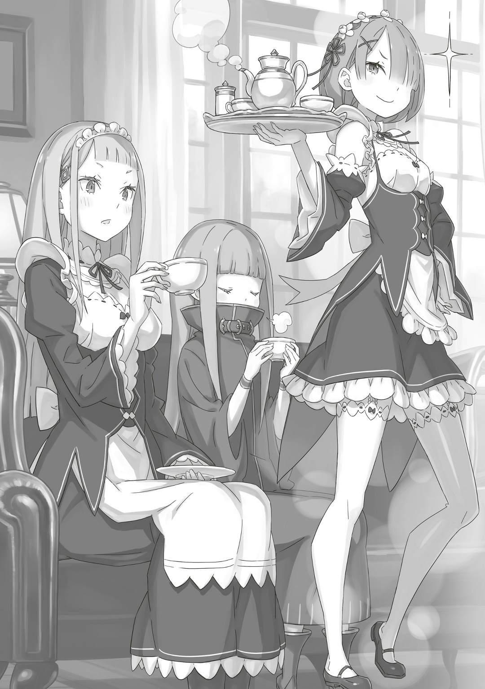
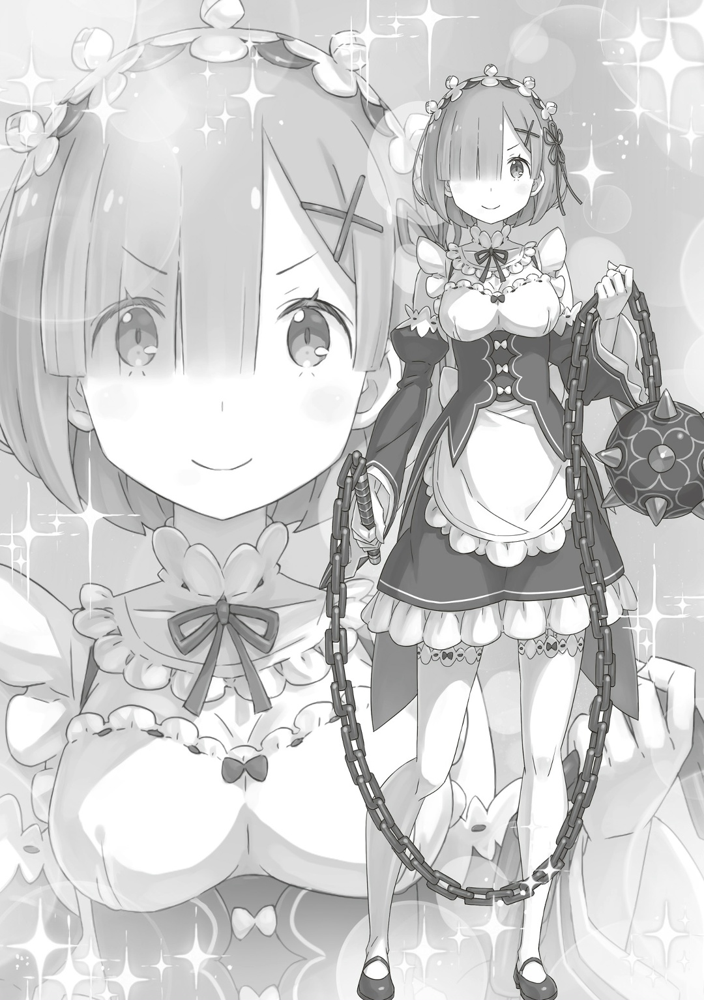
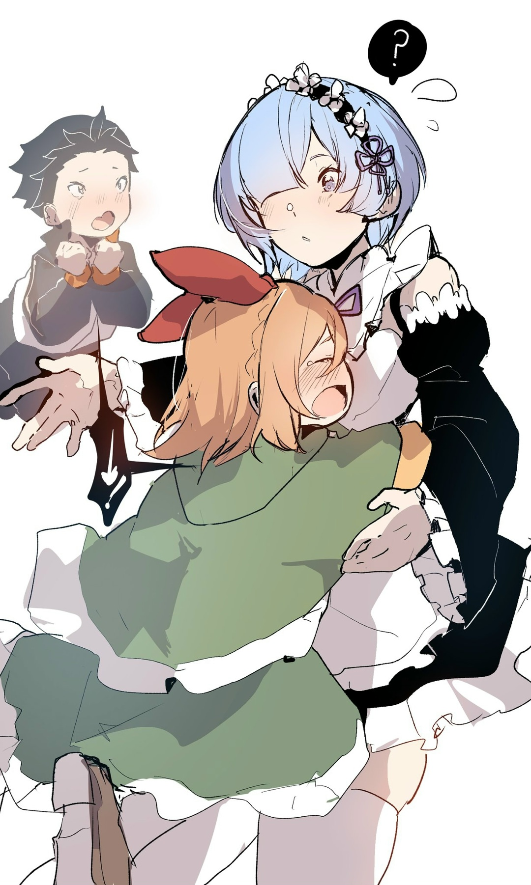

…Когда Рем пришла в особняк Розвааля, то совсем не чувствовала, что «вернулась домой».

— Рем, видишь? Здесь, в особняке Розвааля-сама, работают Рам и остальные.

— Наше… место работы…

Услышав слова Рам, указывающей на живописный пейзаж за окном драконьей повозки, залитый ярким солнечным светом, Рем удивлённо моргнула. Они доехали до промышленного города Костуул, там пересели в другую повозку, присланную за ними, и, спустя время… перед ними предстал «родной дом». Незнакомый Рем «родной дом». Огромные ворота, а за ними — величественный особняк.

Владения Розвааля, ещё более роскошные, чем особняк Беллстетза в Волакии, где она жила с Катей, были настолько изысканны, что, увидев их однажды, забыть уже не выйдет. Тем не менее…

— Ну как?

— …Прости, сестра.

Медленно покачав головой, Рем извинилась, что не оправдала ожиданий сестры. Расставшись с Субару, Эмилией и остальными, которые отправились по своим делам, она приехала в этот особняк вместе с Рам. Рем надеялась, что увиденное в дороге вернёт ей воспоминания, но — нет. Это же могло коснуться и важного для них обеих особняка.

— Да. Но не проверим — не узнаем. Хотя мы работали в этом особняке очень давно, а для тебя, Рем, важен был совсем другой особняк.

— А?

— Предыдущий особняк сжёг Отто, когда был не в духе. Если бы он уцелел, то мы сразу поехали бы туда.

— Отто-сан… От него я такого не ожидала.

Рем, у которой голова шла кругом от всего нового, была ещё больше сбита с толку рассказом Рам. Отто, их министр внутренних дел, производил впечатление мягкого человека; он был незаменимым товарищем и другом Субару. По словам Петры и Фредерики, Отто почти не спал. К этому добавилось ещё и то, что он со злости поджёг особняк. Теперь и не знаешь, что от него ожидать. Внешность может быть обманчива. Но нужно ли так всё обобщать?

— Неужели все союзники Эмилии-сан такие? Гарфиэль, Розвааль-сан…

— Розвааль-сама.

— …Розвааль-сама.

— Теперь правильно. Но ставить этих троих в один ряд с Розваалем-сама –плохо, Рем. Розвааль-сама — умный и способный человек, лучший маг в мире. А эти трое… втроём они едва тянут на одного… нет, на полчеловека.

— Полчеловека…

Рем мысленно представила, как Отто, Гарфиэль и Субару стоят друг у друга на плечах, а рядом с ними — Розвааль, умеющий летать с помощью магии. Она не могла точно сказать, насколько велика между ними разница, но в словах Рам не сомневалась. Рем, чьи воспоминания ещё не вернулись, по-настоящему верила только своей сестре. …Ведь это была единственная прочная связь, соединяющая её прошлую и нынешнюю.

— …Присцилла-сан рассердилась бы на меня за такие мысли.

Вспомнив о женщине с багровыми глазами, Рем ощутила горечь в груди. Та, что за столь короткое время сильно повлияла на её взгляды и жизненный путь, никогда бы не одобрила цепляние за прошлое. Точно так же ей не понравилась бы Рем, потакающая Рам и доверяющаяся сладостному чувству близости.

Рем не хотела, чтобы Присцилла её невзлюбила, и не хотела жить так, чтобы ей было стыдно, поэтому отругала себя за малодушие, хлопнула ладонями по щекам и подняла голову.

— Сестра, по твоим словам, даже если мы вернёмся в особняк, мне, скорее всего, не вернутся воспоминания…

— Ха, какая сообразительная. Рам гордится такой умной сестрой.

— Нет, вовсе нет… Я не заслуживаю твоей похвалы…

— Заслуживаешь, не заслуживаешь, а итог всё равно один — Рам тебя похвалила. Неужели ты думаешь, что Рам, сестра Рем, может ошибаться?

Положив руку на грудь, уверенно сказала Рам. От её властных слов Рем искренне устыдилась своих неуместных опасений. Рам, конечно же, всё предвидела, даже если она ей об этом не говорила. Вот почему Рем ещё больше заинтересовали мысли сестры…

— Значит, мы возвращаемся в особняк ради… определённых людей?

— Ответ ты узнаешь уже очень скоро.

Одновременно с тем, как Рам улыбнулась своей сестре, драконья повозка остановилась. Рем, впервые за долгое время ощутившая толчки, которые до этого сглаживала «Божественная Защита Уклонения от Ветра», вздрогнула. И тут Рам, проворно поднявшись, протянула ей руку.

— Ну вот мы и приехали. Пойдём.

— …Да, сестра.

Рем взяла за руку свою сестру и спешилась с драконьей повозки. Пока Рам разговаривала с кучером, доставившим их сюда, она сделала шаг вперёд и увидела прямо перед собой закрытые железные ворота, а за ними — особняк и прекрасный передний двор.

— Вот он какой…

Рем прищурилась, но так ничего и не вспомнила. Тем не менее, было видно, что за зданием, цветниками, живой изгородью и всеми уголками, составляющими особняк, тщательно ухаживают, и от этого она невольно выпрямилась. Независимо от наличия или отсутствия воспоминаний, если Рем предстояло здесь жить, её положение должно было быть таким же, как у Рам и Фредерики.

— Рем, главное, чтобы ты никогда не болела и жила с лёгким сердцем.

На мгновение в её сознании промелькнул образ Субару, говорящего эти слова, но Рем силой отогнала его призрак. Конечно, он вполне мог бы такое сказать, но сейчас ему было не до этого. Сейчас он утешал того, кто, в отличие от Рем, был глубоко ранен потерей Присциллы…

— …О? О-о, о-о-о, о-о-о-о!

Внезапно раздавшийся крик заставил Рем издать «Ах!» и отшагнуть. Голос доносился из-за ограды. …Там, вцепившись ручками в прутья, стояла девочка с выпученными глазами. Миловидное личико, длинные розовые волосы. Невысокая девочка, на вид лет одиннадцати-двенадцати, одетая в чёрную тунику, удивлённо смотрела на гостя. Рем её узнала. …Та, что среди ужасов Империи…

— Т-ты… «Ведьма», вызвавшая «Великое Бедствие»!

— О, Рюдзу-сама, спасибо, что встретили.

Причина «Великого Бедствия» дрожала и указывала пальцем на Рем. А Рам как ни в чём не бывало обратилась к розоволосой девочке. От такой естественности Рем удивлённо посмотрела на свою сестру. «Ведьма», в свою очередь, тоже.

— Рам! С возвращением. С возвращением, но…

— …Это вы так просите Рам поднять вас на руки, как Гарф или Фредерика?

— Нет! Эта девушка возле тебя…

— Сестра, эта девочка у ограды…

«Ведьма», которая хотела гибель Империи. Её имя — Сфинкс. Однако Рам назвала стоявшую перед ними девочку другим именем… Рюдзу. Рем, смутившись, посмотрела на свою сестру. Рюдзу тоже посмотрела на Рам. В ответ на их взгляды та мягко положила руку на плечо своей сестры и,

— Представься ей.

— …

Хоть Рам и не дала никаких объяснений, её тихий голос удивительным образом успокоил Рем. Замешательство улеглось, и она повернулась к Рюдзу. И так, выровняв дыхание и твёрдо глядя в глаза собеседнице,

— …Рем. А вас зовут… Рюдзу-сан?

— …Вот как, да. Кхм, я Рюдзу, Рем. Приятно познакомиться.

Рюдзу, на мгновение задумавшись, мягко кивнула. Её реакция, поведение Рам, а также то, что они находились в Лугунике, наконец, убедили Рем, что девочка перед ней и «Ведьма» из Империи — разные люди.

— Даже так, они слишком похожи…

— Да. Есть такое поверье, что в мире существует три человека с похожим на тебя лицом, но в случае Рюдзу-сама их больше в десять раз. То есть и банальности в этом в десять раз больше.

— Что ты такое говоришь!

Рем указала на их поразительное сходство, в то время как Рюдзу отчитала Рам. Судя по их перепалке, отношения между ними были довольно непринуждёнными. Судя по поведению Рюдзу, она тоже была человеком, с которым прежняя Рем была близка.

— Простите, я ничего не помню.

— Ничего-ничего, не за что тебе извиняться. Я…

— …Это младшая сестра Рам — Рюдзу-сама. У нас одинаковый цвет волос, видишь?

— Да…! Но если она твоя младшая сестра, то…

Открылась шокирующая правда. Рем смотрела то на Рам, то на Рюдзу. Раз они сестры, значит, неизбежно…

— Тогда… она и моя младшая сестра?

— Рам, хватит! На тебя дурно влияют юный Роз и юный Су!

— И вы тоже их в один ряд ставить удумали? Рюдзу-сама, так шутить нельзя.

— Кто бы говорил!

Рам нахмурилась, глядя на Рюдзу, которая громко кричала, насупив свои милые брови. Тут Рем наконец поняла, что её сестра шутит:

— Если бы это была правда, то сестра не обращалась бы к Рюдзу-сан с «-сама».

— Иногда сёстры могут быть от разных отцов или матерей, ведущие род от знатных особ. Так что это не лучший довод.

— Вот как… Значит, вы всё-таки наша сестра…?

— Нет. Это чистой воды розыгрыш Рам. С ней одна головная боль.

Рюдзу тяжело вздохнула, а Рам показала язык. Кажется, её разыграли. Если подумать, на протяжении всего пути Рем немало страдала от подобных шалостей своей сестры, и в то же время они её спасали.

Для Рем, склонной унывать по малейшему поводу, уверенность и юмор Рам были подобны теплу солнечных лучей.

— Моя сестра замечательная. И её озорство тоже замечательно.

— Судя по письму, доставленном птицей, вы не так давно воссоединились, а ты, Рам, уже её приручила…

— Меня не приручили, просто я сразу чувствую искренность и любовь.

— И всё равно Рам слишком много резвится. Я понимаю, сестра, которая так долго пролежала в постели, наконец-то очнулась, но…

— …Как дерзко для обычной Рюдзу-сама.

— Давно знаю: чтобы скрыть своё смущение, ты часто атакуешь резкими словами. Cо мной ещё ладно, но вот с юным Гаром будь помягче. Итак…

Рам слегка нахмурилась. Пока Рем с интересом наблюдала за редкой сценой, где её сестру прижали к стенке, Рюдзу отошла от ограды.

— Разговаривать через ворота — не то. Заходите, я хочу поскорее обнять своих внучков.

— Внучков…?

— Это пока лучшая шутка Рюдзу-сама. Сейчас нам нужно посмеяться, Рем.

— Это не шутка, это значит, что я вас люблю!

При виде того, как девочка за воротами надула губы, Рем, хоть и смутилась, но всё же улыбнулась. Однако не потому, что Рам велела смеяться, а потому, что доброта Рюдзу сняла напряжение. Хотя то, что она, маленькая девочка, называла их внуками, даже с учётом её доброты, заставляло задуматься.

— С Беатрис-чан было то же самое. Видимо, все дети хотят казаться взрослыми…

— Да. Истинный облик Беатрис-сама проявляется, когда она сидит на коленях у Барусу.

— С её миловидностью это вполне естественно.

Спика тоже была такой. Однако детям лучше всего быть детьми. Не только Беатрис, но и Рюдзу была бы невероятно милой, если бы не пыталась казаться взрослой, а смеялась бы соответственно своему возрасту. Погружённая в такие мысли, Рем на мгновение застыла от того, что произошло следом.

— Открывайте.

Не успела Рюдзу это сказать, как железные ворота особняка отворились. Само по себе это было нормально. Ничего странного. Однако те, кто открыл ворота…

— … — …

Засов ворот сняли, а створки открыли внутрь… их двигали несколько человек. Хотя у каждой были свои причёски, украшения и прочие детали, все они были на одно лицо с Рюдзу. Девочки с таким же лицом, как у «Ведьмы», Сфинкс…

— …А-а-а!!

От такого Рем с ужасом закричала.

△ ▼ △ ▼ △ ▼ △

— Сначала не поняла, почему вы закричали, а потом вдруг осознала: да, при виде Рюдзу-сама и её сестёр, Пико-сама и остальных, можно испугаться.

— Ваши слова успокаивают…

Сказала ей светловолосая служанка. Рем с чувством неловкости опустила голову. Встреча с Рюдзу и последующее… появление более десяти девочек с таким же лицом, как у неё, заставили Рем растеряться.

— Сестра ведь говорила мне, что людей с лицом, как у Рюдзу-сан, будет больше тридцати, но я думала, что это она так шутит…

— Понимаю тебя, Рем, никогда не знаешь, когда Рам шутит, а когда — нет. Я бы удивилась, если бы кто-то не посчитал это шуткой и слепо поверил.

— Вы так невозмутимо об этом говорите, Рюдзу-сама, но не стоит ли и вам задуматься о своём поведении? Если вы и дальше будете доставлять неприятности, на которые нельзя закрывать глаза, то, несмотря на вашу милую внешность, скоро мне придётся принять меры.

— Т-ты меня пугаешь…

Пристальный взгляд светловолосой горничной заставил Рюдзу съёжиться. При виде этого Рем тоже слегка улыбнулась и выпрямила ссутулившуюся спину. Она и подумать не могла, что перед входом в особняк случится такая суматоха, но теперь, когда её наконец провели внутрь, нельзя было унывать. И всё же…

— Простите за то, что закричала. Вы, э-э…

— …Меня зовут Сильфи Эльмарт. Раньше моя фамилия была Корниас, но я развелась. В ваше отсутствие мне было поручено присматривать за особняком.

— За особняком… Значит, Сильфи-сан тоже в прошлом была моей коллегой?

Сделав изящный поклон, горничная… Сильфи ответила на вопрос Рем. Естественно, все, кто работал в особняке Розвааля, с большой вероятностью были ей знакомы. Наверняка она доставила им немало хлопот, уснув на такое долгое время. Однако на опасения Рем Сильфи покачала головой: «Нет»,

— Я здесь новенькая, поэтому никогда с вами не работала, Рем-сама. Меня нанял не Маркграф, а Милоад-сама. К тому же…

— …?

— Я сама себе госпожа. Однако госпожа моего сердца — Эмилия-сама.

Сильный взгляд Сильфи заставил Рем невольно отпрянуть. Необычайная преданность Эмилии чувствовалась в безупречном состоянии коридоров и гостиной. Как и при взгляде на особняк снаружи, работа была выполнена превосходно. Поистине, это было дело рук той, кто считал Эмилию госпожой своего сердца.

— Сильфи-сан, как давно вы с Эмилией-сан знакомы?

— Всего несколько месяцев. И за эти месяца вместе мы провели очень мало.

— И тем не менее, вы так к ней привязались?

— То, какую часть вашего сердца займёт человек, зависит не от того, сколько времени вы провели вместе, а от того, что он для вас сделал.

— …

В голове Рем пронеслись образы дорогих ей людей, таких как Спика и Катя. Время, проведённое с ними, даже с учётом того, что она без памяти выстраивала отношения с нуля, нельзя было назвать долгим. И всё же Рем чувствовала, что они для неё незаменимы. Сильфи не ошибалась. …Тут в сознании Рем отчётливо возникло лицо Субару. Она поджала губы.

— Рем-сама?

— Наверное, она просто волнуется. Сильфи, я ведь рассказывала тебе об обстоятельствах Рем.

— Ах… да. Прошу прощения. Я была невнимательна.

— Нет, не стоит извиняться. …Это мои личные обстоятельства.

Рюдзу и Сильфи переглянулись. Рем было неловко перед ними, но она не собиралась рассказывать о своих терзаниях. Это были исключительно её собственные заботы.

— …У тебя такое печальное лицо, Рем. Неужели Сильфи тебя обидела?

— …

Раздался чей-то голос. Рем подняла голову и посмотрела на вход. Там стояла Рам, которая отлучилась по делам, пока они шли в гостиную. Рем широко раскрыла глаза и затаила дыхание. …Рам была в наряде горничной.

— Сестра, этот наряд…

— Я же говорила тебе много раз. Рам — служанка в особняке Розвааля-сама.

Рем невольно залюбовалась Рам, которая изящно поправила розовые волосы. Рюдзу, так же глядя на неё, восхищённо выдохнула: «Хо»,

— Давненько я не видала Рам в этом наряде.

— Да, Рам долгое время носила дорожную одежду, самой будто в новинку.

— Только вы её надели кое-как. Позвольте поправить.

— Разве? Поправляй.

Сильфи молча начала помогать Рам привести себя в порядок. Не обращая внимания на изумлённую Рем, Рюдзу застыла и задумалась. Тут Рам подмигнула своей сестре и,

— Это форма горничной, в которой работают Рам и Рем.

— …Она прекрасна, но…

— Но?

— По сравнению с формой Сильфи-сан, не слишком ли откровенно? С чего же такая разница… неужели он к этому причастен?

Рем обняла себя за плечи. Костюм, безусловно, милый, но разница была настолько очевидной, что намерение оставалось неясным. Если вспомнить, Субару и в Империи часто оценивал одежду Рем, говоря, что так будет милее, а этак — привлекательнее. Воспоминания об этом ожили при виде нынешней униформы.

— Я догадывалась, что у него какая-то одержимость чужой одеждой, но чтобы даже здесь…

— …Рам-сама, похоже, возникло какое-то недоразумение.

— Да. Рам совершенно не волнует, как упадёт репутация Барусу в глазах Рем, но мне неприятно, когда у меня крадут заслуги.

— Заслуги?

— Конечно. Ведь эту форму горничной Рам лично предложила и переделала. Всё потому, что… Рам хотела быть более подвижной? Наверное, так?

— Куда подевалась твоя уверенность?

Рюдзу склонила голову набок, глядя на розоволосую горничную, которая засомневалась. В ответ на это замечание Рам пробормотала:

— Что-то Рам не уверена в своём мнении. Наверное, причина изменения формы не такая уж и простая.

— И-и что это значит?!

— Чувствую происки поставщика униформы… Раздражает, что это похоже на происки Барусу, но предположение, что я хотела надеть на Рем милую униформу, звучит гораздо убедительнее.

— Понятно.

Сильфи почему-то согласилась с Рам, которая, приложив палец к губам, рассуждала.

Судя по ходу разговора, у Сильфи тоже было желание нарядить кого-нибудь в милую одежду. На самом деле, в мире, где воспоминания о Рем стёрлись у всех, истинную причину странного ощущения Рам и истинный ответ на этот вопрос, вероятно, уже не узнать.

— Тогда Рам будет верить в то, во что хочет верить.

— …Сестра, думаю, ты бы поладила с Присциллой-сама.

Круг общения Рем был узок и мал, но в смысле благородства и силы у Присциллы и Рам были общие черты.

Будь Присцилла жива, возможно, они подружились бы благодаря Рем. Или же столкнулись бы как заклятые враги. В любом случае, подозрение Субару в деле с униформой горничной оказалось необоснованным.

— Всё это из-за того, что он постоянно делает странное.

— Если речь о юном Су, то жаль, что о нём так думают.

— Рюдзу-сан, вы так говорите, потому что не видели, как он нёс какую-то чушь и переодевался в женщину.

— Что?! Юный Су переодевался в женщину даже в Империи? Неисправим!

— Переодевался в женщину? Когда у него есть Эмилия-сама? Да что он себе позволяет?

Судя по всему, Субару уже когда-то переодевался. Услышав это, Сильфи строго выразила своё недовольство, а Рем решила потом ещё раз его допросить.

Пока они разговаривали, Сильфи закончила приводить в порядок одежду Рам, которая затем покрутилась на месте, взмахнула подолом юбки, изящно откинула волосы и,

— Неплохо. Хорошая работа, Сильфи.

— …Мне лестно удостоиться вашей похвалы.

— Раз это похвала от Рам, прими её с благодарностью. Это ещё не всё. Я только мельком осмотрелась: особняк убран?

— Я долгое время подчинялась только бывшему мужу. Если хоть одна пылинка падала на пол, всех нас, жён, ждало суровое наказание. Даже вспоминать противно. Благо он уже получил по заслугам.

Сильфи поправила униформу Рам, но из её слов и манер чувствовалось, что её предыдущее место работы… нет, скорее, окружение — было ужасным. Рем очень ей сочувствовала. Тут Рам мягко поставила чашку с чаем и заговорила со своей сестрой:

— Должно быть, ты хочешь пить после допросов Рюдзу-сама и Сильфи.

— Ты что, выставляешь нас злодейками?

— Ха.

Рам фыркнула на надувшую губы Рюдзу и приготовила чай для неё и Сильфи.

Рам, видимо, принесла поднос из коридора и, ловко заваривая чай для двоих, взглядом призвала Рем выпить первой.

Послушавшись, Рем поднесла чашку к губам… и невольно раскрыла глаза.

— Вкусно…

— Разумеется, вкусно. Заваривать чай — единственный талант Рам как горничной.

— Ваша откровенность просто восхитительна… Такой хороший чай редко когда попробуешь.

— Даже Фредерика говорит, что в этом ей с тобой не сравниться.

Сильфи и Рюдзу принялись пить чай. Наслаждаясь ароматом, наполнявшим нос, и вкусом на языке, Рем кивала словам обеих и вдруг заметила, что мягкий взгляд Рам устремлён на неё.

— …Ах.

Рам ничего не говорила. Но, несомненно, на вкус этого чая возлагались надежды.

Чай, который никто, кроме Рам, не мог заварить, — нетрудно было представить, что Рем до потери воспоминаний тоже им наслаждалась. Мастерство заваривания чая, от которого даже слёзы наворачивались на глаза, казалось, пропитывало каждую клеточку тела Рем нежностью. Но, в итоге, это не вернуло ей память.

— Вкусный, правда очень вкусный чай. Извини, но…

Поставив допитую чашку на стол, Рем опустила глаза и замолчала. Вдруг Рам улыбнулась и сказала: «Глупенькая».

— Рам просто заварила чай. Зачем ты извиняешься?

— Возможно, ваш взгляд был таким пронзительным, что заставил её извиниться. Мой бывший муж был слишком капризным, но если извиниться, то он сразу становился спокойным.

— …Рам, завари-ка вторую чашку чая для Сильфи. Мне так жаль её, так жаль.

— Не нужно меня жалеть. Сейчас я наслаждаюсь невиданной доселе свободой.

Слегка нахмурившись, Сильфи ответила Рюдзу. Рам начала готовить вторую чашку, а Рем твёрдо решила:

— …Я отплачу людям, которые ко мне так добры.

△ ▼ △ ▼ △ ▼ △

Выйдя из гостиной, Рем бродила по особняку. Каждый раз, когда останавливалась, Рам рассказывала ей о воспоминаниях, связанных с этим местом: «Это клумба, где Барусу с головой окунулся в удобрения», «На этой колонне следы зубов Гарфа. Потом отругаю его», «О, здесь всё ещё рисунок Великого Духа-сама, который Эмилия-сама и Беатрис-сама нарисовали на земле». Рем не оставалась в одиночестве ни на миг. Несмотря на такую поддержку и заботу, кое-что её напрягало.

— А… снова дети, похожие на Рюдзу-сама…

— Это Пико и остальные. Их вывезли из «Святилища». Сейчас они учатся всему с нуля.

— …Значит, мы с ними в одной лодке.

В отличие от слишком взрослой на вид Рюдзу, девочки, выглядевшие по-детски невинно… во главе с той, которую звали Пико, встречались повсюду в просторном особняке Розвааля и помогали горничным.

Эти прилежные на вид девочки, по-видимому, несли судьбу, отличную от большинства людей, однако теперь были освобождены от неё и жили иной жизнью. Другие горничные, многие из которых привлекали внимание своей красотой и изяществом, похоже, раньше находились в таких же ужасных условиях, как Сильфи. Всех их спасла Эмилия.

И сёстры Рюдзу, и горничные — все они были в таком же положении, как Рем, в том смысле, что их жизнью играла и распоряжалась судьба. Так ей казалось. Однако Рам сказала:

— Независимо от того, есть у тебя воспоминания или нет, если ты решила идти новым путём, придётся начинать всё с самого начала. Ты ничем не отличаешься от других, Рем.

— Сестра…

— Хотя нет, я ошиблась. Рем особенная. И для Рам она очень дорога.

От этих слов Рем отвернулась. Конечно, она тоже испытывала к Рам сильную близость и любовь, но ей было не по себе от ощущения, что её любовь — это лишь единица, а от Рам она получает десять или даже сто единиц. С этим чувством неловкости они ещё некоторое время осматривали особняк Розвааля. И наконец…

— …Вот твоя комната, Рем.

Рам открыла дверь и указала рукой внутрь. По сравнению с гостиной, столовой, большой ванной, секретной тренировочной площадкой, общей комнатой, садом и балконом, которые она уже осмотрела, эта комната мало чем могла привлечь внимание. Поскольку особняк был большим, комната, выделенная Рем, простой служанке, была вполне приличной, но не более того.

— …

Большая кровать, книжный шкаф с томиками стихов и иллюстрированными рассказами. На чистом письменном столе стояла ваза со свежими цветами.

— Однажды я убрала твои личные вещи, но Барусу принёс их обратно и разложил по местам.

— Он…

Она рассказала Рем, стоявшей перед книжным шкафом, о стараниях Субару. Обычно Рам была резка в высказываниях о нём. Рем во многом с ней соглашалась, но в этих словах была только искренность, поэтому это тронуло её до глубины души. Она вынула сборник стихов и пролистала страницы. Возможно, прежней Рем они нравились. Там было много стихов о любви. Рем стало смешно и стыдно за вкусы старой себя.

— Я спала больше года…

Вернув сборник стихов на полку, Рем села на кровать, погладила её и прищурилась. Уснув непробудным сном и перестав выполнять обязанности горничной, её заменили Рам, Фредерика и Петра, которые ухаживали за особняком и ежедневно заботились о «спящей красавице». Даже сейчас подушка и простыни на кровати были чистыми, что свидетельствовало об их тщательной работе. На полу, виднелся едва заметный выгоревший от солнца след — доказательство того, что там долгое время стоял стул. В сознании Рем возникла картина, как кто-то навещал её, пока она спала, и разговаривал с ней. Это, должно быть, была её сестра, Эмилия и остальные…

— …

На кровать села и Рам. Она посмотрела на свою сестру. Рем закрыла глаза и покачала головой. Её не спрашивали. Но, должно быть, хотели спросить. Во всём этом особняке, во всей этой комнате не было ничего, что могло бы пробудить её воспоминания. Здесь чувствовалась только любовь. Всё говорило о том, какой счастливой Рем была. Это ощущалось так сильно, так глубоко, что на глаза навернулись слёзы. И именно поэтому…

— …Сестра, а что это?

В углу комнаты, залитой мягким светом пробивающихся сквозь листву солнечных лучей, лежал загадочный предмет… железный шар с шипами на цепи. На её вопрос Рам выдохнула и,

— Это моргенштерн.

— …Морген… штерн?

— Да. Барусу его так назвал, и со временем это прижилось… Говорят, это тоже была дорогая для Рем вещь.

— Это моё?!

Узнав о чем-то, что кардинально отличалось от ее воспоминаний до сих пор, Рем несколько раз переводила взгляд с Рам на шипастый железный шар… моргенштерн — и обратно. Она подумала, что это очередная шутка Рам, но…

— Рам понимает, почему ты сомневаешься. Но Барусу каждый день полировал его специальной тряпкой и маслом. Вот почему Рам думает, что для глупой шутки подготовка слишком уж затянулась.

— Н-но ведь он способен и на такие глупости, разве нет?

— Да, это точно.

Видимо, этот спор уже был исчерпан. Рем встала с кровати и подошла к моргенштерну.

— Я не понимаю…

Она увидела, что под железным шаром была сделана самодельная подставка, чтобы шипы не царапали пол. Рядом лежали тряпка и банка с маслом. Но что это значит?

— Наверняка это тоже его дурацкая шутка…

Как и в случае с переодеванием в женщину, это была какая-то злостная и убедительная выдумка. Рем наклонилась и коснулась пальцем железного шара. …Как вдруг,

— …А?

Перед глазами всё поплыло. Рем упала на пол. Как позорно, но сейчас ей было не до стыда и приличий.

— Ух…

Голова кружилась. Мир вращался. Стало сложно различать пол и потолок. Казалось, белые и чёрные цвета поменялись местами. Все пять чувств смешались: то, что она видела, слышала, обоняла, ощущала на вкус и на ощупь. Воздух стал видимым, звуки — пахнущими, запахи — осязаемыми, а цвета — слышимыми.

— …А-а, ух.

Всё перемешалось: и прошлое, и настоящее, и будущее. Деревня в горах, флаг волка, которого пронзил меч, скрип колёс инвалидного кресла, стая летающих драконов, ужасающий Белый Кит, сломанный рог и юноша, который умолял, юноша, который злился, юноша, который плакал, юноша, который смеялся…

— …

Мир будто создался заново. Внезапно её отпустило.

— …

Зрение, слух, обоняние, вкус, осязание — всё вернулось в норму. Теперь всё виделось, слышалось, обонялось, вкушалось и ощущалось. Чувствуя стук сердца, разносившего кровь по всему телу, Рем моргнула, а затем ещё раз и ещё раз. Она не понимала, что случилось. Лишь…

— Я… Рем…

Сидя на полу, она дрожащей рукой коснулась своей щеки. Боясь, что всё рассыплется, как хрупкий, ненадёжный песчаный замок, Рем не могла надавить пальцами сильнее. Ей казалось, что при любой неосторожности всё может исчезнуть…

— …

Рем, охваченную этим непреодолимым беспокойством и страхом, обнял кто-то сзади. Она затаила дыхание, не в силах обернуться, и застыла. Чужие руки отвлекли Рем. Та, кто это сделала…

— Сестра…

— …Подожди.

— …

— Пока не оборачивайся. Сейчас Рам впервые в жизни разочаровалась в себе.

Рем хотела заговорить, обернуться, но пришлось остановиться. Лица Рам не было видно, но её руки и голос дрожали. Это было так не похоже на ту Рам, которую знала Рем. Её сестра всегда была гордой, храброй и величественной. Так было и при их встрече в Империи, и во время их совместного путешествия в особняк Розвааля, и в самом начале их работы горничными, когда ей было тяжело из-за сломанного рога, и когда она, защищая глупую Рем, сражалась с Культом Ведьмы в горящей деревне. В её глазах Рам всегда была великолепна…

— Прости, прости меня Рем. Мне так стыдно.

— Сестра… Что ты…

— И как только…

— …

— И как только бессердечная Рам могла забыть свою любимую, драгоценную Рем…

Тут Рем широко раскрыла глаза, обернулась и посмотрела на свою сестру.

— …Кх.

Рам, расширив влажные светло-розовые глаза, смотрела на неё. …От этого лица, которое она видела чаще и дольше всего в своей жизни, у Рем потеплело в груди. Она была уверена. Уверена в том, какой она счастливый человек и какими дорогими людьми окружена.

— Сестра, ты не бессердечная. Это Рем должна извиняться. Ведь из-за своей неблагодарной сестры ты столько волновалась!

— Рем.

— Сестра столько волновалась за Рем, стольким жертвовала…

— Рем…

— Теперь слабая и жалкая Рем, которая только и делала, что получала всё от других, возьмётся за ум…

— …Кх.

Рем пальцем смахнула слезу со щеки сестры и улыбнулась. А затем притянула её голову и обняла. Сидя на полу, сёстры тихо прижались друг к другу. …Рам всегда дарила ей тепло и заботу, а Рем была той, кому этого не хватало.

— Сестра, я так тебя люблю.

Прижавшись губами к её уху, сказала Рем. Чувствуя, как слёзы смачивают ей грудь, она продолжала обнимать беззвучно плачущую Рам. Приняв в своем сердце их истинное воссоединение, Рем передала любовь себе прошлой, настоящей и всему, что имела. Пока не успокоится, она хотела побыть с Рам. И когда время, которое сёстры не провели вместе, будет полностью навёрстано, Рем нужно многое сделать… слишком многим людям она должна была выразить благодарность и любовь. И первым, кто пришёл ей на ум, был черноволосый юноша с неприятными глазами…

— …Субару-кун.

Нужно передать ему свою любовь.

Какой прекрасной целью я живу. …Так подумала Рем.

△ ▼ △ ▼ △ ▼ △

— …

Петра округлила глаза и застыла, глядя на горничную, которая поклонилась и подняла голову.

Не только Петра, но и Мейли с Эмилией потеряли дар речи. В этой тишине первым заговорил…

— «…Рем.»

Воображаемый Субару. Но увы, его растерянный голос услышала только Петра.

Она ничем не могла помочь «Субару», но могла воспринять его слова. …Там стояла, без сомнения, любимая и дорогая девушка по имени Рем.

— …Ах.

В голове Петры вспыхнула искра. Туман, окутывавший её сознание, начал рассеиваться. То самое влечение стояло перед её глазами. Картины воспоминаний, оттеснённые в уголок сознания и покрытые пеленой забвения, снова начали выставляться в галерее её памяти.

И от всех этих ярко раскрашенных картин её пронзил удар, подобный вспышке искр. …Петра почти её не знала. Только то, что она — горничная, которая время от времени приходила за покупками из особняка Розвааля в деревню. И больше ничего. Они мало разговаривали, но после того, как Субару стал появляться в деревне, Рем стала более выразительной, и, что важнее всего, когда-то она спасла Петре жизнь.

…Ирония судьбы: именно Мейли, которая управляла Зверодемонами, покусилась на жизнь детей в деревне.

Мейли и её сестра слишком уж часто пытались убить знакомых Субару. В общем, отношения Петры с ней были довольно поверхностными. А с началом Королевских Выборов, Рем стала жертвой Архиепископа Греха «Чревоугодия». Поэтому Петра, можно сказать, подменила её: присоединилась к лагерю Эмилии в качестве горничной. Другими словами, без её трагедии Петра бы не стала той, кем является сейчас. Само по себе это вызывало очень смешанные чувства, но…

— Рем… это ты, Рем?

Словно перевернув карточку, лежащую рубашкой вверх, словно перепроверив её рисунок и написанное, в сознании Петры непонимание сменялось пониманием. Эмилия неуверенным голосом обратилось к голубоволосой горничной. Она шагнула вперёд, несколько раз открыла и закрыла губы,

— Н-нет, прости, я странно выразилась. Ты точно Рем… Я хотела сказать о другом.

— Не волнуйтесь, Эмилия-сама. Успокойтесь и не торопитесь. Всё это очень внезапно, Рем понимает.

— …Да, спасибо. Я многое хочу сказать, но…

— Но?

— …Этот наряд тебе ооочень идёт. Я чувствую, что ты и правда та самая Рем.

Эмилия прижала руку к груди и, с влажными фиолетовыми глазами, улыбнулась. На её слова Рем гордо выпрямилась, приподняла брови и кивнула.

— Всё потому что это униформа, которую сестра сшила так, чтобы она подходила Рем.

В ответ на слова сестры Рам скрестила руки на груди и кивнула.

— …Да что здесь проис~ходит?

Рядом с Эмилией и Рем, нахмурилась Мейли. Маленький багровый скорпион, выглядывавший из её волос, щёлкнул клешнями, словно беспокоясь о хозяйке. Тут Мейли прикрыла один глаз, приложила руку ко лбу и,

— Как толь~ко увидела сестру Рам, сразу вспомнила, как эта горничная раздавила целую стаю моих Вольгармов~чан. Из~за неё всё пошло наперекосяк…

— Что ж, тогда благодари мою сестру. Если бы не Рем, тогда пострадал бы не только Барусу. И тебя бы сейчас не было с нами.

— Уж не зн~аю, благодарить или не благодарить…

Мейли скривилась и показала язык. Хотя это было сказано грубо, Рам не врала. То, что Мейли, некогда врага, приняли в лагерь Эмилии, несомненно, было связано с тем, что ущерб, нанесённый лагерю её действиями, был минимальным. …Ирония заключалась в том, что замечание Рам об отсутствии других жертв, кроме Субару, было верным и с точки зрения «Посмертного Возвращения».

— Стоит тем, кто знал Рем раньше, её увидеть, как старые воспоминания возвращаются. Восстановление. И я, и Рюдзу-сама не смогли сдержать волнения. Потому-то мы и опоздали. Признание.

— Клинд принял это скучно и неинтересно, зато как Рюдзу-сама… это нужно было видеть.

— Да, это было зрелище. Согласие.

— …Ха.

Возвращение «Воспоминаний» у тех, кто знал Рем. …Нет, судя по условиям силы «Чревоугодия», это событие следовало бы назвать возрождением «Имени». Клинд многозначительно посмотрел на Рам, а та недовольно отвела взгляд и фыркнула.

Возможно, здесь можно было провести связь между слегка покрасневшими глазами Рам и замечанием Клинда о «зрелище». Однако Петра не стала на это указывать. …Не из сострадания, а потому что не могла.

— …Петра-сан?

Внезапно Рем посмотрела на Петру и раскрыла глаза. Эмилия и остальные тоже обернулись и испуганно посмотрели на неё. Вполне естественно. Петра, до сих пор не проронившая ни слова, плакала, но отчаянно пыталась подавить подступающие всхлипы.

— Петра-чан?! О боже, сколько слёз…

— …Кх.

Когда все увидели её заплаканное лицо, Петра оттолкнулась от пола и побежала. Эмилия попыталась обнять её, но она увернулась, затем уклонилась от Мейли, проскользнула между ног старика Рома, который не понимал, что происходит, и бросилась вперёд… прямо в объятия Рем.

— Рем…!

— А?

Петра крепко её обняла. Рем оставалось лишь удивлённо моргать.

— Рем… Рем-м, Рем-м-м…!

Не в силах остановить поток слёз, Петра нарушила своё обещание — больше никогда не плакать на людях. Рем посмотрела на всех вокруг, словно в поисках помощи.

— Эм, Петра-сан… Рем плохо помнит… Но неужели мы с тобой были настолько близки, что ты из-за меня даже заплакала…?

…И вот так, не скрывая смущения, Рем нежно погладила Петру по голове.
