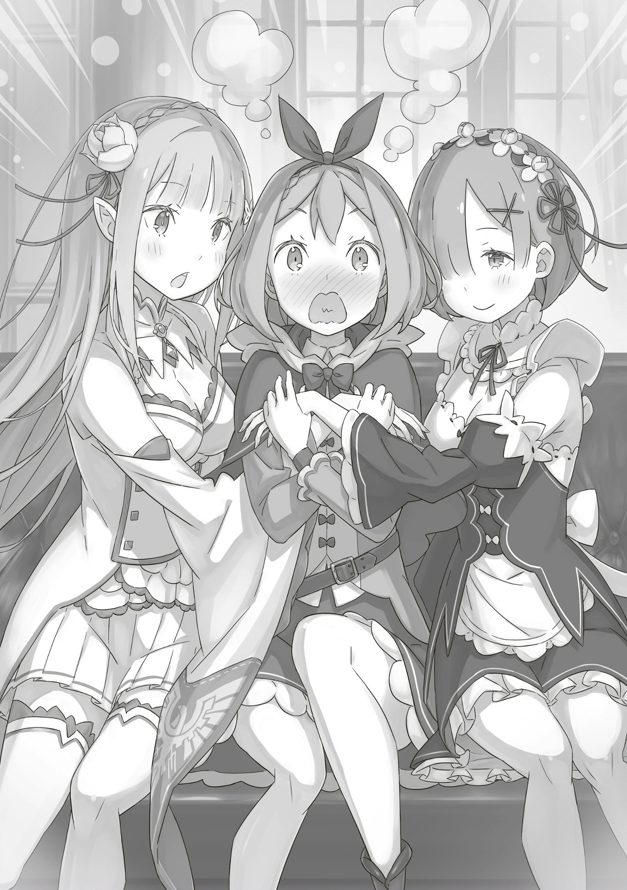

— Прошу прощения… Я тебя сильно побеспокоила…

— Да что ты, не стоит. Рем, напротив, только и рада, что ты расплакалась от счастья. Мне было радостно так же, как если бы порадовалась сестра… ах.

Петра все склоняла голову в извинении за только что устроенную сценку. Пока она пыталась её утешить, Рем, напрягшись, поняла, что ляпнула лишнего, как только взглянула на Рам; та улыбнулась в ответ на её взгляд.

— Ничего страшного. Как ни крути, Рам — лишь жалкая старшая сестра, что даже спокойствие сохранить не может в душещипательный момент воссоединения. Ничего уж не поделать, если Рем всем начнет разбалтывать, какая я плакса.

— Н-ничего подобного! Сестра совсем не плакса, это просто недопонимание! И я была так счастлива, что сестра заплакала!

— Рам, вот именно. Ты ведь наконец-то вспомнила Рем! Повод такой, что никто и не подумает, что ты плакса. Выше нос!

— Рем, Эмилия-сама… хнык-хнык…

К утешениям присоединилась и Эмилия, отчего Рам, прикрыв глаза, отвернулась. Этот её вид встревожил девушек ещё больше, однако Петре эта сценка показалась уж совсем далеко зашедшей. Хотя, сомнений нет, для Рам событие это было настолько радостным, что слезы и вовсе сами наворачивались.

— Сестренка Рам, понимаю, что ты рада, но не стоит их дразнить.

— А?!

— Дразнить…?

Глаза у Эмилии и Рем стали как пять копеек, как только Петра, кое-как успокоив голос, сделала замечание. Злая Рам же наконец перестала притворно плакать и, пожав плечами, сказала:

— Пожалуй, ты права. Просто память вернулась, и мне так сильно захотелось взглянуть на разные мины Рем, что от этой пакости не смогла удержаться. Простишь свою глупую сестру?

— Сестра… Ух, ну что с тобой поделаешь. Но только на этот раз, ладно?

— Да, благодарю. Эмилия-сама, вы ведь тоже простите?

— Ну-у, раз уж Рем тебя простила, то я тоже вечно зуб на тебя точить не буду. Просто удивительно.

— Ну на~адо же. Даже не извинилась. Просто ведет себя миленько, и ей все с рук схо~одит.

С изумлением пробормотала Мейли, ставшая свидетельницей сценки: Рем с Эмилией с легкостью простили надменность Рам, в которой не чувствовалась и толика раскаяния. Удивление Мейли также разделяла и Петра. Да, это было вполне в духе Рам, однако сейчас она уж слишком переборщила.

— Я тоже была бы рада устроить праздник в честь Рем… сестренки Рем, но сейчас далеко не то время, так что, сестренка Рем, прошу проявить терпение.

— Терпение, значит. Вроде бы, звучит разумно, но, Петра, что насчет тебя самой?

— …? Что ты имеешь в виду? Я же уже извинилась за то поведение…

— Я не хочу упрекать тебя за то, что ты раскисла. Волнует другое. …А именно то, как ты удобно устроилась меж Рем и Эмилией-сама.

Петра от этих слов, сказанных Рам с прищуром, опешила, а затем взглянула по сторонам, на сидящих рядом с ней Эмилию и Рем. Они втроем сидели на длинном диване, с Петрой по центру. Девочка крепко держала их за руки, словно боялась их вновь отпустить.

— Упс!

м

— Какое ещё «у~упс»? Ты так есте~ественно к себе её притянула. Да и сестрицу Эмилию за комп~анию.

— П-простите. Видимо, плотина моей любви к вам обеим рухнула…

Петра начала было уже оправдываться. Однако звучало это точь-в-точь как недавнее притворство Рам, так что та лишь рассмеялась в ответ.

— Петра-сан, да не волнуйся ты. Рем тоже хотела бы закрыть все появившиеся пробелы в памяти.

— Сестренка Рем…

— Да и Рем казалось, что мы с жителями, и с тобой, Петра, не очень-то и ладим, так что мне было приятно узнать, что вы так дорожили мной.

Рем, чью руку все ещё прижимала к себе Петра, слегка залилась румянцем и смущенно улыбнулась.

С позиции Рем, её общение с Петрой достигло апогея за месяц до начала Королевских Выборов… как раз тогда, когда Субару оказался принят в особняк. До сего момента они лишь иногда пересекались. …Потому Рем не ошиблась: столь сильные чувства Петры к ней были связаны не столько с её собственными, сколько с… чувствами «Субару».

И все же, думала Петра…

— Сестренка Рем так прекрасна, когда смущенно улыбается…!

— Петра-чан, у тебя аж уши покраснели. Все хорошо?

— А, нет, ничего…! Я не изменяю… Сестренка Эмилия все так же на первом месте!

— А? А… ну, да. Я же все-таки главная в нашем лагере, так что и вести себя должна подобающе, да?

Петра сболтнула лишнего из-за переизбытка чувств. Однако Эмилия пропустила всё мимо ушей, подобно ангелу, богине, ну, или просто главному герою, который совсем ничего не понимает.

Прижав ладонь к колотящемуся сердцу, Петра сказала самой себе: «Мой номер один — это только Субару…!» — и встала. Ещё немного, и её сердечко, что было меж Рем и Эмилией, вот-вот разобьется вдребезги.

— «Молодчина, Петра! Выдержала!»

— Ну, Субару, готовься. Потом я тебе все выскажу. Изменщик.

— «Ты слишком жестока! Не даешь мне прикоснуться ни к Эмилии-тан, ни к Рем!»

Еле-как справившись с девичьими терзаниями, Петра свою затаенную злость обратила на Воображаемого Субару. Он же кружился по комнате, все прижимая платочек к глазам и радуясь возвращению памяти Рем. Петре осталось лишь вздохнуть от этого. А затем…

— Понимаю, что все на ушах из-за Рем, но сейчас стоит успокоиться. …Нужно поговорить о нем.

— …

Этот тихий шепот Рем заставил всех резко стать серьёзными. И, хотя обстановка и не была полностью расслабленной, однако, в отличие от нависшей угрозы, стала слишком уж «мягкой». Так что сама Рем, ставшая тому причиной, развеяла это. Какая же разумница. Какая же достойная.

— Рам, Рем, Клинд-сама вам же уже все рассказал?

— Да, в общих чертах. Да и вы сами видели те ужасы в столице. Надо же было до такого довести… Барусу ударил лицом в грязь.

— Сестренка Рам! Так нельзя говорить…!

— Прошу прощения, поправлю. …Мы все ударили лицом в грязь.

— …

Это её мнение легло тяжким грузом на сердце каждого. Они уже обсуждали это до появления Рам и Рем, но последствия деяний Ала и их масштабов заставляли только отводить глаза. Ром заговорил:

— Как бы там ни было, будем долго бездействовать — ничего не добьемся. Ответственность за это лежит на том, кто это сделал. Таково заключение.

— Ваша логика понятна, и Рам с этим согласна. Но все ведь не так просто, я права?

— …А непроста девчонка. И куда ж делась вся твоя дурость?

Пробормотал старик Ром, почесывая лысину и хмурясь от догадливости Рам. Рем же наклонила голову.

— Сестра, когда ты говоришь под «всё не так просто» ты имеешь в виду ответственность?

— Именно. Об этом поподробнее может рассказать Ром-сама. Уступаю ему.

— Свалила самое тяжелое на меня… Ну, ладно. Как девчонка и сказала, наши мотивы — это одно, а текущее положение дел не нужно ни нам, ни вам.

Проговаривая это, старик Ром указал толстым пальцем сначала на себя, а затем на Эмилию. Глядя на его палец, Эмилия моргнула своими фиалковыми очами.

— Для нас — само собой, но… и для вас тоже?.. И для Фельт-чан?

— В башне ведь был и наш Эццо. У него было поручение следить за башней до прихода официальной исследовательской группы Королевства, но он не справился. Да и даже Райнхард не смог остановить ни этого шлемоголового, ни «Божественного Дракона». Как итог, столицу знатно потрепали.

— Но ведь благодаря сестренке Эмилии на город не упали камни, да~а? И её всё равно ругают?

— Если б можно было зарабатывать славу, просто разбивая камушки, Райнхард бы это делал вечно. Мейли, в таких делах нужно, помимо результата, не забывать и о процессе.

Старик Ром медленно покачал большущей головой, нахмурившись, отчего Мейли надула губы. На деле в её недовольстве таилось разочарование от того, что заслугу Эмилии не оценили по достоинству. Поняв это, сребровласая девушка улыбнулась Мейли, отчего девочка, надувшись ещё сильнее, отвернулась. Старик Ром продолжил:

— Скажу о том, что вам точно и безоговорочно нужно сделать: для начала нужно остановить этого парня в шлеме… того, кто назвался Альдебараном, своими руками. Нельзя это поручать крайним или Королевству. И только после этого мы сможем поговорить о том, как исправить наши ошибки.

— Почему именно мы? Мы, конечно, приложим все усилия, но если Ала можно остановить до того, как он ещё больше наломает дров…

— Эмилия… ты не понимаешь. Речь уже не только об Альдебаране, ведь с ним… «Божественный Дракон». Проблема высочайшего уровня, которая рубит Королевские Выборы на корню… И чтобы исправить это, нужно, чтобы жрица «Дракона» — Кандидатка на трон — вернула «Божественного Дракона» на свое место. А если этого не сделать…

— …То и самим Королевским Выборам конец?

Старик Ром серьезно кивнул девушке в ответ. Петра же только сейчас поняла всю серьезность ситуации.

Все-таки самой основой Королевских Выборов, в ходе которых определяется следующий правитель, является именно пакт с «Драконом» и пророчества с «Драконьей Скрижали», без которых выборов и не будет. Простыми словами, это ритуал, в основе которого лежит невероятная сила «Божественного Дракона», без которого выборы состояться не могут.

— Потому и нужно, чтобы Кандидатка на трон сама же и остановила Альдебарана, что переманил к себе «Божественного Дракона». Это и есть главное условие, чтобы остановить весь ужас и продолжить Королевские Выборы.

Слова старого гиганта так и веяли убедительностью благодаря мудрости, заработанной на своем веку. И с ним никто не мог поспорить. Нельзя допустить, чтобы Ал разрушил мир. Но это не значит, что можно позволить случиться чему угодно, лишь бы мир не был разрушен.

После окончания битвы должно остаться…

— Нам нужно во что бы то ни стало сохранить то, куда должен вернуться Субару-кун.

— Рем…

Эмилия взглянула на только сказавшую это Рем. Встретив этот взгляд, синеволосая девушка просто не могла не сказать:

— Так ведь и есть, да? Он ведь поступил ровно так же и со мной: оставил комнату Рем прежней… благодаря тому, что Субару-кун так много обо мне думал, Рем смогла все вспомнить. И благодаря моргенштерну, который Субару-кун полировал каждый день…!

Заявила Рем, держа в руке шипастый шар с цепью… моргенштерн. Эмилия, потрясенная лязгом цепи и твердостью девушки, склонила голову.

— …Благодаря моргенштерну?

— Да. Вы, может, удивитесь, но произошло это как раз в момент, когда я коснулась этого моргенштерна. И вся моя прежняя память тут же вернулась… Я считала, что это просто была его одержимость, но нет… Мне так хочется перед ним извиниться.

Словно стыдясь самой себя, Рем потупила взгляд. От её пылкой речи Эмилия растерянно заморгала и замахала руками.

Дело, наверное, было в совпадении. …Ал высвободил «Чревоугодие» из Тюремной Башни, а Архиепископ уже, видимо, постарался над возвращением «Воспоминаний» и «Имени» Рем. А произошло это в тот же момент, когда Рем прикоснулась в моргенштерну будучи в особняке. И потому она посчитала, что пробудил её именно моргенштерн.

— Рем, успокойся и послушай меня…

— Не волнуйтесь, Эмилия-сама. Этим самым моргенштерном я обязательно верну Субару-куна. А после этого я хотела бы поговорить с вами и об Империи, и о будущем…

Эмилия так и осталась растерянно стоять перед твердо настроенной Рем, сжавшей кулаки. Мейли, что была рядом с ней, взглянула на Рам и спросила:

— Не остановишь её?

— Что уж поделать. Даже Рам такого не ожидала. …Кто бы мог подумать, что те байки Барусу про то, что он каждый божий день полировал эту штуку, пригодятся.

— …То, что я кажусь здесь самой адекватной, — совсем не есть хоро~ошо.

Посетовала Мейли на то, что Рем слишком уже поверила в эту силу моргенштерна.

В общем, нужно было рассказать Рем и остальным о «Чревоугодии», в том числе и о том, что пока было лишь догадками. Поручить это можно было Эмили — решила Петра. Не упуская из поля зрения удивительное единение Эмилии и Рем, она повернулась к старику Рому. И…

— Клинд-сама все ещё не вернулся с Господином и остальными… но времени у нас нет. Мы с вами — теперь союзники, да?

— …Продолжение Королевских Выборов — цель общая.

— Тогда… скажите. Скажите, что вы заметили в поведении Ала.

Старик Ром, что присоединился к ним на тракте и прилетел в столицу. В силу «сжатия» Клинд решил продвигаться отдельно от Без-Моз-Гов. Он уже намекал, что в бою с Алом ему удалось узнать о нем что-то важное, что могло бы пригодиться в их совместной борьбе. За время этой дискуссии лагеря Эмилии и Фельт стали не разлей вода. Так что была уже пора и раскрыть карты друг другу — вот что хотела Петра от старика Рома.

В ответ на требование девочки старик хлопнул себя по лысине.

— История эта очень дикая и неправдоподобная. Помалкивал я не потому, что хотел себе цену набить, а именно потому, что вы могли не поверить.

— Все хорошо, дедушка Ром. Вам я верю. Правда верю, да так сильно, что вы бы удивились, если б узнали.

— …Ты тоже девчонка довольно странная, Петра.

Сказал он с изумлением. Старик Ром счел слова Петры лестью, однако… девочка на самом деле не лгала. Она ему правда доверяла, ибо знала, что он дорожит Фельт, которую Ал и его люди взяли в заложницы, и что он — дедушка, который готов без колебаний пожертвовать собой, лишь бы Фельт жила. А потому и уровень доверия был таков с самого начала.

Не знающий об этом старик Ром, поглядывая на Эмилию с Рем, которые все ещё дискутировали по поводу ситуации, произнес:

— Расскажу об этом и Эмилии с остальными потом… но Альдебаран, похоже, пользуется запрещенным приемом, которое называют Полномочие.

— «…Полномочие?»

Старик Ром осторожно подобрал слово, и раньше Петры отреагировал «Субару». Юноша, прекратив кружиться в воздухе, замер и уставился на старика Рома. Реакция его была вполне нормальной. Как раз недавно Петра и «Субару» слышали это слово от Клинда, но для них смысл был куда более зловещ.

Ибо было это то слово, которое говорили Архиепископ Греха «Лени» и покоящаяся в Святилище «Ведьма Жадности».

Великое право, сила, что вмешивается в саму основу мира сего и что переворачивает концепции, позволяя самовольно переписывать законы.

А причина, по которой старик Ром решил, что Ал использовал именно эту силу, заключалась в том, что…

— …Похоже, этот ублюдок может возвращаться в прошлое. Пускай и ненадолго.

△ ▼ △ ▼ △ ▼ △

…Так что же я должна делать?

Этот «вопрос» не отставал от нее ни на шаг с тех самых пор, как она оказалась во власти шайки Альдебарана.

— Тьфу, до чего ж бесит.

В сердцах выплюнула Фельт копившееся столько долго негодование, почесав голову.

Она знала, что чувства бессилия и смирения в жизни бесполезны, но они, не утоляя ни жажды, ни голода, так и норовили охватить всю её душу и заполнить собой, мешая ей как только можно.

— …Тц.

Цокнув, Фельт откусила от вяленого мяса — её ужин — кусок. Слишком соленое. Этим вкусом она была недовольна. Фельт с удивлением отметила, какой же уже избалованной стала.

Прошло всего два с половиной дня с разлуки, а она уже скучает по еде Флам и Грассис. Да даже по той стряпне Эццо и Рачинса, у которой был слишком насыщенный вкус и которая лишь изредка появлялась на столе; она была лучше в разы простого сухпайка. Райнхарду они готовить не разрешали, а то все остальные ругались, мол, у каждого есть свое место и роль. Однако она все равно иногда по-тихому просила Райнхарда испечь сладости — выходило очень даже ничего. Увы, Фельт и старик Ром готовить не умели от слова совсем. Оставалось только удивляться, как она вообще не умерла, отравившись, за те почти десять лет жизни на складе ворованного. А может, именно поэтому в росте она так сильно уступала сверстникам?

Но отложим кулинарные дела лагеря…

— Даже готовить не умею. Да что я вообще могу?

Фельт вернулась к тому самому «вопросу», прищурившись и слизав с пальцев крупинки соли.

…Сейчас их шайка старалась, постоянно перебегая из укрытия в укрытие, восстановить силы Альдебарана и «Божественного Дракона», что утомились после битвы в столице. Сначала Фельт думала, что после дел в столице они сразу же отправятся в пункт назначения — к Великому Гейзеру Моголейд, но, видимо, просто добраться до туда было недостаточно — нужно было что-то ещё.

Однако этот отдых назвать спокойным было нельзя… им постоянно мешали диверсии беспощадного преследователя — Отто Сувена.

— Браток-зоддовский не просто может говорить с букашками, у него какая-то дофига крутая Божественная Защита… Хотя, скорее крут он сам, а не Божественная Защита.

С виду Отто казался простоватым и даже немного глуповатым, но на деле он оказался куда более опасным человеком.

Да и в конце концов, любая Божественная Защита — лишь инструмент. Если у человека есть превосходный меч, но нет ни сил им взмахнуть, ни возможности, ни желания учиться, ни смелости пустить его в ход, то меч так и останется красивой побрякушкой.

А у Отто была и сила, и возможность, и желание, и смелость. …Так что Фельт была обязана доказать, что это у нее тоже есть, просто у нее нет меча.

— Стратегия братка — измотать нас… Что ж, хитро.

У шайки Альдебарана было ни минуты покоя, им было нужно постоянно отбиваться, а все благодаря Отто и его «Божественной Защите Духовной Речи» — он привлек не только жуков, но даже птиц с рыбами.

Жужжание насекомых, вой зверей, отравленная вода, испорченная еда — он доканывал их как только мог. Фельт не могла нормально выспаться, отчего у нее уже раскалывалась голова. Но к такому она была готова. Была б возможность, она б сама присоединилась к Отто, воспользовавшись своим положением спутницы оппонента.

— То, что я сдерживающий фактор для «Божественного Дракона», — уже само по себе что-то да значит, наверное…

Но, как показала битва «Божественного Дракона» и «Демона Меча», это не особо что-то и значило. Даже если присутствие Фельт и ослабляло «Божественного Дракона» на десять процентов, у остальных девяносто была мощь, равная стихийному бедствию. Даже если старик Ром вновь бросит Альдебарану и его шайке вызов, текущее положение дел таково, что это ничего не даст.

Это и был тот самый «вопрос», что мучал плененную Фельт.

— Нет, есть кое-что ещё.

Пробормотав это, она взглянула на другой «вопрос», что был прямо перед ней.

— …

Напротив нее, по ту сторону потрескивающего костра, сидел мужчина. …Нет, «напротив» — не совсем то слово. Ведь он опустил голову и даже не взглянул на нее.

То был красноволосый мужчина, что сидел тихо, словно мертвый, все прижимая к груди меч в ножнах. И от него так и веяло унынием. …Это был Хейнкель.

Вдвоем с Хейнкелем они сидели у входа в пещеру, ожидая остальных, что отправились прошерстить округу в поиске помех. Вместе они делили это гнетущее время. Формально Хейнкель должен был быть её стражем, но, вспоминая то, кто на кого чаще поглядывал, было вовсе непонятно, кто кого охраняет. Фельт бесило поведение Хейнкеля, ведь он отказывался от всего: от внешнего мира, от ужина — вяленого мяса — и даже от воды.

— …

Фельт решила, что не будет судить его поступки по «хорошо» или «плохо». Она не собиралась лгать… но все-таки у нее была своя шкала «нравится — не нравится». И Хейнкеля, поведение которого можно было назвать живым призраком, она оценивала как «очень не нравится».

— Эй. Не хочешь есть мясо — так отдай мне.

— …

— Ты же слышишь, да? Хватит меня динамить… ой, чёрт.

Словно говоря ей «заткнись уже», он бросил ей мясо. Она поспешно его поймала, однако мужчина так и не взглянул на нее. Почувствовав себя дурой, Фельт опять окликнула его:

— Эй. Нахрен ты сюда тогда влез?

Она без обиняков решила заговорить о том, почему Хейнкель был сейчас вот такой.

— …

Мужчина продолжал молчать, но раз мясо он бросил, то от внешнего мира все-таки полностью отказаться не смог. Фельт, поняв это, хмыкнула.

— Твой батя… сложно выговорить. Дед Райнхарда и «Божественный Дракон» подрались. Я не то чтобы воин, так что судить, кто в той драке победил, не могу, но ты ведь должен быть на стороне «Божественного Дракона», так?

— …

— Раз ты вмешался, то, значит, подумал, что «Божественный Дракон» в опасности. Это само по себе просто удивительно, но есть одна странность. …Раз твоя цель — «Драконья Кровь», то, получается, момент, когда твой дед победил, был бы для тебя просто идеальным.

— …

— Если бы «Дракон» умер, ты бы смог получить и кровь. Так почему же ты помешал?

Пользуясь тем, что он не возражал, Фельт без тени застенчивости продолжала говорить.

Как она и сказала, зная его цель, то вмешательство в бой было слишком нелогичным. Можно было сказать, что он просто ненавидел отца, однако, прежде чем улететь с «Божественным Драконом», он попросил того исцелить Вильгельма. Значит, Хейнкель не желал в том бою ни смерти «Божественного Дракона», ни «Демона Меча».

— Полным-полно несостыковок. Чего же, твою мать, ты хочешь…

«…добиться», — не договорила она, и в этот же миг… её повалили на землю, а к горлу приставили лезвие.

— Дохрена болтаешь, девчонка.

Прямо перед собой она лицезрела голубые, налитые кровью глаза Хейнкеля. От него так и разило кровью — видимо, губу прикусил, — отчего Фельт поморщилась. Хейнкель же, угрожая, провел лезвием по её коже.

— Если не хочешь, чтобы было больно, держи рот на… ГХА?!

Фельт всадила ему кулаком в нос.

— Ч-что?

Мужчина захлопал глазами. Он был ошарашен не столько силой удара, сколько самим ударом. Фельт, поднявшись, пнула его в грудь, и тот упал на землю. Девушка посмотрела на него сверху вниз.

— Ты что, думал, я тебя испугаюсь?

Сказав это, она подобрала лежавший рядом меч Хейнкеля. Мужчина ненадолго замер, и Фельт бросила ему оружие. Рефлекторно поймав его, Хейнкель уставился на девчонку, однако она лишь пожала плечами.

Он, видимо, удивлялся, почему она вернула меч, но для нее самой это было очевидно: даже если бы она сейчас взбунтовалась, Хейнкеля ей не победить, а если бы тот, не дай бог, зарезал бы её, то Яэ была бы на седьмом небе от счастья. Да и то, что Яэ их тут оставила наедине, говорило о многом: шиноби хотела избавиться от обоих — и от Фельт, и от Хейнкеля. И чтобы не играть ей на руку, бунтовать сейчас было ой как неразумно. …Да даже если не учитывать это, Фельт просто казалось, что избиение Хейнкеля — задача не её.

— Но и это как-то не так, если это задача Райнхарда.

— …!

Хейнкель заметно дрогнул, как только она упомянула Райнхарда. Было невероятно жалко видеть, как мужчина вдвое старше нее вздрагивает от одного лишь слова. И Фельт хотела знать причину этого. Даже если правда будет горька на вкус.

— Можешь молчать, как и прежде. Буду говорить я, а слушать ты.

Отряхнув испачканную от падения одежду, Фельт взглянула на небо. В просвете между скалами на ночном небосводе ярко сияли звезды. И глядя на это, она продолжила:

— По правде говоря, все, что меня напрягает в той драке, — это то, что я уже сказала: ты, вроде бы, и хочешь «Драконью Кровь», но поступаешь странно. И ещё одна несостыковка. …«Чревоугодие».

— …

— Опустим, что у этого парня характер мерзотный и что не лезет за словом в карман. Да даже без этого Архиепископ Греха — тот ещё ублюдок, которого вообще никто видеть не желает… но у тебя ведь есть куда больше причин его ненавидеть, да?

Продолжавший молчать Хейнкель затаил дыхание. Даже без слов была понятна его реакция, и Фельт прищурила глаза.

Было бесконечно много причин ненавидеть Лоя Альфарда — Архиепископа Греха, высвобожденного из Тюремной Башни и примкнувшего к Альдебарану. Но у Хейнкеля должна была бы быть куда более внятная причина для вражды. Ведь то, что случилось с матерью Райнхарда — женой Хейнкеля… беспробудно спящей Луанной Астрея, было слишком уж похоже на деяние «Чревоугодия».

— Я уже говорила о том, что знаю о делах твоей семьи… семьи Райнхарда. И о том, что твоя жена спит уже больше десяти лет и что способа её пробудить не найти. Ну, вроде как с этим и должна помочь «Драконья Кровь»… но что насчет мести?

— …

— Что ты собираешься делать с тем, кто уложил в постель твою жену на десять с лишним лет?

После нападения на герцогиню Круш Карстен и битвы за Пристеллу, когда стали известны последствия действий Полномочия «Чревоугодия», узналось, что «спящие красавицы» — жертвы, о существовании которых никто не помнил, что были отрезаны от самого мира и найдены уже беспробудно спящими, — были никем иными, как жертвами Культа Ведьмы.

Разумеется, и до Хейнкеля это тоже дошло. Но при этом он все равно был равнодушен к «Чревоугодию», которое как раз и могло быть причиной сна его жены.

…Потому что для него важнее получить «Драконью Кровь» и пробудить жену?

…Или ему просто не до того, ибо он только что ранил отца и искупался в его крови?

Или…

— Если тебе правда все равно, так почему же?

— Х-хватит…

— Можешь не отвечать. Я же сказала. Я буду говорить, а ты слушать.

Хейнкель, чья дрожащая рука сжимала меч, с бледным лицом посмотрел на Фельт. Его лазурные глаза, унаследованные от рода Астрея, встретили глаза красные. Теперь она была полностью уверена в своей догадке.

В глубине его глаз все ещё горел очень слабый, но неугасающий огонек. …Видимо, это и есть тот самый жар, что горел в глазах старика Рома, когда он глядел на Фельт.

— …

Хейнкель Астрея. Он казался отчаявшимся, эгоистичным до мозга костей, не знающим ни в чём меры, к тому же бесхребетным и абсолютно безнадежным человеком. …Но что, если тот едва различимый огонек, мелькнувший в самой его сути, всегда был неотъемлемой, пусть и скрытой, частью всех поступков этого мужчины?

— А не смотришь ты на «Чревоугодие» потому, что прекрасно знаешь: оно никак не связано с тем, что твоя жена уснула. Понимаешь, что это тут совершенно ни при чём, потому и меч свой на них не поднимаешь. Но…

…Однако ситуация «спящей красавицы» Луанны Астрея кардинально отличалась от других.

В отличие от прочих «спящих красавиц», что с миром уже никак не связаны, Луанну помнили все: и Райнхард, и Хейнкель, и каждый, кто был ей близок. Все они глубоко скорбели о её вечном сне. А это означало лишь одно: Луанна Астрея не была жертвой «Чревоугодия». И Хейнкель, зная это, никому не открывал правды.

Почему? Потому что никто не должен был узнать её. …Причину, погрузившую Луанну в этот сон.

А причина эта…

— …Райнхард.

— …

Застывший взгляд широко раскрытых глаз, замершее, лишённое дара речи лицо, едва слышный, безжизненный вздох — всё это стало ответом красноречивее любых слов и лишь укрепило Фельт в её догадке.

Что она должна была сделать? …Узнать. Таков был нынешний её «вопрос».

И желание постичь истину, и уверенность в этом «вопросе» привели её к горькой правде. А правда эта заключалась в том, что…

— …Так это Райнхард, скотина, усыпил свою мать?
