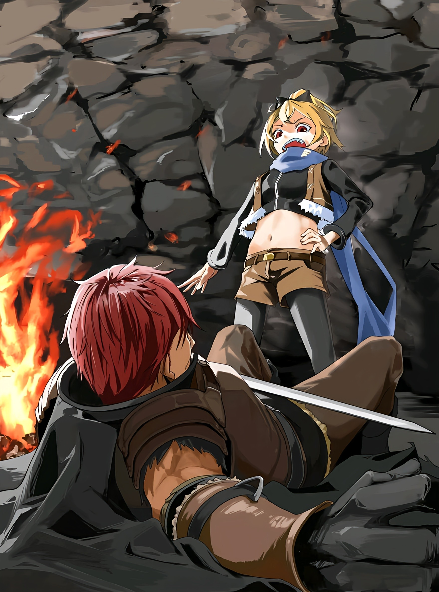

— Господин Субару и леди Беатрис захвачены человеком по имени Альдебаран. Прискорбно. В настоящее время под руководством госпожи Эмилии разрабатываются ответные меры. Доклад.

Прилетев на крыльях Полномочия «Уныния», Клинд принёс такую вот весточку. Розвааль же ощутил странный разлад. Его холодный разум мгновенно принял новость, а вот душа справлялась так себе.

Находился он в особняке Бариэль — резиденции, что досталась покойной Присцилле от её почившего мужа Лейпа, а теперь стояла без хозяина. Он отделился от основной группы и прибыл сюда вместе с Шультом.

Именно в одну из комнат этого особняка и явился дворецкий со своим докладом.

По правде говоря, ему совсем не нравилась затея Субару тащить убитого горем Ала в Сторожевую Башню Плеяд.

На возвращение юноши с земель Империи и так ушло немало времени. Да, там была и Рем, но он не обманывал себя — его главной целью было возвращение рыцаря Эмилии, а судьба служанки была второстепенной.

Конечно, её возвращению тоже все были рады, но на оптимизм времени не было. Нужно было навёрстывать упущенное в Королевском Отборе. И в этот самый момент Субару обратился к нему с идеей пойти к Башне.

Как же расставить приоритеты? Он пытался переубедить его, взывая именно к ним, но изменить его мнение не смог, и план был утверждён.

Впрочем, нельзя сказать, что в этом решении не было плюсов.

— Прошу вас, позаботьтесь о господине Але… — произнёс мальчик, склонив свою курчавую розоватую голову.

Хоть Шульт и дитя, но умён он не по годам и старается быть сильным. Смерть госпожи стала для него огромным шоком, но мальчик упрямо стоял на тонких ножках, дабы не посрамить её память. К тому же, он дружил с Алом, и очень переживал за него.

Желание Субару помочь мужчине пришлось как нельзя кстати, в свою очередь помогая заручиться поддержкой этого мальчика.

Если сложить хорошее впечатление и услугу от имени лагеря, то вместе выходит огромное преимущество в дальнейшем Королевском Отборе, особенно в вопросе управления осиротевшими землями Бариэль.

Пусть поначалу Эмилия и Присцилла были соперницами, со временем они признали друг друга и сблизились. Теперь же, после гибели баронессы, полуэльфийка выступит наследницей её воли и поведёт за собой людей из её владений. А чтобы эта история выглядела правдоподобно, поддержка любимого мальчика покойной была необходима.

Девушка и сама сказала, что «хотела бы подружиться с Присциллой после окончания Отбора», так что можно и слегка приукрасить.

Именно поэтому, пусть и нехотя, он одобрил поход в Башню, а сам решил сопровождать Шульта.

Как оказалось, он ошибся.

— Если с господином Субару беда… то что с Гарфом? Что с ним? Он ведь пошёл с ними как раз на такой случай!

— К сожалению, в битве разумов-тактиков он проиграл и был тяжело ранен. В сознание не приходил. Мы возлагали надежды на его «Божественную Защиту Духов Земли», но, к несчастью, ранение произошло в отравленной миазмами земле Песчаных Дюн Аугрии. Эффект Защиты оказался слабее ожидаемого. Незначителен.

— Гарф…

Пока маркграф погрузился в размышления, стоявшая рядом Фредерика с горечью опустила голову, услышав о судьбе брата.

В её взгляде читалось не разочарование в его провале, а скорее облегчение оттого, что он жив, пронизанное тревогой за его страдания.

Розвааль этому тоже был рад, но…

— Не понима-а-аю. Господин Ал и в подмётки не годится Гарфиэлю. Хотя-я-я, мальчик ещё незрел духовно, так что вполне мог поддаться ментальной атаке. Такое то-о-оже могло быть.

— Это самый вероятный сценарий. Он слишком мягок, вот и всё.

— Доброту не стоит порицать. Не нужно подбирать столь суровые слова, пусть даже из лучших побуждений. Замечание.

— А вы, сударь, всегда находите время для подобных…

От заботливых слов Клинда Фредерика скрипнула клыками, а лицо её исказилось в сложной гримасе.

Познакомились они больше десяти лет назад, когда девушка покинула «Святилище» и стала служанкой, но пропасть между ними так и не исчезла.

Поначалу она обожала его, бегала за ним хвостиком, щебеча «братик, братик», но стоило ей повзрослеть, как отношения их резко изменились.

Розвааль-то знал причину и был на стороне своего дворецкого, но для девушки, от которой тот так резко отдалился, это стало предательством. Потому она люто его и ненавидит. Что ж поделаешь.

Как бы то ни было…

— Судя по твоему тону, можно предположить, что есть что-то ещё, из-за чего Гарфиэля нельзя винить единолично… Что же произошло-о-о?

— Оболочка «Божественного Дракона» Волканики теперь на стороне Альдебарана. В связи с этим «Святой Меча» Райнхард ван Астрея направился для его усмирения. Спешно.

— Что-о-о?! «Святой Меча»? Но раз так, то…

— Неужели господин Ал одолел даже Райнхарда?

— Сковал. Поправка. Вдобавок к этому в столице возникло множество проблем. Господин, я прибыл просить вас как можно скорее одолжить нам вашу силу. Предложение.

Услышав это, маркграф задумчиво прищурился.

Хоть от изумления глаза Фредерики и были на орбите, их мысли текли в одном русле. С той лишь разницей, что, даже находясь под шквалом ошеломляющих новостей, Розвааль всё ещё мог думать и выбирать.

И главным на повестке дня было… Не пришло ли время исполнить обещание, данное Нацуки Субару?

— …

После «Святилища», ещё до того, как юноша стал рыцарем, он поведал ему о своих взглядах и позиции.

Раз тот поклялся спасти всех, то если впредь упустит хоть кого-то, маркграф без колебаний заставит его начать заново. То есть, сожжёт дотла самое дорогое для него, отказавшись от мира, в котором сам сейчас существует.

— Смерть Присциллы — случай сложный.

Входила ли она в то самое «всех» — вопрос спорный.

Её гибель лишь усиливала позиции Эмилии, а потому он счёл этот случай не подпадающим под условия их договора. Более того, судя по всему, отменять её смерть и не следовало.

Она сама выбрала свою судьбу.

И пока это не касалось ключевых для него фигур, он не видел причин не уважать её волю.

Но вот нынешнее положение Субару было крайне тяжёлым.

По словам Клинда, явных жертв не было, но, учитывая ситуацию, это лишь вопрос времени. А раз трагедия неизбежна, не лучше ли заставить юношу начать с чистого листа прямо сейчас, пока он загнан в угол?

И если для этого нужен будет толчок, то он его обеспечит.

Но…

— Беатрис…

Его последняя надежда теплилась именно в ней.

И она опиралась не на то, что малышка — Великий Дух и искусный маг Тьмы. Не на то, что она — высшее творение «Ведьмы Жадности» Ехидны, величайшего мага в истории. И даже не на священную клятву защищать своего контрактора до последнего вздоха.

Надежда крылась в совершенно непостижимом, иррациональном, безосновательном желании.

Ему просто хотелось верить в неё.

— Господин маркграф, прошу вас, отправляйтесь! — слова эти принадлежали не Фредерике и не Клинду, а маленькому мальчику, который до этого просто молчал, слушая как решается судьба владений Бариэль.

От внезапного появления дворецкого и его доклада он лишь вздрагивал, охая и ахая от удивления, но сейчас с его лица исчезла — нет, была усилием воли спрятана — почти вся прежняя робость.

Эту незримую маску, за которой скрывается нечто сокровенное, люди называют мужеством или решимостью.

— За то, что совершил господин Ал, я приношу извинения от его имени. А потому прошу, не позволяйте ему впредь творить что вздумается.

— Господин Шульт…

— Со мной всё будет в порядке. Все в особняке помогут мне ради госпожи Присциллы… Так что, пожалуйста, прошу вас! — сказал он и низко поклонился.

Глядя на его дрожащие плечи, служанка обернулась к Розваалю. В её взгляде читалась безмолвная мольба. Она хотела исполнить желание ребёнка и самой помочь ему. Но…

— Чтобы исполнить эту просьбу наилучшим образом, я не могу оставить здесь Фредерику. Осо-о-обенно учитывая, что рядом с господином Алом теперь «Божественный Дракон».

— Господин, что вы имеете в виду?

— Этим вопросом я намерен заняться лично. Приложу к этому свою руку.

Девушка нахмурилась, не понимая, какая связь между ней и высшим существом, но прежде, чем кто-либо успел ответить, вперёд выступил Клинд.

Замешательство её лишь усилилось, но маркграф всё понял. Слова дворецкого несли в себе куда более глубокий смысл.

Он-то думал, что, сколько бы речей ни было произнесено, тот никогда больше не примет подобного решения.

Но встретившись с его взглядом, мужчина лишь едва заметно улыбнулся и сказал: — Слишком ослепительное сияние одной души пнуло меня под задницу, не дав остаться обычным зрителем. Зависть.

△ ▼ △ ▼ △ ▼ △

— Похоже, он может поворачивать время вспять. Отматывает ненамного, но всё же, — произнёс старик Ром, и в комнате воцарилась тишина.

Эмилия изумлённо распахнула свои огромные аметистовые глаза. Рем несколько раз растерянно моргнула. Рам не скрывала откровенного недоумения, а Мейли, теребя косичку, лишь склонила голову набок.

— Что-то я не очень поняла, о чём вы говорите~е, — произнесла она достойную полуэльфийки фразу.

Возможно, будь здесь Клинд, он воспринял бы новость более хладнокровно, но его уже отправили за Розваалем, так что оценить реакцию дворецкого не удалось.

Может, оно и к лучшему, что ему не придётся выслушивать такое без должной подготовки.

— Поворачивать время вспять…

— «Посмертное Возвращение».

Едва дрогнувший голос Петры подхватил скрестивший руки на груди «Субару».

Девушка кивнула, но сейчас ей было не до радости от того, что её мысли совпали с мыслями любимого.

Полномочие.

Сверхъестественная сила, которую использовал Ал и которую раскрыл старик Ром после столкновения с ним.

Только так он мог одолеть Гарфиэля и Эццо в Сторожевой Башне, на равных биться с Райнхардом в Песчаных Дюнах, хоть и с помощью «Божественного Дракона», и прорваться через полтысячи бойцов лагеря Фельт всего-то с двумя союзниками на подхвате. Только так он мог выкрасть Архиепископа «Чревоугодия» прямо из-под носа разъярённой полуэльфийки.

Теперь всё вставало на свои места.

Конечно, так могло быть. Если Ал, как и Субару, владел «Посмертным Возвращением».

— Мы с ним из другого мира. То есть, вероятность, что сила у него похожа, была высока. Да и вообще, в историях про попаданцев такой поворот — классика! И почему я только сейчас до этого додумался?

— Значит, он и правда такой же, как ты?

— Похоже на то. Хотя, вполне может быть, что его версия «возвращения» даже удобнее моей. Ничего такого в этом нет, совсем одинаковые способности — это скучно. Наслаждаться различиями между ними — одна из прелестей таких историй.

— Когда на кону жизнь, плевать на классику и прелести! Важно то, что мы узнали его секрет. Вопрос в том… а что с этим делать?

— Да-да, мэм, совершенно верно… Но многое стало понятно. Так он мог и от Райнхарда сбежать, и в ловушку его заманить… или нет? Разве «Посмертное Возвращение» вообще поможет против него? Это же сколько раз умереть придётся?!

Осознав, с чем предстоит столкнуться, «он» схватился за голову.

По правде, хоть все и твердили обратное, Петра не думала, что «Святой Меча» так уж невероятен. Отчасти потому, что девушка не знала его лично, но в основном — потому, что если он так силён, то нет ничего удивительного в том, что он делает.

Куда более удивительным казался ей мужчина, который сталкивался с заведомо превосходящими его противниками, выжимал из себя все соки и раз за разом прыгал выше головы.

Поэтому ей было неприятно, когда этот «Субару» считал себя хуже Райнхарда. Она хотела, чтобы он расправил плечи, и с гордостью заявил, что круче. Хотя… пойми люди, насколько он хорош, появится новая проблема.

— Ну, я, сестрица Эмилия, сестрица Рем, а ещё Беатрис и Патраш… по-моему, группа идеальная.

Даже если кто-то захочет вклиниться… что ж, мест больше нет.

Единственное, что беспокоило — мысль о том, что сыграет доброта юноши, и он начнёт сопереживать врагу. В свою очередь, против этого играло понимание, что Эмилия для него всегда будет на первом месте. Впрочем, от этого же понимания у неё самой болела голова.

Так или иначе…

— Если старик ещё в своём уме, то дело дрянь, — сказала Рам.

— Язык у тебя острый, но я рад, что ты поняла. Именно эта его дрянь и позволяет ему выходить сухим из воды. И Эмилию, видать, обвёл вокруг пальца с её же помощью… — ответил ей Ром, собираясь развить мысль.

— Простите, я не очень поняла… — робко призналась полуэльфийка.

Рядом с ней Рем мило кивнула: — Я тоже. Поворачивать время вспять? Сестрица, это как?

— Да, ты только очнулась, так что ещё не в форме, нужно объяснить. Смотрите сюда.

— Это что, золотая монета?

Шагнув вперёд, Рам положила её на свою ладонь.

На ней был отчеканен тот самый «Божественный Дракон». Продемонстрировав её, служанка перевернула руку, и монета полетела вниз.

Петра тут же поняла её замысел. Монетка должна была наглядно продемонстрировать преимущества знания будущего…

— Осторожно! Какая ты неуклюжая!

— Но сестрице это даже идёт.

Но прежде, чем та коснулась пола, Эмилия проворно её подхватила, а Рем с улыбкой поддержала сестру. Выражение лица Рам, когда она молча забрала монету обратно, было поистине неописуемым.

— То есть, она хотела наглядно показать, что знай она заранее, что монета упадёт, то поймала бы. А так как не знала — не поймала. Да?

— Наверное. Вообще, так даже лучше, пусть сама им всё и объяснит. Сейчас у меня голова забита другим.

Как бы ни было жаль горничную, Петра решила положиться на неё, а сама сосредоточилась на следующей проблеме — что делать с Алом.

Нужно было узнать больше о его силе. Опровергни они догадку «Субару»…

— Ты в порядке~е?

— Мейли…

Пока умные втолковывали что-то заторможенным, девушка подошла к ней.

Она и сама не до конца поняла всю эту историю с временными прыжками, но, видимо, бледное лицо Петры беспокоило её куда больше способностей Ала.

Медленно протянув руку, она коснулась её лба и пробормотала: — Горяченький… Из-за суеты после Башни я молчала, но я знаю, что ты читала ту книгу~у, да?

— М-м-м, да. Спасибо, что не сказала остальным.

— Просто не хочешь их волнова~ать?

— Угу.

Она перехватила руку девушки и крепко сжала её в своих ладонях.

Похоже, лоб у неё и впрямь горячий. Но жар шёл не от болезни, а от пожара в мыслях.

И без того было над чем подумать, а теперь ещё её маленький мозг обрабатывал мысли сразу двух людей.

Наверное, дело было и в её сильной привязанности, но главной причиной было чтение «Книги Мёртвых» Субару. Подумать только, Эццо проглотил больше десятка таких книг — вот уж кто был настоящим безумцем. А предполагаемый создатель Башни, Флюгель, безумец вдвойне, раз придумал систему, с которой мог совладать лишь такой же сумасшедший.

Наверняка он из тех, кто считает, что то, что под силу ему, под силу любому — тип людей, который, к худу ли, к добру, всегда действовал ей на нервы.

И всё же она думала и о другом.

Если бы не библиотека, многое так и осталось бы для неё тайной.

А среди знаний было и то, чего она жаждала больше всего. И пока оно поддерживает огонь в её сердце, она не остановится.

Даже если в конце пути её мозг просто сгорит дотла.

— И знаешь, я думаю…

— Думаешь? О чём же~е?

— Если то, что сказал старик Ром — правда, и Полномочие господина Ала такое, как я себе представляю, то…

— Петра?

Она приложила палец к губам и задумчиво опустила взгляд, а Мейли с «Субару» посмотрели ей в глаза. Учитывая то, что первая не видела второго, реакции их были до смешного похожи.

Едва сдержав неуместную улыбку, она объявила: — Кажется, я поняла, в чём его слабость.

△ ▼ △ ▼ △ ▼ △

— Так это Райнхард, скотина, усыпил свою мать, — это мысль, которая далась ей с огромным трудом и горечью.

И дело было не в нём. Хотя, в каком-то смысле, именно в нём.

С самого знакомства этот парень выбивал её из колеи. Во всём, что с ним было связано, ей редко удавалось действовать так, как она привыкла. Отчасти из-за того, что он постоянно силой мешал добиться желаемого, а ещё потому, что при их самой первой встрече у дома краденого он застал её в слезах.

Но больше всего, наверное, из-за того, что он попросту от многого отказался.

Именно это мешало Фельт принять его. И это же было причиной, по которой он никогда не доверял ей по-настоящему.

«Будь сильным» — золотое правило трущоб, незыблемый закон, по которому она жила.

Где бы ты ни родился, кем бы ни был, только сила поможет выжить. И по её меркам, Райнхард сильным не был.

И как лев, и как Дракон, и как человек — он всего лишь недоделка.

Но если причина этого кроется в том, до чего она только что додумалась…

— Нет, тогда концы с концами не сходятся, — тут же отвергла она свою догадку.

Фельт почти не сомневалась в том, что он причастен к тому, что его мать до сих пор не проснулась. Но если он сам знает об этом, то его поведение не поддаётся логике.

Конечно, возможно он просто делает вид, что ни при чём, мастерски скрывая правду…

— Ха, смешная шутка. У этого олуха мозгов не хватит.

Вряд ли кто-то кроме неё мог назвать «Святого Меча» «олухом».

Те, кто видел в нём идеал, возмутились бы, но в её лагере подобное отношение к нему было вполне нормальным.

Сёстры Ремендис знали Райнхарда давно, а потому своей непринуждённостью часто смущали его. Гастону, Рачинсу и Кемберли в принципе всякое почтение было чуждо, так что они тоже не жалели едких и вполне заслуженных подколов.

Эццо часто вмешивался в дела земель Астрея, и каждый раз лишь бормотал что-то в духе: «Как они вообще до сих пор…». А Ром с самого начала смотрел на рыцаря косо, и близко к себе не подпускал.

Но больше всех в этом мире его критиковала, бранила и пачкала грязью она сама.

И всё это он принимал.

Принимал… и улыбался.

Улыбался так, будто ему это искренне нравилось.

Только в такие моменты казалось, что он ни от чего не отказывался.

— Он может скрывать чувства, но врать и при этом так искренне смеяться — нет.

Таково было её суждение… или же, вердикт. Вынести его мог лишь тот, кто видел в этом юноше не свои надежды, а Райнхарда. Таким, какой он есть.

Думали о нём так лишь члены её лагеря, его друзья-рыцари и…

— В список причин, почему этот мерзавец не умеет врать, придётся добавить то, что он твой сын, — обратилась она к человеку напротив.

После того как она ударила его по носу, он всё ещё сжимал в руке брошенный ему меч. Смертельная бледность окрасила его морду.

Хейнкель стискивал рукоять с такой силой, что кровь отхлынула от дрожащих пальцев, вторя мертвенной белизне его лица.

И по глазам его было видно, что причиной этой белизны был не гнев, не страх и не печаль.

Лучше всего здесь подходило слово «отчаяние».

Безысходное, неотвратимое отчаяние того, чью тайну раскрыли. Это чувство окутало его, сковало и загнало в угол.

Он выглядел так жалко, что, казалось, вот-вот рассыплется в прах под гнётом этой безысходности.

Но, скорее всего, Хейнкель не мог умереть так просто. Будь отчаяние смертельным ядом, оно бы давно его прикончило.

— Ах… кх… нет… ух… — беззвучно открывал и закрывал он рот.

Под звёздным небом, что взирало на них из расщелины в скалах, она прищурилась и задумалась об отношениях этих двоих.

Для неё самой он был и «Святым Меча», и сильнейшим в мире, и причиной разлуки со стариком Ромом, и ненавистным типом, заставлявшим её носить платья и туфли на каблуках.

Из-за всего этого она никогда не лезла к нему в душу… но слухи доходили до неё и против её воли.

Например о том, как с ним обращались в доме Астрея, и что о нём думало общество.

Чаще всего шептались о смерти предыдущей «Святой Меча» и причине передачи титула Райнхарду, после унаследования её «Божественной Защиты». О событии, когда он самолично остановил вторжение со стороны врагов из трёх государств в возрасте восьми лет. О несмываемом пятне на репутации… о том, что до вступления в рыцарский корпус он был на побегушках у своего отца.

Сам он об этом много не рассказывал, а она и не спрашивала, но несостыковок становилось всё больше и больше.

Именно последний слух никак не давал ей покоя.

Если это правда, то к чему все эти мучения Хейнкеля?

Она не наводила справок о сыне, но чтобы разобраться в правах на наследие дома Астрея, ей пришлось покопаться в биографии отца.

Репутация у него была отвратительная: никудышный рыцарь и никудышный отец. Но каждый раз, когда он использовал имя семьи, то делал это лишь в очередной попытке разбудить Луанну.

Нельзя сказать, что он бессеребренник, но роскошь была ему чужда. Судя по цифрам, вёл он до смешного скромную жизнь, вкладывая все средства в спасение жены.

Однако…

— Будь Райнхард у него на поводке, ему бы не пришлось так корячиться.

Ни по славе, ни по силе в королевстве с его сыном никто не мог сравниться.

Сам «Святой Меча» никогда этим не пользовался, считая правильным не выходить за рамки, но Хейнкель, если верить слухам, был другим.

Будь он тем, кем его считали, он бы давно дёрнул за ниточки, и использовал главный козырь королевства, чтобы самому не ввязываться в дрязги, вести переговоры, а если и понадобится, то доказывать свою правоту мечом.

Почему же он этого не делал?

Почему упрямо не впутывал сына, в одиночку пытаясь разбудить спящую жену?

Если Луанна для него дороже всего на свете, то ничто на другой чаше весов не имеет значения. Если только… там не лежало что-то столь же драгоценное.

А если так…

— Твой способ заботиться о близких… уж больно извращённый.

— …!

В тот же миг мужчина стиснул зубы, и в воздухе сверкнула сталь.

Спустя мгновение она ощутила порыв ветра от ауры меча и холод у шеи. Лишь тогда Фельт поняла, что сжавшийся от её слов Хейнкель в одно неуловимое движение обнажил клинок.

— Не… мели… чушь.

— Эй, хочу предупредить…

— Ни с места! — взревел тот. Его глаза налились кровью, а в уголках рта закипела пена.

Девушка прикусила щеку, проклиная себя за то, что слишком сильно прижала его к стенке.

В отличие от простой угрозы, когда она ударила его в прошлый раз, сейчас он действительно хотел её убить.

Она понимала, что это не из-за ненависти или простой ярости, а скорее из чистого животного страха. Именно поэтому девушка и думала, что зашла слишком далеко.

Пока она застыла, Хейнкель, глаза которого метались из стороны в сторону, прошипел: — Это наша семейная проблема. Я не позволю посторонним совать в неё свой нос. Тем более такой соплячке, как ты, знать больше…

— Больше? Значит, есть что-то ещё?

— Заткнись!

Стоило ей это сказать, как лицо мужчины исказилось, и он взревел. Клинок метнулся вперёд.

И в тот самый миг, когда он, казалось, должен был пронзить её…

— Не стоит так его злить.

— Гха?!

Возникшая из ниоткуда тень нанесла безжалостный удар по виску стоявшего на коленях мужчины, и он рухнул на землю, закатив глаза.

Над ним, сокрушённо пожимая плечами, стоял вмешавшийся в последнюю секунду Альдебаран.

Увидев его, девушка тихонько фыркнула: — Гадёныш, стоял и смотрел, пока совсем хреново не стало…

— А ты болтала, зная, что я тут рядышком и не дам тебя прирезать. Тоже не очень-то мило с твоей стороны.

— А мне и не нравится, когда меня называют милой, — показала она ему язык, даже не думая благодарить за спасение.

Девушка лишь убедилась, что лежащий Хейнкель жив, и вздохнула. Эти его последние слова… Значит, это была ещё не вся история.

«Святой Меча». Виновник сна собственной матери. Теперь к этому добавилась ещё какая-то тайна, которую так отчаянно бережёт его отец…

— Похоже, я больше не могу позволить себе просто ждать, пока он сам всё выложит. Это уже как-то безответственно.

— Ну и заявление. Ты хоть понимаешь, в каком сейчас положении?

— Сам говорил, что ничего мне не сделаешь. Разберёшься со своими делами и хочешь продолжить Королевский Отбор, да? Я-то хочу, чтобы ты проиграл, но мои действия в будущем от этого не изменятся.

— И не поспоришь.

Снова фыркнув махавшему ей Альдебарану, она осторожно высвободила меч из мёртвой хватки Хейнкеля и вложила его в ножны.

В холодном блеске меча с выгравированной надписью «Астрея» ей почудилась такая безжалостность, что внутри начала закипать злость.
