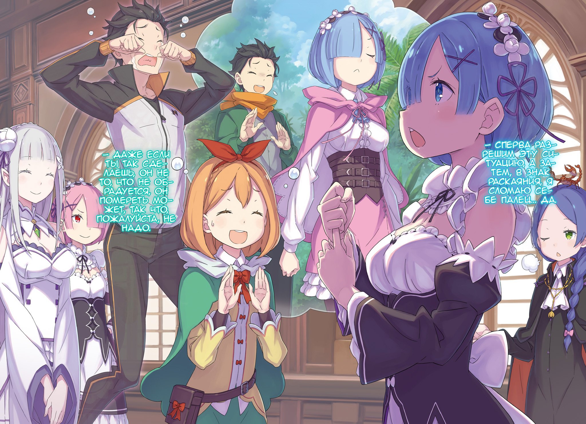
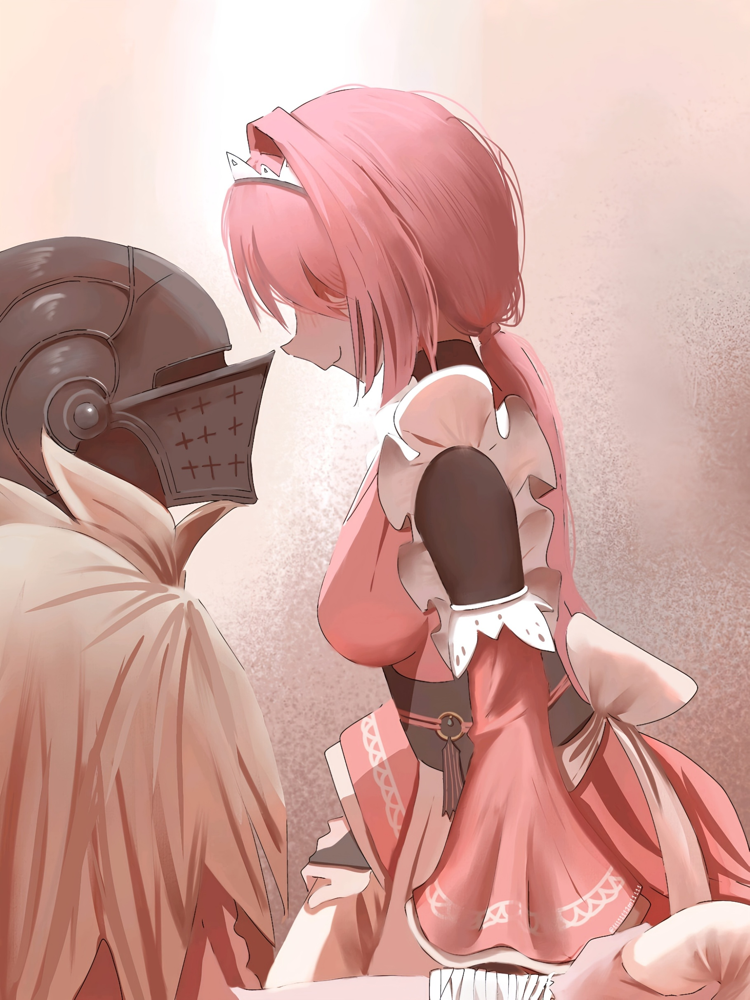
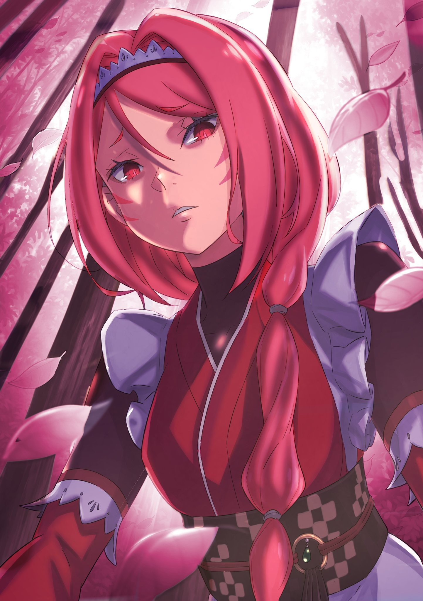
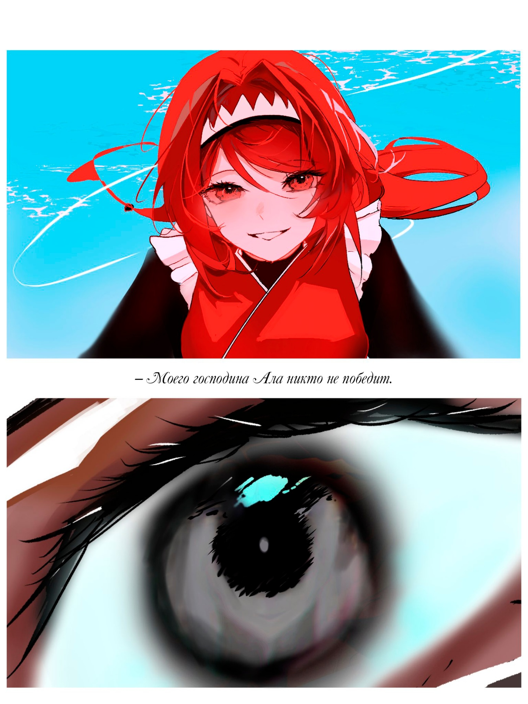
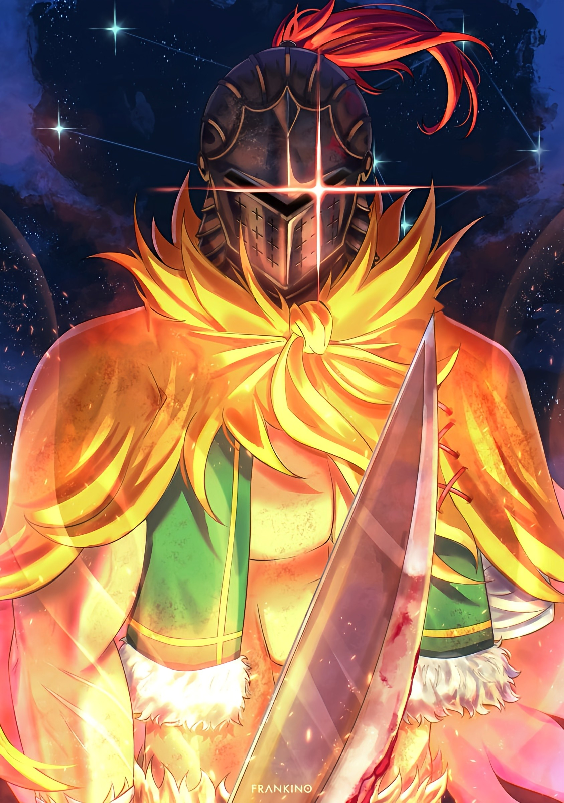
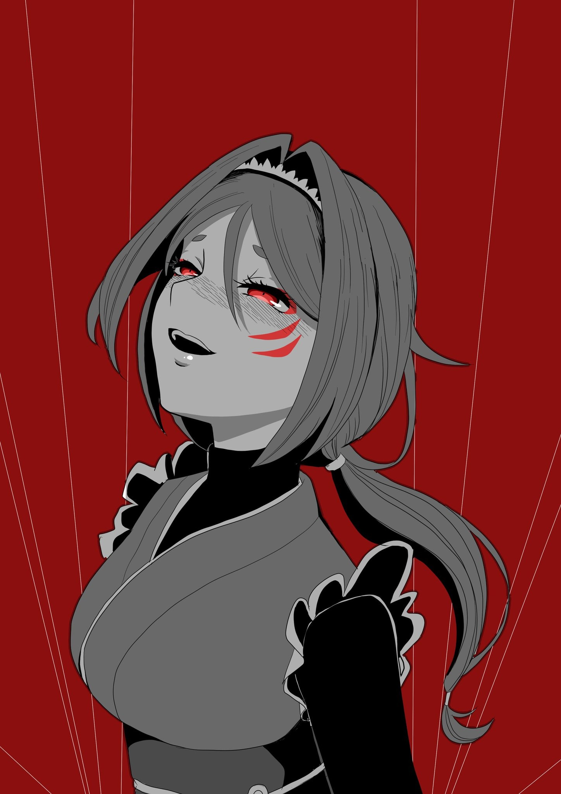

— Проще говоря, даже если вместо монетки на вас со всей дури будет лететь кулак Гарфа — вы уже знаете об этом, и можете легко увернуться, контратаковать и вынудить его реветь в три ручья.

— Понятно… Но погоди! Заставлять его так сильно плакать — это же жестоко! Я хочу как-нибудь мирно всё уладить.

— В таком случае бить в ответ не нужно. Просто продолжайте с невозмутимым видом уходить от его атак. Рано или поздно Гарф сломается, и всё закончится.

— Ну, тогда всё хорошо… Правда хорошо? Он ведь сломается, — растерянно пробормотала Эмилия, вертя в пальцах вручённую ей монету. Над головой её, казалось, повис огромный вопросительный знак.

В её воображении Гарфиэль то рыдал как дитя, то унывал и падал на землю. Несмотря на это, взявшая на себя роль рассказчика Рем с облегчением выдохнула. Похоже, суть Полномочия Альдебарана всё-таки удалось донести.

— Молодец. Объяснить всё так, чтобы госпожа Эмилия поняла — задача не из лёгких.

— Рада, что смогла помочь, сестрица. Хоть для этого и пришлось пожертвовать Гарфом…

— Он был бы рад, если бы для дела всего-то и нужно было, что поплакать да погрустить. Сейчас он беззаботно дрыхнет, так что Рам его позже проведает.

— Да… ты права. Он будет на седьмом небе от счастья, если сестрица его навестит…

Стоило Рам пожать тонкими плечами, как душу Рем кольнула досада.

Когда память вернулась, она вспомнила, что они с Гарфиэлем вечно соперничали за внимание её сестры. С самого детства она считала его не знающим своего места наглецом, и постоянно с ним ссорилась.

Но после всего, что они пережили в Империи, после всех разговоров по пути домой… относиться к нему по-прежнему она уже не могла.

Более того, он не защитил Субару и Беатрис. Очнувшись, Гарф наверняка впадёт в отчаяние и будет винить себя.

— Добивать его сейчас как-то жестоко… Понятно. Мне придётся уступить. Сейчас главное, чтобы он как можно скорее пришёл в себя и стал частью силы, которая спасёт его .

— Да. Хотя быть объектом твоей ревности не так уж и плохо. Если бы ты была против, я бы повременила с визитом.

— Сестрица прекрасно знает, что я такого не попрошу.

— Как знать, — с лёгкой улыбкой величаво ответила Рам.

Ослеплённая её сиянием Рем могла лишь вздыхать.

Сколько времени, сколько заботы сестры она потратила впустую — сперва пока спала, а потом из-за потери памяти.

Конечно, за неё волновалась не только она.

Рем доставила хлопот всему лагерю, да и людям за его пределами тоже. К счастью ли, к несчастью, но у неё и прежде почти не было друзей за пределами самого близкого круга, так что в этом смысле ущерб был невелик.

— Кажется, до возвращения памяти я куда свободнее общалась с леди Мизельдой, Катей и остальными… — к такому странному выводу она пришла, пролистывая в голове обретённые страницы своей жизни.

В Империи Волакия, в которую её случайно занесло, она, пусть и ради выживания, была куда общительнее, чем дома, в кругу близких.

А в довершение всего она снова и снова отталкивала одного юношу, который, несмотря на её холод и недоверие, отчаянно пытался быть рядом. Из-за этого хотелось себя просто взять и придушить.

— Говори он со мной, глядя в глаза… Но я же сама тоже… у-у-у…

Внутри боролись две Рем: первая хотела оправдаться потерей памяти, а вторая — верить в то, что, загляни она ему в глаза, она бы непременно почувствовала его искренность.

Но как бы то ни было, она доставила людям вокруг много хлопот. Субару в первую очередь. Так что теперь ей предстояло изо всех сил всё исправлять.

— Сперва разрешим эту ситуацию, а затем, в знак раскаяния, я сломаю себе палец… да.

— Даже если ты так сделаешь, он не то, что не обрадуется, он помереть может, так что, пожалуйста, не надо.

— А, леди Петра…

Поняв, что произнесла свои мысли вслух, девушка обернулась и встретилась с обеспокоенным взглядом Петры. Ей стоило бы промолчать, но она всё же упрямо выставила перед собой ладонь.

— Не останавливайте меня. Я так виновата перед ним… Если я не накажу себя за это, то просто не смогу смотреть ему в глаза…

— То есть, ты хочешь сделать это не для того, чтобы извиниться, а чтобы тебе самой стало легче?

— Я не это имела в виду…

— Даже если и нет, выходит-то так. Послушай, твоё самобичевание ему точно не нужно. Он хочет, чтобы ты наконец обрела то счастье, которого была лишена из-за сна.

— …

От этих слов и ласковой улыбки девушка поперхнулась.

Это нежное наставление напомнило ей далёкое утро после атаки зверодемонов на деревню Алам. Тот самый день, когда в её сердце зародилось нечто особенное.

Почему-то Субару того дня и стоящая перед ней девочка на миг слились воедино.

— Наверное, это лишь доказывает, как сильно он на всех повлиял…

— М-м-м? О чём ты?

— Ни о чём, просто ваши слова пробудили во мне что-то очень тёплое и важное. Помните инцидент со зверодемонами?

— Э-э, да, да… Помню.

От этого вопроса глаз Петры слегка дёрнулся. Её взгляд метнулся к девочке по имени Мейли, молча стоявшей в углу.

Очевидно, она присоединилась к их лагерю, пока Рем спала, и выполняла какие-то поручения в Королевстве, пока Эмилия и остальные находились в Империи. Сама горничная смутно припоминала её лицо, но почему Петра так странно на неё смотрит?

— Кхм. В общем, сестрица, пожалуйста, брось эти мысли. Если хоть один твой драгоценный фарфоровый пальчик пострадает, наступит конец света.

— Леди Петра…

— А если не перестанешь, в знак солидарности я тоже себе палец сломаю!

— Леди Петра?!

Девочка решительно сжала свой маленький кулачок, и от этого у Рем невольно дрогнул голос. Петра же, видя её реакцию, озорно улыбнулась: — Так что не смей, хорошо?

— Да… хорошо. — робко кивнула девушка в ответ.

Отчасти она поддалась её напору. Хотя, на самом деле, ей просто нечего было возразить этому до смешного «субаровскому» подходу.

Петра и раньше порой напоминала ей Субару, но то, что она сейчас сделала — на её крайность ответила собственной, скатив всё в абсурд, — было похоже на него.

— …

Пораженная тем, как сильно его влияние сказывается даже на этой девочке, служанка могла лишь молчать.

Нынешнее поведение Петры доказывало, что она понимает юношу лучше, чем сама Рем. Это могло бы перерости в зависть, но, как ни странно, она не испытывала к ней ничего такого.

Она не знала почему, но при мысли о нём её терзало что-то другое.

А именно…

— Полномочие… господина Альдебарана.

Та самая способность «Возврата во времени», которую она только что объясняла Эмилии.

Сестра помогла ей осознать всю ужасающую мощь этого дара, но пока уже она сама думала, как объяснить всё полуэльфийке, в её голове то и дело мелькала мысль.

Способность заглядывать в будущее и возвращаться назад, чтобы избежать беды…

— Неужели он…

Едва затеплившаяся искорка мгновенно превратилась в пламя, сжигающее все её мысли дотла. А на пепелище остались лежать угольки, разжёгшие пожар.

От Субару всегда исходил густой запах миазмов.

Время от времени он становился невыносимым, словно окутывая юношу с головой.

Сам юноша обладал необъяснимой проницательностью, позволявшей ему находить единственно верные пути там, где их, казалось, и не было.

Благодаря ему были предотвращены бесчисленные смерти. Она сама — живое тому доказательство.

Каждый из этих фактов по отдельности можно было счесть домыслом, но стоило добавить единственную невозможную деталь — Полномочие, — как всё поразительным образом вставало на свои места.

Но если… если её догадка верна, это значит, что парень по имени Нацуки Субару, обладая силой, которой нет равных…

— Использует её лишь ради других… До чего же непрактичный.

Имей он возможность перематывать время, он мог бы делать что угодно, перекраивать мир под себя.

Но он так не поступал. И Рем, главный пример его «неудачи», знала это лучше всех.

Если бы он пользовался своей силой для манипуляций, она бы никогда не сломала ему палец.

Выходит, он и есть лучшее доказательство его искренности.

— Всё-таки я тоже должна сломать палец, чтобы мы были квиты…

— Я же только что тебя отговорила!

— Нет, вы не поняли! Сейчас это не из-за вины, а чтобы разделить его боль! Это позитивное…

— Ни позитивное, ни негативное, ни в шутку, ни всерьёз — НИ-КА-КО-Е НИ-И-И-И-З-З-ЗЯ-Я!

В итоге, её порыв так никто и не услышал.

Но даже оставив в стороне эту идею, её убежденность лишь крепла: Субару обладает Полномочием, схожим с Полномочием Альдебарана. Вот только ни Рам, ни Эмилия, услышав о «Возврате во времени», похоже, не пришли к тем же выводам.

И дело не в том, что Рем лучше понимала его.

— Скорее, наоборот.

Полуэльфийка и остальные не заподозрили этого, потому что они, в отличие от неё, видели, как он трудится.

Судя по рассказам, пока она спала юноша заключил контракт с Беатрис и из кожи вон лез, чтобы стать достойным Эмилии рыцарем. Они видели его старания, а потому его успехи казались им заслуженными и естественными.

А Рем… она ничего этого не знала. Эта слепая зона в памяти разрывала её сердце на части. И именно поэтому её взгляд на его возможности так сильно отличался от мнения остальных.

Но это нисколько не умаляло его героизма.

Раз они оказались в такой ситуации, значит, даже Полномочие не всесильно. А значит он по-прежнему шёл вперёд, в первую очередь опираясь на свой ум, отвагу и друзей.

И она всё ещё может ему помочь.

— Раз так… Сестрица!

Субару в плену и ему нужна помощь. Придя к этому выводу, она решила поделиться мыслями, дать остальным новую пищу для размышлений.

Её догадка строилась на одном лишь чутье да нюхе демонов на миазмы, так что убедить их будет непросто, но она была уверена, что проницательная Рам и великодушная Эмилия отнесутся к ней всерьёз.

Она уже открыла рот, чтобы позвать обернувшихся к ней сестру и госпожу, как вдруг…

— Я только что вернулся. Прошу прощения за опоздание.

В этот момент, словно из воздуха, в зале особняка возникли две фигуры. Первая — красивый мужчина с пронзительным взглядом и моноклем — Клинд. А тот, кого он привёл с собой, был её давним и многоуважаемым хозяином.

— Розвааль! Ты пришёл!

— Да-а-а, Клинд мне всё рассказа-а-ал. Услышав, что Субару и Беатрис в беде, да и сам Королевский Отбор под угрозой, я никак не мог сетовать на усталость после путешествия по Империи-и-и.

— М-м-м, ты очень кстати. Присоединяйся к нам… но сначала… — поприветствовав появившегося высокого мужчину, Эмилия указала рукой на Рем, стоявшую прямо за его спиной.

— …?

Жест заставил Розвааля обернуться, а его разноцветные глаза сфокусировались на девушке. В ответ она приподняла подол юбки в изящном поклоне: — Господин Розвааль, я долго была в отпуске. Ещё раз благодарю, что забрали меня из Империи… Я вернулась.

— …

Услышав её, он замер. Из его груди вырвался тихий, сдавленный звук, и в то же мгновение он пошатнулся.

— Господин Розвааль! — тут же бросилась к нему Рам.

— А-а, нет-нет, всё в порядке… Просто… от такого потока информации я чуть не захлебнулся, — выдавил из себя улыбку он.

Должно быть, возвращённое «имя» Рем обрушило на него лавину «воспоминаний».

Было немного обидно, что это случилось не благодаря связи с так старательно полировавшим её моргенштерн юношей, но… наблюдать, как твоё пустовавшее место в чужой памяти снова занято, было по-своему приятно. Хоть и звучит это ужасно.

Как бы то ни было…

— С возвращением, Рем. Когда всё уляжется, мы обсудим, что творилось в особняке пока тебя не было… особенно то, что касается Ра-а-ам.

— Да. Жду с нетерпением.

Как и всегда, Розвааль быстро пришёл в себя. В который раз восхитившись его стойкостью, Рем уже собиралась продолжить разговор…

Но её вдруг потянули за рукав…

— Господин, а сестрица Фредерика с вами?

— А, её я оставил во владениях Бариэль. Раз уж взялись за дело, нехорошо было бы бросать юного Шульта на полпути, да и Клинд заверил, что сам справится с её обязанностями.

— Братец Клинд? А он сможет? — нахмурилась Петра.

— Сурово. Чтобы развеять ваши сомнения, мне придётся трудиться не покладая рук. Усердие, — пообещал обсуждаемый мужчина.

Краем глаза следя за этим разговором, Рем ощутила, как девочка всё ещё держит её за рукав, и невольно склонила голову.

— Леди Петра?

Легко понять, что она прервала её, чтобы сменить тему. Конечно, узнать, где находится Фредерика важно, но девушка чувствовала, что за этим скрывается нечто большее.

Вдалеке Эмилия уже знакомила Розвааля со стариком Ромом, объясняя, почему им необходимо объединить усилия, невзирая на то, что они из разных лагерей. Проследив за ними взглядом, Петра вдруг обернулась к служанке и тихонько поманила её пальцем.

И затем…

— Сестрица Рем, ты тоже заметила… насчёт Субару?

— Судя по вашим словам, вы знаете о…

— Дальше ни слова, — перебила её девочка, приложив палец к губам. — «Ведьма» может услышать.

— …

От этого Рем невольно замерла.

Петра не сказала прямо, но и тон, и сама недосказанность в точности отражали её догадки. Это было молчаливым подтверждением: она тоже всё поняла. И, судя по её следующей фразе, знала даже больше.

Сама мысль о том, что «Ведьма может услышать», казалась нелепой, но…

— Учитывая, что, по слухам, Райнхард удерживает «Ведьму Зависти» в Песчаных Дюнах Аугрии, к этому стоит прислушаться.

— Да, это связано. Я не полностью уверена, но думаю, что об этом лучше молчать… Я больше не хочу это переживать.

В голосе девочки была такая отчаянная, почти пугающая убеждённость, словно она на собственном опыте испытала, что бывает, когда произносишь запретное вслух.

Рем проглотила слова, уже готовые сорваться с языка. Но ведь это означало, что она не расскажет всем об истинных заслугах Субару…

— А его это вообще колышет?

У неё было два шанса узнать его: до потери памяти и после.

За эти два раза она поняла, что его преданность настолько чиста и жертвенна, что ему абсолютно всё равно, признают ли его заслуги.

Желание воздать ему почести, предать гласности все его жертвы было лишь её. Не его.

— Позволь спросить, — обратилась Петра к Рем, пытавшейся подавить в себе этот порыв.

Голос её тихим особо и не был, но служанка почувствовала, с какой осторожностью девочка говорила — так, чтобы её услышала только она.

В этой серьёзности она снова увидела что-то до боли знакомое, и кивнула.

И тогда прозвучал вопрос: — Сестрица Рем, ради спасения Субару ты готова на всё?

В нём она услышала невысказанное, но кристально ясное: «Я вот готова».

В душе её ревности не было. И на ответ не ушло ни мгновения.

— Да, конечно, — произнесла она без малейшего колебания. — Ведь я — Рем Субару.

△ ▼ △ ▼ △ ▼ △

Силы таяли с каждой минутой.

— Местную живность можно пустить на еду, воду — пить, облизывая магический лёд… но невозможность уснуть убивает.

Нескончаемые диверсии изматывали отряд Альдебарана до предела.

Самое мерзкое, что их большая часть была направлена не на то, чтобы ранить или убить, а лишь на то, чтобы измотать. Правда, время от времени, противник подкидывал сюрпризы вроде того обвала в каменоломне. Эта изощрённая тактика не позволяла расслабиться ни на миг.

И что самое паршивое — идеальной защиты от этого не было.

— Боевой министр… Хм, боевой министр… Звучит грубовато, но, похоже, не зря.

Он снова подумал об Отто Сувене, министре лагеря Эмилии. Этот добродушный с виду парень, которого он видел не раз, всегда казался мастером компромиссов и вечным козлом отпущения. Незаменимым в мирной жизни, но совершенно бесполезным в бою.

Какая же дурацкая ошибка.

Он по глупости недооценил его способность говорить с любыми живыми существами и теперь сполна расплачивался за это, терпя удары со всех сторон.

— К тому же, дело не только в нём… есть ещё и старик с Фельт.

Внешние атаки были лишь половиной беды. Куда больше его беспокоили внутренние дрязги, прорастающие в группе ядовитыми сорняками.

Изначально Фельт вообще не входила в его планы, и в итоге, необходимость таскать её с собой из-за «Альдебарана» была той ещё занозой в заднице.

Она умудрилась задеть Хейнкеля за живое. За то, о чём он хотел забыть больше всего на свете.

Пока его сын сдерживал «Ведьму Зависти», он мечом пронзил вставшего у него на пути отца. За это неосторожное прикосновение к незаживающей ране Фельт едва не поплатилась жизнью. Вернее, поплатилась.

Если бы он не «перезапустил» всё с помощью «Владений», смерть её была бы неминуема.

А это, в свою очередь, навлекло бы на Хейнкеля гнев «Альдебарана», что окончательно загнало бы того в угол. Шаткая конструкция, где его сознание было наложено поверх Драконьего, и без того едва держалась. Стоит лишь слегка всколыхнуть инстинкты «Дракона», и она просто разрушится.

Поэтому он грубо прервал их разговор, но…

— Этого хватит ненадолго. Оставь папашу и девчонку наедине, и они снова вцепятся друг другу в глотки. Доверить кому-то, кроме Яэ, присмотр за Лоем — тоже не вариант… Чёрт, я же не задачку про волка, козу и капусту решаю! Кстати, ненавижу её.

Тратить драгоценные силы на такие ребусы не хотелось, но с другой стороны…

— Если избавитесь от господина Хейнкеля или госпожи Фельт, вам станет намного легче.

— Сто раз уже сказал, что не буду, — цыкнул он на лёгкий голос, вторгшийся в его мысли.

Танцующей походкой, заложив руки за спину, к нему подошла Яэ. Заметив, что она одна, он сузил глаза.

— Почему одна? С тобой ведь должен быть кто-то…

— Госпожа Фельт с господином Волом, Архиепископ подвешен, а господин Хейнкель связан. Пока что всё тихо и мирно, правда-правда.

— Это не значит, что всё в порядке.

— Верно. Но~о~о… не всё в порядке именно с вами, господин Ал.

Сказав это, она присела на корточки прямо перед ним. Её алые кошачьи глаза заглянули в прорезь шлема, и от этого ему стало не по себе.

Как бы грубо он не отвечал, она была права. Из всей группы больше всех вымотался именно он.

— Но это нормально. Цели у меня заоблачные, так что большая часть проблем и должна лежать на мне, это же…

— Если в итоге вы сломаетесь на полпути, это будет не очень красиво, так ведь?

— О чём ты?

— Просто говорю то, что и раньше твердила. Прежде чем вы совсем расклеитесь, давайте снизим планку для победы.

— Я же сказал, что…

— Почему вы так цепляетесь за «чистые» методы? — остро, без прежней игривости перебила его Яэ, подперев щеку рукой.

Он замер.

Воспользовавшись его молчанием, она продолжила: — Противник не стесняется в средствах, и это нормально. Вы отняли у них союзников, ранили их, а на кону стоит судьба мира. Конечно, они будут драться не на жизнь, а на смерть. Честно, в лоб, не брезгуя грязными приёмами.

— Я доставляю тебе немало хлопот, да, не только здесь, но и в столице…

— Дело не в этом, я не жалуюсь… Хотя, в каком-то смысле, да, жалуюсь.

— Что ты…

Он и опомниться не успел, как она ткнула его в лоб. Потеряв равновесие, он упал на спину, а в следующий миг Яэ скользнула на него.

— …

Расстояние между ними измерялось одним прерывистым вздохом.

Язык уже нащупал за зубами крохотную ампулу. Ещё мгновение — и он раскусит её, «перезапустит»…

— Ваша госпожа мертва, господин Ал.

— …!

— Она мертва. Вы ведь и сами это не раз говорили.

Её слова остановили его за миг до рокового щелчка.

Это было отправной точкой. Причиной, толкнувшей его на этот путь. Последним, что его сдерживало.

Именно её смерть позволила ему сбросить все цепи, пойти против целого мира, начать это, прекрасно зная, что всё потонет в хаосе.

— Правда?

— А?

— Это действительно так? Вашей госпожи больше нет. И потому вам на всё плевать. Кого предать, что разрушить, что о вас подумают — ничего не имеет значения… правда?

Он не мог пошевелиться. Она не давала ему сдвинуться с места, вбивая эти вопросы в его сознание.

Даже сейчас одно движение языка могло бы стереть этот миг, но спасительная лазейка казалась недоступной.

Что-то во взгляде и голосе Яэ сковало его крепче любых стальных нитей.

«Правда?» — звенело в ушах. Чего она ждала?

«Правда?» — да, правда, что ещё ему сказать?

«Правда?» — спрашивала она, подвергая сомнению его решимость.

— Результат может и безумен. Ущерб — огромен. Но я вижу и другое… Ваши методы до сих пор были до смешного… безупречны.

— Безупречны?

— Вы бьёте в лоб, переигрываете их умом, но при этом избегаете лишних жертв. Ваша решимость чиста… И именно поэтому вас загнали в угол.

— …

— Господин Ал… хватит лететь к солнцу.

Её нежные руки легли на его шлем с обеих сторон. Не чтобы снять, а чтобы не дать отвести взгляд. Её прикосновения и тихий шёпот сковали его душу.

Лететь к солнцу.

— Давайте ползать по земле. Валяться в грязи. Не смотреть на небо. Купаться в крови. Ничего страшного, я и так уже измазана, мне не привыкать. Я с радостью искупаюсь вместе с вами.

— Что бы ты ни говорила, я…

— Вам не нужно отказываться от того, от чего отказаться не можете, но если хотите победить, то отбросьте хотя бы это. И тогда…

Она замолчала, и её губы изогнулись в улыбке.

Хрупкой, пропитанной кровью улыбке.

Улыбке, что на одно невыносимое мгновение напомнила ему о ком-то другом.

— Моего господина Ала никто не победит.

О той, что создала его, той, что навсегда осталась в его душе.

— …

Он выдохнул, глядя в глаза женщины, которая, то ли моля, то ли лелея, то ли сетуя, то ли упрекая, то ли угрожая, то ли тоскуя, произнесла эти слова.

И затем…

— Раскрытие Владений, переопределение матрицы.

Ради того, что дороже рая, он умоется кровью и втопчет свою душу в грязь.

△ ▼ △ ▼ △ ▼ △

— Кх!

Голову пронзила острая боль, и с губ юноши сорвался тихий стон.

Больше двадцати часов подряд он использовал свою «Божественную Защиту Духовной Речи». Даже когда он не прощупывал «эфир» активно, Отто не мог позволить себе полностью отключиться, рискуя пропустить хоть крупицу информации.

Так, в постоянном напряжении, он без сна и отдыха вёл свою одинокую войну.

— Госпожа Эмилия, кажется, встретилась с маркграфом.

Хотя все его силы были брошены на Альдебарана, часть своих ушастых и крылатых шпионов он всё же оставил следить за товарищами.

Сам он намеренно держался в стороне. Не только чтобы не отвлекаться, но и чтобы его не остановили.

Узнай друзья, что из-за постоянных кровотечений он потерял крови уже на целый стакан, они бы силой заставили его всё прекратить.

— Но так нужно.

Рано или поздно враги доберутся до Великого Гейзера Моголейд в Карараги. Вероятно, там их конечная цель.

И хоть подсказывало это ему лишь собственное чутьё, он был уверен: позволить им дойти — значит проиграть, упустить последний шанс вернуть Нацуки Субару и Беатрис.

Он должен их остановить. Но Отто — не острие копья, а лишь древко, что направляет удар.

Роль наконечника всегда исполнял кто-то другой.

Всё, что мог сделать Отто Сувен — это подготовить плацдарм для решающего удара. Ради этого он готов был истаять без остатка, выжать из себя последние силы и всю кровь.

— Господинчик, только не умирайте.

— А «не рискуй» говорить не будешь? — пробормотал он.

— Риск — это ведь ваше хобби. Бессмысленно запрещать то, что вы всё равно сделаете. Поэтому я просто прошу… не умирайте.

От этих рассудительных слов на его измождённом лице появилась слабая улыбка.

Фуруфу была для него и транспортом, и собеседником, и якорем, что не давал утонуть в оглушающем потоке чужих голосов, к которому он был подключён.

Она знала его с детства и видела насквозь, а её слова всегда его спасали. Особенно в моменты, когда он оказывался в полном одиночестве. Как сейчас.

— Может, поспите хоть немного? По последним данным, противник устроил привал… Можем перевести дух, не боясь их упустить.

— Ты что? Раз они отдыхают, значит, им нужно мешать. Это идеальный момент для атаки!

— Называть такое «идеальным моментом для атаки» — тоже ваша дурная привычка , — с видом глубочайшего разочарования покачала мощной шеей она.

Её нарочито медлительная речь успокаивала и не давала нервам сдать окончательно, поэтому его её слова ничуть не злили.

Напротив, этот разговор придавал ему сил для нового рывка.

— Я ведь не для этого с вами разговариваю…

— Пусть и не для этого, но ты всё равно помогаешь. Ты лучший напарник на свете.

— Ну какой же вы льстец, господин!

Низкое рычание подруги вызвало у него ещё одну улыбку. Он сделал глубокий вдох и снова погрузился в гудящий хор сотен «частот» — в донесения стай птиц, роев насекомых и косяков рыб, неусыпно следивших за Альдебараном.

Разумеется, из-за самой ретрансляции донесений животных преследование шло с небольшой, но неизбежной задержкой.

И всё же то, что он вообще не упускал противника из виду, было целиком и полностью заслугой зоддацких жуков. Большинство живых существ впадало в панический ужас от одной лишь ауры «Божественного Дракона», и как бы усердно он их ни просил, они не решались подходить слишком близко.

Но жуки были другими. Для них выживание и будущее роя всегда было важнее отдельной особи, поэтому они бесстрашно неслись даже к Дракону и приносили ценнейшую информацию. Когда всё закончится, он непременно их вознаградит — щедро, как и обещал, выделив землю для спокойной жизни.

— Продолжите так носиться с этими жуками, взгляды госпожи Фредерики и леди Петры станут ещё мрачнее.

— Я знаю, почему-то дамы часто их недолюбливают… но, может быть, когда они узнают об их вкладе в это дело, мнение изменится.

Хотя в глубине души он понимал, что надежды на это мало.

Что уж говорить о дамах, если даже Гарфиэль после их битвы в «Святилище» до сих пор относился к ним с опаской. Интересно, что будет с лицами Субару и Беатрис, когда они узнают, что их спасению поспособствовал целый рой…

— Нужно будет заставить их лично поблагодарить представителя роя…

— Думаю, с этим могут возникнуть проблемы.

— …

Внезапно в гул донесений вплёлся чужой голос, не принадлежавший ни птице, ни насекомому, ни Фуруфу. Не успел Отто даже осознать, кто это, как его тело резко рвануло вверх.

— Господин!!!

Сидевший прямо на драконьей спине юноша исчез в мгновение ока. Заметив это, его спутница издала отчаянный вопль.

Но крик утонул в тишине гор. Его уже подвесили на тонкой ветке ближайшего дерева. Воздух выбило из лёгких, а в шею и руки впились тонкие, но невероятно прочные нити, перекрывая дыхание.

Он успел лишь просунуть пальцы между шеей и удавкой, спасаясь от мгновенной смерти, но…

— Кха, гх…

— Поразительная реакция для того, кто не похож на бойца. Это то, что называют постоянной боевой готовностью? Вы бы, братец, могли стать великим синоби.

Под ним из тени шагнула стройная девушка. Алые волосы, униформа служанки, скроенная на манер кимоно… Все приметы сходились.

Одна из группы Альдебарана, враг, которого Отто должен был измотать…

— Вот видите, я же говорила… Никто не сможет вас победить.

С восторженным румянцем на щеках, Яэ Тэндзэн упивалась видом своей трепыхающейся жертвы.

