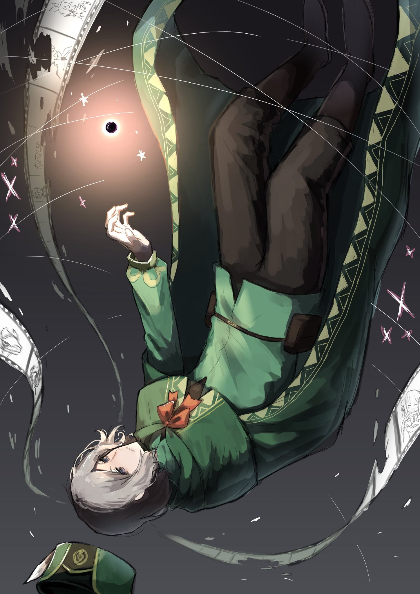

— Господин Ал… хватит лететь к солнцу.

Он не знал, какие чувства Яэ таила за этими словами.

Альдебаран держал её в узде страхом, связывал ненавистью, использовал жажду мести как поводок. Вид того, как его загоняют в угол, должен был принести ей сладчайшее наслаждение.

Но на деле её реакция часто была… противоречивой

Что же скрывалось за этой двойственностью?

Он давно перестал искать ответ. Ясно было лишь одно.

— Раскрытие Владений, переопределение матрицы.

Её совет снял с него одну окову.

Сам он их на себя не надевал — это бессознательные кандалы, призванные сберечь и остановить… Грубо говоря, ментальные цепи, сдерживавшие чудовищную мощь его Полномочия.

Когда она спала, его выбор стал воистину безграничен…

— С двенадцати до трёх… Действуй, Альтер.

— Будет сделано, Исток, — отозвался «Альдебаран», расправляя крылья за его спиной.

Прозвище «Альтер» вопросов не вызывало — через «Книгу Мёртвых» все обновления и намерения были давно синхронизированы. А «Исток»… ну, это и так понятно.

Не успела эта мысль оформиться, как мир взорвался ослепительно-белым светом.

— …

Дыхание, выпущенное оболочкой «Божественного Дракона» на пике могущества, было просто чудовищно. Даже «Святой Меча» мог лишь с трудом ему противостоять.

И эта всепоглощающая мощь, обрушившаяся на место, которое и нельзя было назвать полем битвы, смела всё на своем пути. Природа, строения, а главное — жизнь: растения, животные, люди… всё обратилось в ничто.

Дальность дыхания несдерживающегося «Дракона» измерялась километрами, и любой, кого накрывала эта внезапная вспышка, исчезал, не успев почувствовать боли.

И он только что приказал выпустить его.

— …

Зона с двенадцати до трёх часов на воображаемых часах была выжжена дотла. Всё, что находилось на пути луча, было стёрто в порошок.

Жертвы, скорее всего, исчислялись не сотнями, не тысячами, а десятками тысяч.

— Ха-ха-ха, вот это силища! — увидев способную уничтожить всё в этом мире мощь, подвешенный Лой разразился весёлым хохотом.

Не в силах аплодировать связанными руками, он с восторгом заколотил пятками друг о друга.

Но шум поднял лишь он. Больше никто не смел осудить мужчину за содеянное.

В их взглядах читалось лишь упоение, понимание, покорность и страх — все они были соучастниками этого действа, пусть и не по своей воле.

Ощущая на себе их взгляды, Альдебаран поднял голову к небу.

— …

Дыхание «Дракона» оставило свой след не только на земле — оно прожгло и небеса.

Облака рассеялись, едва зародившиеся ветер и дождь были изгнаны прочь, а на земле зиял глубокий шрам его ярости.

Естественно, в мире не было существа, не страшившегося гнева всемогущего создания. Никто не мог ему противостоять.

Поэтому главным правилом для всего живого было склонять головы перед его гневом, прятаться по норам и ждать, пока буря утихнет.

И потому птицы и насекомые над этим свежим шрамом выглядели так неестественно.

— Промах, — пробормотал он, глядя, как над выжженной зоной уже собираются стаи, будто оценивая ущерб.

Обычно животные прямолинейны и верны инстинктам. Если они ведут себя вопреки им — значит, вмешалась чужая воля.

Следовательно, тот, кто за этим стоит, всё ещё жив.

Убедившись в этом, он…

— Продолжаем.

…раскусил ампулу с ядом и проглотил её содержимое.

И…

× × ×

— С трёх до шести… Действуй, Альтер.

Вернувшись в начальную точку, он отдал приказ выжечь следующую зону.

△ ▼ △ ▼ △ ▼ △

— С шести до девяти… Действуй, Альтер.

— Корректировка… С шести до восьми.

— С шести до семи.

— Зафиксировать на семи. Дистанцию скорректировать, мощность дыхания — восемьдесят процентов.

— Семьдесят.

— Шестьдесят.

— Шестьдесят пять.

— Шестьдесят пять и пять.

— Шестьдесят пять целых и пять десятых… Есть.

△ ▼ △ ▼ △ ▼ △

Семьсот четырнадцать раз.

Когда Яэ сказала ему, что он цепляется за «чистые» методы, он всё пересмотрел.

Он осознал собственное высокомерие, переосмыслил цену победы, и нашёл ответ.

Обет «неубийства».

С того самого мига, как он решил изгнать Нацуки Субару и следовать цели своего создания, этот обет стал для него тем минимумом, от которого нельзя отступать.

В мире, познавшем слишком много утрат, где погасла даже она, он поклялся не допускать новых потерь.

Упрямо держась за эту клятву, он, сам того не видя, заковал в цепи собственное Полномочие.

Чтобы сдержать обет, Альдебаран распространял его на каждый свой шаг.

Его «Владения» позволяли обнулять всё, что происходило в повторяющихся мирах, пока он не зафиксирует в матрице конечный результат.

А значит, если в итоговом раскладе не будет ни одной жертвы, на смерти в процессе можно закрыть глаза.

Эта простая мысль, которую он сам от себя скрывал, и была его цепями. Он тратил время впустую, не решаясь их сорвать… Да что там — без Яэ он так бы ничего и не понял.

— Я знал, что он использует свою Божественную Защиту, чтобы нас измотать. Проблема была в его бесконечном запасе козырей, против которых мы были бессильны, но…

Сбросив цепи, он решил эту проблему простой грубой силой.

Ничего сложного. Враг использовал насекомых, рыб и мелких зверьков, чтобы отслеживать их и устраивать пакости. При этом, судя по предполагаемому радиусу действия Защиты, эта связь не была ни мгновенной, ни абсолютной.

Значит, приказы он отдавал голосом.

Для этого он должен был следовать за ними и держаться где-то рядом… С помощью дыхания Альдебаран вычислил, где это «рядом».

— Я сужал зону поиска, измеряя дистанцию мощностью дыхания… Стоило совершить нечто из ряда вон, как он вскрывал карты, чтобы оценить обстановку. Братец делает ход — он жив. А если хода нет…

…значит, нет и игрока. Значит, его стёрли с доски прежде, чем он успел отдать приказ.

Убедившись в этом, он вернулся, сузил направление, измерил расстояние и определил точное местоположение противника. Да, в процессе под удар попадали горы, леса и целые города с тысячами жителей, но… всё это не имело значения.

Финальный аккорд «Владений» восстановил баланс, и кроме Альдебарана жертв больше… Нет, его смерть не в счёт, так что жертв действительно не было.

— Вместе с отбором кандидатов для похода в Башню — тысяча триста сорок семь… Ну и намучил он меня.

Ничто так не выматывает, как подножка от врага, которого ты, казалось бы, уже устранил.

В этом смысле Отто Сувен доставил ему больше проблем, чем «Святой Меча» и «Демон Меча» вместе взятые. Если в столице он натравил на него Эмилию, а на Яэ — Вильгельма, то урон, нанесённый их группе, был куда серьёзнее, чем тысяча триста сорок семь его личных «смертей».

Альдебаран счёл его настолько серьёзной угрозой, что бросил на него все свои козыри, загнав в итоге в ловушку.

— Господин Ал, сюда, сюда~а! — весело помахала ему Яэ с земли.

Повинуясь её зову, «Альдебаран» приземлился, и Ал спрыгнул с его спины.

На склоне горы, за девушкой на дереве висел мужчина, а у её ног на земле лежал связанный по лапам земляной дракон.

Он отчаянно пытался вырваться. Его бледно-голубая чешуя была в крови, он тяжело дышал и извивался всем телом.

— Да уж, их преданность впечатляет. Если подумать, в текущие времена Патраш тоже была такой.

— Я думала использовать его для шантажа, но решила, что этот тип скорее заупрямится, чем сломается, так что решила не рисковать. Что думаете?

— Да, ты права. К тому же, для шантажа ему нужно хоть что-то видеть, — скривился он, когда она мило склонила голову набок.

Над извивающимся драконом висел с головы до ног плотно обмотанный тончайшей стальной нитью Отто. Она покрывала даже рот и глаза, так что он ничего не мог сделать.

Обычно её и разглядеть-то трудно. Раз сейчас она выглядела как плотные путы, страшно было представить, сколько витков Яэ намотала.

— Так он ни света не увидит, ни звука не издаст. Я перекрыла всё, даже возможность общаться с помощью дыхания… Оставила лишь крошечный проход у лодыжки для воздуха. Когда голова забита мыслями о следующем вздохе, сложно что-то выдумывать.

— Ясно. Обычная мера предосторожности, точно не месть, да? И правда, дай ему хоть слово сказать — неизвестно, что выкинет.

— Я не действую из личной неприязни! Яэчка не такая уж плохая синоби, — кокетливо добавила она, приложив палец к щеке.

Настроение у неё было превосходным, и не только из-за долгожданной мести.

Пусть она и отрицала это, после всех изощрённых пакостей министра обида и злость на него у неё явно накопилась. Всё же, изматывающие диверсии — это профиль синоби.

— Неудивительно, что ты в таком хорошем настроении, раз наконец его прижала.

— Фыр-фыр-фыр! Господин Ал, вы совсем не понимаете женщин! Конечно, приятно поставить на место того, кто донимал нас такими подлыми, изощрёнными, навязчивыми и мерзкими нападками!

— Да ты расписала его похлеще меня.

— Но самое главное, что вы наконец-то показали себя настоящим чудовищем. Вы отбросили эту жалкую человечность и полностью вжились в роль монстра.

— …

— Быть брошенной господином Волом — не такая уж большая цена за это.

— А я смотрю, план тебе всё-таки не совсем по душе пришёлся…

После того, как он изменил способ использования «Владений» и получил результат, им нужно было добраться до врага как можно быстрее. Способ был таков: летящий «Альдебаран» попросту швырнул Яэ прямо к цели.

Риск огромный, но вокруг много деревьев, так что девушка, способная смягчить падение подушкой из нитей, — лучший кандидат.

— Господину Хейнкелю такое поручить было нельзя, да? Его ж сколько ни швыряй, не умрёт.

— Гора бы обзавелась новым кратером в форме папаши, а сам он был бы в порядке, это точно. Но доверять ему сейчас что-то важное — идея плохая.

Недавний раскол между Хейнкелем и Фельт удалось временно сгладить, но это вызвало недовольство «Альдебарана» и было лишь временным решением.

Неизвестно, что могло послужить причиной для нового конфликта, поэтому эту тему они решили пока не трогать.

Как бы то ни было…

— Наконец-то, шах и мат.

Взглянув на серебристый кокон, в который обратился беспомощный Отто, Альдебаран поставил точку в этой затянувшейся партии.

Однако, это была лишь одна доска в глобальной игре с противниками королевского и мирового масштаба. И хоть ни одна фигура не была потеряна, почивать на лаврах было рано.

Сейчас главное — выбить соперника из игры навсегда.

— Если лишу его глаз, ушей, языка, рук и ног, я ведь всё равно выполню ваш приказ…

— Яэ.

— Знаю, знаю… Какой же вы страшный.

Изувечить, но оставить в живых — это всего лишь обман.

Заявлять о «неубийстве», просто сохранив биение сердца в искалеченном теле, — всё равно что провозглашать мир, отрубив всем руки и ноги.

Поэтому он не станет калечить Отто Сувена. Вместо этого он отнимет у него… причину сражаться.

— Лой, я ослабляю печать. Твой выход.

△ ▼ △ ▼ △ ▼ △

— Лой, я ослабляю печать. Твой выход.

Слова стоявшего под ним человека отчётливо донеслись до его опутанного нитями тела… Всё же, враги ошибались в одном.

Голос — это звуковая вибрация. И, даже если заткнуть ему уши, она проникает в само его тело. Его Божественная Защита не переводила звуки, она улавливала саму вибрацию воли, обращенной к нему.

Поэтому…

— Ну и судьбинушка у тебя, братец. В Пристелле и Лай, и Луи так и не смогли тебя слопать, а тут тебя подают прямо к столу!

…глумливый голос Архиепископа «Чревоугодия» он тоже ощущал совершенно отчётливо.

— …

К его глубочайшему сожалению, это было всё, что он мог.

Хотя Защита продолжала работать, его уста были запечатаны, тело сковано, а воля — заперта в беспомощной оболочке.

— Господин, что вы с ним делаете… прекратите, пожалуйста, прекратите!

Слышать отчаянные мольбы Фуруфу было мучительно.

Пока ей не причиняли вреда, да и убивать не собирались. Пусть она просто затихнет и переждёт эту бурю.

А в остальном…

— …!

…мысли его были с теми, кого здесь не было.

С Эмилией, Рам, девочками, Клиндом, лагерем Фельт, да со всеми. Наверняка они найдут выход, но… как же хотелось самому, за себя и за Гарфиэля, вломить этим гадам как следует.

И, конечно же, спасти пленённых Субару и Беатрис…

— Тебе грустно, братец. Тебе больно. Мы примем и полюбим всю твою агонию, всю эту смесь горя и радости! В конце концов, сам мир — это бесконечное чревоугодие!

Он чувствовал, как медленно приближается грязная жажда Архиепископа Греха. Ему ничего не оставалось, кроме как беспомощно принять свою участь.

Его съедят.

Поэтому он молился, желал и до последнего верил, что…

— Ну что ж, приятного аппетита !

…его последний ход всё-таки сработает.

△ ▼ △ ▼ △ ▼ △

— Спасибо за угощение!

Полномочие сделало своё дело. Отто Сувена съели.

Ни вспышек тебе, ни спецэффектов. Вот так просто изысканное блюдо и отправилось в желудок невоспитанного едока… Самая обычная трапеза.

— Выглядит как жульничество… Нити просто обмякли и… всё, — с отвращением пробормотала Яэ, касаясь кольца.

Лучшего доказательства того, что «поедание» сработало, и не требовалось.

— И при этом мы всё ещё помним его. Похоже, ты сдержал слово и съел только «воспоминания».

— Ах-ха-ха, и никакой благодарности? Никакого восхищения?! Между прочим, откусить «воспоминания», не тронув «имя» — работа ювелирная, понятно? Это как слизать колбасу и сыр с бутерброда, не тронув хлеб!

— Да плевал я. Не справишься — сдохнешь. Так что жри как сказано, — пресёк его Альдебаран, не давая ему и дальше распинаться о сложностях своего Полномочия.

Он и слушать его не собирался… Ошибись Лой, его душа просто сгорит из-за проклятой печати, связывавшей его клятвой.

Конечно, смерть его сейчас была невыгодна, так что в случае провала Альдебаран был готов перезапускать мир снова и снова, пока тот не сделает всё правильно.

— Вам не кажется, что этот Архиепископ слишком много о себе возомнил? Если его можно сдержать печатью, не проще ли было просто заставить его подчиняться, а не тратить столько сил? — прошептала Яэ ему на ухо.

— Наложить её не так-то просто, — ответил он, легонько её отстраняя. — Это несёт риски и для того, кто её накладывает. К тому же, такая возможность выпадает лишь раз в жизни. Это козырь, который приберегают для тех, кто не слушает.

Хоть название и говорит само за себя, проклятая печать — это реликт тех времён, когда магия и проклятия были одним целым. По своей природе она куда ближе к истокам магии. Сведи он всё к простому «проклятию», тот, кто его этому научил, читал бы ему лекцию до самого вечера.

— И ты потратил на нас такой бесценный шанс! Хорошо, прекрасно, здорово, замечательно, лучше нет, лучше не придумаешь! НАПИВАТЬСЯ, ОБЖИРАТЬСЯ!! Это же… и вправду… любо-о-овь…

— Что?! Хотите сказать, что этот кривозубый недомерок вам дороже, чем такая милая, соблазнительная и преданная горничная вроде меня?! Ах вы, изменник!

— Прекращай ему подыгрывать… — вздохнул он устало от этой перепалки.

Конечно, Яэ и не думала дружить с Лоем, просто, как настоящая синоби, она готова была использовать что угодно, лишь бы вывести Альдебарана из равновесия. С другой стороны, и Архиепископ вёл себя так, будто с ним, в отличие от других его собратьев, можно договориться.

Но обманываться было нельзя. Они оба были лишь инструментами, и оба могли в любой момент вонзить ему нож в спину.

И это касалось…

— Ты не зазнавайся. Рассказывай, что он замышлял. Для этого мы и скормили его тебе, — холодно бросил он, не выпуская Лоя из поля зрения.

Хоть тот и был освобождён от пут и исцелён, это не означало, что ему доверяли. Просто таскать его с собой подвешенным было непрактично.

Держать такую карту, как Полномочие «Чревоугодия», в рукаве и ею не пользоваться — слишком уж глупо. Нужно было лишь иметь надёжный способ держать его в узде.

К счастью, проклятая печать отлично справлялась с этой задачей.

— Надеюсь, мы услышим что-то полезное, — прошипела Яэ, настороженно шевельнув пальцами, прозрачно намекая этим на нити.

Именно она до последнего возражала против этого плана. С одной стороны, она приветствовала его решение сбросить цепи, но с другой — настаивала, что тогда уж следует отказаться и от обета «неубийства».

И она была права. Сними он это ограничение и распоряжайся жизнями противников как ему вздумается, цели он бы достиг на удивление быстро. Швырялся бы себе дыханием «Дракона» и держал всех на расстоянии.

Но он избрал иной путь: Альдебаран допустил «смерть» в процессе и вооружился Полномочием Лоя Альфарда.

Это было совсем не то, что использовать собственное Полномочие, находящееся, так сказать, на «вакантной» позиции. Он собирался использовать во имя своих целей наследуемое зло, породившее бесчисленные трагедии и жертвы, лишь потому, что оно было полезно.

Вероятно, с тех пор как в этом мире появились Ведьминские Факторы, такое злодеяние совершил лишь один человек, помимо него.

Так он и пересёк красную линию.

И теперь, если это не принесёт достойных плодов, не будет смысла в том, что он отвернулся от солнца.

— Так что говори. Не зря же я человеку жизнь сломал. Не может быть, чтобы он ничего не…

— Э-э-э, постой, не торопи. Мы ведь не можем вот так сразу всё понять о съеденном. Точно так же, как ты не можешь вспомнить что-то, пока не появится повод. У нас так же…

— Второй раз повторять не буду.

— Ладно-ладно, поняли мы, поняли! М-м-м, надо же… А у братца такая жизнь, что мы даже немного удивились…

Собиравшийся было пуститься в долгие оправдания Лой сосредоточился на воспоминаниях только что съеденного Отто. Его слова можно было трактовать как оценку сочетания бурной жизни владельца «Божественной Защиты Духовной Речи», и невероятного количества голосов, которые тот, должно быть, услышал за свою жизнь.

Напыщенный тон Архиепископа внезапно оборвался, что насторожило Альдебарана.

Он определённо наткнулся на какое-то цепляющее «воспоминание».

— Что такое, в чём дело?

— Ха-ха, похоже, план был продуман тщательнее, чем мы думали… На случай поражения у меня была «защита от дурака».

«Защита от дурака» — предохранитель от глупых ошибок.

Как только Лой произнёс это, тело мужчины охватил ледяной озноб.

Не защита от врага, а страховка на случай своего поражения.

Если Отто Сувен подготовил нечто подобное, то этот момент настал.

— Яэ, сейчас же…

Отступить или умереть и повторить?

Два варианта пронеслись в его голове, и он начал действовать, не выбрав ни один. В каком-то смысле это его спасло, а в каком-то — обрекло на провал.

В тот же миг…

— Рада нашей первой встрече, господин Альдебаран, — прелестный девичий голос ударил по ушам.

Это был инородный элемент, появившийся так внезапно, что чутьё даже не успело подать сигнал тревоги.

Он не должен был смотреть на неё. Понял он это лишь в тот момент, когда его взгляд упал на девушку, что грациозно взмахнула юбкой своего наряда горничной.

И тут же её имя, её существование, её бытие — хлынуло в его мозг.

— …

Её «имя» и «воспоминания» когда-то были пожраны Полномочием «Чревоугодия», стёрты из памяти Од Лагуны. Затем, по злой прихоти «Обжоры», она была выплюнута обратно. Долгое время это не имело последствий, но именно сейчас его сознание схлопнулось.

Удар был так силён, что его мысли, сутью которых было бесконечное движение, его же и бросили.

— Господин Ал!!

Он слышал крик Яэ, краем глаза видел её протянутую руку, но не мог пошевелиться.

И в эту секунду обездвиженности и безмыслия мир изменился.

Тело Альдебарана было вырезано из пространства и выброшено в небо, где его овеял яростный ветер.

— …

Сияние солнца, к которому он больше не летел, опалило его чёрные глаза, пока он парил в воздухе. Это было неожиданное начало решающего испытания.

Так занавес сражения за гигантский гейзер Моголейд, что определит судьбу всего мира… был открыт.
