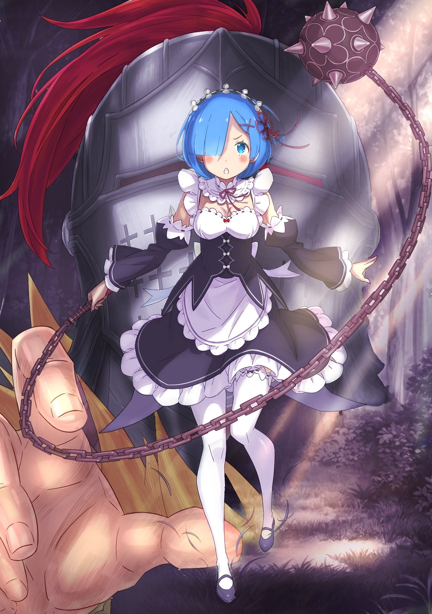
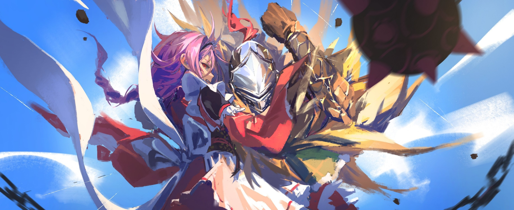

Для Отто Сувена столкновение с Архиепископом «Чревоугодия» Лоем Альфардом обернулось сокрушительным поражением.

Противостояние человеку, овладевшему «Божественной Защитой Духовной Речи» лучше, чем кто-либо в истории, доставило их шайке немало хлопот. Как и обещал, юноша обратил против них весь мир.

Поэтому исход его одинокой битвы был предрёшен. Его просто стёрли в порошок, отняли у него всё: слова, свободу действий, все хитрости, уловки и даже «воспоминания», делавшие его самим собой.

Даже такой гений не устоит против внезапного удара врага, решившего покончить с ним раз и навсегда. А раз предсказать атаку невозможно, то и ловушку под неё не подстроишь.

Ходов не осталось… а последняя ставка была на собственный провал.

Он успел лишь отдать приказ зоддацким жукам: разлететься, когда он проиграет, и стать указателем для товарищей.

△ ▼ △ ▼ △ ▼ △

— Ал… он знал Рем ещё до Империи… Да, ещё до того, как «Чревоугодие» её съело, — сказал «Субару», сидя в позе лотоса, пока они строили план.

Петра тут же вспомнила ту петлю в столице, когда их пути пересеклись.

Это случилось после того, как Субару совершил ужасную ошибку в замке и отчаянно пытался всё исправить.

Её-то его выходки не разочаровали, хоть она и понимала, насколько они плохи, а вот он сам до сих пор сгорал от стыда. Тогда от него отвернулись почти все, так что, не считая её самой, на его стороне оставалась лишь беззаветно преданная ему Рем.

И вот, утопая в отчаянии, он отправился в поместье Присциллы, ища способ спасти Эмилию от Культа Ведьмы.

Там-то, вышвырнутый на улицу после ледяного приёма хозяйки, он стал свидетелем той самой встречи.

Причина так и осталась неясной, но…

— Ал спутал её с Рам и сам этому сильно удивился. Я потом спрашивал Рем, но она клялась, что видела его впервые.

— То есть, он знал их, а они его — нет? Может, просто изучал лагеря соперников по Королевскому Отбору?

— Чтобы он этим занимался? Может, и так, но это неважно. Важен сам факт того, что он её знает. А значит…

— …при виде сестрицы он, как и все мы, испытает путаницу в «воспоминаниях».

— Бинго! — щёлкнул он пальцами и подмигнул. — Назовём это… Вспышкой Ремнаты .

Петра в ответ показала ему большой палец.

Её коробило от того, что они используют Рем как светошумовую гранату, но они на собственном опыте убедились, что откат «воспоминаний» неотвратим.

Да, сильнее всего он бил по тем, кто был тесно связан с девушкой, как Рам или Субару в Петре, но даже секундная заминка — это заминка.

Нужно было лишь воспользоваться этой брешью и…

— Показать господину Алу… как сильно мы разъярены.

△ ▼ △ ▼ △ ▼ △

Здесь стоит сделать отступление, дабы объяснить действия Лоя Альфарда.

Как и подобает «Обжоре», используя виновное во множестве трагедий Полномочие «Чревоугодия», он идеально справился со своей задачей. Его «трапеза» не просто обезвредила так досаждавшего им Отто — она позволила ему пережевать все двадцать два года его жизни, смешать радость, гнев и печаль, а затем слизать всё с тарелки дочиста.

Сглотнув, Архиепископ отложил вилку и нож. Он поглотил чужую жизнь с полнотой, недоступной даже «Книгам Мёртвых», и вынес вердикт: сложный, богатый вкус взлётов и падений, но, пожалуй, со специями переборщили. Две звезды.

Манера оценивать съеденное напоминала повадки его покойного брата «Гурмана», но это так, к слову. Важно то, что поглощение «воспоминаний» давало доступ не только к образу мыслей и мировоззрению жертвы, а и ко всем её планам и замыслам.

А значит, даже наслаждаясь послевкусием, он должен был с лёгкостью предвидеть внезапную атаку.

Но этого не случилось. Потому что последний ход Отто держал в тайне ото всех.

Он просто верил.

Верил, что если подаст сигнал, друзья не упустят этот шанс.

Он поставил всё не на хитрый расчёт, а на силу их уз, и потому…

— Рада нашей первой встрече, господин Альдебаран.

Это произошло в одно мгновение.

Взмах ресниц.

И вот уже перед ними стоит девушка с синими волосами. Никто не успел среагировать.

Из ниоткуда, внезапно, появилась фигура, которой здесь и быть не могло.

Одного этого хватило, чтобы вырвать драгоценное мгновение у закалённых бойцов, но для однорукого мужчины это мгновение стало роковым.

— …

Её появление не затронуло Яэ, что не была с ней знакома, не коснулось и Лоя, на которого собственное Полномочие не работало, не повлияло и на «Альдебарана», который хоть и делил «воспоминания» с оригиналом, обладал другой душой.

Чёрные, выжженные в естестве Альдебарана «воспоминания» всколыхнулись, словно нечто давно и насильно вырванное с хрустом ввинтили обратно.

Сознание залило слепящей белизной.

Это и была та самая «Вспышка Ремнаты».

— Господин Ал! — раздался пронзительный крик, и к нему из пелены слепящего света потянулась рука… но спасти его из отчаянного положения она не могла.

— …

Альдебаран понял, что земля ушла из-под его ног. Тело беспомощно мотало в яростных порывах ветра, а верх и низ слились в едином месиве.

И всё же, даже так он видел над головой застывшее синее небо и слепящее солнце. Когда их свет обжёг ему глаза, до него дошло.

Его каким-то образом перенесли, выбросив за пределы «Владений».

— Твою мать! Раскрытие Владений, переопределение матрицы! — процедил он сквозь зубы, поспешно перенастраивая насильно разорванные «Владения».

Он пошёл на поводу у врага и обновил матрицу. Теперь ему уже не вернуться в момент перед внезапной атакой.

Промедли он с этим решением хоть на секунду — проиграл бы, даже не успев ничего предпринять.

Его Полномочие непобедимо, но лишь в границах «Владений». Смерть вне них станет последней — второго шанса, как и у обычных смертных, не будет.

— …

Приняв новые правила, он сосредоточился на настоящем.

Раз его заставили обновить матрицу, то всё, что ждёт его дальше, станет для него и даром, и проклятием; и попутным ветром, и штормом в лицо; и благом, и злом.

— Небо… чёрт!

Рёв ветра бил по ушам как рёв зверя, а чувство свободного падения выворачивало нутро. Альдебаран не помнил, как его подбросили, но он всё же падал с огромной высоты. Враг решил обойтись без прелюдий.

На миг мелькнула мысль о Полномочии сильнейшей «Ведьмы», но нет… будь это она, всё было бы иначе. Его бы не просто подбросили, а убили раз сто, пока он моргал.

Итак, худший вариант исключён.

Параллельно он продолжал анализировать окружение. Главным изменением в ситуации, помимо бешеного кувыркания в воздухе, было…

— Господин Ал…

…присутствие Яэ, вцепившейся мёртвой хваткой в его единственную руку.

Перед тем, как их выбросило в небо, вспышка «воспоминаний» парализовала его. Яэ же бросилась к нему, и теперь летела вместе с ним.

Счесть это удачей или провалом? Он мысленно взвесил, что сможет и не сможет сделать с ней рядом, и выбрал с чего начать.

А именно…

— Я выровняю наше положение! Господин Ал, не отпускайте меня!

— Угх…

В тот самый миг, как обнявшая его девушка попыталась что-то предпринять, он раздавил во рту крошечную капсулу с ядом.

Он успел увидеть ужас в её распахнувшихся алых глазах, но было поздно — смертельная доза уже была принята.

— Потом расскажешь.

Кровавая пена хлынула изо рта, заливая шлем изнутри. Ощущая вкус ржавчины, он позволил своему сознанию раствориться…

× × ×

— Тц…

Как и ожидалось, реальность встретила его всё тем же рёвом ветра.

Стоило открыть глаза, как в них снова ударило ненавистное солнце. Яростно зыркнув на него, Альдебаран оценил обстановку: он падал с высоты в несколько сотен метров.

— Да вы издеваетесь.

Перенос, телепортация, скачок… как ни назови, суть одна, и всё же область магии тьмы, которая позволяет влиять на само пространство, требует крайне высокого уровня волшебства.

Тщательно подготовившись, можно создать различные личные зоны, где что-то вроде создания соединённых друг с другом дверями, образующих ограниченный варп, было бы возможным. Да даже без подготовки, если маг чётко представляет место в голове и готов расстаться со своими вратами, можно было бы организовать путешествие в один конец.

× × ×

Короче говоря, явление, швырнувшее его со спутницей в небо, обычной магией было не объяснить, а значит, здесь было замешано нечто запретное.

Он никогда не слышал, чтобы Божественные Защиты могли вот так физически влиять на других.

Конечно, есть уникумы вроде Райнхарда, способные любую никчёмную Защиту превратить в чудовищное оружие, но…

— Это другое. Если это Полномочие…

Насколько он знал, Полномочия «Гнева», «Чревоугодия» и «Похоти» были у Архиепископов, а «Лени» и «Жадности» — у Нацуки Субару.

Если не считать его собственное — вакантное, побочное или попросту краденое, — то оставались лишь «Гордыня», «Тщеславие» да «Уныние». Поскольку последними двумя никто в принципе не мог овладеть, вывод напрашивался сам собой.

× × ×

— «Гордыня» припёрлась? Вылезла, вмешалась? Да похер…

Неважно, был ли ею кто-то из знакомых, или на поле появился новый игрок. Важно было то, что обладатель Полномочия выступил против него.

Помимо Нацуки Субару и Райнхарда, угрозу ему своей непостижимой силой представляли только носители Полномочий — разрушители концепций, которым дозволено по своей прихоти ломать и топтать сами устои мироздания.

× × ×

— Так, ладно, хорош.

Всё тот же рёв вопрошал: «Ну что, паника от того, что попался на удочку, прошла?».

Он ответил, доказав, что наконец пришёл в себя.

Конечно, ничего не изменилось: он всё ещё падал, рядом ошибкой висела Яэ, а белая пелена «воспоминаний» всё так же пыталась вытеснить его собственное сознание.

Но всё, что не убивает, — стоит дёшево. Такова уж цена его жизни.

И если за этот грош можно купить передышку для разума, тела и души — сделка более чем выгодная.

— Господин Ал…

Наблюдая, как волосы вцепившейся в него девушки треплются на ветру, словно хвост счастливого пса, он уже просчитывал следующий шаг.

Он должен был добраться до земли живым вместе с ней.

А для этого…

— Я выровняю наше положение! Господин Ал, не отпускайте меня…

— Это мои слова.

Он оборвал движение девушки, силой прижав её к груди. Правая рука была занята, поэтому он тут же создал уже привычный каменный протез, вскинул его над головой и… в тот же миг на них обрушился сокрушительный удар, ускоряя их падение.

Даже сквозь созданную руку он почувствовал чудовищную тяжесть и злобу. Рёв ветра не смог заглушить скрежет извивающейся, как бросившаяся змея, цепи.

«Утренняя Звезда»… ироничное название для шипастого железного шара, усыпляющего людей вечным сном.

— Приготовьтесь!

Вслед за этим орудием убийства, на фоне солнца, падала девушка с синими волосами. Та самая, что лишила его главного преимущества и начала эту битву.

На её лбу медленно проступал единственный рог — знак племени демонов, доказательство принадлежности к боевой расе, рождённой стереть с лица мира следы «Ведьмы».

Но для вспомнившего её Альдебарана это значило нечто иное.

А именно…

— Да всё пошло к чертям ещё тогда, когда выяснилось, что ты, Рем, вообще жива!

△ ▼ △ ▼ △ ▼ △

Приготовившись, она ринулась вверх. Полы её платья горничной трепетали на ветру, рукоять моргенштерна была крепко сжата в руке, а взгляд яростно впивался во врагов внизу.

План внезапной атаки пока работал идеально.

Ошеломить врага своим появлением и, пока он в ступоре, швырнуть его «сжатием» подальше от союзников — туда, где он не сможет среагировать мгновенно. Это решили быстро.

Возможность для удара создал Отто. Он преследовал шайку Ала, изматывая их мелкими диверсиями. Вдобавок, подготовил сигнал на случай своего поражения.

Этот сигнал означал, что сейчас победители, одолев упорного противника, ослабили бдительность.

— Госпожа Присцилла была ко мне очень добра. Мне она небезразлична, потому я больше не могу мириться с бесчинствами господина Ала, — так она ответила на возражения против её участия в бою.

Это было не просто принципиальной установкой, но и её подлинным чувством — несгибаемым стержнем воли в предстоящей битве.

Конечно, рядом с ним был и другой — пленённый Субару. А может, он и был настоящим? Нет, госпожа Присцилла ведь тоже стержень… Получается, их два. Что ж, придётся потом извиниться перед госпожой Беатрис.

Так или иначе, в таком духе она и вошла в отряд, которому предстояло сразиться с Алом.

Отчасти потому, что на других участках от неё было мало толку, но главным образом — потому, что помимо удара по «воспоминаниям», она могла стать особым оружием против этого человека.

И расчёт оправдался, когда…

— Да всё пошло к чертям ещё тогда, когда выяснилось, что ты, Рем, вообще жива! — едва она обрушила на него удар, отразив атаку, он прорычал эти слова.

Рёв ветра не смог их заглушить, и горничная поняла, что сработало то, о чём ей говорила Петра — её с ним связь, о которой она сама и не подозревала.

— Недостойной Рем невдомёк, что связывает нас с господином Алом…

Она спрашивала сестру, но и та помнила лишь один короткий разговор с ним в столице, ещё до начала Королевского Отбора. По её словам, ни о чём важном они и не говорили. Обычная пустая болтовня, которую она едва помнила.

Скорее всего, их с Рам связь с ним была односторонней. Он знал их, а они его — нет.

Но…

— Такие слова ранят! Когда на нас в Гуарале напала Аракия, вы спасли нас…

Она запнулась, но, откинув сомнения, намеренно ударила по больному: — …вместе с госпожой Присциллой!

Ей стало омерзительно от собственной подлости, но это было необходимо, чтобы остановить мужчину. Собрав волю в кулак и ожесточив своё сердце, она сурово посмотрела на него.

— …

На её провокацию он ответил не гневом, а гнетущим молчанием.

За его чёрным шлемом не было видно ни выражения лица, ни блеска глаз. Невозможно было понять, какую боль причинили ему эти слова.

— Иду!

Но она не стала ждать и, не давая ему и секунды на передышку, возобновила атаку.

Она уже расставила приоритеты. В отличие от своей гениальной, всегда на шаг впереди всех сестры, Рем была неуклюжей, заурядной и во всём ей уступала.

И если уж такая, как она, хочет чего-то добиться, ей остаётся лишь быть эффективной.

Всё-таки, она всегда умела отсекать лишнее ради главного.

— Хьюма! — произнесла она заклинание, мана вмешалась в реальность, и магия сотворила чудо.

В отличие от Эмилии, которая управляла теплом, замораживая уже существующую в воздухе влагу, Рем творила воду из ничего, материализуя её уже в виде льда.

Нельзя сказать, какая «Хьюма» лучше. Одна девушка работала с готовым ресурсом, тратила меньше маны, а созданный ею лёд никуда не исчезал и мог быть использован повторно. Вторая же, напротив, делала всё с нуля, затрачивала больше сил, но после использования лёд обычно снова обращался в ману.

На первый взгляд, подход полуэльфийки казался несравнимо лучше, но и у второго было своё сильное преимущество.

Заключалось оно в том, что Рем могла создавать лёд где угодно и какой угодно формы, не завися от влажности воздуха или чистоты воды…

— Ха-а-а-а-а-а!

Сотворив заклинанием ледяную платформу — импровизированную точку опоры, способную выдержать любой толчок, — Рем оттолкнулась от неё и ринулась на врагов. Такой удар моргенштерном был несравнимо сильнее того, что она могла нанести, просто развернув корпус в полёте.

С рёвом вращаясь, железный шар безжалостно устремился к цели.

День за днём Субару с любовью полировал его, и теперь он отвечал на заботу юноши. Сила, способная обратить плоть в крошево, сорвалась с её руки, и шар с ликованием устремился к Алу… всё ближе… и ближе… и…

— Не позволю.

…прямо перед ударом её снаряд любви увяз в густой паутине.

Верная спутница Ала, несравненная повелительница нитей, развернувшись в его объятиях, встретила Рем яростным взглядом.

Она выпустила нити и мягко, словно в пуховую перину, поймала летящий железный шар.

Её мастерство впечатляло, но Рем думала о другом.

Их план был в том, чтобы отрезать Ала от его союзников. То, что эта девушка вмешалась, было… немыслимо. Нет, не так. Горничная знала, как ей это удалось.

Несмотря на шок от внезапной атаки, противнице хватило самообладания, чтобы мгновенно среагировать.

Что позволило ей это сделать?

— Любовь!

— Нет! — в один голос прорычали Ал и его спутница.

Воспользовавшись их замешательством, Рем вырвала своё оружие. Чтобы не потерять равновесие, синоби разжала пальцы, и шипастый шар вернулся к хозяйке. Создав в воздухе ещё несколько ледяных опор, девушка оттолкнулась от них и устремилась в погоню за падающей парой.

Но…

— Жуть как быстра! Но у каждой палки два конца, да? — вновь обретя уверенность, синоби ехидно улыбнулась, а её нити метнулись к ледяным платформам.

Они, очевидно, решили использовать эти опоры, чтобы восстановить равновесие.

Мастерство этой девушки превосходило её собственное. Стоит дать им обрести опору, и тот крохотный, с таким трудом сокращённый разрыв в силе снова станет непреодолимым.

— Да, понимаю. Я вся ведь состою из недостатков.

Именно поэтому она и не позволит им это сделать.

— …!

Услышав её ответ… нет, скорее, почувствовав, как платформа, за которую она почти ухватилась, исчезла, будто мираж, синоби снова дрогнула.

Опоры, которые она собиралась использовать, просто растаяли в воздухе. Конечно, это был не сон, не видение, а просто мана.

Девушка по своей воле вернула лёд в исходное состояние. В этом и была разница их подходов: Эмилия создавала лёд раз и навсегда, а Рем могла развеять свой в любой момент.

— Проще говоря, способ Рем более агрессивен.

На её глазах синоби, потеряв точку опоры, пошатнулась.

Державший её Ал тоже едва не потерял равновесие, но успел укрепить треснувший протез новым слоем камня и отразил ещё два, а потом и три удара железного шара.

И тут…

— Тья-а-а-а-а!

…снизу по диагонали взмыла длинная нога Эмилии, и острие её ледяного сапога безжалостно впилось в беззащитную спину мужчины.

△ ▼ △ ▼ △ ▼ △

Разделение отряда Альдебарана.

Таково было главное условие победы над группой, что осмелилась бросить вызов всему миру и чья сиюминутная мощь, возможно, превосходила даже мощь Культа Ведьмы.

План внезапной атаки, разработанный для достижения этой цели, сработал на девяносто процентов. Синоби, добровольно разделившая участь Ала, стала непредсказуемой переменной, подпортившей весь план, но сейчас лишние переживания были ядом.

Каждый просто должен выложиться на максимум.

Без этой веры и решимости их замысел был бы обречён на провал.

— М-да-а-а, взгляды у вас прям до мурашек… — покачивая безвольно опущенными руками, Лой Альфард с садистской ухмылкой огляделся по сторонам.

Сразу после того как Альдебарана с Яэ унесло прочь, вокруг него появились воины, собравшиеся их сокрушить.

В глазах каждого горел такой огонь, что Архиепископ невольно облизал губы, не в силах сдержать предвкушающей ухмылки.

— Мило, очень мило, просто прелестно. Но-о, скажите-ка, раз уж вы здесь, не боитесь, что всех вас прихлопнут разом, а?

— Ха! Проявил бы хоть каплю страха и миловидности, если не хочешь сдохнуть так же, как твой братец в Песчаной Башне, — отозвалась воительница, обхватив себя за локти.

— И ещё~ё~ё, зверодемончики в вашем вкусе~е? Если не~е~ет, то… боюсь, я ваш злейший вра~аг, — добавила девочка, накручивая косичку на палец.

Ответом на эту нескрываемую враждебность была всё та же хищная улыбка.

— Д-да вы в своём уме?! Вы что, не видите «Божественного Дракона»?! Не помните, что он сотворил со столицей?! У вас же нет ни единого шанса! — в отличие от возбуждённого Архиепископа, завопил побледневший Хейнкель.

Он надрывал голос от ненависти к врагам, стоя у самых лап чудовища, полагаясь на его мощь. Как и подобает тому, кто рядится в чужие одежды, вид его был поистине жалок.

Но как ни крути, Хейнкель был прав. Стоять на пути «Божественного Дракона» без плана равносильно самоубийству.

— Это если без, парень, — раздался низкий голос.

— Тц, старик-гигант…

— Этот старик помнит «Войну Полулюдей». Тем, кто пришёл с мечом, я не окажу милости дважды. Верните Фельт! — провозгласил он, поглаживая свою лысую голову и глядя на замершего мужчину, взгляд которого метался туда-сюда.

От этих слов сам Хейнкель напрягся, но шевельнулась и другая фигура.

Тот самый «Дракон», о котором шла речь.

— Сказать по правде, я и сам в шоке, что нас так прижали. Теперь в полной мере ощущаю, что значит «пойти против всего мира» , — произнёс он и до странности по-человечески почесал затылок.

Он источал величие, завидев которое большинство жителей Драконьего Королевства пали бы ниц, но его повадки были совершенно иными.

По крайней мере, те, кто знал настоящего «Божественного Дракона», сразу бы эту странность заметили.

— В отли-и-ичие от королевских вельмож, я не стану паникова-а-ать из-за того, что образ «Божественного Дракона» рушится, а бренд дешевеет, но-о-о… как насчёт тебя? Тебе-то, небось, есть что сказать, да-а-а?

— Вовсе нет, господин. Не беспокойтесь. Пустые тревоги. Рассуждать о давно сброшенном прошлом было бы смехотворно. Недостойно.

В несоразмерной его душе драконьей оболочке «Альдебаран» прищурил золотые глаза, глядя на тех, кто не дрогнул перед ним.

Его взгляд, а вместе с ним взгляды Лоя и Хейнкеля, сошлись на маленькой фигурке, медленно выходившей вперёд.

Никто не знал, почему именно она заняла это место, но все сразу поняли — она воплощает волю каждого.

Приковав к себе всеобщее внимание, Петра Лейт вскинула палец к небу и объявила: — Это тотальная война! Так что стойте смирно и дайте нам разнести вас в пух и прах.
