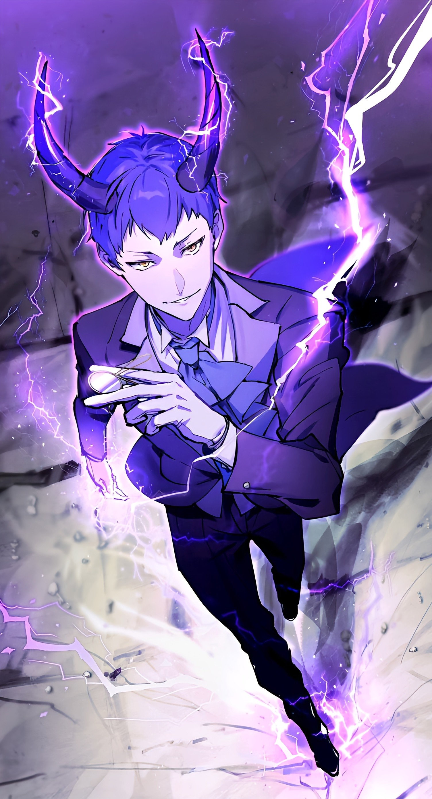
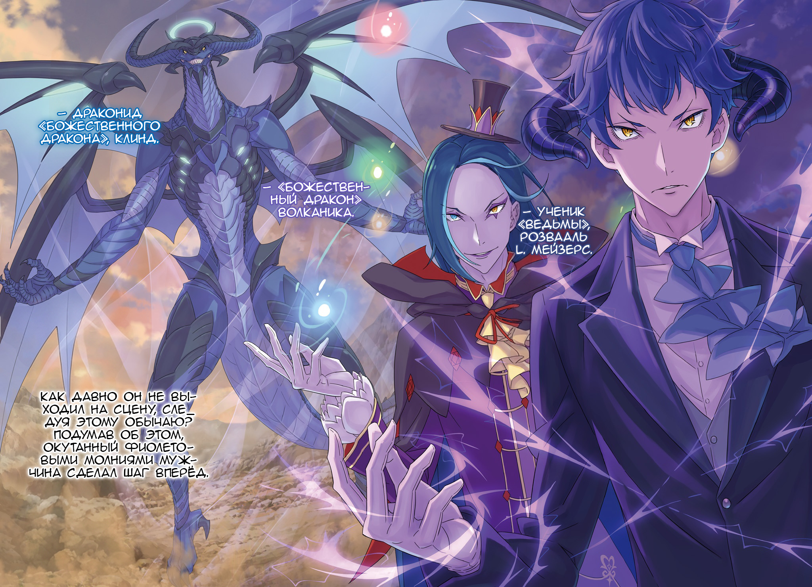

О любящий Бог, о мудрый Будда, о всеблаженная Лагуна… Даю обет, что в жизни больше пьянствовать не буду.

△ ▼ △ ▼ △ ▼ △

— Это тотальная война! Так что стойте смирно и дайте нам разнести вас в пух и прах! — в горной тиши прогремел звонкий голос Петры, и натянутое до предела напряжение лопнуло.

В тот же миг ошеломленная появлением их группы троица, оставшаяся без предводителя, — «Божественный Дракон» Волканика, «Чревоугодие» Лой Альфард и Хейнкель Астрея — ринулись в бой.

Впрочем, о какой-либо слаженности и речи не шло.

— …

Заметив их движение, девочка привела в действие первый этап плана… Нет, первым была «Вспышка Ремнаты», ослепившая Ала появлением Рем, так что это была уже вторая стрела из её колчана.

Её цель — расколоть их отряд и превратить грозную команду в неуправляемый сброд.

— Сначала мы изолировали господина Ала, потом ошеломили остальных. А теперь… — её мысль переплелась с голосом воображаемого Субару, — …на счёт «три» они начнут творить то, что им вздумается!

И точно: все трое действовали вразнобой.

Именно для этого они и бросили в бой все силы с самого начала.

Конечно, был огромный риск того, что «Дракон» их разом сотрёт в порошок, но…

— Думаю, господин Ал подчинил его… точно так же, как и я… — такова была её догадка о причине предательства великого существа.

Петра слышала от Эмилии о его состоянии, когда тот был на вершине Сторожевой Башни, и то, что с годами «Дракон» выжил из ума… Уж она, как никто другой, знала, как насильно втиснуть «нечто» в пробелы сознания.

Точно так же, как она с помощью «Книги Мёртвых» поместила в себя Нацуки Субару, так и в него, скорее всего, подселили некую сущность, лояльную Алу. Кого-то, кто разделял его цели и был готов пойти вместе с ним против всего мира.

На это она и сделала ставку — на то, что они оба связаны обетом «неубийства».

— Гх-х-х!..

Первым, вопреки своим исполинским размерам, невероятно проворно атаковал Волканика.

Его могучие челюсти разверзлись, и из них хлынул… не всепожирающий луч света, а плотный туман из чистейшей воды, рождённый колоссальным запасом маны. Он тут же поглотил «Охотников за Альдебараном», промочив всех до нитки.

На миг непонимание его замысла вызвало всеобщее замешательство, но ответ пришёл почти сразу.

— …

Раздавшийся леденящий скрежет сковал их движения, не давая приготовиться к защите. Промокшая одежда на глазах покрылась инеем, а затем начала обрастать ледяной коркой, но…

— Уль Гоа!

Внезапно, белеющий лес поглотило алое пламя.

Гигантская волна огня тут же смела замораживающий туман. Она не только растопила лёд, но и высушила промокшую одежду.

Её источником был стоявший в центре отряда Розвааль L. Мейзерс — величайший маг королевства, чей скверный характер уступал лишь его безграничному таланту. Одним движением пальца и единственным заклинанием он свёл на нет замысел «Дракона».

Само собой, чем выше уровень магии, тем более тонкого контроля она требует.

Мигом сотворить заклинание класса «Уль», на что способен не каждый, да ещё и так, чтобы разморозить, высушить и никого не опалить — доказательство непревзойдённого мастерства.

Даже древний противник был изумлён тем, что маркграф проделал это одним махом.

И тут…

— Ваше внимание должно быть обращено сюда. Концентрация. — тихий и вежливый голос сопроводил невообразимо мощный удар.

Легко подпрыгнув, Клинд наотмашь врезал ногой застывшему «Дракону» по морде. От подобного пушечному ядру выпаду, по силе не уступающему даже ударам Гарфиэля, враг потерял равновесие и рухнул на землю, подняв облако пыли.

Так первая атака была блестяще отражена дуэтом дворецкого и маркграфа.

Тем временем, из клубов пыли клыкасто скалясь вырвался Архиепископ «Чревоугодия»…

— Ха-ха-а! Сколько вкусных мордашек! Просто пир любви!

Пуская слюни, Лой ворвался в их строй. В отличие от «Дракона», он не стал распыляться, а выцепил взглядом одну жертву и бросился прямо к ней.

Вопреки дикому голоду, его движения были полны извращённой, балетной грации. Целью его гнусной атаки стала стоявшая в толпе девушка с розовыми волосами.

— Рам…

Его рука метнулась вперёд, коснулась чего-то незримого и замерла, готовясь вкусить добычу.

Архиепископ злорадно оскалился. Горничная ответила ледяным взором. Их взгляды схлестнулись на долю секунды, а затем Лой демонстративно облизал ладонь, которой коснулся её.

Полномочие «Чревоугодия» должно было сработать и породить новую трагедию… но ничего не произошло.

— Угх…

Вытаращив глаза, он прижал руку ко рту, словно сдерживая рвоту от осечки «Затмения». И пока он медлил, Рам изящно развернулась и…

— Идиот.

…взметнула ногу вверх, вонзив колено в его подбородок.

— Чёрт, чёрт, чёрт! И надо же было так вляпаться!

Пока его спутники, пусть и с разными целями, бросились в бой, Хейнкель избрал другой путь.

В отличие от атаковавших «Дракона» и «Обжоры», он выхватил меч, сделал обманный выпад и тут же отскочил назад, готовясь дать дёру и переждать пока кто-нибудь другой переломит ход битвы.

Но…

— Так просто не получится, господин глава.

— Признаться, мы давно хотели сделать это, господин глава.

Сверху на него изящно спрыгнули близняшки, таившиеся в кронах деревьев с самого «Сжатия».

По иронии судьбы, верные слуги дома Астрея — Флам и Грассис — брали в тиски того, кто этим домом управлял.

— Гх!..

Удары владеющих «Методом Потока» сестёр породили грохот, немыслимый для их хрупких фигур. Казалось, они разом раздавили Хейнкелю все внутренности, заставив его закатить глаза и захрипеть.

Так в один миг начались три разных боя. И с первой же секунды, в точном соответствии с планом, чаша весов склонилась в нужную сторону.

В довершение…

— Гейм-чендж! — звонкий щелчок пальцев воображаемого Субару, слышимый одной лишь Петре, стал сигналом, изменившим ход битвы.

Новое «Сжатие» ещё сильнее раскололо отряд Ала.

△ ▼ △ ▼ △ ▼ △

То, насколько на самом деле ужасен отряд Ала, Петра Лейт осознавала гораздо глубже, чем можно было понять из голых фактов.

Организовать предательство в Сторожевой Башне, заручиться поддержкой самого «Божественного Дракона», ускользнуть от самого Райнхарда и лагеря Фельт, а после и вовсе вызволить из столицы Архиепископа Греха «Чревоугодия».

И хотя его сообщники сыграли во всём этом немалую роль, главной угрозой по-прежнему оставался он сам.

Картина наконец сложилась, когда она узнала правду о его невероятной способности: притягивать желаемый результат.

Причиной тому, конечно же, была истина о Нацуки Субару, которую она узнала из «Книги Мёртвых».

— Значит, Ал тоже «прыгает»… Тогда я лучше всех понимаю, насколько он опасен. К тому же, в отличие от меня, слабака, Ал — отличный боец. Получается, наш противник — просто улучшенная версия меня.

— Но ведь когда ты вместе с Беатрис, на тебя всегда можно положиться… А во всяких уловках и хитрых планах не уступишь и господину Отто!

— Только вот настоящий я сейчас в плену с Беако, а хитрость — не тот навык, которым хвастаются по-настоящему сильные ребята… — неуверенно возразил воображаемый Субару.

Но даже если не принимать во внимание влюблённость и предвзятость, то Петра не считала, что он в чём-то уступает Алу, и уж тем более не была согласна с тем, что он лишь его «ухудшенная версия».

К тому же, весьма интересными соображениями насчёт этого с ней поделился старик Ром, сумевший раскрыть, что Полномочие Ала позволяет ему прыгать во времени.

Его теория заключалась в том, что его «прыжки» ограничены короткими промежутками времени.

— Если бы его сила была точь-в-точь как у тебя, он бы просто не попался госпоже Фельт и старику Рому, разве нет?

— В этом нельзя быть уверенным. Может, его точка сохранения случайно оказалась там, где уже нельзя было сбежать. Я ведь тоже не смог полностью предотвратить нападение Петельгейзе…

— А мне кажется, что ты почти идеально всё разрулил… — начала она, но осознав, что тот сейчас чувствует, тут же прикусила язык.

Если бы он полностью остановил Архиепископа Греха «Лени», напавшего на особняк Розвааля и деревню Алам, то последующей трагедии с Рем и Круш не случилось бы.

Петра знала, что он сделал всё, что мог. Но он сам так не считал.

К сожалению, причина этого крылась в его чересчур заниженной самооценке, что сильно её расстраивало, но…

— Оставим это на потом… Итак, наш враг не только невероятный господин Ал, но и помогающие ему «Божественный Дракон», синоби-горничная, Архиепископ Греха и господин Хейнкель.

— Ну и компашка… «Дракон», ниндзя, Архиепископ и отец Райнхарда… Раз он его отец, то с ним будет непросто.

— Насчёт господина Хейнкеля — без комментариев, — приложила она пальцы к губам крестиком, отказываясь отвечать.

Она провела с ним совсем немного времени в Империи, но он вёл себя так, словно намеренно отталкивал всех вокруг, так что они почти и не говорили.

Единственным, кто хоть как-то пытался найти к нему подход, был Гарфиэль. Узнай он, что сейчас происходит с Хейнкелем, наверняка бы расстроился. И лишь из-за одной мысли о его удручённом лице девочка вскипела.

Таким и был их лагерь: ранишь одного — будь готов, что злиться на тебя будут все разом.

— Фу-ух… надо успокоиться. Со своими чувствами он сам разберётся, а мы лишь должны проложить тропу.

— Легко сказать… Да только с чего тут вообще начинать…

— Да, ты прав. Легко растеряться. Но…

Глядя на растерянного «юношу», Петра озорно улыбнулась и обернулась. Он повернулся вместе с ней.

Перед ними стояли те, кто был здесь только благодаря ему. Все, ради кого Нацуки Субару вечно брал на себя непосильную ношу, раз за разом спотыкался, падал, терпел неудачи — и всё равно добивался результата.

— …

— Да, господин Ал и его команда невероятно сильны. Думаю, в обычном бою мы бы и пальцем их не коснулись, — подмигнув и состроив самую милую рожицу в своей жизни ошеломленному «Субару», Петра добавила: — Но ведь и мы, знаешь ли, тоже не совсем обычные, правда?

И вот так, разработав план вместе со своими необычными и надежными товарищами…

…по сигналу Отто Сувена они начали бой.

△ ▼ △ ▼ △ ▼ △

О любящий Бог, о мудрый Будда, о всеблаженная Лагуна… Даю обет, что письма больше я не напишу.

△ ▼ △ ▼ △ ▼ △

Полномочие «Уныния», именуемое «Сжатием», отнюдь не всемогущее.

Оно представляет собой возможность «сжимать» жизнеспособные события — самым ярким примером будет сжатие времени, необходимого для достижения каких-либо расстояний.

Это означает, что «Сжатием» нельзя осуществить то, что невозможно даже с течением времени.

Поэтому, даже после того, как Альдебарана вышвырнуло с поля боя, дальнейшее разделение его отряда было задачей не из лёгких.

Если противник готов к атаке, сложность применения Полномочия возрастает в геометрической прогрессии. Тем более когда противниками являются «Божественный Дракон» и Архиепископ Греха, которых даже просто так перенести — уже подвиг.

Слабость «Сжатия» заключалась в его крайней ограниченности по отношению к тому, кого вообще можно перенести, а таковыми являются только согласные на это люди или ничего не подозревающие жертвы.

Этот изъян объединённые силы кандидаток обошли серией дерзких манёвров.

Они использовали численное превосходство, чтобы выбить из колеи Хейнкеля, сыграли на одержимости Волканики обетом «неубийства», и оставили ни с чем жаждавшего пира Лоя.

До самого конца в успехе не был уверен никто… Впрочем, в этом мире и не бывает планов со стопроцентной гарантией.

Есть лишь стремление к идеалу, вера в то, что сделано всё возможное…

И решимость тех, кто способен взрастить эти ростки надежды…

— Ах, как же приятно. Восхищение, — произнёс Клинд, приземляясь и глядя прямо на «Дракона».

Опираясь на одну лапу для равновесия, Волканика встретил его взгляд. В его прищуренных золотых глазах отчётливо читался разум.

Предположение Петры подтвердилось: внутри древнего тела действительно таилось чужое сознание.

— …

Разумеется, выпад дворецкого почти не причинил гигантской туше вреда. Он мог удивить, но этого было мало, чтобы ему навредить.

И всё же, главная цель была достигнута. На поле боя с узурпатором остались лишь двое.

Клинд и Розвааль L. Мейзерс.

— Тот же фокус, что и с Истоком, да? — низким и веским голосом пророкотал он, поднимаясь на лапы.

Оглядевшись, он понял, что теперь они не на горном склоне, где были мгновение назад, а посреди просторной равнины.

Это и было доказательством того, что «Сжатие» сработало: им удалось изолировать самого опасного противника.

Однако…

— Клинд, да? Никогда бы не подумал, но… ты и вправду носитель Фактора «Уныния».

— Откуда у вас эти сведения? Вопрос.

— Одна знакомая всезнайка просветила. Правда, так, между делом, я и не сразу вспомнил.

Услышав, как тот, по-человечески пожав плечами, упоминает «Уныние» и называет его носителем Фактора, Клинд задумался.

Если он черпал знания из памяти этого тела, то в его осведомлённости не было ничего странного. Но тогда его предыдущее поведение теряло всякий смысл.

Выходит, он ещё не до конца овладел драконьей оболочкой, а сведения получил из другого источника, но…

— Когда вы та-а-ак понимаеще переглядываетесь, я начинаю чувствовать себя ли-и-ишним, — вмешался Розвааль.

— Господин…

— Ты, конечно, мастер тонкой работы, но излишняя дотошность граничит с занудством. Неважно, откуда он знает. Важно то, что наш план удался.

— План, значит, — в ответ узурпатор расправил за спиной крылья. Один этот жест поднял такой мощный порыв ветра, что волосы маркграфа и его дворецкого взметнулись вверх. — Не мне, конечно, говорить, и хрен с ним с Лоем, папашей и остальными… но не глупо ли было отделяться от своих?

— О? Интере-е-есное замечание. Не разовьёшь мысль?

— Сам же понимаешь. Чем больше народу, тем сильнее мне приходится сдерживаться. С такими-то габаритами и переполняющей мощью это, знаешь ли, непросто.

— Понятно, весьма логично. Если бы мы хотели сыграть на твоей сдержанности, мы бы так и поступили… но…

— К сожалению, это условие применимо и к нам. Равенство.

— Чего? — прорычал узурпатор, только что намекнувший, чтобы ему не создавали условий, в которых он сможет буйствовать в полную силу.

Услышав ответ Клинда, он прищурился, а затем его глаза широко распахнулись…

Его уже взяли в кольцо вспыхнувшие в воздухе разноцветные огни.

На первый взгляд, это была лишь россыпь слабо мерцающих в воздухе малых духов, но любой, кто хоть немного разбирался в магии, понял бы: каждый из них был колоссальным сгустком маны, готовым сорваться с места могущественным заклинанием.

И создал их величайший маг в истории…

— Прошу, не нужно так меня превозносить. Когда так говорит тот, кто знал моего Учителя, это причиняет мне ужасную, ужа-а-асную боль, — отозвался Розвааль, словно прочитав его мысли.

Он собирался сражаться в полную силу, и союзники поблизости только бы мешались.

То же самое касалось…

— И меня. Согласие, — добавил Клинд и, подняв руку, снял монокль с левого глаза.

В тот же миг воздух едва ощутимо дрогнул. Эта дрожь, нарастая, перешла в гулкий треск, словно само пространство трещало по швам. Следом задрожала и земля под ногами.

Монокль не был особенным.

Требовался лишь сдвиг в сознании, один-единственный шаг к той части себя, которую он сам похоронил в прошлом. Избегая этого шага, он всё это время заставлял себя оставаться лишь зрителем.

Его тоску и уныние подметила девушка с сияющей душой, и ему стало стыдно.

Получив последний толчок, он больше не мог стоять на месте.

И потому…

— Эй… эй…

С треском костей из-под синих волос Клинда прорезались два иссиня-чёрных рога. Рога не демона и не зверодемона.

Такими в этом мире обладала лишь одна, настолько малочисленная, что считалась вымершей, раса…

Дракониды.

Новое поколение могущественных «Драконов», сбросивших драконью оболочку ради человеческого облика. И этот драконид имел особое значение для мира.

Потому что…

— Наконец-то я понял, откуда это странное чувство… Это тело…

— Дальнейшие слова будут неуместны. Лишнее, — ровным голосом оборвал он его.

Ибо никто в этом мире не имел большего права заставить узурпатора замолчать. Никто не подходил на эту роль лучше, чем тот, чьё тело он похитил.

— Ученик «Ведьмы», Розвааль L. Мейзерс, — представился маркграф, твёрдо стоя на земле в окружении собственной магии.

— «Божественный Дракон» Волканика, — без зазрения совести отозвался узурпатор.

Как давно он не выходил на сцену, следуя этому обычаю?

Подумав об этом, окутанный фиолетовыми молниями мужчина сделал шаг вперёд.

— Драконид «Божественного Дракона», Клинд.

В следующий миг двое, что были связаны с «Драконом», ринулись в бой, а заготовленные заклинания обрушили свою мощь.

Грохот, подобный гневу небес, возвестил о начале битвы тех, кто нёс память четырёхсот лет.
