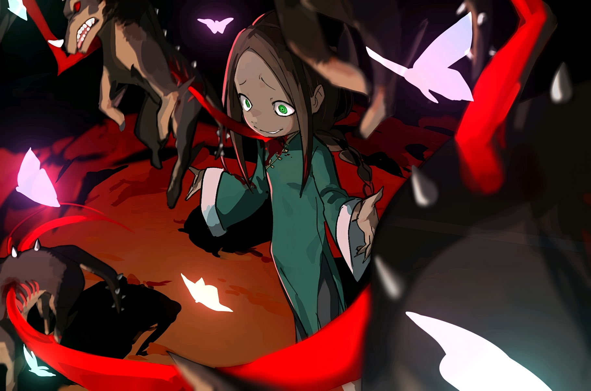
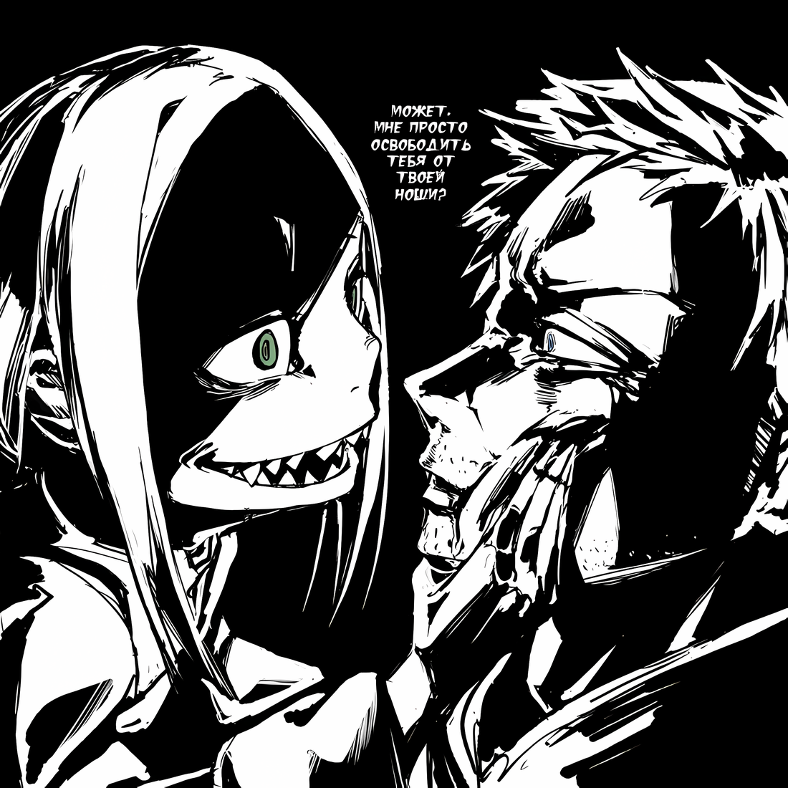
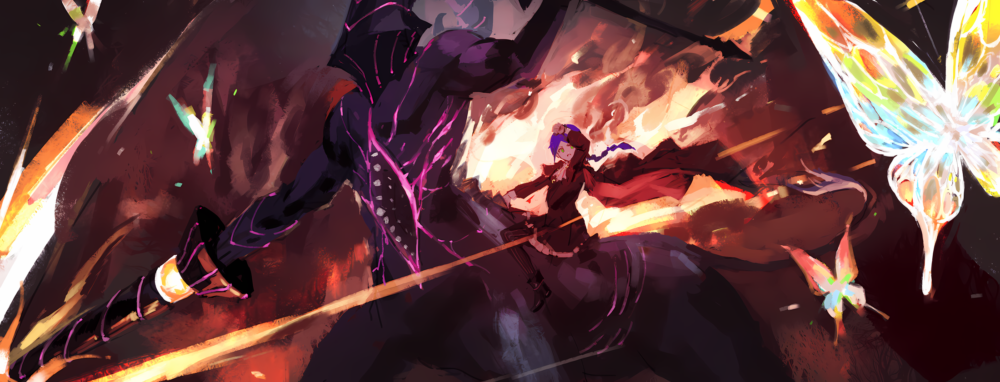
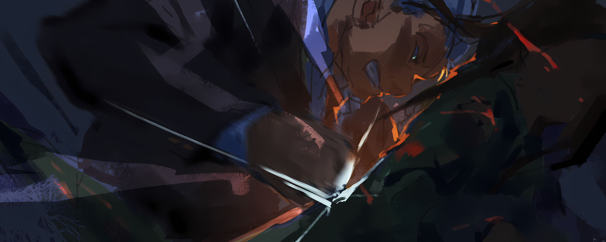
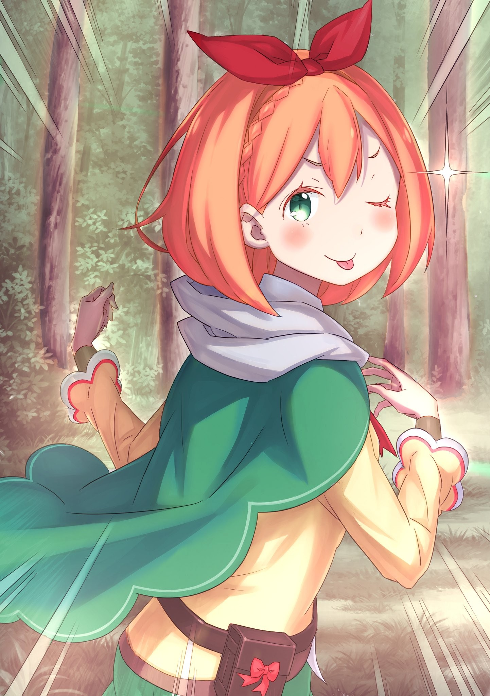

О любящий Бог, о мудрый Будда, о всеблаженная Лагуна… Даю обет, что в жизни больше с куклами не поиграюсь.

△ ▼ △ ▼ △ ▼ △

— …

В тот миг, когда колено врезалось ему в подбородок, в сознании Лоя Альфарда начался самый настоящий хаос.

Странно. Необъяснимо. Дико. Немыслимо. Что-то не так. Сбой. Ошибка. Катастрофа. Неверно. Неправильно. НЕПРАВИЛЬНО. Сумбур. Сомнение. Сомнениесомнен и е с о м н е н…

— Сдохни.

Пока он пытался собраться с мыслями, застигшая его врасплох девушка не собиралась давать ему передышки.

Её тонкие белые пальцы стальными тисками впились ему в горло. В глотке заклокотало, лёгкие вспыхнули огнём, а тщедушное тело пронзили удушье и боль.

Но истинный ужас представляла собой её безжалостность — хватка не ослабевала ни на миг…

— Фура.

Воздух меж её пальцев сгустился в острейшее лезвие, безжалостно полоснувшее по его тонкой и беззащитной шее. Ещё немного — и голова слетит с плеч…

— А вот и не-е-ет!

Клинок ветра рассек плоть, из раны фонтаном брызнула кровь, но удар не стал фатальным.

Его кожа обрела твёрдость шкуры «Хищника» Бели Хайнельги — преступника, которого не брали мечи тысячи стражников, — и он выжил.

— …

Рам ошеломлённо распахнула глаза. Воспользовавшись её секундным замешательством, Лой утащил девушку за собой в небо над полем боя, применив силу «Прыгуна» Доркеля.

Тот получил эту способность по наитию небес, самой Од Лагуны, и использовал её для несения хаоса и убийства сильных мира сего.

Из-за того, что у его телепортации не было никаких предпосылок, она застала Рам врасплох.

Архиепископ тут же повалил девушку на землю и, пока она приходила в себя, окинул поле боя взглядом в поисках новой добычи…

— Эль Фура!

— И-и-и! Ничего себе!!

Не раздумывая ни секунды, горничная шарахнула его магией Ветра прямо по животу. Лой невольно застонал от восторга.

Конечно, перенос её удивил, но она в одно мгновение переварила шок от неудавшегося убийства, изумление от перемещения и тут же контратаковала. Какая отвага! Какая стойкость!

— Ну ты даё-о-ошь!

Атака разбилась о его защиту, но в душе Лой ликовал. Свою восторженную хвалу он выразил ударом «Ладони Короля Кулака» — техники, способной дробить головы сильнейших воинов острова гладиаторов.

Само собой, её хрупкое тело должно было разлететься вдребезги… но оно просто исчезло.

— Потерял Рам? Какие же у тебя бесполезные глаза. — произнёс возникший позади него силуэт.

Не глядя, Лой рубанул «Ладонью»… по пустоте. Словно по волшебству, девушка оказалась над ним и врезала ногой по затылку, отправляя камнем вниз…

— А-а-ах, какая красота-а-а…

Он падал, но ничего не мог с собой поделать — его разум пленил её образ: развевающаяся юбка и розовые волосы, изящно трепещущие на ветру…

Архиепископ рухнул на землю, удар отозвался болью во всём теле, но ему было всё равно.

«Хищник» × «Прыгун» × «Ладонь Король Кулака».

Его восхитила та лёгкость, с которой эта сильная и умная девушка отразила атаки некогда пожранной избранной своры.

Значит, пора и ему произвести впечатление. Вскочив на ноги, Лой согнул колени, готовясь к прыжку…

Ведь…

— За радушный приём и платить надо всем-всем-всем! Выложить всё, целиком, полностью, до донышка! А иначе, какая же это любовь, а?!

— Такие рассуждения… до ужаса напоминают мне кое-кого. И мне это страшно не нравится… — процедила Рам.

Но прежде чем он успел взмыть в небо, сбоку, с яростным рёвом, на него бросилась тень.

Огромное тело на гибких лапах, увенчанное изогнутыми рогами, — сама свирепость, именуемая «Чёрным Королём Леса», неслась на него.

— !!!..

— Й-я-а-а, Гилтилоу!!

На радостно взвизгнувшего Архиепископа обрушились смертоносные когти. Их встретила сила «Снегоеда» Тисло, по легендам имевшего нечеловечески мощное тело, способное остановить лавину — и оно выдержало удар зверодемона. Лой поймал правую, а затем и левую лапу зверя, вонзая пальцы в его плоть.

Он уже собрался их вырвать, как вдруг под брюхом зверодемона проскользнула фигура с палочкой наперевес. Их взгляды встретились.

— Ты и впрямь великолепна…

— Фура.

В следующий миг удар хвоста зверя отбросил его на десяток метров. Пропахав ногами землю, он поднял голову.

Позади Рам, на спине Гилтилоу, сидела Мейли. Её тонкий пальчик указывал на Архиепископа… нет, ему за спину…

— Взять его, мои чёрные пёсики~и~и!!

— !..

Вторя её пронзительному крику, тьму пронзили бесчисленные алые огоньки — налитые кровью глаза чёрных псов.

Оскалив морды, свора кишащих проклятиями зверодемонов бросилась на него.

Без капли жалости к добыче их клыки впились в тело «Чревоугодия», разрывая его на части. Какая ирония… «Обжора» стал пищей ненасытной стаи…

— А~а~а~а~а~а~а… — затянул он песнь, и вольгармы застыли на месте.

Он ласково погладил голову вцепившегося в его шею пса… и в тот же миг его собственная кровь, хлынувшая из ран, обратилась в извивающиеся клинки. Они пронзали, вспарывали и насаживали на себя беззащитных зверей, исторгавших предсмертные вопли.

— Опаньки.

Лой медленно выпрямился.

Сочась из его ран, блестящая кровь застыла в форме острых клинков. На них, словно жуткие плоды на ветвях деревьев, повисли безжизненные туши чёрных псов.

Вот так выступил блестящий дуэт «Несчастной Любви Поэта», певички Ноты, чья проклятая песнь несла смуту по всей стране, и «Кровавых Слёз Демона», мага Адвана, повелевавшего собственной кровью.

Вслед за этим из мёртвых тел зверодемонов, словно из коконов, выпорхнули мириады радужных бабочек — ожившая «Радужная Мечта Герцога», Матклима Джордана, что некогда пытался устроить в Священном Королевстве переворот.

Сколько трупов — столько и бабочек. И они всё порхали, порхали, порхали…

— Та-да-а-ам!

«Снегоед» × «Несчастная Любовь Поэта» × «Кровавые Слезы Демона» × «Радужная Мечта Герцога».

В вихре радужных крыльев Лой устроил блистательное представление. Так он выразил свою скромную признательность Рам и Мейли за их поистине сладкий приём.

Но в ответ получил лишь ледяные взгляды, в которых открыто читалась враждебность.

— Ах, браво, бра-во! Как же вы хороши-и-и! Такая слаженная атака, меня прям до мурашек пробра-а-ало! Давно вы так спелись, а? А-а, так я и знал… Это всё то ваше путешествие по пескам, о котором мы ни сном, ни духом, да-а? Ай-яй-яй, ну что за вредины…

— Хватит нести чушь, из тебя кровь хлещет. От разговоров с таким безумцем хрупкое сердечко Рам вот-вот разорвется.

— Хрупкое сердечко! То, как ты сама о себе такое говоришь, просто восхитительно! Я изнываю от нетерпения! Какая из ваших заготовок следующей отправится на костёр?! — театрально захлопал в ладоши он.

Кровавые клинки втянулись обратно в его тело, а мёртвые вольгармы с глухим стуком попадали на землю. Он мгновенно остановил кровь из укусов, заставив её свернуться, и с упоением выдохнул.

Что ж, его чувства остались без ответа, но всё равно, восхищение его — неподдельное. Неразделённая любовь причиняет боль, и всё же… он будет лелеять то, что они превзошли все его ожидания.

— Впрочем, оставим это.

Но сейчас даже нежные чувства к Рам отходили на второй план перед главной загадкой. Исчезновение Волканики…

Поистине поразительно — огромная туша «Божественного Дракона» просто пропала с поля боя.

— Наверное, дядька в шлеме и сестричка-синоби пропали так же, как появились леди Рам и остальные… Все ниточки ведут к господину Клинду… Похоже на Полномочие, да-а-а.

Исчезновение Альдебарана, Яэ и самого «Дракона». Появление новых врагов. Рам, которая то возникает, то пропадает. Всё идеально ложилось на «воспоминания» о способностях дворецкого.

Да и его собственные подсказывали, что такое не под силу ни простому таланту, ни «Божественным Защитам», даже учитывая их разнообразие.

Оставалось лишь одно. Полномочие.

А значит, вакантное место «Гордыни» больше не пустует.

— Ну ла-а-адно, кого волнуют те, кто уже не на столе?

Вместе с Волканикой с поля боя пропали Клинд и Розвааль.

Лой не в полной мере знал способности дворецкого, но раз у него есть Полномочие, он — полноценная боевая единица. Он и маркграф против «Божественного Дракона» — та ещё заварушка. Наверняка они просто сменили поле боя, чтобы никого не задеть.

Раз они ушли, фокус с появлением-исчезновением вряд ли повторится.

А значит, сейчас куда важнее насладиться гостеприимством этих дам, а не думать о бесчувственных беглецах.

— Ах, как же вы прекрасны, люди, просто великолепны…

Они продумали тактику против его «Полномочия», использовали зверодемонов, чьи имена нельзя съесть, и другие хитрости… Всё это было придумано против него.

Продумать всё заранее, чтобы встретить врага — лучшая приправа к главному блюду, сама суть гостеприимства. Вывернуться наизнанку, но развлечь гостя… Именно это и значит — отдать всего себя.

— Раз так, то и нам стоит принарядиться! Ведь проигнорировать та~-а~-акую заботу, любовь… было бы верхом неприличия!

— Что ты задумал? — настороженно свела изящные брови Рам.

Прекрасная горничная тут же уловила перемену в своем госте. В ответ тот лишь покачал головой, мол: «Ну что ты, что ты…»

Тотальная война… Да, лучше и не скажешь. Развязка всего.

Объединённые силы кандидаток — будь здесь Нацуки Субару, он бы наверняка назвал их «Охотниками за Альдебараном» — устроили поистине великолепный приём. В глазах каждого читалась готовность выложиться на полную, выжать из себя всю мудрость и силу, сражаться до последней капли крови.

Это касалось их всех. Лой вполне мог поставить каждому высший балл, нарисовать по цветочку в тетрадке. Он был на пике блаженства.

Единственный изъян, мешавший этому… был не в них.

А в нём .

— …

Краем глаза он заметил красный затылок оставшегося с ним на поле боя мужчины.

Хейнкель.

Он сидел на корточках, а из его носа ручьем текла кровь.

По мнению «Обжоры», этот тип был не так уж и плох.

В его образе жизни, в этих цепях, которыми он сам себя сковал, в его мрачных терзаниях, которыми он, похоже, ни с кем не мог поделиться, чувствовался свой мутный, горьковатый привкус — редкий деликатес.

Но любой деликатес хорош лишь до тех пор, пока не портит основное блюдо. А сейчас этот человек ни на что не годился.

— Даже самый роскошный банкет будет испорчен, если на одной из тарелок окажутся помои.

Даже «Обжора» не выносил, когда на поле битвы, где каждый ставит на кон свою жизнь, затёсывался тот, кто мог всё испортить.

Поэтому…

— Эй, дядь, хватит киснуть. Давай-ка живее!

— Ч-что!?.. Архиепископ… — заляпанный кровью Хейнкель поднял голову, услышав как к нему неожиданно обратились.

Когда их взгляды встретились и голубые глаза мужчины затравленно забегали, Лою стало весело.

Какой умоляющий взгляд. Искать сочувствия у Архиепископа Греха… Даже у бесстыдства должны быть пределы. Такое безграничное убожество — само по себе редкий деликатес, но сейчас оно лишь мешает.

— А может, мне просто освободить тебя от твоей ноши? А, дядь?

Не спасти. И не бросить.

Просто ухмыльнувшись, он предложил третий вариант.

— …

Мужчина застыл, но по его широко распахнутым глазам было видно, что он всё понял.

Лой не знал деталей, не знал, насколько важна для него эта «ноша», но, вероятно, ему она дороже собственной жизни. И Хейнкель видел, знал, и понимал, что у него есть способ её отнять.

Понимал, что это не пустая угроза.

Поэтому…

— Вот та-а-ак-то лу-у-учше!

Увидев, как исказилось лицо стиснувшего зубы мужчины, он ощутил, как его грудь затопляет искренняя, чистая радость. Вторя его восторгу, радужные бабочки закружились в любовном танце.

В сиянии радужной пыльцы, заполнившей воздух, Архиепископ высунул язык и оскалился…

Теперь уж начнётся тотальная война.

— Хочу насытиться, но не хочу быть сытым… Ах, до чего же у жизни глубокий и удивительный вкус!

△ ▼ △ ▼ △ ▼ △

О любящий Бог, о мудрый Будда, о всеблаженная Лагуна… Даю обет, что в жизни больше иглы с нитками не трону.

△ ▼ △ ▼ △ ▼ △

— Гуэ…кх…

Сокрушительные удары в спину и грудь выбили из него дух, и он мешком рухнул на землю.

Удары близняшек — внучек Кэрол и Гримма, долгие годы служивших дому Астрея, — были отточены «Методом Потока», а потому, невзирая на их юный возраст, являлись смертоносным оружием.

— Ауф… гхоф… гхэ…

После Бедствия в Империи он почти не ел. Из его пустого желудка выжимало остатки кислоты. Он жалко давился желчью.

— …

— …

Над ним, с ледяным безразличием на лицах, стояли Флам и Грассис. Он криво усмехнулся.

Действующий глава дома Астрея… а дочери дома Ремендис смотрят на него с таким откровенным презрением.

— Мы служим молодому господину.

— Нынешний глава… вонзил меч в спину предыдущему.

Их ответы были так коротки и беспощадны, что у него не нашлось сил даже на упрёк.

Оба довода неоспоримы. Более того, они давали им вескую причину ненавидеть его и считать врагом. Первый терзал его постоянно, а второй — стал новой мукой. Эти грехи давили на него, словно каменные жернова.

И всё же…

— Не сдохну…

Этот сдавленный стон можно было трактовать двояко. То ли «сколько не бейте, мне нельзя умереть», то ли «сколько ни бейте, я не могу умереть».

Он и сам не знал, что из этого правда.

— Гх, у-ух!

Но девочкам было плевать на его шаткую решимость. Они не сомневались ни в чём.

Их кулаки и ступни по прочности не уступали стали. Обрушившийся на него град ударов походил на железный ливень.

Сверху, снизу, слева, справа, спереди и сзади — сёстры атаковали слаженно. Ему оставалось лишь жалко прикрывать мечом жизненно важные органы, да принимать удар за ударом.

«Метод Потока»… Он толком его и не освоил.

Опытные воины зачастую владеют им на подсознательном уровне. Ему подробно и доходчиво объясняли всю теорию, но он так и не смог довести его до совершенства в бою.

Девочкам, кажется, было всего по двенадцать. Даже если сложить их возраст, он прожил вдвое больше, но в этом он и в подметки им не годился.

Стало бы хоть на одну из сотен его мук меньше, если бы он мог списать всё на талант?

— Чёрт!

Отчаянный взмах меча рассек воздух. Близняшки, легко разгадав его намерение — лишь оттолкнуть их —, переглянулись и без труда уклонились. В следующий миг они поразили его уязвимые точки: локоть, подмышку и шею.

Кости затрещали. Вместо желудочного сока изо рта теперь капала кровь. Стоило ему на миг опустить голову, как девочки, словно только этого и ждали, взмыли в воздух и пнули его снизу вверх, прямо в нос.

— Га-а-ах!

Он рухнул навзничь, сильно ударившись затылком. Мир утонул в звоне и темноте. Усилием воли он вырвал себя из забытья, вскочил на ноги и снова вскинул меч.

Прямо перед ним, легко приземлившись после сальто, близняшки аккуратно отряхнули подолы. В их взглядах он уловил тень недоумения.

— …

Видимо, их удивляло, что он всё ещё стоит.

Прошло всего ничего, а он уже был измочален в клочья. Одежда в грязи, небритое лицо измазано кровью, ручьем текущей из носа…

Но он не падал. Оставался в сознании. Удар должен был свалить его на месте, и потому сёстры просто не могли в это поверить.

— Ха-а, ха-а-а…

Вот только нечего было тут гордиться этой выносливостью.

Дрожащий кончик меча выдавал всю тщетность его бравады. Исход боя… нет, это даже не было боем. А значит, ни победителей, ни проигравших, здесь быть не могло. Пока что.

— И всё… равно…

Нельзя падать. Нужно выстоять.

Если рухнуть сейчас, то ради чего это всё? Ради чего он вонзил меч в спину отца? Ради чего он вонзил меч в спину Вильгельма ван Астрея?

Упади он, всё потеряет смысл.

Но пока он стоит, надежда жива. Пусть и на волоске, но жива. Свет в конце туннеля… он появится.

Альдебаран. «Божественный Дракон». Может быть, Яэ. Да хоть Архиепископ Греха. Кто-нибудь переломит ход битвы и подарит ему эту надежду…

И тогда…

— Эй, дядь, хватит киснуть. Давай-ка живее!

Внезапный крик, разорвавший тишину, заставил его поднять голову.

И только сейчас он понял.

Огромной туши «Дракона» нигде не было. Исчезли не только Яэ и Альдебаран.

На поле боя остался лишь он да…

— Ч-что!? Архиепископ…

…Лой Альфард.

Проклиная себя за то, что вновь не замечал никого вокруг, он лихорадочно пытался понять, чего позвавший его хочет от него.

Сотрудничать с Архиепископом Греха… Честно говоря, он считал это безумием. Но ведь Нацуки Субару как-то сделал «Чревоугодие» своим союзником в Волакии. Эта мысль помогала хоть как-то подавить жгучее отвращение.

Раз уж он сбежал из Тюремной Башни, значит, точно не хочет подыхать. Тошнит от одного его вида, но если цель у них одна, можно…

— А может, мне просто освободить тебя от твоей ноши? А, дядь?

Его слова вмиг погасили хрупкий огонёк надежды.

— …

Это не было ни предложением помощи, ни просьбой о ней. Лишь эгоистичное, неуместное заявление.

О чём он вообще думает? Понимает ли, что происходит? Здесь нет ни необъяснимой силы Альдебарана, ни всесильного «Дракона», ни коварной Яэ.

Лишь слабый, хрупкий, беспомощный Хейнкель и этот мерзкий грешник. Зачем им враждовать?

Нет, это не он создал пропасть. Несокрушимый утёс, бездонная яма, существовала с самого начала. Просто сейчас она стала очевидной.

И что с того? Что значат его слова? И что делать ему, понявшему их смысл?

Освободить от ноши? От той самой, что уже вросла в его душу?

Этого не будет. Он не позволит.

— Вот та-а-ак-то лу-у-учше! — раздался весёлый голос грешника.

Но он не достиг ушей Хейнкеля.

Медленно, словно призрак, он поднимался на ноги. Лица близняшек напряглись. Они обменялись безмолвным взглядом и кивнули друг другу.

А затем…

— Приготовьтесь.

— Теперь — в полную силу.

Решив, что беспорядочными ударами его не сломить, девочки сменили тактику. Он кожей ощутил их обострившуюся ауру.

Да, теперь они не будут сдерживаться. Едва он это осознал, как сёстры оттолкнулись от земли. Бросились прямо на него… нет, не совсем.

— Ри-я-а!

Синхронно вскрикнув, они ударами ног вырвали из-под себя комья земли и пнули их ему в лицо, полностью лишая обзора.

Он рассек их мечом. Это не живые существа. Против бездушного камня его рука не дрогнет.

Но в открывшемся за завесой пыли пространстве их уже не было.

Они возникли по бокам, нанесли мощные удары с невиданной доселе скоростью, безжалостно нанося удары по его бокам.

— Гх…

Их маленькие кулачки вошли в его тело по самые запястья.

Рёбра хрустнули, удар всколыхнул сами внутренности, изо рта хлынул поток крови, мир качнулся на грани обморока.

Но он не упал.

Выстоял.

И не просто выстоял, а… стиснув зубы до скрипа, развернулся и схватил сестёр за те самые руки, что утонули в его плоти.

— Ах!

— Плохо дело…

Флам и Грассис скривились от боли в стиснутых запястьях.

Свободными руками и ногами они принялись молотить его, как наковальню, но он не отпускал.

Единственное, в чём он был уверен — его дар, о котором он никогда не просил, его нечеловеческая выносливость — наконец нашла применение.

Терпеть град ударов, чтобы вцепиться во врага мёртвой хваткой…

Грязный, бесхитростный приём, недостойный мечника.

Приём, как раз достойный такого, как Хейнкель Астрея.

— А-а-а-а-а-а!!

С окровавленным, распухшим лицом он взревел и взмахнул руками, со всей дури швыряя близняшек на землю.

В этот миг он забыл, что они дети. Забыл, что они служат его дому. Забыл, что они — драгоценные внучки Кэрол и Гримма, чьи лица он видел с самого рождения… Нет, не забыл.

Просто закрыл глаза.

Вложив в бросок все силы, он собирался размозжить их головы о землю…

△ ▼ △ ▼ △ ▼ △

О любящий Бог, о мудрый Будда, о всеблаженная Лагуна… Даю обет, что песни больше в жизни не спою.

△ ▼ △ ▼ △ ▼ △

«Радужная Мечта Герцога» не создаёт новую жизнь. Совсем наоборот — рождающиеся из трупов семицветные бабочки пожирают последние её искры, используя житье как топливо для вылупления.

По своей сути это смерть, принявшая облик обманчивой красоты.

— Радужная магия, вроде как, была козырной картой старшего брата.

Среди поглощенных «воспоминаний» промелькнула картина радужного сияния, окутывающего меч… Если подумать, то величайшая техника «Безупречного Рыцаря» и эти бабочки были почти идентичны.

Разница лишь в том, что «Безупречный» достиг такой силы заключив контракт с духами, а «Радужная Мечта Герцога» — в обмен на последние остатки жизней.

— Но сила-то у них та же.

По злорадной ухмылке Архиепископа два десятка радужных убийц разом устремились к Рам и Мейли.

Их реакция не заставила себя ждать.

— Сестрица Рам!

— Не так.

— Поняла, барыня!

Обменявшись этой короткой перепалкой, Мейли на своём Гилтилоу вырвалась вперёд. Ударив «Теневого Льва» по спине, она заставила его мощными лапами повалить ближайшие деревья.

С оглушительным треском стволы рухнули на землю, и в то же мгновение на их месте возникла девушка, присела и направила палочку вперед.

— Эль Фура.

Поднявшийся вихрь подхватил сломанные деревья и швырнул их прямо в стаю бабочек. Несущие смертоносную пыльцу создания столкнулись с преградой и озарили всё вокруг взрывами радужного сияния.

— У-у-у-ух! — не смог сдержать волну восхищения Лой и топнул ногой. Идеальное решение!

Семицветные бабочки таят в себе силу разрушать структуру всего сущего. По сути, они как огненные камни — взрываются при контакте. В то же время, их колоссальная мощь имеет свою цену — они одноразовые. Поэтому самый верный путь — бросить в них что-нибудь, чтобы они взорвались.

Сходу раскусить это… Он был в полном восторге!

— Но-о-о-о…

Если бы все бабочки так просто погибли, «Радужный Герцог» плакал бы в своей могилке.

Летевшие воплощения мечты предсказуемо исчезли, но выжившие тут же обогнули вспышку, разделились на две группы по пять особей и, сделав большой крюк, снова нацелились на девушек.

И на этот раз к ним присоединился он сам. «Прыгуном» он оказался позади, а мощью «Снегоеда» нацелился на Гилтилоу.

«Радужная Мечта Герцога» × «Прыгун» × «Снегоед».

Отвлекающая вспышка — спереди. Радужная смерть — слева и справа. Он сам — сзади. Путей к отступлению не было.

В тот момент, когда эта тройная смертельная атака должна была привести к ожидаемому результату, его ушей достиг плач младенца.

— !!!..

Неуместный на поле боя пронзительный крик на мгновение выбил его из колеи. Перед его глазами, исторгая этот детский плач, предстал зверодемон — богохульное, уродливое творение, ошибка самого Бога. Он размахивал двумя пылающими костяными копьями, сжигая всех бабочек, окруживших его.

Снова поле боя заполнило радужное сияние. Когда взрывная волна стихла, он, отряхивая волосы, увидел перед собой чудовище, которое должно было обитать лишь под песками пустыни, — Голодного Короля.

— Между прочим, его доставка сюда далась отнюдь не просто.

Огромный рог вместо головы, торс с гигантским ртом, и всё это на непропорционально большом лошадином теле. Слишком уродливо и искаженно для кентавра…

И верхом на этом уродстве, сменив «Теневого Льва», сидела Мейли.

— …

От этой картины мысли в его голове перемешались в кашу. Его «воспоминания» срочно созвали экстренное совещание, дабы выяснить «почему?», отреагировать на угрозу и выбрать «что делать?».

И прямо перед тем, как он выбрал самый срочный вопрос…

— Из какой свинарни ты вылез?

…прямо за его спиной раздался грубый голос.

— …!

От удара огромного кулака тело Архиепископа взмыло в воздух, перелетело через Мейли и её чудовищного скакуна, обогнало радужный взрыв и врезалось в землю, вспахивая её собой.

В последнюю секунду он вонзил руку в почву, затормозил и в будто идеально исполненном цирковом трюке приземлился на ноги, одним движением заставив врага отказаться от атаки.

Его взгляд метнулся к Мейли, затем к огромному свиночеловеку в чёрном костюме рядом с ней. А потом — к Рам, которая теперь стояла в совершенно другом месте.

Появление нового врага и эта необъяснимая смена позиций заставили его вспомнить о возможности, которую он уже отбросил.

— Нет, не так…

Из-за проклятых «воспоминаний» он застрял в ловушке собственных предубеждений.

Он списал всё на Полномочие Клинда. Дворецкий исчез вместе с «Божественным Драконом», и он решил, что больше об этом можно не беспокоиться

Но…

— Если ты тоже отец, то не смей трогать детей!!

До него донесся яростный крик. Краем глаза он заметил, как схвативший близняшек Хейнкель отлетает от мощного удара в лицо.

Нанёс его знакомый Лою по «воспоминаниям» Гастон.

А ведь изначально его здесь не было.

— …

Хейнкель опрокинулся на спину, а близняшки в последний момент успели вывернуться из его хватки.

То ли слова Лоя помогли, то ли нет, но мужчина почти достиг цели. Почти. Его выпад пресекли в самом начале.

Впрочем, Архиепископ и не думал смеяться над ним. Его самого подловили точно так же.

И сделал это не Клинд.

— Че-е-го? Да ладно-о-о? Серьёзно?!

Мысль была настолько дикой, настолько невообразимо, что он засомневался в самом себе.

Он не отрицал и не сомневался — лишь изумлялся. Ведь если это правда…

Даже если перебрать все «воспоминания» о ней, на ум приходило только одно: «Да быть того не может».

Значит, это она вмешалась в его бой с Рам и Мейли.

Она сорвала атаку Хейнкеля на близняшек.

Она с самого начала наблюдала за полем боя и, как кукловод, дёргала за ниточки Полномочием.

Это…

— Петра, когда ты успела стать Архиепископом Греха?

— Фу, как грубо. Если уж хотите меня обозвать, то лучше попробуйте…

Мастер Игры, носительница Фактора Ведьмы, девочка, правившая полем боя своим Полномочием… с детской невинностью она приложила руку к груди, озорно высунула язычок и протянула: — Бэ-э-э.

И добавила:

— «Ведьма Уныния», Петра Лейт.

