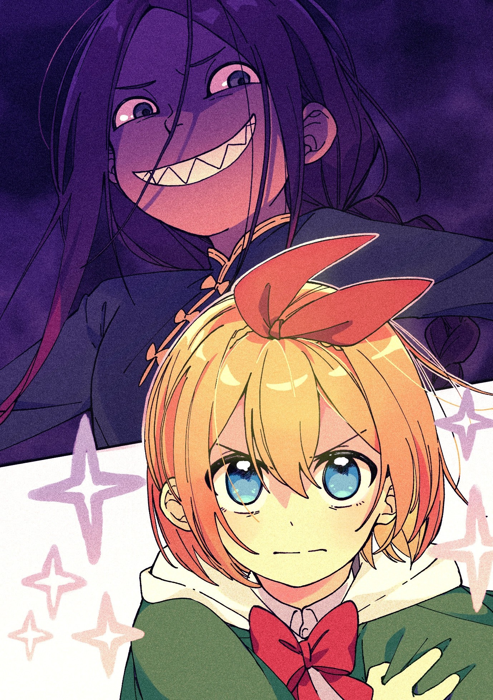
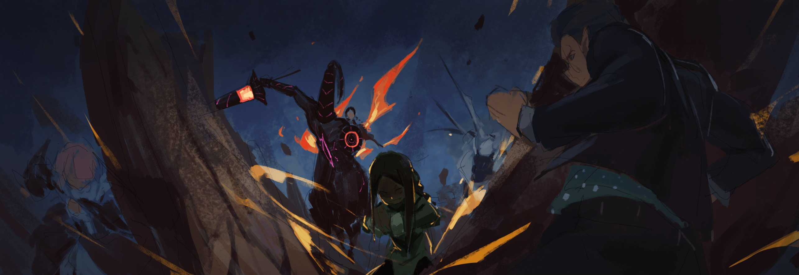
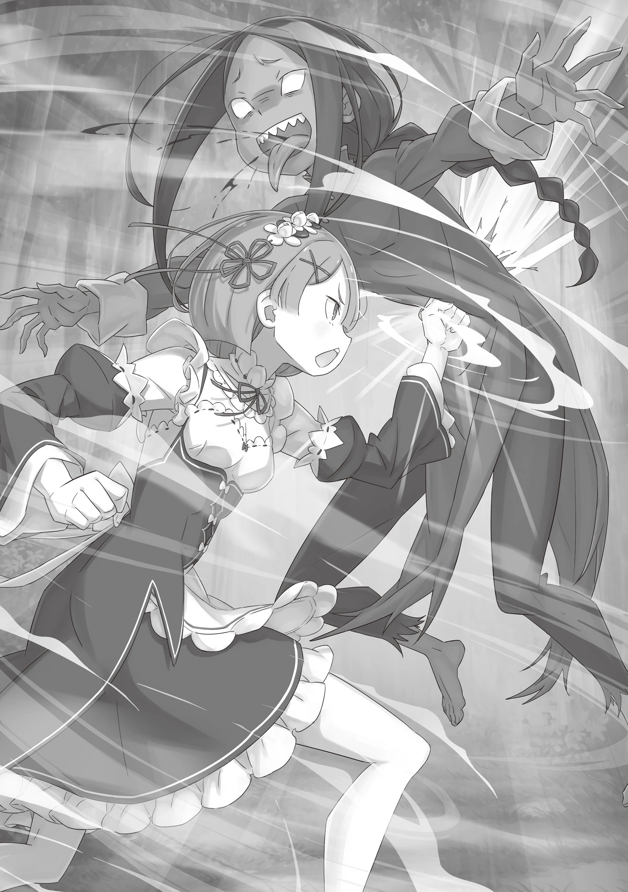

О любящий Бог, о мудрый Будда, о всеблаженная Лагуна… Даю обет, что в жизнь я больше с детьми не поиграю.

△ ▼ △ ▼ △ ▼ △

— А что, если кто-то другой… например, я, сможет использовать Фактор братца Клинда? Тогда можно «перемещаться» сколько угодно, не платя никакой цены?

Когда дворецкий рассказал ей о Факторе Ведьмы «Уныния» и связанном с ним Полномочии «Сжатия», эта мысль первой пришла ей в голову.

Он объяснил, что сам с ним несовместим, потому за каждое использование платит определённую цену. К тому же он заверил, что Фактор создавался под конкретного человека, а значит ей он тоже никогда не подойдёт.

Так команда мечты — «Ведьмак» Субару и его верная помощница «Ведьма» Петра — распалась, не успев основаться. Девочка тогда почувствовала и досаду, и облегчение одновременно.

Изначально план был прост: Клинд использует «Сжатие», дабы собрать всех для решающего удара. Но когда вскрылось Полномочие Ала, пришлось искать контрмеры — и о «Унынии» снова вспомнили.

Дворецкий заявил, что из-за несовместимости с Фактором он не может использовать Полномочие просто так. Но если взглянуть на это с другой стороны…

— Это ведь значит, что если найти способ заплатить цену, то «Сжатием» сможет воспользоваться кто-то ещё, да? — уточнила Петра.

Мужчину эта догадка, похоже, ничуть не удивила.

Благодаря его каменному лицу она убедилась в своей правоте. Всё же, если бы он хотел что-то скрыть, то изобразил бы удивление, мол: «Даже не задумывался об этом».

— Чтобы справиться с Алом и его компанией, мы должны их разделить. Если не считать его самого, то самый опасный противник — «Божественный Дракон»… но с ним разберётся братец Клинд, да?

— За него я могу поручиться. Клинд — ки-пёсон¹, наш козырь против Волканики. Я ведь пра-а-а-авильно использовал это слово?

— Да…

¹key person — ключевая фигура

Во время обсуждения Клинд уверенно заявил, что сдержит «Дракона».

Честно говоря, Петра до сих пор была в лёгком шоке. И Фактор, и то, сколько всего они с Розваалем скрывали… уму непостижимо. Но иметь такого надёжного союзника — большая удача. Правда, это не повод садиться ему на шею.

— Но если братец Клинд будет занят «Божественным Драконом», то уже не сможет перебрасывать людей «Сжатием», так ведь?

— Не стану отрицать. Подтверждение, — начал он со спокойным лицом, но с жаром в голосе. — Разумеется, я приложу все силы, чтобы доставить каждого на поле боя, но…

— Нет-нет. Тогда теряется вся прелесть «Сжатия». Его главная фишка в том, что оно, словно телепорт, позволяет вводить и выводить бойцов с поля боя.

Наверняка он не лгал.

Забросить весь отряд прямо во вражеский стан — уже невероятное достижение. Но глупо ставить шах, если можно объявить мат.

— И тут встаёт вопрос о передаче Полномочия… Это вообще возможно?

— Что касается этого… Сомнение, — замялся дворецкий.

— Братец Клинд, говори как есть.

— …

— Я думаю, настал момент, когда нужно понять, у кого какие козыри, и как их лучше разыграть. Давайте без секретов.

Она понимала, почему он не хотел говорить, почему колебался, но… всё это было ради спасения королевства, мира и Нацуки Субару.

А то, что Мейли, услышав, как Петра говорит о секретах, зыркнула на неё, было даже мило.

— Если речь о том, возможно это или нет, то да, возможно. Признание. Фактор «Уныния» несовместим и со мной, я лишь его хранитель. Ответственность.

— То есть нужно просто сменить владельца? Ха! Надо же, как всё просто. Случись беда, если Клинд его где-нибудь забудет.

— Забудет — это одно, но ведь его могут украсть или отобрать. Тоже страшно… Теперь я понимаю, почему его доверили именно ему.

Как оказалось, такая сила хранилась в довольно шатких условиях.

Петра была согласна, что Клинд — идеальный кандидат на роль хранителя: всегда собран, безупречен и надёжен.

Но…

— Пожалуй, в этот раз эту обязанность стоит передать кому-то другому.

— Кому-то другому… Но ведь Фактор — это ужа-а-асно опасная штука! Я… я однажды видела такой в «Святилище». С ним просто так не совладать…

— Да, риск есть… Но если использовать его с умом…

— Петрочка, я против, слышишь? — раздался резкий, полный неподдельного волнения голос.

Петра виновато опустила глаза. Она понимала и ценила то, что Мейли постоянно за неё переживает. В конце концов, когда-то она сама намеренно привязала её к себе, веря, что любовь — оружие, способное притупить даже жажду крови. И не прогадала.

— Хотя, может, эффект оказался слишком сильным.

— Так, сразу проясним: я тут целиком на стороне Мейли, — прозвучал в её голове голос, который слышала только она, и Петра почувствовала себя по-настоящему нужной. — Ты мне не рассказала, но уже чем-то заплатила Клинду. Но на большее я не согласен. И это не обсуждается.

Пусть воображаемый Субару и был лишь её удобной фантазией, воссоздан он был с такой точностью, что настоящий наверняка бы сказал то же самое.

— Хорошо, что здесь нет ни сестрицы Фредерики, ни Беатрис.

Одной Мейли хватило, чтобы серьёзно пошатнуть её решимость. Эти двое отправили бы её в нокаут. А будь здесь Гарфиэль и Отто? Первый бы точно накричал, а вот второй… ей казалось, он мог бы и понять.

В конце концов, сейчас он рискует больше всех, так что вряд ли имеет право её упрекать.

Осознавая, как сильно её любят и оберегают, Петра произнесла: — Давайте просто правильно распределим роли… Так, чтобы каждый выполнил свою часть наилучшим образом.

△ ▼ △ ▼ △ ▼ △

О любящий Бог, о мудрый Будда, о всеблаженная Лагуна… Даю обет, что в жизни больше к памятным местам я не поеду.

△ ▼ △ ▼ △ ▼ △

Крепко стиснув шкатулку за пазухой, Петра думала о Факторе «Уныния», который она, пустив в ход всё своё красноречие и обаяние, сумела заполучить.

— Нужно… сосредоточиться…

Она отчаянно цеплялась за свой рассудок. А ведь до сего дня девочка считала свою волю несокрушимой.

Она не сломалась, прочитав «Книгу Мёртвых». Даже когда её любимый не проявлял к ней ни малейшего интереса, она и не думала о том, чтобы сдаться. Она понимала, что для своего возраста успела побывать в немалом количестве передряг.

Но даже у неё от исходящего от Фактора Ведьмы всепоглощающего чувства всемогущества кружилась голова.

— Нет, нет, нет, я… Субару, поддержи меня.

— Петра, держись! Не проигрывай! Ввязалась в авантюру, от которой я тебя отговаривал… Если сдашься, то знаешь что?! Я тебя разлюблю!

— Тогда точно не проиграю…

Мысленно взывать к любимому, чтобы взять себя в руки — это, конечно, попахивало последней стадией одержимости, но раз уж это работало, значит, сила любви и впрямь велика.

Что есть какой-то там Ведьминский Фактор пред волей влюблённой девушки?

Борьба с ним была борьбой с самой собой, а в таких битвах любовь — лучшее лекарство. И уж Петра, давно переставшая быть простой деревенской девочкой, знала это лучше кого бы то ни было.

И потому…

— Дворянин на Огонь-восемь! Воин на Цветок-три!

Хриплый голос ударил по ушам. Она широко распахнула глаза и стиснула зубы.

Сработало «Сжатие». В её сознании возникла разлинованная сетка восемь на восемь, словно поле для шатранджа, и она перебросила бойцов на указанные клетки.

В тот же миг слуга Фельт, Гастон и свинолюд по прозвищу «Король Свиней», Дольтеро, своими могучими ударами прервали атаки Хейнкеля и «Чревоугодия».

— Че-е-го? Да ладно-о-о? Серьёзно?!

С акробатической лёгкостью погасив силу удара, Лой вскинул голову. Оторвав взгляд от Рам, за которой он до этого неотрывно следил, он посмотрел в сторону Петры.

Она держалась поодаль от схватки, наблюдая за всем с плеча старика Рома.

— Петра, когда ты успела стать Архиепископом Греха?

Следует ли сказать: «Как и ожидалось от Архиепископа»?

Короче говоря, он почувствовал, где находится Фактор. Хотя нет, не совсем, иначе раскусил бы трюк раньше. Скорее, он понял, что «Сжатие» — это Полномочие, и вычислил, кому из них его проще всего использовать. Так что ничего особенного.

— Фу, как грубо. Если уж хотите меня обозвать, то лучше попробуйте…

Он был проницателен, но девочка и бровью не повела. Лишь молча приложила ладонь к груди, ощутив под ней вверенную ей шкатулку.

И, показав язык, произнесла: — «Ведьма Уныния», Петра Лейт. И, показав язык, произнесла: — «Ведьма Уныния», Петра Лейт.

Назваться так — означало навлечь на себя ненависть.

Добровольно принять или услышать от других проклятый титул, из-за которого все будут шарахаться от тебя — просто безумие.

Но она произнесла его гордо и смело, будто это было нечто почётное.

Ведь служила она «Ведьме Оледенения».

А сердце её принадлежало благородному рыцарю, что был беззаветно той предан.

△ ▼ △ ▼ △ ▼ △

О любящий Бог, о мудрый Будда, о всеблаженная Лагуна… Даю обет, что в жизни больше цветков я не сорву.

О любящий Бог, о мудрый Будда, о всеблаженная Лагуна… Даю обет, что в жизни больше любимых блюд я не испробую.

О любящий Бог, о мудрый Будда, о всеблаженная Лагуна… Даю обет, что в жизни больше на родину я не вернусь.

△ ▼ △ ▼ △ ▼ △

— «Ведьма Уныния», Петра Лейт.

Стоило ему лишь услышать эти слова, как его захлестнула волна экстаза.

Экстаз от осознания, на что они пошли, и восторга от того, что они для него приготовили.

Принять Фактор, по своей воле стать обладателем Полномочия — «Ведьмой», «Ведьмаком», Архиепископом — само по себе было поступком, выходящим за грань здравого смысла. И именно это безумное решение, эта готовность пойти на всё, показалась ему высшим проявлением гостеприимства.

Той самой сильной, глубокой, огромной и горячей любовью, которой он так жаждал.

— Восхитительно!.. Ради этого стоило вылезти!

Раскинув руки, он задыхался от ликования, благодарил судьбу за эту встречу, за этот приём.

Раз уж она назвалась «Ведьмой Уныния», значит, его теория о «Гордыне» была неверна. Впрочем, от той, кого он звал матерью, Лой когда-то слышал, что Фактор «Уныния» — особенный, дефектный, несовместимый ни с кем. Он был одним из тех, что так желала его мать, и она точно обрадовалась бы, узнай, где он.

Понятное дело, этим лакомством он делиться не собирался.

— Всего-то милый каприз голодного дитя. Наверняка она поймёт.

Его мать была воплощением жажды признания, она обожала, когда ею восхищались.

Можно было предвидеть, какую истерику она закатит, узнав, что её дитя поставило свои желания выше её.

Раньше её эгоизм ужасно его бесил, но сейчас… сейчас даже больная самовлюблённость матери казалась ему её бесценной чертой.

— Королева на Землю-шесть! Охотник на Солнце-шесть! Дворянин на Тень-пять!

В ответ на приказ гиганта в глазах Петры на миг вспыхнул едва заметный огонёк.

Конечно, никакого огонька в них не было. Просто необходимость контролировать непривычную силу выдавала их с головой — они напрягались перед атакой. Обычно на такой пустяк не обратишь внимания, но в бою, где всё решает мгновение, эта деталь была бесценной.

Лой увидел, как исчезли фигуры Рам, свинолюда и Мейли с её зверодемоном. И в тот же миг они возникли вновь, окружая его с трёх сторон.

Благодаря огоньку в глазах девочки, он точно знал, когда это произойдёт.

— Оп-оп, секундочку!

За миг до удара он резко хлопнул в ладоши. Тут же земля перед ним вздыбилась, словно сжатый с двух сторон песчаный холм, скрыв его от Рам и свинолюда. Бросив их разбираться с преградой, он сосредоточился на приближающемся плаче младенца.

Даже не оборачиваясь, он видел, как на него несётся Голодный Король… а вместе с ним и Гилтилоу.

Резкий наклон. Уворот, уворот, уворот.

Облизнул губы.

«Сжиматель» Фигдол хоронил жертв, одним взглядом сминая пространство от краёв до центра, тогда как «Тысячеликая Святая» Йелла своим всевидящим сердцем замечала слёзы каждого страдальца на все триста шестьдесят градусов вокруг себя.

Но способности «Повелительницы Зверодемонов» Мейли ничуть им не уступали.

— !!!..

То, как она насылала на него стаи вольгармов, «Короля Песчаного Моря» и знаменитого «Чёрного Короля Леса», вызывало благоговейный трепет. По «воспоминаниям» он уже знал, что девочка управляет зверодемонами, не ломая им рога, но в Сторожевой Башне ему так и не довелось столкнуться с этим лично. Так что наконец увидеть это воочию было невероятно волнующе.

— Раз уж ты родилась с такой Божественной Защитой, жизнь у тебя, небось, была захватывающей! Поведай нам о ней, Мейли!

— Поведать, значит… Знаешь, об этом меня уже просили братец Субару и сестрица Эмилия.

— О-о? И что и что?

Мейли смерила его взглядом, пока он, пуская слюни, уворачивался от копья и когтей. С выражением чистого отвращения на лице, она показала ему язык.

— Это как с твоими речами о любви. Важно не что говорят, а кто говорит!

Эта неоспоримая истина заставила его лишь восхищённо вздохнуть. У него не нашлось, что ответить.

Тем временем, за спиной свинолюд уже проломил земляную стену. Сверху, снова исчезнув и появившись, камнем падала Рам. Спереди, сзади, сверху — его окружили со всех сторон.

Воздух вокруг него исказился — в ход пошла позабытая магия съеденного им «Чароплёта» Ярдли. Огненные, ледяные и земляные копья возникли в воздухе, нацелившись на Мейли, свинолюда и Рам…

Нет. Её там не было.

— Снова потерял Рам. Тебе глаза точно нужны? — раздался её ледяной голос прямо перед ним.

Её изящная фигура возникла так близко, словно готова была заключить его в объятия.

△ ▼ △ ▼ △ ▼ △

О любящий Бог, о мудрый Будда, о всеблаженная Лагуна… Даю обет, что в жизни больше ни перед кем я не поплачу.

О любящий Бог, о мудрый Будда, о всеблаженная Лагуна… Даю обет, что в жизни больше никого я не утешу.

△ ▼ △ ▼ △ ▼ △

— «Ведьма Уныния-а-а»!..

«Сжиматель» × «Тысячеликая Святая» × «Чароплёт».

Даже сила этого нового сочетания была превзойдена. Поняв, чьих это рук дело, он издал гортанный звук.

Голос его дрожал не от гнева, а от чистого восторга. Сердце колотилось в груди так, что было не унять.

Поддавшись этому порыву, он заставил три стихийных копья столкнуться друг с другом. Взрыв и плотное облако пара должны были заставить их отступить, перегруппироваться…

— А?..

— Думал, Рам использует «перемещение», чтобы не пораниться?

Обжигающий пар, призванный скрыть его из виду и вынудить врагов использовать «перемещение», был разорван изнутри. Из его рваной пелены вырвалась хозяйка алых глаз.

Её готовность с головой ринуться в кипящую волну застала его врасплох — ведь он полностью исключил вариант сознательного получения увечий.

В голове мелькнула мысль применить «Прыгуна», чтобы отступить, но…

— Восхитительно!

Признав великолепие врага, «Обжора» Лой Альфард пробудился.

Торжествующий вопль взорвался у него в голове, а сознание затопил шквал гениальных ходов.

Он распахнул сокровищницу накопленных «воспоминаний», перебирая несметные сокровища в поисках того, что слепило глаза, того, что ждало этого самого мгновения, чтобы впервые явить себя миру.

Главная загадка — что за «гостеприимство» сорвало его трапезу?

— …

Попытка Лоя поглотить «воспоминания», протянуть руку к душе девушки, провалилась.

Но это точно была Рам. Свежайшие «воспоминания» это подтверждали: их источник звал её Рам, окружающие звали её Рам, она сама называла себя «Рам». Рам до мозга костей.

И всё же это имя не сработало. Значит, причина неудачи могла быть лишь одна…

— Смена… истинного имени!

«Затмение» вырывает жертву прямо из летописи душ, которую ведёт Од Лагуна. Поэтому её имя должно совпадать с тем, что там записано.

Чаще всего это свершается через обет, даруемый новорождённому вместе с именем. Стоит лишь молитве быть услышанной — и истинное имя будет высечено в Великой Верховной Пустоте — Од Лагуне.

Обычно имя, данное при рождении, не меняется, как бы сам человек себя ни воспринимал. И одно из немногих исключений, когда Од Лагуна признаёт смену…

— Рам Мейзерс…

— !..

Он коснулся её раньше, чем она, прорвавшись сквозь пар, успела нанести удар.

Самая частая причина смены истинного имени — брак. К тому же, она сказала Мейли называть себя «барыней». А из «воспоминаний» было предельно ясно, кого она любит.

Убедившись в своей правоте, Лой посмотрел в расширившиеся от изумления алые глаза Рам — нет, Рам Мейзерс — и активировал «Затмение», чтобы пожрать её «воспоминания», понять её целиком и полностью.

— Приятного аппе … буэ-э-э!

В тот же миг его нёбо обожгло вкусом гнили.

Провал. Всё его тело содрогнулось от яростного отторжения. Настрой, с которым он готовился принять лакомство, разорвало в клочья. Разум затопили абсурдные вопросы.

Почему, отчего, непонимание, брак, Рам, истинное имя, любовь к сестре, дурной вкус, маркграф, преданность, злобный характер, превосходна, надёжна, только вкус и плох, и характер тоже, брак, страсть…

— Заглянул в «воспоминания» Отто? Вот болван.

— А?..

— Решил, что Рам воспользуется ситуацией, чтобы стать супругой господина Розвааля? Если бы ты действительно знал Рам, то не совершил бы такой ошибки.

В его глазах отразилась её насмешливая ухмылка. Тут, до него наконец дошло.

Просьба называть её «барыней» была лишь приманкой. Уловкой, призванной направить его по ложному следу, заставить опереться на «воспоминания».

И ведь он действительно пренебрёг безопасным вариантом — «Прыгуном» — и потянулся языком к её душе, будучи уверенным, что сожрёт её.

Решение, которое он бы не принял, не поглоти он «воспоминания»…

— Это тебе за Отто. Так, к слову.

Едва она это произнесла, как окутанная ветром рука, каменный кулак свинолюда, огненное копьё и когтистая лапа одновременно впились в тело Лоя Альфарда.

