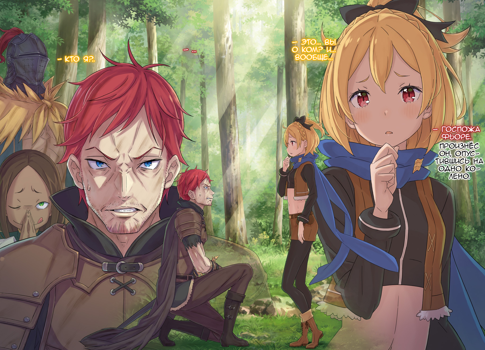
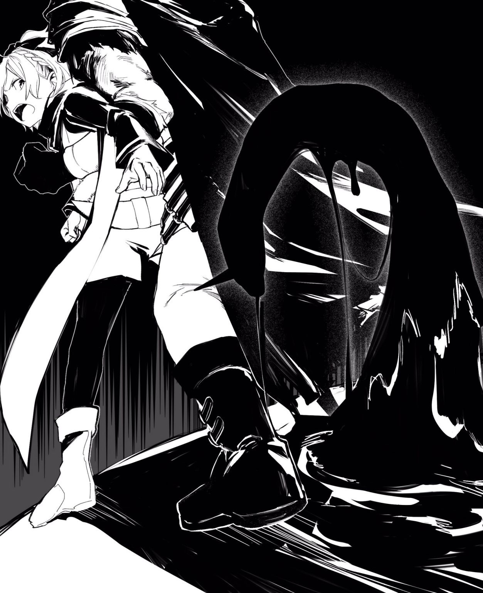

О любящий Бог, о мудрый Будда, о всеблаженная Лагуна… Дают обет, что в жизни я воспоминаниям больше не предамся.

△ ▼ △ ▼ △ ▼ △

— Если ты тоже отец, то не смей трогать детей!!

Эти слова ранили Хейнкеля куда сильнее, чем удар. Наблюдавший за этим старик Ром мог лишь догадываться, насколько глубоко они вонзились в его душу.

Он попытался отбиться от Флам и Грассис, полагаясь на свою выносливость, но его манёвр в последний миг пресёк Гастон… Вернее, девушка, перебросившая его «Сжатием» на поле боя.

— Да уж… Ничего не скажешь…

Убедившись в безопасности близняшек, Ром украдкой взглянул на сидевшую у него на плече Петру.

Она не сводила глаз с двух сражений: с Архиепископом «Чревоугодия» Лоем Альфардом и с предателем королевства Хейнкелем.

План был в том, чтобы разбить эту опасную группу — Альдебарана, его синоби, покорного ему «Дракона» и прочих — на части и уничтожить поодиночке. И не будет преувеличением сказать, что ключ к успеху всей операции был в руках этой хрупкой девочки.

Вся их стратегия строилась на советах Клинда, знавшего Полномочие «Уныния» вдоль и поперек, но стержнем операции, её сердцем, была именно Петра. Без неё эта битва попросту не состоялась бы.

— Кх!.. — закусила до крови губу она.

Её ногти впились в его плечо. Старик почти не почувствовал боли — что ему девичьи ноготки, — но по этому жесту понял, какая буря творилась в её душе.

Лишь носитель Фактора, что порождает «Ведьм» и Архиепископов, знает, какая это ноша. А ведь на эту роль рассматривали и его.

Нужен был просто кто-то не слишком сильный в бою, но достаточно умный и хладнокровный, чтобы руководить на передовой.

И он, и Петра идеально подходили. В итоге из-за принадлежности к разным лагерям выбор пал на неё, но всё могло сложиться иначе.

Поэтому он решил: первая его цель — вернуть Фельт. А вторая — стать для Петры надёжной опорой, не допустить ни единой ошибки и взять на себя тяжесть тактических решений.

— Королева на Цветок-три! Дворянин на Молнию-два! Охотник на Цветок-пять!

Выкрикивая команды, он окидывал всё поле боя взглядом и с каждым применением Полномочия чувствовал, как ногти девочки всё глубже впиваются в его кожу.

Основное напряжение было на фронте с Архиепископом. Лой, казалось, догадывался, откуда исходит координация, но Рам блестяще удерживала всё его внимание на себе.

Даже с поддержкой «Сжатия» битва с ним шла на равных из-за огромного количества козырей в его рукаве… А вот на втором фронте всё было иначе: там их союзники давили числом.

— Гх!.. — потонул крик Хейнкеля в граде безжалостных ударов.

К сёстрам присоединился Гастон. Их скорость дополнилась мощью, и теперь это напоминало уже не бой, а форменный самосуд. Но пока враг стоял на ногах, натиск ослаблять было нельзя.

Чтобы переломить ситуацию, нужен был решительный ход. И в тот миг, когда он об этом подумал…

— Старик Ром, — позвала его Петра.

Их взгляды встретились. Одного этого хватило ему, чтобы понять: они подумали об одном и том же. Не теряя ни секунды, он впился взглядом в поле боя, выискивая идеальный момент.

И вот…

— Королева на Солнце-пять! — выкрикнул он.

Петра напряглась, её рука мёртвой хваткой вцепилась в плечо старика, «Сжатие» активировалось и… четыре мощнейших атаки поразили Лоя.

— Есть!

Брызнувшая кровь доказывала, что ранили его серьёзно. Крошечное тело Архиепископа отбросило прочь.

Ром мог лишь восхищённо покачать головой. Этот замысел… Петра придумала гениальный план, а Рам его идеально исполнила. Они идеально рассчитали момент: Архиепископ применил своё Полномочие, потерпел неудачу и в итоге остался совершенно беззащитен.

Хотя нет, не Рам.

Рам Лейт.

Чтобы уберечь всех от «Чревоугодия», они пошли на одну уловку: используя лазейку в системе, бойцов просто фиктивно усыновили.

— Ну, теперь…

Противостояние сдвинулось с мёртвой точки. Воодушевлённый этим старик сжал свой огромный кулак и взглянул на второй фронт, надеясь развить успех и там…

— Никому не двигаться. Если жизнь этой… этой особы вам дорога.

…тоже произошли перемены. Но они обернулись катастрофой.

Хейнкель схватил Фельт и приставил меч к её горлу.

△ ▼ △ ▼ △ ▼ △

О любящий Бог, о мудрый Будда, о всеблаженная Лагуна… Даю обет, что рассказов я любимых отныне не прочту.

△ ▼ △ ▼ △ ▼ △

— Прости за всё, что было. Слишком уж много я на тебя взвалил.

Альдеберан принёс извинение уже после того, как избил… остановил Хейнкеля, когда тот, в пылу разговора с Фельт, едва не сорвался.

Он и сам понимал, что чуть не совершил непоправимое, а потому жаловаться не смел. Ему оставалось лишь молча принять и побои, и запоздалые извинения.

Однако один факт, который почуяла девчонка… его он не мог игнорировать.

Луанна Астрея. Его жена, спящая беспробудным сном.

И то, что причиной этого сна был их собственный сын, Райнхард.

— Эй, погоди-ка. В то, что между вами произошло, лезть не буду, но я ведь сказал, да? Прости, что слишком много на тебя взвалил.

— Не понимаю, к чему ты клонишь… Да, извинился, что ещё?

— Разумеется, продолжать терпеть я тебя не прошу… Девчонкой мы займёмся сами.

— Займёмся? Это как?..

— Ничего опасного, не переживай. Хотя, возможно, грубовато, — пожал плечами мужчина.

Он всегда был сам себе на уме, и понять его было непросто, но Хейнкель осознавал, что горе от потери Присциллы стало той силой, что заставила Альдебарана пойти против всего мира.

В основе его поступков лежала та самая неистовая любовь к «Солнечной Принцессе».

И всё же на самом дне его души ещё тлел огонёк здравого смысла, удерживая его от того, чтобы бросить в топку всё и вся. Но сейчас Хейнкелю казалось, что огонька больше и нет… Тормоза отказали.

— Чт… Что ты задумал?

— Тебе я ничего плохого не сделаю. Просто хочу кое-что проверить.

В пересохшем горле что-то щёлкнуло. Он одновременно и жаждал, и боялся услышать то, что вот-вот прозвучит, — это было знакомое лишь трусам предчувствие неизбежного.

И Альдебаран, словно не замечая его смятения, задал вопрос.

Вопрос о…

— Как там звали ту девочку, похищенную из замка лет эдак пятнадцать назад?

Для Хейнкеля — да и во всём королевстве — это имя со временем стало табу.

Дочь Форда Лугуника, младшего брата короля Радхала, сорок первого короля Лугуники.

Пятнадцать лет назад её похитили, и с тех пор о ней было ни слуху ни духу.

За всю историю королевства было немало венценосных особ с трагичной судьбой. Но лишь о той, кому была обещена счастливая доля, не сохранилось ни единого слова — ни о том, как она жила, ни о том, как она умерла.

— Фьоре Лугуника.

В её похищении обвиняли его.

Хоть Хейнкеля и оговорили, так уж всё обернулось, что он совершил то, чего уже не исправить: тяжко оскорбил и корону, которой присягал на верность, и Форда, которому был многим обязан.

Предательство службы, дружбы и чести.

— Приятного аппетита.

Греховный и отвратительный ритуал разворачивался прямо на его глазах.

Задавая свой вопрос, Альдебаран, должно быть, уже всё решил. Хейнкель же… знал, что этот ритуал стал причиной множества трагедий, и всё же надеялся на него, ведь…

Ведь если он сработает, ему не придётся её убивать.

— Спасибо за угощение!

Громкий голос и хлопок ладоней вырвали его из оцепенения. Он так отчаянно не хотел на это смотреть, что с головой ушёл в свои мысли и всё пропустил.

С каждой новой, недостойной рыцаря низостью он всё глубже тонул в собственной ничтожности, чувствуя, как нелепо сопротивляется какая-то жалкая часть его души.

Он шагнул вперёд, сменяя весело хохочущего Лоя.

И…

— Госпожа Фьоре, — опустившись на одно колено, он произнёс это имя.

На что вообще он надеялся? Скажи она, что это имя её, — ритуал бы провалился. Ответь она, что не понимает, о чём речь, — то всё равно обрекла бы его на мучительное смятение.

И ответ, что он получил, не зная, чего хочет сам… был таким: — Это… вы о ком? И… вообще…

— …

— Кто я?..

Ответ возвестил об успехе. Но от этого ему стало только больнее.

— Фьоре… это моё имя? Звучит так, словно чужое.

Лишённая «воспоминаний» девушка изменилась до неузнаваемости.

Прежние манеры, резкие движения, грубоватая речь — всё, что выдавало дурное воспитание, исчезло без следа. Теперь перед ним стояла особа, чьё достоинство и мягкость подобали принцессе. От этой перемены он застыл в изумлении.

Если бы не та трагедия пятнадцать лет назад, она бы непременно стала одной из любимейших принцесс королевства.

— Хотя, с другой стороны, могла бы и откинуть копыта от той же болячки, — безжалостно прервал его размышления Альдебаран.

И ведь это правда. Останься она в замке, загадочная хворь, выкосившая весь королевский род, не пощадила бы и её. На миг Хейнкеля озарило, но он тут же отмахнулся от этого, отказался смотреть правде в лицо.

Хватит. Просто хватит.

Он уже на пределе. И морально, и физически.

Заветная цель так близка… Он не мог позволить потоку шокирующих открытий сломить его.

— Вы чем-то опечалены? — спросила Фьоре, заметив, что он закрыл лицо руками.

Даже лишённая «воспоминаний» и находясь в куда более жуткой ситуации, она беспокоилась о других — в этом проявлялась кровь королевской династии Лугуники.

В то же время это было и жестоким подтверждением — Полномочие «Чревоугодия» сработало. Перед ним стояла Фьоре Лугуника.

А значит…

— Королевскому Отбору конец, — глухо произнёс он.

— Это ещё с чего?

— С того, что им искали «следующего» правителя. Запасная мера, раз уж королевский род прервался. Но если выяснится, что не прервался — можешь не сомневаться, все тут же переобуются на лету.

По иронии судьбы, правда вскрылась лишь потому, что Присцилла погибла, обезумевший Альдебаран вытащил Архиепископа из тюрьмы, а сама Фьоре, ещё не потеряв «воспоминания», надавила на его больное место.

Словно сам мир всё подстроил так, чтобы она взошла на престол.

Разумеется, бестактную мысль о том, что смерть Присциллы тоже была частью этого плана, Хейнкель оставил при себе. Всё же, коронация Фьоре его более чем устраивала.

Разбудить Луанну.

А остальное… Лишь бы оно улеглось как-то само. Это всё, чего он хотел.

Поэтому отступление «Ведьмы Зависти» и воцарение принцессы его полностью устраивало.

— Альтер, это лучший выход. Возражения?

— Ты не причинил девчонке вреда. На такой компромисс я, скрипя зубами, могу пойти. Блестящее решение, Исток. Но…

— Но?

— Ты сам до этого додумался?.. Непохоже на тебя.

— …

Пока Хейнкель убеждал самого себя, Альдебаран и «Божественный Дракон» уже решали судьбу Фьоре. Одна терзавшая его проблема сменилась другой — а что с ней делать?

— Ой, да это вообще не проблема! Правда ведь, господин Ал? — проворковала Яэ, внезапно высунувшись из-за его плеча.

Хейнкель затаил дыхание.

Словно прочитав его мысли, она насмешливо взглянула на него, заискивая перед Альдебараном.

Странной была не её издевательская манера — тут всё было как обычно — а то, как спокойно это воспринял сам мужчина.

— Да, ты права. Я ведь папаше обещал.

— А? Что обещал?

— Что Фельт… то есть, Фьоре, мы займёмся сами.

И он претворил свои слова в жизнь — с пугающим, бесчеловечным спокойствием, прямо на глазах у застывшего Хейнкеля.

Эта решимость… нет, вернее, слепая одержимость, которой были чужды любые моральные устои, повергла его в смятение.

Напряжение в их разношёрстной команде нарастало: странные отношения Альдебарана и Яэ, позиция «Дракона», расширение рамок дозволенного Архиепископу, сама правда о принцессе…

В этом хаосе Хейнкель решил, что хотя бы он должен оставаться в своём уме.

Как бы ни было тяжело, они не должны распасться до того, как он достигнет своей цели.

Поэтому…

— Хотя бы я должен оставаться в здравом уме.

Он поклялся себе в этом, принимая из рук Альдебарана чёрный шар размером с жонглёрский мячик — то, во что превратилась девушка после их «займёмся».

Он поклялся.

— Не хотите, чтобы госпожа Фьоре пострадала, — назад!

Он поклялся.

И вот теперь, когда его загнали в угол, он сдался, схватил повзрослевшую принцессу и приставил меч к её шее.

— Фельт!.. — сокрушённо выдохнул рослый мужчина, назвав её другим именем.

Безжалостно избивавшие его близняшки замерли. На их лицах смешались гнев, презрение и тревога.

Они испытали двойной шок.

Сперва из ниоткуда в его руках появилась знакомая им девушка, а затем прозвучало незнакомое им имя.

Неудивительно, что в их глазах плескались растерянность и страх.

— Прошу прощения, я не хочу прибегать к насилию… Прошу вас о содействии.

Произнося эти слова, обращаясь к своей пленнице, Хейнкель ненавидел себя за лицемерие.

Он старался. Изо всех сил пытался не впутывать её в эту внезапную бойню. Но он сломался.

Как и всегда, его усилий просто не хватило.

Поэтому он разбил вверенный ему Альдебараном чёрный шар, освободил Фьоре и, взяв её в заложники, начал угрожать врагам.

— Не двигаться. Если не хотите, чтобы она пострадала.

Даже сейчас, совершая последнюю низость, он поймал себя на том, что говорит с ней почтительно. Остаток его совести всё ещё тлел.

Пока он не был уверен, что это действительно она, он мог списывать золотые волосы и алые глаза на простое совпадение. Но теперь, когда всё подтвердилось, прежняя фамильярность была немыслима.

Он мог презирать себя за это, но вбитая в него родителями верность королевскому дому Лугуники брала своё.

— !.. — издала она тихий звук.

Она только очнулась после освобождения из чёрной сферы, и сознание, похоже, ещё не вернулось к ней полностью. А может, она просто была сбита с толку. Как бы то ни было, она ему подчинялась.

К его стыду, шантаж сработал. Противник замер.

Пользуясь этой заминкой, Хейнкель думал о том, как спастись самому и вытащить Лоя, пока Альдебаран и остальные запропастились…

— Фельт!!!

Этот рёв не имел ничего общего со сдавленным возгласом того рослого мужчины. В нём была сила.

В этом голосе слилось всё: радость от встречи с той, кто дороже жизни, ярость от того, что она в опасности, и стальная решимость вернуть её во что бы то ни стало.

Пленница вздрогнула.

Возможно, даже с пустыми «воспоминаниями», не понимая, где друг, а где враг, её душа откликнулась на этот зов. Она медленно моргнула алыми глазами, знаком принадлежности к королевскому роду, и встретилась взглядом со старым гигантом.

Губы дрогнули, приоткрываясь… И с них сорвалось…

— Старик Ром! Убери Гастона и остальных! Оно сейчас вылезет!

В этом окрике не было ни капли от принцессы. Всю королевскую утончённость смела ярость выросшей в трущобах девчонки.

Услышав зов семьи, «Золотая Львица» взревела и силой вырвала подлинную сущность из тумана забвения.

△ ▼ △ ▼ △ ▼ △

О любящий Бог, о мудрый Будда, о всеблаженная Лагуна… Даю обет, что в жизни больше я людей по прозвищам не назову.

△ ▼ △ ▼ △ ▼ △

Нет, свершившееся не имело ничего общего с теми чудесами, что в наивных преданиях вершатся одной лишь силой чувств.

Полномочие «Чревоугодия» искалечило слишком много судеб, так что мысль о победе над ним одним лишь душевным порывом — несусветная глупость.

Причина, по которой Фельт снова была собой, а не «Фьоре», была куда проще…

— Зна-а-ешь, тут такое дело… Нам, вроде как, придётся отведать твои «воспоминания». Так вот… не хочешь поработать с нами?

Лой подошёл к ней с этим предложением сразу после того, как Альдебаран решил ею «заняться».

План был донельзя прост: скормить Архиепископу её «воспоминания», убив двух зайцев одним махом — опасные сведения, что она разузнала, и её дерзкую личность.

«Главное — не убивать», — говорили они. Но для неё потерять себя было равносильно смерти. Методы шлемоголового ей совершенно не нравились.

— Но это не значит, что я стану плясать под твою дудку. И вообще, с чего ты взял, что я стану сотрудничать с таким ублюдком, как ты? Что я должна делать-то?

— Ха-ха, обожаю твой напор! Не переживай. Тщательное планирование и идеальные стратегии — вообще не наш стиль. Мы просим лишь об одном: притворись, что твои «воспоминания» съели.

— Продолжай…

Прищурив глаз, Фельт решила, что в его словах есть здравое зерно.

— Вот так-то лучше! — искренне расхохотался он. — В целом, подыгрывать этому мужику в шлеме не так уж и плохо, но… если ничего не предпринять, нас просто используют и выкинут. Видишь ли, на нас уже висит проклятая печать, так что мы в паршивом положении. Поэтому…

— Поэтому?

— Ты притворяешься, что всё забыла, и ждёшь удобного момента для удара. А мы попробуем воспользоваться шансом, который ты нам создашь, чтобы вырваться из плена.

— А я ведь могу просто всё рассказать шлемоголовому. Устрою вам раздор, и от тебя будет легко избавиться.

— Вот-вот! Да, да! Давай, жги!

Лой захлопал в ладоши от восторга. Пытаться разгадать его мотивы было бесполезно, так что она бросила эту затею. К тому же, ей показалось, что он искренен.

Да и для неё это предложение было настоящим спасением. В противном случае её бы просто стёрли.

— Но учти, чтобы сожрать меня, тебе нужно моё имя. Твой братец проблевался, потому что не знал его.

— Есть такое. Но разве ты сама не догадываешься, что твоё истинное имя совпадает с именем той самой принцессы из трагической сказки?

— …

— Хочешь проверить? Если «Затмение» сработает с ним, мы, конечно, заберём твои «воспоминания». Зато ты получишь доказательство. Ну, как тебе?

— Ха! Дешёвая провокация! — фыркнула Фельт, глядя на то, как Лой, высунув длинный язык, заглядывал ей в лицо. — Я в деле.

Кем она была когда-то, ей было совершенно безразлично. Да, может, для других это и было важно, но здесь работал тот же принцип, что и с потерей «воспоминаний»: это было равносильно смерти.

Плевать, с чего всё началось — та жизнь, где она не была «Фельт», закончилась, так и не начавшись.

Такая жизнь ей была не нужна. Поэтому она пошла на сговор с этим выродком.

— Победителем выйду только я.

— Ку-ку, ах-ха-ха! Я так и знал! Я верил! Но мы тоже подстрахуемся, чтобы не только ты могла победить, хорошо?

— Подстрахуетесь? Не говори глупостей. Ставь на кон всё, что есть.

— Твоя смелость восхищает, но для нас важна не гордость… а лишь одно: сожрать или быть съеденным.

И он щёлкнул зубами, скрепляя их подковёрный сговор.

После этого Лой, как и обещал, лишь сделал вид, что пожирает её «воспоминания». А она, в свою очередь, начала играть роль девушки без них — неизвестной ей принцессы, Фьоре Лугуника.

— Прости уж, сестрица Круш, но на ум пришла только ты.

Образ «Фьоре» она списала с потерявшей память Круш, и, похоже, всем это пришлось по вкусу. Особенно Хейнкелю.

К счастью, долго играть не пришлось. Вскоре Альдебаран заточил её в странную чёрную сферу. Внутри было душно и неудобно, но были и свои плюсы.

Чем меньше она играла роль, тем меньше был шанс проколоться. А если бы она допустила ошибку, сработала бы «страховка» Лоя.

Страховка на случай отказа от его предложения. Или на случай её предательства.

И ею был…

— Оно сейчас вылезет из моей тени! — закричала она.

Последний козырь Архиепископа Чревоугодия. Его шанс обмануть всех и сбежать.

Третий из Трёх Великих Зверодемонов.

Стоящий в одном ряду с Белым Китом и Великим Кроликом…

— ЧЁРНЫЙ ЗМЕЙ!!!

И, в ответ на попранный сговор, на поле боя явился ползучий мор — зверодемон, на счету чьём жизней было больше, чем у всего прочего зла этого мира.

