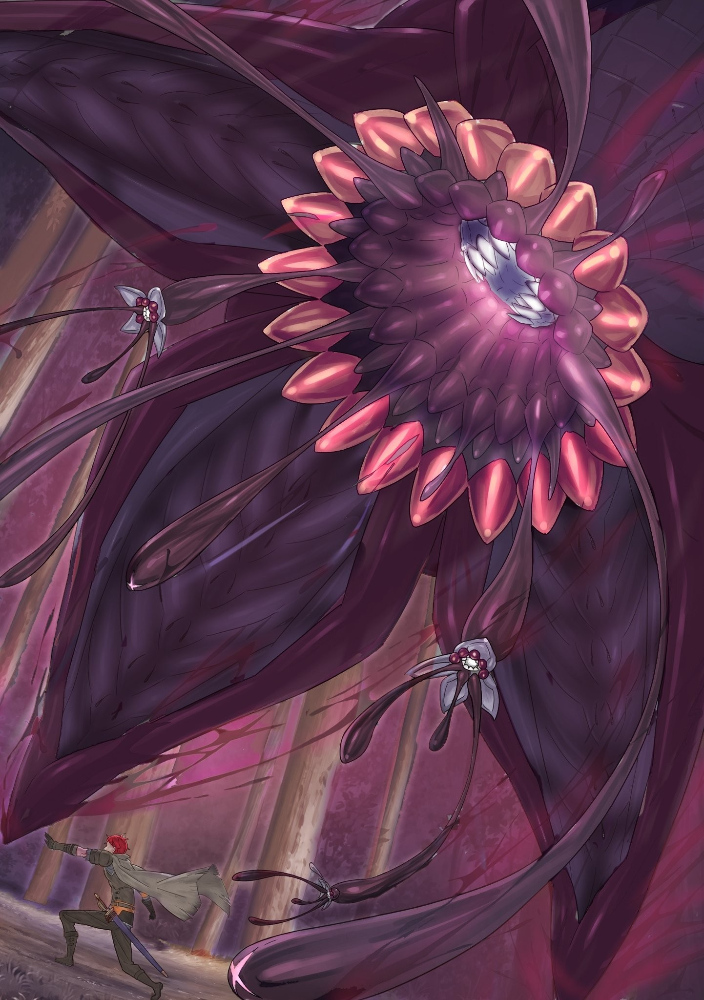
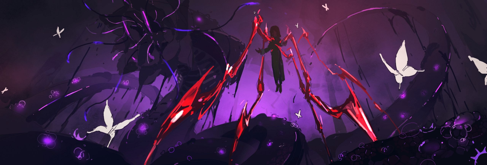

О любящий Бог, о мудрый Будда, о всеблаженная Лагуна… Даю обет, что в жизни никого я больше в дом не приглашу.

△ ▼ △ ▼ △ ▼ △

Поначалу Фельт и не думала нарушать их уговор.

Так называемая «страховка» Лоя была миной замедленного действия. Любой неосторожный шаг мог стоить жизни не только ей, но и всем, кто её окружал.

Поэтому, пусть и сгорая от унижения, она была готова немного поломать комедию, дабы выждать удобный момент, нанести удар по Альдебарану, его приспешникам, а в конечном счёте — обвести вокруг пальца и самого Архиепископа Греха.

Но этому плану не суждено было сбыться.

— Фельт!

Едва выбравшись из тесноты, она ощутила на шее ледяное прикосновение стали и тут же мысленно оценила ситуацию. Во-первых, нужно продолжать изображать из себя принцессу, чтобы «страховка» не сработала — та могла активироваться, даже если сама Фельт была вне поля зрения Лоя. Вторым пунктом шёл поиск идеального момента для того, чтобы утереть нос шайке Альдебарана.

Но все эти выверенные расчёты рухнули от одного-единственного окрика.

— …

Не в силах вырваться из мёртвой хватки, она с трудом подняла голову.

Там, в самой гуще сражения, стоял старик Ром. Всего пара дней разлуки, а она уже соскучилась… Но вместе с радостью пришло и горькое осознание: она — заложница. Приманка.

Маска благородной девицы начала трескаться, но Фельт силой воли удержала её… и встретилась взглядом не с ним.

А с бледно-голубыми глазами девочки, сидевшей у него на плече.

В тот же миг её сознание захлестнуло потоком информации.

— Угх…

Пока она моргала, в голове бушевал шторм.

Бой в самом разгаре. Альдебарана и Яэ нет, «Божественного Дракона» — тоже. Остались только Лой и Хейнкель. Тотальная война. Тактика — разделяй и властвуй. Командует старик Ром — ну, кто бы сомневался! Райнхард всё ещё сдерживает «Ведьму». Ещё, ещё, ещё, ещё, ещ…

— Старик Ром! Убери Гастона и остальных! Оно сейчас вылезет! — прорвавшись сквозь шквал информации, она выкрикнула то, что казалось единственно верным.

Какой смысл дрожать из-за «страховки», ломать комедию, если загнанный в угол Лой, едва представится случай, нарушит уговор? В конце концов, он — Архиепископ Греха. Верить ему на слово — фатальная ошибка.

Да и вообще, он лгал с самого начала. Его предложение было наглой ложью. План у него был один: сожрать всех. И её, и Альдебарана, и Яэ, и Волканику, и Хейнкеля.

Поэтому…

— Оно сейчас вылезет из моей тени!

…опережая его предательство, она сама пошла ва-банк.

Единственное, что её могло сдержать, — страх не справиться со «страховкой», — но и он рассеялся при виде своих. Особенно при виде старика Рома.

Если он здесь — нет ничего невозможного.

Вся та надежда, которую мир возлагал на «Святого Меча»… для Фельт целиком и полностью воплощалась в этом старике.

И потому…

— ЧЁРНЫЙ ЗМЕЙ!

…даже когда из её собственной тени хлынул чудовищный поток самой «Смерти», она не боялась.

△ ▼ △ ▼ △ ▼ △

О любящий Бог, о мудрый Будда, о всеблаженная Лагуна… Даю обет, что в жизни чью-то смерть я больше не увижу.

△ ▼ △ ▼ △ ▼ △

Чёрный Змей — ползучий мор, один из Трёх Великих Зверодемонов.

Все зверодемоны — враги человечества, но Трое Великих стоят особняком. Причина проста: оставаясь верными своей звериной сущности, они несли разрушения несоизмеримого масштаба.

Белый Кит стирал из бытия карательные отряды, что посылали против него целые страны.

Великий Кролик своим поистине стихийным аппетитом пожирал целые цивилизации и даже память об их трагической гибели.

Стоит ли говорить об ужасе, что они вселяли?

Но даже на их фоне Чёрный Змей был явлением иного, извращённого порядка.

Как уже говорилось, эта троица выделялась масштабом разрушений. Но если судить строго по этому критерию, то Чёрного Змея следовало бы называть не одним из Трёх, а единственным Великим Зверодемоном.

Ведь число жизней, что он унёс, стерев с лица земли целую империю прошлого, сократив число Великих Держав с пяти до четырёх, многократно превосходит количество жертв Кита и Кролика вместе взятых.

— Что-о?!

От такой вести Ром изумлённо вскрикнул.

Тотчас из-под ног Фельт вырвался сгусток миазмов — настолько тёмных и плотных, что казался почти осязаемым.

Словно голову подняло зло во плоти и обратилось к живым на языке инстинктов, шепча им о неминуемой «Смерти».

И всё же…

— Да чего ты на меня так уставилась?..

Фельт наверняка ощущала чудовищную ауру рядом, но в её взгляде не было и тени страха. Лишь безграничное, обжигающее доверие. От него в груди старого гиганта вспыхнуло пламя.

Такое доверие для старика — непозволительная роскошь. Оно заставляет пойти наперекор инстинкту самосохранения и оправдать возложенные на тебя надежды.

— Петра!

— Да!

В тот же миг девочка спрыгнула с его плеча. Одобрительно кивнув её молниеносной реакции, Ром бросил взгляд вперёд… и «Сжатие» сработало.

— …

Душу пронзило ощущение, будто мир вокруг замер.

Будь эта сила у Валги Кромвеля во всех его битвах, и тактика, и исход сражений, да и сама история могли бы пойти совершенно иным путём.

Одно лишь прикосновение к этой мощи, одно лишь ощущение Фактора «Ведьмы» рядом пробуждало в душе мучительное «а что, если». Вероятно, именно это и заставляло его избранников поддаваться искушению, тонуть в ощущении всемогущества и в итоге становиться чудовищами.

Но Петра…

— …

…крепко стиснув зубы, стойко терпела.

Само собой, Фактор лёг на неё тяжким грузом. Ему хотелось прямо сейчас освободить её от этой ноши, но жестокая реальность требовала обратного — заставляла девочку использовать свою силу. И оттого, что он сам был частью этой ненавистной реальности, на душе становилось гадко.

Раз уж ей приходится это терпеть, он просто обязан выжать из себя всё.

— Воин на Гром-восемь! Солдаты на Цветок-восемь!

Мысль тотчас же обратилась в приказ. Повинуясь ему, Петра мгновенно переместила Флам, Грассис и Гастона в тыл.

Одновременно с этим гигант рванул вперёд на то же расстояние, силой вырвал Фельт из хватки Хейнкеля и попытался отступить.

Но…

— Ка-а-ак жа-а-аль! А мы-то думали, что вместе сбежи-и-им, — раздался вязкий голос, перекрывая звук рвущейся плоти.

С запозданием ощутив жгучую боль, он застонал. Взгляды Рома и Лоя, рука которого пронзила правый бок гиганта, встретились.

Даже после их предыдущей атаки, весь в ранах, он всё ещё стоял на ногах и скалился.

— Ах ты, тварь, старика…

— А мы ведь предупреждали! Эти ребята даже нас толком не слушают! — ухмыльнулся Лой, кивнув себе за спину.

Там вздымался огромный столб чёрной скверны. Казалось, само созерцание этой тьмы высасывало жизнь. Каждое живое существо нутром чуяло: это не угроза и не блеф… Там, в этой черноте, скрывалась зловещая легенда.

— Н-ну-ух-х!

Терпя мучительную боль, он лихорадочно соображал.

Пытаться что-то предпринять здесь — самоубийство. Нужно убираться из зоны досягаемости языка этой твари. Но Лой будет мешать, так что уйти будет непросто. Есть ли у Архиепископа способ спастись или он готов сгинуть вместе с ними, лишь бы утащить их за собой в могилу?

Найти, найти, найти лучший выход!..

— Защитите дочь Форда!

Он и сам не понял, почему его раскалённый добела разум решил, что нужно выкрикнуть именно это. Весь мыслительный процесс сжался и вырвался наружу отчаянным воплем.

И на него откликнулись.

— У-а-а-а-а!

Дрожа от страха, Хейнкель рефлекторно взмахнул мечом и одним косым ударом отбросил Лоя.

Яркий блеск стали удивил даже того, кто ею взмахнул, а для спасённой Фельт это было подобно грому среди ясного неба.

— Ты…

— !..

Заметив её изумлённый взгляд, мужчина стиснул зубы. Его рука метнулась вперёд и толкнула не Фельт, а огромного старика. Неожиданно сильный толчок отбросил их обоих в сторону.

А затем, на их глазах…

— Госпожа Фьоре, я…

Кто и какими словами смог бы описать то лицо, на котором смешались смятение, сожаление, любовь и ненависть? Что пытались донести губы, искривлённые в гримасе сложнейших чувств?

Этого нам узнать не дано.

Потому, что прежде чем слова сорвались с его губ, Хейнкеля Астрея с головой накрыл ниспадающий поток скверны.

— …

Подобно водопаду, Чёрный Змей обрушился на землю. И она умерла. Деревья засохли, трава и цветы сгнили, вода помутнела и вскипела. После касания его языка не осталось ни единого проблеска жизни. Всё было поглощено и безжалостно убито.

И принявший этот удар на себя исключением не стал.

— Придурок!

— Э-эх, какая потеря!

Как ни странно, в этот миг реакции Фельт и Лоя совпали.

Но Ром не имел права скорбеть. Он понимал, что Хейнкель пошёл на это из-за его крика. И этот грех теперь лежал на нём.

И медлить было нельзя — Архиепископ уже выбрал новую цель.

— Фьоре Лугу…

— Охотник на Ветер-два!

Голос Лоя утонул в яростном рёве старика Рома, который не смогла заглушить даже бурлящая скверна.

Он резко развернулся, оттолкнул Фельт от маленькой фигурки Архиепископа, и отдал приказ своему партнёру. Приказ не бежать, а переломить ход битвы.

— !!!…

— Да этого ребёночка я и сама вряд ли сдержу!

На его зов на поле боя ворвался гигантский хищник, на котором верхом сидела Мейли.

Рык зверя слился с её отчаянным криком, его когти нацелились прямо на Лоя, а сама «Повелительница Зверодемонов» указала на сгусток скверны, набрала воздуха в грудь и гаркнула: — СИДЕТЬ!

Громоподобный приказ обрушился на чудовище, вызвав в нём непреодолимое желание подчиниться.

И в тот же миг жижа, что ползла по земле, просачивалась сквозь тени и уже готовилась разделиться, замерла на месте. Пока зверь отвлекал внимание на себя, Ром отпрыгнул назад вместе с остальными, вырвавшись из зоны досягаемости Чёрного Змея.

Они выбрались. Наконец отдышавшись, он обернулся, чтобы впервые увидеть врага во всей красе… и оцепенел.

— …

Это было нечто, не имевшее ничего общего с привычным понятием «зверодемон».

Это была сама «Смерть».

Выплеснувшаяся из тени скверна сгустилась в змеиное тело. Но соткано оно было не из плоти и чешуи, а из бесчисленных гнойников, лишь по воле случая слившихся в единый омерзительный силуэт.

Подобие чешуи на его теле то и дело вздувалось и лопалось, разбрызгивая чернильные капли гноя, и каждая такая капля беззвучно разъедала всё, к чему прикасалась. Там, где должна была быть голова, туловище распускалось гниющим цветком, из сердцевины которого извивалась омерзительная масса тонких нитей — то ли языков, то ли щупалец, то ли клубка склизких паразитов.

Это существо было оскорблением самой жизни, воплощением «худшего из зверодемонов».

Если Белый Кит стирал историю с небес, а Великий Кролик пожирал всё живое на земле, то Чёрный Змей был чумой, что заражала и разлагала мир изнутри. Сама погибель во плоти.

— Соверше-е-енно верно-о-о! — восторженно взвыл Лой, стоя прямо на земле, уже тронутой скверной.

В тот же миг исполинский зверь пропустил удар ладонью снизу и взмыл в небо, забрызгивая всё кровью.

— Львёночек!.. — в отчаянии вскрикнула Мейли, но было поздно.

Подброшенный в воздух Гилтилоу, беспомощно вращаясь, рухнул на уже покрытую скверной землю. Его огромное тело коснулось зловещей жижи, и чума с ужасающей скоростью начала его пожирать.

Под душераздирающий предсмертный рёв зверя Лой шагнул в самый центр скверны, ступая по ядовитой земле созданными из собственной крови крабьими лапами.

— Ну же, не плачь, Мейли. Этот малыш просто переродится. Вот так. — сказав это, Архиепископ щёлкнул пальцами.

То, что было Гилтилоу, и так уже превратилось в бесформенный чёрный ком… но теперь оно раздулось и распалось на мириады радужных бабочек.

Они закружились в танце, а Лой, стоя посреди клубящихся миазмов, зловеще расхохотался.

— Фельт, он что, контр…

— Говорил, что толком им не управляет. Но раз уж спрятал в моей тени, да ещё подвязал его под уговор — верить ему на слово я бы не стала.

— Как грустно! Неужели ты нас предала только потому, что не доверяла? Обманула Архиепископа Греха… Как низко! И как только твоя королевская кровь не бурлит от стыда?

— Извини, но моя кровь — это помои и чёрствый хлеб трущоб. И мне плевать, кем были мои родители. Плакать по такому ублюдку, как ты, я не стану.

Храбро ответив на его насмешки, Фельт бросила короткий взгляд туда, где в кольцах скверны исчез Хейнкель. После того, что случилось с Гилтилоу, его судьба была очевидна.

Ни старик Ром, ни кто-либо из её лагеря тёплых чувств к нему не питал. Но он был отцом Райнхарда. И успел переговорить с Фельт, пока та была в заложниках.

Такой конец даже он не заслужил.

— Уль Гоа!

Эту мимолётную сентиментальность сжёг дотла яростный крик.

Над их головами пронеслось пламя. Оно ярко озарило лес и устремилось к Чёрному Змею. Удар, взрыв — скверна яростно содрогнулась, и жаркий, гнилостный смрад ударил в нос, возвращая их в жестокую реальность.

Атаковавший же…

— Эй, Фельт! Раз уж вернулась, давай командуй! Это твоя работа! — крикнул Рачинс, сопроводив своё приветствие огненным залпом.

Похоже, он выложился на полную, потому что, едва вступив в бой, уже тяжело дышал.

Но его слова возымели нужный эффект. Глаза Фельт на мгновение округлились, а затем на её лице появилась решимость.

— Старик Ром, веди нас к победе.

— Непосильную задачу ставишь.

— Если бы она была невыполнима, я бы и не просила.

— Я не сказал «невыполнима». Я сказал «непосильна».

Рана в боку не позволяла ему двигаться так, как хотелось бы. Значит, нужно сосредоточиться на том, что он может. Кровь отхлынула от головы, позволив мыслить трезво.

Он знал, чем грозит прикосновение «Чревоугодия» к девушке по имени Фьоре Лугуника. Отбросив сантименты, Ром начал просчитывать варианты.

Увидев, как он собран, Фельт хлопнула себя ладонями по щекам и обрела уверенность.

— Ну что ж, вот приказ, которого вы так ждали! Вперёд, ребята!

— О-О-О!

На отважный призыв тут же откликнулись Рачинс, Гастон и остальные.

Видя, как его товарищи, столкнувшись с Архиепископом Греха и одним из Великих Зверодемонов, не дрогнули, а лишь воспряли духом, старик Ром ощутил укол гордости и тоже хлопнул себя по щекам.

— О-о-ох… — купаясь в их ненависти, Лой обнял себя. — Это просто невыносимо! О-о-ох… Вы все… вы так превосхо-о-одны… Мы вас всех… лю-ю-юбим!

△ ▼ △ ▼ △ ▼ △

О любящий Бог, о мудрый Будда, о всеблаженная Лагуна… Даю обет, что в жизни ничьих рук я больше не пожму.

△ ▼ △ ▼ △ ▼ △

Восхищаюсь — а значит, хочу вкусить.

Благодарю — а значит, хочу вкусить.

Люблю — а значит, хочу вкусить.

Но даже если злюсь, скорблю, боюсь, враждую, тревожусь, презираю, ненавижу, обижаюсь, горюю, издеваюсь, пренебрегаю, проклинаю… тоже хочу вкусить.

Всем своим нутром «Обжора» жаждал отведать каждого, кто здесь был.

— Но… хлопот не оберёшься.

Сбросив с себя изорванные в клочья лохмотья, он подставил ветру израненную кожу и хищно облизнулся.

Несработавшее «Затмение» и последовавшее за ним «гостеприимство» оставили на его теле чудовищные раны. Несмотря на напускную браваду, состояние его было плачевным.

Обильная кровопотеря лишь отчасти возмещалась «Кровавыми Слезами Демона», павших зверодемонов он обращал в радужных бабочек «Радужной Мечтой Герцога», но проклятая печать намертво пригвоздила его к полю боя.

Впрочем, даже будь у него шанс, перед таким роскошным столом мысль о побеге не возникла бы.

— Мы ведь не «Гурман».

Лай был привередой: он тщательно выбирал жертв и ценил антураж. Мог позволить себе не доесть, считая ожидание лучшей из приправ.

Но Лой был другим.

Его аппетит пробуждался при виде любого врага.

А значит, Лой Альфард хотел сожрать каждого человека в этом мире.

Так что о побеге речи не шло. Упусти он шанс отведать кого-то из них, и всех передников мира не хватит, чтобы утереть слюни разочарования.

— Вот только с подачей блюд сплошные хлопоты.

Съесть Рам не вышло. Ни как «Рам», ни как «Рам Мейзерс».

Её истинное имя было иным. Не помогли даже самые свежие «воспоминания» её близкого, а это означало, что вариантов — не счесть. К тому же вполне возможно, что такую же «обработку» прошли они все.

— И насколько можно верить в эту «Ведьму Уныния Петру Лейт»?

Её громогласное заявление теперь казалось искусной ловушкой.

В таком случае единственной доступной целью оставалась Фельт, которая почти наверняка и есть Фьоре Лугуника. Но даже это не стопроцентная гарантия.

Если с ней «Затмение» даст осечку и его снова вывернет наизнанку — ему конец.

Поэтому, скрепя сердце, он принял немыслимое для «Обжоры» решение…

— Отложим-ка трапезу на потом.

Сейчас определить истинные имена этих лакомых кусочков и сожрать одного за другим невозможно.

Чтобы проглотить их всех разом, нужно было заготовить «консервы». К счастью, покорный ему Чёрный Змей в этом деле был мастером.

В идеале стоило бы призвать его там, где народу побольше, но, увы, Фельт предала его в самый неподходящий момент.

— Но именно поэтому!.. В этом!.. Весь!.. Сма-а-а-ак!

Истерзанный, обескровленный, мучимый звериным голодом, на последнем издыхании — в эту секунду «Обжора» распахнул свою бездонную пасть.

Сложив руки перед грудью, он одним движением собрал весь мир от краёв к центру.

Сила «Сжимателя» вырывала деревья с вековыми корнями, вздымала твердь, утрамбованную веками, одним махом отрезая добыче все пути к отступлению.

— Гастон! Дольтеро!

Два рослых мужчины попытались силой остановить возведение земляной стены. Равновесие длилось лишь миг. Их сопротивление отдалось в его стиснутых ладонях, и стоило им силой разжать его хватку, как прямо перед ним закружился огненный вихрь.

— Рачинс! Сестрица-горничная!

Огненный шар Рачинса слился с ветром Рам, обратившись в огненное торнадо. Пожертвовав тремя танцующими бабочками, Лой встретил его водяными копьями «Чароплёта».

Рождённые из маны павших бабочки сами по себе обладали разрушительной силой, но их можно было использовать и как внешние резервуары маны. Полумёртвый Лой хотел поддерживать «Метод Потока» за счёт собственной маны, так что они служили ему автоматической подпиткой. Подпиткой, что восполнялась с каждой жертвой Чёрного Змея.

— Флам! Грассис!

Огненный смерч и ледяная гора столкнулись, и взрывная волна пара окутала всё вокруг.

Небо стало белым, земля — чёрной. Прорываясь сквозь этот двухцветный мир, яростные атаки близняшек обрушились на Архиепископа, не давая ему передышки.

Приняв удар на прочную шкуру «Хищника», он ответил агрессивной комбинацией «Ладони Короля Кулака» в правой руке и «Снегоеда» в левой, одним ударом впечатав обеих в скверную землю.

Однако за мгновение до того, как смертоносный язык поглотил бы их, копьё Голодного Короля подхватило девушек и вытащило из опасной зоны. Ещё одно копьё было нацелено на него, но он раздробил его вместе с рукой противника песней «Несчастной Любви Поэта». От столь скудного улова его желудок свело от голода.

И тут…

— БО-О-ОЛЬША-А-АЯ ВО-О-ОЛНА-А-А-А!

Прямо за его спиной Чёрный Змей вытянулся во всю длину к небу, и медленно, словно подкошенное дерево, начал заваливаться вперёд — прямо на сгрудившуюся добычу.

Одно прикосновение — и конец. Охота этого сгустка воли к уничтожению, по сравнению с которым слово «убийство» звучит слишком мягко — примитивна и лишена всякой изобретательности.

Он вёл себя как прирождённый завоеватель.

Зачем утруждать себя оттачиванием мастерства, если для убийства достаточно просто разбросать себя?

Это беспощадное нечто обрушилось на Фельт и её людей, и тут…

— Будьте сильными!

— ЖИВИТЕ!

Единый рёв превратился в силу, и поток скверны Чёрного Змея отбросило назад.

«Силачи» оторвали от земли пласты, «маги» укрепили их, превратив в щит, а «технари» подбросили его навстречу чудовищу, выиграв одну-единственную секунду, пока щит таял, чтобы отступить.

Все действовали с невероятной слаженностью, принимая наилучшие решения…

— …

Смелые… отважные… до чего же восхитительно дерзки!

Видя перед собой воплощение «Смерти» и Архиепископа Греха, они продолжали бороться. Их неиссякаемый боевой дух был аномалией.

— Обычно люди паникуют, удивляются, ужасаются!

Смятение, шок, трепет — все те чувства, что должны были их парализовать, они проигнорировали. Они сражались.

Не в силах этого вынести, Лой закричал.

Такая слаженность превосходила и кровные узы и клятвы влюблённых. Их решимость и отвага были настолько абсурдны, что граничили с безумием.

Без сомнения. Они готовы.

Мысль озарила его: все они — один великолепный, яркий и многогранный пир.

На пиру этом нет ни закусок, ни гарниров, ни главного яства. Каждый из них — и первое, и второе, и компот. У каждого вкус уникален, у каждого он ценен, у каждого он неповторим.

Стоило ему подумать об этом, по всему его телу разлился жар, дыхание участилось, а кровь прилила к лицу.

Пока его глаза сияли от предвкушения, Фельт выкатилась из дыма и показала ему средний палец. Оскалившись, она прорычала: — Хватит слюни пускать, психопат!

— Вы все так очаровательны, мы просто не можем устоять!

Его симпатия к Фельт всё росла и росла. Гнев от того, что его обманули, сменился благодарностью за то, что его предали. Ему подали такое восхитительное угощение… если он не ответит достойно, то опозорит имя Архиепископа Греха.

— …

Лой мельком взглянул на Чёрного Змея и заметил, что его движения стали вялыми.

Он — зверодемон, что методично захватывает территорию, заражая землю, не оставляя на ней ни единого чистого клочка. Охотник из него так себе. И пускай одна голова — это далеко не вся его мощь, движения всё равно казались слишком медленными, потому что…

— Сидеть, я сказала…

Вцепившись тонкими руками в Голодного Короля, Мейли дрожащим голосом сдерживала движения Чёрного Змея.

Глаза девочки налились кровью — результат чрезмерного использования своей Божественной Защиты. Её собственная кровь кипела от отдачи, а душу терзало жгучее пламя.

Но «Божественная Защита Демонического Манипулирования» действовала даже на одного из Трёх Великих Зверодемонов. Хотя, даже с учётом этого его реакция казалась Лою слишком вялой.

— Раз уж такое дело!.. Тогда мы!.. Поможем!.. Ему!

С восхищением, обращённым не к сдерживаемому Змею, а к сдерживающей его Мейли, Лой хлопнул в ладоши. Земля вздыбилась, радужные бабочки взорвали её, и во все стороны разлетелась дробь из скверны.

Прикоснёшься — умрёшь. Раз сам Змей неповоротлив, он поможет ему разнести заразу. Пара-тройка взрывов — и чёрная смерть покрыла огромную территорию.

— Ха-ха, ха-ха-ха, ха-ха-ха-ха-ха!

Сам Лой, оказавшись в эпицентре, конечно, играл со смертью… Впрочем, эта игра сходила ему с рук, пока его укрывала кровавая броня — идеальная защита от всепроникающей скверны.

Ни один человек, за редчайшим исключением, не может увернуться от капель дождя. И раз уж никто на этой «тарелке с угощениями» не был исключением, бомбы из миазмов Чёрного Змея должны были выкрасить всё поле боя в цвета смерти.

Вечно они друг друга прикрывать не смогут. В идеале нужно первым делом вывести из игры Мейли, но…

— А?

Стоило ему снять кровавый шлем, как из его уст вырвался звук чистого недоумения.

Перед его глазами, посреди гниющего от разбросанной скверны леса, зиял нетронутый островок. Все «угощения», сбившись в кучу и прикрывая спины друг друга, сумели пережить смертоносный обстрел.

— Не может быть.

Пыльцу радужных бабочек смёл встречный вихрь земляной дроби.

— Этого не может быть.

Сокрушительно давление, что должно было смять поле боя, рассеялось в самом зачатке.

— Да быть того не может.

Пронзительный визг, призванный парализовать их волю, потонул в яростном рёве пламени и воздуха.

— Не может быть, не может, не может, и именно поэтому…

Он вывернул наизнанку «Желудок Душ», без сожалений пускал в расход всё, что попадалось под руку, силами забытых аномалий творил один катаклизм за другим.

Но «Охотники за Альдебараном» во главе с Фельт отвечали на все его ходы единственно верными решениями. Вели себя как единый организм.

— Странно.

— …

Атакуя, стирая реальность и здравый смысл, Лой не переставал задаваться вопросом.

Слишком странно.

Да, они храбры. Да, доверяют друг другу. Да, у них одна цель. Да, они сильны и талантливы.

— Но всё равно это странно.

Люди не способны действовать так безупречно.

И всё же на каждую его атаку они в нужный миг разыгрывали единственно верную карту.

Это ощущение было ему знакомо. То же самое было в битве с Альдебараном в Тюремной Башне.

Освободив его из заточения, мужчина избил Лоя до полусмерти, просто чтобы показать разницу в силе. Тогда он ничего не мог сделать. Та же необъяснимость… похоже, но не то. Тогда это была аномалия одного лишь Альдебарана. Сейчас же — аномалия всех его врагов.

Здесь явно что-то не так.

— Ах-ха, так вот в чём дело.

Нечто, выходящее за рамки здравого смысла, не поддающееся логике и даже не заслуживающее обсуждения.

Когда он столкнулся с этими аномалиями его голодный разум уже был полон вопросов, но теперь он осознал до смешного очевидную истину — и мысленно обругал себя.

Его обманули. Из-за громких приказов Фельт он поверил, что ядро вражеской группы — это она.

И даже это заблуждение было частью их плана. Осознав, что настоящий мозговой центр — не Фельт, а скрывающийся в её тени кукловод, Лой перевёл взгляд на…

И в тот же миг этот кукловод моргнул и удивлённо выдохнул: — А…

△ ▼ △ ▼ △ ▼ △

О любящий Бог, о мудрый Будда, о всеблаженная Лагуна… Даю обет, что в жизни я никогда ни с кем не помирюсь.

О любящий Бог, о мудрый Будда, о всеблаженная Лагуна… Даю обет, что в жизни я больше никогда не рассержусь.

О любящий Бог, о мудрый Будда, о всеблаженная Лагуна… Даю обет, что в жизни я никогда и никому свои секреты не раскрою.

О любящий Бог, о мудрый Будда, о всеблаженная Лагуна… Даю обет, что в жизни я свою слабость никому не покажу.

О любящий Бог, о мудрый Будда, о всеблаженная Лагуна… Даю обет, что в жизни я ни с кем восхода больше не увижу.

△ ▼ △ ▼ △ ▼ △

— Только сейчас дошло? — ответила она.

«Ведьма Уныния» — та, что обратила целый мысленный диалог между всеми в единый, мгновенный поток, — лукаво подмигнула.

— Говорил, что толком им не управляет. Но раз уж спрятал в моей тени, да ещё подвязал его под уговор — верить ему на слово я бы не стала.

— Как грустно! Неужели ты нас предала только потому, что не доверяла? Обманула Архиепископа Греха… Как низко! И как только твоя королевская кровь не бурлит от стыда?

— Извини, но моя кровь — это помои и чёрствый хлеб трущоб. И мне плевать, кем были мои родители. Плакать по такому ублюдку, как ты, я не стану.

Храбро ответив на его насмешки, Фельт бросила короткий взгляд туда, где в кольцах скверны исчез Хейнкель. После того, что случилось с Гилтилоу, его судьба была очевидна.

Ни старик Ром, ни кто-либо из её лагеря тёплых чувств к нему не питал. Но он был отцом Райнхарда. И успел переговорить с Фельт, пока та была в заложниках.

Такой конец даже он не заслужил.

— Уль Гоа!

Эту мимолётную сентиментальность сжёг дотла яростный крик.

Над их головами пронеслось пламя. Оно ярко озарило лес и устремилось к Чёрному Змею. Удар, взрыв — скверна яростно содрогнулась, и жаркий, гнилостный смрад ударил в нос, возвращая их в жестокую реальность.

Атаковавший же…

— Эй, Фельт! Раз уж вернулась, давай командуй! Это твоя работа! — крикнул Рачинс, сопроводив своё приветствие огненным залпом.

Похоже, он выложился на полную, потому что, едва вступив в бой, уже тяжело дышал.

Но его слова возымели нужный эффект. Глаза Фельт на мгновение округлились, а затем на её лице появилась решимость.

— Старик Ром, веди нас к победе.

— Непосильную задачу ставишь.

— Если бы она была невыполнима, я бы и не просила.

— Я не сказал «невыполнима». Я сказал «непосильна».

Рана в боку не позволяла ему двигаться так, как хотелось бы. Значит, нужно сосредоточиться на том, что он может. Кровь отхлынула от головы, позволив мыслить трезво.

Он знал, чем грозит прикосновение «Чревоугодия» к девушке по имени Фьоре Лугуника. Отбросив сантименты, Ром начал просчитывать варианты.

Увидев, как он собран, Фельт хлопнула себя ладонями по щекам и обрела уверенность.

— Ну что ж, вот приказ, которого вы так ждали! Вперёд, ребята!

— О-О-О!

На отважный призыв тут же откликнулись Рачинс, Гастон и остальные.

Видя, как его товарищи, столкнувшись с Архиепископом Греха и одним из Великих Зверодемонов, не дрогнули, а лишь воспряли духом, старик Ром ощутил укол гордости и тоже хлопнул себя по щекам.

— О-о-ох… — купаясь в их ненависти, Лой обнял себя. — Это просто невыносимо! О-о-ох… Вы все… вы так превосхо-о-одны… Мы вас всех… лю-ю-юбим!

△ ▼ △ ▼ △ ▼ △

О любящий Бог, о мудрый Будда, о всеблаженная Лагуна… Даю обет, что в жизни ничьих рук я больше не пожму.

△ ▼ △ ▼ △ ▼ △

Восхищаюсь — а значит, хочу вкусить.

Благодарю — а значит, хочу вкусить.

Люблю — а значит, хочу вкусить.

Но даже если злюсь, скорблю, боюсь, враждую, тревожусь, презираю, ненавижу, обижаюсь, горюю, издеваюсь, пренебрегаю, проклинаю… тоже хочу вкусить.

Всем своим нутром «Обжора» жаждал отведать каждого, кто здесь был.

— Но… хлопот не оберёшься.

Сбросив с себя изорванные в клочья лохмотья, он подставил ветру израненную кожу и хищно облизнулся.

Несработавшее «Затмение» и последовавшее за ним «гостеприимство» оставили на его теле чудовищные раны. Несмотря на напускную браваду, состояние его было плачевным.

Обильная кровопотеря лишь отчасти возмещалась «Кровавыми Слезами Демона», павших зверодемонов он обращал в радужных бабочек «Радужной Мечтой Герцога», но проклятая печать намертво пригвоздила его к полю боя.

Впрочем, даже будь у него шанс, перед таким роскошным столом мысль о побеге не возникла бы.

— Мы ведь не «Гурман».

Лай был привередой: он тщательно выбирал жертв и ценил антураж. Мог позволить себе не доесть, считая ожидание лучшей из приправ.

Но Лой был другим.

Его аппетит пробуждался при виде любого врага.

А значит, Лой Альфард хотел сожрать каждого человека в этом мире.

Так что о побеге речи не шло. Упусти он шанс отведать кого-то из них, и всех передников мира не хватит, чтобы утереть слюни разочарования.

— Вот только с подачей блюд сплошные хлопоты.

Съесть Рам не вышло. Ни как «Рам», ни как «Рам Мейзерс».

Её истинное имя было иным. Не помогли даже самые свежие «воспоминания» её близкого, а это означало, что вариантов — не счесть. К тому же вполне возможно, что такую же «обработку» прошли они все.

— И насколько можно верить в эту «Ведьму Уныния Петру Лейт»?

Её громогласное заявление теперь казалось искусной ловушкой.

В таком случае единственной доступной целью оставалась Фельт, которая почти наверняка и есть Фьоре Лугуника. Но даже это не стопроцентная гарантия.

Если с ней «Затмение» даст осечку и его снова вывернет наизнанку — ему конец.

Поэтому, скрепя сердце, он принял немыслимое для «Обжоры» решение…

— Отложим-ка трапезу на потом.

Сейчас определить истинные имена этих лакомых кусочков и сожрать одного за другим невозможно.

Чтобы проглотить их всех разом, нужно было заготовить «консервы». К счастью, покорный ему Чёрный Змей в этом деле был мастером.

В идеале стоило бы призвать его там, где народу побольше, но, увы, Фельт предала его в самый неподходящий момент.

— Но именно поэтому!.. В этом!.. Весь!.. Сма-а-а-ак!

Истерзанный, обескровленный, мучимый звериным голодом, на последнем издыхании — в эту секунду «Обжора» распахнул свою бездонную пасть.

Сложив руки перед грудью, он одним движением собрал весь мир от краёв к центру.

Сила «Сжимателя» вырывала деревья с вековыми корнями, вздымала твердь, утрамбованную веками, одним махом отрезая добыче все пути к отступлению.

— Гастон! Дольтеро!

Два рослых мужчины попытались силой остановить возведение земляной стены. Равновесие длилось лишь миг. Их сопротивление отдалось в его стиснутых ладонях, и стоило им силой разжать его хватку, как прямо перед ним закружился огненный вихрь.

— Рачинс! Сестрица-горничная!

Огненный шар Рачинса слился с ветром Рам, обратившись в огненное торнадо. Пожертвовав тремя танцующими бабочками, Лой встретил его водяными копьями «Чароплёта».

Рождённые из маны павших бабочки сами по себе обладали разрушительной силой, но их можно было использовать и как внешние резервуары маны. Полумёртвый Лой хотел поддерживать «Метод Потока» за счёт собственной маны, так что они служили ему автоматической подпиткой. Подпиткой, что восполнялась с каждой жертвой Чёрного Змея.

— Флам! Грассис!

Огненный смерч и ледяная гора столкнулись, и взрывная волна пара окутала всё вокруг.

Небо стало белым, земля — чёрной. Прорываясь сквозь этот двухцветный мир, яростные атаки близняшек обрушились на Архиепископа, не давая ему передышки.

Приняв удар на прочную шкуру «Хищника», он ответил агрессивной комбинацией «Ладони Короля Кулака» в правой руке и «Снегоеда» в левой, одним ударом впечатав обеих в скверную землю.

Однако за мгновение до того, как смертоносный язык поглотил бы их, копьё Голодного Короля подхватило девушек и вытащило из опасной зоны. Ещё одно копьё было нацелено на него, но он раздробил его вместе с рукой противника песней «Несчастной Любви Поэта». От столь скудного улова его желудок свело от голода.

И тут…

— БО-О-ОЛЬША-А-АЯ ВО-О-ОЛНА-А-А-А!

Прямо за его спиной Чёрный Змей вытянулся во всю длину к небу, и медленно, словно подкошенное дерево, начал заваливаться вперёд — прямо на сгрудившуюся добычу.

Одно прикосновение — и конец. Охота этого сгустка воли к уничтожению, по сравнению с которым слово «убийство» звучит слишком мягко — примитивна и лишена всякой изобретательности.

Он вёл себя как прирождённый завоеватель.

Зачем утруждать себя оттачиванием мастерства, если для убийства достаточно просто разбросать себя?

Это беспощадное нечто обрушилось на Фельт и её людей, и тут…

— Будьте сильными!

— ЖИВИТЕ!

Единый рёв превратился в силу, и поток скверны Чёрного Змея отбросило назад.

«Силачи» оторвали от земли пласты, «маги» укрепили их, превратив в щит, а «технари» подбросили его навстречу чудовищу, выиграв одну-единственную секунду, пока щит таял, чтобы отступить.

Все действовали с невероятной слаженностью, принимая наилучшие решения…

— …

Смелые… отважные… до чего же восхитительно дерзки!

Видя перед собой воплощение «Смерти» и Архиепископа Греха, они продолжали бороться. Их неиссякаемый боевой дух был аномалией.

— Обычно люди паникуют, удивляются, ужасаются!

Смятение, шок, трепет — все те чувства, что должны были их парализовать, они проигнорировали. Они сражались.

Не в силах этого вынести, Лой закричал.

Такая слаженность превосходила и кровные узы и клятвы влюблённых. Их решимость и отвага были настолько абсурдны, что граничили с безумием.

Без сомнения. Они готовы.

Мысль озарила его: все они — один великолепный, яркий и многогранный пир.

На пиру этом нет ни закусок, ни гарниров, ни главного яства. Каждый из них — и первое, и второе, и компот. У каждого вкус уникален, у каждого он ценен, у каждого он неповторим.

Стоило ему подумать об этом, по всему его телу разлился жар, дыхание участилось, а кровь прилила к лицу.

Пока его глаза сияли от предвкушения, Фельт выкатилась из дыма и показала ему средний палец. Оскалившись, она прорычала: — Хватит слюни пускать, психопат!

— Вы все так очаровательны, мы просто не можем устоять!

Его симпатия к Фельт всё росла и росла. Гнев от того, что его обманули, сменился благодарностью за то, что его предали. Ему подали такое восхитительное угощение… если он не ответит достойно, то опозорит имя Архиепископа Греха.

— …

Лой мельком взглянул на Чёрного Змея и заметил, что его движения стали вялыми.

Он — зверодемон, что методично захватывает территорию, заражая землю, не оставляя на ней ни единого чистого клочка. Охотник из него так себе. И пускай одна голова — это далеко не вся его мощь, движения всё равно казались слишком медленными, потому что…

— Сидеть, я сказала…

Вцепившись тонкими руками в Голодного Короля, Мейли дрожащим голосом сдерживала движения Чёрного Змея.

Глаза девочки налились кровью — результат чрезмерного использования своей Божественной Защиты. Её собственная кровь кипела от отдачи, а душу терзало жгучее пламя.

Но «Божественная Защита Демонического Манипулирования» действовала даже на одного из Трёх Великих Зверодемонов. Хотя, даже с учётом этого его реакция казалась Лою слишком вялой.

— Раз уж такое дело!.. Тогда мы!.. Поможем!.. Ему!

С восхищением, обращённым не к сдерживаемому Змею, а к сдерживающей его Мейли, Лой хлопнул в ладоши. Земля вздыбилась, радужные бабочки взорвали её, и во все стороны разлетелась дробь из скверны.

Прикоснёшься — умрёшь. Раз сам Змей неповоротлив, он поможет ему разнести заразу. Пара-тройка взрывов — и чёрная смерть покрыла огромную территорию.

— Ха-ха, ха-ха-ха, ха-ха-ха-ха-ха!

Сам Лой, оказавшись в эпицентре, конечно, играл со смертью… Впрочем, эта игра сходила ему с рук, пока его укрывала кровавая броня — идеальная защита от всепроникающей скверны.

Ни один человек, за редчайшим исключением, не может увернуться от капель дождя. И раз уж никто на этой «тарелке с угощениями» не был исключением, бомбы из миазмов Чёрного Змея должны были выкрасить всё поле боя в цвета смерти.

Вечно они друг друга прикрывать не смогут. В идеале нужно первым делом вывести из игры Мейли, но…

— А?

Стоило ему снять кровавый шлем, как из его уст вырвался звук чистого недоумения.

Перед его глазами, посреди гниющего от разбросанной скверны леса, зиял нетронутый островок. Все «угощения», сбившись в кучу и прикрывая спины друг друга, сумели пережить смертоносный обстрел.

— Не может быть.

Пыльцу радужных бабочек смёл встречный вихрь земляной дроби.

— Этого не может быть.

Сокрушительно давление, что должно было смять поле боя, рассеялось в самом зачатке.

— Да быть того не может.

Пронзительный визг, призванный парализовать их волю, потонул в яростном рёве пламени и воздуха.

— Не может быть, не может, не может, и именно поэтому…

Он вывернул наизнанку «Желудок Душ», без сожалений пускал в расход всё, что попадалось под руку, силами забытых аномалий творил один катаклизм за другим.

Но «Охотники за Альдебараном» во главе с Фельт отвечали на все его ходы единственно верными решениями. Вели себя как единый организм.

— Странно.

— …

Атакуя, стирая реальность и здравый смысл, Лой не переставал задаваться вопросом.

Слишком странно.

Да, они храбры. Да, доверяют друг другу. Да, у них одна цель. Да, они сильны и талантливы.

— Но всё равно это странно.

Люди не способны действовать так безупречно.

И всё же на каждую его атаку они в нужный миг разыгрывали единственно верную карту.

Это ощущение было ему знакомо. То же самое было в битве с Альдебараном в Тюремной Башне.

Освободив его из заточения, мужчина избил Лоя до полусмерти, просто чтобы показать разницу в силе. Тогда он ничего не мог сделать. Та же необъяснимость… похоже, но не то. Тогда это была аномалия одного лишь Альдебарана. Сейчас же — аномалия всех его врагов.

Здесь явно что-то не так.

— Ах-ха, так вот в чём дело.

Нечто, выходящее за рамки здравого смысла, не поддающееся логике и даже не заслуживающее обсуждения.

Когда он столкнулся с этими аномалиями его голодный разум уже был полон вопросов, но теперь он осознал до смешного очевидную истину — и мысленно обругал себя.

Его обманули. Из-за громких приказов Фельт он поверил, что ядро вражеской группы — это она.

И даже это заблуждение было частью их плана. Осознав, что настоящий мозговой центр — не Фельт, а скрывающийся в её тени кукловод, Лой перевёл взгляд на…

И в тот же миг этот кукловод моргнул и удивлённо выдохнул: — А…

△ ▼ △ ▼ △ ▼ △

О любящий Бог, о мудрый Будда, о всеблаженная Лагуна… Даю обет, что в жизни я никогда ни с кем не помирюсь.

О любящий Бог, о мудрый Будда, о всеблаженная Лагуна… Даю обет, что в жизни я больше никогда не рассержусь.

О любящий Бог, о мудрый Будда, о всеблаженная Лагуна… Даю обет, что в жизни я никогда и никому свои секреты не раскрою.

О любящий Бог, о мудрый Будда, о всеблаженная Лагуна… Даю обет, что в жизни я свою слабость никому не покажу.

О любящий Бог, о мудрый Будда, о всеблаженная Лагуна… Даю обет, что в жизни я ни с кем восхода больше не увижу.

△ ▼ △ ▼ △ ▼ △

— Только сейчас дошло? — ответила она.

«Ведьма Уныния» — та, что обратила целый мысленный диалог между всеми в единый, мгновенный поток, — лукаво подмигнула.
